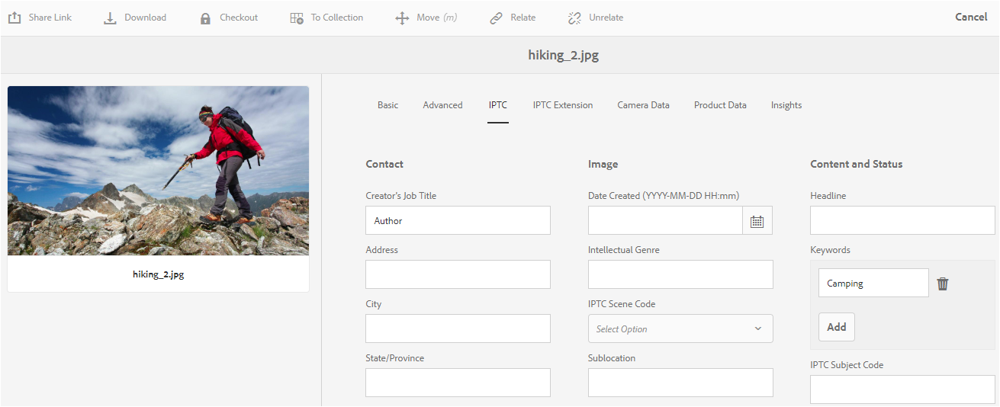

# Metagegevensconcepten begrijpen {#why-we-need-metadata}

Metagegevens zijn gegevens over gegevens. In dit verband verwijzen gegevens naar uw digitale middel, bijvoorbeeld een afbeelding. Metagegevens zijn essentieel voor efficiënt middelenbeheer.

Metagegevens zijn de verzameling van alle gegevens die beschikbaar zijn voor een element, maar die niet noodzakelijkerwijs in die afbeelding voorkomen. Voorbeelden van metagegevens zijn:

* Naam van het element.
* Tijdstip en datum van laatste wijziging.
* Grootte van het middel zoals het in de bewaarplaats werd opgeslagen.
* Naam van de map waarin deze zich bevindt.
* Gerelateerde elementen of toegepaste tags.

Het bovenstaande zijn de basiseigenschappen van metagegevens die voor elementen [!DNL Experience Manager] kunnen worden beheerd, zodat gebruikers alle elementen kunnen zien. Het is bijvoorbeeld handig elementen te bestellen op de laatste wijzigingsdatum wanneer u onlangs toegevoegde elementen probeert te vinden.

U kunt meer gegevens op hoog niveau toevoegen aan digitale elementen, bijvoorbeeld:

* Type element (is het een afbeelding, video, audioclip of document?).
* Eigenaar van het actief.
* Titel van het element.
* Beschrijving van het actief.
* Tags die aan een element zijn toegewezen.

Met meer metagegevens kunt u elementen verder indelen. Dit is handig wanneer de hoeveelheid digitale informatie toeneemt. Het is mogelijk om een paar honderd bestanden te beheren op basis van alleen de bestandsnamen. Deze aanpak is echter niet schaalbaar. Het is te kort wanneer het aantal betrokkenen en het aantal beheerde activa toenemen.

Als er metagegevens worden toegevoegd, neemt de waarde van een digitaal element toe, omdat het element

* Toegankelijker - systemen en gebruikers kunnen het gemakkelijk vinden.
* Gemakkelijker te beheren - u kunt gemakkelijker middelen met de zelfde reeks eigenschappen vinden en veranderingen op hen toepassen.
* Volledig - asset bevat meer informatie en context met meer metagegevens.

Daarom [!DNL Assets] beschikt u over de juiste middelen om metagegevens voor uw digitale elementen te maken, te beheren en uit te wisselen.

## Typen metagegevens {#types-of-metadata}

De twee basistypen metagegevens zijn technische metagegevens en beschrijvende metagegevens.

Technische metagegevens zijn handig voor softwaretoepassingen die werken met digitale elementen en mogen niet handmatig worden onderhouden. [!DNL Experience Manager Assets] en andere software bepalen automatisch de technische metagegevens en de metagegevens kunnen veranderen wanneer het element wordt gewijzigd. De beschikbare technische metagegevens van een element zijn grotendeels afhankelijk van het bestandstype van het element. Voorbeelden van technische metagegevens zijn:

* Grootte van een bestand.
* Dimension (hoogte en breedte) van een afbeelding.
* Bitsnelheid van een audio- of videobestand.
* Resolutie (detailniveau) van een afbeelding.

De beschrijvende meta-gegevens zijn meta-gegevens betrokken bij het toepassingsdomein, bijvoorbeeld, de zaken die een activa uit komt. Metagegevens met een beschrijving kunnen niet automatisch worden bepaald. Deze wordt handmatig of halfautomatisch gemaakt. Een camera met GPS-functionaliteit kan bijvoorbeeld automatisch de breedte en lengte bijhouden en geotaggen aan de afbeelding toevoegen.

De kosten voor het handmatig maken van beschrijvende metagegevens zijn hoog. Er worden dus standaarden ingesteld om de uitwisseling van metagegevens tussen softwaresystemen en organisaties te vergemakkelijken. [!DNL Experience Manager Assets] ondersteunt alle relevante normen voor metagegevensbeheer.

## Coderingsnormen {#encoding-standards}

Er zijn verschillende manieren om metagegevens in bestanden in te sluiten. Een selectie coderingsstandaarden wordt ondersteund:

* XMP: worden gebruikt door [!DNL Assets] de geëxtraheerde metagegevens op te slaan in de opslagplaats.
* ID3: voor audio- en videobestanden.
* EXIF: voor afbeeldingsbestanden.
* Overige/Verouderd: van [!DNL Microsoft Word], [!DNL PowerPoint], [!DNL Excel]enzovoort.

### XMP {#xmp}

[!DNL Extensible Metadata Platform] (XMP) is een open standaard die door [!DNL Experience Manager Assets] voor al meta-gegevensbeheer wordt gebruikt. De standaard biedt universele metagegevenscodering die in alle bestandsindelingen kan worden ingesloten. Adobe en andere bedrijven ondersteunen XMP standaard omdat deze een Rich Content-model biedt. Gebruikers van XMP standaard en van [!DNL Experience Manager Assets] een krachtig platform om op te bouwen. For more information, see [XMP](https://www.adobe.com/products/xmp.html).

### ID3 {#id}

Gegevens die in deze ID3-tags zijn opgeslagen, worden weergegeven wanneer u een digitaal audiobestand afspeelt op uw computer of op een draagbare MP3-speler.

ID3-tags zijn ontworpen voor de MP3-bestandsindeling. Aanvullende informatie over indelingen:

* ID3-tags werken in MP3- en MP3PRO-bestanden.
* WAV heeft geen tags.
* WMA heeft merkgebonden markeringen die open-bronimplementatie niet toestaan.
* Ogg Vorbis gebruikt Xiph-opmerkingen die zijn ingesloten in de Ogg-container.
* AAC gebruikt een merkgebonden etiketteringsformaat.

### Exif {#exif}

Exchangeable image file format (Exif) is de meest gebruikte metagegevensindeling voor digitale fotografie. Hiermee kunt u een vaste woordenlijst met metagegevenseigenschappen insluiten in vele bestandsindelingen, zoals JPEG, TIFF, RIFF en WAV. In Exif worden metagegevens opgeslagen als paren van een metagegevensnaam en een metagegevenswaarde. Deze naam-waarde-paren voor metagegevens worden ook wel tags genoemd, maar mogen niet worden verward met de tags in [!DNL Experience Manager]. Moderne digitale camera&#39;s maken Exif-metagegevens en de moderne grafische software ondersteunt deze. De EXIF-indeling is de kleinste gemene deler voor het beheer van metagegevens, met name voor afbeeldingen.

Een belangrijke beperking van Exif is dat een aantal populaire indelingen voor afbeeldingsbestanden, zoals BMP, GIF of PNG, dit niet ondersteunen.

Metagegevensvelden die door EXIF worden gedefinieerd, zijn doorgaans technisch van aard en worden slechts in beperkte mate gebruikt voor beschrijvend metagegevensbeheer. Om deze reden, [!DNL Experience Manager Assets] biedt afbeelding van eigenschappen Exif in [gemeenschappelijke meta-gegevensschema](metadata-schemas.md) en in [XMP](xmp-writeback.md)aan.

### Overige metagegevens {#other-metadata}

Andere metagegevens die kunnen worden ingesloten vanuit bestanden zijn onder andere [!DNL Microsoft Word], [!DNL PowerPoint], [!DNL Excel]enzovoort.

## Metagegevensschema&#39;s begrijpen {#metadata-schemata}

Metagegevensschema&#39;s zijn vooraf gedefinieerde sets definities van metagegevenseigenschappen die in verschillende toepassingen kunnen worden gebruikt. Eigenschappen worden altijd gekoppeld aan een element. Dit houdt in dat de eigenschappen &#39;over&#39; de bron zijn.

U kunt ook uw eigen metagegevensschema&#39;s ontwerpen als er geen schema&#39;s zijn die aan uw behoeften voldoen. Dupliceer bestaande informatie niet. Binnen een organisatie, maakt het scheiden van schema&#39;s het gemakkelijker om meta-gegevens te delen. [!DNL Experience Manager] biedt u een standaardlijst met de populairste metagegevensschema&#39;s. De lijst helpt u om uw meta-gegevensstrategie te springen en snel de meta-gegevenseigenschappen te kiezen die u nodig hebt.

De ondersteunde metagegevensschema&#39;s worden hieronder weergegeven.

### Standaardmetagegevens {#standard-metadata}

* DC - [!DNL Dublin Core] is een belangrijke en veelgebruikte reeks metagegevens.
* DICOM - Digital Imaging and Communications in Medicine.
* `Iptc4xmpCore` en `iptc4xmpExt` - International Press Communications Standard bevat veel onderwerpspecifieke metagegevens.
* RDF - Resource Description Framework - voor algemene semantische webmetagegevens.
* XMP - [!DNL Extensible Metadata Platform].
* `xmpBJ` - Basic Job Ticketing.

### Toepassingsspecifieke metagegevens {#application-specific-metadata}

De toepassingsspecifieke metagegevens bevatten technische en beschrijvende metagegevens. Als u dergelijke metagegevens gebruikt, kunnen andere toepassingen de metagegevens mogelijk niet gebruiken. Een andere toepassing voor het renderen van afbeeldingen heeft bijvoorbeeld mogelijk geen toegang tot [!DNL Adobe Photoshop] metagegevens. U kunt een workflowstap maken waarmee een toepassingsspecifieke eigenschap wordt gewijzigd in een standaardeigenschap.

* ACDSee - Metagegevens die door het [!DNL ACDSee] programma worden beheerd. Zie [www.acdsee.com/](https://www.acdsee.com/).
* Album - [!DNL Adobe Photoshop Album].
* CQ - Gebruikt door [!DNL Experience Manager Assets].
* DAM - Gebruikt door [!DNL Experience Manager Assets].
* DEX - [Optima SC Description Explorer](http://www.optimasc.com/products/dex/index.html) is een verzameling hulpmiddelen voor metagegevens en bestandsbeheer voor Windows-besturingssystemen.
* CRS - [Adobe Photoshop Camera Raw](https://helpx.adobe.com/camera-raw/using/introduction-camera-raw.html).
* LR - [!DNL Adobe Lightroom].
* MediaPro - [iView MediaPro](https://en.wikipedia.org/wiki/Phase_One_Media_Pro).
* MicrosoftPhoto en MP - Microsoft Photo.
* PDF en PDF/X.
* Photoshop en psAux - [!DNL Adobe Photoshop].

### DRM-metagegevens (Digital Rights Management) {#digital-rights-management-metadata}

* CC - [!DNL Creative Commons].
* [!DNL XMPRights].
* PLUS - [Picture Licensing Universal System](https://www.useplus.com).
* PRISM - [Publishing Requirements for Industry Standard Metadata](https://www.idealliance.org/prism-metadata).
* PRL - PRISM Rights Language.
* PUR - PRISM-gebruiksrechten.
* `xmpPlus` - integratie van PLUS met XMP.

### Specifieke metagegevens voor fotografie {#photography-specific-metadata}

* EXIF - Technische informatie van camera, inclusief GPS-positie.
* CRS - [!DNL Camera Raw] schema.
* `iptc4xmpCore` and `iptc4xmpExt`.
* TIFF - metagegevens van afbeeldingen (niet alleen voor TIFF-afbeeldingen).

### Afdrukspecifieke metagegevens {#print-specific-metadata}

* PDF en PDF/X - Adobe PDF en toepassingen van derden.
* PRISM - [Publishing Requirements for Industry Standard Metadata](https://www.idealliance.org/prism-metadata).
* XMP - [!DNL Extensible Metadata Platform].
* `xmpPG` - XMP metagegevens voor gepagineerde tekst.

### Multimediaspecifieke metagegevens {#multimedia-specific-metadata}

* `xmpDM` - [!DNL Dynamic Media].
* `xmpMM` - Mediabeheer.

## Referentie metagegevensschema {#metadata-schemata-reference}

De volgende naslaggids bevat informatie over een bepaald metagegevensschema (in alfabetische volgorde) en een lijst met eigenschappen en de bijbehorende definities.

### Dublin Core {#dublin-core}

De meta-gegevens van de Kern van Dublin verstrekt een gestandaardiseerde reeks overeenkomsten voor het beschrijven van activa om hen gemakkelijker te maken te vinden. In [!DNL Assets]de Dublin Core worden digitale elementen beschreven, zoals video, geluid, afbeeldingen en documenten.

De eenvoudige Dublin Core Metadata Element Set (DCMES) bevat 15 metagegevenselementen die in de volgende tabel worden vermeld. Elk Dublin Core-element is optioneel en kan worden herhaald. U kunt Dublin Core-metagegevens toevoegen of verwijderen op dezelfde manier als voor mediatype-specifieke metagegevens.

Naast het DCMES zijn er andere metagegevenselementen die door het Dublin Core-initiatief zijn gecreëerd. Zie het [Dublin Core-initiatief](https://dublincore.org/) voor meer informatie.

| Eigenschap | Beschrijving |
| ----------- | ------------------------------------------------------------------------------------------------------------------------ |
| contribuant | De persoon die of het bedrijf dat verantwoordelijk is voor het leveren van bijdragen aan de inhoud. |
| dekking | De geografische locatie of tijdsperiode waarop het actief betrekking heeft. |
| schepper | De persoon of het bedrijf die verantwoordelijk is voor het maken van de inhoud. |
| date | Datum of periode die aan het element is gekoppeld. |
| beschrijving | Meer informatie over het element. |
| format | De bestandsindeling, het fysieke medium of de afmetingen van het element. [!DNL Experience Manager] gebruikt `dc:format` om het MIME-type van het element aan te duiden. |
| id | Een unieke verwijzing naar het element. |
| language | De taal van het element (bijvoorbeeld en voor Engels). |
| uitgever | De persoon of het bedrijf die verantwoordelijk is voor het ter beschikking stellen van het actief. |
| relation | Een gerelateerd actief. |
| rechten | Informatie over wie de rechten op dit actief heeft. |
| source | Een gerelateerd actief waarvan het actief is afgeleid. |
| onderwerp | Het onderwerp van de activa. |
| title | Een naam voor het element. |
| type | De aard of het genre van het actief. |

### IPTC {#iptc}

De International Press Telecommunications Council (IPTC) is een consortium van nieuwsagentschappen over de hele wereld - een van de doelstellingen is het ontwikkelen en handhaven van technische normen. In de IPTC is een reeks standaarden voor fotometagegevens gedefinieerd voor afbeeldingen die vrijwel overal door fotografen worden geaccepteerd. Deze metagegevensstandaarden maakten deel uit van de bredere standaard die bekend staat als het IPTC Information Interchange Model (IIM) dat in de jaren negentig is gemaakt.

Hoewel de IPTC-headerinformatie meestal is vervangen door XMP, zijn een IPTC-kernschema en een extensieschema beschikbaar voor XMP. In afbeeldingsprogramma&#39;s worden zowel XMP- als IPTC-eigenschappen gesynchroniseerd.

## Workflows met metagegevens {#metadata-driven-workflows}

Door workflows te maken die op metagegevens zijn gebaseerd, kunt u bepaalde processen automatiseren, wat de efficiëntie ten goede komt. In een workflow met metagegevens leest het workflowbeheersysteem de workflow en wordt er dus een vooraf gedefinieerde actie uitgevoerd. U kunt bijvoorbeeld op een aantal manieren werkstromen gebruiken die zijn gebaseerd op metagegevens:

* De workflow kan controleren of een afbeelding een titel heeft of niet. Als dit niet het geval is, wordt een melding weergegeven om een titel toe te voegen.
* De workflow kan controleren of een copyrightkennisgeving op een middel distributie toestaat of niet. Het systeem verzendt het middel dus naar de ene of de andere server.
* Een workflow kan controleren op elementen zonder vooraf gedefinieerde, verplichte metagegevens of elementen met *ongeldige* metagegevens.

## XMP-metadata {#xmp-metadata}

XMP (Extensible Metadata Platform) is de metagegevensstandaard die wordt gebruikt [!DNL Adobe Experience Manager Assets] voor al het metagegevensbeheer. XMP biedt een standaardindeling voor het maken, verwerken en uitwisselen van metagegevens voor een groot aantal verschillende toepassingen.

Naast het aanbieden van universele meta-gegevenscodering die in alle dossierformaten kan worden ingebed, verstrekt XMP een rijk [inhoudsmodel](#xmp-core-concepts) en door Adobe [en andere bedrijven wordt](#advantages-of-xmp) gesteund, zodat de gebruikers van XMP in combinatie met [!DNL Assets] een krachtig platform om op te bouwen.

De [XMP specificatie](https://www.adobe.com/devnet/xmp.html) is beschikbaar bij Adobe.

### Wat is XMP? {#what-is-xmp}

Adobe introduceerde eerst de XMP standaard als onderdeel van het Adobe Acrobat-softwareproduct. Sindsdien is de XMP norm op grote schaal aangenomen. [!DNL Assets] native ondersteunt het XMP - het Extensible Metadata Platform dat wordt geleid door Adobe. XMP is een standaard voor het verwerken en opslaan van gestandaardiseerde en merkgebonden metagegevens in digitale elementen. XMP wordt ontworpen om de gemeenschappelijke norm te zijn die veelvoudige toepassingen toestaat om effectief met meta-gegevens te werken.

Productieprofessionals gebruiken bijvoorbeeld de ingebouwde XMP ondersteuning binnen toepassingen om informatie in meerdere indelingen door te geven. [!DNL Assets] opslagplaats extraheert de XMP metagegevens en gebruikt deze om de levenscyclus van de inhoud te beheren en biedt de mogelijkheid om automatiseringsworkflows te maken.

XMP standaardiseren hoe metagegevens worden gedefinieerd, gemaakt en verwerkt door een gegevensmodel, een opslagmodel en schema&#39;s op te geven. Al deze concepten worden behandeld in deze sectie.

Alle oudere meta-gegevens van EXIF, ID3, of Microsoft Office wordt automatisch vertaald aan XMP, die kan worden uitgebreid om klant-specifiek meta-gegevensschema, zoals productcatalogi te steunen.

Metagegevens in XMP bestaan uit een set eigenschappen. Deze eigenschappen worden altijd geassocieerd met een bepaalde entiteit die als middel wordt bedoeld; dat wil zeggen dat de eigenschappen &quot;over&quot; de bron zijn. In het geval van XMP is de bron altijd het middel.

### XMP ecosysteem {#xmp-ecosystem}

XMP definieert een [metadatamodel](https://nl.wikipedia.org/wiki/Metadata) dat kan worden gebruikt met elke gedefinieerde set metadataitems. XMP definieert ook bepaalde [schema&#39;s](https://nl.wikipedia.org/wiki/XML_schema) voor basiseigenschappen die nuttig zijn voor het opnemen van de geschiedenis van een resource tijdens het doorlopen van meerdere verwerkingsstappen, van het fotograferen, [scannen](https://en.wikipedia.org/wiki/Image_scanner) of ontwerpen als tekst, het doorlopen van fotobewerkingsstappen (zoals [bijsnijden](https://en.wikipedia.org/wiki/Cropping_%28image%29) of kleuraanpassing) tot het samenvoegen in een uiteindelijke afbeelding. Met XMP kan elk softwareprogramma of apparaat in de loop van de tijd zijn eigen informatie toevoegen aan een digitale resource, die vervolgens in het uiteindelijke digitale bestand kan worden bewaard.

XMP wordt doorgaans geserialiseerd en opgeslagen met behulp van een subset van het [W3C](https://nl.wikipedia.org/wiki/World_Wide_Web_Consortium) [Resource Description Framework](https://nl.wikipedia.org/wiki/Resource_Description_Framework) (RDF), dat op zijn beurt wordt uitgedrukt in [XML](https://nl.wikipedia.org/wiki/XML).

### Voordelen van XMP {#advantages-of-xmp}

XMP heeft de volgende voordelen ten opzichte van andere coderingsnormen en -schema&#39;s:

* Op XMP gebaseerde metagegevens zijn zeer krachtig en fijnkorrelig.
* Met XMP kunt u meerdere waarden voor één eigenschap hebben.
* XMP heeft gestandaardiseerde codering, waarmee u metagegevens eenvoudig kunt uitwisselen.
* XMP is uitbreidbaar. U kunt aanvullende informatie aan uw elementen toevoegen.

De XMP standaard is zo ontworpen dat deze uitbreidbaar is, zodat u aangepaste typen metagegevens kunt toevoegen aan de XMP. EXIF heeft daarentegen geen vaste lijst met eigenschappen die niet kunnen worden uitgebreid.

>[!NOTE]
>
>XMP staat over het algemeen niet binaire gegevenstypes toe om worden ingebed. Als u binaire gegevens wilt meenemen in XMP, bijvoorbeeld miniatuurafbeeldingen, moeten deze worden gecodeerd in een XML-vriendelijke indeling, zoals `Base64`.

### XMP {#xmp-core-concepts}

De volgende secties beschrijven de kernconcepten van XMP, met inbegrip van namespaces en schema&#39;s, eigenschappen en waarden, en taalalternatieven.

#### Naamruimten en schema&#39;s {#namespaces-and-schemata}

Een XMP schema is een reeks eigenschapnamen in een gemeenschappelijke XML-naamruimte die het gegevenstype en beschrijvende informatie bevat. Een XMP schema wordt geïdentificeerd door zijn XML namespace URI. Het gebruik van naamruimten voorkomt conflicten tussen eigenschappen in verschillende schema&#39;s die dezelfde naam maar een andere betekenis hebben.

De `Creator` eigenschap in twee onafhankelijk ontworpen schema&#39;s kan bijvoorbeeld de persoon zijn die het element heeft gemaakt of de toepassing die het element heeft gemaakt (bijvoorbeeld Adobe Photoshop).

#### Eigenschappen en waarden {#properties-and-values}

XMP kunnen eigenschappen van een of meer schema&#39;s omvatten. Een standaardsubset die door veel Adobe-toepassingen wordt gebruikt, kan bijvoorbeeld het volgende zijn:

* Dublin-kernschema: `dc:title`, `dc:creator`, `dc:subject`, `dc:format`, `dc:rights`.
* Basisschema XMP: `xmp:CreateDate`, `xmp:CreatorTool`, `xmp:ModifyDate`, `xmp:metadataDate`.
* Schema voor XMP rechtenbeheer: `xmpRights:WebStatement`, `xmpRights:Marked`.
* Schema voor mediabeheer XMP: `xmpMM:DocumentID`.

#### Taalalternatieven {#language-alternatives}

XMP kunt u een `xml:lang` eigenschap aan teksteigenschappen toevoegen om de taal van de tekst op te geven.

## Werken met IPTC-metagegevens {#support-for-iptc-metadata}

Leer hoe u de IPTC-metagegevens, creatieve beoordelingen en trefwoorden die aan middelen zijn toegevoegd via [!DNL Adobe Experience Manager Assets] en andere [!DNL Adobe Bridge] [!DNL Adobe Creative Cloud] apps, kunt ondersteunen.

[!DNL Adobe Experience Manager Assets] ondersteunt de IPTC-metagegevensstandaard die veel wordt gebruikt om elementen te beschrijven. Op deze manier [!DNL Assets] wordt de acceptatie van de afbeeldingen van de foto&#39;s tussen verschillende partijen verbeterd, zoals fotografen, creatieve bureaus, bibliotheken, musea, enzovoort.

In het standaardmetagegevensschema voor elementen zijn nu de IPTC Core- en IPTC-metagegevensschema&#39;s voor extensies opgenomen om uitgebreide metagegevenseigenschappen te definiëren waarmee gebruikers nauwkeurige en betrouwbare gegevens kunnen toevoegen over personen, locaties en producten die in een afbeelding worden weergegeven. Het steunt ook data, namen, en herkenningstekens betreffende de verwezenlijking van het beeld, en een flexibele manier om rechteninformatie uit te drukken.

De pagina Eigenschappen voor elementen bevat nu aparte tabbladen waarmee de metagegevens voor IPTC Core- en IPTC-extensies in bewerkbare velden worden weergegeven.

1. Selecteer een afbeelding in de [!DNL Assets] gebruikersinterface.
1. Klik op **[!UICONTROL Properties]** op de werkbalk.
1. Click the **[!UICONTROL IPTC]** tab to view the IPTC metadata for the asset.
1. Bewerk desgewenst de IPTC-metagegevenseigenschappen.

   

1. Click the **[!UICONTROL IPTC Extension]** tab to view IPTC Extension metadata for the asset.
1. Bewerk desgewenst de eigenschappen van de IPTC-metagegevens voor extensies.
1. Click **[!UICONTROL Save & Close]** to save the changes.

### Ondersteuning voor creatieve beoordelingen {#creative-rating-support}

Naast het weergeven van individuele gebruikersbeoordelingen en het verzamelen van classificaties, wordt op de pagina Eigenschappen nu de classificaties weergegeven die via Adobe Bridge en andere Creative Apps zijn toegewezen aan elementen

Deze classificaties zijn beschikbaar onder de sectie **[!UICONTROL Creative Rating]** op het tabblad **[!UICONTROL Advanced]**.

Deze classificatie is een alleen-lezen eigenschap en ligt tussen 1 en 5. In het deelvenster Zoeken kunt u zoeken naar elementen op basis van hun creatieve waardering.

Deze eigenschap is momenteel echter niet geïndexeerd om conflicten met aangepaste wijzigingen door gebruikers te voorkomen.

### Trefwoordondersteuning {#keyword-support}

Op het **[!UICONTROL IPTC]** tabblad van de [!UICONTROL Properties] pagina worden ook trefwoorden weergegeven die via Adobe Bridge en andere Adobe Creative Cloud-toepassingen aan middelen zijn toegevoegd. U kunt deze trefwoorden ook bewerken en meer trefwoorden toevoegen vanaf het **[!UICONTROL IPTC]** tabblad.

