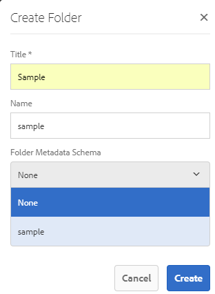

# Configuratie en beheer van metagegevensfunctionaliteit in [!DNL Assets] {#config-metadata}

<!-- Scope of metadata articles:
* metadata.md: The scope of this article is basic metadata updates, changes, etc. operations that end-users can do.
* metadata-concepts.md: All conceptual information. Minor instructions are OK but it is an FYI article about support and standards.
* metadata-config.md: New article. Contains all configuration and administration how-to info related to metadata of assets.
-->

[!DNL Adobe Experience Manager Assets] bewaart meta-gegevens voor elk middel. Het maakt het gemakkelijker om activa te categoriseren en te organiseren en het helpt mensen die naar een specifiek bezit zoeken. Met de mogelijkheid om metagegevens bij uw elementen te houden en te beheren, kunt u elementen automatisch ordenen en verwerken op basis van hun metagegevens. [!DNL Adobe Experience Manager Assets] Hiermee kunnen beheerders de functionaliteit van metagegevens configureren en aanpassen om het standaard Adobe-aanbod te wijzigen.

## Metagegevensschema {#metadata-schema} bewerken

Zie [Schema-formulieren voor metagegevens bewerken](metadata-schemas.md#edit-metadata-schema-forms) voor meer informatie.

## Een aangepaste naamruimte registreren binnen [!DNL Experience Manager] {#registering-a-custom-namespace-within-aem}

U kunt uw eigen naamruimten toevoegen binnen [!DNL Experience Manager]. Net zoals er vooraf gedefinieerde naamruimten zijn, zoals `cq`, `jcr` en `sling`, kunt u een naamruimte hebben voor de metagegevens van de gegevensopslagruimte en de verwerking van XML.

1. Heb toegang tot de knoop type beleidspagina `https://[aem_server]:[port]/crx/explorer/nodetypes/index.jsp`.
1. Als u de pagina voor naamruimtebeheer wilt openen, klikt u op **[!UICONTROL Namespaces]** boven aan de pagina.
1. Als u een naamruimte wilt toevoegen, klikt u op **[!UICONTROL New]** onder aan de pagina.
1. Geef een aangepaste naamruimte op in de XML-naamruimteconventie. Geef de id op in de vorm van een URI en een bijbehorend voorvoegsel voor de id. Klik op **[!UICONTROL Save]**.

## Limieten configureren voor updates van bulkmetagegevens {#bulk-metadata-update-limit}

Om een ontkenning van de dienst (DOS) als situatie te verhinderen, [!DNL Enterprise Manager] beperkt het aantal parameters die in een Verschuivend verzoek worden gesteund. Wanneer u metagegevens van veel elementen in één keer bijwerkt, kunt u de limiet bereiken en worden de metagegevens niet bijgewerkt voor meer elementen. Enterprise Manager genereert de volgende waarschuwing in de logboeken:

`org.apache.sling.engine.impl.parameters.Util Too many name/value pairs, stopped processing after 10000 entries`

Als u de limiet wilt wijzigen, opent u **[!UICONTROL Tools]** > **[!UICONTROL Operations]** > **[!UICONTROL Web Console]** en wijzigt u de waarde van **[!UICONTROL Maximum POST Parameters]** in **[!UICONTROL Apache Sling Request Parameter Handling]** OSGi-configuratie.

## Metadataprofielen {#metadata-profiles}

Met een metagegevensprofiel kunt u standaardmetagegevens toepassen op elementen in een map. Maak een metagegevensprofiel en pas dit toe op een map. Elk element dat u daarna naar de map uploadt, overerft de standaardmetagegevens die u in het metagegevensprofiel hebt geconfigureerd.

### Een metagegevensprofiel {#adding-a-metadata-profile} toevoegen

1. Navigeer naar **[!UICONTROL Tools]** > **[!UICONTROL Assets]** > **[!UICONTROL Metadata Profiles]** en klik **[!UICONTROL Create]**.
1. Voer een titel voor het profiel in, bijvoorbeeld `Sample Metadata`, en klik op **[!UICONTROL Create]**. De [!UICONTROL Edit Form] voor het metagegevensprofiel wordt weergegeven.

   

1. Klik op een component en configureer de eigenschappen ervan op het tabblad **[!UICONTROL Settings]**. Klik bijvoorbeeld op de component **[!UICONTROL Description]** en bewerk de eigenschappen ervan.

   

   Bewerk de volgende eigenschappen voor de component **[!UICONTROL Description]**:

   * **[!UICONTROL Field Label]**: De weergavenaam van de eigenschap metadata. Dit is alleen voor de gebruikersverwijzing.

   * **[!UICONTROL Map to Property]**: De waarde van deze eigenschap geeft het relatieve pad of de naam naar het knooppunt met middelen waar het wordt opgeslagen in de opslagplaats. De waarde moet altijd beginnen met `./` omdat dit aangeeft dat het pad zich onder het knooppunt van het element bevindt.

   

   De waarde die u opgeeft voor **[!UICONTROL Map to property]**, wordt opgeslagen als een eigenschap onder het metagegevensknooppunt van het element. Als u bijvoorbeeld `./jcr:content/metadata/dc:desc` opgeeft als naam van **[!UICONTROL Map to property]**, slaat [!DNL Assets] de waarde `dc:desc` op in het metagegevensknooppunt van het element.

   * **[!UICONTROL Default Value]**: Gebruik deze eigenschap om een standaardwaarde voor de metagegevenscomponent toe te voegen. Als u bijvoorbeeld &quot;Mijn beschrijving&quot; opgeeft, wordt deze waarde toegewezen aan de eigenschap `dc:desc` bij het metagegevensknooppunt van het element.

   

   >[!NOTE]
   >
   >Een standaardwaarde toevoegen aan een nieuwe metagegevenseigenschap (die nog niet bestaat op het tabblad . `/jcr:content/metadata` node) geeft de eigenschap en de waarde ervan standaard niet weer op de pagina Eigenschappen van het element. Als u de nieuwe eigenschap wilt weergeven op de pagina [!UICONTROL Properties] van de elementen, wijzigt u het corresponderende schema.

1. (Optioneel) Voeg op het tabblad **[!UICONTROL Build Form]** meer componenten toe aan het formulier Bewerken en configureer de eigenschappen ervan op het tabblad **[!UICONTROL Settings]**. De volgende eigenschappen zijn beschikbaar op het tabblad **[!UICONTROL Build Form]**:

| Component | Eigenschappen |
| ----------------------------- | ----------------------------------------------------------------------- |
| [!UICONTROL Section Header] | Veld Label, beschrijving   |
| [!UICONTROL Single Line Text] | Veld Label,   Toewijzen aan eigenschap,   Standaardwaarde |
| [!UICONTROL Multi Value Text] | Veld Label,   Toewijzen aan eigenschap,   Standaardwaarde |
| [!UICONTROL Number] | Veld Label,   Toewijzen aan eigenschap,   Standaardwaarde |
| [!UICONTROL Date] | Veld Label,   Toewijzen aan eigenschap,   Standaardwaarde |
| [!UICONTROL Standard Tags] | Veld Label,   Toewijzen aan eigenschap,   Standaardwaarde,   Beschrijving |

1. Klik op **[!UICONTROL Done]**. Het metagegevensprofiel wordt toegevoegd aan de lijst met profielen op de pagina **[!UICONTROL Metadata Profiles]**. 

   

### Een metagegevensprofiel {#copying-a-metadata-profile} kopiëren

1. Selecteer op de pagina **[!UICONTROL Metadata Profiles]** een metagegevensprofiel om er een kopie van te maken.

   

1. Klik op **[!UICONTROL Copy]** op de werkbalk.
1. Voer in het dialoogvenster **[!UICONTROL Copy Metadata Profile]** een titel in voor de nieuwe kopie van het metagegevensprofiel.
1. Klik op **[!UICONTROL Copy]**. De kopie van het metadataprofiel wordt weergegeven in de lijst met profielen op de pagina **[!UICONTROL Metadata Profiles]**.

   

### Een metagegevensprofiel {#deleting-a-metadata-profile} verwijderen

1. Selecteer op de pagina **[!UICONTROL Metadata Profiles]** een profiel dat u wilt verwijderen.

1. Klik op **[!UICONTROL Delete Metadata Profiles]** op de werkbalk.
1. Klik in het dialoogvenster op **[!UICONTROL Delete]** om de verwijderbewerking te bevestigen. Het metagegevensprofiel wordt uit de lijst verwijderd.

<!-- TBD: Revisit to find out the correct config. and update these steps. When fixed, also o
These steps have been carried forward from old AEM versions. See https://helpx.adobe.com/experience-manager/6-2/assets/using/metadata-profiles.html#ApplyingaMetadataProfiletoFolders

### Configuration to apply a metadata profile globally {#apply-a-metadata-profile-globally}

In addition to applying a profile to a folder, you can also apply one globally so that any content uploaded into [!DNL Experience Manager] assets in any folder has the selected profile applied.

You can reprocess assets in a folder that already has an existing metadata profile that you later changed. See [Reprocessing assets in a folder after you have edited its processing profile](processing-profiles.md#reprocessing-assets).

To apply a metadata profile globally, follow these steps:

* Navigate to `https://[aem_server]:[port]/mnt/overlay/dam/gui/content/assets/foldersharewizard.html/content/dam` and apply the appropriate profile and click **[!UICONTROL Save]**.

  

* In CRXDE Lite, navigate to the following node: `/content/dam/jcr:content`. Add the property `metadataProfile:/etc/dam/metadata/dynamicmedia/<name of metadata profile>` and click **[!UICONTROL Save All]**.

  
-->

## Metagegevensschema voor een map {#folder-metadata-schema}

[!DNL Adobe Experience Manager Assets] Hiermee kunt u metagegevensschema&#39;s maken voor middelenmappen, waarmee de lay-out en de metagegevens worden gedefinieerd die op pagina&#39;s met mapeigenschappen worden weergegeven.

### Een schema voor metagegevens van een map toevoegen {#add-a-folder-metadata-schema-form}

Met de Forms-editor voor het schema Metagegevens van map kunt u metagegevensschema&#39;s voor mappen maken en bewerken.

1. Ga in [!DNL Experience Manager] interface naar **[!UICONTROL Tools]** > **[!UICONTROL Assets]** > **[!UICONTROL Folder Metadata Schemas]**.
1. Ga naar de pagina [!UICONTROL Folder Metadata Schema Forms] en klik op **[!UICONTROL Create]**.
1. Geef een naam voor het formulier op en klik op **[!UICONTROL Create]**. Het nieuwe schema formulier wordt weergegeven op de pagina [!UICONTROL Schema Forms].

### Schema-formulieren voor mapmetagegevens bewerken {#edit-folder-metadata-schema-forms}

U kunt een nieuw toegevoegd of bestaand schema voor metagegevens bewerken, dat het volgende bevat:

* Tabs
* Formulieritems in tabbladen.

U kunt deze formulieritems toewijzen/configureren aan een veld binnen een metagegevensknooppunt in de CRX-opslagruimte. U kunt nieuwe tabbladen of formulieritems toevoegen aan het metagegevensschemaformulier.

1. Selecteer op de pagina Schema Forms het formulier dat u hebt gemaakt en selecteer vervolgens de optie **[!UICONTROL Edit]** op de werkbalk.
1. Klik op `+` in de pagina Editor van de metagegevensschema-editor voor de map om een tabblad aan het formulier toe te voegen. Als u de naam van het tabblad wilt wijzigen, klikt u op de standaardnaam en geeft u de nieuwe naam op onder **[!UICONTROL Settings]**.

   

   Als u meer tabbladen wilt toevoegen, klikt u op `+`. Klik `X` op een lusje om het te schrappen.

1. Voeg op het actieve tabblad een of meer componenten toe vanaf het tabblad **[!UICONTROL Build Form]**.

   

   Als u meerdere tabbladen maakt, klikt u op een bepaald tabblad om componenten toe te voegen.

1. Als u een component wilt configureren, selecteert u deze en wijzigt u de eigenschappen ervan op het tabblad **[!UICONTROL Settings]**.

   Verwijder zo nodig een component van het tabblad **[!UICONTROL Settings]**.

   

1. Klik **[!UICONTROL Save]** van de toolbar om de veranderingen te bewaren.

#### Componenten voor het samenstellen van formulieren {#components-to-build-forms}

Het tabblad **[!UICONTROL Build Form]** bevat formulieritems die u in het schema voor metagegevens van uw map gebruikt. Het **[!UICONTROL Settings]** lusje toont de attributen voor elk punt dat u op **[!UICONTROL Build Form]** tabel selecteert. Hier volgt een lijst met formulieritems die beschikbaar zijn op het tabblad **[!UICONTROL Build Form]**:

| Componentnaam | Beschrijving |
|---|---|
| [!UICONTROL Section Header] | Voeg een sectiekopje toe voor een lijst met gangbare componenten. |
| [!UICONTROL Single Line Text] | Voeg een teksteigenschap voor één regel toe. De eigenschap wordt opgeslagen als een tekenreeks. |
| [!UICONTROL Multi Value Text] | Voeg een teksteigenschap voor meerdere waarden toe. Deze wordt opgeslagen als een tekenreeks-array. |
| [!UICONTROL Number] | Voeg een getalcomponent toe. |
| [!UICONTROL Date] | Voeg een datumcomponent toe. |
| [!UICONTROL Dropdown] | Voeg een vervolgkeuzelijst toe. |
| [!UICONTROL Standard Tags] | Voeg een tag toe. |
| [!UICONTROL Hidden Field] | Voeg een verborgen veld toe. Deze wordt als een POST-parameter verzonden wanneer het element wordt opgeslagen. |

#### Formulieritems bewerken {#editing-form-items}

Als u de eigenschappen van formulieritems wilt bewerken, klikt u op de component en bewerkt u alle of een subset van de volgende eigenschappen op het tabblad **[!UICONTROL Settings]**.

**[!UICONTROL Field Label]**: De naam van de eigenschap metadata die wordt weergegeven op de eigenschappenpagina voor de map.

**[!UICONTROL Map to Property]**: This property specifies the relative path of the folder node in the CRX repository where it is saved. Het begint met &quot;**./**&quot;, wat aangeeft dat het pad zich onder het knooppunt van de map bevindt.

Hier volgen de geldige waarden voor deze eigenschap:

* `./jcr:content/metadata/dc:title`: Hiermee wordt de waarde in het metagegevensknooppunt van de map opgeslagen als de eigenschap  `dc:title`.

* `./jcr:created`: Geeft de JCR-eigenschap op het knooppunt van de map weer. Als u deze eigenschappen in CRXDE vormt, adviseert Adobe dat u hen als onbruikbaar maakt uitgeeft markeert, omdat zij beschermd zijn. Anders treedt de fout &#39; `Asset(s) failed to modify`&#39; op wanneer u de eigenschappen van het element opslaat.

Neem geen spatie op in het eigenschapspad om ervoor te zorgen dat de component correct wordt weergegeven in het schema voor metagegevens.

**[!UICONTROL JSON Path]**: Gebruik deze optie om het pad van het JSON-bestand op te geven waarin u sleutelwaardeparen voor opties opgeeft.

**[!UICONTROL Placeholder]**: Gebruik deze eigenschap om relevante plaatsaanduidingstekst met betrekking tot de eigenschap metadata op te geven.

**[!UICONTROL Choices]**: Gebruik deze eigenschap om keuzen in een lijst op te geven.

**[!UICONTROL Description]**: Gebruik deze eigenschap om een korte beschrijving toe te voegen voor de metagegevenscomponent.

**[!UICONTROL Class]**: Objectklasse waaraan de eigenschap is gekoppeld.

### Schema-formulieren {#delete-folder-metadata-schema-forms} voor mapmetagegevens verwijderen

U kunt de schemaformulieren van de omslagmeta-gegevens van het Schema Forms van de Meta-gegevens van de Omslag schrappen pagina. Als u een formulier wilt verwijderen, selecteert u het formulier en klikt u op de werkbalk op de optie Verwijderen.

### Schema {#assign-a-folder-metadata-schema} voor metagegevens van mappen toewijzen

U kunt een schema van omslagmeta-gegevens aan een omslag of van de pagina van Forms van het Schema van Meta-gegevens van de Omslag toewijzen of wanneer het creëren van een omslag.

Als u een metagegevensschema voor een map configureert, wordt het pad naar het schemaformulier opgeslagen in de eigenschap `folderMetadataSchema` van het mapknooppunt onder `./jcr:content`.

#### Wijs aan een schema van de pagina {#assign-to-a-schema-from-the-folder-metadata-schema-page} van het Schema van Meta-gegevens van de Omslag toe

1. Ga in [!DNL Experience Manager] interface naar **[!UICONTROL Tools]** > **[!UICONTROL Assets]** > **[!UICONTROL Folder Metadata Schemas]**.
1. Selecteer op de pagina Forms van het schema Metagegevens map het schema dat u op een map wilt toepassen.
1. Klik **[!UICONTROL Apply to Folder(s)]** op de werkbalk.

1. Selecteer de map waarop u het schema wilt toepassen en klik op **[!UICONTROL Apply]**. Als er al een metagegevensschema op de map is toegepast, verschijnt er een waarschuwingsbericht dat u het bestaande metagegevensschema wilt overschrijven. Klik op **[!UICONTROL Overwrite]**.
1. Open de eigenschappen van de metagegevens voor de map waarop u het metagegevensschema hebt toegepast.

   

   Klik op het tabblad **[!UICONTROL Folder Metadata]** om de velden met metagegevens van mappen weer te geven.

   

#### Schema toewijzen bij het maken van een map {#assign-a-schema-when-creating-a-folder}

U kunt een schema van omslagmeta-gegevens toewijzen wanneer het creëren van een omslag. Als het systeem minstens één schema van omslagmeta-gegevens bevat, wordt een extra lijst getoond in **[!UICONTROL Create Folder]** dialoog. U kunt het gewenste schema selecteren. Standaard is geen schema geselecteerd.

1. Klik in de gebruikersinterface [!DNL Experience Manager Assets] op **[!UICONTROL Create]** op de werkbalk.
1. Geef een titel en naam voor de map op.
1. Selecteer het gewenste schema in de lijst Metagegevensschema van map. Klik vervolgens op **[!UICONTROL Create]**.

   

1. Open de eigenschappen van de metagegevens voor de map waarop u het metagegevensschema hebt toegepast.
1. Klik op het tabblad **[!UICONTROL Folder Metadata]** om de velden met metagegevens van mappen weer te geven.

### Het schema {#use-the-folder-metadata-schema} voor metagegevens van de map gebruiken

Open de eigenschappen voor een map die met een mapmetadataschema is geconfigureerd. Het tabblad **[!UICONTROL Folder Metadata]** wordt weergegeven in de map [!UICONTROL Properties] pagina. Selecteer dit tabblad om het formulier van het mapmetadataschema weer te geven.

Voer waarden voor metagegevens in de verschillende velden in en klik op **[!UICONTROL Save]** om de waarden op te slaan. De waarden die u opgeeft, worden opgeslagen in het mapknooppunt in de CRX-opslagruimte.

## Tips en beperkingen {#best-practices-limitations}

* Registreer de naamruimten eerst om metagegevens in aangepaste naamruimten te importeren.
* De eigenschappenkiezer geeft eigenschappen weer die in schema-editors en zoekformulieren worden gebruikt. Eigenschapkiezer kiest geen eigenschappen voor metagegevens uit een element.
* U hebt mogelijk al bestaande metagegevensprofielen sinds de upgrade naar [!DNL Experience Manager] 6.5. Als u na de upgrade een dergelijk profiel toepast in de map [!UICONTROL Properties] op het tabblad [!UICONTROL Metadata Profiles], worden de formuliervelden voor metagegevens niet weergegeven. Als u echter een nieuw metagegevensprofiel toepast, worden de formuliervelden weergegeven, maar niet beschikbaar zoals u had verwacht. Er gaat geen functionaliteit verloren, maar als u de (niet-beschikbare) formuliervelden wilt zien, bewerkt en slaat u de bestaande metagegevensprofielen op.

>[!MORELIKETHIS]
>
>* [Metagegevensconcepten en begrip](metadata-concepts.md).
>* [Eigenschappen van metagegevens van meerdere verzamelingen](manage-collections.md#editing-collection-metadata-in-bulk) bewerken.
>* [Metagegevens importeren en exporteren in Experience Manager Assets](https://experienceleague.adobe.com/docs/experience-manager-learn/assets/metadata/metadata-import-feature-video-use.html).
>* [Profielen voor het verwerken van metagegevens, afbeeldingen en video](processing-profiles.md)&#39;s.
>* [Aanbevolen procedures voor het ordenen van uw digitale elementen voor het gebruik van verwerkingsprofielen](/help/assets/organize-assets.md).
>* [XMP terugschrijven](/help/assets/xmp-writeback.md).

