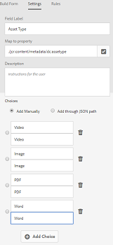
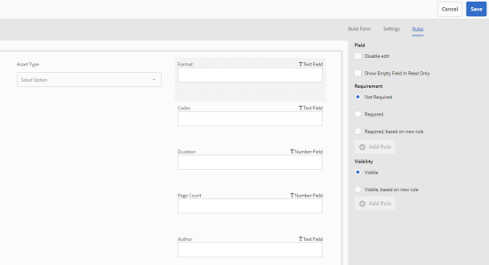

# Metadata schemas {#metadata-schemas}

Organisaties beschikken over een metagegevensmodel dat de detectie, het gebruik, de interoperabiliteit, enzovoort van middelen verbetert. Correcte toepassing van metagegevens is onaantastbaar voor het onderhouden van workflows en processen die zijn gebaseerd op metagegevens. Om aan organisatie-brede meta-gegevensstrategie en normen te houden, kunt u meta-gegevensschema&#39;s gebruiken die gebruikers DAM helpen zich te richten. [!DNL Adobe Experience Manager] biedt eenvoudige en flexibele methoden voor het maken, onderhouden en toepassen van metagegevensschema&#39;s.

In [!DNL Adobe Experience Manager Assets]de schema&#39;s staan specifieke velden waarin specifieke informatie moet worden ingevuld. Het bevat ook lay-outinformatie om meta-gegevensgebieden op een gebruikersvriendelijke manier te tonen. Metagegevenseigenschappen zijn onder andere titel, beschrijving, MIME-typen, tags en meer. U kunt de [!UICONTROL Metadata Schema Forms] redacteur gebruiken om de bestaande schema&#39;s te wijzigen of de schema&#39;s van douanemetagegevens toe te voegen.

Ga als volgt te werk om de pagina met eigenschappen voor een element weer te geven en te bewerken:

1. Klik op de **[!UICONTROL View Properties]** optie van de snelle acties op het element Elementen in de kaartweergave. U kunt ook een element selecteren en vervolgens op de werkbalk op de **[!UICONTROL Properties]** weergave-eigenschappen  klikken.

1. U kunt de verschillende bewerkbare eigenschappen van metagegevens bewerken onder de beschikbare tabbladen. U kunt het element echter niet wijzigen [!UICONTROL Type] op het [!UICONTROL Basic] tabblad Eigenschappen.

   

*Afbeelding: Het tabblad Standaard voor elementen[!UICONTROL Properties].*

Als u het MIME-type voor een element wilt wijzigen, gebruikt u een aangepast schema voor metagegevens of wijzigt u een bestaand formulier. Zie Metagegevensschema [bewerken Forms](/help/assets/metadata-schemas.md#edit-metadata-schema-forms) voor meer informatie. Als u het metagegevensschema van een MIME-type wijzigt, wordt de indeling van de eigenschappenpagina voor de elementen en alle subtypen gewijzigd. Als u bijvoorbeeld een JPEG-schema wijzigt onder, wordt de indeling van metagegevens (eigenschappen van elementen) `default/image` alleen gewijzigd voor elementen met het MIME-type `image/jpeg`. Als u echter het standaardschema bewerkt, worden de wijzigingen doorgevoerd in de indeling van de metagegevens voor alle typen elementen.

## Metagegevensschema-formulieren {#default-metadata-schema-forms}

Als u een lijst met formulieren of sjablonen wilt weergeven, navigeert u in de [!DNL Experience Manager] interface naar **[!UICONTROL Tools]** > **[!UICONTROL Assets]** > **[!UICONTROL Metadata Schemas]**.

[!DNL Experience Manager] Hier vindt u de volgende sjablonen voor metagegevensschema-formulieren.

| Sjablonen |  | Beschrijving |
|---|---|---|
| [!UICONTROL default] |  | Het basisschema voor metagegevens voor elementen. |
|  | De volgende onderliggende formulieren nemen de eigenschappen van het [!UICONTROL default] formulier over: |  |
|  | <ul><li>[!UICONTROL dm_video]</li></ul> | Schemaformulier voor Dynamic Media-video&#39;s. |
|  | <ul><li>[!UICONTROL image]</li></ul> | Schema-formulier voor afbeeldingen van het MIME-type, zoals `image/jpeg` en `image/png`.   Het [!UICONTROL image] formulier heeft de volgende onderliggende formuliersjablonen: <ul><li> [!UICONTROL jpeg]: Schema voor activa met subtype [!UICONTROL jpeg].</li> <li>[!UICONTROL tiff]: Schema voor de elementen met subtype TIFF.</li></ul> |
|  | <ul><li>[!UICONTROL application]</li></ul> | Schema-formulier voor elementen met het MIME-type zoals `application/pdf` en `application/zip`.  [!UICONTROL pdf]: Schemaformulier voor elementen met subtype PDF. |
|  | <ul><li>[!UICONTROL video]</li></ul> | Schemaformulier voor video-elementen met het MIME-type, zoals `video/avi` en `video/mp4`. |
| [!UICONTROL collection] |  | Schemaformulier voor verzamelingen. |
| [!UICONTROL contentfragment] |  | [Schemaformulier voor inhoudsfragmenten](/help/sites-developing/customizing-content-fragments.md). |
| [!UICONTROL forms] |  | Dit schema-formulier heeft betrekking op [Adobe Experience Manager Forms](/help/forms/home.md). |
| [!UICONTROL ugc_contentfragment] |  | Schemaformulier voor door de gebruiker gegenereerde inhoudsonderdelen en elementen die via sociale media in de Experience Manager zijn geïntegreerd. |

>[!NOTE]
>
>Klik op de naam van het schema om de onderliggende formulieren van een schema weer te geven.

## Een metagegevensschema toevoegen {#add-a-metadata-schema-form}

Ga als volgt te werk om een metagegevensschemaformulier toe te voegen:

1. Als u een aangepaste sjabloon aan de lijst wilt toevoegen, klikt u op **[!UICONTROL Create]** de werkbalk.

   >[!NOTE]
   >
   >Er wordt een vergrendelingssymbool weergegeven met de onbewerkte sjablonen. Als u een sjabloon aanpast, wordt de sjabloon niet vergrendeld en .

1. Geef in het dialoogvenster de titel van het schema op en klik **[!UICONTROL Create]** om het maken van het formulier te voltooien.

## Formulieren met metagegevensschema bewerken {#edit-metadata-schema-forms}

U kunt een nieuw toegevoegd of bestaand schema voor metagegevens bewerken. Het metagegevensschema bevat tabbladen en formulieritems binnen tabbladen. U kunt deze formulieritems toewijzen/configureren aan een veld binnen een metagegevensknooppunt in de CRX-opslagruimte. U kunt tabs of formulieritems toevoegen aan het metagegevensschemaformulier. De tabbladen en formulieritems die van het bovenliggende element zijn afgeleid, bevinden zich in de vergrendelde status. U kunt deze niet wijzigen op het niveau van het kind.

1. Selecteer een formulier op de [!UICONTROL Metadata Schema Forms] pagina en klik op **[!UICONTROL Edit]** de werkbalk.

1. Pas op de **[!UICONTROL Metadata Schema Form Editor]** pagina het metagegevensformulier aan. Sleep de benodigde componenten van het **[!UICONTROL Build Form]** tabblad naar een van de tabbladen.

   

   *Afbeelding: Een[!UICONTROL Metadata Schema Form Editor]pagina met beschikbare tabbladen.*

1. Als u een component wilt configureren, selecteert u deze en wijzigt u de eigenschappen ervan op het **[!UICONTROL Settings]** tabblad.

### Componenten op het [!UICONTROL Build Form] tabblad {#components-within-the-build-form-tab}

Het **[!UICONTROL Build Form]** tabblad bevat formulieritems die u in het schemaformulier gebruikt. Het **[!UICONTROL Settings]** tabblad bevat de kenmerken van elk item dat u op het **[!UICONTROL Build Form]** tabblad selecteert. De volgende tabel bevat een lijst met formulieritems die beschikbaar zijn op het **[!UICONTROL Build Form]** tabblad:

| Componentnaam | Beschrijving |
| -------------------------------- | ----------------------------------------------------------------------------------- |
| [!UICONTROL Section Header] | Voeg een sectiekopje toe voor een lijst met gangbare componenten. |
| [!UICONTROL Single Line Text] | Voeg een eigenschap voor één regel tekst toe. De eigenschap wordt opgeslagen als een tekenreeks. |
| [!UICONTROL Multi Value Text] | Voeg een teksteigenschap voor meerdere waarden toe. Deze wordt opgeslagen als een tekenreeks-array. |
| [!UICONTROL Number] | Voeg een getalcomponent toe. |
| [!UICONTROL Date] | Voeg een datumcomponent toe. |
| [!UICONTROL Dropdown] | Voeg een vervolgkeuzelijst toe. |
| [!UICONTROL Standard Tags] | Voeg een tag toe. |
| [!UICONTROL Smart Tags] | U kunt zoekmogelijkheden uitbreiden door automatisch metagegevenstags toe te voegen. |
| [!UICONTROL Hidden Field] | Voeg een verborgen veld toe. Deze wordt als een POST-parameter verzonden wanneer het element wordt opgeslagen. |
| [!UICONTROL Asset Referenced By] | Voeg deze component toe om een lijst weer te geven met elementen waarnaar door het element wordt verwezen. |
| [!UICONTROL Asset Referencing] | Toevoegen om een lijst weer te geven met elementen die naar het element verwijzen. |
| [!UICONTROL Products References] | Toevoegen om de lijst weer te geven met producten die aan het element zijn gekoppeld. |
| [!UICONTROL Asset Rating] | Toevoegen aan weergaveopties voor het beoordelen van het element. |
| [!UICONTROL Contextual Metadata] | Toevoegen om de weergave van andere tabbladen met metagegevens in de eigenschappenpagina met elementen te besturen. |

#### De metagegevenscomponent bewerken {#edit-the-metadata-component}

Als u de eigenschappen van een metagegevenscomponent in het formulier wilt bewerken, klikt u op de component om de volgende eigenschappen of een subset ervan op het **[!UICONTROL Settings]** tabblad te bewerken.

**Veldlabel**: De naam van de eigenschap metadata die wordt weergegeven op de eigenschappenpagina voor het element.

**Toewijzen aan eigenschap**: This property specifies the relative path to or name of the asset node where it is saved in the CRX repository. Het begint met `./` om aan te geven dat het pad zich onder het knooppunt van het element bevindt.

Hier volgen de geldige waarden voor deze eigenschap:

* `./jcr:content/metadata/dc:title`: Hiermee wordt de waarde in het metadataknooppunt van de asset opgeslagen als de eigenschap `dc:title`.

* `./jcr:created`: Hiermee slaat u de aanmaakdatum en -tijd van een element op. Het is een beschermde eigenschap. Als u deze eigenschappen configureert, raadt Adobe u aan deze als Uitschakelen bewerken te markeren.

Om ervoor te zorgen dat de component correct in de vorm van het meta-gegevensschema wordt getoond, zou de bezitspad geen ruimten moeten omvatten.

* **Tijdelijke aanduiding**: Gebruik deze eigenschap om relevante plaatsaanduidingstekst met betrekking tot de eigenschap metadata op te geven.
* **Vereist**: Gebruik deze eigenschap om een eigenschap metadata als verplicht op de eigenschappenpagina te markeren.
* **Bewerken** uitschakelen: Met deze eigenschap kunt u bewerkingen van een eigenschap op de eigenschappenpagina niet toestaan.
* **Leeg veld alleen**-lezen tonen: Mark this property to display a metadata property on the properties page even if it has no value. Wanneer een eigenschap metadata geen waarde heeft, wordt deze standaard niet vermeld op de eigenschappenpagina.
* **Genummerde** lijst tonen: Gebruik deze eigenschap om een geordende lijst met keuzen weer te geven.
* **Keuzen**: Gebruik deze eigenschap om keuzen in een lijst op te geven.
* **Omschrijving** : Gebruik deze eigenschap om een korte beschrijving toe te voegen voor de metagegevenscomponent.
* **Klasse**: Objectklasse waaraan de eigenschap is gekoppeld.
* **Verwijderen**: Klik [!UICONTROL Delete] om een component uit het schemaformulier te verwijderen.

>[!NOTE]
>
>Deze kenmerken zijn niet opgenomen in de [!UICONTROL Hidden Field] component. In plaats daarvan bevat de klasse eigenschappen, zoals Naam, Waarde, Veldlabel en Beschrijving. De waarden voor de component Verborgen veld worden als een POST-parameter verzonden wanneer het element wordt opgeslagen. Deze wordt niet opgeslagen als metagegevens voor het element.

Als u de optie **[!UICONTROL Required]** selecteert, kunt u zoeken naar assets waarvoor verplichte metadata ontbreken. Vouw in het deelvenster **[!UICONTROL Filters]** het predicaat **[!UICONTROL Metadata Validation]** uit en selecteer de optie **[!UICONTROL Invalid]**. In de zoekresultaten worden assets weergegeven waarvoor verplichte metadata ontbreken die u via het schemaformulier hebt geconfigureerd.

Als u de component Contextuele metagegevens toevoegt aan een tabblad van een schemaformulier, wordt de component weergegeven als een lijst op de eigenschappenpagina van elementen waarop het specifieke schema wordt toegepast. De lijst bevat alle andere tabbladen, behalve het tabblad waarop u de component Contextuele metagegevens hebt toegepast. Momenteel biedt deze functie basisfunctionaliteit voor het beheren van de weergave van metagegevens op basis van de context.

Als u een tabblad in de eigenschappenpagina wilt weergeven naast het tabblad waarop de component Contextuele metagegevens is toegepast, selecteert u het tabblad in de lijst. Het tabblad wordt toegevoegd aan de pagina met eigenschappen.

*Afbeelding: Contextuele metagegevens op de pagina met eigenschappen van elementen.*

### Eigenschappen in JSON-bestand opgeven {#specify-properties-in-json-file}

In plaats van eigenschappen voor de opties op het tabblad **[!UICONTROL Settings]** op te geven, kunt u de opties in een JSON-bestand definiëren door overeenkomstige sleutel-waardeparen op te geven. Geef het pad van het JSON-bestand op in het veld **[!UICONTROL JSON Path]**.

#### Een tabblad toevoegen aan of verwijderen uit het schemaformulier {#adding-deleting-a-tab-in-the-schema-form}

Met de schema-editor kunt u een tabblad toevoegen of verwijderen. The default schema form includes the **[!UICONTROL Basic]**, **[!UICONTROL Advanced]** , **[!UICONTROL IPTC]**, and **[!UICONTROL IPTC Extension]** tabs.

Klik `+` om een tabblad toe te voegen aan een schemaformulier. Standaard heeft het nieuwe tabblad de naam `Unnamed-1`. U kunt de naam wijzigen van het **[!UICONTROL Settings]** tabblad. Klik `X` om een tabblad te verwijderen.

## Trapsgewijze metadata {#cascading-metadata}

Wanneer gebruikers de metagegevens van een element vastleggen, verschaffen ze informatie in de verschillende beschikbare velden. U kunt specifieke metagegevensvelden of veldwaarden weergeven die afhankelijk zijn van de opties die in de andere velden zijn geselecteerd. Een dergelijke voorwaardelijke weergave van metagegevens wordt trapsgewijze metagegevens genoemd. Met andere woorden, u kunt een afhankelijkheid maken tussen een bepaald metagegevensveld/een bepaalde waarde en een of meer velden en/of hun waarden.

Gebruik schema&#39;s voor metagegevens om regels voor de weergave van trapsgewijze metagegevens te definiëren. Als uw metagegevensschema bijvoorbeeld een elementtypeveld bevat, kunt u een relevante set velden definiëren die moet worden weergegeven op basis van het type element dat de gebruiker selecteert.

>[!CAUTION]
>
>Cascading metadata wordt niet ondersteund voor Content Fragments.

Hier volgen enkele gebruiksgevallen waarvoor u trapsgewijze metagegevens kunt definiëren:

* Indien een gebruikerslocatie is vereist, relevante plaatsnaam weergeven op basis van de keuze van het land en de staat van de gebruiker.
* Laad relevante merknamen in een lijst op basis van de door de gebruiker gekozen productcategorie.
* Schakel de zichtbaarheid van een bepaald veld in of uit op basis van de waarde die in een ander veld is opgegeven. Geef bijvoorbeeld afzonderlijke velden voor het verzendadres weer als de gebruiker de verzending op een ander adres wil laten uitvoeren.
* Wijs een veld aan als verplicht op basis van de waarde die in een ander veld is opgegeven.
* Opties wijzigen die voor een bepaald veld worden weergegeven op basis van de waarde die in een ander veld is opgegeven.
* Stel de standaardwaarde voor metagegevens in een bepaald veld in op basis van de waarde die in een ander veld is opgegeven.

### Metagegevens met trapsgewijze opmaak configureren in [!DNL Experience Manager] {#configure-cascading-metadata-in-aem}

Overweeg een scenario waarin u trapsgewijze metagegevens wilt weergeven op basis van het geselecteerde type element. Enkele voorbeelden

* Geef voor een video toepasselijke velden weer, zoals indeling, codec, duur, enzovoort.
* Voor een Word- of PDF-document geeft u velden weer, zoals het aantal pagina&#39;s, de auteur, enzovoort.

Geef de copyrightinformatie, ongeacht het gekozen elementtype, weer als een verplicht veld.

1. In [!DNL Experience Manager] interface, go to **[!UICONTROL Tools]** > **[!UICONTROL Assets]** > **[!UICONTROL Metadata Schemas]**.
1. In the **[!UICONTROL Schema Forms]** page, select a schema form and then click **[!UICONTROL Edit]** from the toolbar to edit the schema.

   

1. (Optioneel) Maak in de Schema-editor voor metagegevens een nieuw veld dat u wilt conditionaliseren. Geef een naam- en eigenschapspad op het **[!UICONTROL Settings]** tabblad op.

   Als u een nieuw tabblad wilt maken, klikt u `+` om een tabblad toe te voegen en voegt u vervolgens een metagegevensveld toe.

   

1. Voeg een vervolgkeuzeveld toe voor het elementtype. Geef een naam- en eigenschapspad op het **[!UICONTROL Settings]** tabblad op. Voeg een optionele beschrijving toe.

   

1. Sleutelwaardeparen zijn de opties die aan een gebruiker van een formulier worden verstrekt. U kunt de sleutel-waardeparen of manueel of van een JSON dossier verstrekken.

   * Als u de waarden handmatig wilt opgeven, selecteert u **[!UICONTROL Add Manually]** de gewenste waarden, klikt u erop **[!UICONTROL Add Choice]** en geeft u de optietekst en -waarde op. Geef bijvoorbeeld de elementtypen Video, PDF, Word en Afbeelding op.

   * Als u de waarden van een JSON-bestand dynamisch wilt ophalen, selecteert u het pad van het JSON-bestand **[!UICONTROL Add Through JSON Path]** en geeft u dit op. [!DNL Experience Manager] Hiermee haalt u de sleutelwaardeparen op in real-time wanneer het formulier aan de gebruiker wordt gepresenteerd.

   Beide opties sluiten elkaar uit. U kunt de opties niet importeren uit een JSON-bestand en handmatig bewerken.

   

   >[!NOTE]
   >
   >Wanneer u een JSON-bestand toevoegt, worden de sleutel-waardeparen niet weergegeven in de Schema-editor voor metagegevens, maar wel in het gepubliceerde formulier.

   >[!NOTE]
   >
   >Als u keuzen toevoegt en op het veld Vervolgkeuzelijst klikt, wordt de interface vervormd en worden de keuzen niet meer verwijderd. Klik niet op het vervolgkeuzemenu totdat u de wijzigingen opslaat. Sla het schema op en open het opnieuw om door te gaan met bewerken als dit probleem zich voordoet.

1. (Optioneel) Voeg de andere vereiste velden toe. U kunt bijvoorbeeld de indeling, codec en duur van de video met het elementtype opgeven.

   Op dezelfde manier voegt u afhankelijke velden toe voor andere elementtypen. Voeg bijvoorbeeld het aantal pagina&#39;s en de auteur van velden toe voor documentelementen, zoals PDF- en Word-bestanden.

   

1. Als u een afhankelijkheid wilt maken tussen het elementtypeveld en andere velden, kiest u het afhankelijke veld en opent u het **[!UICONTROL Rules]** tabblad.

   

1. Kies onder **[!UICONTROL Requirement]** de optie **[!UICONTROL Required, based on new rule]**.
1. Click **[!UICONTROL Add Rule]** and choose the **[!UICONTROL Asset Type]** field to create a dependency. Kies ook de veldwaarde waarop u de afhankelijkheid wilt maken. Kies in dit geval **[!UICONTROL Video]**. Click **[!UICONTROL Done]** to save the changes.

   

   >[!NOTE]
   >
   >U kunt regels gebruiken voor vervolgkeuzelijsten met handmatig vooraf gedefinieerde waarden. Vervolgkeuzemenu&#39;s met geconfigureerd JSON-pad kunnen niet worden gebruikt met regels die vooraf gedefinieerde waarden gebruiken om voorwaarden toe te passen. Als de waarden bij uitvoering vanuit JSON worden geladen, is het niet mogelijk een vooraf gedefinieerde regel toe te passen.

1. Kies onder **[!UICONTROL Visibility]** de optie **[!UICONTROL Visible, based on new rule]**.

1. Click **[!UICONTROL Add Rule]** and choose the **[!UICONTROL Asset Type]** field to create a dependency. Kies ook de veldwaarde waarop u de afhankelijkheid wilt maken. Kies in dit geval **[!UICONTROL Video]**. Click **[!UICONTROL Done]** to save the changes.

   

   >[!NOTE]
   >
   >Als u op een witruimte klikt (of op een andere plaats dan de waarden), worden de waarden opnieuw ingesteld. Als dit gebeurt, selecteert u de waarden opnieuw.

   >[!NOTE]
   >
   >U kunt de voorwaarde **[!UICONTROL Requirement]** en de voorwaarde **[!UICONTROL Visibility]** onafhankelijk van elkaar toepassen.

1. Op dezelfde manier creeer een gebiedsdeel tussen de waarde Video op het gebied van het Type van Activa en andere gebieden, zoals Codec en Duur.
1. Herhaal de stappen om documentelementen (PDF en Word) in het [!UICONTROL Asset Type] veld en velden zoals [!UICONTROL Page Count] en [!UICONTROL Author], afhankelijk te maken.
1. Klik op **[!UICONTROL Save]**. Pas het metagegevensschema toe op een map.

1. Navigeer naar de map waarop u het metagegevensschema hebt toegepast en open de pagina met eigenschappen van een element. Afhankelijk van uw keuze in het veld Type element worden relevante trapsgewijze metagegevensvelden weergegeven.

   

   *Afbeelding: Trapsgewijze metagegevens voor een video.*

   

   *Afbeelding: Trapsgewijze metagegevens voor een document.*

## Formulieren met metagegevens verwijderen {#delete-metadata-schema-forms}

[!DNL Experience Manager] Hiermee kunt u alleen aangepaste schema-formulieren verwijderen. U kunt hiermee de standaardschema-formulieren/sjablonen niet verwijderen. U kunt echter alle aangepaste wijzigingen in deze formulieren verwijderen.

Als u een formulier wilt verwijderen, selecteert u een formulier en klikt u op Verwijderen.

>[!NOTE]
>
>* Nadat u aangepaste wijzigingen in een standaardformulier hebt verwijderd, wordt de vergrendeling  . Hiermee wordt aangegeven dat de standaardstatus van het formulier wordt hersteld.
>* U kunt de standaardschema-formulieren voor metagegevens niet verwijderen in [!DNL Assets].

## Schema-formulieren voor MIME-typen {#schema-forms-for-mime-types}

[!DNL Experience Manager] bevat standaardformulieren voor diverse MIME-typen uit het vak. U kunt echter aangepaste formulieren toevoegen voor elementen van verschillende MIME-typen.

### Nieuwe formulieren toevoegen voor MIME-typen {#add-new-forms-for-mime-types}

Maak een formulier onder het juiste formuliertype. For example, to add a template for the `image/png` subtype, create the form under the &quot;image&quot; forms. De titel voor het schemaformulier is de naam van het subtype. In dit geval is de titel `png`.

#### Een bestaande schemasjabloon gebruiken voor verschillende MIME-typen {#use-an-existing-schema-template-for-various-mime-types}

U kunt een bestaande sjabloon voor een ander MIME-type gebruiken. Gebruik het `image/jpeg` formulier bijvoorbeeld voor elementen van het type MIME `image/png`.

In dit geval maakt u een knooppunt in `/etc/dam/metadataeditor/mimetypemappings` de CRX-opslagplaats. Geef een naam voor het knooppunt op en definieer de volgende eigenschappen:

| Naam | Beschrijving | Type | Waarde |
|------|-------------|------|-------|
| `exposedmimetype` | Naam van het bestaande formulier dat moet worden toegewezen | `String` | `image/jpeg` |
| `mimetypes` | Lijst met MIME-typen die het formulier gebruiken dat is gedefinieerd in het `exposedmimetype` kenmerk | `String` | `image/png` |

[!DNL Assets] Hiermee worden de volgende MIME-typen en schema-formulieren toegewezen:

| Schema-formulier | MIME-typen |
| --------------------------- | --------------------------------------------------- |
| image/jpeg | image/pjpeg |
| image/tiff | image/x-tiff |
| application/pdf | application/postscript |
| application/x-ImageSet | Multipart/aanverwante; type=application/x-ImageSet |
| application/x-SpinSet | Multipart/aanverwante; type=application/x-SpinSet |
| application/x-MixedMediaSet | Multipart/aanverwante; type=application/x-MixedMediaSet |
| video/quicktime | video/x-quicktime |
| video/mpeg4 | video/mp4 |
| video/avi | video/avi, video/msvideo, video/x-msvideo |
| video/wmv | video/x-ms-wmv |
| video/flv | video/x-flv |

## Toegang tot metagegevensschema&#39;s verlenen {#grant-access-to-metadata-schemas}

De functie Metagegevensschema is alleen beschikbaar voor beheerders. Beheerders kunnen echter toegang verlenen aan niet-beheerders door bepaalde machtigingen te wijzigen. Geef niet-beheerdergebruikers de machtigingen voor de `/conf` map op om deze te maken, te wijzigen en te verwijderen.

## Mapspecifieke metagegevens toepassen {#apply-folder-specific-metadata}

[!DNL Assets] Hiermee kunt u een variant van een metagegevensschema definiëren en dit toepassen op een specifieke map.

U kunt bijvoorbeeld een variant van het standaardmetagegevensschema definiëren en deze toepassen op een map. Wanneer u het gewijzigde schema toepast, wordt het oorspronkelijke standaardmetagegevensschema genegeerd dat op elementen in de map is toegepast.

Alleen elementen die zijn geüpload naar de map waarop dit schema is toegepast, komen overeen met de gewijzigde metagegevens die zijn gedefinieerd in het schema voor alternatieve metagegevens. [!DNL Assets] in andere mappen waarin het oorspronkelijke schema wordt toegepast, blijven de metagegevens die in het oorspronkelijke schema zijn gedefinieerd, behouden.

Metagegevensovererving door elementen is gebaseerd op het schema dat wordt toegepast op de map op het eerste niveau in de hiërarchie. Met andere woorden, als een map geen submappen bevat, nemen de elementen in de map de metagegevens over van het schema dat op de map is toegepast.

U kunt een ander schema toepassen bij de submap. De elementen in een submap overerven het metagegevensschema van de directe submap. Als er geen schema of hetzelfde schema op submapniveau wordt toegepast, nemen de elementen ervan het schema over van de bovenliggende map.

1. Navigeer in [!DNL Experience Manager] interface naar **[!UICONTROL Tools]** > **[!UICONTROL Assets]** > **[!UICONTROL Metadata Schemas]**. De pagina **[!UICONTROL Metadata Schema Forms]** wordt weergegeven.
1. Schakel het selectievakje in vóór een formulier, bijvoorbeeld het standaardmetagegevensformulier, en klik op het formulier **[!UICONTROL Copy]** en sla het op als een aangepast formulier. Geef bijvoorbeeld een aangepaste naam voor het formulier op `my_default`. U kunt ook een aangepast formulier maken.

1. Selecteer het **[!UICONTROL Metadata Schema Forms]** formulier op de `my_default` pagina en klik op **[!UICONTROL Edit]**.

1. Voeg op de **[!UICONTROL Metadata Schema Editor]** pagina een tekstveld toe aan het schema. Voeg bijvoorbeeld een veld met het label toe **[!UICONTROL Category]**.

   

   *Afbeelding: Tekstveld toegevoegd aan formuliereditor voor metagegevensschema.*

1. Klik op **[!UICONTROL Save]**. Het gewijzigde formulier wordt weergegeven op de **[!UICONTROL Metadata Schema Forms]** pagina.
1. Klik op **[!UICONTROL Apply to Folder(s)]** de werkbalk om de aangepaste metagegevens toe te passen op een map.

1. Selecteer de map waarop u het gewijzigde schema wilt toepassen en klik op **[!UICONTROL Apply]**.

   

1. Als op de map het andere metagegevensschema is toegepast, verschijnt er een waarschuwing dat u op het punt staat het bestaande metagegevensschema te overschrijven. Klik op **Overschrijven**.
1. Klik op **OK** om het succesbericht te sluiten.
1. Navigeer naar de map waarop u het gewijzigde metagegevensschema hebt toegepast.

## Verplichte metagegevens definiëren {#define-mandatory-metadata}

U kunt verplichte velden definiëren op mapniveau. Deze worden afgedwongen voor elementen die naar de map worden geüpload. Als u elementen uploadt met ontbrekende metagegevens voor de verplichte velden die u eerder hebt gedefinieerd, wordt in de kaartweergave een visuele indicatie voor ontbrekende metagegevens weergegeven.

>[!NOTE]
>
>Een metagegevensveld kan op basis van de waarde van een ander veld als verplicht worden gedefinieerd. In de kaartweergave wordt het waarschuwingsbericht over ontbrekende metagegevens voor dergelijke verplichte metagegevensvelden [!DNL Experience Manager] niet weergegeven.

1. Navigeer in [!DNL Experience Manager] interface naar **[!UICONTROL Tools]** > **[!UICONTROL Assets]** > **[!UICONTROL Metadata Schemas]**. De pagina **[!UICONTROL Metadata Schema Forms]** wordt weergegeven.
1. Sla het standaardmetagegevensformulier op als een aangepast formulier. Sla het bestand bijvoorbeeld op als `my_default`.

1. Bewerk het aangepaste formulier. Voeg een verplicht veld toe. Voeg bijvoorbeeld een **[!UICONTROL Category]** veld toe en maak het veld verplicht.

   

   *Afbeelding: Verplicht veld in formuliereditor voor metagegevensschema.*

1. Klik op **[!UICONTROL Save]**. Het gewijzigde formulier wordt weergegeven op de **[!UICONTROL Metadata Schema Forms]** pagina. Selecteer het formulier en klik vervolgens op **[!UICONTROL Apply to Folder(s)]** de werkbalk om de aangepaste metagegevens toe te passen op een map.

1. Navigeer naar de map en upload elementen met ontbrekende metagegevens voor het verplichte veld dat u aan het aangepaste formulier hebt toegevoegd. Op de kaartweergave van het element wordt een bericht voor de ontbrekende metagegevens van het verplichte veld weergegeven.

   

1. (Optioneel) Toegang `https://[aem_server]:[port]/system/console/components/`. Vorm en laat `com.day.cq.dam.core.impl.MissingMetadataNotificationJob` component toe die door gebrek wordt onbruikbaar gemaakt. Stel een frequentie in waarmee de geldigheid van metagegevens over de elementen wordt [!DNL Experience Manager] gecontroleerd. Deze configuratie voegt een eigenschap toe `hasValidMetadata` aan `jcr:content` elementen. [!DNL Experience Manager] gebruikt deze eigenschap om de ongeldige elementen in een zoekresultaat te filteren. Als u na een controle een element toevoegt, wordt het element pas gemarkeerd met `hasValidMetadata` de volgende geplande controle. De elementen worden daarom pas na de volgende geplande controle in zoekfilters voor ongeldige metagegevens weergegeven.

   >[!CAUTION]
   >
   >De controles van de meta-gegevensbevestiging zijn middelintensief en kunnen de prestaties van uw systeem beïnvloeden. Plan de controles dienovereenkomstig. Als de server het laden niet aankan, probeert u deze taak uit te schakelen.

<!-- TBD: Add this method to find invalid metadata in the metadata.md article later when it is published as a top-level metadata article.
-->
