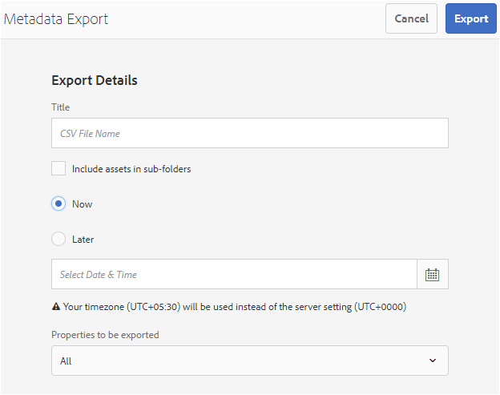

# Metagegevens van uw digitale elementen beheren {#managing-metadata-for-digital-assets}

<!-- Scope of metadata articles:
* metadata.md: The scope of this article is basic metadata updates, changes, etc. operations that end-users can do.
* metadata-concepts.md: All conceptual information. Minor instructions are OK but it is an FYI article about support and standards.
* metadata-config.md: New article. Contains all configuration and administration how-to info related to metadata of assets.
-->

[!DNL Adobe Experience Manager Assets] bewaart meta-gegevens voor elk middel. Het maakt het gemakkelijker om activa te categoriseren en te organiseren en het helpt mensen die naar een specifiek bezit zoeken. Dankzij de mogelijkheid metagegevens te extraheren uit bestanden waarnaar geüpload wordt, kan het beheer van metagegevens worden geïntegreerd in de creatieve workflow. [!DNL Experience Manager Assets] Met de mogelijkheid om metagegevens bij uw elementen te houden en te beheren, kunt u elementen automatisch ordenen en verwerken op basis van hun metagegevens.

## Metagegevens en de oorsprong ervan {#how-to-edit-or-add-metadata}

Metagegevens zijn aanvullende informatie over het element die kan worden doorzocht. Het wordt toegevoegd aan activa en in [!DNL Experience Manager] het wordt verwerkt wanneer u activa uploadt. U kunt de bestaande metagegevens bewerken en nieuwe eigenschappen van metagegevens toevoegen aan bestaande velden. Organisaties hebben beheerste en betrouwbare metagegevenswoordenboeken nodig. Het is daarom [!DNL Experience Manager Assets] niet mogelijk om op aanvraag nieuwe eigenschappen van metagegevens toe te voegen. Alleen beheerders en ontwikkelaars kunnen nieuwe eigenschappen of velden toevoegen die metagegevens bevatten. Gebruikers kunnen de bestaande velden vullen met metagegevens.

U kunt de volgende methoden gebruiken om metagegevens toe te voegen aan digitale elementen:

* Om te beginnen voegen de native toepassingen die elementen maken er metagegevens aan toe. Acrobat voegt bijvoorbeeld metagegevens  toe aan PDF-bestanden of een camera voegt enkele basismetagegevens toe aan de foto&#39;s. Wanneer u elementen genereert, kunt u de metagegevens toevoegen in native toepassingen zelf. U kunt bijvoorbeeld IPTC-metagegevens [toevoegen in Adobe Lightroom](https://helpx.adobe.com/lightroom-classic/help/metadata-basics-actions.html).

* Voordat u een element uploadt naar, kunt u metagegevens bewerken en wijzigen met behulp van de oorspronkelijke toepassing die is gebruikt om een element te maken of met behulp van een andere toepassing voor het bewerken van metagegevens. [!DNL Experience Manager] Wanneer u een element uploadt naar Experience Manager, worden de metagegevens verwerkt. Zie bijvoorbeeld hoe u met metagegevens [werkt in [!DNL Adobe Bridge]](https://helpx.adobe.com/bridge/user-guide.html/bridge/using/metadata-adobe-bridge.ug.html) het deelvenster [Codes voor [!DNL Bridge CC]](https://exchange.adobe.com/creativecloud.details.20009.aem-tags-panel-for-bridge-cc.html) informatie [!DNL Adobe Exchange].

* In [!DNL Experience Manager Assets]kunt u metagegevens van elementen op de [!UICONTROL Properties] pagina handmatig toevoegen of bewerken.

* U kunt de functionaliteit van [metagegevensprofielen](/help/assets/metadata-config.md#metadata-profiles) van gebruiken [!DNL Experience Manager Assets] om automatisch metagegevens toe te voegen wanneer elementen naar DAM worden geüpload.

## Metagegevens toevoegen of bewerken in [!DNL Experience Manager Assets] {#add-edit-metadata}

Voer de volgende stappen uit om de metagegevens van een element in de [!DNL Assets] gebruikersinterface te bewerken:

1. Voer een van de volgende handelingen uit:

   * Selecteer het element in de [!DNL Assets] interface en klik op **[!UICONTROL View Properties]** de werkbalk.
   * Selecteer de **[!UICONTROL View Properties]** handeling Snel bij de elementminiatuur.
   * Klik op de elementpagina op het pictogram **[!UICONTROL View Properties]** voor de informatie over  elementen op de werkbalk.

   Op de elementpagina worden alle metagegevens van het element weergegeven. De metagegevens worden geëxtraheerd wanneer het element wordt geüpload (opgenomen) naar [!DNL Experience Manager].

   

   *Afbeelding: Bewerk of voeg metagegevens toe op de[!UICONTROL Properties]elementpagina.*

1. Make edits to the metadata under the various tabs, as required, and when completed, click **[!UICONTROL Save]** from the toolbar to save your changes. Click **[!UICONTROL Close]** to return to the [!DNL Assets] web interface.

   >[!NOTE]
   >
   >Als een tekstveld leeg is, is er geen bestaande metagegevensset. U kunt een waarde in het veld invoeren en deze opslaan om die eigenschap voor metagegevens toe te voegen.

Eventuele wijzigingen in de metagegevens van een element worden teruggeschreven naar het oorspronkelijke binaire bestand als onderdeel van de XMP gegevens. De workflow voor het terugschrijven van metagegevens voegt de metagegevens toe aan het oorspronkelijke binaire bestand. Wijzigingen die worden aangebracht in de bestaande eigenschappen (zoals `dc:title`) worden overschreven en nieuwe eigenschappen (zoals aangepaste eigenschappen `cq:tags`) worden toegevoegd aan het schema.

XMP terugschrijven wordt ondersteund en ingeschakeld voor de platforms en bestandsindelingen die in de [technische vereisten worden beschreven.](/help/sites-deploying/technical-requirements.md)

## Eigenschappen van metagegevens van meerdere elementen bewerken {#editing-metadata-properties-of-multiple-assets}

[!DNL Adobe Enterprise Manager Assets] Hiermee kunt u de metagegevens van meerdere elementen tegelijk bewerken, zodat u snel algemene wijzigingen in metagegevens in elementen bulksgewijs kunt doorgeven. U kunt de metagegevens voor meerdere verzamelingen ook bulksgewijs bewerken. Gebruik de eigenschappenpagina om wijzigingen in metagegevens uit te voeren voor meerdere elementen of verzamelingen:

* Eigenschappen van metagegevens wijzigen in een algemene waarde
* Tags toevoegen of wijzigen

Gebruik de schema-editor om de pagina met eigenschappen van metagegevens aan te passen, inclusief het toevoegen, wijzigen of verwijderen van eigenschappen van metagegevens.

>[!NOTE]
>
>De bulkbewerkingsmethoden werken voor elementen die beschikbaar zijn in een map of een verzameling. Voor de elementen die beschikbaar zijn in verschillende mappen of die voldoen aan een algemeen criterium, is het mogelijk om de metagegevens na het zoeken [in grote](search-assets.md#metadataupdates)hoeveelheden bij te werken.

1. Navigeer in de [!DNL Assets] gebruikersinterface naar de locatie van de elementen die u wilt bewerken.
1. Selecteer de elementen waarvan u de algemene eigenschappen wilt bewerken.
1. Klik in de werkbalk **[!UICONTROL Properties]** om de pagina met eigenschappen voor de geselecteerde elementen te openen.

   >[!NOTE]
   >
   >Wanneer u meerdere elementen selecteert, wordt het laagste gebruikelijke bovenliggende formulier geselecteerd voor de elementen. Met andere woorden, op de eigenschappenpagina worden alleen metagegevensvelden weergegeven die gemeenschappelijk zijn op de eigenschappenpagina&#39;s van alle afzonderlijke elementen.

1. Wijzig de eigenschappen van metagegevens voor geselecteerde elementen onder de verschillende tabbladen.
1. Schakel de overige elementen in de lijst uit als u de metagegevenseditor voor een bepaald element wilt weergeven. De gebieden van de meta-gegevensredacteur zijn bevolkt met de meta-gegevens voor het bepaalde middel.

   >[!NOTE]
   >
   >* Op de pagina met eigenschappen kunt u elementen uit de lijst met elementen verwijderen door ze te deselecteren. In de lijst met elementen zijn standaard alle elementen geselecteerd. De metagegevens voor elementen die u uit de lijst verwijdert, worden niet bijgewerkt.
   >* Schakel boven aan de lijst met elementen het selectievakje in **[!UICONTROL Title]** om te schakelen tussen het selecteren van de elementen en het wissen van de lijst.

1. Als u een ander metagegevensschema voor de elementen wilt selecteren, klikt u op **[!UICONTROL Settings]** de werkbalk en selecteert u het gewenste schema.
1. Sla de wijzigingen op.
1. Selecteer **[!UICONTROL Append mode]** om de nieuwe metadata toe te voegen aan de bestaande metadata in velden die meerdere waarden bevatten. Als u deze optie niet selecteert, worden de bestaande metadata in de velden vervangen door de nieuwe metadata. Klik op **[!UICONTROL Submit]**.

   >[!CAUTION]
   >
   >Voor velden met één waarde worden de nieuwe metadata niet toegevoegd aan de bestaande waarde in het veld, zelfs niet als u **[!UICONTROL Append mode]** selecteert.

## Metagegevens importeren {#import-metadata}

[!DNL Assets] Hiermee kunt u metagegevens van elementen in bulk importeren met een CSV-bestand. U kunt bulkupdates uitvoeren voor de onlangs geüploade elementen of de bestaande elementen door een CSV-bestand te importeren. U kunt ook metagegevens van elementen bulksgewijs invoeren vanuit een systeem van derden in de CSV-indeling.

De import van metagegevens is asynchroon en belemmert de systeemprestaties niet. Gelijktijdige update van de metagegevens voor meerdere elementen kan bronintensief zijn vanwege XMP schrijfactiviteit als de werkstroommarkering wordt gecontroleerd. Plan zo&#39;n import tijdens het gebruik van een slanke server, zodat de prestaties voor andere gebruikers niet worden beïnvloed.

>[!NOTE]
>
>Registreer de naamruimten eerst om metagegevens in aangepaste naamruimten te importeren.

1. Navigeer naar de [!DNL Assets] gebruikersinterface en klik op **[!UICONTROL Create]** de werkbalk.
1. Selecteer **[!UICONTROL Metadata]** in het menu.
1. In the **[!UICONTROL Metadata Import]** page, click **[!UICONTROL Select File]**. Selecteer het CSV-bestand met de metadata.
1. Geef de volgende parameters op. Zie een voorbeeld-CSV-bestand op [metadata-import-sample-file.csv](assets/metadata-import-sample-file.csv).

   | Parameters voor het importeren van metagegevens | Beschrijving |
   |:---|:---|
   | [!UICONTROL Batch Size] | Aantal elementen in een batch waarvoor metagegevens moeten worden geïmporteerd. De standaardwaarde is 50. Maximumwaarde is 100. |
   | [!UICONTROL Field Separator] | De standaardwaarde is `,` (een komma). U kunt elk ander teken opgeven. |
   | [!UICONTROL Multi Value Delimiter] | Scheidingsteken voor metagegevenswaarden. De standaardwaarde is `|`. |
   | [!UICONTROL Launch Workflows] | Standaard false. Als de instelling `true` en de standaardinstellingen voor Launcher zijn ingesteld voor de [!UICONTROL DAM Metadata WriteBack] workflow (die metagegevens naar de binaire XMP schrijft). Als u opstartworkflows inschakelt, wordt het systeem trager. |
   | [!UICONTROL Asset Path Column Name] | Hiermee definieert u de kolomnaam voor het CSV-bestand met elementen. |

1. Klik op **[!UICONTROL Import]** op de werkbalk. Nadat de metagegevens zijn geïmporteerd, wordt een melding in [!UICONTROL Notification] Postvak IN weergegeven.

1. Navigeer naar de [!UICONTROL Properties] pagina van een element en controleer de waarden in de velden om te controleren of het element correct is geïmporteerd.

Als u datum en tijdstempel wilt toevoegen tijdens het importeren van metagegevens, gebruikt u de `YYYY-MM-DDThh:mm:ss.fff-00:00` notatie voor datum en tijd. Datum en tijd worden gescheiden door `T`, is `hh` uren in 24-uursnotatie, `fff` is nanoseconden, en `-00:00` is timezone offset. Bijvoorbeeld, `2020-03-26T11:26:00.000-07:00` is 26 maart 2020 om 11:26:00.000 AM PST tijd.

>[!CAUTION]
>
>Als de datumnotatie niet overeenkomt `YYYY-MM-DDThh:mm:ss.fff-00:00`, worden de datumwaarden niet ingesteld. De datumnotaties van het geëxporteerde CSV-bestand met metagegevens hebben de indeling `YYYY-MM-DDThh:mm:ss-00:00`. Als u het wilt invoeren, zet het in het aanvaardbare formaat door de nanosecondewaarde toe te voegen die door wordt aangegeven `fff`.

## Metagegevens exporteren {#export-metadata}

U kunt metagegevens voor meerdere elementen in CSV-indeling exporteren. De metagegevens worden asynchroon geëxporteerd en hebben geen invloed op de prestaties van het systeem. Als u metagegevens wilt exporteren, doorloopt [!DNL Experience Manager] u de eigenschappen van het knooppunt Asset `jcr:content/metadata` en de onderliggende knooppunten en exporteert u de eigenschappen van de metagegevens in een CSV-bestand.

Hier volgen enkele voorbeelden van het gebruik van metagegevens voor bulksgewijs exporteren:

* Importeer de metagegevens in een systeem van derden wanneer u elementen migreert.
* Metagegevens over elementen delen met een groter projectteam.
* Test of controleer de metagegevens op conformiteit.
* Maak de metagegevens extern om deze afzonderlijk te lokaliseren.

1. Selecteer de elementenmap die elementen bevat waarvoor u metagegevens wilt exporteren. Selecteer **[!UICONTROL Export metadata]** in de werkbalk.

1. In the [!UICONTROL Metadata Export] dialog, specify a name for the CSV file. Selecteer Metagegevens voor elementen in submappen exporteren **[!UICONTROL Include assets in subfolders]**.

   

1. Selecteer de gewenste opties. Geef een bestandsnaam en zo nodig een datum op.

1. Geef in het **[!UICONTROL Properties to be exported]** veld op of u alle of specifieke eigenschappen wilt exporteren. Als u Selectieve eigenschappen kiest die u wilt exporteren, voegt u de gewenste eigenschappen toe.

1. Klik **[!UICONTROL Export]** op de werkbalk. Een bericht bevestigt dat de metagegevens worden geëxporteerd. Sluit het bericht.

1. Open het bericht in het Postvak IN voor de exporttaak. Selecteer de taak en klik op **[!UICONTROL Open]** op de werkbalk. To download the CSV file with the metadata, click **[!UICONTROL CSV Download]** from the toolbar. Klik op **[!UICONTROL Close]**.

   

   *Afbeelding: Dialoogvenster voor het downloaden van het CSV-bestand met metagegevens die bulksgewijs zijn geëxporteerd.*

## Metagegevens van verzamelingen bewerken {#collections-metadata}

Zie Metagegevens [van verzamelingen](/help/assets/managing-collections-touch-ui.md#view-edit-collection-metadata) weergeven en bewerken en metagegevens van meerdere verzamelingen in bulk bewerken voor meer informatie.

## Een metagegevensprofiel toepassen op mappen {#applying-a-metadata-profile-to-folders}

<!-- TBD: Review this overview.
-->

Wanneer u een metagegevensprofiel toewijst aan een map, nemen eventuele submappen het profiel automatisch over van de bovenliggende map. Dit betekent dat u slechts één metagegevensprofiel kunt toewijzen aan een map. Denk daarom zorgvuldig na over de mapstructuur van de locatie waar u middelen uploadt, opslaat, gebruikt en archiveert.

Als u een ander metagegevensprofiel aan een map hebt toegewezen, overschrijft het nieuwe profiel het vorige profiel. De vorige bestaande mapelementen blijven ongewijzigd. Het nieuwe profiel wordt toegepast op de elementen die later aan de map worden toegevoegd.

Mappen waaraan een profiel is toegewezen, worden in de gebruikersinterface aangeduid met de naam van het profiel dat in de kaartnaam wordt weergegeven.

U kunt metagegevensprofielen toepassen op specifieke mappen of op alle elementen.

U kunt elementen opnieuw verwerken in een map die al een bestaand metagegevensprofiel heeft dat u later hebt gewijzigd. Zie Elementen [opnieuw verwerken in een map nadat u het verwerkingsprofiel](processing-profiles.md#reprocessing-assets)hebt bewerkt.

U kunt een metadataprofiel toepassen op een map vanuit het menu **[!UICONTROL Tools]**, of vanuit **[!UICONTROL Properties]** als u zich in een map bevindt. In deze sectie wordt beschreven hoe u op beide manieren metadataprofielen kunt toepassen op mappen.

Mappen waaraan al een profiel is toegewezen, worden aangegeven door de naam van het profiel direct onder de mapnaam weer te geven.

U kunt elementen in een map opnieuw verwerken die al een bestaand videoprofiel heeft dat u later wijzigt. Zie Elementen [opnieuw verwerken in een map nadat u het verwerkingsprofiel](processing-profiles.md#reprocessing-assets)hebt bewerkt.

### Metagegevensprofielen toepassen op mappen vanuit de gebruikersinterface Profielen {#applying-metadata-profiles-to-folders-from-profiles-user-interface}

Voer de stappen uit om het metagegevensprofiel toe te passen:

1. Click the [!DNL Experience Manager] logo and navigate to **[!UICONTROL Tools]** > **[!UICONTROL Assets]** > **[!UICONTROL Metadata Profiles]**.
1. Selecteer het metagegevensprofiel dat u wilt toepassen op een of meerdere mappen.
1. Click **[!UICONTROL Apply Metadata Profile to Folder(s)]** and select the folder or multiple folders you want use to receive the newly uploaded assets and click **[!UICONTROL Done]**. Mappen waaraan al een profiel is toegewezen, worden aangegeven door de naam van het profiel direct onder de mapnaam weer te geven.

### Metagegevensprofielen toepassen op mappen vanuit Eigenschappen {#applying-metadata-profiles-to-folders-from-properties}

1. Klik in de linkertrack **[!UICONTROL Assets]** en navigeer naar de map waarop u een metagegevensprofiel wilt toepassen.
1. Klik in de map op het vinkje om het te selecteren en klik vervolgens **[!UICONTROL Properties]**.

1. Select the **[!UICONTROL Metadata Profiles]** tab and select the profile from the popup menu and click **[!UICONTROL Save]**.

Mappen waaraan al een profiel is toegewezen, worden aangegeven door de naam van het profiel direct onder de mapnaam weer te geven.

### Metagegevensprofiel algemeen toepassen {#metadata-profile-global}

Zie de [configuratie voor algemene](/help/assets/metadata-config.md#apply-a-metadata-profile-globally)toepassing van het metagegevensprofiel voor meer informatie.

### Een metagegevensprofiel uit mappen verwijderen {#removing-a-metadata-profile-from-folders}

Wanneer u een metagegevensprofiel uit een map verwijdert, nemen eventuele submappen automatisch de verwijdering van het profiel uit de bovenliggende map over. Alle verwerking van bestanden die in de mappen zijn opgetreden, blijft echter intact.

U kunt een metagegevensprofiel uit een map verwijderen vanuit het **[!UICONTROL Tools]** menu of vanuit de map **[!UICONTROL Properties]** in de map.

#### Metaprofielen uit mappen verwijderen via de gebruikersinterface Profielen {#removing-metadata-profiles-from-folders-via-profiles-user-interface}

1. Click the [!DNL Experience Manager] logo and navigate to **[!UICONTROL Tools]** > **[!UICONTROL Assets]** > **[!UICONTROL Metadata Profiles]**.
1. Selecteer het metagegevensprofiel dat u uit een of meerdere mappen wilt verwijderen.
1. Click **[!UICONTROL Remove Metadata Profile from Folder(s)]** and select the folder or multiple folders you want use to remove a profile from and click **[!UICONTROL Done]**.

   U kunt bevestigen dat het metagegevensprofiel niet meer wordt toegepast op een map omdat de naam niet langer onder de mapnaam wordt weergegeven.

#### Metagegevensprofielen uit mappen verwijderen via eigenschappen {#removing-metadata-profiles-from-folders-via-properties}

1. Klik op het [!DNL Experience Manager] logo en navigeer **[!UICONTROL Assets]** naar de map waarvan u een metagegevensprofiel wilt verwijderen.
1. Klik in de map op het vinkje om het te selecteren en klik vervolgens **[!UICONTROL Properties]**.
1. Selecteer het tabblad **[!UICONTROL Metadata Profiles]**, selecteer **[!UICONTROL None]** in het vervolgkeuzemenu en klik op **[!UICONTROL Save]**. Mappen waaraan al een profiel is toegewezen, worden aangegeven door de naam van het profiel direct onder de mapnaam weer te geven.

## Tips en beperkingen {#best-practices-limitations}

* De meta-gegevensupdates via gebruikersinterface verandert de meta-gegevenseigenschappen in `dc` namespace. Wanneer updates via de HTTP-API worden uitgevoerd, veranderen de eigenschappen van de metagegevens in de `jcr` naamruimte. Zie [hoe u metagegevens kunt bijwerken met de HTTP-API](/help/assets/mac-api-assets.md#update-asset-metadata).

* Het CSV-bestand voor het importeren van metagegevens van elementen heeft een zeer specifieke indeling. Als u moeite en tijd wilt besparen en onbedoelde fouten wilt voorkomen, kunt u de CSV-bestanden beginnen te maken met de indeling van een geëxporteerd CSV-bestand.

* Wanneer u metagegevens importeert met een CSV-bestand, is de vereiste datumnotatie `YYYY-MM-DDThh:mm:ss.fff-00:00`. Als een andere notatie wordt gebruikt, worden de datumwaarden niet ingesteld. De datumnotaties van het geëxporteerde CSV-bestand met metagegevens hebben de indeling `YYYY-MM-DDThh:mm:ss-00:00`. Als u het wilt invoeren, zet het in het aanvaardbare formaat door de nanosecondewaarde toe te voegen die door wordt aangegeven `fff`.

>[!MORELIKETHIS]
>
>* [Metagegevensconcepten en begrip](metadata-concepts.md).
>* [Eigenschappen van metagegevens van meerdere verzamelingen bewerken](managing-collections-touch-ui.md#editing-collection-metadata-in-bulk)
>* [Metagegevens importeren en exporteren in Experience Manager Assets](https://docs.adobe.com/content/help/en/experience-manager-learn/assets/metadata/metadata-import-feature-video-use.html)

<!-- TBD: Try filling the available information in these topics to the extent possible. As and when complete, publish the sections live.

## Where to find metadata of an asset or folder {#find-metadata}

What all methods to access asset Properties. More Details option in column view. Select asset and click Properties. Keyboard shortcut `p`. What else?

## Understand metadata handling in Experience Manager {#metadata-possibilities-with-aem}

Describe the journey of an assets' metadata. What all happens to metadata when an asset is added to Experience Manager.

## Add metadata to your digital assets {#add-metadata}

* To begin with, assets come with some metadata. The applications that create digital assets add some metadata to the assets created. Before uploading an asset to Experience Manager, you can edit and modify metadata using either the native application used to create an asset or using some other metadata editing application. When you upload an asset to Experience Manager, the metadata is processed.

* Link to PS, ID, AI, PDF, etc. metadata-related help articles.

* Link to XMP writeback.

* Manually add (or edit) metadata in AEM in Properties page.

* Metadata profiles

* Any workflows related to metadata?

* Advanced topic: Add, edit, modify, process and writeback metadata of subassets.

## Metadata of assets, folders, and collections {#metadata-of-assets-folders-collections}

Similarities and differences between metadata of asset and folder. 

Link to metadata handling of collections.

## Modify metadata of an asset, folder, or collection {#modify-metadata}

* While creating assets: Native application.

* Before ingesting assets: Metadata editors

* After ingesting assets: Properties of an asset, folder, collection, etc.

* Any supported programmatic method to bulk edit metadata directly in JCR?

## Modify metadata in bulk {#modify-metadata-in-bulk}

[!DNL Adobe Enterprise Manager Assets] lets you edit the metadata of multiple assets simultaneously so you can quickly propagate common metadata changes to assets in bulk. You can also edit the metadata for multiple collections in bulk.

Use the properties page to perform metadata changes on multiple assets or collections:

* Change metadata properties to a common value

* Add or modify tags

To customize the metadata properties page, including adding, modifying, deleting metadata properties, use the schema editor.

>[!NOTE]
>
>The bulk editing methods work for assets available in a folder or a collection. For the assets that are available across folders or match a common criteria, it is possible to [bulk update the metadata after searching](search-assets.md#metadataupdates).

1. In the [!DNL Assets] user interface, navigate to the location of the assets you want to edit.
1. Select the assets for which you want to edit common properties.
1. From the toolbar, click **[!UICONTROL Properties]** to open the properties page for the selected assets.

   >[!NOTE]
   >
   >When you select multiple assets, the lowest common parent form is selected for the assets. In other words, the properties page only displays metadata fields that are common across the properties pages of all the individual assets.

1. Modify the metadata properties for selected assets under the various tabs.
1. To view the metadata editor for a specific asset, deselect the remaining assets in the list. The metadata editor fields are populated with the metadata for the particular asset.

   >[!NOTE]
   >
   >* In the Properties page, you can remove assets from the asset list by deselecting them. The asset list has all the assets selected by default. The metadata for assets that you remove from the list is not updated.
   >
   >* At the top of assets list, select the check box near **[!UICONTROL Title]** to toggle between selecting the assets and clearing the list.

1. To select a different metadata schema for the assets, click **[!UICONTROL Settings]** from the toolbar, and select the desired schema.
1. Save the changes.
1. To append the new metadata with the existing metadata in fields that contain multiple values, select **[!UICONTROL Append mode]**. If you do not select this option, the new metadata replaces the existing metadata in the fields. click **[!UICONTROL Submit]**.

   >[!CAUTION]
   >
   >For single-value fields, the new metadata is not appended to the existing value in the field even if you select **[!UICONTROL Append mode]**.

-->
