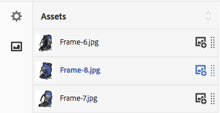

# Gemengde mediasets{#mixed-media-sets}

Met gemengde mediasets kunt u in één presentatie een combinatie van afbeeldingen, afbeeldingssets, centrifuges en video&#39;s aanbieden.

Gemengde mediasets worden aangegeven door een banner met het woord **[!UICONTROL MixedMediaSet]**. Als de gemengde mediaset wordt gepubliceerd, wordt bovendien de publicatiedatum, die door het pictogram **[!UICONTROL World]** wordt aangegeven, samen met de laatste wijzigingsdatum op de banner weergegeven. Dit wordt aangegeven door het pictogram **[!UICONTROL Pencil]**.

>[!NOTE]
>
>Voor informatie over de gebruikersinterface van Middelen raadpleegt u [Elementen beheren](/help/assets/manage-assets.md).

## Snel starten: gemengde mediasets {#quick-start-mixed-media-sets}

Ga als volgt te werk om snel aan de slag te gaan met gemengde mediasets:

1. [Uw elementen uploaden](#uploading-assets).

   Begin door de afbeeldingen en video&#39;s voor uw gemengde mediasets te uploaden. Maak indien nodig uw eigen [afbeeldingsets](/help/assets/image-sets.md) en [spinsets](/help/assets/spin-sets.md). Omdat gebruikers kunnen inzoomen op afbeeldingen in de gemengde Media Set Viewer, moet u de afbeeldingen zorgvuldig kiezen. Zorg ervoor dat de afbeeldingen ten minste 2000 pixels groot zijn in de grootste dimensie.

   Zie [Dynamic Media - Ondersteunde rasterafbeeldingsindelingen](/help/assets/assets-formats.md#supported-raster-image-formats-dynamic-media) voor een lijst met indelingen die worden ondersteund door gemengde mediasets.

1. [Gemengde mediasets maken](#creating-mixed-media-sets).

   Als u een gemengde mediaset wilt maken, selecteert u op de elementenpagina de optie **[!UICONTROL Create]** > **[!UICONTROL Mixed Media Set]** en geeft u de set een naam, kiest u de elementen en kiest u de volgorde waarin de afbeeldingen worden weergegeven.

   Zie [Werken met kiezers](/help/assets/working-with-selectors.md).

1. Instellen [Voorinstellingen gemengde Media Viewer](/help/assets/managing-viewer-presets.md), indien nodig.

   Beheerders kunnen viewervoorinstellingen voor gemengde mediasets maken of wijzigen. Als u de gemengde media met een viewervoorinstelling wilt weergeven, selecteert u de gemengde mediaset en selecteert u **[!UICONTROL Viewers]** in de vervolgkeuzelijst van het linkerspoor.

   Als u viewervoorinstellingen wilt maken of bewerken, raadpleegt u **[!UICONTROL Tools]** > **[!UICONTROL Assets]** > **[!UICONTROL Viewer Presets]**.

   Zie [Viewer-voorinstellingen toevoegen en bewerken](/help/assets/managing-viewer-presets.md).

1. [Voorvertoning van gemengde mediasets](#previewing-mixed-media-sets).

   Selecteer de gemengde Mediaset en u kunt er een voorvertoning van weergeven. Selecteer de miniatuurpictogrammen zodat u de gemengde mediaset in de geselecteerde viewer kunt bekijken. U kunt verschillende Viewers kiezen in het menu **[!UICONTROL Viewers]** beschikbaar via het keuzemenu voor de linkertrack.

1. [Gemengde mediasets publiceren](#publishing-mixed-media-sets).

   Wanneer u een gemengde mediaset publiceert, worden de URL en de insluitreeks geactiveerd. Bovendien moet u [De viewervoorinstelling publiceren](/help/assets/managing-viewer-presets.md#publishing-viewer-presets).

1. [URL&#39;s koppelen aan uw webtoepassing](/help/assets/linking-urls-to-yourwebapplication.md) of [De video- of afbeeldingsviewer insluiten](/help/assets/embed-code.md).

   Adobe Experience Manager Assets maakt URL-aanroepen voor gemengde mediasets en activeert deze nadat u de gemengde mediasets hebt gepubliceerd. U kunt deze URL&#39;s kopiëren wanneer u elementen voorvertoont. U kunt ze ook insluiten op uw website.

   Selecteer de Gemengde Reeks van Media, dan in het linkerspoordrop-down menu, uitgezocht **[!UICONTROL Viewers]**.

   Zie [Een gemengde mediaset koppelen aan een webpagina](/help/assets/linking-urls-to-yourwebapplication.md) en [De video- of afbeeldingsviewer insluiten](/help/assets/embed-code.md).

Indien nodig kunt u [Gemengde mediasets](#editing-mixed-media-sets). Bovendien kunt u bekijken en wijzigen [Eigenschappen van gemengde mediaset](/help/assets/manage-assets.md#editing-properties).

>[!NOTE]
>
>Als u problemen ondervindt bij het maken van sets, raadpleegt u [Problemen met Dynamic Media oplossen - Scene7-modus](/help/assets/troubleshoot-dms7.md).

## Elementen uploaden {#uploading-assets}

Begin door de afbeeldingen en video&#39;s voor uw gemengde mediasets te uploaden. Omdat gebruikers kunnen inzoomen op afbeeldingen in de gemengde Media Set Viewer, moet u de afbeeldingen zorgvuldig kiezen. Zorg ervoor dat de afbeeldingen ten minste 2000 pixels groot zijn in de grootste dimensie.

Als u bovendien pinsets of afbeeldingssets wilt toevoegen aan de gemengde mediaset, maakt u ook deze sets.

Zie [Dynamic Media - Ondersteunde rasterafbeeldingsindelingen](/help/assets/assets-formats.md#supported-raster-image-formats-dynamic-media) voor een lijst met indelingen die worden ondersteund door gemengde mediasets.

## Een gemengde mediaset maken {#creating-mixed-media-sets}

U kunt afbeeldingen, afbeeldingssets, centrifuges en video&#39;s toevoegen aan de gemengde mediaset. Zorg ervoor dat de bestanden, afbeeldingssets en centrifuges klaar zijn om te worden gepubliceerd voordat u ze aan de gemengde mediaset toevoegt.

Wanneer u elementen aan de set toevoegt, worden deze automatisch in alfanumerieke volgorde toegevoegd. U kunt elementen handmatig opnieuw ordenen of sorteren nadat u ze hebt toegevoegd.

**Een gemengde mediaset maken:**

1. Navigeer in Elementen naar de plaats waar u een gemengde mediaset wilt maken en selecteer **[!UICONTROL Create]** en selecteert u **[!UICONTROL Mixed Media Set]**. U kunt de set ook maken vanuit een map die uw assets bevat. De editor voor gemengde mediasets wordt weergegeven.

   

1. In de Gemengde Redacteur van de Reeks van Media, in **[!UICONTROL Title]**, ga een naam voor de Gemengde Reeks van Media in. De naam wordt in de banner weergegeven in de gemengde mediaset. Voer eventueel een beschrijving in.

   

   >[!NOTE]
   >
   >Wanneer u de gemengde mediaset maakt, kunt u de miniatuur van de gemengde mediaset wijzigen of Experience Manager toestaan de miniatuur automatisch te selecteren op basis van de elementen in de gemengde mediaset. Selecteer een miniatuur door **[!UICONTROL Change thumbnail]** en selecteert u een willekeurige afbeelding (u kunt ook naar andere mappen navigeren om afbeeldingen te zoeken). Als u een miniatuur hebt geselecteerd en vervolgens besluit dat Experience Manager een miniatuur moet genereren op basis van de gemengde mediaset, selecteert u **[!UICONTROL Switch to Automatic thumbnail]**.

1. Selecteer de Asset Selector zodat u elementen kunt selecteren die u wilt opnemen in de gemengde mediaset. Selecteer ze en selecteer vervolgens **[!UICONTROL Select]**.

   Met de assetkiezer kunt u naar assets zoeken door een trefwoord te typen en op **[!UICONTROL Return]** te tikken. U kunt ook filters toepassen om de zoekresultaten te verfijnen. U kunt filteren op pad, verzameling, bestandstype en tag. Selecteer het filter en selecteer vervolgens het filter **[!UICONTROL Filter]** op de werkbalk. Wijzig de weergave door het pictogram **[!UICONTROL View]** te selecteren en **[!UICONTROL List View]**, **[!UICONTROL Column View]** of **[!UICONTROL Card View]** te selecteren.

   Zie [Werken met kiezers](/help/assets/working-with-selectors.md).

   

1. Wijzig de volgorde van de elementen door deze omhoog of omlaag te slepen in de lijst (selecteer de optie **[!UICONTROL Reorder]** pictogram), indien nodig.

   

   Als u miniaturen wilt toevoegen, selecteert u de optie **+** **[!UICONTROL thumbnail]** naast de afbeelding en navigeer naar de gewenste miniatuur. Wanneer u alle miniatuurafbeeldingen hebt geselecteerd, selecteert u **[!UICONTROL Save]**.

   >[!NOTE]
   >
   >Als u elementen wilt toevoegen, selecteert u **[!UICONTROL Add Asset]**.

1. Als u een element wilt verwijderen, schakelt u het desbetreffende selectievakje in en selecteert u **[!UICONTROL Delete Asset]**.
1. Als u een voorinstelling wilt toepassen, selecteert u **[!UICONTROL Preset]** in de rechterbovenhoek en selecteert u een voorinstelling die u op de elementen wilt toepassen.
1. Selecteer **[!UICONTROL Save]**. De nieuwe gemengde mediaset wordt weergegeven in de map waarin u deze hebt gemaakt.

## Een gemengde mediaset bewerken {#editing-mixed-media-sets}

U kunt verschillende bewerkingstaken rechtstreeks in de gebruikersinterface uitvoeren op elementen in gemengde mediasets [zoals u elk element in Elementen](/help/assets/manage-assets.md). U kunt ook de volgende handelingen uitvoeren in Gemengde Mediasets:

* Voeg elementen toe aan de gemengde mediaset.
* Elementen opnieuw rangschikken in de gemengde mediaset.
* Elementen verwijderen uit de gemengde mediaset.
* Voorinstellingen voor viewers toepassen.
* Wijzig de standaardminiatuur.

**Een gemengde mediaset bewerken:**

1. Voer een van de volgende handelingen uit:

   * Houd de muisaanwijzer boven een element in een gemengde mediaset en selecteer vervolgens **[!UICONTROL Edit]** (potloodpictogram).
   * Houd de muisaanwijzer boven een element in een gemengde mediaset en selecteer **[!UICONTROL Select]** (vinkje pictogram), selecteer dan **[!UICONTROL Edit]** op de werkbalk.

   * Selecteer een gemengd mediaset element en selecteer vervolgens **[!UICONTROL Edit]** (potloodpictogram) op de werkbalk.

1. Voer in de Editor gemengde mediaset een van de volgende handelingen uit:

   * Als u elementen opnieuw wilt rangschikken, selecteert u in het linkerdeelvenster **[!UICONTROL Assets]** (Afbeeldingspictogram), sleept u een element naar een nieuwe locatie.
   * Als u elementen wilt toevoegen, selecteert u op de werkbalk **[!UICONTROL Add Asset]**. Navigeer naar de elementen. Voor elk element dat u wilt toevoegen, beweegt u de muisaanwijzer over de afbeelding van het element (niet over de naam van het element) en selecteert u het pictogram van het vinkje. Selecteer in de rechterbovenhoek de optie **[!UICONTROL Select]**.

   * Als u een element wilt verwijderen, selecteert u in het linkerdeelvenster **[!UICONTROL Assets]** (Afbeeldingspictogram) en selecteer vervolgens het element. Selecteer in de werkbalk de optie **[!UICONTROL Delete Asset]**.

   * Als u elementen op naam wilt sorteren in oplopende of aflopende volgorde, selecteert u in het linkerdeelvenster **[!UICONTROL Assets]** (afbeeldingspictogram). Rechts van het **[!UICONTROL Assets]** selecteert u de pictogrammen voor de pijl-omhoog of -omlaag.

     >[!NOTE]
     >
     >* Om een volledige Gemengde Reeks van Media te schrappen, van om het even welke het bekijken wijze (zoals **[!UICONTROL Card View]** of **[!UICONTROL Column View]**) navigeer naar de gemengde mediaset. Houd de cursor boven het element en selecteer het vinkje zodat u het kunt selecteren. Druk **[!UICONTROL Backspace]** op het toetsenbord, of selecteer **[!UICONTROL More]** (drie punten) op de werkbalk en selecteer vervolgens **[!UICONTROL Delete]**.
     >
     >* U kunt elementen in een gemengde mediaset bewerken door naar de set te navigeren en op **[!UICONTROL Set Members]** in het linkerspoor. Selecteer de **[!UICONTROL Pencil]** op een afzonderlijk element, zodat u het in het bewerkingsvenster kunt openen.

1. Selecteren **[!UICONTROL Save]** wanneer u klaar bent met bewerken.

   >[!NOTE]
   >
   >* Als u de elementen in een gemengde mediaset wilt bewerken, navigeert u naar de gemengde mediaset. Selecteer de set (niet selecteren) zodat deze wordt geopend op de pagina Voorvertoning Experience Manager instellen. Selecteer in het linkerspoor het inlasteken om de vervolgkeuzelijst te openen en selecteer **[!UICONTROL Set Members]**. Houd de muisaanwijzer op een element op de pagina Leden instellen en selecteer vervolgens **[!UICONTROL Edit]** (potloodpictogram) om de bewerkingspagina te openen.
   >
   >* Als u een volledige gemengde mediaset wilt verwijderen, gaat u vanuit elke weergavemodus (zoals de Kaart- of kolomweergave) naar de gemengde mediaset. Houd de muisaanwijzer boven de set en selecteer vervolgens **Selecteren** (vinkje). Druk **[!UICONTROL Backspace]** op uw toetsenbord, of selecteer **[!UICONTROL More]** (rij van drie stippen), selecteert u **[!UICONTROL Delete]**.

## Een voorvertoning van een gemengde mediaset weergeven {#previewing-mixed-media-sets}

Zie [Middelen voorvertonen](/help/assets/previewing-assets.md) voor meer informatie over hoe u een voorvertoning van gemengde mediasets kunt weergeven.

## Een gemengde mediaset publiceren {#publishing-mixed-media-sets}

Zie [Elementen publiceren](/help/assets/publishing-dynamicmedia-assets.md) voor meer informatie over hoe u gemengde mediasets kunt publiceren.

>[!NOTE]
>
>Als de gemengde mediaset de eerste keer dat u deze publiceert niet volledig in de leveringsservice terechtkomt, publiceert u de gemengde mediaset een tweede keer.
