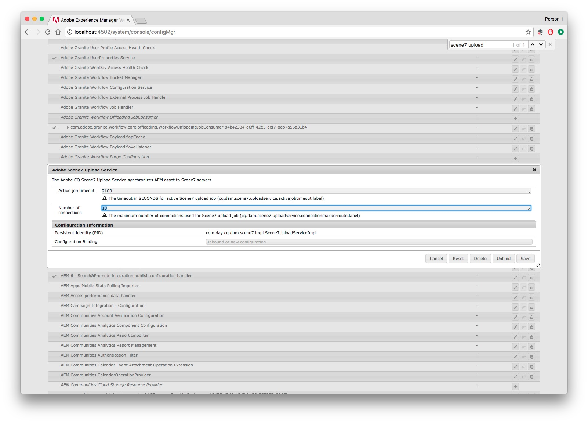

# OPTIE A - Dynamic Media configureren - Scene7-modus{#configuring-dynamic-media-scene-mode}

>[!NOTE]
>
>OPTIE A - DE TWEE NIEUWE ONDERWERPEN DIE IK HEB GESCHREVEN, WORDEN VERWIJDERD. MAAR VOORDAT DE ONDERWERPEN WERDEN VERWIJDERD, WERD ALLE INHOUD ERVAN NAAR DIT ONDERWERP VERPLAATST, NAAR DE RESPECTIEVE GEBIEDEN WAAR IK AL OVER ALGEMENE INSTELLINGEN EN PUBLICATIE-INSTELLINGEN SPRAK.

Als u Adobe Experience Manager-configuratie gebruikt voor verschillende omgevingen, zoals ontwikkeling, staging en productie, configureert u Dynamic Media-Cloud Services voor elk van deze omgevingen.

## Architectuurdiagram van de Dynamic Media-Scene7-modus {#architecture-diagram-of-dynamic-media-scene-mode}

**RICK: ZO BEHOUDEN ALS HET IS**

In het volgende architectuurdiagram wordt beschreven hoe de modus Dynamic Media - Scene7 werkt.

Met de nieuwe architectuur is Experience Manager verantwoordelijk voor primaire bronactiva en synchrone met Dynamic Media voor activaverwerking en het publiceren:

1. Wanneer het primaire bronelement naar de Experience Manager wordt geüpload, wordt het naar Dynamic Media gerepliceerd. Op dat moment verwerkt Dynamic Media alle processen voor het genereren van elementen, zoals videocodering en dynamische varianten van een afbeelding.
(In de modus Dynamic Media - Scene7 is de standaardgrootte voor het uploaden van bestanden 2 GB of minder. Als u bestanden wilt uploaden van 2 GB tot 15 GB, raadpleegt u [(Optioneel) Configureer de Dynamic Media-Scene7-modus voor het uploaden van middelen groter dan 2 GB](#optional-config-dms7-assets-larger-than-2gb).)
1. Nadat de vertoningen worden geproduceerd, kan de Experience Manager tot de verre vertoningen van Dynamic Media veilig toegang hebben en voorproef (geen binaire getallen worden teruggestuurd naar de instantie van de Experience Manager).
1. Nadat de inhoud klaar is om te worden gepubliceerd en goedgekeurd, brengt het de dienst van Dynamic Media teweeg om inhoud uit te duwen naar leveringsservers en geheim voorgeheugeninhoud bij CDN (het Netwerk van de Levering van de Inhoud) in het voorgeheugen op.


>[!IMPORTANT]
>
>Voor de volgende lijst met functies moet u de CDN uit de doos gebruiken die is gebundeld met Adobe Experience Manager - Dynamic Media. Een andere aangepaste CDN wordt niet ondersteund met deze functies.
>
>* [Smart Imaging](/help/assets/imaging-faq.md)
>* [Cache-validatie](/help/assets/invalidate-cdn-cache-dynamic-media.md)
>* [Hotlink-beveiliging](/help/assets/hotlink-protection.md)
>* [HTTP/2-levering van inhoud](/help/assets/http2.md)
>* URL omleiden op CDN-niveau
>* Akamai ChinaCDN (voor optimale levering in China)


## Dynamic Media inschakelen in Scene7-modus {#enabling-dynamic-media-in-scene-mode}

**RICK: ZO BEHOUDEN ALS HET IS**

[Dynamic Media](https://business.adobe.com/products/experience-manager/assets/dynamic-media.html) is standaard uitgeschakeld. Als u gebruik wilt maken van Dynamic Media-functies, moet u deze inschakelen.

>[!WARNING]
>
>Dynamic Media - Scene7-modus is bedoeld voor de *Alleen instantie Experience Manager auteur*. Als dusdanig, moet u vormen `runmode=dynamicmedia_scene7` op de instantie Auteur van de Experience Manager, *niet* de Experience Manager Publish instantie.

Als u Dynamic Media wilt inschakelen, moet u de Experience Manager starten met de `dynamicmedia_scene7` run mode van de bevellijn door het volgende in een eindvenster in te gaan (de gebruikte voorbeeldhaven is 4502):

```shell
java -Xms4096m -Xmx4096m -Doak.queryLimitInMemory=500000 -Doak.queryLimitReads=500000 -jar cq-quickstart-6.5.0.jar -gui -r author,dynamicmedia_scene7 -p 4502
```

## (Optioneel) Dynamic Media-voorinstellingen en -configuraties migreren van 6,3 naar 6,5 Nul downtime {#optional-migrating-dynamic-media-presets-and-configurations-from-to-zero-downtime}

**RICK: ZO BEHOUDEN ALS HET IS**

De upgrade van Experience Manager Dynamic Media van 6.3 naar 6.4 of 6.5 omvat nu de mogelijkheid om geen downtime te implementeren. Al uw voorinstellingen en configuraties migreren vanuit `/etc` tot `/conf` in CRXDE Lite, zorg ervoor u het volgende krullbevel in werking stelt.

>[!NOTE]
>
>Als u de Experience Manager-instantie uitvoert in de compatibiliteitsmodus - u hebt dus het compatibiliteitspakket geïnstalleerd - hoeft u deze opdrachten niet uit te voeren.

Voor alle upgrades, met of zonder het compatibiliteitspakket, kunt u de standaard, out-of-box viewer vooraf instelt kopiëren die oorspronkelijk met Dynamic Media door het volgende Linux® krullbevel in werking te stellen kwam:

`curl -u admin:admin -X POST https://<server_address>:<server_port>/libs/settings/dam/dm/presets/viewer.pushviewerpresets.json`

Aangepaste voorinstellingen en configuraties van viewers migreren die u hebt gemaakt van `/etc` tot `/conf`, voert u de volgende Linux® curl-opdracht uit:

`curl -u admin:admin -X POST https://<server_address>:<server_port>/libs/settings/dam/dm/presets.migratedmcontent.json`

## Installeren van functiepak 18912 voor migratie van grote bedrijfsmiddelen {#installing-feature-pack-for-bulk-asset-migration}

**RICK: ZO BEHOUDEN ALS HET IS**

De installatie van functiepak 18912 is *optioneel*.

Met Feature Pack 18912 kunt u middelen bulksgewijs importeren via FTP of elementen migreren van de Dynamic Media - Hybride modus of Dynamic Media Classic naar de Dynamic Media - Scene7 modus op Experience Manager. Het is beschikbaar via [Adobe Professional Services](https://business.adobe.com/customers/consulting-services/main.html).

Zie [Installeren van functiepak 18912 voor migratie van grote bedrijfsmiddelen](/help/assets/bulk-ingest-migrate.md) voor meer informatie .

## Een Dynamic Media-configuratie maken in Cloud Services {#configuring-dynamic-media-cloud-services}

**RICK: ZO BEHOUDEN ALS HET IS**

**Voordat u Dynamic Media configureert** - Nadat u uw inrichtingse-mail met Dynamic Media-referenties hebt ontvangen, moet u de opdracht [Dynamic Media Classic-bureaubladtoepassing](https://experienceleague.adobe.com/docs/dynamic-media-classic/using/getting-started/signing-out.html#getting-started)en meld u vervolgens aan bij uw account om uw wachtwoord te wijzigen. Het wachtwoord dat in de e-mailprovisioning wordt ingevoerd, wordt door het systeem gegenereerd en is alleen bedoeld als tijdelijk wachtwoord. Het is belangrijk dat u het wachtwoord bijwerkt, zodat Dynamic Media Cloud Service de juiste referenties krijgt.


**Een Dynamic Media-configuratie maken in Cloud Services:**

1. Selecteer in de modus Auteur van Experience Manager het logo van de Experience Manager voor toegang tot de algemene navigatieconsole en selecteer het pictogram Gereedschappen. Ga vervolgens naar **[!UICONTROL Cloud Services]** > **[!UICONTROL Dynamic Media Configuration]**.
1. Selecteer in het linkerdeelvenster van de Dynamic Media Configuration Browser-pagina de optie **[!UICONTROL global]** (selecteer het mappictogram niet links van **[!UICONTROL global]**), selecteert u vervolgens **[!UICONTROL Create]**.
1. Op de **[!UICONTROL Create Dynamic Media Configuration]** Voer een titel, het e-mailadres van de Dynamic Media-account en het wachtwoord in en selecteer vervolgens uw regio. Deze informatie wordt u door Adobe in de levering-e-mail verstrekt. Neem contact op met de klantenondersteuning van Adobe als u het e-mailbericht niet hebt ontvangen.

   Selecteer **[!UICONTROL Connect to Dynamic Media]**.

   >[!NOTE]
   **RICK: ZOALS IS GEHOUDEN?** Nadat u uw inrichtingse-mail met de geloofsbrieven van Dynamic Media hebt ontvangen, open [Dynamic Media Classic-bureaubladtoepassing](https://experienceleague.adobe.com/docs/dynamic-media-classic/using/getting-started/signing-out.html#getting-started)en meld u vervolgens aan bij uw account om uw wachtwoord te wijzigen. Het wachtwoord dat in de e-mailprovisioning wordt ingevoerd, wordt door het systeem gegenereerd en is alleen bedoeld als tijdelijk wachtwoord. Het is belangrijk dat u het wachtwoord bijwerkt, zodat Dynamic Media Cloud Service de juiste referenties krijgt.

1. Wanneer de verbinding is gelukt, stelt u het volgende in. Koppen met een sterretje (*) zijn vereist:

   * **[!UICONTROL Company]** - de naam van de Dynamic Media-account. Je hebt meerdere Dynamic Media-accounts. U kunt bijvoorbeeld verschillende submerken, divisies, testomgevingen of productieomgevingen hebben.

   * **[!UICONTROL Company Root Folder Path]**

   * **[!UICONTROL Publishing Assets]** - U kunt uit de volgende drie opties kiezen:
      * **[!UICONTROL Immediately]** betekent dat wanneer elementen worden geüpload, het systeem de elementen opgeeft en de URL/Embed onmiddellijk levert. Er is geen tussenkomst van de gebruiker nodig om elementen te publiceren.
      * **[!UICONTROL Upon Activation]** betekent dat u het element eerst expliciet moet publiceren voordat er een URL/Embed-koppeling wordt opgegeven.<br><!-- CQDOC-17478, Added March 9, 2021-->Vanaf Experience Manager 6.5.8 weerspiegelt de Experience Manager Publish instantie de nauwkeurige waarden van de meta-gegevens van Dynamic Media, zoals `dam:scene7Domain` en `dam:scene7FileStatus` in **[!UICONTROL Upon Activation]** alleen in de publicatiemodus. Installeer Service Pack 8 en start vervolgens Experience Manager opnieuw om deze functionaliteit in te schakelen. Ga naar Sling Config Manager. Zoek de configuratie voor `Scene7ActivationJobConsumer Component` of nieuwe maken). Selecteren met het selectievakje **[!UICONTROL Replicate Metadata after Dynamic Media publishing]** selecteert u vervolgens **[!UICONTROL Save]**.

         

      * **[!UICONTROL Selective Publish]** Met deze optie kunt u bepalen welke mappen in Dynamic Media worden gepubliceerd. Hiermee kunt u functies gebruiken, zoals Slim uitsnijden of Dynamische uitvoeringen, of bepalen welke mappen uitsluitend in Experience Manager worden gepubliceerd voor voorvertoning. Dezelfde activa *niet* gepubliceerd in Dynamic Media voor levering in het publieke domein.<br>U kunt deze optie hier instellen in het dialoogvenster **[!UICONTROL Dynamic Media Cloud Configuration]** of, als u verkiest, kunt u verkiezen om deze optie op het omslagniveau, in een omslag te plaatsen **[!UICONTROL Properties]**.<br>Zie [Werken met Selectieve publicatie in Dynamic Media](/help/assets/selective-publishing.md).<br>Als u deze configuratie later wijzigt, of u wijzigt de configuratie later op mapniveau, hebben die wijzigingen alleen invloed op nieuwe elementen die u vanaf dat punt uploadt. De publicatiestatus van bestaande elementen in de map blijft ongewijzigd totdat u deze handmatig wijzigt vanuit een van de volgende **[!UICONTROL Quick Publish]** of de **[!UICONTROL Manage Publication]** in.
   * **[!UICONTROL Secure Preview Server]** - Hiermee kunt u het URL-pad naar de voorvertoningsserver voor veilige vertoningen opgeven. Met andere woorden, nadat uitvoeringen zijn gegenereerd, kan Experience Manager de externe Dynamic Media-uitvoeringen veilig openen en bekijken (er worden geen binaire bestanden teruggestuurd naar de instantie Experience Manager).
Tenzij u een speciale regeling hebt om de server van uw eigen bedrijf of een speciale server te gebruiken, adviseert Adobe dat u dit het plaatsen zoals gespecificeerd verlaat.

   * **[!UICONTROL Sync all content]** - <!-- NEW OPTION, CQDOC-15371, Added March 4, 2020-->Standaard geselecteerd. Schakel deze optie uit als u elementen selectief wilt opnemen in of uitsluiten van de synchronisatie met Dynamic Media. Als u deze optie uitschakelt, kunt u kiezen uit de volgende twee Dynamic Media-synchronisatiemodi:

   * **[!UICONTROL Dynamic Media sync mode]**
      * **[!UICONTROL Enabled by default]** - De configuratie wordt standaard toegepast op alle mappen, tenzij u een map markeert die specifiek is bedoeld voor uitsluiting. <!-- you can then deselect the folders that you do not want the configuration applied to.-->
      * **[!UICONTROL Disabled by default]** - De configuratie wordt pas op een map toegepast als u een geselecteerde map expliciet markeert voor synchronisatie met Dynamic Media.
Als u een geselecteerde map voor synchronisatie met Dynamic Media wilt markeren, selecteert u eerst een elementmap en vervolgens op de werkbalk de optie **[!UICONTROL Properties]**. Op de **[!UICONTROL Details]** tabblad, in het dialoogvenster **[!UICONTROL Dynamic Media sync mode]** Kies een van de volgende drie opties in de vervolgkeuzelijst. Als u klaar bent, selecteert u **[!UICONTROL Save]**. *Onthoud: deze drie opties zijn niet beschikbaar als u **[!UICONTROL Sync all content]**eerder.* Zie ook [Werken met Selectief publiceren op mapniveau in Dynamic Media](/help/assets/selective-publishing.md).
         * **[!UICONTROL Inherited]** - Geen expliciete synchronisatiewaarde in de map; in plaats daarvan neemt de map de synchronisatiewaarde over van een van de bovenliggende mappen of de standaardmodus in de cloudconfiguratie. De gedetailleerde status voor overgeërfde presentaties wordt weergegeven als knopinfo.
         * **[!UICONTROL Enable for subfolders]** - Neem alles op in deze substructuur voor synchronisatie met Dynamic Media. De mapspecifieke instellingen overschrijven de standaardmodus in de cloudconfiguratie.
         * **[!UICONTROL Disabled for subfolders]** - Sluit alles in deze substructuur uit van synchroniseren naar Dynamic Media.

   >[!NOTE]
   Er is geen steun voor versioning in DMS7. Ook is de vertraagde activering slechts van toepassing als **[!UICONTROL Publish Assets]** op de pagina Configuratie van dynamische media bewerken is ingesteld op **[!UICONTROL Upon Activation]**, en dit alleen tot de eerste keer dat de asset wordt geactiveerd.
   Nadat een middel wordt geactiveerd, worden om het even welke updates onmiddellijk gepubliceerd live aan S7 Levering.

1. Selecteer **[!UICONTROL Save]**.
1. Als u Dynamic Media-inhoud veilig wilt voorvertonen voordat deze wordt gepubliceerd, moet u de Experience Manager auteur-instantie &#39;lijsten van gewenste personen&#39; om verbinding te maken met Dynamic Media:

   * **RICK: KOPPELEN NAAR NIEUW ONDERWERP PUBLICATIE-INSTELLING** Open de [Dynamic Media Classic-bureaubladtoepassing](https://experienceleague.adobe.com/docs/dynamic-media-classic/using/getting-started/signing-out.html#getting-started)en meld u vervolgens aan bij uw account. Adobe heeft uw aanmeldingsgegevens en aanmeldingsgegevens op het moment van de levering verstrekt. Neem contact op met de Klantenondersteuning van Adobe als u deze informatie niet hebt.

   * Navigeer op de navigatiebalk rechts boven aan de pagina naar **[!UICONTROL Setup]** > **[!UICONTROL Application Setup]** > **[!UICONTROL Publish Setup]** > **[!UICONTROL Image Server]**.

   * Voor de pagina van de Publicatie van de Server van het Beeld, in de Publish drop-down lijst van de Context, selecteer **[!UICONTROL Test Image Serving]**.
   * Voor de Filter van het Adres van de Cliënt, selecteer **[!UICONTROL Add]**.
   * Schakel het selectievakje in om het adres in te schakelen. Ga het IP adres van de instantie van de Auteur van de Experience Manager (niet Verzender IP) in.
   * Selecteer **[!UICONTROL Save]**.

U wordt nu gebeëindigd met de basisconfiguratie; U kunt de Dynamic Media - Scene7-modus gebruiken.

Als u uw configuratie verder wilt aanpassen, kunt u naar keuze om het even welke taken voltooien onder [(Optioneel) Geavanceerde instellingen configureren in de modus Dynamic Media - Scene7](#optional-configuring-advanced-settings-in-dynamic-media-scene-mode).

## (Optioneel) Geavanceerde instellingen configureren in de modus Dynamic Media - Scene7 {#optional-configuring-advanced-settings-in-dynamic-media-scene-mode}

**RICK: ZO BEHOUDEN ALS HET IS**

Als u de configuratie en instelling van de Dynamic Media - Scene7-modus verder wilt aanpassen of de prestaties ervan wilt optimaliseren, kunt u een of meer van de volgende handelingen uitvoeren *optioneel* taken:

* [(Optioneel) Configureer de Dynamic Media-Scene7-modus voor het uploaden van middelen groter dan 2 GB](#optional-config-dms7-assets-larger-than-2gb)

* [(Optioneel) Instellingen voor Dynamic Media - Scene7-modus instellen en configureren](#optional-setup-and-configuration-of-dynamic-media-scene7-mode-settings)

* [(Optioneel) Pas de prestaties van de Dynamic Media-Scene7-modus aan](#optional-tuning-the-performance-of-dynamic-media-scene-mode)

* [(Optioneel) Elementen filteren voor replicatie](#optional-filtering-assets-for-replication)

### (Optioneel) Configureer de Dynamic Media-Scene7-modus voor het uploaden van middelen groter dan 2 GB {#optional-config-dms7-assets-larger-than-2gb}

**RICK: ZO BEHOUDEN ALS HET IS**

In de modus Dynamic Media - Scene7 is de standaardbestandsgrootte voor het uploaden van middelen 2 GB of minder. U kunt echter desgewenst uploaden van middelen groter dan 2 GB en tot 15 GB configureren.

Houd rekening met de volgende voorwaarden en punten als u deze functie wilt gebruiken:

* U moet Experience Manager 6.5 met Service Pack 6.5.4.0 of later in Dynamic Media - Scene7 wijze in werking stellen.
* Deze functie voor grote uploads wordt alleen ondersteund voor [*Managed Services*](https://business.adobe.com/products/experience-manager/managed-services.html) klanten.
* Zorg ervoor dat uw Experience Manager-instantie is geconfigureerd met Amazon S3 of Microsoft® Azure Blob-opslag.

   >[!NOTE]
   Configureer de opslag van Azure Blob met een toegangstoets en een geheime sleutel omdat deze grote uploadfunctie niet wordt ondersteund met AzureSas in de opslagconfiguratie van Blob.

* eiken [Directe Binaire Toegang downloaden](https://jackrabbit.apache.org/oak/docs/features/direct-binary-access.html) is ingeschakeld (eiken *Uploaden via Direct Binary Access* is niet vereist).

   Om het directe Binaire downloaden van de Toegang toe te laten, plaats bezit `presignedHttpDownloadURIExpirySeconds > 0` in de datastore-configuratie. De waarde moet lang genoeg zijn om grotere binaire bestanden te downloaden en het opnieuw te proberen.

* Elementen die groter zijn dan 15 GB worden niet geüpload. (De formaatlimiet wordt in stap 8 hieronder vastgesteld.)
* Wanneer de **[!UICONTROL Dynamic Media Reprocess]** de workflow voor elementen wordt geactiveerd voor een map en verwerkt alle grote elementen die al gesynchroniseerd zijn met het Dynamic Media-bedrijf. Als grote elementen echter nog niet in de map zijn gesynchroniseerd, wordt het element niet geüpload. Als u dus bestaande grote elementen wilt synchroniseren in Dynamic Media, kunt u **[!UICONTROL Dynamic Media Reprocess]** workflow met middelen voor afzonderlijke elementen.

**Dynamic Media - Scene7-modus configureren voor het uploaden van middelen groter dan 2 GB:**

1. In Experience Manager, selecteer het embleem van de Experience Manager om tot de globale navigatieconsole toegang te hebben, dan navigeer aan **[!UICONTROL Tools]** > **[!UICONTROL General]** > **[!UICONTROL CRXDE Lite]**.

1. Voer in het venster CRXDE Lite een van de volgende handelingen uit:

   * Navigeer in de linkerrails naar het volgende pad:

      `/libs/dam/gui/content/assets/jcr:content/actions/secondary/create/items/fileupload`

   * Kopieer en plak het pad boven in het veld CRXDE Lite-pad onder de werkbalk en druk vervolgens op `Enter`.

1. Klik in het linkerspoor met de rechtermuisknop op `fileupload`selecteert u vervolgens in het pop-upmenu de optie **[!UICONTROL Overlay Node]**.

   

1. Selecteer in het dialoogvenster Overlay-knooppunt de optie **[!UICONTROL Match Node Types]** Schakel het selectievakje in om de optie in te schakelen (inschakelen) en selecteer vervolgens **[!UICONTROL OK]**.

   

1. Voer in het venster CRXDE Lite een van de volgende handelingen uit:

   * Navigeer in het linkerspoor naar het volgende overlayknooppuntpad:

      `/apps/dam/gui/content/assets/jcr:content/actions/secondary/create/items/fileupload`

   * Kopieer en plak het pad boven in het veld CRXDE Lite-pad onder de werkbalk en druk vervolgens op `Enter`.

1. In de **[!UICONTROL Properties]** onder de **[!UICONTROL Name]** kolom, zoeken `sizeLimit`.
1. Rechts van het `sizeLimit` naam, onder de **[!UICONTROL Value]** dubbelklikt u op het waardeveld.
1. Voer de juiste waarde in bytes in zodat u de maximale uploadgrootte kunt instellen. Als u bijvoorbeeld de limiet voor het uploadelement wilt verhogen tot 10 GB, voert u `10737418240` in het waardeveld.
U kunt een waarde invoeren tot 15 GB (`2013265920` bytes). In dit geval worden geüploade elementen die groter zijn dan 15 GB niet geüpload.


   

1. Selecteer in de linkerbovenhoek van het venster CRXDE Lite de optie **[!UICONTROL Save All]**.

   *Stel nu de time-out in voor de Adobe Granite Workflow External Process Job Handler door het volgende te doen:*

1. In Experience Manager, selecteer het embleem van de Experience Manager om tot de globale navigatieconsole toegang te hebben.
1. Voer een van de volgende handelingen uit:

   * Navigeer naar het volgende URL-pad:

      `localhost:4502/system/console/configMgr/com.adobe.granite.workflow.core.job.ExternalProcessJobHandler`

   * Kopieer en plak het bovenstaande pad naar het URL-veld van uw browser. Zorg ervoor dat u vervangt `localhost:4502` met uw eigen Experience Manager-instantie.

1. In de **[!UICONTROL Adobe Granite Workflow External Process Job Handler]** in het dialoogvenster **[!UICONTROL Max Timeout]** veld, de waarde instellen op `18000` minuten (vijf uur). De standaardwaarde is 10800 minuten (drie uur).

   

1. Selecteer in de rechterbenedenhoek van het dialoogvenster de optie **[!UICONTROL Save]**.

   *Stel nu de time-out voor de stap voor het Scene7 Direct Binary Upload-proces in door het volgende te doen:*

1. In Experience Manager, selecteer het embleem van de Experience Manager om tot de globale navigatieconsole toegang te hebben.
1. Ga naar **[!UICONTROL Tools]** > **[!UICONTROL Workflow]** > **[!UICONTROL Models]**.
1. Selecteer op de pagina Workflowmodellen **[!UICONTROL Dynamic Media Encode Video]**.
1. Selecteer op de werkbalk de optie **[!UICONTROL Edit]**.
1. Dubbelklik op de pagina met workflows op de knop **[!UICONTROL Scene7 Direct Binary Upload]** processtap.
1. In de **[!UICONTROL Step Properties]** onder de **[!UICONTROL Common]** onder de **[!UICONTROL Advanced Settings]** in de **[!UICONTROL Timeout]** veld, voer een waarde in van `18000` minuten (vijf uur). De standaardwaarde is `3600` minuten (één uur).
1. Selecteer **[!UICONTROL OK]**.
1. Selecteer **[!UICONTROL Sync]**.
1. Herhaal stap 14-21 voor de **[!UICONTROL DAM Update Asset]** workflowmodel en de **[!UICONTROL Dynamic Media Reprocess]** workflowmodel.

### (Optioneel) Dynamic Media-publicatie-instellingen configureren {#optional-setup-and-configuration-of-dynamic-media-scene7-mode-settings}

**RICK: VOLLEDIGE INHOUD VAN HET ONDERWERP NIEUWE PUBLICATIE-INSTELLING HIER TOEGEVOEGD**

>[!IMPORTANT]
Dynamic Media Publish Setup is alleen beschikbaar als:
* Dynamic Media wordt uitgevoerd in de Scene7-modus.
* U hebt een *bestaand* **[!UICONTROL Dynamic Media Configuration]** (in **[!UICONTROL Cloud Services]**) in Adobe Experience Manager 6.5 of in as a Cloud Service Experience Manager.
* U bent een systeembeheerder van het systeem van de Experience Manager met beheerdervoorrechten.


De Dynamic Media-instellingen van de pagina Publiceren-instellingen bepalen hoe elementen standaard worden geleverd vanaf Adobe Dynamic Media-servers naar websites of toepassingen. Als er geen instelling is opgegeven, levert de Adobe Dynamic Media-server een element op basis van een standaardinstelling op een pagina Publicatie-instelling. Als u bijvoorbeeld een verzoek indient om een afbeelding te leveren die geen resolutiekenmerk bevat, wordt een afbeelding weergegeven met de standaardinstelling Objectresolutie op de pagina Afbeeldingsserver.

Beheerders kunnen de standaardinstellingen op de pagina&#39;s Afbeeldingsserver, Afbeeldingsrenderer en Vignet wijzigen om standaardinstellingen voor het leveren van elementen van servers in te stellen.

>[!NOTE]
Dynamic Media Publish Setup is bedoeld voor gebruik door ervaren ontwikkelaars en programmeurs van websites. Adobe raadt gebruikers die een van deze standaardinstellingen wijzigen aan bekend te zijn met Adobe Dynamic Media, HTTP-protocolstandaarden en -conventies en de basistechnologie voor beeldbewerking.

**Dynamic Media-publicatie-instellingen configureren:**

1. In de wijze van de Auteur van de Experience Manager, selecteer het embleem van de Experience Manager om tot de globale navigatieconsole toegang te hebben.
1. Selecteer in de linkertrack het pictogram Gereedschappen en ga naar **[!UICONTROL Assets]** > **[!UICONTROL Dynamic Media Publish Setup]**.
1. In de pagina van de Server van het Beeld, plaats uw Server van het Beeld - publiceer context, en gebruik dan de vijf lusjes om gebrek te vormen publiceer montages.

   * [Afbeeldingsserver](#image-server)
   * [Beveiliging](#security-tab) tab
   * [Catalogusbeheer](#catalog-management-tab) tab
   * [Aanvraagkenmerken](#request-attributes-tab) tab
   * [Algemene miniatuurkenmerken](#common-thumbnail-attributes-tab) tab
   * [Kenmerken kleurbeheer](#color-management-attributes-tab) tab

   
   *Dynamic Media Publish Setup-pagina, met de **[!UICONTROL Request Attributes]**geselecteerd.*<br><br>

1. Als u klaar bent, selecteert u in de rechterbovenhoek van de pagina de optie **[!UICONTROL Save]**.

#### Afbeeldingsserver {#image-server}

De pagina van de Server van het Beeld vestigt standaardmontages voor het leveren van beelden van beeldservers. Instellingen zijn beschikbaar in vijf categorieën

| Context publiceren | Beschrijving |
| --- | --- |
| Beeldserver | Hiermee geeft u de context voor publicatie-instellingen op. |
| Beeldserver testen | Hier geeft u de context voor het testen van publicatie-instellingen op.<br>Zie [Elementen testen voordat ze openbaar worden gemaakt](#test-assets-before-making-public). |

#### Het tabblad Beveiliging {#security-tab}

**[!UICONTROL Client address]** - Laat u één of meerdere IP adressen of IP adreswaaiers specificeren. Wanneer gespecificeerd, worden de verzoeken aan deze beeldcatalogus die van een cliënt bij een niet vermeld IP adres voortkomen verworpen. Deze regel geldt zowel voor de levering van afbeeldingen als voor gerenderde afbeeldingen.

#### Tabblad Catalogusbeheer {#catalog-management-tab}

**[!UICONTROL Rule set definition file path]** - Hier geeft u het bestand op dat de definities van de regelset bevat voor de afbeeldingscatalogus.

Zie ook [RuleSetFile](https://experienceleague.adobe.com/docs/dynamic-media-developer-resources/image-serving-api/image-serving-api/attributes/r-rulesetfile.html) in de Dynamic Media Viewers Reference Guide.

#### Aanvraagkenmerken, tabblad {#request-attributes-tab}

Deze instellingen hebben betrekking op de standaardweergave van afbeeldingen.

| Instelling | Beschrijving |
| --- | --- |
| **[!UICONTROL Reply image size limit]** | Vereist.<br>Geeft de maximale breedte en hoogte van de antwoordafbeelding aan die aan de client worden geretourneerd. De server retourneert een fout als een aanvraag een antwoordafbeelding veroorzaakt waarvan de breedte, of hoogte, of beide, groter is dan deze instelling.<br>Zie ook [MaxPix](https://experienceleague.adobe.com/docs/dynamic-media-developer-resources/image-serving-api/image-serving-api/attributes/r-maxpix.html) in de Dynamic Media Viewers Reference Guide. |
| **[!UICONTROL Request obfuscation mode]** | Schakel deze optie in als u base64-codering wilt toepassen op geldige aanvragen.<br>Zie ook [RequestObfuscation](https://experienceleague.adobe.com/docs/dynamic-media-developer-resources/image-serving-api/image-serving-api/attributes/r-requestobfuscation.html) in de Dynamic Media Viewers Reference Guide. |
| **[!UICONTROL Request locking mode]** | Schakel deze optie in als u een eenvoudige hash-vergrendeling wilt opnemen in aanvragen.<br>Zie ook [RequestLock](https://experienceleague.adobe.com/docs/dynamic-media-developer-resources/image-serving-api/image-serving-api/attributes/r-requestlock.html) in de Dynamic Media Viewers Reference Guide. |
| **[!UICONTROL Default Request Attributes]** |  |
| **[!UICONTROL Default image file suffix]** | Vereist.<br>Standaardbestandsextensie die wordt toegevoegd aan de waarden van het veld Pad en MaskPath voor de catalogus als het pad geen achtervoegsel voor het bestand bevat.<br>Zie ook [DefaultExt](https://experienceleague.adobe.com/docs/dynamic-media-developer-resources/image-serving-api/image-serving-api/attributes/r-defaultext.html) in de Dynamic Media Viewers Reference Guide. |
| **[!UICONTROL Default font face name]** | Hiermee geeft u op welk lettertype wordt gebruikt als er geen lettertype is opgegeven door een aanvraag voor een tekstlaag. Indien opgegeven, moet dit een geldige naam voor het lettertype zijn in de lettertypetoewijzing van deze afbeeldingscatalogus of in de lettertypetoewijzing van de standaardcatalogus.<br>Zie ook [DefaultFont](https://experienceleague.adobe.com/docs/dynamic-media-developer-resources/image-serving-api/image-serving-api/attributes/r-defaultfont.html) in de Dynamic Media Viewers Reference Guide. |
| **[!UICONTROL Default image]** | Biedt een standaardafbeelding die moet worden geretourneerd als reactie op een verzoek waarbij de gevraagde afbeelding niet wordt gevonden.<br>Zie ook [DefaultImage](https://experienceleague.adobe.com/docs/dynamic-media-developer-resources/image-serving-api/image-serving-api/attributes/r-is-cat-defaultimage.html) in de Dynamic Media Viewers Reference Guide. |
| **[!UICONTROL Default image mode]** | Wanneer het schuifregelaarvak is ingeschakeld (schuifregelaar aan de rechterkant), wordt de schuifregelaar **[!UICONTROL Default image]** Hiermee vervangt u elke ontbrekende laag in de bronafbeelding door de standaardafbeelding en retourneert u de samenstelling zoals gewoonlijk. Wanneer het schuifregelaarvak is uitgeschakeld (schuifregelaar aan de linkerkant), wordt de volledige samengestelde afbeelding vervangen door de standaardafbeelding, zelfs als de ontbrekende afbeelding slechts een van de verschillende lagen is.<br>Zie ook [DefaultImageMode](https://experienceleague.adobe.com/docs/dynamic-media-developer-resources/image-serving-api/image-serving-api/attributes/r-defaultimagemode.html) in de Dynamic Media Viewers Reference Guide. |
| **[!UICONTROL Default view size]** | Vereist.<br>De server beperkt antwoordafbeeldingen tot maximaal deze breedte en hoogte als in de aanvraag niet expliciet de weergavegrootte wordt opgegeven met `wid=`, `hei=`, of `scl=`.<br>Zie ook [DefaultPix](https://experienceleague.adobe.com/docs/dynamic-media-developer-resources/image-serving-api/image-serving-api/attributes/r-defaultpix.html) in de Dynamic Media Viewers Reference Guide. |
| **[!UICONTROL Default thumbnail size]** | Vereist.<br>Wordt gebruikt in plaats van kenmerk **[!UICONTROL Default view size]** voor aanvragen van miniaturen (`req=tmb`). De server beperkt antwoordafbeeldingen tot maximaal deze breedte en hoogte als een miniatuuraanvraag (`req=tmb`) geeft de grootte niet expliciet aan met `wid=`, `hei=`, of `scl=`.<br>Zie ook [DefaultThumbPix](https://experienceleague.adobe.com/docs/dynamic-media-developer-resources/image-serving-api/image-serving-api/attributes/r-defaultthumbpix.html) in de Dynamic Media Viewers Reference Guide. |
| **[!UICONTROL Default background color]** | Hiermee geeft u de RGB-waarde op die wordt gebruikt om een willekeurig gebied van een antwoordafbeelding dat geen werkelijke afbeeldingsgegevens bevat, in te vullen.<br>Zie ook [BkgColor](https://experienceleague.adobe.com/docs/dynamic-media-developer-resources/image-serving-api/image-serving-api/attributes/r-bkgcolor.html) in de Dynamic Media Viewers Reference Guide. |
| **[!UICONTROL JPEG Encoding Attributes]** |  |
| **[!UICONTROL Quality]** | Hiermee geeft u de standaardkenmerken op voor JPEG-antwoordafbeeldingen. De **[!UICONTROL Quality]** het veld wordt gedefinieerd in het bereik 1 - 100 .<br>Zie ook [JpegQuality](https://experienceleague.adobe.com/docs/dynamic-media-developer-resources/image-serving-api/image-serving-api/attributes/r-jpegquality.html) in de Dynamic Media Viewers Reference Guide. |
| **[!UICONTROL Chromatically downsampling]** | Schakel chromatische downsampling van JPEG-coders in of uit. |
| **[!UICONTROL Default resampling mode]** | Hiermee geeft u de standaardkenmerken voor resampling en interpolatie op die u wilt gebruiken voor het schalen van afbeeldingsgegevens. Wanneer gebruiken `resMode` wordt niet opgegeven in een aanvraag.<br>Zie ook [ResMode](https://experienceleague.adobe.com/docs/dynamic-media-developer-resources/image-serving-api/image-serving-api/attributes/r-is-cat-resmode.html) in de Dynamic Media Viewers Reference Guide. |

#### Algemene miniatuurkenmerken, tabblad {#common-thumbnail-attributes-tab}

Deze instellingen hebben betrekking op de standaardweergave en -uitlijning van miniatuurafbeeldingen.

| Instelling | Beschrijving |
| --- | --- |
| **[!UICONTROL Default background color for thumbnail]** | Hiermee geeft u de RGB-waarde op die wordt gebruikt om het gebied van een miniatuurafbeelding in de uitvoer te vullen dat geen werkelijke afbeeldingsgegevens bevat. Wordt alleen gebruikt voor miniatuuraanvragen (`req=tmb`) en wanneer **[!UICONTROL Default Thumbnail Type]** instellen op **[!UICONTROL Fit]** of **[!UICONTROL Texture]**.<br>Zie ook [ThumbBkgColor](https://experienceleague.adobe.com/docs/dynamic-media-developer-resources/image-serving-api/image-serving-api/attributes/r-thumbbkgcolor.html) in de Dynamic Media Viewers Reference Guide. |
| **[!UICONTROL Horizontal alignment]** | Geeft de horizontale uitlijning aan van de miniatuurafbeelding in de rechthoek van de antwoordafbeelding die wordt opgegeven door `wid=` en `hei=` waarden.<br>Wordt alleen gebruikt voor miniatuuraanvragen (`req=tmb`) en wanneer **[!UICONTROL Default Thumbnail Type]** instellen op **[!UICONTROL Fit]**.<br>U kunt kiezen uit drie horizontale uitlijningen: **[!UICONTROL Center alignment]**, **[!UICONTROL Left alignment]**, en **[!UICONTROL Right alignment]**.<br>Zie ook [ThumbHorizAlign](https://experienceleague.adobe.com/docs/dynamic-media-developer-resources/image-serving-api/image-serving-api/attributes/r-thumbhorizalign.html) in de Dynamic Media Viewers Reference Guide. |
| **[!UICONTROL Vertical alignment]** | Geeft de verticale uitlijning aan van de miniatuurafbeelding in de rechthoek van de antwoordafbeelding die wordt opgegeven door `wid=` en `hei=` waarden. Wordt alleen gebruikt voor miniatuuraanvragen (`req=tmb`) en wanneer **[!UICONTROL Default Thumbnail Type]** instellen op **[!UICONTROL Fit]**.<br>U kunt kiezen uit drie verticale uitlijningen: **[!UICONTROL Top alignment]**, **[!UICONTROL Center alignment]**, en **[!UICONTROL Bottom alignment]**.<br>Zie ook [ThumbVertAlign](https://experienceleague.adobe.com/docs/dynamic-media-developer-resources/image-serving-api/image-serving-api/attributes/r-thumbvertalign.html) in de Dynamic Media Viewers Reference Guide. |
| **[!UICONTROL Default cache time to live]** | Verstrekt een standaardvervalinterval in uren voor het geval dat een bepaalde catalogusverslag geen geldige waarde van de Vervaldatum van de catalogus bevat. Instellen op `-1` om te markeren als nooit verlopen. <br>Zie ook [Verlopen](https://experienceleague.adobe.com/docs/dynamic-media-developer-resources/image-serving-api/image-serving-api/attributes/r-expiration.html) in de Dynamic Media Viewers Reference Guide. |
| **[!UICONTROL Default thumbnail type]** | Hiermee wordt een standaardinstelling voor het miniatuurtype opgegeven voor het geval dat een bepaalde catalogusrecord geen geldige waarde voor ThumbType-catalogus bevat. Wordt alleen gebruikt voor miniatuuraanvragen (`req=tmb`).<br>U kunt uit drie miniatuurtypen kiezen: **[!UICONTROL Crop]**, **[!UICONTROL Fit]**, en **[!UICONTROL Texture]**.<br>Zie ook [ThumbType](https://experienceleague.adobe.com/docs/dynamic-media-developer-resources/image-serving-api/image-serving-api/attributes/r-thumbtype.html) in de Dynamic Media Viewers Reference Guide. |
| **[!UICONTROL Default thumbnail resolution]** | Verstrekt een gebrek voor de duimnagelobjecten resolutie in het geval dat een bepaalde catalogusverslag geen geldige catalogus ThumbRes waarde bevat. Wordt alleen gebruikt voor miniatuuraanvragen (`req=tmb`) en wanneer de **[!UICONTROL Default thumbnail type]** instellen op **[!UICONTROL Texture]**.<br>Zie ook [ThumbRes](https://experienceleague.adobe.com/docs/dynamic-media-developer-resources/image-serving-api/image-serving-api/attributes/r-thumbres.html) in de Dynamic Media Viewers Reference Guide. |

#### Kenmerken kleurbeheer, tabblad {#color-management-attributes-tab}

Deze instellingen bepalen welke ICC-kleurprofielen worden gebruikt voor afbeeldingen.

**Render-intentie kleurconversie**
Met een rendering intent voor kleurconversie kunt u de standaard rendering intent van de werkprofielen overschrijven om te bepalen hoe de bronkleuren worden aangepast. Wordt gebruikt als:

1. Een van de standaard-ICC-profielen is de doelkleurruimte van een kleuromzetting.
1. Dit profiel kenmerkt een uitvoerapparaat (printer of monitor).
1. En de opgegeven render-intentie is geldig voor dit profiel.

Bij verschillende rendering intents worden verschillende regels gebruikt om te bepalen hoe de bronkleuren worden aangepast.

Als voorbeeld kunt u de **[!UICONTROL RGB default color space]** tot **[!UICONTROL sRGB]**, en **[!UICONTROL CMYK default color space]** tot **[!UICONTROL WebCoated]**.

Dit doet het volgende:

* Hiermee schakelt u kleurcorrectie in voor RGB- en CMYK-afbeeldingen.
* RGB-afbeeldingen die geen kleurprofiel hebben, worden verondersteld zich in het deelvenster *sRGB* kleurruimte.
* CMYK-afbeeldingen zonder kleurprofiel worden verondersteld zich in te bevinden *WebCoated* kleurruimte.
* Dynamische uitvoeringen die RGB-uitvoer retourneren, retourneren deze in het dialoogvenster *sRGB* kleurruimte.
* Dynamische uitvoeringen die CMYK-uitvoer retourneren, retourneren deze in het dialoogvenster *WebCoated* kleurruimte.

Zie ook [IccRenderIntent](https://experienceleague.adobe.com/docs/dynamic-media-developer-resources/image-serving-api/image-serving-api/attributes/r-iccrenderintent.html) in de Dynamic Media Viewers Reference Guide.

>[!NOTE]
Over het algemeen kunt u het beste de standaard rendering intent gebruiken voor de geselecteerde kleurinstelling, die door Adobe is getest om te voldoen aan industriestandaarden. Als u bijvoorbeeld een kleurinstelling kiest voor Noord-Amerika of Europa, is de standaard rendering intent voor kleurconversie **[!UICONTROL Relative Colormetric]**. Als u een kleurinstelling voor Japan kiest, is de standaard rendering intent voor kleurconversie **[!UICONTROL Perceptual]**.

| Instelling | Kenmerken |
| --- | --- |
| **[!UICONTROL CMYK default color space]** | Hiermee geeft u de naam op van het ICC-kleurprofiel dat u wilt gebruiken als werkprofiel voor CMYK-gegevens. Indien **[!UICONTROL None Specified]** wordt gekozen, wordt kleurbeheer uitgeschakeld voor deze afbeeldingscatalogus als er CMYK-bronafbeeldingen bij betrokken zijn. Alle CMYK-werkruimten zijn apparaatafhankelijk, wat betekent dat ze zijn gebaseerd op werkelijke inkt- en papiercombinaties. De Adobe-benodigdheden van de CMYK-werkruimten zijn gebaseerd op standaarddrukwerkvoorwaarden.<br> Zie ook [IccProfileCMYK](https://experienceleague.adobe.com/docs/dynamic-media-developer-resources/image-serving-api/image-serving-api/attributes/r-iccprofilecmyk.html) in de Dynamic Media Viewers Reference Guide. |
| **[!UICONTROL Gray-Scale default color space]** | Hiermee geeft u de naam op van het ICC-kleurprofiel dat u wilt gebruiken als werkprofiel voor grijswaardengegevens. Indien **[!UICONTROL None Specified]** wordt gekozen, wordt kleurbeheer uitgeschakeld voor deze afbeeldingscatalogus wanneer er bronafbeeldingen met grijswaarden bij betrokken zijn.<br>Zie ook [IccProfileGray](https://experienceleague.adobe.com/docs/dynamic-media-developer-resources/image-serving-api/image-serving-api/attributes/r-iccprofilegray.html) in de Dynamic Media Viewers Reference Guide. |
| **[!UICONTROL RGB default color space]** | Hiermee geeft u de naam op van het ICC-kleurprofiel dat u wilt gebruiken als werkprofiel voor RGB-gegevens. Indien **[!UICONTROL None Specified]** wordt gekozen, wordt kleurbeheer uitgeschakeld voor deze afbeeldingscatalogus wanneer er afbeeldingen met RGB-bronnen bij betrokken zijn. In het algemeen is het beter om **[!UICONTROL Adobe RGB]** of **[!UICONTROL sRGB]** in plaats van het profiel voor een specifiek apparaat (zoals een monitorprofiel). **[!UICONTROL sRGB]** wordt aanbevolen voor het voorbereiden van afbeeldingen voor het web of mobiele apparaten, omdat hiermee de kleurruimte wordt gedefinieerd van de standaardmonitor die wordt gebruikt om afbeeldingen op het web weer te geven. **[!UICONTROL sRGB]** is ook geschikt wanneer u werkt met afbeeldingen van digitale camera&#39;s op consumentenniveau, omdat bij het merendeel van deze camera&#39;s s sRGB als de standaardkleurruimte worden gebruikt.<br>Zie ook [IccProfileRBG](https://experienceleague.adobe.com/docs/dynamic-media-developer-resources/image-serving-api/image-serving-api/attributes/r-iccprofilergb.html) in de Dynamic Media Viewers Reference Guide. |
| **[!UICONTROL Color conversion rendering intent]** | **[!UICONTROL Perceptual]** - Beoogd wordt de visuele relatie tussen kleuren te behouden, zodat deze voor het menselijk oog natuurlijk worden ervaren, ook al kunnen de kleurwaarden zelf veranderen. Deze intent is geschikt voor fotografische afbeeldingen met veel kleuren die buiten de kleuromvang vallen. Deze instelling is de standaard rendering intent voor de Japanse afdrukindustrie. |
|  | **[!UICONTROL Relative Colorimetric]** - Vergelijkt het extreme hooglicht van de bronkleurruimte met dat van de doelkleurruimte en verschuift alle kleuren dienovereenkomstig. Kleuren buiten de kleuromvang worden verschoven naar de dichtstbijzijnde reproduceerbare kleur in de doelkleurruimte. Bij Relatief colorimetrisch blijven meer oorspronkelijke kleuren behouden dan bij Perceptueel. Deze instelling is de standaard rendering intent voor afdrukken in Noord-Amerika en Europa. |
|  | **[!UICONTROL Saturation]** - Probeert levendige kleuren in een afbeelding te produceren ten koste van de kleurnauwkeurigheid. Deze rendering intent is geschikt voor zakelijke afbeeldingen, zoals grafieken of diagrammen, waar heldere verzadigde kleuren belangrijker zijn dan de exacte relatie tussen kleuren. |
|  | **[!UICONTROL Absolute Colorimetric]** - Hiermee blijven kleuren die binnen de doelkleuromvang vallen ongewijzigd. Kleuren buiten de kleuromvang worden bijgesneden. Kleuren worden niet geschaald naar het witpunt van de bestemming. Deze intent is bedoeld om de kleurnauwkeurigheid te behouden ten koste van de relaties tussen kleuren en is geschikt voor proefdrukken om de uitvoer van een bepaald apparaat te simuleren. Deze intent is handig als u een voorvertoning wilt weergeven van de invloed van de papierkleur op de afgedrukte kleuren. |

### Elementen testen voordat ze openbaar worden gemaakt {#test-assets-before-making-public}

Veilig het Testen helpt u een veilig testmilieu bepalen en een robuuste zaken-aan-zaken oplossing bouwen, die op een configureerbare reeks IP adres en waaiers wordt gebaseerd. Met deze functionaliteit kunt u uw Adobe Dynamic Media-implementaties afstemmen op de architectuur van uw contentbeheer en bedrijfssysteem.

Met Beveiligd testen kunt u een voorvertoning van de testversie van de website weergeven met niet-gepubliceerde inhoud.

Maak indien gewenst een testomgeving in plaats van elementen openbaar te maken, en wel om de volgende redenen:

* Geef een voorvertoning weer van websites voordat u deze openbaar maakt (website die wordt gefaseerd).
* Serve activa die beperkte toegang, zoals eCatalogi vereisen die prijzen in een B2B Webtoepassing tonen.
* Gebruik middelen achter een firewall als onderdeel van het systeem voor productinformatiebeheer, de toepassing van de klantenservice, de trainingssite enzovoort.

>[!NOTE]
Beveiligd testen heeft geen invloed op de toegang tot Adobe Dynamic Media Classic. De beveiliging van Adobe Dynamic Media Classic blijft consistent en vereist de gebruikelijke aanmeldingsgegevens voor toegang tot Adobe Dynamic Media Classic en verwante webservices.

#### Hoe Veilig testen werkt {#how-test-assets-works}

De meeste bedrijven voeren hun Internet achter een firewall in werking. De toegang tot Internet is mogelijk door bepaalde routes en typisch door een beperkte waaier van openbare IP adressen.

Van uw collectief netwerk, kunt u uw openbaar IP adres uitvinden gebruikend websites zoals [https://www.whatismyip.com](https://www.whatismyip.com/) of vraag deze informatie aan bij uw IT-organisatie van uw bedrijf.

Met het Veilige Testen, vestigt Adobe Dynamic Media een specifieke Server van het Beeld voor het opvoeren van milieu&#39;s of interne toepassingen. Om het even welk verzoek aan deze server controleert het oorsprongIP adres. Als het inkomende verzoek niet binnen de goedgekeurde lijst van IP adressen is, is een mislukkingsreactie teruggekeerd. De beheerder van het Bedrijf van Adobe Dynamic Media vormt de goedgekeurde lijst van IP adressen voor het Veilige Testen van hun bedrijf milieu.

Omdat de plaats van het originele verzoek moet worden bevestigd, wordt het verkeer van de Veilige Testende dienst niet verpletterd door een netwerk van de inhoudsdistributie zoals het openbare verkeer van de Server van het Beeld van Dynamic Media. Verzoeken naar de service Beveiligd testen hebben een iets hogere latentie dan de openbare Dynamic Media Image Servers.

Niet-gepubliceerde middelen zijn direct beschikbaar bij de services voor het beveiligen van tests, zonder dat ze hoeven te worden gepubliceerd. Op deze manier kunt u een voorvertoning uitvoeren voordat elementen worden gepubliceerd naar hun openbare afbeeldingsserver.

>[!NOTE]
De veilige Testende diensten gebruiken de Server van de Catalogus die met een interne publicatiecontext wordt gevormd. Daarom als uw bedrijf wordt gevormd om te publiceren om het Veilige Testen te beveiligen, om het even welke geupload activa in Adobe Dynamic Media onmiddellijk beschikbaar op de Veilige Testende diensten te worden. Deze functionaliteit is van toepassing, ongeacht of de elementen zijn gemarkeerd voor publiceren tijdens het uploaden.

De Secure Testing-services bieden momenteel ondersteuning voor de volgende typen middelen en functies:

* Afbeeldingen.
* Vignettes (aanvragen van Server renderen).
* Serveraanvragen renderen (ondersteund, maar moet expliciet door de klant worden aangevraagd).
* Sets, inclusief afbeeldingssets, eCatalog, rendersets en mediasets.
* Standaard Adobe Dynamic Media-viewers met rijke media.
* Adobe Dynamic Media OnDemand JSP-pagina&#39;s.
* Statische inhoud, zoals PDF-bestanden en progressief bediende video&#39;s.
* HTTP-videostreaming.
* Progressieve videostreaming.

De volgende elementtypen en -functies worden momenteel niet ondersteund:

* Zoeken in Adobe Dynamic Media Classic Info of eCatalog
* RTMP-videostreaming
* Web-to-print
* UGC-services (door de gebruiker gegenereerde inhoud)

>[!IMPORTANT]
De ondersteuning voor nieuwe of bestaande UGC-vectorafbeeldingselementen in Adobe Dynamic Media is afgelopen op 30 september 2021.

#### De service Beveiligde tests testen {#test-secure-testing-service}

Ga als volgt te werk om ervoor te zorgen dat de service Beveiligd testen naar behoren functioneert:

##### Uw account voorbereiden

1. Neem contact op met de klantenservice van Adobe en verzoek hen om Beveiligingstests op uw account in te schakelen.
1. Selecteer in Adobe Experience Manager **[!UICONTROL Tools]** > **[!UICONTROL Assets]** > **[!UICONTROL Dynamic Media Publish Setup]**.
1. Op de pagina van de Server van het Beeld, in **[!UICONTROL Publish Context]** vervolgkeuzelijst, selecteert u **[!UICONTROL Test Image Serving]**.
1. Selecteer **[!UICONTROL Security]** tab.
1. Voor de **[!UICONTROL Client address]** filter, selecteren **[!UICONTROL Add]**.
1. In de **[!UICONTROL IP Address]** veld, typt u een IP-adres.
1. In de **[!UICONTROL Mask]** veld, typt u een netmasker.

   >[!NOTE]
   Als u meer dan één IP adres en netto masker toevoegt, laat het effectief toe *alles* IP adressen om activavraag te maken, en zij allen verschijnen.

1. Voer een van de volgende handelingen uit:

   * Herhaal de vorige drie stappen om meer IP-adressen toe te voegen.
   * Ga door met de volgende stap.

1. In de hogere juiste hoek van de pagina van de Server van het Beeld, selecteer **[!UICONTROL Save]**.
1. Upload de gewenste afbeeldingen naar uw Adobe Dynamic Media-account.

<!--    See [Upload files](uploading-files.md#uploading_files). -->

1. Zorg ervoor dat sommige afbeeldingen zijn gemarkeerd voor publicatie en andere niet zijn gemarkeerd en verzend vervolgens de publicatietaak.

<!--    See [Publish files](publishing-files.md#publishing_files). -->

1. Bepaal de naam van uw Veilige het Testen dienst door te gaan **[!UICONTROL Tools]** > **[!UICONTROL Assets]** > **[!UICONTROL Dynamic Media General Setting]**.
1. Op de **[!UICONTROL Server]** pagina, zoek de servernaam rechts van **[!UICONTROL Published Server Name]**.

Neem contact op met de Adobe als de servernaam ontbreekt of als de URL naar de server niet werkt.

##### Websitevariaties voorbereiden

U hebt twee variaties nodig van een website die de gepubliceerde en niet-gepubliceerde elementen koppelt:

* Openbare versie - Koppel elementen met behulp van uw traditionele URL-syntaxis van Adobe Dynamic Media.
* Versie Staging - Koppel elementen met dezelfde syntaxis, maar met de naam van de site voor Beveiligd testen.

##### De tests uitvoeren

Voer de volgende tests uit:

1. Controleer of elementen zichtbaar zijn vanuit uw bedrijfsnetwerk.

   Vanuit het bedrijfsnetwerk dat door het eerder gedefinieerde IP-adresbereik wordt geïdentificeerd, worden in de testversie van de website alle afbeeldingen weergegeven, ongeacht of deze zijn gemarkeerd voor publicatie of niet. Zo kunt u testen zonder dat u per ongeluk afbeeldingen ter beschikking stelt voordat u een voorvertoning van goedkeuring of het product start.

   Bevestig dat in de openbare versie van uw site de gepubliceerde middelen worden weergegeven zoals die eerder met Adobe Dynamic Media zijn gebruikt.

1. Van buiten uw bedrijfsnetwerk, verifieer dat nonpublished activa (d.w.z. unmarked voor publiceren) tegen derdetoegang worden beschermd.

   Open uw netwerk van buitenaf (zoals van uw huiscomputer, of over een verbinding 4G/5G), dan verifieer dat de openbare versie van de plaats alle gepubliceerde activa maar geen van de niet gepubliceerde inhoud toont.

   Bevestig dat de het opvoeren versie geen activa toont omdat u tot de Veilige Testende dienst van een niet goedgekeurd IP adres toegang hebt.

### Algemene instellingen van Dynamic Media configureren {#configuring-application-general-settings}

>[!IMPORTANT]
Dynamic Media-instelling Algemeen is alleen beschikbaar als:
* Dynamic Media wordt uitgevoerd in de Scene7-modus.
* U hebt een *bestaand* **[!UICONTROL Dynamic Media Configuration]** (in **[!UICONTROL Cloud Services]**) in Adobe Experience Manager 6.5 of in as a Cloud Service Experience Manager.
* U bent een systeembeheerder van het systeem van de Experience Manager met beheerdervoorrechten.


Bij het aanmaken van accounts verschaft Adobe Dynamic Media automatisch de toegewezen servers voor uw bedrijf. Deze servers worden gebruikt om URL-tekenreeksen voor uw website en toepassingen samen te stellen. Deze URL-aanroepen gelden specifiek voor uw account.

Zie ook [Test de Secure Testing Service](/help/assets/dm-publish-settings.md#test-assets-before-making-public).

**Dynamic Media-instellingen configureren:**

1. In de wijze van de Auteur van de Experience Manager, selecteer het embleem van de Experience Manager om tot de globale navigatieconsole toegang te hebben.
1. Selecteer in de linkertrack het pictogram Gereedschappen en ga naar **[!UICONTROL Assets]** > **[!UICONTROL Dynamic Media General Setting]**.
1. In de pagina van de Server, plaats uw **[!UICONTROL Published Server Name]** en **[!UICONTROL Origin Server Name]** en gebruik vervolgens de vijf tabbladen om de standaardpublicatie-instellingen te configureren.

   * [Server](#server-general-setting)
   * [Uploaden naar toepassing](#upload-to-application)
   * [Beeldbewerking](#image-editing-tab) tab
   * [PostScript](#postscript-tab) tab
   * [Photoshop](#photoshop-tab) tab
   * [PDF](#pdf-tab) tab
   * [Illustrator](#illustrator-tab) tab

   
   *Dynamic Media General Settings pagina, met de **[!UICONTROL Image Editing]**geselecteerd.*<br><br>

1. Als u klaar bent, selecteert u in de rechterbovenhoek van de pagina de optie **[!UICONTROL Save]**.

#### Server {#server-general-setting}

Bij het aanmaken van accounts verschaft Adobe Dynamic Media automatisch de toegewezen servers voor uw bedrijf. Deze servers worden gebruikt om URL-tekenreeksen voor uw website en toepassingen samen te stellen. Deze URL-aanroepen gelden specifiek voor uw account.

| Optie | Beschrijving |
| --- | --- |
| **[!UICONTROL Published Server Name]** | Vereist.<br>Deze server is de live CDN-server (Content Deliver Network) die wordt gebruikt in alle door het systeem gegenereerde URL-aanroepen die specifiek zijn voor uw account. Wijzig deze servernaam alleen als u hiervoor instructies hebt gekregen van de technische ondersteuning van Adobe. De naam moet `https://` in het pad. |
| **[!UICONTROL Origin Server Name]** | Vereist.<br>Deze server wordt alleen gebruikt voor tests op kwaliteitsborging. Wijzig deze servernaam alleen als u hiervoor instructies hebt gekregen van Adobe Technical Support. |

#### Uploaden naar toepassing {#upload-to-application}

* **[!UICONTROL Overwrite Images]**

   Adobe Dynamic Media staat niet toe dat twee bestanden dezelfde naam hebben. De Adobe Dynamic Media-id van elk item (de afbeeldingsnaam minus de bestandsextensie) moet uniek zijn. Vanwege deze regel **[!UICONTROL Upload to Application]** heeft een overschrijving. Het exacte effect van deze optie is afhankelijk van de opgegeven optie Afbeeldingen overschrijven die u hebt gekozen. Met deze opties geeft u op hoe vervangende afbeeldingen worden geüpload: of ze de oorspronkelijke afbeeldingen vervangen of dubbele afbeeldingen worden. De naam van gedupliceerde afbeeldingen wordt gewijzigd in een `-1`. Bijvoorbeeld: `chair.tif` is hernoemd `chair-1.tif`. Deze opties zijn van toepassing op afbeeldingen die naar een andere map zijn geüpload dan het origineel of afbeeldingen met een andere bestandsnaamextensie dan het origineel, zoals JPG, TIF of PNG.

   | Afbeeldingen overschrijven, optie | Beschrijving |
   | --- | --- |
   | **[!UICONTROL Overwrite in current folder, same base name/extension]** | Standaard.<br>Deze optie is de strengste regel voor vervanging. Hiervoor moet u de vervangende afbeelding uploaden naar dezelfde map als het origineel en moet de vervangende afbeelding dezelfde bestandsnaamextensie hebben als het origineel. Als niet aan deze vereisten wordt voldaan, wordt een dubbel gecreeerd. |
   | **[!UICONTROL Overwrite in current folder, same base name regardless of extension]** | U moet de vervangende afbeelding uploaden naar dezelfde map als het origineel, maar de bestandsnaamextensie kan afwijken van het origineel. bijvoorbeeld stoel.tif vervangt stoel.jpg. |
   | **[!UICONTROL Overwrite in any folder, same base asset name/extension]** | Vereist dat de vervangende afbeelding dezelfde bestandsnaamextensie heeft als de oorspronkelijke afbeelding (bijvoorbeeld stoel.jpg moet de naam stoel.jpg vervangen, niet stoel.tif). U kunt de vervangende afbeelding echter naar een andere map uploaden dan het origineel. De bijgewerkte afbeelding staat in de nieuwe map; het bestand kan niet meer op de oorspronkelijke locatie worden gevonden. |
   | **[!UICONTROL Overwrite in any folder, same base asset name regardless of extension]** | Deze optie is de meest inclusieve vervangingsregel. U kunt een vervangende afbeelding uploaden naar een andere map dan het origineel, een bestand met een andere bestandsnaamextensie uploaden en het oorspronkelijke bestand vervangen. Als het oorspronkelijke bestand zich in een andere map bevindt, bevindt de vervangende afbeelding zich in de nieuwe map waarnaar het is geüpload. |

* **[!UICONTROL Preserve Crop]**

   Hiermee regelt u het behoud van bestaande handmatige snijddefinities.

   Zie ook `preserveCrop` in [UploadPostJob](https://experienceleague.adobe.com/docs/dynamic-media-developer-resources/image-production-api/data-types/r-upload-post-job.html) en [ReprocessAssetsJob](https://experienceleague.adobe.com/docs/dynamic-media-developer-resources/image-production-api/data-types/r-reprocess-assets-job.html), beide in de Dynamic Media Viewers Reference Guide.

#### Standaardopties voor uploaden {#default-upload-options}

##### Tabblad Beeldbewerking {#image-editing-tab}

Met dit filter kunt u een verscherpingsfiltereffect op de uiteindelijke gedownsampelde afbeelding perfectioneren. Hiermee kunt u de intensiteit van het effect, de straal van het effect (gemeten in pixels) en een drempel voor het contrast instellen die wordt genegeerd.

Voor het effect Onscherp masker worden dezelfde opties gebruikt als voor het filter Onscherp masker van Photoshop. In tegenstelling tot wat de naam suggereert, is Onscherp masker een verscherpingsfilter.

| Onscherpe maskeropties | Beschrijving |
| --- | --- |
| **[!UICONTROL Amount]** | Vereist.<br>Hiermee bepaalt u de hoeveelheid contrast die wordt toegepast op de randpixels.<br>Beschouw het als de intensiteit van het effect. Het belangrijkste verschil tussen de waarden voor de hoeveelheid Onscherp masker in Adobe Dynamic Media en de waarden voor de hoeveelheid in Adobe Photoshop is dat Photoshop een bereik van 1% tot 500% heeft. In Adobe Dynamic Media is het waardebereik `0.0` tot `5.0`. Een waarde van 5,0 in Adobe Dynamic Media is het ruwe equivalent van 500% in Photoshop; een waarde van 0,9 komt overeen met 90% enzovoort. |
| **[!UICONTROL Radius]** | Vereist.<br>Hiermee bepaalt u de straal van het effect.<br>Het waardebereik is `0` tot `250`. Het effect wordt op alle pixels in een afbeelding uitgevoerd en wordt vanuit alle pixels in alle richtingen uitgestraald. De straal wordt gemeten in pixels. Als u bijvoorbeeld een vergelijkbaar verscherpingseffect wilt toepassen op een afbeelding van 2000 x 2000 pixels en een afbeelding van 500 x 500 pixels, stelt u een straal van twee pixels in voor de afbeelding van 2000 x 2000 pixels. Stel vervolgens een straalwaarde in van 1 pixel in de afbeelding van 500 x 500 pixels. Een hogere waarde wordt gebruikt voor een afbeelding met meer pixels. |
| **[!UICONTROL Threshold]** | Vereist.<br>Drempel is een contrastbereik dat wordt genegeerd wanneer het filter Onscherp masker wordt toegepast. Dit effect is belangrijk, zodat er geen &#39;ruis&#39; wordt toegevoegd aan een afbeelding wanneer dit filter wordt gebruikt. Het waardebereik is `0` - `255`Dit is het aantal helderheidsstappen in een grijswaardenafbeelding. `0`=zwart, `128`=50% grijs en `255`=wit.<br>Een drempelwaarde van `12` Hiermee negeert u kleine variaties door de helderheid van de huidskleur om ruis te voorkomen, maar voegt u randcontrast toe aan contrasterende gebieden, zoals waar de wimpers de huid raken.<br>Als u een foto van iemands gezicht hebt, heeft het filter Onscherp masker invloed op de contrasterende delen van de afbeelding. Bijvoorbeeld, waar wimpers en huid samenkomen om een duidelijk gebied van contrast tot stand te brengen, en de vlotte huid zelf. Zelfs de meest vloeiende skin vertoont subtiele wijzigingen in helderheidswaarden. Als u geen drempelwaarde gebruikt, accentueert het filter deze subtiele veranderingen in huidpixel. Er wordt op zijn beurt een lawaai en ongewenst effect gecreëerd terwijl het contrast op de wimpers wordt verhoogd, waardoor de scherpte wordt vergroot.<br>Om dit probleem te voorkomen, wordt een drempelwaarde geïntroduceerd die het filter vertelt om pixels te negeren die het contrast niet drastisch wijzigen, zoals een vloeiende skin.<br>Let op de structuur naast de ritssluiters in de afbeelding die u eerder hebt weergegeven. Ruis in de afbeelding wordt weergegeven omdat de drempelwaarden te laag waren om de ruis te onderdrukken. |
| **[!UICONTROL Monochrome]** | Selecteer deze optie om de helderheid (intensiteit) van een afbeelding zonder scherp masker te wijzigen.<br>Schakel deze optie uit als u elke kleurcomponent afzonderlijk wilt ontscherpen. |

Zie ook [Afbeeldingen verscherpen in Adobe Dynamic Media en op Image Server](/help/assets/assets/sharpening_images.pdf).

##### Het tabblad PostScript {#postscript-tab}

U kunt Adobe PostScript®-bestanden rasteren, transparante achtergronden behouden, een resolutie kiezen en een kleurruimte kiezen.

U kunt Adobe PostScript® (EPS)-bestanden gebruiken in Adobe Dynamic Media. Adobe Dynamic Media bevat opdrachten voor het configureren van deze bestanden terwijl u deze uploadt.

Wanneer u PostScript-afbeeldingsbestanden (EPS) uploadt, kunt u deze op verschillende manieren opmaken. U kunt de bestanden rasteren, de transparante achtergrond behouden, een resolutie kiezen en een kleurruimte kiezen.

| PostScript, optie | Beschrijving |
| --- | --- |
| **[!UICONTROL Processing]** | Kies Rasteren om vectorafbeeldingen in het bestand om te zetten in de bitmapindeling. |
| **[!UICONTROL Maintain transparent background in rendered images]** | Hiermee blijft de achtergrondtransparantie van het bestand behouden. |
| **[!UICONTROL Resolution (pixel/inch)]** | Hiermee bepaalt u de resolutie-instelling. Deze instelling bepaalt hoeveel pixels per inch in het bestand worden weergegeven. |
| **[!UICONTROL Color space]** | ・ **[!UICONTROL Detect automatically]** - Behoudt de kleurruimte van het bestand.<br>・ **[!UICONTROL Force as RGB]** - Converteert naar de kleurruimte RGB.<br>・ **[!UICONTROL Force as CMYK]** - Converteert naar de CMYK-kleurruimte.<br>・ **[!UICONTROL Force as Grayscale]** - Converteert naar de grijswaardenkleurruimte. |

##### Het tabblad Photoshop {#photoshop-tab}

U kunt sjablonen maken van Adobe® Photoshop®-bestanden, lagen behouden, opgeven hoe lagen worden benoemd, tekst extraheren en opgeven hoe afbeeldingen in sjablonen worden verankerd.

| Photoshop, optie | Beschrijving |
| --- | --- |
| **[!UICONTROL Maintain layers]** | Hiermee worden de lagen in de PSD, indien aanwezig, uitgelijnd op afzonderlijke elementen. De elementlagen blijven gekoppeld aan de PSD. U kunt deze weergeven door het PSD-bestand te openen in de gedetailleerde weergave en het deelvenster Lagen te selecteren. Zie Lagen weergeven en bewerken in een PSD-bestand. |
| **[!UICONTROL Create template]** | Hiermee maakt u een sjabloon op basis van de lagen in het PSD-bestand. |
| **[!UICONTROL Extract text]** | Extraheert de tekst zodat gebruikers naar tekst in een viewer kunnen zoeken. |
| **[!UICONTROL Extend layers to background size]** | Hiermee vergroot u de grootte van de uitgesneden afbeeldingslagen tot de grootte van de achtergrondlaag. |
| **[!UICONTROL Layer naming]** | Hiermee vergroot u de grootte van de uitgesneden afbeeldingslagen tot de grootte van de achtergrondlaag.<br>・ **[!UICONTROL Layer name]** - De afbeeldingen krijgen een naam na hun laagnamen in het PSD-bestand. Een laag met de naam Prijscode in het oorspronkelijke PSD-bestand wordt bijvoorbeeld een afbeelding met de naam Prijscode. Als de laagnamen in het PSD-bestand echter standaard Photoshop-laagnamen zijn (Achtergrond, Laag 1, Laag 2, enzovoort), krijgen de afbeeldingen een naam na hun laagnummers in het PSD-bestand. <br>・ **[!UICONTROL Photoshop and layer number]** - De afbeeldingen krijgen een naam na hun laagnummer in het PSD-bestand, waarbij de namen van de oorspronkelijke lagen worden genegeerd. Afbeeldingen krijgen de naam Photoshop en een toegevoegd laagnummer. Bijvoorbeeld de tweede laag van een dossier genoemd `Spring Ad.psd` is benoemd `Spring Ad_2` zelfs als het een niet-standaardnaam in Photoshop had.<br>・ **[!UICONTROL Photoshop and layer name]** - De afbeeldingen krijgen een naam na het PSD-bestand gevolgd door de naam van de laag of het laagnummer. Het laagnummer wordt gebruikt als de laagnamen in het PSD-bestand standaard Photoshop-laagnamen zijn. Een laag met de naam `Price Tag` in een PSD-bestand met de naam `SpringAd` is benoemd `Spring Ad_Price Tag`. Een laag met de standaardnaam Laag 2 wordt genoemd `Spring Ad_2`. |
| **[!UICONTROL Anchor]** | Geef op hoe afbeeldingen worden verankerd in sjablonen die worden gegenereerd op basis van de laagsamenstelling die uit het PSD-bestand is samengesteld. Standaard is het anker het middelpunt. Met een middelste anker kunnen vervangende afbeeldingen dezelfde ruimte het beste vullen, ongeacht de hoogte-breedteverhouding van de vervangende afbeelding. Afbeeldingen met een ander aspect dat deze afbeelding vervangt, nemen bij het verwijzen naar de sjabloon en het gebruik van parametervervanging in feite dezelfde ruimte in. Schakel over naar een andere instelling als de vervangende afbeeldingen de toegewezen ruimte in de sjabloon moeten vullen. |

##### Tabblad PDF {#pdf-tab}

U kunt de bestanden omzetten in pixels, zoekwoorden en koppelingen extraheren, de resolutie instellen en een kleurruimte kiezen.

| PDF, optie | Beschrijving |
| --- | --- |
| **[!UICONTROL Processing]** | ・ **[!UICONTROL None]** - De PDF wordt niet verwerkt.<br>・ **[!UICONTROL Thumbnail]** - Hiermee wordt elke pagina in het PDF-bestand uitgelijnd en omgezet in een miniatuurafbeelding.<br> ・ **[!UICONTROL Rasterize]** - Hiermee worden de pagina&#39;s in het PDF-bestand uitgelijnd en worden vectorafbeeldingen omgezet in bitmapafbeeldingen. Kies deze optie om een eCatalog te maken. |
| **[!UICONTROL Extract]** | ・ **[!UICONTROL None]** - Er worden geen zoekwoorden of koppelingen uit de PDF geëxtraheerd.<br>・ **[!UICONTROL Search words]** - Extraheert zoekwoorden uit het PDF-bestand, zodat het bestand op trefwoord kan worden doorzocht in een eCatalog-viewer.<br>・ **[!UICONTROL Links]** - Extraheert koppelingen uit de PDF-bestanden en converteert deze naar Afbeeldingen met hyperlinks die worden gebruikt in een eCatalog-viewer.<br>・ **[!UICONTROL Search words and links]** - Extraheert zowel zoekwoorden als koppelingen voor gebruik in een eCatalog-viewer. |
| **[!UICONTROL Resolution (pixel/inch)]** | Hiermee bepaalt u de resolutie-instelling. Deze instelling bepaalt hoeveel pixels per inch in het PDF-bestand worden weergegeven. De standaardwaarde is 150. |
| **[!UICONTROL Color space]** | ・ **[!UICONTROL Detect automatically]** - Behoudt de kleurruimte van het PDF-bestand.<br>・ **[!UICONTROL Force as RGB]** - Converteert naar de kleurruimte RGB.<br>・ **[!UICONTROL Force as CMYK]** - Converteert naar de CMYK-kleurruimte.<br>・ **[!UICONTROL Force as Grayscale]** - Converteert naar de grijswaardenkleurruimte. |

##### Het tabblad Illustrator {#illustrator-tab}

U kunt Adobe Illustrator®-bestanden rasteren, transparante achtergronden behouden, een resolutie kiezen en een kleurruimte kiezen.

U kunt Adobe® Illustrator® (AI) dossiers in Adobe Dynamic Media gebruiken. Adobe Dynamic Media bevat opdrachten voor het configureren van deze bestanden terwijl u deze uploadt.

Wanneer u Illustrator-afbeeldingsbestanden (AI) uploadt, kunt u deze op verschillende manieren opmaken. U kunt de bestanden rasteren, de transparante achtergrond behouden, een resolutie kiezen en een kleurruimte kiezen. Opties voor de opmaak van PostScript- en Illustrator-bestanden zijn beschikbaar op het scherm Uploaden onder PostScript-opties en Illustrator-opties in het vak Opties voor uploaden.


| Illustrator, optie | Beschrijving |
| --- | --- |
| **[!UICONTROL Processing]** | Kies Rasteren om vectorafbeeldingen in het bestand om te zetten in de bitmapindeling. |
| **[!UICONTROL Maintain transparent background in rendered images]** | Hiermee blijft de achtergrondtransparantie van het bestand behouden. |
| **[!UICONTROL Resolution (pixel/inch)]** | Hiermee bepaalt u de resolutie-instelling. Deze instelling bepaalt hoeveel pixels per inch in het bestand worden weergegeven. |
| **[!UICONTROL Color space]** | ・ **[!UICONTROL Detect automatically]** - Behoudt de kleurruimte van het bestand.<br>・ **[!UICONTROL Force as RGB]** - Converteert naar de kleurruimte RGB.<br>・ **[!UICONTROL Force as CMYK]** - Converteert naar de CMYK-kleurruimte.<br>・ **[!UICONTROL Force as Grayscale]** - Converteert naar de grijswaardenkleurruimte. |


**[!UICONTROL Default Color Profiles]** - Zie [Kleurbeheer configureren](#configuring-color-management) voor aanvullende informatie.

>[!NOTE]
Standaard geeft het systeem 15 uitvoeringen weer wanneer u **[!UICONTROL Renditions]** en 15 viewervoorinstellingen selecteert wanneer u **[!UICONTROL Viewers]** in de gedetailleerde weergave van de asset selecteert. U kunt deze limiet verhogen. Zie [Het aantal voorinstellingen voor afbeeldingen dat wordt weergegeven verhogen](/help/assets/managing-image-presets.md#increasing-or-decreasing-the-number-of-image-presets-that-display) of [Het aantal weergegeven viewervoorinstellingen vergroten](/help/assets/managing-viewer-presets.md#increasing-the-number-of-viewer-presets-that-display).

### (Optioneel) Aanvullende configuratietaken

Optionele setup- en configuratietaken zijn onder andere:

* [MIME-typen bewerken voor ondersteunde indelingen](#editing-mime-types-for-supported-formats) **RICK: HOUDEN?**
* [MIME-typen toevoegen voor niet-ondersteunde indelingen](#adding-mime-types-for-unsupported-formats) **RICK: HOUDEN?**
* [Batchset-voorinstellingen maken om automatisch afbeeldingssets en centrifuges te genereren](#creating-batch-set-presets-to-auto-generate-image-sets-and-spin-sets) **RICK: HOUDEN?**

* **[!UICONTROL Compatibility Attributes]** - **RICK: NOG STEEDS NODIG? WAS IN KLASSIEKE** Met deze instelling kunnen alinea&#39;s aan het begin en aan het einde in tekstlagen op dezelfde manier worden behandeld als in versie 3.6, voor achterwaartse compatibiliteit.
* **[!UICONTROL Localization Support]** - **RICK: NOG STEEDS NODIG? WAS IN KLASSIEKE** Met deze instellingen kunt u meerdere kenmerken voor de landinstelling beheren. U kunt hiermee ook een landinstellingenkaarttekenreeks opgeven, zodat u kunt definiëren welke talen u wilt ondersteunen voor de verschillende knopinfo in Viewers. Meer informatie over het instellen van **[Ondersteuning voor lokalisatie]**, zie [Overwegingen bij het instellen van lokalisatie van middelen](https://experienceleague.adobe.com/docs/dynamic-media-classic/using/setup/publish-setup.html#considerations-when-setting-up-localization-of-assets).

#### MIME-typen bewerken voor ondersteunde indelingen {#editing-mime-types-for-supported-formats}

**RICK: ZOALS IS GEHOUDEN?**

U kunt bepalen welke elementtypen door Dynamic Media worden verwerkt en geavanceerde parameters voor elementverwerking aanpassen. U kunt bijvoorbeeld parameters voor elementverwerking opgeven om het volgende te doen:

* Een Adobe PDF converteren naar een eCatalog-element.
* Converteer een Adobe Photoshop-document (.PSD) naar een bannersjabloonelement voor personalisatie.
* Rasteren een Adobe Illustrator-bestand (.AI) of een Adobe Photoshop Encapsulated-PostScript® (.EPS).
* [Videoprofielen](/help/assets/video-profiles.md) en [Afbeeldingsprofielen](/help/assets/image-profiles.md) kan worden gebruikt om respectievelijk de verwerking van video&#39;s en afbeeldingen te definiëren.

Zie [Elementen uploaden](/help/assets/manage-assets.md#uploading-assets).

**MIME-typen bewerken voor ondersteunde indelingen:**

1. In Experience Manager, selecteer het embleem van de Experience Manager om tot de globale navigatieconsole toegang te hebben, dan navigeer aan **[!UICONTROL Tools]** > **[!UICONTROL General]** > **[!UICONTROL CRXDE Lite]**.
1. Navigeer in de linkerspoorstaaf naar het volgende:

   `/conf/global/settings/cloudconfigs/dmscene7/jcr:content/mimeTypes`

   

1. Selecteer een mime-type onder de map mimeTypes.
1. Aan de rechterkant van de pagina CRXDE Lite, in het onderste gedeelte:

   * Dubbelklik op de knop **[!UICONTROL enabled]** veld. Standaard zijn alle elementtypen ingeschakeld (ingesteld op **[!UICONTROL true]**), wat betekent dat de activa voor verwerking naar Dynamic Media worden gesynchroniseerd. Als u wilt uitsluiten dat dit type asset mime wordt verwerkt, wijzigt u deze instelling in **[!UICONTROL false]**.

   * Dubbeltikken **[!UICONTROL jobParam]** om het bijbehorende tekstveld te openen. Zie [Ondersteunde MIME-typen](/help/assets/assets-formats.md#supported-mime-types) voor een lijst met toegestane waarden voor de verwerkingsparameters kunt u voor een bepaald mime-type gebruiken.

1. Voer een van de volgende handelingen uit:

   * Herhaal stap 3-4 om meer MIME-typen te bewerken.
   * Selecteer in de menubalk van de pagina CRXDE Lite de optie **[!UICONTROL Save All]**.

1. Selecteer in de linkerbovenhoek van de pagina de optie **[!UICONTROL CRXDE Lite]** om terug te keren naar Experience Manager.

#### MIME-typen toevoegen voor niet-ondersteunde indelingen {#adding-mime-types-for-unsupported-formats}

**RICK: ZOALS IS GEHOUDEN?**

U kunt aangepaste MIME-typen toevoegen voor niet-ondersteunde indelingen in Experience Manager Assets. Zorg ervoor dat een nieuw knooppunt dat u in CRXDE Lite toevoegt, niet door de Experience Manager wordt verwijderd door het MIME-type te verplaatsen vóór `image_`. Zorg er ook voor dat de ingeschakelde waarde is ingesteld op **[!UICONTROL false]**.

**MIME-typen toevoegen voor niet-ondersteunde indelingen:**

1. Navigeer vanuit Experience Manager naar **[!UICONTROL Tools]** > **[!UICONTROL Operations]** > **[!UICONTROL Web Console]**.

   

1. Er wordt een nieuw browsertabblad geopend voor de **[!UICONTROL Adobe Experience Manager Web Console Configuration]** pagina.

   

1. Schuif op de pagina omlaag naar de naam *Adobe CQ Scene7 Asset MIME type Service*, zoals u in de volgende schermafbeelding ziet. Selecteer rechts van de naam de optie **[!UICONTROL Edit the configuration values]** (potloodpictogram).

   

1. Op de **Adobe CQ Scene7 Asset MIME Type Service** pagina, selecteert u een plusteken &lt;+>. De plaats in de lijst waar u het plusteken selecteert om het nieuwe mime type toe te voegen is triviaal.

   

1. Type `DWG=image/vnd.dwg` in het lege tekstveld dat u zojuist hebt toegevoegd.

   Het voorbeeld `DWG=image/vnd.dwg` uitsluitend voor demonstratiedoeleinden wordt gebruikt. Het MIME-type dat u hier toevoegt, kan elke andere niet-ondersteunde indeling hebben.

   

1. Selecteer in de rechterbenedenhoek van de pagina de optie **[!UICONTROL Save]**.

   Op dit punt kunt u het browsertabblad sluiten waarop de pagina Configuratie Adobe Experience Manager-webconsole is geopend.

1. Keer terug naar het browser lusje dat uw open console van de Experience Manager heeft.
1. Navigeer vanuit Experience Manager naar **[!UICONTROL Tools]** > **[!UICONTROL General]** > **[!UICONTROL CRXDE Lite]**.

   

1. Navigeer in de linkerspoorstaaf naar het volgende:

   `conf/global/settings/cloudconfigs/dmscene7/jcr:content/mimeTypes`

1. Het mime-type slepen `image_vnd.dwg` en direct boven plaatsen `image_` in de boom zoals die in het volgende schermschot wordt gezien.

   

1. Met het mime-type `image_vnd.dwg` nog steeds geselecteerd, uit de **[!UICONTROL Properties]** tabblad, in het dialoogvenster **[!UICONTROL enabled]** rij, onder de **[!UICONTROL Value]** kolomkop, dubbeltikt u op de waarde om de **[!UICONTROL Value]** vervolgkeuzelijst.
1. Type `false` in het veld (of selecteer **[!UICONTROL false]** in de vervolgkeuzelijst).

   

1. Selecteer in de linkerbovenhoek van de pagina CRXDE Lite de optie **[!UICONTROL Save All]**.

#### Batchset-voorinstellingen maken om automatisch afbeeldingssets en centrifuges te genereren {#creating-batch-set-presets-to-auto-generate-image-sets-and-spin-sets}

**RICK: ZOALS IS GEHOUDEN?**

Met voorinstellingen voor batchsets kunt u het maken van afbeeldingssets of centrifuges automatiseren terwijl elementen naar Dynamic Media worden geüpload.

Bepaal eerst de naamgevingsconventie voor de manier waarop elementen in een set worden gegroepeerd. Maak vervolgens een voorinstelling voor een batchset die een unieke, zelfstandige set instructies is. In deze code moet worden gedefinieerd hoe de set wordt samengesteld met behulp van afbeeldingen die overeenkomen met de gedefinieerde naamgevingsconventies in het vooraf ingestelde recept.

Wanneer u bestanden uploadt, maakt Dynamic Media automatisch een set met alle bestanden die overeenkomen met de gedefinieerde naamgevingsconventie in de actieve voorinstellingen.

##### Standaardnaamgeving configureren

Een standaardnaamgevingsconventie maken die wordt gebruikt in een willekeurig recept voor een voorinstelling voor batchverwerking. De standaardnaamgevingsconventie die is geselecteerd in de definitie van de voorinstelling voor batch-sets is waarschijnlijk alles wat uw bedrijf nodig heeft om sets te genereren in batch. Er wordt een voorinstelling voor een batchset gemaakt waarin de standaardnaamgevingsconventie wordt gebruikt die u definieert. U kunt zo veel voorinstellingen Batch-set maken met alternatieve, aangepaste naamconventies die nodig zijn voor een bepaalde set inhoud als er een uitzondering is op de standaardnaamgeving die door het bedrijf is gedefinieerd.

Als u een standaardnaamgevingsconventie wilt instellen, is het niet nodig vooraf ingestelde batchvoorinstellingen te gebruiken, maar de standaardnaamgevingsconventie kunt u het beste gebruiken. Hiermee kunt u zoveel elementen van uw naamgevingsconventie definiëren als u in een set wilt groeperen, zodat u het maken van batchsets kunt stroomlijnen.

Als alternatief kunt u **[!UICONTROL View Code]** zonder formuliervelden beschikbaar. In deze weergave maakt u uw definities van de naamgevingsconventie volledig met behulp van reguliere expressies.

Er zijn twee elementen beschikbaar voor definitie, Identieke en Basisnaam. Met deze velden kunt u alle elementen van een naamgevingsconventie definiëren en het gedeelte van de conventie identificeren dat wordt gebruikt voor de naamgeving van de set waarin deze elementen zich bevinden. De individuele noemende overeenkomst van een bedrijf gebruikt vaak één of meerdere lijnen van definitie voor elk van deze elementen. U kunt zo vele lijnen voor uw unieke definitie gebruiken en hen groeperen in verschillende elementen, zoals voor HoofdBeeld, het element van de Kleur, het element van de Afwisselende Mening, en het element van het Monster.

**Standaardnaamgeving configureren:**

**RICK: ZOALS IS GEHOUDEN?**

1. Open de [Dynamic Media Classic-bureaubladtoepassing](https://experienceleague.adobe.com/docs/dynamic-media-classic/using/getting-started/signing-out.html#getting-started)en meld u vervolgens aan bij uw account.

   Adobe heeft uw aanmeldingsgegevens en aanmeldingsgegevens op het moment van de levering verstrekt. Neem contact op met de Klantenondersteuning van Adobe als u deze informatie niet hebt.

1. Navigeer op de navigatiebalk boven aan de pagina naar **[!UICONTROL Setup]** > **[!UICONTROL Application Setup]** > **[!UICONTROL Batch Set Presets]** > **[!UICONTROL Default Naming]**.
1. Selecteer **[!UICONTROL View Form]** of **[!UICONTROL View Code]** om op te geven hoe u informatie over elke asset wilt weergeven en invoeren.

   U kunt de **[!UICONTROL View Code]** Schakel het selectievakje in om de waarde van de reguliere expressie naast de formulierselecties weer te geven. U kunt deze waarden invoeren of wijzigen om de elementen van de naamgevingsconventie te definiëren, als de formulierweergave u beperkt om welke reden dan ook. Als uw waarden niet kunnen worden geparseerd in de formulierweergave, worden de formuliervelden inactief.

   >[!NOTE]
   Door-geactiveerde formuliervelden wordt niet gevalideerd dat de reguliere expressies juist zijn. U ziet de resultaten van de reguliere expressie die u bouwt voor elk element na de resultaatregel. De volledige reguliere expressie wordt onder aan de pagina weergegeven.

1. Vouw indien nodig elk element uit en voer de naamgevingsconventies in die u wilt gebruiken.
1. Voer zo nodig een van de volgende handelingen uit:

   * Selecteren **[!UICONTROL Add]** om een andere naamgevingsconventie voor een element toe te voegen.
   * Selecteren **[!UICONTROL Remove]** om een naamgevingsconventie voor een element te verwijderen.

1. Voer een van de volgende handelingen uit:

   * Selecteren **[!UICONTROL Save As]** en typ een naam voor de voorinstelling.
   * Selecteren **[!UICONTROL Save]** als u een bestaande voorinstelling bewerkt.

##### Een voorinstelling voor een batchset maken

Dynamic Media gebruikt voorinstellingen voor batchsets om elementen te ordenen in sets afbeeldingen (alternatieve afbeeldingen, kleuropties, 360 centrifugeren) die kunnen worden weergegeven in viewers. De voorinstellingen voor batchsets worden automatisch naast de processen voor het uploaden van elementen in Dynamic Media uitgevoerd.

U kunt uw voorinstellingen voor batchsets maken, bewerken en beheren. Er zijn twee vormen van vooraf ingestelde batch-definities: een voor een standaardnaamgevingsconventie die u kunt instellen en een conventie voor aangepaste naamgevingsconventies die u direct maakt.

U kunt de methode voor formuliervelden gebruiken om een voorinstelling voor een batchset te definiëren of de methode voor code, waarmee u reguliere expressies kunt gebruiken. Net als bij Standaardnaam kunt u de optie Code weergeven kiezen terwijl u de definitie in de formulierweergave definieert en reguliere expressies gebruiken om uw definities samen te stellen. U kunt ook de optie voor het uitsluitend gebruiken van de ene weergave of de andere uitschakelen.

**Een voorinstelling voor een batchset maken:**

**RICK: ZOALS IS GEHOUDEN?**

1. Open de [Dynamic Media Classic-bureaubladtoepassing](https://experienceleague.adobe.com/docs/dynamic-media-classic/using/getting-started/signing-out.html#getting-started)en meld u vervolgens aan bij uw account.

   Adobe heeft uw aanmeldingsgegevens en aanmeldingsgegevens op het moment van de levering verstrekt. Neem contact op met de Klantenondersteuning van Adobe als u deze informatie niet hebt.

1. Navigeer op de navigatiebalk boven aan de pagina naar **[!UICONTROL Setup]** > **[!UICONTROL Application Setup]** > **[!UICONTROL Batch Set Presets]** > **[!UICONTROL Batch Set Preset]**.

   **[!UICONTROL View Form]**, zoals ingesteld in de rechterbovenhoek van de pagina Details, is de standaardweergave.

1. Selecteer in het deelvenster Lijst met voorinstellingen de optie **[!UICONTROL Add]** om de definitievelden in het paneel van Details op de rechterkant van het scherm te activeren.
1. Typ in het veld Naam voorinstelling in het deelvenster Details een naam voor de voorinstelling.
1. Selecteer een type voorinstelling in het keuzemenu Type batch.
1. Voer een van de volgende handelingen uit:

   * Als u een standaardnaamgevingsconventie gebruikt die u eerder hebt ingesteld onder **[!UICONTROL Application Setup]** > **[!UICONTROL Batch Set Presets]** > **[!UICONTROL Default Naming]**, uitbreiden **[!UICONTROL Asset Naming Conventions]** en selecteer vervolgens in de vervolgkeuzelijst Bestandsnaamgeving de optie **[!UICONTROL Default]**.

   * Als u een nieuwe naamgevingsconventie wilt definiëren terwijl u de voorinstelling instelt, vouwt u **[!UICONTROL Asset Naming Conventions]** en selecteer vervolgens in de vervolgkeuzelijst Bestandsnaamgeving de optie **[!UICONTROL Custom]**.

1. Definieer bij Volgorde de volgorde waarin de afbeeldingen worden weergegeven nadat de set in Dynamic Media is gegroepeerd.

   Uw elementen worden standaard alfanumeriek geordend. U kunt echter een door komma&#39;s gescheiden lijst met reguliere expressies gebruiken om de volgorde te definiëren.

1. Geef bij Naamgeving instellen en Creatieconcept het achtervoegsel of het voorvoegsel op van de basisnaam die u in de Naamgevingsconventie voor middelen hebt gedefinieerd. Definieer ook waar de set wordt gemaakt in de Dynamic Media-mapstructuur.

   Als u grote aantallen sets definieert, moet u de sets gescheiden houden van de mappen die de elementen zelf bevatten. Maak bijvoorbeeld een map met afbeeldingssets en plaats hier gegenereerde sets.

1. Selecteer in het venster Details de optie **[!UICONTROL Save]**.
1. Selecteren **[!UICONTROL Active]** naast de naam van de nieuwe voorinstelling.

   Als u de voorinstelling activeert, weet u zeker dat wanneer u elementen uploadt naar Dynamic Media, de voorinstelling van de batch-set wordt toegepast om de set te genereren.

##### Een voorinstelling voor een batch-set maken voor het automatisch genereren van een 2D-centrifugeset

U kunt het type Batch-set gebruiken **[!UICONTROL Multi-Axis Spin Set]** om een recept te maken dat het genereren van 2D-centrifuges automatiseert. Bij het groeperen van afbeeldingen worden de reguliere expressies Rij en Kolom gebruikt, zodat de afbeeldingselementen op de juiste wijze worden uitgelijnd op de corresponderende locatie in de multidimensionale array. Er is geen minimum- of maximumaantal rijen of kolommen dat u in een centrifugeerset moet hebben.

Stel dat u een spin-set met meerdere assen wilt maken met de naam `spin-2dspin`. U hebt een set afbeeldingen met een set centrifuges die drie rijen bevatten, met 12 afbeeldingen per rij. De afbeeldingen krijgen de volgende naam:

```
spin-01-01
 spin-01-02
 …
 spin-01-12
 spin-02-01
 …
 spin-03-12
```

Met deze informatie kunt u het recept voor Type batch-set als volgt maken:


De groepering voor het gedeelde element wordt het gedeelte van de spin-set toegevoegd aan de **[!UICONTROL Match]** veld (zoals gemarkeerd). Het variabele gedeelte van de elementnaam dat de rij en kolom bevat, wordt toegevoegd aan de **[!UICONTROL Row]** en **[!UICONTROL Column]** respectievelijk velden.

Wanneer de centrifugeerset wordt geüpload en gepubliceerd, activeert u de naam van het 2D-centrifugesetrecept dat onder **[!UICONTROL Batch Set Presets]** in de **[!UICONTROL Upload Job Options]** in.

**Een voorinstelling voor een batch-set maken voor het automatisch genereren van een 2D-set met draaien:**

**RICK: ZOALS IS GEHOUDEN?**

1. Open de [Dynamic Media Classic-bureaubladtoepassing](https://experienceleague.adobe.com/docs/dynamic-media-classic/using/getting-started/signing-out.html#getting-started)en meld u vervolgens aan bij uw account.

   Adobe heeft uw aanmeldingsgegevens en aanmeldingsgegevens op het moment van de levering verstrekt. Neem contact op met de Klantenondersteuning van Adobe als u deze informatie niet hebt.

1. Navigeer op de navigatiebalk boven aan de pagina naar **[!UICONTROL Setup]** > **[!UICONTROL Application Setup]** > **[!UICONTROL Batch Set Presets]** > **[!UICONTROL Batch Set Preset]**.

   **[!UICONTROL View Form]**, zoals ingesteld in de rechterbovenhoek van de pagina Details, is de standaardweergave.

1. Selecteer in het deelvenster Lijst met voorinstellingen de optie **[!UICONTROL Add]** om de definitievelden in het paneel van Details op de rechterkant van het scherm te activeren.
1. Typ in het veld Naam voorinstelling in het deelvenster Details een naam voor de voorinstelling.
1. Selecteer in het vervolgkeuzemenu Batchsettype de optie **[!UICONTROL Asset Set]**.
1. Selecteer in de vervolgkeuzelijst Subtype de optie **[!UICONTROL Multi-Axis Spin Set]**.
1. Uitbreiden **[!UICONTROL Asset Naming Conventions]** en selecteer vervolgens in de vervolgkeuzelijst Bestandsnaamgeving de optie **[!UICONTROL Custom]**.
1. Gebruik de kenmerken **[!UICONTROL Match]** en (optioneel) **[!UICONTROL Base Name]** om een reguliere expressie te definiëren voor de naamgeving van afbeeldingsassets waaruit de groepering bestaat.

   De reguliere expressie Letterlijke overeenkomst kan er bijvoorbeeld als volgt uitzien:

   `(w+)-w+-w+`

1. Uitbreiden **[!UICONTROL Row Column Position]** en definieert u vervolgens de naamindeling voor de positie van het afbeeldingselement binnen de 2D-array met spellingsets.

   Gebruik het haakje om de rij- of kolompositie in de bestandsnaam in te sluiten.

   Voor uw reguliere rijexpressie kan deze er bijvoorbeeld als volgt uitzien:

   `\w+-R([0-9]+)-\w+`

   or

   `\w+-(\d+)-\w+`

   Voor de reguliere kolomexpressie kan deze er als volgt uitzien:

   `\w+-\w+-C([0-9]+)`

   of

   `\w+-\w+-C(\d+)`

   Bovenstaande monsters dienen uitsluitend ter demonstratie. U kunt uw reguliere expressie maken op een manier die aan uw wensen voldoet.

   >[!NOTE]
   Als de combinatie van de reguliere rij- en kolomexpressies de positie van het element binnen de multidimensionale spin-set-array niet kan bepalen, wordt het element niet aan de set toegevoegd. Er wordt ook een fout geregistreerd.

1. Geef bij Naamgeving instellen en Creatieconcept het achtervoegsel of het voorvoegsel op van de basisnaam die u in de Naamgevingsconventie voor middelen hebt gedefinieerd.

   Definieer ook waar de centrifugeset wordt gemaakt in de Dynamic Media Classic-mapstructuur.

   Als u grote aantallen sets definieert, moet u de sets gescheiden houden van de mappen die de elementen zelf bevatten. Maak bijvoorbeeld een map met centrifugesets om gegenereerde sets hier te plaatsen.

1. Selecteer in het venster Details de optie **[!UICONTROL Save]**.
1. Selecteren **[!UICONTROL Active]** naast de naam van de nieuwe voorinstelling.

   Als u de voorinstelling activeert, weet u zeker dat wanneer u elementen uploadt naar Dynamic Media, de voorinstelling van de batch-set wordt toegepast om de set te genereren.

### (Optioneel) Pas de prestaties van de Dynamic Media-Scene7-modus aan {#optional-tuning-the-performance-of-dynamic-media-scene-mode}

**RICK: ZOALS IS GEHOUDEN?**

Om de Dynamic Media - Scene7-modus vlot te laten werken, raadt Adobe de volgende tips voor synchronisatieprestaties/schaalbaarheid aan:

* De vooraf gedefinieerde taakparameters bijwerken voor het verwerken van verschillende bestandsindelingen.
* Het bijwerken van de vooraf gedefinieerde Granite-workflow (video-elementen) vormt een wachtrij voor arbeidersthreads.
* Het bijwerken van de vooraf gedefinieerde tijdelijke Granite-workflow (afbeeldingen en niet-video-elementen) vormt een wachtrij voor arbeidersthreads.
* De maximale uploadverbindingen naar de Dynamic Media Classic-server bijwerken.

#### De vooraf gedefinieerde taakparameters bijwerken voor de verwerking van verschillende bestandsindelingen

**RICK: ZOALS IS GEHOUDEN?**

U kunt taakparameters instellen voor snellere verwerking wanneer u bestanden uploadt. Als u bijvoorbeeld PSD-bestanden uploadt, maar deze niet als sjablonen wilt verwerken, kunt u de uitname van lagen instellen op false (uitgeschakeld). In dat geval ziet de aangepaste taakparameter er als volgt uit: `process=None&createTemplate=false`.

Gebruik de volgende parameters als u sjabloonontwerp wilt inschakelen: `process=MaintainLayers&layerNaming=AppendName&createTemplate=true`.

<!-- THIS PARAGRAPH WAS REPLACED WITH THE TWO PARAGRAPHS DIRECTLY ABOVE BASED ON CQDOC-17657 You can tune job parameters for faster processing when you upload files. For example, if you are uploading PSD files, but do not want to process them as templates, you can set layer extraction to false (off). In such case, the tuned job parameter would appear as `process=None&createTemplate=false`. -->

Adobe raadt u aan de volgende &#39;aangepaste&#39; taakparameters te gebruiken voor PDF-, PostScript®- en PSD-bestanden:

<!-- OLD PDF JOB PARAMETERS `pdfprocess=Rasterize&resolution=150&colorspace=Auto&pdfbrochure=false&keywords=false&links=false` -->

<!-- OLD POSTSCRIPT JOB PARAMETERS `psprocess=Rasterize&psresolution=150&pscolorspace=Auto&psalpha=false&psextractsearchwords=false&aiprocess=Rasterize&airesolution=150&aicolorspace=Auto&aialpha=false` -->

| Bestandstype | Aanbevolen taakparameters |
| ---| ---|
| PDF | `pdfprocess=Thumbnail&resolution=150&colorspace=Auto&pdfbrochure=false&keywords=false&links=false` |
| PostScript® | `psprocess=Rasterize&psresolution=150&pscolorspace=Auto&psalpha=false&psextractsearchwords=false&aiprocess=Thumbnail&airesolution=150&aicolorspace=Auto&aialpha=false` |
| PSD | `process=None&layerNaming=AppendName&anchor=Center&createTemplate=false&extractText=false&extendLayers=false` |

<!-- CQDOC-17657 for PSD entry in table above -->

Voer de volgende stappen uit om een van deze parameters bij te werken: [Ondersteuning van MIME-op type gebaseerde middelen/Dynamic Media Classic-upload taakparameters inschakelen](/help/sites-administering/scene7.md#enabling-mime-type-based-assets-scene-upload-job-parameter-support).

#### De voorlopige wachtrij voor graniet bijwerken {#updating-the-granite-transient-workflow-queue}

**RICK: ZOALS IS GEHOUDEN?**

De Granite Transit Workflow-wachtrij wordt gebruikt voor de **[!UICONTROL DAM Update Asset]** workflow. In Dynamic Media wordt het gebruikt voor het opnemen en verwerken van afbeeldingen.

**De voorlopige wachtrij voor graniet bijwerken:**

1. Navigeren naar [https://localhost:4502/system/console/configMgr](https://localhost:4502/system/console/configMgr) en zoek naar **Wachtrij: Graniet Transient Workflow Queue**.

   >[!NOTE]
   Een tekstonderzoek is noodzakelijk in plaats van een directe URL omdat OSGi PID dynamisch wordt geproduceerd.

1. In de **[!UICONTROL Maximum Parallel Jobs]** wijzigt u het getal in de gewenste waarde.

   U kunt **[!UICONTROL Maximum Parallel Jobs]** om voldoende ondersteuning te bieden voor het uploaden van bestanden naar Dynamic Media. De exacte waarde is afhankelijk van de hardwarecapaciteit. In bepaalde scenario&#39;s - dat wil zeggen een eerste migratie of een eenmalige bulkupload - kunt u een grote waarde gebruiken. Houd er echter rekening mee dat het gebruik van een grote waarde (bijvoorbeeld twee keer het aantal cores) negatieve gevolgen kan hebben voor andere gelijktijdige activiteiten. Als dusdanig, test en pas de waarde aan die op uw bepaald gebruiksgeval wordt gebaseerd.

<!--    By default, the maximum number of parallel jobs depends on the number of available CPU cores. For example, on a 4-core server, it assigns 2 worker threads. (A value between 0.0 and 1.0 is ratio based, or any numbers greater than 1 will assign the number of worker threads.)

   Adobe recommends that 32 **[!UICONTROL Maximum Parallel Jobs]** be configured to adequately support heavy upload of files to Dynamic Media Classic (Scene7). -->


1. Selecteer **[!UICONTROL Save]**.

#### De wachtrij voor een graniet-workflow bijwerken {#updating-the-granite-workflow-queue}

**RICK: ZOALS IS GEHOUDEN?**

De Granite Workflow-wachtrij wordt gebruikt voor niet-tijdelijke workflows. In Dynamic Media werd video verwerkt met de **[!UICONTROL Dynamic Media Encode Video]** workflow.

**De Granite-workflowwachtrij bijwerken:**

1. Navigeren naar `https://<server>/system/console/configMgr` en zoek naar **Wachtrij: Graniet Workflow Queue**.

   >[!NOTE]
   Een tekstonderzoek is noodzakelijk in plaats van een directe URL omdat OSGi PID dynamisch wordt geproduceerd.

1. In de **[!UICONTROL Maximum Parallel Jobs]** wijzigt u het getal in de gewenste waarde.

   U kunt de functie Maximum aantal parallelle taken verhogen om voldoende ondersteuning te bieden voor het zwaar uploaden van bestanden naar Dynamic Media. De exacte waarde is afhankelijk van de hardwarecapaciteit. In bepaalde scenario&#39;s - dat wil zeggen een eerste migratie of een eenmalige bulkupload - kunt u een grote waarde gebruiken. Houd er echter rekening mee dat het gebruik van een grote waarde (bijvoorbeeld twee keer het aantal cores) negatieve gevolgen kan hebben voor andere gelijktijdige activiteiten. Als dusdanig, test en pas de waarde aan die op uw bepaald gebruiksgeval wordt gebaseerd.

   

1. Selecteer **[!UICONTROL Save]**.

#### De Dynamic Media Classic-uploadverbinding bijwerken {#updating-the-scene-upload-connection}

**RICK: ZOALS IS GEHOUDEN?**

Met de instelling Scene7 Upload Connection synchroniseert u Experience Manager-elementen met Dynamic Media Classic-servers.

**De Dynamic Media Classic-uploadverbinding bijwerken:**

1. Ga naar `https://<server>/system/console/configMgr/com.day.cq.dam.scene7.impl.Scene7UploadServiceImpl`
1. In de **[!UICONTROL Number of connections]** en/of **[!UICONTROL Active job timeout]** veld, wijzigt u het nummer naar wens.

   De **[!UICONTROL Number of connections]** met deze instelling bepaalt u het maximum aantal HTTP-verbindingen dat is toegestaan voor Experience Managers naar Dynamic Media-upload; doorgaans is de vooraf gedefinieerde waarde van tien verbindingen voldoende .

   De **[!UICONTROL Active job timeout]** Met deze instelling bepaalt u de wachttijd voordat geüploade Dynamic Media-elementen worden gepubliceerd op de leveringsserver. Deze waarde is standaard 2100 seconden of 35 minuten.

   In de meeste gevallen is de instelling 2100 voldoende.

   

1. Selecteer **[!UICONTROL Save]**.

### (Optioneel) Elementen filteren voor replicatie {#optional-filtering-assets-for-replication}

**RICK: ZO BEHOUDEN ALS HET IS**

Bij niet-Dynamic Media-implementaties repliceert u *alles* elementen (zowel afbeeldingen als video) van de ontwerpomgeving van de Experience Manager naar het knooppunt Experience Manager publiceren. Deze workflow is nodig omdat de Experience Manager Publish-servers ook de elementen leveren.

In Dynamic Media-implementaties is het echter niet nodig dezelfde middelen te repliceren naar publicatieknooppunten van Experience Managers, omdat elementen via de Cloud Service worden geleverd. Zo voorkomt u extra opslagkosten en langere verwerkingstijden om elementen te repliceren. Andere inhoud, zoals sitepagina&#39;s, wordt nog steeds aangeboden vanaf de publicatieknooppunten van de Experience Manager.

Met de filters kunt u *uitsluiten* elementen die worden gerepliceerd naar het publicatieknooppunt van de Experience Manager.

#### Standaardelementfilters gebruiken voor replicatie {#using-default-asset-filters-for-replication}

**RICK: ZO BEHOUDEN ALS HET IS**

Als u Dynamic Media gebruikt voor beeldbewerking, video of beide, kunt u de standaardfilters gebruiken die Adobe ongewijzigd biedt. De volgende filters zijn standaard actief:

|  | Filter | MIME-type | Uitvoeringen |
| --- | --- | --- | --- |
| Afbeeldingslevering Dynamic Media | filterbeeld<br>filtersets | Begint met **image/**<br> Bevat **toepassingen/** en eindigen met **set**. | De &#39;filter-images&#39; die buiten het vak (voor afzonderlijke afbeeldingselementen, waaronder interactieve afbeeldingen) en &#39;filtersets&#39; (voor centrifuges, afbeeldingssets, gemengde mediasets en Carousel-sets) worden gebruikt, zijn:<br>・ Sluit de oorspronkelijke afbeelding en statische afbeeldingsuitvoeringen uit van replicatie. |
| Dynamic Media Video Delivery | filter-video | Begint met **video/** | De &#39;filtervideo&#39; die buiten de box valt, zal:<br>・ Sluit de originele video en statische miniatuuruitvoeringen uit van replicatie. |

>[!NOTE]
Filters zijn van toepassing op MIME-typen en kunnen geen padspecifieke notatie hebben.

#### Elementfilters aanpassen voor replicatie {#customizing-asset-filters-for-replication}

**RICK: ZO BEHOUDEN ALS HET IS**

1. Selecteer in Experience Manager het logo van de Experience Manager voor toegang tot de algemene navigatieconsole en navigeer naar **[!UICONTROL Tools]** > **[!UICONTROL General]** > **[!UICONTROL CRXDE Lite]**.
1. Navigeer in de linkermappenstructuur naar `/etc/replication/agents.author/publish/jcr:content/damRenditionFilters` om de filters te bekijken.

   

1. Als u het Mime-type voor het filter wilt definiëren, gaat u als volgt naar het Mime-type:

   Vouw in de linkerspoorstaaf uit `content > dam > <locate_your_asset> > jcr:content > metadata`en vervolgens in de tabel, zoekt u `dc:format`.

   De volgende afbeelding is een voorbeeld van het pad van een element naar `dc:format`.

   

   Let erop dat de `dc:format` voor het actief `Fiji Red.jpg` is `image/jpeg`.

   Als u dit filter wilt toepassen op alle afbeeldingen, ongeacht de indeling, stelt u de waarde in op `image/*` waar `*` is een reguliere expressie die wordt toegepast op alle afbeeldingen in elke indeling.

   Als u het filter alleen wilt toepassen op afbeeldingen van het type JPEG, voert u een waarde in van `image/jpeg`.

1. Bepaal welke uitvoeringen u van replicatie wilt omvatten of uitsluiten.

   U kunt onder andere de volgende tekens gebruiken om te filteren voor replicatie:

   | Te gebruiken teken | Hoe het activa voor replicatie filtreert |
   | --- | --- |
   | * | Jokerteken |
   | + | Bevat elementen voor replicatie |
   | - | Sluit elementen van replicatie uit |

   Ga naar `content/dam/<locate your asset>/jcr:content/renditions`.

   De volgende afbeelding is een voorbeeld van de uitvoeringen van een element.

   

   Als u alleen het origineel wilt repliceren, voert u `+original`.
