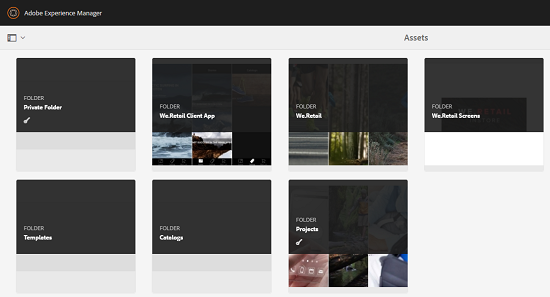

# Persoonlijke map in [!DNL Adobe Experience Manager Assets] {#private-folder}

U kunt een persoonlijke map maken in de [!DNL Adobe Experience Manager Assets] gebruikersinterface die exclusief voor u beschikbaar is. U kunt deze persoonlijke map delen met andere gebruikers en deze gebruikers verschillende rechten geven. Op basis van het machtigingsniveau dat u toewijst, kunnen gebruikers verschillende taken op de map uitvoeren, bijvoorbeeld de middelen in de map weergeven of de elementen bewerken.

>[!NOTE]
>
>De privé omslag heeft minstens één lid met de rol van de Eigenaar.

## Maken en delen van persoonlijke mappen {#create-share-private-folder}

Persoonlijke map maken en delen:

1. Klik in de [!DNL Assets] console op **[!UICONTROL Create]** de werkbalk en kies vervolgens **[!UICONTROL Folder]** in het menu.

   

1. Voer in het **[!UICONTROL Create Folder]** dialoogvenster een titel en naam (optioneel) voor de map in en selecteer **[!UICONTROL Private]** optie.

1. Klik op **[!UICONTROL Create]**. Er wordt een persoonlijke map gemaakt.

   

1. To share the folder with other users and the assign privileges to them, select the folder, and click **[!UICONTROL Properties]** from the toolbar.

   

   >[!NOTE]
   >
   >De map is pas zichtbaar voor andere gebruikers als u deze deelt.

1. In the **[!UICONTROL Folder Properties]** page, select a user from the **[!UICONTROL Add User]** list, assign a role to the user on your private folder, and click **[!UICONTROL Add]**.

   

   >[!NOTE]
   >
   >U kunt verschillende rollen, zoals Editor, Eigenaar of Viewer, toewijzen aan de gebruiker met wie u de map deelt. Als u een rol van de Eigenaar aan de gebruiker toewijst, heeft de gebruiker de voorrechten van Redacteurs op de omslag. Bovendien kan de gebruiker de map met anderen delen. Als u een rol van de Editor toewijst, kan de gebruiker de elementen in uw persoonlijke map bewerken. Als u een viewerrol toewijst, kan de gebruiker alleen de elementen in uw persoonlijke map bekijken.

   >[!NOTE]
   >
   >De privé omslag heeft minstens één lid met de rol van de Eigenaar. Daarom kan de beheerder niet alle eigenaarleden uit een privé omslag verwijderen. Nochtans, om bestaande eigenaars (en beheerder zelf) uit de privé omslag te verwijderen moet de beheerder een andere gebruiker als eigenaar toevoegen.

1. Klik op **[!UICONTROL Save]**. Afhankelijk van de rol die u toewijst, krijgt de gebruiker een reeks rechten toegewezen aan uw persoonlijke map wanneer de gebruiker zich aanmeldt bij [!DNL Assets].
1. Klik **[!UICONTROL Ok]** om het bevestigingsbericht te sluiten.
1. De gebruiker met wie u de map deelt, ontvangt een melding voor delen. Meld u aan [!DNL Assets] met de referenties van de gebruiker om het bericht weer te geven.

   

1. Klik op Meldingen om de lijst met meldingen te openen.

   

1. Klik op de vermelding voor de privémap die door de beheerder wordt gedeeld om de map te openen.

>[!NOTE]
>
>Om een privé omslag tot stand te brengen, vereist u Gelezen en geeft ACL toestemmingen op de ouderomslag uit waaronder u een privé omslag wilt tot stand brengen. Als u geen beheerder bent, worden deze toestemmingen niet toegelaten voor u door gebrek `/content/dam`. In dit geval moet u eerst deze machtigingen voor uw gebruikers-id/groep verkrijgen voordat u probeert persoonlijke mappen te maken of mapinstellingen weer te geven.

## Verwijderen van persoonlijke map {#delete-private-folder}

U kunt een privémap verwijderen door de map te selecteren en de [!UICONTROL Delete] optie in het bovenste menu te selecteren of door de Backspace-toets op het toetsenbord te gebruiken.

### Verwijderen van gebruikersgroep na verwijderen van map {#group-removal-on-folder-deletion}

Als u een privémap verwijdert met de bovenstaande methode uit de gebruikersinterface, worden ook de bijbehorende gebruikersgroepen verwijderd. Bestaande redundante, ongebruikte en automatisch gegenereerde gebruikersgroepen kunnen echter uit de opslagplaats worden opgeschoond met behulp van [JMX](#group-clean-up-jmx).

>[!CAUTION]
>
>Als u een privémap uit CRXDE Lite verwijdert, blijven er overbodige gebruikersgroepen over in de opslagplaats.

### JMX gebruiken om ongebruikte gebruikersgroepen op te schonen {#group-clean-up-jmx}

Opschonen van opslagruimten voor ongebruikte gebruikersgroepen:

1. Open JMX om overtollige groepen voor Activa van te zuiveren `http://[server]:[port]/system/console/jmx/com.day.cq.dam.core.impl.team%3Atype%3DClean+redundant+groups+for+Assets`.

1. Roep de `clean` methode aan vanuit deze JMX.

U ziet dat alle overbodige gebruikersgroepen of de automatisch gegenereerde groepen (die worden gemaakt bij het maken van een privémap met dezelfde naam als een eerder verwijderde groep) uit het pad worden verwijderd `/home/groups/mac/default/<user_name>/<folder_name>`.
