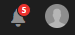

# Persoonlijke map delen {#private-folder-sharing}

U kunt een persoonlijke map maken in de gebruikersinterface van Adobe Experience Manager (AEM) Assets die exclusief voor u beschikbaar is. U kunt deze privémap delen met andere gebruikers en hun verschillende rechten toewijzen. Op basis van het machtigingsniveau dat u toewijst, kunnen gebruikers verschillende taken op de map uitvoeren, bijvoorbeeld de middelen in de map weergeven of de elementen bewerken.

1. Tik in de middelenconsole op de werkbalk op **[!UICONTROL Maken]** of klik op **[!UICONTROL Map]** in het menu.

   

1. Voer in het dialoogvenster Map **** maken een titel en naam (optioneel) voor de map in en selecteer **[!UICONTROL Privé]**.

   

1. Tik/klik op **[!UICONTROL Maken]**. Er wordt een privémap gemaakt in de gebruikersinterface.

   

1. Als u de map wilt delen met andere gebruikers en de gebruikers rechten wilt toewijzen, selecteert u de map en klikt of tikt u op het pictogram **[!UICONTROL Eigenschappen]** op de werkbalk.

   

   >[!NOTE]
   >
   >De map is pas zichtbaar voor andere gebruikers als u deze deelt.

1. Selecteer op de pagina **[!UICONTROL Mapeigenschappen]** een gebruiker in de lijst Gebruiker **** toevoegen, wijs een rol toe aan de gebruiker in uw persoonlijke map en klik op **[!UICONTROL Toevoegen]**.

   

   >[!NOTE]
   >
   >U kunt verschillende rollen, zoals Editor, Eigenaar of Viewer, toewijzen aan de gebruiker met wie u de map deelt. Als u een rol van de Eigenaar aan de gebruiker toewijst, heeft de gebruiker de voorrechten van Redacteurs op de omslag. Bovendien kan de gebruiker de map met anderen delen. Als u een rol van de Editor toewijst, kan de gebruiker de elementen in uw persoonlijke map bewerken. Als u een Viewer-rol toewijst, kan de gebruiker alleen de elementen in uw persoonlijke map bekijken.

1. Click **[!UICONTROL Save]**. Afhankelijk van de rol die u toewijst, wordt aan de gebruiker een reeks rechten toegewezen aan uw persoonlijke map wanneer de gebruiker zich aanmeldt bij AEM Assets.
1. Klik op **[!UICONTROL OK]** om het bevestigingsbericht te sluiten.
1. De gebruiker met wie u de map deelt, ontvangt een melding voor delen. Meld u aan bij AEM Assets met de gegevens van de gebruiker om het bericht te bekijken.

   

1. Tik/klik op het pictogram Melding om de lijst met meldingen te openen.

   

1. Klik of tik op de vermelding voor de privémap die door de beheerder wordt gedeeld om de map te openen.

>[!NOTE]
>
>Om een privé omslag te kunnen tot stand brengen, vereist u Gelezen en geeft ACL toestemmingen op de ouderomslag uit waaronder u een privé omslag wilt tot stand brengen. Als u geen beheerder bent, worden deze toestemmingen niet toegelaten voor u door gebrek `/content/dam`. In dit geval moet u eerst deze machtigingen voor uw gebruikers-id/groep verkrijgen voordat u probeert persoonlijke mappen te maken of mapinstellingen weer te geven.
