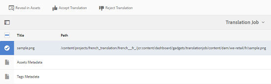

# Verwante activa {#related-assets}

[!DNL Adobe Experience Manager Assets] Hiermee kunt u elementen handmatig koppelen op basis van de behoeften van uw organisatie met behulp van de functie voor verwante elementen. U kunt bijvoorbeeld een licentiebestand koppelen aan een element of aan een afbeelding/video over een vergelijkbaar onderwerp. U kunt elementen die bepaalde algemene kenmerken delen, aan elkaar koppelen. U kunt de eigenschap ook gebruiken om bron/afgeleide verhoudingen tussen activa tot stand te brengen. Als u bijvoorbeeld een PDF-bestand hebt dat is gegenereerd vanuit een INDD-bestand, kunt u het PDF-bestand koppelen aan het INDD-bronbestand.

Met deze functie hebt u de flexibiliteit om een PDF- of JPG-bestand met lage resolutie te delen met leveranciers of agentschappen en het INDD-bestand met hoge resolutie alleen op verzoek beschikbaar te maken.

>[!NOTE] Alleen gebruikers met bewerkingsmachtigingen voor elementen kunnen de elementen releren en de relatie tussen de elementen verbreken.
>

## Relatieve elementen {#relating-assets}

1. Open vanuit de interface Experience Manager de **[!UICONTROL Properties]** pagina voor een element dat u wilt koppelen.

   

   *Afbeelding:[!DNL Assets][!UICONTROL Properties]pagina voor het koppelen van elementen.*

   U kunt ook het element selecteren in de lijstweergave.

   

   U kunt het element ook selecteren in een verzameling.

   

1. Als u een ander element wilt koppelen aan het element dat u hebt geselecteerd, klikt u op het **[!UICONTROL Relate]** pictogram op de werkbalk.

   

1. Voer een van de volgende handelingen uit:

   * Als u het bronbestand voor het element wilt koppelen, selecteert u in de **[!UICONTROL Source]** lijst.
   * Als u een afgeleid bestand wilt koppelen, selecteert u het in de **[!UICONTROL Derived]** lijst.
   * Als u een relatie in twee richtingen tussen de elementen wilt maken, selecteert u deze in de **[!UICONTROL Others]** lijst.
   

1. Navigeer in het **[!UICONTROL Select Asset]** scherm naar de locatie van het element dat u wilt koppelen en selecteer het.

   

1. Klik op het **[!UICONTROL Confirm]** pictogram.
1. Klik **[!UICONTROL OK]** om het dialoogvenster te sluiten. Afhankelijk van uw keuze voor relatie in stap 3 wordt het gerelateerde actief vermeld onder een geschikte categorie in de **[!UICONTROL Related]** sectie. Als het element dat u hebt verwant bijvoorbeeld het bronbestand voor het huidige element is, wordt het onder **[!UICONTROL Source]** weergegeven.

   

1. Als u de koppeling met een element wilt opheffen, klikt u op **[!UICONTROL Unrelate]** de werkbalk.

   

1. Selecteer in het **[!UICONTROL Remove Relations]** dialoogvenster de elementen die u niet wilt koppelen en klik op **[!UICONTROL Unrelate]**.

   

1. Klik **[!UICONTROL OK]** om het dialoogvenster te sluiten. De elementen waarvoor u relaties hebt verwijderd, worden verwijderd uit de lijst met verwante elementen onder de **[!UICONTROL Related]** sectie.

## Verwante elementen vertalen {#translating-related-assets}

Het maken van bron-/afgeleide relaties tussen elementen met de functie Verwante elementen is ook handig in vertaalworkflows. Wanneer u een vertaalworkflow uitvoert op een afgeleid element, worden [!DNL Experience Manager Assets] automatisch alle elementen opgehaald waarnaar het bronbestand verwijst en dat dit element bevat voor vertaling. Op deze manier wordt het element waarnaar door het bronelement wordt verwezen, samen met de bron en afgeleide elementen omgezet. Neem bijvoorbeeld een scenario waarin uw Engelse taalkopie een afgeleid element en het bronbestand van dat element bevat, zoals wordt weergegeven.

Als het bronbestand verwant is aan een ander element, [!DNL Experience Manager Assets] wordt het element waarnaar wordt verwezen opgehaald en opgenomen voor vertaling.

*Afbeelding: Bronactiva van de gerelateerde activa die voor vertaling moeten worden opgenomen.*

1. Vertaal de elementen in de bronmap naar een doeltaal door de stappen in [Een nieuw vertaalproject](translation-projects.md#create-a-new-translation-project)maken uit te voeren. In dit geval vertaalt u uw middelen bijvoorbeeld naar het Frans.

1. Open vanuit de [!UICONTROL Projects] pagina de vertaalmap.

   

1. Klik op de projecttegel om de detailpagina te openen.

   

1. Klik op de ovalen onder de Vertaal-taakkaart om de vertaalstatus weer te geven.

   

1. Selecteer het element en klik vervolgens op **[!UICONTROL Reveal in Assets]** de werkbalk om de vertaalstatus voor het element weer te geven.

   

1. Klik op het bronelement om te controleren of de aan de bron gerelateerde elementen zijn omgezet.

   

1. Selecteer het element dat betrekking heeft op de bron en klik op **[!UICONTROL Reveal in Assets]**. Het vertaalde gerelateerde element wordt weergegeven.

   
