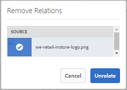

# Verwante activa {#related-assets}

De activa van de Manager van de Ervaring van Adobe (AEM) laten u activa manueel met elkaar in verband brengen die op de behoeften van uw organisatie worden gebaseerd gebruikend de verwante activa eigenschap. Bijvoorbeeld, kunt u een vergunningsdossier met activa of een beeld/een video op een gelijkaardig onderwerp betrekking hebben. U kunt activa met elkaar in verband brengen die bepaalde gemeenschappelijke attributen delen. U kunt de eigenschap ook gebruiken om bron/afgeleid verband tussen activa tot stand te brengen. Bijvoorbeeld, als u een Pdf- dossier hebt dat van een INDD dossier wordt geproduceerd, kunt u het Pdf- dossier met zijn bronINDD dossier in verband brengen.

Gebruikend deze eigenschap, hebt u de flexibiliteit om een laag resolutiePdf- dossier of een JPG- dossier met verkopers of agentschappen te delen en het hoge resolutieINDD- dossier ter beschikking te stellen slechts op verzoek.

>[!NOTE] De gebruikers met geven toestemmingen uit kunnen activa met elkaar in verband brengen en losmaken.
>

## Relevante activa {#relating-assets}

1. Van de interface AEM, open de pagina van [!UICONTROL Eigenschappen] voor activa die u wilt betrekking hebben.

   

   Alternatief, selecteer de activa van de lijstmening.

   

   U kunt de activa van een inzameling ook selecteren.

   

1. Om een andere activa met de activa te relateren selecteerde u, klik/tik het **[!UICONTROL Relate]** pictogram van de toolbar.

   

1. Voer een van de volgende handelingen uit:

   * Om het brondossier voor de activa, uitgezochte **[!UICONTROL Bron]** van de lijst met elkaar in verband te brengen.
   * Om een afgeleid dossier met elkaar in verband te brengen, selecteer **[!UICONTROL Voortgekomen]** uit de lijst.
   * Om een bidirectionele verhouding tussen de activa tot stand te brengen, selecteer **[!UICONTROL anderen]** van de lijst.
   

1. Van het **[!UICONTROL Uitgezochte scherm van Activa]** , navigeer aan de plaats van de activa u, het wilt met elkaar in verband brengen en selecteren.

   

1. Klik/tik het pictogram **[!UICONTROL bevestigen]** .
1. Klik/tik op **[!UICONTROL OK]** om het dialoogvenster te sluiten. Afhankelijk van uw keuze van relatie in stap 3, wordt het gerelateerde actief vermeld onder een geschikte categorie in de **[!UICONTROL Verwante]** sectie. Bijvoorbeeld, als de activa u verwant het brondossier voor de huidige activa is, is het vermeld onder **[!UICONTROL Bron]**.

   

1. Als u de koppeling tussen een element wilt opheffen, klikt u op/tikt u op **[!UICONTROL Onverwant maken]** op de werkbalk.

   

1. Selecteer de elementen die u wilt loskoppelen van het dialoogvenster **[!UICONTROL Relaties]** verwijderen en klik op **[!UICONTROL Onverwant]**.

   

1. Klik/Tik **[!UICONTROL O.K]** om de dialoog te sluiten. De activa waarvoor u relaties hebt verwijderd, worden verwijderd uit de lijst van gerelateerde activa in de **[!UICONTROL Verwante]** sectie.

## Vertaalgerelateerde bedrijfsmiddelen {#translating-related-assets}

Het creëren van bron/afgeleid verband tussen activa die de Verwante eigenschap van Activa gebruiken is ook nuttig in vertaalwerkschema&#39;s. Wanneer u een vertaalwerkschema op een afgeleid activa in werking stelt, haalt de Activa AEM automatisch om het even welke activa die de brondossierverwijzingen en omvat het voor vertaling. Op deze manier wordt het actief waarnaar wordt verwezen door het bronactief vertaald samen met de bron en de afgeleide activa. Bijvoorbeeld, overweeg een scenario waar uw Engels taalexemplaar een afgeleid activa en zijn brondossier zoals getoond omvat.

Als het brondossier met een andere activa verwant is, haalt de Activa AEM het referenced activa en omvat het voor vertaling.

1. Vertaal de activa in de bronomslag aan een doeltaal door de stappen in te volgen [creeer een nieuw vertaalproject](translation-projects.md#create-a-new-translation-project). In dit geval bijvoorbeeld, vertaal uw activa naar het Frans.
1. Van de pagina van [!UICONTROL Projecten] , open de vertaalomslag.

   

1. Klik/Tik de projectegel om de detailspagina te openen.

   

1. Klik/tik op de ellipsen onder de Vertaal-taakkaart om de vertaalstatus te bekijken.

   

1. Selecteer de activa en klik/tik **[!UICONTROL openbaart in Activa]** van de toolbar om de vertaalstatus voor de activa te bekijken.

   

1. Om te verifiëren of de activa met betrekking tot de bron zijn vertaald, klik/tik de bronactiva.

   

1. Selecteer de activa die met de bron verwant zijn, en klik/tik **[!UICONTROL openbaart in Activa]** dan. Het vertaalde gerelateerde element wordt weergegeven.

   
