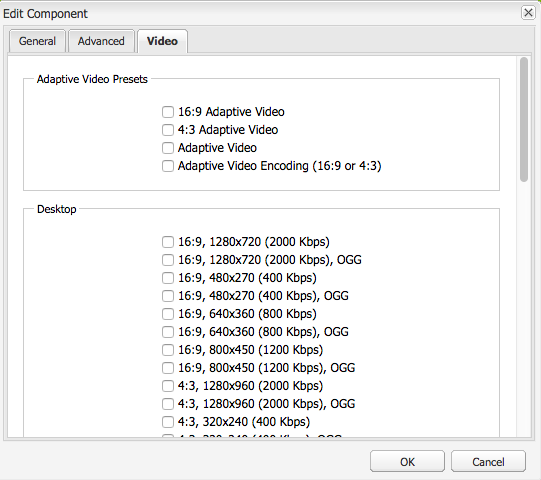
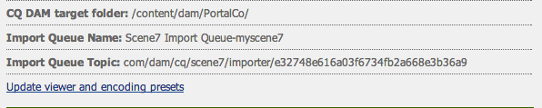

# Video {#video}

Middelen voorzien voor gecentraliseerd videobeheer van activa waar u video&#39;s aan Activa voor auto-codering aan Dynamic Media Klassiek (Scene7) kunt direct uploaden en tot Dynamic Media Klassieke video&#39;s van Activa voor paginaontwerp toegang hebben.

Dynamic Media Klassieke videointegratie breidt het bereik van geoptimaliseerde video tot alle schermen (automatische apparaat en bandbreedtedetectie) uit.

* De **[!UICONTROL Scene7 Video]** component voert automatisch apparaat- en bandbreedtedetectie uit om de juiste indeling en videokwaliteit van de juiste kwaliteit af te spelen op desktopcomputers, tablets en mobiele apparaten.
* Elementen - U kunt adaptieve videosets opnemen in plaats van alleen afzonderlijke video-elementen. Een adaptieve videoset is een container voor alle video-uitvoeringen die nodig zijn om video naadloos af te spelen op meerdere schermen. Een adaptieve videoreeks groepeert versies van de zelfde video die bij verschillende beetjetarieven en formaten zoals 400 kbps, 800 kbps, en 1000 kbps worden gecodeerd. U gebruikt een adaptieve videoset, samen met de S7-videocomponent, voor adaptieve videostreaming op meerdere schermen, zoals desktops, iOS, Android, Blackberry en mobiele Windows-apparaten. Zie [documentatie Scene7 over adaptieve videoreeksen voor meer informatie](https://help.adobe.com/en_US/scene7/using/WS53492AE1-6029-45d8-BF80-F4B5CF33EB08.html).

## Info over FFMPEG en Dynamic Media Classic {#about-ffmpeg-and-scene}

Het standaardvideocoderingsproces is gebaseerd op het gebruik van de op FFMPEG gebaseerde integratie met videoprofielen. Daarom bevat de uit-van-de-doos workflow voor DAM-opname de volgende twee op ffmpeg gebaseerde workflowstappen:

* FMPEG-miniaturen
* FFMPEG-codering

Houd er rekening mee dat het inschakelen en configureren van de Dynamic Media Classic-integratie deze twee workflowstappen niet automatisch verwijdert of deactiveert uit de workflow voor het innemen van DAM-bestanden. Als u al gebruik maakt van de op FFMPEG gebaseerde videocodering in AEM, is het waarschijnlijk dat FFMPEG is geïnstalleerd in uw ontwerpomgeving. In dit geval wordt een nieuwe video die met DAM wordt ingevoerd, twee keer gecodeerd: eenmaal van de FFMPEG-encoder en eenmaal van Dynamic Media Classic integration.

Als u de op FFMPEG gebaseerde videocodering in AEM hebt geconfigureerd en FFMPEG hebt geïnstalleerd, raadt Adobe u aan de twee FFMPEG-workflows te verwijderen uit uw DAM-inlaatworkflows.

## Ondersteunde indelingen {#supported-formats}

De volgende formaten worden gesteund voor de Video component Scene7:

* F4V H.264
* MP4 H.264

## Bepalen waar uw video moet worden geüpload {#deciding-where-to-upload-your-video}

Bepaal waar u uw video-elementen wilt uploaden afhankelijk van het volgende:

* Hebt u een workflow voor het video-element nodig?
* Hebt u versiebeheer nodig voor het video-element?

Als het antwoord op een van deze vragen &quot;ja&quot; is, uploadt u uw video rechtstreeks naar Adobe DAM. Als het antwoord op beide vragen &#39;nee&#39; is, uploadt u uw video rechtstreeks naar Dynamic Media Classic. Het werkschema voor elk scenario wordt beschreven in de volgende sectie.

### Als u de video rechtstreeks uploadt naar Adobe DAM {#if-you-are-uploading-your-video-directly-to-adobe-dam}

Als u een workflow of versie voor uw middelen nodig hebt, moet u deze eerst uploaden naar Adobe DAM. Hieronder vindt u de aanbevolen workflow:

1. Upload de video-elementen naar Adobe DAM en codeer en publiceer deze automatisch naar Dynamic Media Classic.
1. Open in AEM video-elementen op het **[!UICONTROL Movies]** tabblad Inhoud van de Inhoudszoeker in WCM.
1. Auteur met **[!UICONTROL Scene7 Video]** of **[!UICONTROL Foundation Video]** component.

### Als u uw video aan Scene7 uploadt {#if-you-are-uploading-your-video-to-scene}

Als u geen werkschema of een versie voor uw activa nodig hebt, zou u uw activa aan Scene7 moeten uploaden. Hieronder vindt u de aanbevolen workflow:

1. In Dynamic Media Classic, [opstelling een geplande FTP uploadend en het coderen aan Scene7 (systeem geautomatiseerd)](https://help.adobe.com/en_US/scene7/using/WS70B173EC-4CAD-4b4c-BF9C-43A11F3A5950.html).
1. Open in AEM video-elementen op het **[!UICONTROL Scene7]** tabblad Inhoud van de Inhoudszoeker in WCM.
1. Auteur met de **[!UICONTROL Scene7 Video]** component.

## Het vormen Integratie met Video Scene7 {#configuring-integration-with-scene-video}

Universele voorinstellingen configureren:

1. Navigeer in **[!UICONTROL Cloud Services]** naar de **[!UICONTROL Scene7]** configuratie en klik op **[!UICONTROL Edit]**.
1. Selecteer het **[!UICONTROL Video]** tabblad.

   

   >[!NOTE]
   >
   >Het **[!UICONTROL Video]** tabblad wordt niet weergegeven als de pagina geen cloudconfiguratie heeft.

1. Selecteer het adaptieve videocoderingsprofiel, een uit-van-de-doos enig videocoderingsprofiel, of een profiel van de douanevideocodering.

   >[!NOTE]
   >
   >Raadpleeg de Klassieke documentatie bij [Dynamic Media voor meer informatie over wat de videovoorinstellingen betekenen](https://help.adobe.com/en_US/scene7/using/WSE86ACF2B-BD50-4c48-A1D7-9CD4405B62D0.html).
   >
   >Adobe raadt u aan beide adaptieve videosets te selecteren wanneer u de universele voorinstellingen configureert of de **[!UICONTROL Adaptive Video Encoding]** optie te selecteren.

1. De geselecteerde coderingsprofielen worden automatisch toegepast op alle video&#39;s die zijn geüpload naar de CQ DAM-doelmap die u hebt ingesteld voor deze Scene7-cloudconfiguratie. U kunt veelvoudige Scene7 wolkenconfiguraties met verschillende doelomslagen plaatsen om verschillende het coderen profielen toe te passen zoals nodig.

## Voorinstellingen voor viewers en codering bijwerken {#updating-viewer-and-encoding-presets}

Als u de kijker en het coderen vooraf instelt voor video in AEM moet bijwerken omdat vooraf instelt in Scene7 zijn bijgewerkt, navigeer aan de configuratie Scene7 in de wolkenconfiguratie en klik **[!UICONTROL Update the viewer and encoding presets]**.

## Uploaden van uw primaire bronvideo naar Scene7 vanuit Adobe DAM {#uploading-your-master-video}

1. Navigeer naar de CQ DAM doelomslag waar u opstelling uw wolkenconfiguratie met Scene7 het coderen profielen hebt.
1. Klik **[!UICONTROL Upload]** om primaire bronvideo te uploaden. Het uploaden en coderen van video is voltooid nadat de [!UICONTROL DAM Update Asset] workflow is voltooid en een vinkje **[!UICONTROL Publish to Scene7]** heeft.

   >[!NOTE]
   >
   >Het kan enige tijd duren voordat de videominiaturen zijn gegenereerd.

   Het slepen van de primaire bronvideo DAM op de videocomponent heeft toegang tot *alle* gecodeerde Scene7 volmachtsvertoningen voor levering.

## De VideoComponent van de stichting tegenover Video Scene7 Component {#foundation-video-component-versus-scene-video-component}

Wanneer het gebruiken van AEM, hebt u toegang tot zowel de Video component beschikbaar in Plaatsen als de videocomponent Scene7. Deze componenten zijn niet onderling verwisselbaar.

De videocomponent Scene7 werkt slechts voor Scene7 video&#39;s. De stichtingscomponent werkt met video&#39;s die van AEM (het gebruiken van mpeg) en Scene7 video&#39;s worden opgeslagen.

De volgende matrix legt uit wanneer u welke component moet gebruiken:

>[!NOTE]
>
>De videocomponent S7 gebruikt het universele videoprofiel uit het vak. U kunt HTML5-Gebaseerde videospeler voor gebruik door AEM echter verkrijgen door één van het volgende in Scene7 te doen: Kopieer de insluitcode van de uit-van-doos HTML5 videospeler en zet het in uw AEM pagina.

## AEM-videocomponent {#aem-video-component}

Zelfs als het gebruiken van de videocomponent Scene7 voor het bekijken van Scene7 video&#39;s wordt geadviseerd, beschrijft deze sectie het gebruiken van video Scene7 met de Component van de Video van de Stichting in AEM, voor volledigheid.

### AEM Video en Scene7 Video vergelijking {#aem-video-and-scene-video-comparison}

De volgende lijst verstrekt een high level vergelijking van gesteunde mogelijkheden tussen de component van de Stichting AEM en de Videocomponent Scene7:

|  | Video over AEM Foundation | Scene7-video |
|---|---|---|
| Benadering | De eerste HTML5-aanpak. Flash wordt alleen gebruikt voor andere fallback dan HTML5. | Flash op de meeste desktops. HTML5 wordt gebruikt voor mobiele apparaten en tablets. |
| Aflevering | Progressief | Adaptieve streaming |
| Tekstspatiëring | Ja | Ja |
| Uitbreidbaarheid | Ja | Ja (met Scene7 viewer SDK) |
| Mobiele video | Ja | Ja |

### Instellen {#setting-up}

#### Videoprofielen maken {#creating-video-profiles}

De verschillende videocoderingen worden gecreeerd volgens de S7 coderende voorinstellingen die in S7 wolkenconfig worden geselecteerd. Als u van de basis-videocomponent wilt gebruikmaken, moet u een videoprofiel maken voor elke geselecteerde S7-coderingsvoorinstelling. Hierdoor kan de video-component de DAM-uitvoeringen dienovereenkomstig selecteren.

>[!NOTE]
>
>Nieuwe videoprofielen en wijzigingen ervan moeten worden geactiveerd om te publiceren.

1. Tik in AEM op **[!UICONTROL Tools > Configuration Console**.
1. Navigeer in de **[!UICONTROL Configuration Console]** navigatiestructuur naar **[!UICONTROL Tools > DAM > Video Profiles]** de navigatiestructuur.
1. Maak een nieuw S7-videoprofiel. In het **[!UICONTROL New...]** menu, selecteer **[!UICONTROL Create Page]** en selecteer dan het malplaatje van het Profiel Scene7 Video. Geef de nieuwe pagina met videoprofielen een naam en klik op **[!UICONTROL Create]**.

   

1. Bewerk het nieuwe videoprofiel. Selecteer eerst de cloud config. Selecteer vervolgens dezelfde coderingsvoorinstelling die u in de cloudconfiguratie hebt geselecteerd.

   

   | Eigenschap | Beschrijving |
   |---|---|
   | Scene7 Cloud Config | De cloud config die voor de coderingsvoorinstellingen moet worden gebruikt. |
   | Scene7-coderingsvoorinstelling | De coderingsvoorinstelling waarmee dit videoprofiel wordt toegewezen. |
   | HTML5-videotype | Met deze eigenschap kunt u de waarde instellen van de eigenschap type van het bronelement van de HTML5-video. Deze informatie wordt niet verschaft door de S7-coderingsvoorinstellingen, maar is vereist voor het correct renderen van video&#39;s met HTML5-video-element. Er is een lijst met algemene indelingen beschikbaar, maar deze lijst kan worden overschreven voor andere indelingen. |

   Herhaal deze stap voor alle coderingsvoorinstellingen die zijn geselecteerd in de cloudconfiguratie die u wilt gebruiken in de videocomponent.

#### Ontwerp configureren {#configuring-design}

De **[!UICONTROL Foundation Video]** component moet weten welke videoprofielen moeten worden gebruikt om de lijst met videobronnen te maken. U moet het dialoogvenster Ontwerp van videocomponenten openen en het componentontwerp configureren voor het gebruik van de nieuwe videoprofielen.

>[!NOTE]
>
>Als u de **[!UICONTROL Foundation Video]** component op een mobiele pagina gebruikt, moet u deze stappen mogelijk herhalen bij het ontwerp van de mobiele pagina.

>[!NOTE]
>
>Wijzigingen in het ontwerp vereisen activering van het ontwerp om van kracht te worden bij de publicatie.

1. Open het dialoogvenster Ontwerp van de **[!UICONTROL Foundation Video]** component en wijzig deze in het **[!UICONTROL Profiles]** tabblad. Verwijder vervolgens de out-of-the-box profielen en voeg de nieuwe S7-videoprofielen toe. De volgorde van de profiellijst in het dialoogvenster Ontwerp bepaalt de volgorde van het element Videobronnen bij het renderen.
1. Voor browsers die geen HTML5 ondersteunen, kunt u met de videocomponent een Flash-fallback configureren. Open het dialoogvenster Ontwerp van de videocomponenten en wijzig dit naar het **[!UICONTROL Flash]** tabblad. Configureer de Flash Player-instellingen en wijs een fallback-profiel toe aan de Flash Player.

#### Checklist {#checklist}

1. Creeer een S7 wolkenconfiguratie. Zorg ervoor dat de voorinstellingen voor videocodering zijn ingesteld en dat de importmodule wordt uitgevoerd.
1. Maak een S7-videoprofiel voor elke videocoderingsvoorinstelling die is geselecteerd in de cloudconfiguratie.
1. De videoprofielen moeten worden geactiveerd.
1. Configureer het ontwerp van de **[!UICONTROL oundation Video]** component op de pagina.
1. Activeer het ontwerp nadat u klaar bent met uw ontwerpwijzigingen.

