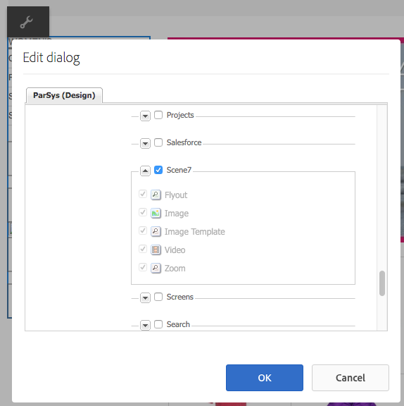
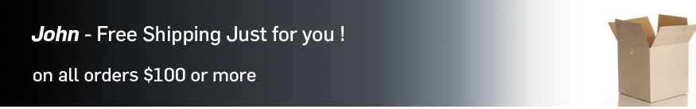
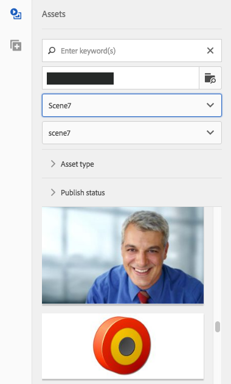
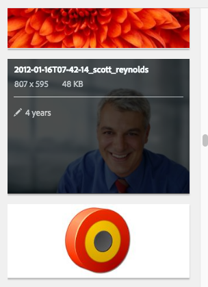

# Klassieke Dynamic Media-functies toevoegen aan uw pagina {#adding-scene-features-to-your-page}

[Adobe Dynamic Media Classic](https://help.adobe.com/en_US/scene7/using/WS26AB0D9A-F51C-464e-88C8-580A5A82F810.html) is een gehoste oplossing voor het beheren, verbeteren, publiceren en leveren van rijke mediabestanden aan webpagina&#39;s, mobiele apparaten, e-mailprogramma&#39;s en displays en drukapparaten met internetverbinding.

U kunt AEM-elementen die zijn gepubliceerd in Dynamic Media Classic, in verschillende viewers weergeven:

* In-/uitzoomen
* Flyout
* Video
* Afbeeldingssjabloon
* Afbeelding

U kunt digitale elementen rechtstreeks van AEM naar Dynamic Media Classic publiceren en u kunt digitale elementen van Dynamic Media Classic naar AEM publiceren.

In dit document wordt beschreven hoe u digitale elementen van AEM naar Dynamic Media Classic kunt publiceren en andersom. Viewers worden ook in detail beschreven. Voor informatie bij het vormen van AEM voor Dynamic Media Klassiek, zie het [Integreren van Dynamic Media Klassiek met AEM](/help/sites-administering/scene7.md).

Zie ook Afbeeldingskaarten [toevoegen](image-maps.md).

Zie [Video](video.md)voor meer informatie over het gebruik van videocomponenten met AEM.

>[!NOTE]
>
>Als de Klassieke elementen van Dynamic Media niet behoorlijk tonen, zorg ervoor dat de Dynamische media wordt [onbruikbaar gemaakt](config-dynamic.md#disabling-dynamic-media) en vernieuw dan de pagina.

## Handmatig publiceren naar Dynamic Media Classic op basis van elementen {#manually-publishing-to-scene-from-assets}

U kunt digitale elementen als volgt naar Dynamic Media Classic publiceren:

* [In de klassieke gebruikersinterface van de middelenconsole](/help/sites-classic-ui-authoring/manage-assets-classic-s7.md#publishing-from-the-assets-console)
* [In de klassieke gebruikersinterface van een element](/help/sites-classic-ui-authoring/manage-assets-classic-s7.md#publishing-from-an-asset)
* [In de klassieke gebruikersinterface van buiten de CQ Target-map](/help/sites-classic-ui-authoring/manage-assets-classic-s7.md#publishing-assets-from-outside-the-cq-target-folder)

>[!NOTE]
>
>AEM publiceert asynchroon naar Dynamic Media Classic. Nadat u hebt geklikt, kan het enkele seconden duren voordat uw element naar Dynamic Media Classic wordt gepubliceerd. **[!UICONTROL Publish]**

## Dynamic Media Klassieke componenten {#scene-components}

De volgende Dynamic Media Klassieke componenten zijn beschikbaar in AEM:

* In-/uitzoomen
* Flyout (zoomen)
* Afbeeldingssjabloon
* Afbeelding
* Video

>[!NOTE]
>
>Deze componenten zijn niet standaard beschikbaar en moeten in de **[!UICONTROL Design]** modus worden geselecteerd voordat ze kunnen worden gebruikt.

Nadat ze in de **[!UICONTROL Design]** modus beschikbaar zijn gemaakt, kunt u de componenten net als alle andere AEM-componenten aan de pagina toevoegen. Elementen die nog niet zijn gepubliceerd naar Dynamic Media Klassiek worden gepubliceerd naar Dynamic Media Klassiek als deze zich in een gesynchroniseerde map of op een pagina bevinden of met een Classic-cloudconfiguratie van Dynamic Media.

>[!NOTE]
>
>Als u aangepaste viewers maakt en ontwikkelt en de Inhoudszoeker gebruikt, moet u de **[!UICONTROL allowfullscreen]** parameter expliciet toevoegen.

### Kennisgeving over de gebruiksduur van Flash-viewers {#flash-viewers-end-of-life-notice}

Vanaf 31 januari 2017 wordt ondersteuning voor het Flash-viewerplatform door Adobe Dynamic Media Classic beëindigd.

Zie [Flash Viewer End-of-Life-veelgestelde vragen voor meer informatie over deze belangrijke wijziging](https://docs.adobe.com/content/docs/en/aem/6-1/administer/integration/marketing-cloud/scene7/flash-eol.html).

### Een klassieke Dynamic Media-component (Scene7) toevoegen aan een pagina {#adding-a-scene-component-to-a-page}

Het toevoegen van een Dynamic Media Klassieke (Scene7) component aan een pagina is het zelfde als het toevoegen van een component aan om het even welke pagina. Dynamic Media Klassieke componenten worden in de volgende secties uitgebreid beschreven.

**Een klassieke component van Dynamic Media (Scene7) aan een pagina toevoegen**

1. Open in AEM de pagina waaraan u de component Dynamic Media Classic (Scene7) wilt toevoegen.

1. Als er geen Dynamic Media Klassieke componenten beschikbaar zijn, klikt u op de **[!UICONTROL Design]** modus, tikt u op een component met een blauwe rand, tikt u op het **[!UICONTROL Parent]** pictogram en vervolgens op het **[!UICONTROL Configuration]** pictogram. Selecteer **[!UICONTROL Parsys (Design)]** in de lijst alle Dynamic Media Klassieke componenten om deze beschikbaar te maken en klik op **[!UICONTROL OK]**.

   

1. Klik **[!UICONTROL Edit]** om terug te keren naar de **[!UICONTROL Edit]** modus.

1. Sleep een component van de Klassieke groep van Dynamic Media in sidekick op de pagina in de gewenste plaats.

1. Klik op het **[!UICONTROL Configuration]** pictogram om de component te openen.

1. Bewerk de component naar wens en klik **[!UICONTROL OK]** om de wijzigingen op te slaan.
1. Sleep de afbeelding of video van de inhoudbrowser naar de klassieke Dynamic Media-component die u aan de pagina hebt toegevoegd.

   >[!NOTE]
   >
   >Alleen in UI-aanraking moet u de afbeelding of video slepen en neerzetten op het klassieke Dynamic Media-onderdeel dat u op de pagina hebt geplaatst. Het selecteren en bewerken van de Klassieke component Dynamic Media en vervolgens het kiezen van het element worden niet ondersteund.

### Interactieve weergaven toevoegen aan een responsieve site {#adding-interactive-viewing-experiences-to-a-responsive-website}

Het responsieve ontwerp voor uw middelen betekent dat uw middelen worden aangepast afhankelijk van waar ze worden weergegeven. Bij een responsief ontwerp kunnen dezelfde elementen effectief op meerdere apparaten worden weergegeven.

Zie ook [Responsief ontwerp voor webpagina&#39;s](/help/sites-developing/responsive.md).

**Een interactieve kijkervaring toevoegen aan een responsieve site**

1. Meld u aan bij AEM en controleer of u Adobe Dynamic Media Classic Cloud Servicen [hebt](/help/sites-administering/scene7.md#configuring-scene-integration) geconfigureerd en of Dynamic Media Classic-componenten beschikbaar zijn.

   >[!NOTE]
   >
   >Als de Klassieke componenten van Dynamic Media niet beschikbaar zijn, ben zeker [om hen als wijze](/help/sites-authoring/default-components-designmode.md)van het Ontwerp toe te laten.

1. In een website waarvoor de **[!UICONTROL Dynamic Media Classic]** componenten zijn ingeschakeld, sleept u een **[!UICONTROL Image]** component naar de pagina.
1. Selecteer de component en tik op het configuratiepictogram.
1. Pas op het **[!UICONTROL Dynamic Media Classic Settings]** tabblad de onderbrekingspunten aan.

   

1. Controleer of de viewers het formaat responsief wijzigen en of alle interacties zijn geoptimaliseerd voor computers, tablets en mobiele apparaten.

### Instellingen die worden gebruikt voor alle Dynamic Media Klassieke componenten {#settings-common-to-all-scene-components}

Hoewel de configuratieopties variëren, zijn het volgende gemeenschappelijk voor alle [!UICONTROL Dynamic Media Classic] componenten:

* **[!UICONTROL File Reference]** - Blader naar een bestand waarnaar u wilt verwijzen. De verwijzing van het dossier toont activa URL en niet noodzakelijk de volledige Dynamic Media Klassieke URL met inbegrip van de bevelen URL en de parameters. U kunt in dit veld geen klassieke URL-opdrachten en -parameters voor Dynamic Media toevoegen. Ze moeten worden toegevoegd via de bijbehorende functionaliteit in de component.
* **[!UICONTROL Width]** - Hiermee kunt u de breedte instellen.
* **[!UICONTROL Height]** - Hiermee kunt u de hoogte instellen.

U stelt deze configuratieopties in door bijvoorbeeld een Klassieke Dynamic Media-component te openen (dubbelklikken) wanneer u een **[!UICONTROL Zoom]** component opent:

### In-/uitzoomen {#zoom}

De component HTML5 Zoom geeft een grotere afbeelding weer wanneer u op de **[!UICONTROL +]** knop drukt.

Het element heeft onderaan zoomgereedschappen. Tik **[!UICONTROL +]** om te vergroten. Tik **[!UICONTROL -]** om te reduceren. Als u op de zoompijl voor opnieuw instellen **[!UICONTROL x]** of op de zoompijl voor opnieuw instellen tikt, wordt de oorspronkelijke grootte van de afbeelding hersteld. Tik op de diagonale pijlen om deze volledig scherm te maken. Tik **[!UICONTROL Edit]** om de component te configureren. Met deze component, kunt u [montages gemeenschappelijk voor alle [!UICONTROL Dynamic Media Klassieke] componenten](#settings-common-to-all-scene-components)vormen.

### Flyout {#flyout}

In de HTML5- **[!UICONTROL Flyout]** component wordt het element weergegeven als gesplitst scherm. het element in de opgegeven grootte laten staan; rechts wordt het zoomgedeelte weergegeven. Tik **[!UICONTROL Edit]** om de component te configureren. Met deze component, kunt u [montages vormen gemeenschappelijk voor alle Dynamic Media Klassieke componenten](#settings-common-to-all-scene-components).

>[!NOTE]
>
>Als de **[!UICONTROL Flyout]** component een aangepaste grootte gebruikt, wordt die aangepaste grootte gebruikt en wordt de responsieve instelling van de component uitgeschakeld.
>
>Als de **[!UICONTROL Flyout]** component de standaardgrootte gebruikt, zoals in de **[!UICONTROL Design View]** component is ingesteld, wordt de standaardgrootte gebruikt en wordt de component uitgerekt om de paginalay-outgrootte aan te passen met responsieve instelling van de component ingeschakeld. Houd er echter rekening mee dat er een beperking geldt voor de responsieve installatie van de component. Wanneer u de **[!UICONTROL Flyout]** component met responsieve opstelling gebruikt, zou u het niet met volledige paginalrek moeten gebruiken. Anders **[!UICONTROL Flyout]** kan de pagina de rechterrand overschrijden.

### Image {#image}

Met de Klassieke **[!UICONTROL Image]** component Dynamic Media kunt u Klassieke Dynamic Media-functionaliteit toevoegen aan uw afbeeldingen, zoals Dynamic Media Klassieke modifiers, voorinstellingen voor afbeeldingen of viewers en verscherpen. De Klassieke **[!UICONTROL Image]** component Dynamic Media is vergelijkbaar met andere afbeeldingscomponenten in AEM met speciale Klassieke functionaliteit voor Dynamic Media. In dit voorbeeld is de optie Klassieke URL van Dynamic Media op de afbeelding `&op_invert=1` toegepast.

**[!UICONTROL Title, Alt Text]** - Voeg op het **[!UICONTROL Advanced]** tabblad een titel toe aan de afbeelding en alternatieve tekst voor gebruikers met afbeeldingen uitgeschakeld.

**[!UICONTROL URL, Open in]** - U kunt een element instellen van om een koppeling te openen. Stel de opties in **[!UICONTROL URL]** en geef aan **[!UICONTROL Open in]** of u deze wilt openen in hetzelfde venster of in een nieuw venster.

**[!UICONTROL Viewer preset]** - Selecteer een bestaande viewervoorinstelling in het keuzemenu. Als de viewervoorinstelling die u zoekt niet zichtbaar is, moet u deze mogelijk zichtbaar maken. Zie Voorinstellingen [van viewers](/help/assets/managing-viewer-presets.md)beheren. U kunt geen viewervoorinstelling selecteren als u een voorinstelling voor afbeeldingen gebruikt en andersom.

**[!UICONTROL Dynamic Media Classic Configuration]** - Selecteer de Klassieke configuratie van Dynamic Media u wilt gebruiken om actieve beeldvoorinstellingen van SPS te halen.

**[!UICONTROL Image preset]** - Selecteer een bestaande voorinstelling voor de afbeelding in het keuzemenu. Als de voorinstelling die u zoekt niet zichtbaar is, moet u deze mogelijk zichtbaar maken. Zie [Voorinstellingen](/help/assets/managing-image-presets.md)voor afbeeldingen beheren. U kunt geen viewervoorinstelling selecteren als u een voorinstelling voor afbeeldingen gebruikt en andersom.

**[!UICONTROL Output Format]** - Selecteer de uitvoerindeling van de afbeelding, bijvoorbeeld JPEG. Afhankelijk van de uitvoerindeling die u selecteert, hebt u mogelijk aanvullende configuratieopties. Zie Aanbevolen werkwijzen [voor voorinstellingen](/help/assets/managing-image-presets.md#image-preset-options)afbeelding.

**[!UICONTROL Sharpening]** - Selecteer hoe u de afbeelding wilt verscherpen. Verscherpen wordt gedetailleerd uitgelegd in de aanbevolen werkwijzen [voor](/help/assets/managing-image-presets.md#image-preset-options) voorinstellingen van afbeeldingen en in de aanbevolen werkwijzen [voor](/help/assets/assets/s7_sharpening_images.pdf)Verscherpen.

**[!UICONTROL URL Modifiers]** - U kunt afbeeldingseffecten wijzigen door extra opdrachten voor klassieke Dynamic Media op te geven. Deze worden beschreven in Voorinstellingen  afbeelding en de [opdrachtverwijzing](https://marketing.adobe.com/resources/help/en_US/s7/is_ir_api/is_api/http_ref/c_command_reference.html).

**[!UICONTROL Breakpoints]** - Als uw website reageert, wilt u de onderbrekingspunten aanpassen. Onderbrekingspunten moeten worden gescheiden door komma&#39;s ( , ).

### Afbeeldingssjabloon {#image-template}

[Klassieke Dynamic Media-afbeeldingssjablonen](https://help.adobe.com/en_US/scene7/using/WS60B68844-9054-4099-BF69-3DC998A04D3C.html) zijn gelaagde Photoshop-inhoud die is geïmporteerd naar Dynamic Media Classic, waar de parameters voor inhoud en eigenschappen werden bepaald op basis van variabiliteit. Met de **[!UICONTROL Image template]** component kunt u afbeeldingen importeren en de tekst dynamisch wijzigen in AEM. Bovendien kunt u de **[!UICONTROL Image template]** component vormen om waarden van cliëntcontext te gebruiken, zodat elke gebruiker het beeld op een gepersonaliseerde manier ervaart.

Tik **[!UICONTROL Edit]** om de component te configureren. U kunt [montages vormen gemeenschappelijk voor alle Dynamic Media Klassieke componenten](#settings-common-to-all-scene-components) evenals andere montages die in deze sectie worden beschreven.

**[!UICONTROL File Reference, Width, Height]** - Zie montages gemeenschappelijk voor alle componenten ScDynamic Media Classicene7.

>[!NOTE]
>
>Dynamic Media Klassieke URL-opdrachten en -parameters kunnen niet rechtstreeks aan de URL van de bestandsverwijzing worden toegevoegd. Ze kunnen alleen worden gedefinieerd in de gebruikersinterface van de component in het **[!UICONTROL Parameter]** deelvenster.

**[!UICONTROL Title, Alt Text]** - Voeg op het tabblad Klassieke afbeeldingssjabloon van Dynamic Media een titel toe aan de afbeelding en alternatieve tekst voor gebruikers die afbeeldingen hebben uitgeschakeld.

**[!UICONTROL URL, Open in]** - U kunt een element instellen van om een koppeling te openen. Stel de URL in en kies Openen in om aan te geven of deze in hetzelfde venster of in een nieuw venster moet worden geopend.

**[!UICONTROL Parameter Panel]** - Wanneer u een afbeelding importeert, worden de parameters vooraf gevuld met informatie uit de afbeelding. Als er geen inhoud is die dynamisch kan worden gewijzigd, is dit venster leeg.

#### Tekst dynamisch wijzigen {#changing-text-dynamically}

Als u de tekst dynamisch wilt wijzigen, voert u nieuwe tekst in de velden in en klikt u op **[!UICONTROL OK]**. In dit voorbeeld **[!UICONTROL Price]** is de verzendkosten nu $50 en de verzendkosten 99 cent.

De tekst in de afbeelding verandert. U kunt de tekst terugzetten naar de oorspronkelijke waarde door **[!UICONTROL Reset]** naast het veld te tikken.

#### Tekst wijzigen om de waarde van de context van een client weer te geven {#changing-text-to-reflect-the-value-of-a-client-context-value}

Als u een veld aan een clientcontextwaarde wilt koppelen, tikt u **[!UICONTROL Select]** om het contextmenu van de client te openen, selecteert u de clientcontext en tikt u op **[!UICONTROL OK]**. In dit voorbeeld verandert de naam op basis van de koppeling van de naam met de opgemaakte naam in het profiel.

De tekst geeft de naam weer van de gebruiker die momenteel is aangemeld. U kunt de oorspronkelijke waarde van de tekst herstellen door op **[!UICONTROL Reset]** naast het veld te klikken.

#### Een koppeling maken van de klassieke afbeeldingssjabloon Dynamic Media {#making-the-scene-image-template-a-link}

1. Tik op de pagina met de Klassieke **[!UICONTROL Image Template]** component Dynamic Media **[!UICONTROL Edit]**.
1. Voer in het **[!UICONTROL URL]** veld de URL in waarnaar gebruikers gaan wanneer op de afbeelding wordt getikt. Selecteer in het **[!UICONTROL Open in]** veld of u het doel wilt openen (een nieuw venster of hetzelfde venster).

   

1. Tik op **[!UICONTROL OK]**.

### Video-component {#video-component}

De Klassieke **[!UICONTROL Video]** component van Dynamic Media (beschikbaar bij de Klassieke sectie van Dynamic Media van sidekick) gebruikt apparaat en bandbreedteopsporing om de juiste video aan elk scherm te dienen. Deze component is een HTML5-videospeler; het is één viewer die via meerdere kanalen kan worden gebruikt.

Deze kan worden gebruikt voor adaptieve videosets, één MP4-video of één F4V-video.

Zie [Video](s7-video.md) voor meer informatie over hoe video&#39;s werken met Dynamic Media Classic integratie. Bovendien zie [de Klassieke Video component van Dynamic Media tegenover de Video van de Stichting component](s7-video.md).

### Bekende beperkingen voor de video-component {#known-limitations-for-the-video-component}

Adobe DAM en WCM laten zien of een primaire bronvideo is geüpload. Deze proxy-elementen worden niet weergegeven:

* Dynamic Media Classic gecodeerde uitvoeringen
* Dynamic Media Klassieke adaptieve videosets

Wanneer u een adaptieve videoset gebruikt met de Dynamic Media Klassieke videocomponent, moet u de grootte van de component aanpassen aan de afmetingen van de video.

## Dynamic Media Klassieke inhoudbrowser {#scene-content-browser}

Met de browser Dynamic Media Classic-inhoud kunt u inhoud van Dynamic Media Classic rechtstreeks in AEM weergeven. Als u de inhoudbrowser wilt openen, selecteert u in de **[!UICONTROL Content Finder]** interface **[!UICONTROL Dynamic Media Classic]** de geoptimaliseerde aanraakinterface of het **[!UICONTROL S7]** pictogram in de klassieke gebruikersinterface. De functionaliteit is identiek tussen beide gebruikersinterfaces.

Als u veelvoudige configuraties hebt, toont AEM door gebrek de [standaardconfiguratie](/help/sites-administering/scene7.md#configuring-a-default-configuration). U kunt verschillende configuraties direct selecteren in de Klassieke de inhoudbrowser van Dynamic Media in het drop-down menu.

>[!NOTE]
>
>* Middelen in de ad-hocmap worden niet weergegeven in de browser met klassieke inhoud van Dynamic Media.
>* Wanneer [Beveiligde voorvertoning is ingeschakeld](/help/sites-administering/scene7.md#configuring-the-state-published-unpublished-of-assets-pushed-to-scene), worden zowel gepubliceerde als niet-gepubliceerde elementen op Dynamic Media Classic wel weergegeven in de browser met klassieke inhoud van Dynamic Media.
>* Als u **[!UICONTROL Dynamic Media Classic]** of het **[!UICONTROL S7]** pictogram niet als optie in inhoudbrowser ziet, moet u Dynamic Media Klassiek [vormen om met AEM](/help/sites-administering/scene7.md)te werken.
>* Voor video ondersteunt de browser Dynamic Media Classic content:
   >   * Adaptieve videosets: container met alle video-uitvoeringen die nodig zijn voor naadloze weergave op meerdere schermen
   >   * Eén MP4-video
   >   * Single F4V-video

### Door inhoud bladeren in de gebruikersinterface die geoptimaliseerd is voor aanrakingen {#browsing-content-in-the-touch-optimized-ui}

U kunt de inhoudbrowser openen via de geoptimaliseerde interface of via de klassieke gebruikersinterface. Op dit moment heeft het geoptimaliseerde aanraakgebied de volgende beperking:

* FXG- en Flash-elementen van Dynamic Media Classic worden niet ondersteund.

Blader door Dynamic Media Klassieke elementen door deze te selecteren **[!UICONTROL Dynamic Media Classic]** in het derde keuzemenu. De Klassieke Dynamic Media verschijnen niet in de lijst als u geen Dynamic Media Klassieke/AEM integratie hebt gevormd.

>[!NOTE]
>
>* In de klassieke inhoudbrowser van Dynamic Media worden ongeveer 100 elementen geladen en op naam gesorteerd.
>* Als u een beveiligde voorvertoningsserver hebt ingesteld, gebruikt de browser die voorvertoningsserver om miniaturen en elementen te renderen.
>

Bovendien kunt u informatie over de resolutie, de grootte, de dagen sinds de wijziging en de bestandsnaam doorbladeren door de muisaanwijzer op het element in de browser te plaatsen.

* Voor adaptieve videosets en sjablonen wordt geen informatie over de grootte gegenereerd voor miniaturen.
* Voor adaptieve videosets wordt geen resolutie gegenereerd voor miniaturen.

### Zoeken naar Dynamic Media Klassieke elementen met de inhoudbrowser {#searching-for-scene-assets-with-the-content-browser}

Het zoeken naar Dynamic Media Klassieke activa is gelijkaardig aan het zoeken van activa AEM behalve dat wanneer u zoekt u eigenlijk een verre mening van de activa in het Klassieke systeem van Dynamic Media ziet, eerder dan hen direct in AEM in te voeren.

U kunt zowel de klassieke interface als de interface met geoptimaliseerde aanrakingen gebruiken om elementen weer te geven en te zoeken. Afhankelijk van de interface, is hoe u zoekt lichtjes verschillend.

Wanneer u in een van beide UI zoekt, kunt u filteren op de volgende criteria (die hier in de voor aanraking geoptimaliseerde UI worden getoond):

**[!UICONTROL Enter keywords]** - U kunt elementen zoeken op naam. Wanneer u de trefwoorden zoekt die u invoert, begint de bestandsnaam met. Als u bijvoorbeeld het woord &quot;zwemmen&quot; typt, wordt gezocht naar namen van elementbestanden die met die letters in die volgorde beginnen. Tik op Enter nadat u de term hebt getypt om het element te zoeken.

**[!UICONTROL Folder/path]** - De naam van de map die wordt weergegeven, is gebaseerd op de configuratie die u hebt geselecteerd. U kunt tot lagere niveaus boren door het omslagpictogram te tikken en een subomslag te selecteren, dan het controleteken te tikken om het te selecteren.

Als u een trefwoord invoert en een map selecteert, doorzoekt AEM die map en eventuele submappen. Als u echter bij het zoeken geen trefwoorden invoert, worden bij het selecteren van de map alleen de elementen in die map weergegeven en worden er geen submappen opgenomen.

Standaard zoekt AEM naar de geselecteerde map en naar alle submappen.

**[!UICONTROL Type of Asset]** - Selecteer deze optie **[!UICONTROL Dynamic Media Classic]** om door klassieke inhoud van Dynamic Media te bladeren. Deze optie is alleen beschikbaar als Classic voor Dynamic Media is geconfigureerd.

**[!UICONTROL Configuration]** - Als u meer dan één Dynamic Media Klassieke configuratie in wordt bepaald [!UICONTROL Cloud Services], kunt u het hier selecteren. Hierdoor wordt de map gewijzigd op basis van de gekozen configuratie.

**[!UICONTROL Asset type]** - In de Klassieke browser van Dynamic Media kunt u resultaten filteren om het volgende op te nemen: afbeeldingen, sjablonen, video&#39;s en adaptieve videosets. Als u geen elementtype selecteert, worden standaard alle elementtypen doorzocht.

>[!NOTE]
>
>* In de klassieke interface kunt u ook zoeken naar **Flash** en **FXG**. Filteren hiervoor in de interface met geoptimaliseerde aanrakingen wordt momenteel niet ondersteund.
   >
   >
* Bij het zoeken naar video zoekt u op één vertoning. Resultaten retourneren de oorspronkelijke uitvoering (alleen &amp;ast; .mp4) en de gecodeerde uitvoering.
>* Bij het zoeken naar een adaptieve videoset zoekt u naar de map en naar alle submappen, maar alleen als u een trefwoord aan de zoekopdracht hebt toegevoegd. Als u geen trefwoord hebt toegevoegd, doorzoekt AEM de submappen niet.
>

**[!UICONTROL Publish Status]** - U kunt filteren op elementen die zijn gebaseerd op de publicatiestatus: **[!UICONTROL Unpublished]** of **[!UICONTROL Published]**. Als u niets selecteert **[!UICONTROL Publish Status]**, zoekt AEM standaard alle publicatiestatussen.

