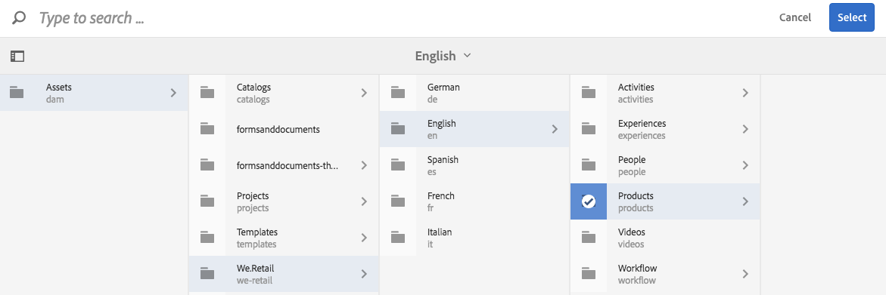

# Dynamic Media Classic-functies toevoegen aan pagina&#39;s {#adding-scene-features-to-your-page}

[ Adobe Dynamic Media Classic ](https://experienceleague.adobe.com/docs/dynamic-media-classic/using/home.html) is een ontvangen oplossing voor het leiden, het verbeteren, het publiceren, en het leveren van rijke media activa aan Web, mobiel, e-mail, en Internet-Verbonden vertoningen en druk.

U kunt in Dynamic Media Classic gepubliceerde Experience Managers weergeven in verschillende viewers:

* Zoomen
* Flyout
* Video
* Afbeeldingssjabloon
* Afbeelding

U kunt digitale elementen rechtstreeks van Experience Manager naar Dynamic Media Classic publiceren en u kunt digitale elementen van Dynamic Media Classic naar Experience Manager publiceren.

In dit document wordt beschreven hoe u digitale elementen kunt publiceren van Experience Manager naar Dynamic Media Classic en omgekeerd. Viewers worden ook in detail beschreven. Voor informatie bij het vormen van Experience Manager voor Dynamic Media Classic, zie [ Dynamic Media Classic met Experience Manager ](/help/sites-administering/scene7.md) integreren.

Zie ook [ Afbeeldingskaarten ](image-maps.md) toevoegen.

Voor meer informatie bij het gebruiken van videocomponenten met Experience Manager, zie [ Video ](video.md).

>[!NOTE]
>
>Als de activa van Dynamic Media Classic niet behoorlijk tonen, zorg ervoor dat Dynamic Media [ gehandicapt ](config-dynamic.md#disabling-dynamic-media) is en vernieuw dan de pagina.

## Handmatig publiceren naar Dynamic Media Classic vanuit middelen {#manually-publishing-to-scene-from-assets}

U kunt digitale elementen als volgt naar Dynamic Media Classic publiceren:

* [In de klassieke gebruikersinterface van de Assets-console](/help/sites-classic-ui-authoring/manage-assets-classic-s7.md#publishing-from-the-assets-console)
* [In de klassieke gebruikersinterface van een element](/help/sites-classic-ui-authoring/manage-assets-classic-s7.md#publishing-from-an-asset)
* [In de klassieke gebruikersinterface van buiten de CQ-doelmap](/help/sites-classic-ui-authoring/manage-assets-classic-s7.md#publishing-assets-from-outside-the-cq-target-folder)

>[!NOTE]
>
>Experience Manager publiceert asynchroon naar Dynamic Media Classic. Nadat u **[!UICONTROL Publish]** hebt geselecteerd, duurt het enkele seconden voordat uw element naar Dynamic Media Classic wordt gepubliceerd.
>

## Dynamic Media Classic-componenten {#scene-components}

De volgende Dynamic Media Classic-componenten zijn beschikbaar in de Experience Manager:

* Zoomen
* Flyout (zoomen)
* Afbeeldingssjabloon
* Afbeelding
* Video

>[!NOTE]
>
>Deze componenten zijn niet standaard beschikbaar en moeten in de modus **[!UICONTROL Design]** worden geselecteerd voordat ze kunnen worden gebruikt.

Nadat de componenten in de modus **[!UICONTROL Design]** beschikbaar zijn gemaakt, kunt u ze net als alle andere Experience Managers aan de pagina toevoegen. Assets die nog niet naar Dynamic Media Classic zijn gepubliceerd, worden naar Dynamic Media Classic gepubliceerd als deze zich in een gesynchroniseerde map of op een pagina of met een Dynamic Media Classic-cloudconfiguratie bevindt.

>[!NOTE]
>
>Als u aangepaste viewers maakt en ontwikkelt en de Inhoudszoeker gebruikt, moet u de parameter `allowfullscreen` expliciet toevoegen.

### Eindbericht voor Flash Viewers {#flash-viewers-end-of-life-notice}

Met ingang van 31 januari 2017 is Adobe Dynamic Media Classic gestopt met ondersteuning voor het viewerplatform voor Flash.

### Een Dynamic Media Classic-component (Scene7) aan een pagina toevoegen {#adding-a-scene-component-to-a-page}

Het toevoegen van een Dynamic Media Classic-component (Scene7) aan een pagina is hetzelfde als het toevoegen van een component aan een pagina. Dynamic Media Classic-componenten worden in de volgende secties uitgebreid beschreven.

**om een component van Dynamic Media Classic (Scene7) aan een pagina toe te voegen:**

1. Open in Experience Manager de pagina waaraan u de component **[!UICONTROL Dynamic Media Classic (Scene7)]** wilt toevoegen.

1. Als er geen Dynamic Media Classic-componenten beschikbaar zijn, selecteert u de modus **[!UICONTROL Design]** , selecteert u een component met een blauwe rand, selecteert u het pictogram **[!UICONTROL Parent]** en vervolgens het pictogram **[!UICONTROL Configuration]** . Selecteer in **[!UICONTROL Parsys (Design)]** alle Dynamic Media Classic-componenten die u beschikbaar wilt maken en selecteer **[!UICONTROL OK]** .

   

1. Selecteer **[!UICONTROL Edit]** zodat u terug kunt naar de **[!UICONTROL Edit]** -modus.

1. Sleep een component van de groep van Dynamic Media Classic in het hulpstuk op de pagina in de gewenste plaats.

1. Selecteer het pictogram **[!UICONTROL Configuration]** zodat u de component kunt openen.

1. Bewerk de component naar wens en selecteer **[!UICONTROL OK]** om de wijzigingen op te slaan.
1. Sleep de afbeelding of video van de inhoudbrowser naar het Dynamic Media Classic-onderdeel dat u aan de pagina hebt toegevoegd.

   >[!NOTE]
   >
   >Alleen in de gebruikersinterface moet u de afbeelding of video naar het Dynamic Media Classic-onderdeel slepen dat u op de pagina hebt geplaatst. Het selecteren en bewerken van de Dynamic Media Classic-component en het kiezen van het element worden niet ondersteund.

### Een interactieve weergave toevoegen aan een responsieve site {#adding-interactive-viewing-experiences-to-a-responsive-website}

Het responsieve ontwerp voor uw elementen betekent dat uw element wordt aangepast, afhankelijk van waar het wordt weergegeven. Bij een responsief ontwerp kunnen dezelfde elementen effectief op meerdere apparaten worden weergegeven.

Zie ook [ Responsief ontwerp voor Web-pagina&#39;s ](/help/sites-developing/responsive.md).

**om een interactieve het bekijken ervaring aan een ontvankelijke plaats toe te voegen:**

1. Login aan Experience Manager, en zorg ervoor dat u [ de Cloud Servicen van Adobe Dynamic Media Classic ](/help/sites-administering/scene7.md#configuring-scene-integration) hebt gevormd en dat de componenten van Dynamic Media Classic beschikbaar zijn.

   >[!NOTE]
   >
   >Als de componenten van Dynamic Media Classic niet beschikbaar zijn, ben zeker [ om hen als wijze van het Ontwerp toe te laten ](/help/sites-authoring/default-components-designmode.md).

1. In een website waarvoor de componenten **[!UICONTROL Dynamic Media Classic]** zijn ingeschakeld, sleept u een component **[!UICONTROL Image]** naar de pagina.
1. Selecteer de component en selecteer het configuratiepictogram.
1. Pas op het tabblad **[!UICONTROL Dynamic Media Classic Settings]** de onderbrekingspunten aan.

   

1. Controleer of de viewers het formaat responsief wijzigen en of alle interacties zijn geoptimaliseerd voor computers, tablets en mobiele apparaten.

### Instellingen die voor alle Dynamic Media Classic-componenten gelden {#settings-common-to-all-scene-components}

Hoewel de configuratieopties variëren, gelden de volgende algemene opties voor alle [!UICONTROL Dynamic Media Classic] -componenten:

* **[!UICONTROL File Reference]** - Blader naar een bestand waarnaar u wilt verwijzen. De bestandsverwijzing toont de element-URL en niet noodzakelijkerwijs de volledige Dynamic Media Classic-URL inclusief de URL-opdrachten en -parameters. U kunt in dit veld geen Dynamic Media Classic URL-opdrachten en -parameters toevoegen. In plaats daarvan voegt u ze toe via de bijbehorende functionaliteit in de component.
* **[!UICONTROL Width]** - Hiermee kunt u de breedte instellen.
* **[!UICONTROL Height]** - Hiermee kunt u de hoogte instellen.

U stelt deze configuratieopties in door bijvoorbeeld een Dynamic Media Classic-component te openen (te dubbelklikken) wanneer u een **[!UICONTROL Zoom]** -component opent:

### Zoomen {#zoom}

De HTML5-component Zoom geeft een grotere afbeelding weer wanneer u op de knop **[!UICONTROL +]** drukt.

Het element heeft onderaan zoomgereedschappen. Selecteer **[!UICONTROL +]** als u wilt vergroten; selecteer **[!UICONTROL -]** als u wilt verminderen. Als u op de zoompijl voor opnieuw instellen tikt, wordt de oorspronkelijke grootte van de afbeelding hersteld. **[!UICONTROL x]** Selecteer de diagonale pijlen zodat u deze op volledig scherm kunt weergeven. Selecteer **[!UICONTROL Edit]** zodat u de component kunt configureren. Met deze component, kunt u [ montages gemeenschappelijk voor alle [!UICONTROL Dynamic Media Classic] componenten ](#settings-common-to-all-scene-components) vormen.

### Flyout {#flyout}

In de HTML5 **[!UICONTROL Flyout]** -component wordt het element weergegeven als een gesplitst scherm, waarbij het element in de opgegeven grootte links wordt gelaten en rechts het zoomgedeelte wordt weergegeven. Selecteer **[!UICONTROL Edit]** zodat u de component kunt configureren. Met deze component, kunt u [ montages gemeenschappelijk voor alle componenten van Dynamic Media Classic vormen ](#settings-common-to-all-scene-components).

>[!NOTE]
>
>Als uw **[!UICONTROL Flyout]** -component een aangepaste grootte gebruikt, wordt die aangepaste grootte gebruikt en wordt de responsieve instelling van de component uitgeschakeld.
>
>Als uw **[!UICONTROL Flyout]** -component de standaardgrootte gebruikt, zoals is ingesteld in **[!UICONTROL Design View]** , wordt de standaardgrootte gebruikt en wordt de component uitgerekt om de grootte van de paginalay-out aan te passen en wordt de responsieve instelling van de component ingeschakeld. Er geldt een beperking voor de responsieve instelling van de component. Wanneer u de component **[!UICONTROL Flyout]** met responsieve instellingen gebruikt, mag u deze niet gebruiken met volledig uitrekbare pagina&#39;s. Anders loopt de **[!UICONTROL Flyout]** uit tot voorbij de rechterrand van de pagina.

### Afbeelding {#image}

Met de Dynamic Media Classic **[!UICONTROL Image]** -component kunt u Dynamic Media Classic-functionaliteit aan uw afbeeldingen toevoegen, zoals Dynamic Media Classic-wijzigingstoetsen, voorinstellingen voor afbeeldingen of viewers en verscherpen. De Dynamic Media Classic **[!UICONTROL Image]** -component is vergelijkbaar met andere afbeeldingscomponenten in Experience Manager met speciale Dynamic Media Classic-functionaliteit. In dit voorbeeld is op de afbeelding de optie Dynamic Media Classic URL `&op_invert=1` toegepast.

**[!UICONTROL Title, Alt Text]** - Voeg op het tabblad **[!UICONTROL Advanced]** een titel toe aan de afbeelding en alternatieve tekst voor gebruikers die afbeeldingen hebben uitgeschakeld.

**[!UICONTROL URL, Open in]** - U kunt een middel van plaatsen om een verbinding te openen. Stel de opties **[!UICONTROL URL]** en **[!UICONTROL Open in]** in om aan te geven of u deze wilt openen in hetzelfde venster of in een nieuw venster.

**[!UICONTROL Viewer preset]** - Selecteer een bestaande viewervoorinstelling in het keuzemenu. Als de viewervoorinstelling die u zoekt niet zichtbaar is, moet u deze zichtbaar maken. Zie [ Kijker beheren stelt ](/help/assets/managing-viewer-presets.md) vooraf in. U kunt geen viewervoorinstelling selecteren als u een voorinstelling voor afbeeldingen gebruikt en omgekeerd.

**[!UICONTROL Dynamic Media Classic Configuration]** - Selecteer de Dynamic Media Classic-configuratie die u wilt gebruiken om actieve voorinstellingen voor afbeeldingen op te halen uit SPS.

**[!UICONTROL Image preset]** - Selecteer een bestaande voorinstelling voor afbeeldingen in het keuzemenu. Als de voorinstelling die u zoekt niet zichtbaar is, moet u deze zichtbaar maken. Zie [ Beeld beheren vooraf instelt ](/help/assets/managing-image-presets.md). U kunt geen viewervoorinstelling selecteren als u een voorinstelling voor afbeeldingen gebruikt en omgekeerd.

**[!UICONTROL Output Format]** - Selecteer de uitvoerindeling van de afbeelding, bijvoorbeeld jpeg. Afhankelijk van de uitvoerindeling die u selecteert, zijn er aanvullende configuratieopties. Zie [ Vooraf ingestelde Beeld beste praktijken ](/help/assets/managing-image-presets.md#image-preset-options).

**[!UICONTROL Sharpening]** - Selecteer hoe u de afbeelding wilt verscherpen. Het scherpen wordt verklaard in detail in [ Vooraf ingesteld Beeld beste praktijken ](/help/assets/managing-image-presets.md#image-preset-options) en [ het verscherpen beste praktijken ](/help/assets/assets/sharpening_images.pdf).

**[!UICONTROL URL Modifiers]** - U kunt afbeeldingseffecten wijzigen door extra opdrachten voor Dynamic Media Classic-afbeeldingen in te voeren. Deze bevelen worden beschreven in [ Beeld stelt ](/help/assets/managing-image-presets.md) vooraf in en de [ verwijzing van het Bevel ](https://experienceleague.adobe.com/docs/dynamic-media-developer-resources/image-serving-api/image-serving-api/http-protocol-reference/command-reference/c-command-reference.html).

**[!UICONTROL Breakpoints]** - Als uw website reageert, wilt u de onderbrekingspunten aanpassen. Onderbrekingspunten moeten worden gescheiden door komma&#39;s ( , ).

### Afbeeldingssjabloon {#image-template}

[ de Malplaatjes van het Beeld van Dynamic Media Classic ](https://experienceleague.adobe.com/docs/dynamic-media-classic/using/template-basics/quick-start-template-basics.html) zijn gelaagde inhoud van Photoshop die in Dynamic Media Classic werd ingevoerd, waar de inhoud en de eigenschappen voor variabiliteit werden bepaald. Met de component **[!UICONTROL Image template]** kunt u afbeeldingen importeren en de tekst dynamisch in Experience Manager wijzigen. Daarnaast kunt u de component **[!UICONTROL Image template]** zo configureren dat waarden van de clientcontext worden gebruikt, dat elke gebruiker de afbeelding op een gepersonaliseerde manier ervaart.

Selecteer **[!UICONTROL Edit]** als u de component wilt configureren. U kunt [ montages vormen gemeenschappelijk voor alle componenten van Dynamic Media Classic ](#settings-common-to-all-scene-components) en andere montages die in deze sectie worden beschreven.

**[!UICONTROL File Reference, Width, Height]** - Zie montages gemeenschappelijk voor alle componenten ScDynamic Media Classicene7.

>[!NOTE]
>
>Dynamic Media Classic URL-opdrachten en -parameters kunnen niet rechtstreeks aan de URL van de bestandsverwijzing worden toegevoegd. Ze kunnen alleen worden gedefinieerd in de gebruikersinterface van de component in het deelvenster **[!UICONTROL Parameter]** .

**[!UICONTROL Title, Alt Text]** - Voeg op het tabblad Dynamic Media Classic-afbeeldingssjabloon een titel toe aan de afbeelding en alternatieve tekst voor gebruikers die afbeeldingen hebben uitgeschakeld.

**[!UICONTROL URL, Open in]** - U kunt een middel van plaatsen om een verbinding te openen. Stel de URL in en kies Openen in om aan te geven of deze in hetzelfde venster of in een nieuw venster moet worden geopend.

**[!UICONTROL Parameter Panel]** - Wanneer u een afbeelding importeert, worden de parameters vooraf gevuld met informatie uit de afbeelding. Als er geen inhoud is die dynamisch kan worden gewijzigd, is dit venster leeg.

#### Tekst dynamisch wijzigen {#changing-text-dynamically}

Als u de tekst dynamisch wilt wijzigen, voert u nieuwe tekst in de velden in en selecteert u **[!UICONTROL OK]** . In dit voorbeeld is de waarde van **[!UICONTROL Price]** nu $50 en is de verzendkosten 99 cent.

De tekst in de afbeelding verandert. U kunt de tekst terugzetten naar de oorspronkelijke waarde door op **[!UICONTROL Reset]** naast het veld te tikken.

#### Tekst wijzigen om de waarde van de context van een client weer te geven {#changing-text-to-reflect-the-value-of-a-client-context-value}

Als u een veld aan een clientcontextwaarde wilt koppelen, selecteert u **[!UICONTROL Select]** om het contextmenu van de client te openen, selecteert u de clientcontext en selecteert u **[!UICONTROL OK]** . In dit voorbeeld verandert de naam op basis van de koppeling van de naam met de opgemaakte naam in het profiel.

De tekst geeft de naam weer van de gebruiker die momenteel is aangemeld. U kunt de oorspronkelijke waarde van de tekst herstellen door op **[!UICONTROL Reset]** naast het veld te klikken.

#### Een koppeling maken van de Dynamic Media Classic-afbeeldingssjabloon {#making-the-scene-image-template-a-link}

1. Selecteer **[!UICONTROL Edit]** op de pagina met de component Dynamic Media Classic **[!UICONTROL Image Template]** .
1. Voer in het veld **[!UICONTROL URL]** de URL in waarnaar gebruikers gaan wanneer op de afbeelding wordt getikt. Selecteer in het veld **[!UICONTROL Open in]** of u het doel wilt openen (een nieuw venster of hetzelfde venster).

   

1. Selecteer **[!UICONTROL OK]** .

### Video-component {#video-component}

De Dynamic Media Classic **[!UICONTROL Video]** -component (beschikbaar in het Dynamic Media Classic-gedeelte van het hulpwerkgebied) gebruikt apparaat- en bandbreedtedetectie om de juiste video voor elk scherm te leveren. Deze component is een HTML5-videospeler; het is één viewer die met meerdere kanalen kan worden gebruikt.

Deze kan worden gebruikt voor adaptieve videosets, één MP4-video of één F4V-video.

Zie [ Video ](s7-video.md) voor meer informatie over hoe de video&#39;s met de integratie van Dynamic Media Classic werken. Bovendien zie [ de Video component van Dynamic Media Classic tegenover de Video component van de Stichting ](s7-video.md).

### Bekende beperkingen van de video-component {#known-limitations-for-the-video-component}

Adobe DAM en WCM laten zien of een primaire bronvideo is geüpload. Deze proxy-elementen worden niet weergegeven:

* Dynamic Media Classic-gecodeerde uitvoeringen
* Dynamic Media Classic adaptieve videosets

Wanneer u een adaptieve videoset gebruikt met de Dynamic Media Classic-videocomponent, moet u de grootte van de component aanpassen aan de afmetingen van de video.

## Dynamic Media Classic-inhoudbrowser {#scene-content-browser}

Met de Dynamic Media Classic-inhoudbrowser kunt u inhoud van Dynamic Media Classic rechtstreeks in Experience Manager weergeven. Als u de inhoudbrowser wilt openen, selecteert u in **[!UICONTROL Content Finder]** de optie **[!UICONTROL Dynamic Media Classic]** in de gebruikersinterface met geoptimaliseerde aanrakingen of het pictogram **[!UICONTROL S7]** in de klassieke gebruikersinterface. De functionaliteit is identiek tussen beide gebruikersinterfaces.

Als u veelvoudige configuraties hebt, toont de Experience Manager door gebrek de [ standaardconfiguratie ](/help/sites-administering/scene7.md#configuring-a-default-configuration). U kunt verschillende configuraties rechtstreeks selecteren in de Dynamic Media Classic-inhoudbrowser in de vervolgkeuzelijst.

>[!NOTE]
>
>* Assets in de map op aanvraag wordt niet weergegeven in de Dynamic Media Classic-inhoudbrowser.
>* Wanneer [ Veilige Voorproef ](/help/sites-administering/scene7.md#configuring-the-state-published-unpublished-of-assets-pushed-to-scene) wordt toegelaten, zowel verschijnen de gepubliceerde als unpublished activa op Dynamic Media Classic in de de inhoudbrowser van Dynamic Media Classic.
>* Als u **[!UICONTROL Dynamic Media Classic]** of het **[!UICONTROL S7]** pictogram niet als optie in inhoudbrowser ziet, moet u [ Dynamic Media Classic vormen om met Experience Manager ](/help/sites-administering/scene7.md) te werken.
>* Voor video ondersteunt de Dynamic Media Classic-inhoudbrowser:
>
>   * Adaptieve videosets: container met alle video-uitvoeringen die nodig zijn voor naadloze weergave op meerdere schermen
>   * Eén MP4-video
>   * Single F4V-video

### Door inhoud bladeren in de interface die geoptimaliseerd is voor aanrakingen {#browsing-content-in-the-touch-optimized-ui}

U kunt de inhoudbrowser openen via de geoptimaliseerde interface of via de klassieke gebruikersinterface. Op dit moment heeft het geoptimaliseerde aanraakgebied de volgende beperking:

* FXG- en Flash-elementen van Dynamic Media Classic worden niet ondersteund.

Blader door Dynamic Media Classic-elementen door **[!UICONTROL Dynamic Media Classic]** te selecteren in het derde keuzemenu. Dynamic Media Classic wordt niet in de lijst weergegeven als u de integratie tussen Dynamic Media Classic en Experience Manager niet hebt geconfigureerd.

>[!NOTE]
>
>* In de Dynamic Media Classic-inhoudbrowser worden ongeveer 100 elementen geladen en op naam gesorteerd.
>* Als u een beveiligde voorvertoningsserver hebt ingesteld, gebruikt de browser die voorvertoningsserver om miniaturen en elementen te renderen.
>

Bovendien kunt u informatie over de resolutie, de grootte, de dagen sinds de wijziging en de bestandsnaam doorbladeren door de muisaanwijzer op het element in de browser te plaatsen.

* Voor adaptieve videosets en sjablonen wordt geen informatie over de grootte gegenereerd voor miniaturen.
* Voor adaptieve videosets wordt geen resolutie gegenereerd voor miniaturen.

### Dynamic Media Classic-elementen zoeken met de inhoudbrowser {#searching-for-scene-assets-with-the-content-browser}

Het zoeken naar elementen in Dynamic Media Classic lijkt op het zoeken naar elementen in Experience Manager Assets. Wanneer u echter zoekt, ziet u eigenlijk een externe weergave van de elementen in het Dynamic Media Classic-systeem in plaats van deze rechtstreeks in de Experience Manager te importeren.

U kunt zowel de klassieke interface als de interface met geoptimaliseerde aanrakingen gebruiken om elementen weer te geven en te zoeken. Afhankelijk van de interface, is hoe u zoekt lichtjes verschillend.

Wanneer u in een van beide UI zoekt, kunt u filteren op de volgende criteria (die hier in de voor aanraking geoptimaliseerde UI worden getoond):

**[!UICONTROL Enter keywords]** - U kunt elementen zoeken op naam. Bij het zoeken zijn de ingevoerde trefwoorden de beginwaarden van de bestandsnaam. Als u bijvoorbeeld het woord &quot;zwemmen&quot; typt, wordt gezocht naar namen van elementbestanden die met die letters in die volgorde beginnen. Druk op Enter nadat u de term hebt getypt om het element te zoeken.

**[!UICONTROL Folder/path]** - De naam van de map die wordt weergegeven, is gebaseerd op de configuratie die u hebt geselecteerd. U kunt tot lagere niveaus boren door het omslagpictogram te tikken en een subfolder te selecteren, dan het controleteken te tikken om het te selecteren.

Als u een sleutelwoord ingaat en een omslag selecteert, zoekt de Experience Manager die omslag en om het even welke subfolders. Als u bij het zoeken echter geen trefwoorden invoert, worden bij het selecteren van de map alleen de elementen in die map weergegeven en worden er geen submappen opgenomen.

Standaard zoekt de Experience Manager naar de geselecteerde map en naar alle submappen.

**[!UICONTROL Type of Asset]** - Selecteer **[!UICONTROL Dynamic Media Classic]** om door Dynamic Media Classic-inhoud te bladeren. Deze optie is alleen beschikbaar als Dynamic Media Classic is geconfigureerd.

**[!UICONTROL Configuration]** - Als u meer dan één Dynamic Media Classic-configuratie hebt gedefinieerd in [!UICONTROL Cloud Services] , kunt u deze hier selecteren. Hierdoor wordt de map gewijzigd op basis van de gekozen configuratie.

**[!UICONTROL Asset type]** - In de Dynamic Media Classic-browser kunt u de resultaten filteren en de volgende opties opnemen: afbeeldingen, sjablonen, video&#39;s en adaptieve videosets. Als u geen elementtype selecteert, zoekt de Experience Manager standaard naar alle elementtypen.

>[!NOTE]
>
>* In klassieke UI, kunt u ook naar **Flash** en **FXG** zoeken. Filteren voor deze typen in de interface met geoptimaliseerde aanrakingen wordt niet ondersteund.
>
>* Bij het zoeken naar video zoekt u op één vertoning. Resultaten retourneren de oorspronkelijke uitvoering (alleen &amp;ast; .mp4) en de gecodeerde uitvoering.
* Bij het zoeken naar een adaptieve videoset zoekt u naar de map en naar alle submappen, maar alleen als u een trefwoord aan de zoekopdracht hebt toegevoegd. Als u geen trefwoord hebt toegevoegd, doorzoekt Experience Manager de submappen niet.
>

**[!UICONTROL Publish Status]** - U kunt filteren op elementen die zijn gebaseerd op de publicatiestatus: **[!UICONTROL Unpublished]** of **[!UICONTROL Published]** . Als u geen **[!UICONTROL Publish Status]** selecteert, zoekt de Experience Manager standaard alle publicatiestatussen.

