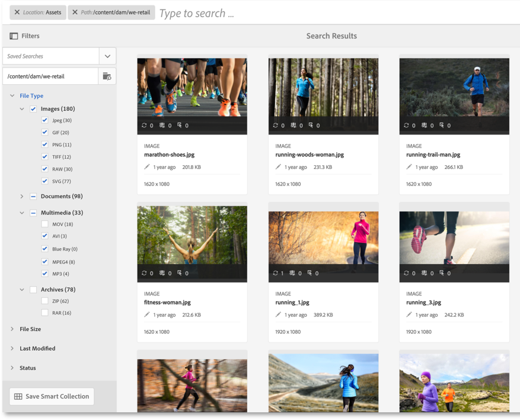
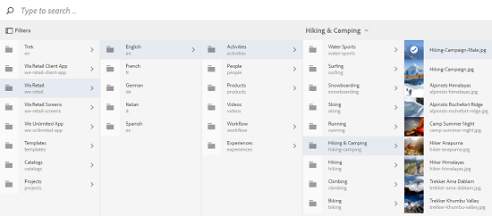
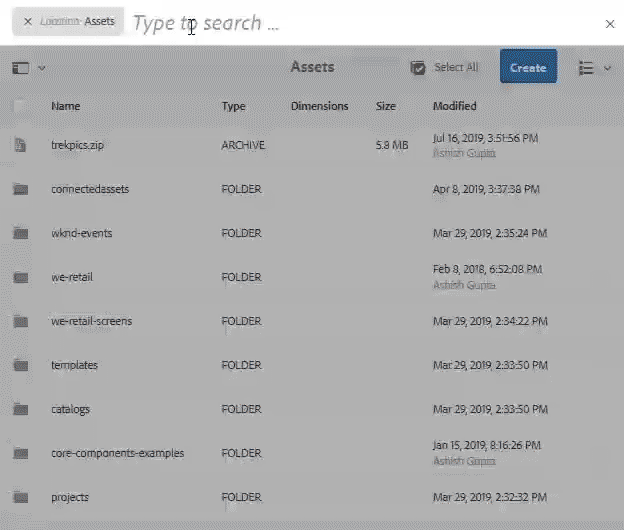

# Middelen zoeken in [!DNL Adobe Experience Manager] {#search-assets-in-aem}

[!DNL Adobe Experience Manager Assets] biedt robuuste methoden voor het detecteren van bedrijfsmiddelen die u helpen een hogere snelheid van de inhoud te bereiken. Uw teams verkorten tijd aan markt met naadloze, intelligente onderzoekservaring gebruikend out-of-the-box functionaliteit en douanemethodes. Het zoeken naar middelen is van cruciaal belang voor het gebruik van een systeem voor het beheer van digitale activa — of het nu gaat om verder gebruik door creatieve ondernemingen, voor een robuust beheer van activa door zakelijke gebruikers en marketeers, of voor beheer door DAM-beheerders. Eenvoudige, geavanceerde en aangepaste zoekopdrachten die u kunt uitvoeren via een [!DNL Assets] gebruikersinterface of andere apps en oppervlakken helpen deze gebruiksgevallen te verhelpen.

[!DNL Experience Manager Assets] steunt de volgende gebruiksgevallen en dit artikel beschrijft het gebruik, de concepten, de configuraties, de beperkingen, en het oplossen van problemen voor deze gebruiksgevallen.

| Assets doorzoeken | Configuratie en beheer | Werken met zoekresultaten |
|---|---|---|
| [Standaardzoekopdrachten](#searchbasics) | [Zoekindex](#searchindex) | [Resultaten sorteren](#sort) |
| [Gebruiksinterface voor zoeken begrijpen](#searchui) | [Zoeken op visuele of gelijkenis](#configvisualsearch) | [Eigenschappen en metagegevens van een element controleren](#checkinfo) |
| [Zoeken in suggesties](#searchsuggestions) | [Verplichte metagegevens](#mandatorymetadata) | [Downloaden](#download) |
| [Zoekresultaten en gedrag begrijpen](#searchbehavior) | [Zoekfacetten wijzigen](#searchfacets) | [Bulkupdates van metagegevens](#metadataupdates) |
| [Zoeken in rang en opvoeren](#searchrank) | [Tekst extraheren](#extracttextupload) | [Slimme verzamelingen](#collections) |
| [Geavanceerd zoeken: filteren en zoekbereik](#scope) | [Aangepaste voorspelling](#custompredicates) | [Onverwachte resultaten begrijpen en problemen oplossen](#troubleshoot-unexpected-search-results-and-issues) |
| [Zoeken in andere oplossingen en apps](#beyondomnisearch):<ul><li>[Adobe-elementkoppeling](#aal)</li><li>[Brand Portal](#brandportal)</li><li>[Experience Manager-bureaubladtoepassing](#desktopapp)</li><li>[Adobe Stock-afbeeldingen](#adobestock)</li><li>[Dynamische media-elementen](#dynamicmedia)</li></ul> |  |  |
| [Asset Picker](#assetselector) |  |  |
| [Beperkingen](#limitations) en [tips](#tips) |  |  |
| [Afbeeldingsvoorbeelden](#samples) |  |  |

Zoek naar elementen met behulp van het veld Onderzoek boven aan de [!DNL Experience Manager] webinterface. Ga naar **[!UICONTROL Assets]** > **[!UICONTROL Files]** in [!DNL Experience Manager], klik onderzoekspictogram in hoogste bar, ga onderzoekssleutelwoord in, en druk terugkeer. U kunt ook de trefwoordsneltoets / (slash) gebruiken om het veld Onderzoek te openen. `Location:Assets` is vooraf geselecteerd om de zoekopdrachten te beperken tot DAM-middelen. [!DNL Experience Manager] biedt suggesties als u begint met het typen van een trefwoord voor zoeken.

Gebruik het **[!UICONTROL Filters]** deelvenster om uw zoekopdracht te beperken door de zoekresultaten te filteren op basis van de verschillende opties (voorspelling), zoals bestandstype, bestandsgrootte, datum van laatste wijziging, status van de bron, gegevens over inzichten en Adobe Stock-licenties. Uw beheerders kunnen het deelvenster Filters aanpassen en zoekvoorvertoningen toevoegen of verwijderen met behulp van zoekfacetten. Het [!UICONTROL File Type] filter in het [!UICONTROL Filters] deelvenster heeft selectievakjes met gemengde status. Tenzij u alle geneste voorspellen (of indelingen) selecteert, worden de selectievakjes op het eerste niveau daarom gedeeltelijk gecontroleerd.

[!DNL Experience Manager] zoekmogelijkheden bieden ondersteuning voor het zoeken naar verzamelingen en het zoeken naar elementen in een verzameling. Zie [zoekverzamelingen](/help/assets/managing-collections-touch-ui.md).

## Zoekinterface begrijpen {#searchui}

Verken uzelf met de zoekinterface en de beschikbare acties.

*Afbeelding: Begrijp de interface van[!DNL Experience Manager Assets]onderzoeksresultaten.*

**A.** Sla de zoekopdracht op als een slimme verzameling. **B.** Hiermee kunt u de zoekresultaten beperken door filters of voorspelling in te stellen. **C.** Bestanden, mappen of beide weergeven. **D.** Klik op Filters om het linkerspoor te openen of te sluiten. **E.** Zoeklocatie is DAM. **F.** Het gebied van het onderzoek met user-provided onderzoekssleutelwoord. **G.** Selecteer de geladen zoekresultaten. **H.** Aantal weergegeven zoekresultaten van de totale zoekresultaten. **I.** Sluit zoekopdracht **J.** Schakel tussen de kaartweergave en de lijstweergave.

### Dynamische zoekfacetten {#dynamicfacets}

U kunt de gewenste elementen sneller vinden op de pagina met zoekresultaten met behulp van het dynamisch bijgewerkte aantal verwachte zoekresultaten in de zoekfacetten. Het verwachte aantal elementen wordt bijgewerkt, zelfs voordat het zoekfilter wordt toegepast. Door het verwachte aantal op het filter te zien, kunt u snel en efficiënt door de zoekresultaten navigeren. Zie [Zoeken in middelen in Experience Manager](search-assets.md)voor meer informatie.

*Afbeelding: Zie het geschatte aantal elementen zonder de zoekresultaten te filteren in zoekfacetten.*

## Zoekresultaten en gedrag begrijpen {#searchbehavior}

### Standaardzoektermen en -resultaten {#searchbasics}

U kunt trefwoordzoekopdrachten uitvoeren vanuit het veld UniverseelZoeken. De trefwoordzoekopdracht is niet hoofdlettergevoelig en bestaat uit een zoekopdracht in volledige tekst (in de veelgebruikte metagegevensvelden). Als er naar meer dan één trefwoord wordt gezocht, is de standaardoperator tussen de trefwoorden `AND` voor standaardzoekopdrachten en is dit `OR` wanneer elementen slimme tags hebben.

De resultaten worden gesorteerd op relevantie, te beginnen met de dichtstbijzijnde overeenkomsten. Voor meerdere trefwoorden zijn relevantere resultaten de elementen die beide termen in de metagegevens bevatten. Trefwoorden die in de metagegevens voorkomen, krijgen een hogere positie dan trefwoorden die in andere metagegevensvelden worden weergegeven. [!DNL Experience Manager] maakt het mogelijk een bepaalde zoekterm een hoger gewicht te geven. Ook is het mogelijk om de positie [van een paar doelactiva voor specifieke zoektermen te](#searchrank) versterken.

Om de relevante activa snel te vinden, verstrekt de rijke interface het filtreren, het sorteren, en selectiemechanismen. U kunt resultaten filteren op basis van meerdere criteria en het aantal gezochte elementen voor verschillende filters bekijken. U kunt de zoekopdracht ook opnieuw uitvoeren door de query in het veld Onderzoek te wijzigen. Wanneer u de zoektermen of filters wijzigt, blijven de andere filters van toepassing om de context van de zoekopdracht te behouden.

Wanneer de resultaten veel elementen zijn, [!DNL Experience Manager] worden de eerste 100 weergegeven in de kaartweergave en 200 in de lijstweergave. Wanneer gebruikers schuiven, worden meer elementen geladen. Dit is om de prestaties te verbeteren.

>[!VIDEO](https://www.youtube.com/watch?v=LcrGPDLDf4o)

Het kan voorkomen dat de zoekresultaten een aantal onverwachte elementen bevatten. Zie [onverwachte resultaten](#troubleshoot-unexpected-search-results-and-issues)voor meer informatie.

[!DNL Experience Manager] U kunt naar vele dossierformaten zoeken en de onderzoeksfilters kunnen worden aangepast aan uw bedrijfsvereisten. Neem contact op met uw beheerder om te weten welke zoekopties beschikbaar worden gesteld voor uw DAM-opslagplaats en welke beperkingen uw account heeft.

### Resultaten met en zonder verbeterde slimme tags {#withsmarttags}

Standaard combineert [!DNL Experience Manager] zoeken de zoektermen met een AND-component. Kijk bijvoorbeeld eens naar het doorzoeken van trefwoordenvrouwen. In de zoekresultaten worden standaard alleen de elementen weergegeven met trefwoorden voor vrouwen en het gebruik van trefwoorden in de metagegevens. Hetzelfde gedrag blijft behouden wanneer speciale tekens (punten, onderstrepingstekens of streepjes) bij de trefwoorden worden gebruikt. De volgende zoekopdrachten retourneren dezelfde resultaten:

* `woman running`
* `woman.running`
* `woman-running`

De query `woman -running` retourneert echter elementen zonder `running` de metagegevens.
Als u slimme tags gebruikt, voegt u een extra `OR` component toe om een zoekterm te zoeken als de toegepaste slimme tags. Een element dat is gelabeld met slimme tags `woman` of dat slimme tags `running` gebruikt, wordt ook weergegeven in een dergelijke zoekopdracht. De zoekresultaten zijn dus een combinatie van:

* Elementen met `woman` `running` en trefwoorden in de metagegevens (standaardgedrag).

* Elementen die zijn getagd met een van de trefwoorden (gedrag voor slimme tags).

### Suggesties zoeken terwijl u typt {#searchsuggestions}

Wanneer u trefwoorden begint te typen, [!DNL Experience Manager] worden de mogelijke zoektrefwoorden of -woordgroepen voorgesteld. De suggesties zijn gebaseerd op de metagegevens van de bestaande elementen. [!DNL Experience Manager] Hiermee worden alle metagegevensvelden geïndexeerd, zodat u deze gemakkelijker kunt gebruiken bij het zoeken. Voor zoeksuggesties gebruikt het systeem de waarden van de volgende paar metagegevensvelden. Als u zoeksuggesties wilt doen, kunt u de volgende velden vullen met de juiste trefwoorden:

* Elementlabels. (afbeeldingen naar `jcr:content/metadata/cq:tags`)
* Titel van element. (afbeeldingen naar `jcr:content/metadata/dc:title`)
* Beschrijving van element. (afbeeldingen naar `jcr:content/metadata/dc:description`)
* Titel in de gegevensopslagruimte van het JCR. De waarde wordt mogelijk toegewezen aan de titel van het element. (afbeeldingen naar `jcr:content/jcr:title`)
* Beschrijving in de gegevensopslagruimte van de JCR. De waarde wordt mogelijk toegewezen aan de beschrijving van het element. (afbeeldingen naar `jcr:content/jcr:description`)

Als u suggesties voor meerdere zoektrefwoorden wilt ontvangen, blijft u alle trefwoorden typen zonder een suggestie voor één trefwoord te selecteren.

*Afbeelding: Typ meerdere trefwoorden om suggesties weer te geven die in alle trefwoorden passen.*

### Rangschikking en boosting zoeken {#searchrank}

De zoekresultaten die overeenkomen met alle zoektermen in metagegevensvelden worden eerst weergegeven, gevolgd door de zoekresultaten die overeenkomen met een van de zoektermen in de slimme tags. In het bovenstaande voorbeeld is de weergavevolgorde van zoekresultaten bij benadering:

1. Komt overeen met `woman running` de waarden in de verschillende metagegevensvelden.
1. Komt overeen met `woman running` in slimme tags.
1. Komt overeen met `woman` of van `running` in slimme tags.

U kunt de relevantie van trefwoorden voor bepaalde elementen verbeteren om zoekopdrachten op basis van trefwoorden te stimuleren. Met andere woorden, de afbeeldingen waarvoor u specifieke trefwoorden promoot, worden boven aan de zoekresultaten weergegeven wanneer u op basis van deze trefwoorden zoekt.

1. From the [!DNL Assets] user interface, open the properties page for the asset. Click **[!UICONTROL Advanced]** and click **[!UICONTROL Add]** under **[!UICONTROL Elevate for search keywords]**.
1. Geef in het **[!UICONTROL Search Promote]** vak een trefwoord op waarvoor u de zoekopdracht naar de afbeelding wilt opvoeren en klik op **[!UICONTROL Add]**. U kunt meerdere trefwoorden op dezelfde manier opgeven.
1. Klik op **[!UICONTROL Save & Close]**. Het element dat u voor dit trefwoord hebt gepromoot, wordt weergegeven in de beste zoekresultaten.

U kunt dit in uw voordeel gebruiken door de positie van bepaalde elementen in de zoekresultaten voor het doeltrefwoord te verhogen. Zie de onderstaande voorbeeldvideo. Zie [Zoeken in Experience Manager](https://helpx.adobe.com/experience-manager/kt/assets/using/search-feature-video-use.html)voor meer informatie.

>[!VIDEO](https://video.tv.adobe.com/v/16766/?quality=6)

*Begrijp hoe de onderzoeksresultaten worden gerangschikt en hoe de rang kan worden beïnvloed.*

## Geavanceerd zoeken {#scope}

[!DNL Experience Manager] biedt verschillende methoden, zoals filters die van toepassing zijn op de gezochte elementen, zodat u de gewenste elementen sneller kunt vinden. Hieronder worden enkele veelgebruikte methoden beschreven. Enkele [geïllustreerde voorbeelden](#samples) worden hieronder gedeeld.

**Bestanden of mappen** zoeken: Zie bestanden, mappen of beide in de zoekresultaten. Vanuit **[!UICONTROL Filters]** het deelvenster kunt u de gewenste optie selecteren. Zie [zoekinterface](#searchui).

**Zoeken naar elementen in een map**: U kunt de zoekopdracht beperken tot een specifieke map. Voeg in het **[!UICONTROL Filters]** deelvenster het pad van een map toe. U kunt slechts één map tegelijk selecteren.

*Afbeelding: Beperk de zoekresultaten tot een map door een mappad toe te voegen in het deelvenster Filters.*

### Vergelijkbare afbeeldingen zoeken {#visualsearch}

Als u afbeeldingen wilt zoeken die visueel lijken op een door de gebruiker geselecteerde afbeelding, klikt u op de optie **[!UICONTROL Find Similar]** in de kaartweergave van een afbeelding of op de werkbalk. [!DNL Experience Manager] geeft de slimme getagde afbeeldingen uit de DAM-opslagplaats weer die lijken op een door de gebruiker geselecteerde afbeelding. Zie [Zoeken naar overeenkomsten configureren](#configvisualsearch).

*Afbeelding: U kunt vergelijkbare afbeeldingen zoeken met de optie in de kaartweergave.*

### Adobe Stock-afbeeldingen {#adobestock}

Vanuit de [!DNL Experience Manager] gebruikersinterface kunnen gebruikers zoeken in [Adobe Stock-middelen](/help/assets/aem-assets-adobe-stock.md) en een licentie voor de vereiste middelen aanschaffen. Toevoegen `Location: Adobe Stock` in de balk Zoeken. U kunt ook het deelvenster Filters gebruiken om alle middelen te zoeken waarvoor een licentie is verleend of om een bepaald middel te zoeken aan de hand van het bestandsnummer van Adobe Stock.

### Dynamische media-elementen {#dmassets}

U kunt filteren op dynamische media-afbeeldingen door **[!UICONTROL Dynamic Media]** > **[!UICONTROL Sets]** te selecteren in het deelvenster **[!UICONTROL Filters]**. Het filtert op en toont assets zoals afbeeldingsets, carrousels, gemengde mediasets, en spinsets.

### Zoeken met specifieke waarden in metagegevensvelden {#gqlsearch}

U kunt naar elementen zoeken op basis van exacte waarden van specifieke metagegevensvelden, zoals titel, beschrijving en auteur. Met de zoekfunctie voor volledige tekst GQL haalt u alleen die elementen op waarvan de metagegevenswaarde exact overeenkomt met uw zoekopdracht. De namen van de eigenschappen (bijvoorbeeld auteur, titel, enzovoort) en de waarden zijn hoofdlettergevoelig.

| Metagegevensveld | Facetwaarde en gebruik |
| ----------------------------------------- | ------------------------------------- |
| Titel | titel:John |
| Creator | maker:John |
| Locatie | locatie:NA |
| Beschrijving | beschrijving:&quot;Voorbeeldafbeelding&quot; |
| Gereedschap Maker | creatortool:&quot;Adobe Photoshop CC 2020&quot; |
| Copyrighteigenaar | copyrightowner:&quot;Adobe Systems&quot; |
| Medewerker | contribuant:John |
| Gebruiksvoorwaarden | usageterms:&quot;CopyRights Reserved&quot; |
| Gemaakt | gemaakt:YYYY-MM-DDTHH |
| Vervaldatum | verloopt:YYYY-MM-DDTHH |
| Op tijd | ontime:YYYY-MM-DDTHH |
| Uit-tijd | offtime:YYYY-MM-DDTHH |
| Tijdsbereik (verloopt dateontime, offtime) | facetveld: lager gebonden..bovenaan |
| Pad | /content/dam/&lt;naam map> |
| PDF-titel | pdftitle:&quot;Adobe-document&quot; |
| Subject | onderwerp: &quot;Opleiding&quot; |
| Tags | tags:&quot;Locatie en reizen&quot; |
| Type | type:&quot;image\png&quot; |
| Breedte van afbeelding | breedte:ondergrens..bovenaan |
| Hoogte van afbeelding | hoogte:ondergrens..bovenaan |
| Person | persoon:John |

De eigenschappen pad, limiet, grootte en volgorde kunnen niet met een andere eigenschap worden ORed.

Het sleutelwoord voor een user-generated bezit is zijn gebiedsetiket in de bezitsredacteur in kleine letters, met verwijderde ruimten.

Hier volgen enkele voorbeelden van zoekindelingen voor complexe query&#39;s:

* Alle elementen weergeven met meerdere facetvelden (bijvoorbeeld: title=Jan Smit en creator tool = Adobe Photoshop): `tiltle:"John Doe" creatortool : Adobe*`
* Om alle activa te tonen wanneer de facetwaarde niet één enkel woord maar één zin is (bijvoorbeeld: title=Scott Reynolds): `title:"Scott Reynolds"`
* Elementen weergeven met meerdere waarden van één eigenschap (bijvoorbeeld: title=Scott Reynolds of Jan Smit): `title:"Scott Reynolds" OR "John Doe"`
* Elementen weergeven met eigenschapswaarden die beginnen met een specifieke tekenreeks (bijvoorbeeld: de titel is Scott Reynolds): `title:Scott*`
* Elementen weergeven met eigenschapswaarden die eindigen met een specifieke tekenreeks (bijvoorbeeld: de titel is Scott Reynolds): `title:*Reynolds`
* Elementen weergeven met een eigenschapswaarde die een specifieke tekenreeks bevat (bijvoorbeeld: titel = Bazel-vergaderruimte): `title:*Meeting*`
* Elementen weergeven die een bepaalde tekenreeks bevatten en een specifieke eigenschapswaarde hebben (bijvoorbeeld: zoek naar een Adobe-tekenreeks in elementen met de naam title=Jan Smit): `*Adobe* title:"John Doe"`

## Elementen zoeken vanuit andere [!DNL Experience Manager] aanbiedingen of interfaces {#beyondomnisearch}

[!DNL Adobe Experience Manager] Maakt de DAM-opslagplaats aan verschillende andere [!DNL Experience Manager] oplossingen aan om snellere toegang tot digitale middelen te bieden en de creatieve workflows te stroomlijnen. Elke detectie van middelen begint met bladeren of zoeken. Het zoekgedrag blijft grotendeels hetzelfde op de verschillende oppervlakken en oplossingen. Sommige onderzoeksmethodes veranderen aangezien het doelpubliek, de gebruiksgevallen, en het gebruikersinterface over de [!DNL Experience Manager] oplossingen variëren. De specifieke methoden worden gedocumenteerd voor de afzonderlijke oplossingen in de onderstaande koppelingen. De algemeen toepasselijke tips en gedragingen worden in dit artikel beschreven.

### Middelen zoeken vanuit het deelvenster Adobe Asset Link {#aal}

Met Adobe Asset Link hebben creatieve professionals nu toegang tot inhoud die is opgeslagen in [!DNL Experience Manager Assets], zonder de ondersteunde Adobe Creative Cloud-toepassingen te verlaten. Creatieven kunnen naadloos door middelen bladeren, zoeken, uitchecken en inchecken via het deelvenster in de app in het [!DNL Adobe Creative Cloud apps]volgende: [!DNL Adobe Photoshop], [!DNL Adobe Illustrator]en [!DNL Adobe InDesign]. Met Asset Link kunnen gebruikers ook visueel vergelijkbare resultaten zoeken. De visuele resultaten van de zoekweergave worden aangedreven door de computerleeralgoritmen van Adobe Sensei en helpen gebruikers bij het zoeken naar beelden die er esthetisch op lijken. Zie [Zoeken naar en bladeren door middelen](https://helpx.adobe.com/enterprise/using/manage-assets-using-adobe-asset-link.html#UseAdobeAssetLink) met Adobe Asset Link.

### Middelen zoeken in [!DNL Experience Manager] bureaubladtoepassing {#desktopapp}

Creatieve professionals gebruiken de desktop-app om de app [!DNL Experience Manager Assets] gemakkelijk doorzoekbaar te maken en beschikbaar te maken op hun lokale bureaublad (Windows of Mac). Creative Cloud kan de gewenste middelen eenvoudig weergeven in Mac Finder of Windows Verkenner, geopend in bureaubladtoepassingen en lokaal gewijzigd. De wijzigingen worden opgeslagen in [!DNL Experience Manager] een nieuwe versie die in de opslagplaats is gemaakt. De toepassing ondersteunt basiszoekopdrachten met een of meer trefwoorden, `*` jokertekens en `?` `AND` operatoren. Zie middelen  zoeken, zoeken en voorvertonen in de bureaubladtoepassing.

### Middelen zoeken in [!DNL Brand Portal] {#brandportal}

De gebruikers van de lijn-van-zaken en de marketers gebruiken het Portaal van het Merk om de goedgekeurde digitale activa met hun uitgebreide interne teams, partners, en resellers efficiënt en veilig te delen. Zie [zoekmiddelen op Brand Portal](https://docs.adobe.com/content/help/en/experience-manager-brand-portal/using/search-capabilities/brand-portal-searching.html).

### Afbeeldingen [!DNL Adobe Stock] zoeken {#adobestock-1}

Vanuit de [!DNL Experience Manager] gebruikersinterface kunnen gebruikers zoeken in Adobe Stock-middelen en een licentie voor de vereiste middelen aanschaffen. Toevoegen `Location: Adobe Stock` in het veld Onderzoek. U kunt **[!UICONTROL Filters]** dit deelvenster ook gebruiken om alle onder licentie of zonder licentie geplaatste middelen te zoeken of een bepaald middel te zoeken aan de hand van het bestandsnummer van Adobe Stock. Zie Adobe Stock-afbeeldingen [beheren in Experience Manager](/help/assets/aem-assets-adobe-stock.md#usemanage).

### Dynamische media-elementen zoeken {#dynamicmedia}

U kunt filteren op dynamische media-afbeeldingen door **[!UICONTROL Dynamic Media]** > **[!UICONTROL Sets]** te selecteren in het deelvenster **[!UICONTROL Filters]**. Het filtert op en toont assets zoals afbeeldingsets, carrousels, gemengde mediasets, en spinsets. Tijdens het ontwerpen van webpagina&#39;s kunnen auteurs naar sets zoeken in de Inhoudszoeker. Een filter voor sets is beschikbaar in een pop-upmenu.

### Middelen zoeken in de Inhoudszoeker bij het ontwerpen van webpagina&#39;s {#contentfinder}

Auteurs kunnen de Inhoudszoeker gebruiken om in de DAM-opslagplaats te zoeken naar de relevante elementen en de elementen te gebruiken op de webpagina&#39;s die ze maken. Auteurs kunnen ook de functie Verbonden elementen gebruiken om te zoeken naar elementen die beschikbaar zijn op een externe [!DNL Experience Manager] implementatie. Auteurs kunnen deze middelen vervolgens op webpagina&#39;s gebruiken voor een lokale [!DNL Experience Manager] implementatie. Zie Externe elementen [gebruiken](/help/assets/use-assets-across-connected-assets-instances.md#use-remote-assets).

### Verzamelingen zoeken {#collections}

[!DNL Experience Manager] zoekmogelijkheden bieden ondersteuning voor het zoeken naar verzamelingen en het zoeken naar elementen in een verzameling. Zie [zoekverzamelingen](/help/assets/managing-collections-touch-ui.md).

## Asset Picker {#assetselector}

Met de Asset Picker kunt u de DAM-middelen op een speciale manier zoeken, filteren en doorbladeren. De Asset Picker is beschikbaar op `https://[aem-server]:[port]/aem/assetpicker.html`. U kunt de metagegevens ophalen van elementen die u selecteert met deze functie. U kunt de toepassing starten met ondersteunde aanvraagparameters, zoals het type element (afbeelding, video, tekst) en de selectiemodus (enkele of meerdere selecties). Deze parameters stellen de context van de elementkiezer voor een bepaalde zoekinstantie in en blijven tijdens de selectie intact.

De elementkiezer gebruikt het HTML5- `Window.postMessage` bericht om gegevens voor het geselecteerde element naar de ontvanger te verzenden. De Asset Picker werkt alleen in de bladermodus en werkt alleen met de resultatenpagina van Omnsearch.

U kunt de volgende aanvraagparameters in een URL doorgeven om de elementkiezer in een bepaalde context te starten:

| Naam | Waarden | Voorbeeld | Doel |
|---|---|---|---|
| bronachtervoegsel (B) | Mappad als resfix van de bron in de URL:[https://localhost:4502/aem/assetpicker.html/&lt;folder_path>](https://localhost:4502/aem/assetpicker.html) | Als u de elementkiezer wilt starten terwijl een bepaalde map is geselecteerd, bijvoorbeeld met de `/content/dam/we-retail/en/activities` geselecteerde map, moet de URL de volgende vorm hebben: [https://localhost:4502/aem/assetpicker.html/content/dam/we-retail/en/activities?assettype=images](https://localhost:4502/aem/assetpicker.html/content/dam/we-retail/en/activities?assettype=images) | Als u wilt dat een bepaalde map wordt geselecteerd wanneer de elementenkiezer wordt gestart, geeft u deze door als een bronachtervoegsel. |
| mode | enkelvoudig, meerdere | <ul><li>[https://localhost:4502/aem/assetpicker.html?mode=single](https://localhost:4502/aem/assetpicker.html?mode=single)</li><li>[https://localhost:4502/aem/assetpicker.html?mode=multiple](https://localhost:4502/aem/assetpicker.html?mode=multiple)</li></ul> | In meerdere modi kunt u meerdere elementen tegelijk selecteren met de elementkiezer. |
| mimetype | Mimetype(s) (`/jcr:content/metadata/dc:format`) van een element (jokerteken wordt ook ondersteund) | <ul><li>[https://localhost:4502/aem/assetpicker.html?mimetype=image/png](https://localhost:4502/aem/assetpicker.html?mimetype=image/png)</li><li>[https://localhost:4502/aem/assetpicker.html?mimetype=*png](https://localhost:4502/aem/assetpicker.html?mimetype=*png)</li><li>[https://localhost:4502/aem/assetpicker.html?mimetype=*presentation](https://localhost:4502/aem/assetpicker.html?mimetype=*presentation)</li><li>[https://localhost:4502/aem/assetpicker.html?mimetype=*presentation&amp;mimetype=*png](https://localhost:4502/aem/assetpicker.html?mimetype=*presentation&amp;mimetype=*png)</li></ul> | Hiermee kunt u elementen filteren op basis van MIME-typen |
| dialoogvenster | true, false | [https://localhost:4502/aem/assetpicker.html?dialog=true](https://localhost:4502/aem/assetpicker.html?dialog=true) | Gebruik deze parameters om de elementenkiezer te openen als granietdialoogvenster. Deze optie is alleen van toepassing wanneer u de elementenkiezer start via Granite Path Field en deze configureert als pickerSrc URL. |
| assettype (S) | afbeeldingen, documenten, multimedia, archieven | <ul><li>[https://localhost:4502/aem/assetpicker.html?assettype=images](https://localhost:4502/aem/assetpicker.html?assettype=images)</li><li>[https://localhost:4502/aem/assetpicker.html?assettype=documents](https://localhost:4502/aem/assetpicker.html?assettype=documents)</li><li>[https://localhost:4502/aem/assetpicker.html?assettype=multimedia](https://localhost:4502/aem/assetpicker.html?assettype=multimedia)</li><li>[https://localhost:4502/aem/assetpicker.html?assettype=archives](https://localhost:4502/aem/assetpicker.html?assettype=archives)</li></ul> | Gebruik deze optie om elementtypen te filteren op basis van de doorgegeven waarde. |
| basis | &lt;folder_path> | [https://localhost:4502/aem/assetpicker.html?assettype=images&amp;root=/content/dam/we-retail/en/activities](https://localhost:4502/aem/assetpicker.html?assettype=images&amp;root=/content/dam/we-retail/en/activities) | Gebruik deze optie om de hoofdmap voor de elementenkiezer op te geven. In dit geval kunt u met de elementenkiezer alleen onderliggende elementen (direct/indirect) in de hoofdmap selecteren. |

Ga naar `https://[aem_server]:[port]/aem/assetpicker`om toegang te krijgen tot de interface van de elementkiezer. Navigeer naar de gewenste map en selecteer een of meer elementen. U kunt ook naar het gewenste element zoeken in het vak Zoeken, naar wens een filter toepassen en het vervolgens selecteren.

*Afbeelding: Blader door elementen en selecteer deze in de elementkiezer.*

## Beperkingen {#limitations}

De zoekfunctie in [!DNL Experience Manager Assets] heeft de volgende beperkingen:

* Geef geen regelafstand op in de zoekopdracht als de zoekopdracht anders niet werkt.
* [!DNL Experience Manager] Mogelijk blijft de zoekterm zichtbaar nadat u eigenschappen van een element hebt geselecteerd in de gezochte resultaten en vervolgens de zoekopdracht hebt geannuleerd. <!-- (CQ-4273540) -->
* Wanneer u naar mappen of bestanden en mappen zoekt, kunnen de zoekresultaten op geen enkele parameter worden gesorteerd.
* Als u op Enter drukt zonder iets te typen op de zoekbalk, wordt een lijst met alleen bestanden en niet mappen [!DNL Experience Manager] geretourneerd. Als u specifiek naar mappen zoekt zonder een trefwoord te gebruiken, worden er [!DNL Experience Manager] geen resultaten geretourneerd.
* Gebruik de **[!UICONTROL Select All]** optie in de rechterbovenhoek van de zoekpagina om de gezochte elementen te selecteren. [!DNL Experience Manager] In eerste instantie worden 100 elementen weergegeven in de kaartweergave en 200 elementen in de lijstweergave. Er worden meer elementen geladen wanneer u door de zoekresultaten schuift. U kunt meer elementen selecteren dan de geladen elementen. Het aantal geselecteerde elementen wordt in de rechterbovenhoek van de pagina met zoekresultaten weergegeven. U kunt de selectie bijvoorbeeld activeren door de geselecteerde elementen te downloaden, de eigenschappen van metagegevens voor de geselecteerde elementen bulksgewijs bij te werken of de geselecteerde elementen aan een verzameling toe te voegen. Wanneer er meer elementen zijn geselecteerd dan worden weergegeven, wordt een actie toegepast op alle geselecteerde elementen of wordt in een dialoogvenster het aantal elementen weergegeven waarop de actie wordt toegepast. Als u een handeling wilt toepassen op de elementen die niet zijn geladen, moet u ervoor zorgen dat alle elementen expliciet zijn geselecteerd.

Het visuele onderzoek of het gelijkenis onderzoek heeft de volgende beperkingen:

* Visueel onderzoek werkt het best met grotere bewaarplaatsen. Hoewel er geen minimumaantal afbeeldingen vereist is voor goede resultaten, is de kwaliteit van overeenkomsten met een paar afbeeldingen mogelijk minder goed dan de overeenkomsten met een grote opslagplaats.
* U kunt het model of de training niet wijzigen [!DNL Experience Manager] om vergelijkbare afbeeldingen te zoeken. Als u bijvoorbeeld slimme tags toevoegt of verwijdert aan een paar elementen, verandert het model niet. De elementen worden wel uitgesloten van de visueel vergelijkbare zoekresultaten.

Zoekfuncties kunnen prestatiebeperkingen hebben in de volgende scenario&#39;s:

* De kaartweergave heeft een snellere laadtijd dan de lijstweergave om de zoekresultaten weer te geven.

## Zoektips {#tips}

* Gebruik bij het controleren van de revisiestatus van de middelen de juiste optie om te bepalen welke middelen zijn goedgekeurd of welke activa nog moeten worden goedgekeurd.
* Gebruik de Insights-voorspelling om te zoeken naar ondersteunde middelen op basis van de gebruiksstatistieken die zijn verkregen van verschillende Creative-apps. Gebruiksgegevens worden gegroepeerd onder Gebruiksscore, Impressies, Klikken en Mediakanalen waar de elementen categorieën weergeven.
* Gebruik het **[!UICONTROL Select All]** selectievakje om de gezochte elementen te selecteren. [!DNL Experience Manager] In eerste instantie worden 100 elementen weergegeven in de kaartweergave en 200 elementen in de lijstweergave. Er worden meer elementen geladen wanneer u door de zoekresultaten schuift. U kunt meer elementen selecteren dan de geladen elementen. Het aantal geselecteerde elementen wordt in de rechterbovenhoek van de pagina met zoekresultaten weergegeven. U kunt de selectie bijvoorbeeld activeren door de geselecteerde elementen te downloaden, de eigenschappen van metagegevens voor de geselecteerde elementen bulksgewijs bij te werken of de geselecteerde elementen aan een verzameling toe te voegen. Wanneer er meer elementen zijn geselecteerd dan worden weergegeven, wordt een actie toegepast op alle geselecteerde elementen of wordt in een dialoogvenster het aantal elementen weergegeven waarop de actie wordt toegepast. Als u een handeling wilt toepassen op de elementen die niet zijn geladen, moet u ervoor zorgen dat alle elementen expliciet zijn geselecteerd.
* Zie [verplichte metagegevens](#mandatorymetadata)voor informatie over het zoeken naar elementen die de verplichte metagegevens niet bevatten.
* Zoeken gebruikt alle metagegevensvelden. Een generieke zoekopdracht, zoals zoeken naar 12, retourneert doorgaans veel resultaten. Voor betere resultaten gebruikt u dubbele (geen enkele) aanhalingstekens of zorgt u ervoor dat het getal aangrenzend is aan een woord zonder speciaal teken (bijvoorbeeld *shoe12*).
* Bij zoeken in volledige tekst worden onder andere operatoren zoals -, ^ ondersteund. Als u deze letters wilt doorzoeken als letterlijke tekenreeksen, plaatst u de zoekexpressie tussen dubbele aanhalingstekens. Gebruik bijvoorbeeld &quot;Notebook - Beauty&quot; in plaats van &quot;Notebook - Beauty&quot;.
* Als de zoekresultaten te veel zijn, beperkt u het [zoekbereik](#scope) tot nul-in op de gewenste elementen. Het werkt het beste als u een idee hebt van hoe u beter kunt zoeken naar de gewenste elementen, bijvoorbeeld een specifiek bestandstype, een specifieke locatie, specifieke metagegevens, enzovoort.

* **Tags**: Met tags kunt u elementen categoriseren waarin u efficiënter kunt bladeren en zoeken. Tags helpen andere gebruikers en workflows de juiste taxonomie te geven. [!DNL Experience Manager] biedt methoden om elementen automatisch te labelen met gebruik van de kunstmatige services van Adobe Sensei waarmee u uw middelen steeds beter kunt labelen met gebruik en training. Wanneer u naar elementen zoekt, wordt met de slimme tags rekening gehouden als de functie op uw account is ingeschakeld. Het werkt naast de ingebouwde zoekfunctionaliteit. Zie [zoekgedrag](#searchbehavior). Als u de volgorde waarin de zoekresultaten worden weergegeven, wilt optimaliseren, kunt u de zoekpositie [van een aantal geselecteerde elementen](#searchrank) verhogen.

* **Indexeren**: Alleen geïndexeerde metagegevens en elementen worden geretourneerd in de zoekresultaten. Voor betere dekking en betere prestaties, zorg behoorlijk indexeren en volg de beste praktijken. Zie [indexeren](#searchindex).

## Enkele voorbeelden van zoekopdrachten {#samples}

Gebruik dubbele aanhalingstekens rond trefwoorden om te zoeken naar elementen die de exacte woordgroep bevatten in de exacte volgorde die de gebruiker heeft opgegeven.

*Afbeelding: Gedrag zoeken met en zonder aanhalingstekens.*

**Zoeken met jokerteken** sterretje: Als u de zoekopdracht wilt uitbreiden, gebruikt u een sterretje voor of na het zoekwoord om het gewenste aantal tekens te zoeken. Als u bijvoorbeeld zoekt naar tekst zonder sterretje, worden er geen elementen geretourneerd die een variatie van het woord bevatten (inclusief in de metagegevens). Een sterretje vervangt het gehele aantal tekens. Bijvoorbeeld,

* `run` retourneert elementen met trefwoord exact uitvoeren
* `run*` retourneert elementen met actieve, actieve, weglopende enzovoort.
* `*run` retourneert outrun, reerun enzovoort.
* `*run*` retourneert alle mogelijke combinaties.

*Afbeelding: Het illustreren van het gebruik van asteriskvervanging in het onderzoek van Activa gebruikend een voorbeeld.*

**Zoeken met jokerteken voor** vraagtekens: Als u de zoekopdracht wilt uitbreiden, gebruikt u een of meer &#39;?&#39; tekens die exact overeenkomen met het aantal tekens. In de volgende afbeelding, bijvoorbeeld:

* `run???` query komt niet overeen met enig element.

* `run????` De query komt overeen met het woord `running` met vier tekens erna `run`.

* `??run` De query komt overeen met het woord `rerun` met twee tekens ervoor `run`.

*Afbeelding: Het illustreren van het gebruik van vraagtekenvervanging in de onderzoek van Activa gebruikend een voorbeeld.*

**Een trefwoord** uitsluiten: Gebruik een streepje om te zoeken naar elementen die geen trefwoord bevatten. De query retourneert bijvoorbeeld elementen die wel `running -shoe` , maar niet `running``shoe`. Op dezelfde manier retourneert `camp -night` query elementen die wel `camp` maar niet `night`bevatten. Merk op dat de `camp-night` vraag activa terugkeert die zowel `camp` als `night`bevatten.

*Afbeelding: Gebruik van streepje om te zoeken naar elementen die geen uitgesloten trefwoord bevatten.*

## Configuratie- en beheertaken met betrekking tot zoekfunctionaliteit {#configadmin}

### Indexconfiguraties zoeken {#searchindex}

Asset Discovery is afhankelijk van indexering van de DAM-inhoud, inclusief de metagegevens. Snellere en nauwkeurige detectie van bedrijfsmiddelen is afhankelijk van geoptimaliseerde indexering en geschikte configuraties. Zie [onderzoeksindex](/help/assets/performance-tuning-guidelines.md#search-indexes), [oak vragen en indexeren](/help/sites-deploying/queries-and-indexing.md), en [beste praktijken](/help/sites-deploying/best-practices-for-queries-and-indexing.md).

### Zoeken op visuele of gelijkenis {#configvisualsearch}

Het visuele onderzoek gebruikt slim etiketteren en vereist [!DNL Experience Manager] 6.5.2.0 of later. Voer de volgende stappen uit nadat u de functionaliteit voor slimme tags hebt geconfigureerd.

1. Voeg in [!DNL Experience Manager] CRXDE in het `/oak:index/lucene` knooppunt de volgende eigenschappen en waarden toe en sla de wijzigingen op.

   * `costPerEntry` eigenschap van het type `Double` met de waarde `10`.

   * `costPerExecution` eigenschap van het type `Double` met de waarde `2`.

   * `refresh` eigenschap van het type `Boolean` met de waarde `true`.
   Deze configuratie staat onderzoeken van de aangewezen index toe.

1. Om de index van Lucene, in CRXDE, bij tot stand te brengen, creeer knoop genoemd `/oak:index/damAssetLucene/indexRules/dam:Asset/properties`van type `imageFeatures` `nt-unstructured`. In `imageFeatures` knooppunt

   * Voeg `name` eigenschap van type `String` met de waarde toe `jcr:content/metadata/imageFeatures/haystack0`.

   * Voeg `nodeScopeIndex` eigenschap van type toe `Boolean` met de waarde van `true`.

   * Voeg `propertyIndex` eigenschap van type toe `Boolean` met de waarde van `true`.

   * Voeg `useInSimilarity` eigenschap van type `Boolean` met de waarde toe `true`.
   Sla de wijzigingen op.

1. Toegang tot `/oak:index/damAssetLucene/indexRules/dam:Asset/properties/predictedTags` en voeg `similarityTags` eigenschap van type toe `Boolean` met de waarde van `true`.
1. Pas slimme tags toe op de elementen in uw [!DNL Experience Manager] opslagplaats. Zie [hoe u slimme tags](https://docs.adobe.com/content/help/en/experience-manager-learn/assets/metadata/smart-tags-technical-video-setup.html)kunt configureren.
1. In CRXDE, in `/oak-index/damAssetLucene` knoop, plaats het `reindex` bezit aan `true`. Sla de wijzigingen op.
1. (Optioneel) Als u het zoekformulier hebt aangepast, kopieert u het `/libs/settings/dam/search/facets/assets/jcr%3Acontent/items/similaritysearch` knooppunt naar `/conf/global/settings/dam/search/facets/assets/jcr:content/items`. Sla alle wijzigingen op.

Zie slimme tags [begrijpen in Experience Manager](https://helpx.adobe.com/experience-manager/kt/assets/using/smart-tags-feature-video-understand.html) en [hoe u slimme tags](/help/assets/managing-smart-tags.md)kunt beheren voor gerelateerde informatie.

### Verplichte metagegevens {#mandatorymetadata}

Zakelijke gebruikers, beheerders of DAM-bibliotheken kunnen bepaalde metagegevens definiëren als verplichte metagegevens die nodig zijn om de bedrijfsprocessen te laten werken. Om verschillende redenen ontbreken deze metagegevens mogelijk bij sommige elementen, zoals oudere elementen of elementen die in bulk zijn gemigreerd. Elementen met ontbrekende of ongeldige metagegevens worden gedetecteerd en gerapporteerd op basis van de eigenschap voor geïndexeerde metagegevens. Zie [verplichte metagegevens](/help/assets/metadata-schemas.md#define-mandatory-metadata)voor informatie over het configureren van de sjabloon.

### Zoekfacetten wijzigen {#searchfacets}

Om de snelheid van ontdekking te verbeteren, [!DNL Experience Manager Assets] biedt onderzoeksfacetten aan die u de onderzoeksresultaten kunt filtreren. Het deelvenster Filters bevat standaard enkele standaardfacetten. Beheerders kunnen het deelvenster Filters aanpassen om de standaardfacetten te wijzigen met behulp van de ingebouwde voorspelling. [!DNL Experience Manager] verstrekt een goede inzameling van ingebouwde predikaten en een redacteur om de facetten aan te passen. Zie [zoekfacetten](/help/assets/search-facets.md).

### Tekst extraheren tijdens het uploaden van elementen {#extracttextupload}

U kunt configureren [!DNL Experience Manager] om de tekst uit de elementen te halen wanneer gebruikers elementen, zoals PSD- of PDF-bestanden, uploaden. [!DNL Experience Manager] indexeert de geëxtraheerde tekst en helpt gebruikers deze elementen te doorzoeken op basis van de geëxtraheerde tekst. Zie [Elementen](/help/assets/managing-assets-touch-ui.md#uploading-assets)uploaden.

### Aangepaste voorspelling van filterzoekresultaten {#custompredicates}

Voorspellen worden gebruikt om facetten te maken. Beheerders kunnen de zoekfacetten in het deelvenster Filters aanpassen met behulp van vooraf geconfigureerde voorspellingen. Deze voorspelling kan worden aangepast met behulp van overlays. Zie Aangepaste voorspellen [maken](/help/assets/searchx.md).

U kunt naar digitale elementen zoeken op basis van een of meer van de volgende eigenschappen. Filters die op sommige van deze eigenschappen van toepassing zijn, zijn standaard beschikbaar en sommige andere filters kunnen op maat worden gemaakt om op de andere eigenschappen toe te passen.

| Zoekveld | Waarden van eigenschappen zoeken |
|---|---|
| MIME-typen | Afbeeldingen, Documenten, Multimedia, Archieven of Overige. |
| Laatst gewijzigd | Uur, Dag, Week, Maand of Jaar. |
| Bestandsgrootte | Klein, Normaal of Groot. |
| Status publiceren | Gepubliceerd of Niet gepubliceerd. |
| Goedgekeurde status | Goedgekeurd of geweigerd. |
| Afdrukstand | Horizontaal, Verticaal of Vierkant. |
| Stijl | Kleur, of Zwart-wit. |
| Videohoogte | Opgegeven als minimum- en maximumwaarde. Waarde wordt alleen opgeslagen in de metagegevens van video-uitvoeringen. |
| Videobreedte | Opgegeven als minimum- en maximumwaarde. Waarde wordt alleen opgeslagen in de metagegevens van video-uitvoeringen. |
| Video-indeling | DVI, Flash, MPEG4, MPEG, OGG Theora, QuickTime, Windows Media. Waarde wordt opgeslagen in de metagegevens van de bronvideo en eventuele uitvoeringen. |
| Videocodec | x264. Waarde wordt alleen opgeslagen in de metagegevens van video-uitvoeringen. |
| Videobitsnelheid | Opgegeven als minimum- en maximumwaarde. Waarde wordt alleen opgeslagen in de metagegevens van video-uitvoeringen. |
| Audiocodec | Libvorbis, Lame MP3, AAC-codering. Waarde wordt alleen opgeslagen in de metagegevens van video-uitvoeringen. |
| Audiobitsnelheid | Opgegeven als minimum- en maximumwaarde. Waarde wordt alleen opgeslagen in de metagegevens van video-uitvoeringen. |

## Werken met resultaten voor middelenzoekopdrachten {#aftersearch}

Wanneer bepaalde gezochte elementen aan uw criteria voldoen, kunt u de volgende taken uitvoeren met of de volgende acties uitvoeren op deze zoekresultaten:

* Eigenschappen van metagegevens en andere informatie weergeven.
* Download een of meer middelen.
* Gebruik Desktophandelingen om deze middelen in de bureaubladtoepassing te openen.
* Slimme verzamelingen maken.

### Gezochte resultaten sorteren {#sort}

Door de zoekresultaten te sorteren kunt u sneller de vereiste asset vinden. Het sorteren van zoekresultaten werkt in de lijstweergave en alleen wanneer u **[!UICONTROL [Bestanden](#searchui)]** selecteert in het deelvenster **[!UICONTROL Filters]**. [!DNL Experience Manager Assets] gebruikt sorteren op de server om snel alle assets (hoe talrijk ook) in een map of de resultaten van een zoekopdracht te sorteren. Sorteren op de server levert sneller en nauwkeuriger resultaten op dan sorteren op de client.

In de lijstweergave kunt u de zoekresultaten op dezelfde manier sorteren als elementen in een willekeurige map. Sorteren werkt op deze kolommen: Naam, Titel, Status, Dimensies, Grootte, Classificatie, Gebruik (Gemaakt op), (Datum) Gewijzigd, (Datum) Gepubliceerd, Workflow en Uitgecheckt.

Zie [beperkingen](#limitations)voor beperkingen van de sorteerfunctionaliteit.

### Gedetailleerde informatie over een element controleren {#checkinfo}

Op de pagina met zoekresultaten kunt u gedetailleerde informatie over een doorzocht element controleren.

Als u alle metagegevens van een element wilt weergeven, selecteert u het element en klikt u op **[!UICONTROL properties]** de werkbalk.

Als u de opmerkingen over een asset of de versiegeschiedenis van een asset wilt controleren, klikt u op de asset om een voorvertoning op grote grootte te openen. Open de tijdlijn in het linkerspoor en selecteer **[!UICONTROL Comments]** of **[!UICONTROL Versions]**. U kunt de tijdlijnactiviteit zoals opmerkingen of versies ook in chronologische volgorde sorteren.

*Afbeelding: Sorteer de tijdlijnitems voor een zoekmiddel.*

### Gezochte middelen downloaden {#download}

U kunt de gezochte elementen en hun vertoningen downloaden enkel aangezien u regelmatige activa van omslagen downloadt. Selecteer een of meer elementen in de zoekresultaten en klik op **[!UICONTROL Download]** de werkbalk.

### Eigenschappen van metagegevens voor bulkupdates {#metadataupdates}

Het is mogelijk om bulkupdates uit te voeren naar de algemene metagegevensvelden van meerdere elementen. Selecteer een of meer elementen in de zoekresultaten. Klik op **[!UICONTROL Properties]** de werkbalk en werk de metagegevens naar wens bij. Klik **[!UICONTROL Save and Close]** wanneer gereed. De eerder bestaande metagegevens in de bijgewerkte velden worden overschreven.

Voor de middelen die in één enkele omslag of een inzameling beschikbaar zijn, is het gemakkelijker om de meta-gegevens in bulk [bij te](/help/assets/managing-multiple-assets.md) werken zonder de onderzoeksfunctionaliteit te gebruiken. Voor de elementen die beschikbaar zijn in verschillende mappen of voldoen aan een algemeen criterium, is het sneller om de metagegevens bulksgewijs bij te werken door te zoeken.

### Slimme verzamelingen {#collections-1}

Een verzameling is een geordende set elementen die elementen van verschillende locaties kunnen bevatten, omdat verzamelingen alleen verwijzingen naar deze elementen bevatten. Verzamelingen zijn van de volgende twee typen:

* Een statische referentielijst met elementen, mappen en andere verzamelingen.
* Een dynamische lijst (slimme verzameling) die elementen in de verzameling vult op basis van zoekcriteria.

U kunt slimme verzamelingen maken op basis van de zoekcriteria. Selecteer in het deelvenster **[!UICONTROL Filters]** de optie **[!UICONTROL Files]** en klik op **[!UICONTROL Save Smart Collection]**. Zie [Verzamelingen beheren](/help/assets/managing-collections-touch-ui.md).

## Onverwachte zoekresultaten en problemen oplossen {#troubleshoot-unexpected-search-results-and-issues}

| Fout, problemen, symptomen | Mogelijke reden | Mogelijke oplossing of begrip van het probleem |
|---|---|---|
| Onjuiste resultaten bij het zoeken naar elementen met ontbrekende metagegevens | Bij het zoeken naar elementen waarvoor de verplichte metagegevens ontbreken, [!DNL Experience Manager] kunnen elementen met geldige metagegevens worden weergegeven. De resultaten zijn gebaseerd op de eigenschap voor geïndexeerde metagegevens. | Nadat de metagegevens zijn bijgewerkt, is opnieuw indexeren vereist om de juiste status van metagegevens voor elementen weer te geven. Zie [verplichte metagegevens](metadata-schemas.md#define-mandatory-metadata). |
| Te veel zoekresultaten | Brede zoekparameter. | U kunt overwegen het [zoekbereik](#scope)te beperken. Het gebruik van slimme tags kan meer zoekresultaten opleveren dan u had verwacht. Zie [zoekgedrag met slimme tags](#withsmarttags). |
| Onverwante of gedeeltelijk verwante zoekresultaten | Wijzigingen in zoekgedrag met slimme tags. | Begrijp [hoe zoekopdracht verandert na slimme tags](#withsmarttags). |
| Geen suggesties voor automatisch aanvullen van elementen | Nieuw geüploade elementen zijn nog niet geïndexeerd. De metagegevens zijn niet direct beschikbaar als suggesties wanneer u een trefwoord in de zoekbalk typt. | [!DNL Assets] wacht tot een time-outperiode (standaard één uur) is verstreken voordat een achtergrondtaak wordt uitgevoerd om de metagegevens voor alle nieuw geüploade of bijgewerkte elementen te indexeren en voegt de metagegevens vervolgens toe aan de lijst met suggesties. |
| Geen zoekresultaten | <ul><li>Er bestaan geen elementen die overeenkomen met uw query.</li><li>U hebt een witruimte toegevoegd vóór de zoekquery.</li><li>Een niet-ondersteund metagegevensveld bevat het trefwoord waarnaar u zoekt.</li><li>De tijd op tijd en off time wordt gevormd voor activa en het onderzoek werd gemaakt tijdens activa off-time.</li></ul> | <ul><li>Zoeken met een ander trefwoord. U kunt ook (slimme) tags gebruiken om de zoekresultaten te verbeteren.</li><li>Het is een [bekende beperking](#limitations).</li><li>Niet alle metagegevensvelden worden in aanmerking genomen voor zoekopdrachten. Zie [bereik](#scope).</li><li>U kunt naderhand zoeken of de tijdinstellingen voor de vereiste elementen in- en uitschakelen.</li></ul> |
| Zoekfilter/-voorspelling is niet beschikbaar | <ul><li>Het zoekfilter is niet geconfigureerd.</li><li>Het is niet beschikbaar voor uw aanmelding.</li><li>(Minder waarschijnlijk) De onderzoeksopties worden niet aangepast op de plaatsing u gebruikt.</li></ul> | <ul><li>Neem contact op met de beheerder om te controleren of de zoekaanpassingen beschikbaar zijn of niet.</li><li>Neem contact op met de beheerder om te controleren of uw account de rechten/machtigingen heeft om de aanpassing te gebruiken.</li><li>Neem contact op met de beheerder en controleer de beschikbare aanpassingen voor de [!DNL Assets] implementatie die u gebruikt.</li></ul> |
| Bij het zoeken naar visueel vergelijkbare afbeeldingen ontbreekt een verwachte afbeelding | <ul><li>Afbeelding is niet beschikbaar in [!DNL Experience Manager].</li><li>Afbeelding is niet geïndexeerd. Doorgaans wanneer het onlangs is geüpload.</li><li>Afbeelding heeft geen slimme tags.</li></ul> | <ul><li>Voeg de afbeelding toe aan [!DNL Assets].</li><li>Neem contact op met de beheerder om de gegevensopslagruimte opnieuw te indexeren. Zorg er ook voor dat u de juiste index gebruikt.</li><li>Neem contact op met de beheerder om de relevante elementen een slimme tag te geven.</li></ul> |
| Bij het zoeken naar visueel vergelijkbare afbeeldingen wordt een irrelevante afbeelding weergegeven | Zichtbaar zoekgedrag. | [!DNL Experience Manager] geeft zoveel mogelijk relevante activa weer. Eventuele minder relevante afbeeldingen worden aan de resultaten toegevoegd, maar met een lagere zoekpositie. De kwaliteit van de overeenkomsten en de relevantie van de gezochte elementen nemen af wanneer u de zoekresultaten omlaag schuift. |
| Wanneer u zoekresultaten selecteert en gebruikt, worden niet alle gezochte elementen gebruikt | Met de [!UICONTROL Select All] optie selecteert u alleen de eerste 100 zoekresultaten in de kaartweergave en de eerste 200 zoekresultaten in de lijstweergave. |  |

>[!MORELIKETHIS]
>
>* [Handleiding voor zoekimplementatie van Experience Manager](https://docs.adobe.com/content/help/en/experience-manager-learn/sites/developing/search-tutorial-develop.html)
>* [Geavanceerde configuratie van zoekresultaten met meerdere waarden en tags](https://docs.adobe.com/content/help/en/experience-manager-learn/assets/metadata/search-feature-video-use.html)
>* [Zoeken naar slimme vertaling configureren](https://docs.adobe.com/content/help/en/experience-manager-learn/assets/translation/smart-translation-search-technical-video-setup.html)

