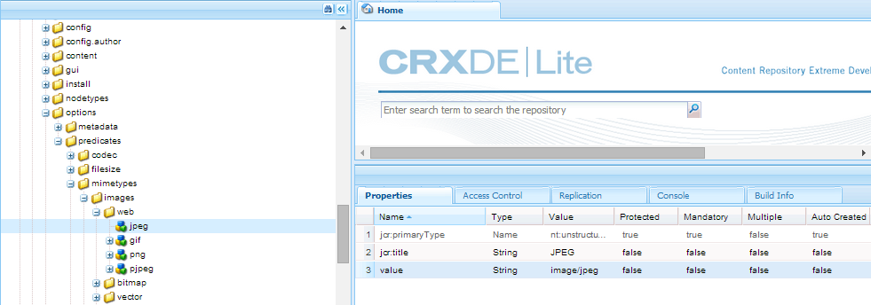

# Zoeken in gezichten {#search-facets}

Leer hoe u zoekfacetten in AEM maakt, wijzigt en gebruikt.

Een bedrijfsbrede implementatie van Adobe Experience Manager (AEM)-middelen biedt de mogelijkheid om veel middelen op te slaan. Soms kan het lastig en tijdrovend zijn om het juiste middel te vinden als u alleen de algemene zoekmogelijkheden van AEM gebruikt.

Gebruik zoekfacetten in het deelvenster Filters om de zoekervaring gedetailleerder te maken en de zoekfunctionaliteit efficiënter en veelzijdiger te maken. De facetten van het onderzoek voegen veelvoudige afmetingen (predikaten) toe die u toelaten om complexere onderzoeken uit te voeren. Het deelvenster Filters bevat een aantal standaardfacetten. U kunt ook aangepaste zoekfacetten toevoegen.

Samengevat kunt u met zoekfacetten op verschillende manieren naar elementen zoeken in plaats van in één, vooraf bepaalde, taxonomische volgorde. U kunt gemakkelijk tot het gewenste niveau van detail voor een gerichter onderzoek boor.

Als u bijvoorbeeld een afbeelding zoekt, kunt u kiezen of u een bitmap- of een vectorafbeelding wilt. U kunt het zoekbereik verder verkleinen door het MIME-type voor de afbeelding op te geven. Op dezelfde manier kunt u bij het zoeken naar documenten de indeling opgeven, bijvoorbeeld PDF of MS Word.

## Een voorspelling toevoegen {#adding-a-predicate}

De zoekfacetten die in het deelvenster Filters worden weergegeven, worden in het onderliggende zoekformulier gedefinieerd aan de hand van voorspelden. Als u meer of verschillende facetten wilt weergeven, voegt u voorspelingen toe aan het standaardformulier of gebruikt u een aangepast formulier dat naar keuze facetten bevat.

Voor zoekopdrachten in volledige tekst voegt u de voorspelling Fulltext toe aan het formulier. Gebruik de voorspelling van de eigenschap om te zoeken naar elementen die overeenkomen met één eigenschap die u opgeeft. Gebruik de voorspelling Opties om te zoeken in elementen die overeenkomen met een of meer waarden voor een bepaalde eigenschap. Voeg de Datumbereik-voorspelling toe aan zoekelementen die binnen een opgegeven datumbereik zijn gemaakt.

1. Tik/klik op het AEM-logo en ga vervolgens naar **[!UICONTROL Gereedschappen]** > **[!UICONTROL Algemeen]** > **[!UICONTROL Formulieren]** zoeken.
1. Selecteer op de pagina Formulieren zoeken de optie **[!UICONTROL Middelen Admin Search Rail]** en tik vervolgens op **Edit** .

   

   Zoek en selecteer de middelen die Admin Search Rail

   >[!NOTE]
   >
   >Voer de volgende stappen uit om de zoekfunctionaliteit voor mappen van de vooraf geconfigureerde **middelen te gebruiken die Admin Search Rail** uit een eerdere AEM-versie heeft:
   >
   >1. Navigeer naar */conf/global/settings/dam/search/facets/assets/jcr:content/items* in CRXDE.
   >1. Verwijder het **type** knooppunt.
   >1. Kopieer van het pad */libs/settings/dam/search/facets/assets/jcr:content/items* de knooppunten **element, directory, typeor, excludepaths** en **searchType** naar het pad dat in stap 1 wordt vermeld.
   >1. Sla de wijzigingen op.


1. Op de pagina Zoekformulieren bewerken sleept u een voorspelling van het tabblad **[!UICONTROL Selecteren van voorspelling]** naar het hoofdvenster. Sleep bijvoorbeeld **[!UICONTROL Eigenschappenvoorspelling]**.

   

   Sleep een voorspelling om de zoekfilters aan te passen

1. Voer op het tabblad Instellingen een veldlabel, plaatsaanduidingstekst en beschrijving voor de voorspelling in. Geef een geldige naam op voor de eigenschap metadata die u aan de voorspelling wilt koppelen.

   Het koptekstlabel op het tabblad Instellingen geeft het type van de geselecteerde voorspelling aan.

   

   Gebruik het tabblad Instellingen om de vereiste opties voor een voorspelling op te geven

1. Geef in het veld **[!UICONTROL Eigenschapnaam]** een geldige naam op voor de eigenschap metadata die u aan de voorspelling wilt koppelen. Dit is de naam op basis waarvan de zoekopdracht wordt uitgevoerd. Voer bijvoorbeeld in `jcr:content/metadata/dc:description` of `./jcr:content/metadata/dc:description`.

   U kunt ook een bestaand knooppunt selecteren in het dialoogvenster Selecteren.

   

   Een metagegevenseigenschap koppelen aan een voorspelling in het veld Eigenschapnaam

1. Tik/klik op de **[!UICONTROL voorvertoning]** van de  om een voorvertoning van het deelvenster Filters te genereren zoals deze wordt weergegeven nadat u de voorvertoning hebt toegevoegd.
1. Bekijk de lay-out van de voorspelling in de modus Voorbeeld.

   

   Voorbeeld van het zoekformulier bekijken voordat de wijzigingen worden verzonden

1. Tik of klik op **[!UICONTROL Sluiten]**  in de rechterbovenhoek van de voorvertoning om de voorvertoning te sluiten.
1. Tik op **[!UICONTROL Gereed]** om de instellingen op te slaan.
1. Navigeer naar het deelvenster Zoeken in de gebruikersinterface Elementen. De voorspelling van de eigenschap wordt toegevoegd aan het deelvenster.
1. Voer in het tekstvak een beschrijving in voor het element dat u wilt doorzoeken. Voer bijvoorbeeld &quot;Adobe&quot; in. Wanneer u een zoekopdracht uitvoert, worden elementen met een beschrijving die overeenkomt met &quot;Adobe&quot;, weergegeven in de zoekresultaten.

## Een voorspelling van opties toevoegen {#adding-an-options-predicate}

Met de voorspelling Opties kunt u meerdere zoekopties toevoegen in het deelvenster Filters. U kunt een of meer van deze opties selecteren in het deelvenster Filters om te zoeken naar elementen. Als u bijvoorbeeld naar elementen wilt zoeken op basis van het bestandstype, configureert u opties, zoals Afbeeldingen, Multimedia, Documenten en Archieven, in het zoekformulier. Nadat u deze opties hebt geconfigureerd, wordt de zoekopdracht uitgevoerd op elementen van het type GIF, JPEG, PNG, enzovoort, wanneer u de optie Afbeeldingen selecteert in het deelvenster Filters.

Als u de opties wilt toewijzen aan de desbetreffende eigenschap, maakt u een knooppuntstructuur voor de opties en geeft u het pad van het bovenliggende knooppunt op in de eigenschap Eigenschapnaam van de voorspelling van opties. Het bovenliggende knooppunt moet van het type zijn `sling`: `OrderedFolder`. De opties moeten van type zijn `nt:unstructured`. De optieknooppunten zouden de eigenschappen moeten hebben `jcr:title` en `value` gevormd.

De `jcr:title` eigenschap is een gebruiksvriendelijke naam voor de optie die wordt weergegeven in het deelvenster Filters. Het `value` veld wordt gebruikt in de query om overeen te komen met de opgegeven eigenschap.

Wanneer u een optie selecteert, wordt het onderzoek uitgevoerd gebaseerd op het `value` bezit van de optieknoop en zijn kindknopen, als om het even welk. De volledige boom onder de optieknoop wordt getransformeerd en het `value` bezit van elke kindknoop wordt gecombineerd gebruikend OF verrichting om de onderzoeksvraag te vormen.

Als u bijvoorbeeld &quot;Afbeeldingen&quot; selecteert voor bestandstypen, wordt de zoekquery voor de elementen samengesteld door de `value` eigenschap te combineren met een OR-bewerking. De zoekquery voor afbeeldingen wordt bijvoorbeeld samengesteld door de resultaten te combineren die overeenkomen met *afbeelding/jpeg*, *afbeelding/gif*, *afbeelding/png*, *afbeelding/pjpeg* en *afbeelding/tiff* `jcr:content/metadata/dc:format` voor de eigenschap met behulp van de bewerking OR.



Het bezit van de waarde van een dossiertype, zoals die in CRXDE wordt gezien wordt gebruikt voor onderzoeksvragen om te werken

In plaats van handmatig een knooppuntstructuur voor de opties in de CRXDE-opslagplaats te maken, kunt u de opties in een JSON-bestand definiëren door corresponderende sleutel-waardeparen op te geven. Geef het pad van het JSON-bestand op in het veld **[!UICONTROL Eigenschapnaam]** . U kunt bijvoorbeeld de sleutel-waardeparen `image/bmp`, `image/gif`, `image/jpeg`en `image/png` hun waarden definiëren zoals getoond in het volgende JSON-voorbeeldbestand. In het veld **[!UICONTROL Eigenschapnaam]** kunt u het CRXDE-pad voor dit bestand opgeven.

```JSON
{
    "options" :
 [
          {"value" : "image/bmp","text" : "BMP"},
          {"value" : "image/gif","text" : "GIF"},
          {"value" : "image/jpeg","text" : "JPEG"},
          {"value" : "image/png","text" : "PNG"}
 ]
}
```

Als u een bestaand knooppunt wilt gebruiken, geeft u dit op in het dialoogvenster Selecteren.

>[!NOTE]
>
>De voorspelling van Opties is een aangepaste omslag die bezitsvoorspelling omvat om het beschreven gedrag aan te tonen. Momenteel, is er geen REST eindpunt beschikbaar om de functionaliteit te steunen native.

1. Tik op het AEM-logo en ga vervolgens naar **[!UICONTROL Gereedschappen > Algemeen > Formulieren]** zoeken.
1. Selecteer op de pagina **[!UICONTROL Formulieren]** zoeken de optie **[!UICONTROL Middelen beheren Zoekspoor]** en tik vervolgens op het pictogram Bewerken.
1. Op de pagina Zoekformulier **** bewerken sleept u de voorspelling **[!UICONTROL van]** opties van het tabblad **[!UICONTROL Voorspelling]** selecteren naar het hoofdvenster.
1. Voer op het tabblad **[!UICONTROL Instellingen]** een label en een naam voor de eigenschap in. Als u bijvoorbeeld elementen wilt zoeken op basis van hun indeling, geeft u een gebruikersvriendelijke naam voor het label op, bijvoorbeeld **[!UICONTROL Bestandstype]**. Geef bijvoorbeeld de eigenschap op op basis waarvan de zoekopdracht in het eigenschapveld moet worden uitgevoerd `jcr:content/metadata/dc:format.`
1. Voer een van de volgende handelingen uit:

   * Geef in het veld **[!UICONTROL Eigenschapnaam]** het pad van het JSON-bestand op waarin u de knooppunten voor de opties definieert en corresponderende sleutel-waardeparen opgeeft.
   * Tik of klik op het `+` symbool naast het veld Opties om de weergavetekst en -waarde op te geven voor de opties die u wilt opgeven in het deelvenster Filters. Tik op een symbool of klik op een symbool om een andere optie toe te voegen en herhaal deze stap. `+`

1. Zorg ervoor dat **[!UICONTROL Single Select]** is gewist, zodat de gebruiker meerdere opties voor bestandstypen tegelijk kan selecteren (bijvoorbeeld Afbeeldingen, Documenten, Multimedia en Archieven). Als u **[!UICONTROL Enkel selecteren]** selecteert, kan de gebruiker slechts één optie voor dossiertypes tegelijkertijd selecteren.

   

   De beschikbare velden in de voorspelling Opties

1. Voer in het veld **[!UICONTROL Beschrijving]** een optionele beschrijving in en klik op **[!UICONTROL Gereed]**.
1. Navigeer naar het deelvenster Zoeken. De voorspelling Opties wordt toegevoegd aan het deelvenster **Zoeken** . De opties voor **[!UICONTROL Bestandstype]** worden weergegeven als selectievakjes.

## Eigenschappenvoorspelling voor meerdere waarden toevoegen {#adding-a-multi-value-property-predicate}

Met de voorspelling Multi-Value-eigenschap kunt u elementen zoeken naar meerdere waarden. Overweeg een scenario waarbij u afbeeldingen van meerdere producten in AEM-elementen hebt en de metagegevens voor elke afbeelding een SKU-nummer bevatten dat aan het product is gekoppeld. Met deze voorspelling kunt u op basis van meerdere SKU-nummers zoeken naar productafbeeldingen.

1. Klik op het AEM-logo en ga vervolgens naar **[!UICONTROL Gereedschappen]** > **[!UICONTROL Algemeen]** > **[!UICONTROL Formulieren]** zoeken.
1. Selecteer op de pagina Zoekformulieren de optie **[!UICONTROL Middelen zoeken in]** Admin-rails **[!UICONTROL en tik op]** Middelen bewerken _edit.
1. Sleep op de pagina Zoekformulier bewerken een voorspelling **[!UICONTROL voor]** meerdere waarden van het tabblad **[!UICONTROL Voorspelling]** selecteren naar het hoofdvenster.
1. Voer op het tabblad **[!UICONTROL Instellingen]** een label en plaatsaanduidingstekst in voor de voorspelling. Geef bijvoorbeeld de eigenschapnaam op op basis waarvan de zoekopdracht in het eigenschapveld moet worden uitgevoerd `jcr:content/metadata/dc:value`. U kunt ook een knooppunt selecteren in het dialoogvenster Selecteren.
1. Zorg ervoor dat Ondersteuning voor **[!UICONTROL scheidingstekens]** is geselecteerd. Geef in het veld **[!UICONTROL Invoerscheidingstekens]** scheidingstekens op om afzonderlijke waarden van elkaar te scheiden. Standaard wordt een komma opgegeven als scheidingsteken. U kunt een ander scheidingsteken opgeven.
1. Voer in het veld **Beschrijving** een optionele beschrijving in en tik op **[!UICONTROL Gereed]**.
1. Navigeer naar het deelvenster Filters in de gebruikersinterface Elementen. De voorspelling van de eigenschap **** voor meerdere waarden wordt toegevoegd aan het deelvenster.
1. Geef meerdere waarden op in het veld Meerdere waarden, gescheiden door de scheidingstekens, en voer de zoekopdracht uit. Met de functie voor voorspellen wordt een exacte tekstovereenkomst opgehaald voor de waarden die u opgeeft.

## Een voorspelling van tags toevoegen {#adding-a-tags-predicate}

Met de tagvoorspelling kunt u op tags gebaseerde zoekopdrachten naar elementen uitvoeren. Standaard zoekt AEM-elementen naar elementen op basis van een of meer tags die overeenkomen met de tags die u opgeeft. Met andere woorden, de zoekquery voert een OR-bewerking uit met de opgegeven tags. U kunt echter de optie Alle tags afstemmen gebruiken om te zoeken naar elementen die alle tags bevatten die u opgeeft.

1. Klik op het AEM-logo en ga vervolgens naar **[!UICONTROL Gereedschappen]** > **[!UICONTROL Algemeen]** > **[!UICONTROL Formulieren]** zoeken.
1. Selecteer op de pagina Formulieren zoeken de optie **[!UICONTROL Middelen Admin Search Rail]** en tik vervolgens op **[!UICONTROL Edit]** .
1. Op de pagina Zoekformulier bewerken sleept u de **[!UICONTROL voorspelling]** van labels uit het tabblad Voorspelling selecteren naar het hoofdvenster.
1. Voer op het tabblad Instellingen een plaatsaanduidingstekst in voor de voorspelling. Geef de naam van de eigenschap op op basis waarvan de zoekopdracht moet worden uitgevoerd in het eigenschapveld, bijvoorbeeld *jcr:content/metadata/cq:tags*. U kunt ook een knooppunt in CRXDE selecteren in het dialoogvenster Selecteren.
1. Configureer de padeigenschap Root-tags van deze voorspelling om verschillende tags in de lijst Tags te vullen.
1. Selecteer de optie **[!UICONTROL Tonen komt overeen met alle tags]** om te zoeken naar elementen die alle tags bevatten die u opgeeft.

   

   Typische instellingen van labels voorspellen

1. Voer in het veld **[!UICONTROL Beschrijving]** een optionele beschrijving in en klik/tik op **[!UICONTROL Gereed]**.
1. Navigeer naar het deelvenster Zoeken. De voorspelling van **[!UICONTROL labels]** wordt toegevoegd aan het deelvenster Zoeken.
1. Geef tags op op basis waarvan u de elementen wilt zoeken of een selectie wilt maken in de lijst met suggesties.

   

   AEM-suggestie bij het typen van de naam van een tag

1. Selecteer Alles **** afstemmen om te zoeken naar overeenkomsten die alle tags bevatten die u opgeeft.

## Andere voorspelling toevoegen {#adding-other-predicates}

Net als bij de manier waarop u een voorspelling van eigenschappen of een voorspelling van opties toevoegt, kunt u de volgende aanvullende voorspelling toevoegen aan het deelvenster Zoeken:

| Naam voorspelling | Beschrijving | Eigenschappen |
|---|---|---|
| [!UICONTROL Fulltext] | Zoekvoorspelling om volledige tekstzoekopdrachten uit te voeren op een volledig elementknooppunt. Deze wordt toegewezen met de operator jcr:contains. U kunt een relatief pad opgeven als u een volledige tekstzoekopdracht wilt uitvoeren op een bepaald gedeelte van het knooppunt met elementen. | <ul><li>Label</li><li>Plaatsaanduiding</li><li>Eigenschapnaam</li><li>Beschrijving</li></ul> |
| [!UICONTROL Padbrowser] | Zoekvoorspelling voor het zoeken naar elementen in mappen en submappen op een vooraf geconfigureerd hoofdpad | <ul><li>Plaatsaanduiding</li><li>Basispad</li><li>Beschrijving</li></ul> |
| [!UICONTROL Pad] | Gebruik deze optie om resultaten op de locatie te filteren. U kunt verschillende paden opgeven als opties. | <ul><li>Label</li><li>Pad</li><li>Beschrijving</li></ul> |
| [!UICONTROL Status publiceren] | Zoeken voorspellen om middelen te zoeken op basis van hun publicatiestatus | <ul><li>Label</li><li>Eigenschapnaam</li><li>Beschrijving</li></ul> |
| [!UICONTROL Relatieve datum] | Zoeken voorspelt dat er wordt gezocht naar elementen op basis van de relatieve datum waarop deze zijn gemaakt. U kunt bijvoorbeeld opties configureren, zoals 2 maanden geleden, 3 weken geleden enzovoort. | <ul><li>Label</li><li>Eigenschapnaam</li><li>Relatieve datum</li></ul> |
| [!UICONTROL Bereik] | Zoeken voorspelt dat er wordt gezocht in elementen die binnen een opgegeven bereik vallen. In het paneel van het Onderzoek, kunt u minimum en maximumwaarden voor de waaier specificeren. | <ul><li>Label</li><li>Eigenschapnaam</li><li>Beschrijving</li></ul> |
| [!UICONTROL Datumbereik] | Zoeken voorspelt hoe u elementen die binnen een opgegeven bereik zijn gemaakt, kunt zoeken naar een datumeigenschap. In het deelvenster Zoeken kunt u begin- en einddatums opgeven met behulp van datumkiezers. | <ul><li>Label</li><li>Plaatsaanduiding</li><li>Eigenschapnaam</li><li>Tekst bereik (van)</li><li>Tekst bereik (naar)</li><li>Beschrijving</li></ul> |
| [!UICONTROL Date] | Zoeken voorspelt hoe elementen op basis van een schuifregelaar worden doorzocht op basis van een eigenschap date. | <ul><li>Label</li><li>Eigenschapnaam</li><li>Beschrijving</li></ul> |
| [!UICONTROL Bestandsgrootte] | Zoeken voorspelt hoe u elementen kunt zoeken op basis van hun grootte. Het is een op meer details gebaseerde voorspelling waarbij u de schuifopties van een configureerbaar knooppunt selecteert. De standaardopties worden gedefinieerd bij /libs/dam/options/predicates/filesize in de CRXDE-opslagplaats. De bestandsgrootte wordt opgegeven in bytes. | <ul><li>Label</li><li>Eigenschapnaam</li><li>Pad</li><li>Beschrijving</li></ul> |
| [!UICONTROL Element laatst gewijzigd] | Zoekvoorspelling voor zoeken in onlangs gewijzigde elementen | <ul><li>Eigenschapnaam</li><li>Waarde van eigenschap</li><li>Beschrijving</li></ul> |
| [!UICONTROL Status publiceren] | Zoeken voorspellen om te zoeken naar elementen op basis van hun publicatiestatus | <ul><li>Label</li><li>Eigenschapnaam</li><li>Beschrijving</li></ul> |
| [!UICONTROL Classificatie] | Zoeken voorspelt dat er wordt gezocht naar elementen op basis van hun gemiddelde waardering | <ul><li>Label</li><li>Eigenschapnaam</li><li>Optiepad</li><li>Beschrijving</li></ul> |
| [!UICONTROL Vervalstatus] | Zoeken voorspelt dat naar elementen wordt gezocht op basis van hun vervalstatus | <ul><li>Label</li><li>Eigenschapnaam</li><li>Beschrijving</li></ul> |
| [!UICONTROL Verborgen] | Zoekvoorspelling die een verborgen veldeigenschap definieert voor het zoeken naar elementen | <ul><li>Eigenschapnaam</li><li>Waarde van eigenschap</li><li>Beschrijving</li></ul> |

## Standaardzoekfacetten herstellen {#restoring-default-search-facets}

Standaard wordt een vergrendelingspictogram weergegeven voordat de **[!UICONTROL Middelen Admin Search Rail]** op de pagina **[!UICONTROL Zoekformulieren]** worden weergegeven. Het vergrendelingspictogram verdwijnt als u zoekfacetten aan het formulier toevoegt die aangeven dat het standaardformulier is gewijzigd.


Het pictogram Vergrendelen aan de hand van een optie op de pagina Zoekformulieren geeft aan dat de standaardinstellingen intact zijn en niet zijn aangepast.

Voer de volgende stappen uit om de standaardzoekfacet te herstellen:

1. Selecteer **[!UICONTROL Middelen Admin Search Rail]** op de pagina **[!UICONTROL Zoekformulieren]** .
1. Tik op **[!UICONTROL Verwijderen]** op de werkbalk.
   
1. Tik in het bevestigingsvenster op **[!UICONTROL Verwijderen]** om de aangepaste wijzigingen te verwijderen.

   Nadat u de aangepaste wijzigingen in zoekfacetten hebt verwijderd, verschijnt het vergrendelingspictogram opnieuw voordat **[!UICONTROL Middelen Admin Search Rail]** wordt weergegeven op de pagina **[!UICONTROL Zoeken in formulieren]** .

## Gebruikersmachtigingen {#user-permissions}

Als er geen beheerdersrol aan u is toegewezen, volgt hier een lijst met machtigingen die u nodig hebt voor het uitvoeren van bewerkingen, verwijderen en voorvertoningen van handelingen met zoekfacetten.

| Actie | Machtigingen |
|---|---|
| [!UICONTROL Bewerken] | Lees en schrijf toestemmingen op de `/apps` knoop in CRXDE |
| [!UICONTROL Verwijderen] | De lees, schrijft en schrapt toestemmingen op de `/apps` knoop in CRXDE |
| [!UICONTROL Voorvertoning] | De lees, schrijft, en schrapt toestemmingen op de `/var/dam/content` knoop in CRXDE. Ook, lees en schrijf toestemmingen op `/apps` knoop. |

>[!MORELIKETHIS]
>
>* [Zoekmogelijkheden voor middelen uitbreiden](searchx.md)
>* [Zoeken in middelen](search-assets.md)

