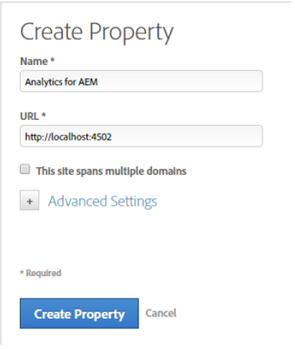

# Asset Insights inschakelen via DTM {#enable-asset-insights-through-dtm}

Adobe Dynamisch tagbeheer is een programma waarmee u uw digitale marketingtools kunt activeren. Deze service wordt gratis aan Adobe Analytics-klanten aangeboden. U kunt uw trackingcode aanpassen om CMS-oplossingen van derden in staat te stellen Asset Insights te gebruiken, of u kunt DTM gebruiken om labels voor Asset Insights in te voegen. Inzichten worden alleen ondersteund en opgegeven voor afbeeldingen.

>[!CAUTION]
>
>Adobe DTM is afgekeurd ten gunste van Adobe Experience Platform Launch en zal binnenkort [aflopen](https://medium.com/launch-by-adobe/dtm-plans-for-a-sunset-3c6aab003a6f). Adobe raadt u aan Launch te [gebruiken voor inzicht in elementen](https://docs.adobe.com/content/help/en/experience-manager-learn/assets/advanced/asset-insights-launch-tutorial.html).

Voer deze stappen uit om Asset Insights in te schakelen via DTM.

1. Klik op het logo van de Experience Manager en ga naar **[!UICONTROL Tools]** > **[!UICONTROL Assets]** > **[!UICONTROL Insights Configuration]**.
1. [Implementatie van Experience Managers configureren met DTM Cloud Service](/help/sites-administering/dtm.md)

   De API-token moet beschikbaar zijn wanneer u zich aanmeldt bij [https://dtm.adobe.com](https://dtm.adobe.com/) en **[!UICONTROL Account Settings]** in het gebruikersprofiel bezoekt. Deze stap is niet vereist vanuit het standpunt van de Inzichten van Activa, omdat de integratie van de Plaatsen van de Experience Manager met de Inzichten van Activa nog in de werken is.

1. Meld u aan bij [https://dtm.adobe.com](https://dtm.adobe.com/)en selecteer een bedrijf.
1. Een bestaande webeigenschap maken of openen

   * Selecteer het **[!UICONTROL Web Properties]** tabblad en klik op **[!UICONTROL Add Property]**.

   * Werk de velden naar wens bij en klik op **[!UICONTROL Create Property]**. Zie [documentatie](https://docs.adobe.com/content/help/en/experience-manager-learn/getting-started-wknd-tutorial-develop/overview.html).

   

1. Selecteer op het **[!UICONTROL Rules]** tabblad een optie in het navigatievenster en klik op **[!UICONTROL Page Load Rules]** **[!UICONTROL Create New Rule]**.

   

1. Uitbreiden **[!UICONTROL JavaScript /Third Party Tags]**. Klik vervolgens op **[!UICONTROL Add New Script]** het **[!UICONTROL Sequential HTML]** tabblad om het dialoogvenster Script te openen.

   

1. Klik op het logo van de Experience Manager en ga naar **[!UICONTROL Tools]** > **[!UICONTROL Assets]**.
1. Klik **[!UICONTROL Insights Page Tracker]**, kopieer de trackercode en plak deze in het dialoogvenster Script dat u in stap 6 hebt geopend. Sla de wijzigingen op.

   >[!NOTE]
   >
   >* `AppMeasurement.js` wordt verwijderd. Naar verwachting is het beschikbaar via het Adobe Analytics-hulpprogramma van DTM.
   >* De vraag aan `assetAnalytics.dispatcher.init()` wordt verwijderd. De functie wordt naar verwachting aangeroepen zodra het Adobe Analytics-hulpprogramma van DTM is voltooid.
   >* Afhankelijk van de plaats waar Asset Insights Page Tracker wordt gehost (bijvoorbeeld Experience Manager, CDN enzovoort), kan de oorsprong van de scriptbron wijzigingen vereisen.
   >* In het geval van door Experience Managers gehoste paginanummering, moet de bron verwijzen naar een publicatie-instantie met de hostnaam van de verzenderinstantie.


1. Ga naar `https://dtm.adobe.com`. Klik **[!UICONTROL Overview]** in het Web bezit en klik **[!UICONTROL Add Tool]** of open een bestaand Hulpmiddel van Adobe Analytics. Tijdens het maken van het gereedschap kunt u instellen **[!UICONTROL Configuration Method]** op **[!UICONTROL Automatic]**.

   

   Selecteer de gewenste opties voor het rapport Staging/Productie.

1. Vouw uit **[!UICONTROL Library Management]** en zorg ervoor dat **[!UICONTROL Load Library at]** is ingesteld op **[!UICONTROL Page Top]**.

   

1. Vouw uit **[!UICONTROL Customize Page Code]** en klik op **[!UICONTROL Open Editor]**.

   

1. Plak de volgende code in het venster:

   ```Java
   var sObj;
   
   if (arguments.length > 0) {
     sObj = arguments[0];
   } else {
     sObj = _satellite.getToolsByType('sc')[0].getS();
   }
   _satellite.notify('in assetAnalytics customInit');
   (function initializeAssetAnalytics() {
     if ((!!window.assetAnalytics) && (!!assetAnalytics.dispatcher)) {
       _satellite.notify('assetAnalytics ready');
       /** NOTE:
           Copy over the call to 'assetAnalytics.dispatcher.init()' from Assets Pagetracker
           Be mindful about changing the AppMeasurement object as retrieved above.
       */
       assetAnalytics.dispatcher.init(
             "",  /** RSID to send tracking-call to */
             "",  /** Tracking Server to send tracking-call to */
             "",  /** Visitor Namespace to send tracking-call to */
             "",  /** listVar to put comma-separated-list of Asset IDs for Asset Impression Events in tracking-call, e.g. 'listVar1' */
             "",  /** eVar to put Asset ID for Asset Click Events in, e.g. 'eVar3' */
             "",  /** event to include in tracking-calls for Asset Impression Events, e.g. 'event8' */
             "",  /** event to include in tracking-calls for Asset Click Events, e.g. 'event7' */
             sObj  /** [OPTIONAL] if the webpage already has an AppMeasurement object, include the object here. If unspecified, Pagetracker Core shall create its own AppMeasurement object */
             );
       sObj.usePlugins = true;
       sObj.doPlugins = assetAnalytics.core.updateContextData;
       assetAnalytics.core.optimizedAssetInsights();
     }
     else {
       _satellite.notify('assetAnalytics not available. Consider updating the Custom Page Code', 4);
     }
   })();
   ```

   * De regel voor het laden van pagina&#39;s in DTM bevat alleen de `pagetracker.js` code. Alle `assetAnalytics` velden worden beschouwd als overschrijvingen voor standaardwaarden. Deze zijn niet standaard vereist.
   * De codevraag `assetAnalytics.dispatcher.init()` na het ervoor zorgen dat `_satellite.getToolsByType('sc')[0].getS()` wordt geïnitialiseerd en beschikbaar `assetAnalytics,dispatcher.init` is. Daarom kunt u overslaan toevoegend het in stap 11.
   * Zoals aangegeven in opmerkingen in de code van Insights Page Tracker (**[!UICONTROL Tools > Assets > Insights Page Tracker]**), zijn de eerste drie argumenten (RSID, Tracking Server en Visitor Namespace) irrelevant wanneer Paginanummering geen `AppMeasurement` object maakt. Lege tekenreeksen worden doorgegeven om dit te markeren.\
      De resterende argumenten beantwoorden aan wat in de pagina van de Configuratie van Inzichten (**[!UICONTROL Tools > Assets > Insights Configuration]**) wordt gevormd.
   * Het object AppMeasurement wordt opgehaald door te zoeken `satelliteLib` naar alle beschikbare SiteCatalyst-engines. Als er meerdere tags zijn geconfigureerd, wijzigt u de index van de arraykiezer op de juiste manier. Items in de array worden geordend volgens de SiteCatalyst-gereedschappen die beschikbaar zijn in de DTM-interface.

1. Sla het venster Code-editor op, sluit dit en sla de wijzigingen vervolgens op in de configuratie van het gereedschap.
1. In het **[!UICONTROL Approvals]** lusje, keur beide lopende goedkeuringen goed. De tag DTM kan worden ingevoegd in uw webpagina. Zie DTM [integreren in aangepaste paginasjablonen](https://blogs.adobe.com/experiencedelivers/experience-management/integrating-dtm-custom-aem6-page-template/)voor meer informatie over het invoegen van DTM-tags in webpagina&#39;s.
