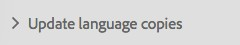

# Vertaalprojecten maken {#creating-translation-projects}

Als u een taalkopie wilt maken, activeert u een van de volgende workflows voor het kopiëren van talen die beschikbaar zijn onder de References-rail in de [!DNL Experience Manager] gebruikersinterface.

* **Maken en vertalen**: In deze workflow worden elementen die moeten worden vertaald, gekopieerd naar de hoofdtaal van de taal waarnaar u wilt vertalen. Bovendien wordt, afhankelijk van de opties u kiest, een vertaalproject gecreeerd voor de activa in de console van Projecten. Afhankelijk van de instellingen kan het vertaalproject handmatig worden gestart of automatisch worden uitgevoerd zodra het vertaalproject is gemaakt.

* **Taalkopieën** bijwerken: Voer deze workflow uit om een extra groep elementen te vertalen en deze op te nemen in een taalkopie voor een bepaalde landinstelling. In dit geval worden de vertaalde elementen toegevoegd aan de doelmap die al eerder vertaalde elementen bevat.

>[!NOTE]
>
>De binaire boeken van activa worden vertaald slechts als de vertaaldienstverlener de vertaling van binaire getallen steunt.

>[!NOTE]
>
>Als u een vertaalworkflow start voor complexe elementen, zoals PDF- en InDesign-bestanden, worden de subelementen of vertoningen (indien aanwezig) van die elementen niet voor vertaling verzonden.

## Workflow maken en vertalen {#create-and-translate-workflow}

Met de workflow Maken en vertalen kunt u voor het eerst voor een bepaalde taal een kopie van de taal genereren. De workflow bevat de volgende opties:

* Alleen structuur maken.
* Maak een nieuw vertaalproject.
* Toevoegen aan bestaand vertaalproject.

### Alleen structuur maken {#create-structure-only}

Met de optie **[!UICONTROL Alleen structuur maken]** kunt u een doelmaphiërarchie in de hoofdmap van de doeltaal maken die overeenkomt met de hiërarchie van de bronmap in de hoofdmap van de brontaal. In dit geval worden bronassets naar de doelmap gekopieerd. Er wordt echter geen vertaalproject gegenereerd.

1. Selecteer in de [!DNL Assets] interface de bronmap waarvoor u een structuur wilt maken in de hoofdmap van de doeltaal.
1. Open het venster **[!UICONTROL Referenties]** en klik/tik op **[!UICONTROL Taalkopieën]** onder **[!UICONTROL Kopieën]**.

   

1. Klik onderaan op **[!UICONTROL Maken en vertalen]** .

   

1. From the **[!UICONTROL Target Languages]** list, select the language for which you want to create a folder structure.

   

1. Kies in de lijst **[!UICONTROL Project]** de optie Alleen **[!UICONTROL structuur]** maken.

   

1. Klik/tik op **[!UICONTROL Maken]**. De nieuwe structuur voor de doeltaal wordt vermeld onder **[!UICONTROL Taalkopieën]**.

   

1. Klik of tik op de structuur in de lijst en klik op **[!UICONTROL Tonen in middelen]** om naar de mapstructuur in de doeltaal te navigeren.

   

### Een nieuw vertaalproject maken {#create-a-new-translation-project}

Als u deze optie gebruikt, worden de te vertalen middelen gekopieerd aan de taalwortel van de taal waaraan u wilt vertalen. Afhankelijk van de opties u kiest, wordt een vertaalproject gecreeerd voor de activa in de console van Projecten. Afhankelijk van de instellingen kan het vertaalproject handmatig worden gestart of automatisch worden uitgevoerd zodra het vertaalproject is gemaakt.

1. Selecteer in de interface Elementen de bronmap waarvoor u een taalkopie wilt maken.
1. Open het venster **[!UICONTROL Referenties]** en klik/tik op **[!UICONTROL Taalkopieën]** onder **[!UICONTROL Kopieën]**.

   

1. Klik onderaan op **[!UICONTROL Maken en vertalen]** .

   

1. From the **[!UICONTROL Target Languages]** list, select the language(s) for which you want to create a folder structure.

   

1. Selecteer in de lijst **[!UICONTROL Project]** de optie **[!UICONTROL Een nieuw vertaalproject]** maken.

   

1. In the **[!UICONTROL Project Title]** field, enter a title for the project.

   

1. Klik/tik op **[!UICONTROL Maken]**. Middelen uit de bronmap worden gekopieerd naar de doelmappen voor de landinstellingen die u in stap 4 hebt geselecteerd.

   

1. Als u naar de map wilt navigeren, selecteert u de taalkopie en klikt u op **[!UICONTROL Tonen in middelen]**.

   

1. Navigeer aan de console van Projecten. De vertaalomslag wordt gekopieerd aan de console van Projecten.

   

1. Open de map om het vertaalproject weer te geven.

   

1. Klik of tik op het project om de detailpagina te openen.

   

1. Als u de status van de vertaaltaak wilt weergeven, klikt u op de ovaal onder aan het **[!UICONTROL onderdeel Vertaaltaak]** .

   

   Zie [De status van een vertaaltaak](/help/sites-administering/tc-manage.md#monitoring-the-status-of-a-translation-job)controleren voor meer informatie over de taakstatus.

1. Navigeer naar de interface Middelen en open de pagina Eigenschappen voor elk van de vertaalde elementen om de vertaalde metagegevens weer te geven.

   

   *Afbeelding: Vertaalde metagegevens op de pagina met eigenschappen van elementen.*

   >[!NOTE]
   >
   >Deze functie is beschikbaar voor zowel elementen als mappen. Wanneer een middel in plaats van een omslag wordt geselecteerd, wordt de volledige hiërarchie van omslagen tot de taalwortel gekopieerd om een taalexemplaar voor de activa tot stand te brengen.

### Toevoegen aan bestaand vertaalproject {#add-to-existing-translation-project}

Als u deze optie gebruikt, wordt de vertaalworkflow uitgevoerd voor elementen die u na een vorige vertaalworkflow aan de bronmap toevoegt. Alleen de nieuw toegevoegde elementen worden gekopieerd naar de doelmap die eerder vertaalde elementen bevat. In dit geval wordt geen nieuw vertaalproject opgezet.

1. Navigeer in de interface Elementen naar de bronmap die niet-vertaalde elementen bevat.
1. Select an asset you want to translate, and open the **[!UICONTROL Reference pane]**. The **[!UICONTROL Language Copies]** section displays the number of translation copies that are currently available.
1. Klik/tik **[!UICONTROL Taalkopieën]** onder **[!UICONTROL Exemplaren]**. Er wordt een lijst met beschikbare vertaalkopieën weergegeven.
1. Klik onderaan op **[!UICONTROL Maken en vertalen]** .

   

1. From the **[!UICONTROL Target Languages]** list, select the language(s) for which you want to create a folder structure.

   

1. Selecteer in de lijst **[!UICONTROL Project]** de optie **[!UICONTROL Toevoegen aan bestaand vertaalproject]** om de vertaalworkflow in de map uit te voeren.

   

   >[!NOTE]
   >
   >Als u de optie **[!UICONTROL Toevoegen aan bestaand vertaalproject]** kiest, wordt uw vertaalproject alleen toegevoegd aan een bestaand project als uw projectinstellingen exact overeenkomen met de instellingen van het reeds bestaande project. Anders wordt een nieuw project gemaakt.

1. Selecteer in de lijst **[!UICONTROL Bestaande vertaalprojecten]** een project om het element voor vertaling toe te voegen.

   

1. Klik/tik op **[!UICONTROL Maken]**. De te vertalen assets worden toegevoegd aan de doelmap. The updated folder is listed under the **[!UICONTROL Language Copies]** section.

   

1. Navigeer aan de console van Projecten, en open het bestaande vertaalproject u aan toevoegde.
1. Klik/tik de mening van het vertaalproject de pagina van projectdetails.

   

1. Klik of tik op de ellips onder aan de tegel **Vertaaltaak** om de elementen in de vertaalworkflow weer te geven. In de lijst met vertaaltaken worden ook items voor metagegevens en tags van elementen weergegeven. Deze vermeldingen geven aan dat de metagegevens en tags voor de elementen ook worden vertaald.

   >[!NOTE]
   >
   >Als u het item voor tags of metagegevens verwijdert, worden er geen tags of metagegevens voor de elementen omgezet.

   >[!NOTE]
   >
   >Als u Machine Translation gebruikt, worden binaire bestanden met elementen niet vertaald.

   >[!NOTE]
   >
   >Als het element dat u toevoegt aan de vertaaltaak subelementen bevat, selecteert u de subelementen en verwijdert u deze zodat de vertaling zonder scheuren kan worden uitgevoerd.

1. Als u de vertaling voor de elementen wilt starten, klikt of tikt u op de pijl op de tegel **[!UICONTROL Vertaaltaak]** en selecteert u **[!UICONTROL Start]** in de lijst.

   

   Een bericht brengt het begin van de vertaalbaan op de hoogte.

   

1. Als u de status van de vertaaltaak wilt weergeven, klikt of tikt u op de ovaal onder aan het **[!UICONTROL onderdeel Vertaaltaak]** .

   

   Zie [De status van een vertaaltaak](/help/sites-administering/tc-manage.md#monitoring-the-status-of-a-translation-job)controleren voor meer informatie.

1. Nadat de vertaling is voltooid, verandert de status in Ready to Review. Navigeer naar de interface Middelen en open de pagina Eigenschappen voor elk van de vertaalde elementen om de vertaalde metagegevens weer te geven.

## Taalkopieën bijwerken {#update-language-copies}

Voer deze workflow uit om extra elementen te vertalen en deze op te nemen in een taalkopie voor een bepaalde landinstelling. In dit geval worden de vertaalde elementen toegevoegd aan de doelmap die al eerder vertaalde elementen bevat. Afhankelijk van de keuze van opties wordt een vertaalproject gemaakt of wordt een bestaand vertaalproject bijgewerkt voor de nieuwe elementen. De workflow voor het kopiëren van de taal Bijwerken bevat de volgende opties:

* Een nieuw vertaalproject maken
* Toevoegen aan bestaand vertaalproject

### Een nieuw vertaalproject maken {#create-a-new-translation-project-1}

Als u deze optie gebruikt, wordt een vertaalproject gecreeerd voor de reeks activa waarvoor u een taalexemplaar wilt bijwerken.

1. Selecteer in de interface Middelen de bronmap waarin u een element hebt toegevoegd.
1. Open the **[!UICONTROL References]** pane, and click/tap **[!UICONTROL Language Copies]** under **[!UICONTROL Copies]** to display the list of language copies.
1. Select the check box before **[!UICONTROL Language Copies]**, and then select the target folder corresponding to the appropriate locale.

   

1. Klik/tik **[!UICONTROL Update taalexemplaren]** bij de bodem.

   

1. Kies in de lijst **[!UICONTROL Project]** de optie **[!UICONTROL Een nieuw vertaalproject]** maken.

   

1. In the **[!UICONTROL Project Title]** field, enter a title for the project.

   

1. Klik/tik **[!UICONTROL Begin]**.
1. Navigeer aan de console van Projecten. De vertaalomslag wordt gekopieerd aan de console van Projecten.

   

1. Open de map om het vertaalproject weer te geven.

   

1. Klik of tik op het project om de detailpagina te openen.

   

1. Als u de vertaling voor de elementen wilt starten, klikt u op de pijl op de tegel **[!UICONTROL Vertaaltaak]** en selecteert u **[!UICONTROL Start]** in de lijst.

   

   Een bericht brengt het begin van de vertaalbaan op de hoogte.

   

1. Als u de status van de vertaaltaak wilt weergeven, klikt of tikt u op de ovaal onder aan het **[!UICONTROL onderdeel Vertaaltaak]** .

   

   Zie [De status van een vertaaltaak](../sites-administering/tc-manage.md#monitoring-the-status-of-a-translation-job)controleren voor meer informatie over de taakstatus.

1. Navigeer naar de interface Middelen en open de pagina Eigenschappen voor elk van de vertaalde elementen om de vertaalde metagegevens weer te geven.

### Toevoegen aan bestaand vertaalproject {#add-to-existing-translation-project-1}

Als u deze optie gebruikt, worden de elementen toegevoegd aan een bestaand vertaalproject en wordt de taalkopie bijgewerkt voor de landinstelling die u kiest.

1. Selecteer in de interface Middelen de bronmap waaraan u een elementmap hebt toegevoegd.
1. Open the **[!UICONTROL References pane]**, and click/tap **[!UICONTROL Language Copies]** under **[!UICONTROL Copies]** to display the list of language copies.

   

1. Select the check box before **[!UICONTROL Language Copies]**, which selects all language copies. Hef de selectie van andere kopieën op, met uitzondering van de taalkopieën die overeenkomen met de landinstellingen waarnaar u wilt vertalen.

   

1. Klik/tik **[!UICONTROL Update taalexemplaren]** bij de bodem.

   

1. Kies in de lijst **[!UICONTROL Project]** de optie **[!UICONTROL Toevoegen aan bestaand vertaalproject]**.

   

1. Selecteer in de lijst **[!UICONTROL Bestaande vertaalprojecten]** een project om het element voor vertaling toe te voegen.

   

1. Klik/tik **[!UICONTROL Begin]**.
1. Zie de stappen 9-14 van [Toevoegen aan bestaand vertaalproject](translation-projects.md#add-to-existing-translation-project) om de rest van de procedure te voltooien.

## Tijdelijke taalkopieën maken {#creating-temporary-language-copies}

Wanneer u een vertaalworkflow uitvoert om een taalkopie bij te werken met bewerkte versies van de originele elementen, blijft de bestaande taalkopie behouden totdat u de vertaalde elementen goedkeurt. [!DNL Adobe Experience Manager Assets] Hiermee slaat u de nieuw vertaalde middelen op een tijdelijke locatie op en werkt u de bestaande taalkopie bij nadat u de middelen expliciet hebt goedgekeurd. Als u de middelen afwijst, blijft de taalkopie ongewijzigd.

1. Click/tap the source root folder under **[!UICONTROL Language Copies]** for which you already created a language copy, and then click/tap **[!UICONTROL Reveal in Assets]** to open the folder in [!DNL Experience Manager Assets].

   

1. Selecteer in de [!DNL Assets] interface een element dat u al hebt vertaald en klik op het pictogram **[!UICONTROL Bewerken]** op de werkbalk om het element te openen in de bewerkingsmodus.
1. Bewerk het element en sla de wijzigingen op.
1. Voer stap 2-14 van de procedure [Toevoegen aan bestaand vertaalproject](#add-to-existing-translation-project) uit om de taalkopie bij te werken.
1. Klik/tik de ellips bij de bodem van de tegel van de **[!UICONTROL Vertaal]** van de Baan. Uit de lijst met elementen op de pagina **[!UICONTROL Vertaaltaak]** kunt u duidelijk de tijdelijke locatie weergeven waar de vertaalde versie van het element is opgeslagen.

   

1. Schakel het selectievakje naast **[!UICONTROL Titel]** in.
1. From the toolbar, click/tap **[!UICONTROL Accept Translation]** and then click/tap **[!UICONTROL Accept]** in the dialog to overwrite the translated asset in the target folder with the translated version of the edited asset.

   

   >[!NOTE]
   >
   >Accepteer zowel het element als de metagegevens om de vertaalworkflow in staat te stellen het doelmiddel bij te werken.

   Klik op Vertaling **[!UICONTROL afwijzen of tik op Vertaling]** afwijzen om de oorspronkelijk vertaalde versie van het element in de hoofdmap van de doellandinstelling te behouden en de bewerkte versie af te wijzen.

   

1. Als u de vertaalde metagegevens wilt weergeven, navigeert u naar de [!DNL Assets] console en opent u de pagina [!UICONTROL Eigenschappen] voor elk van de vertaalde elementen.

>[!MORELIKETHIS]
>
>* [Tips om metagegevens](https://blogs.adobe.com/experiencedelivers/experience-management/translate_aemassets_metadata/)efficiënt te vertalen.

