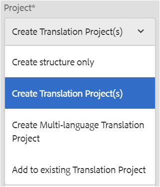
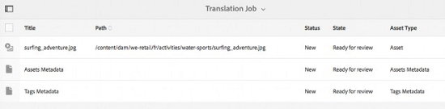

# Vertaalprojecten maken {#creating-translation-projects}

Als u een taalkopie wilt maken, activeert u een van de volgende workflows voor het kopiëren van talen die beschikbaar zijn onder de References-rail in de gebruikersinterface [!DNL Experience Manager].

* **Maken en vertalen**: In deze workflow worden elementen die moeten worden vertaald, gekopieerd naar de hoofdtaal van de taal waarnaar u wilt vertalen. Bovendien wordt, afhankelijk van de opties u kiest, een vertaalproject gecreeerd voor de activa in de console van Projecten. Afhankelijk van de instellingen kan het vertaalproject handmatig worden gestart of automatisch worden uitgevoerd zodra het vertaalproject is gemaakt.

* **Taalkopieën** bijwerken: Voer deze workflow uit om een extra groep elementen te vertalen en deze op te nemen in een taalkopie voor een bepaalde landinstelling. In dit geval worden de vertaalde elementen toegevoegd aan de doelmap die al eerder vertaalde elementen bevat.

>[!NOTE]
>
>De binaire boeken van activa worden vertaald slechts als de vertaaldienstverlener de vertaling van binaire getallen steunt.

>[!NOTE]
>
>Als u een vertaalworkflow start voor complexe elementen, zoals PDF- en [!DNL Adobe InDesign]-bestanden, worden de subelementen of vertoningen (indien aanwezig) van die elementen niet verzonden voor vertaling.

## Workflow {#create-and-translate-workflow} maken en vertalen

Met de workflow Maken en vertalen kunt u voor het eerst voor een bepaalde taal een kopie van de taal genereren. De workflow bevat de volgende opties:

* Alleen structuur maken.
* Maak een nieuw vertaalproject.
* Toevoegen aan bestaand vertaalproject.

### Alleen structuur maken {#create-structure-only}

Gebruik de optie **[!UICONTROL Create structure only]** om een hiërarchie van de doelmap binnen de hoofdmap van de doeltaal te maken die overeenkomt met de hiërarchie van de bronmap in de hoofdmap van de brontaal. In dit geval worden bronassets naar de doelmap gekopieerd. Er wordt echter geen vertaalproject gegenereerd.

1. Selecteer in de interface [!DNL Assets] de bronmap waarvoor u een structuur in de hoofdmap van de doeltaal wilt maken.
1. Open het venster **[!UICONTROL References]** en klik **[!UICONTROL Language Copies]** onder **[!UICONTROL Copies]**.

   

1. Klik **[!UICONTROL Create & Translate]** bij de bodem.

1. Selecteer in de lijst **[!UICONTROL Target Languages]** de taal waarvoor u een mapstructuur wilt maken.

1. Kies in de lijst **[!UICONTROL Project]** de optie **[!UICONTROL Create structure only]**.

   

1. Klik op **[!UICONTROL Create]**. De nieuwe structuur voor de doeltaal wordt vermeld onder **[!UICONTROL Language Copies]**.

   

1. Klik op de structuur in de lijst en klik vervolgens op **[!UICONTROL Reveal in Assets]** om naar de mapstructuur in de doeltaal te navigeren.

   

### Nieuw vertaalproject maken {#create-a-new-translation-project}

Als u deze optie gebruikt, worden de te vertalen middelen gekopieerd aan de taalwortel van de taal waaraan u wilt vertalen. Afhankelijk van de opties u kiest, wordt een vertaalproject gecreeerd voor de activa in de console van Projecten. Afhankelijk van de instellingen kan het vertaalproject handmatig worden gestart of automatisch worden uitgevoerd zodra het vertaalproject is gemaakt.

1. Selecteer in de gebruikersinterface [!DNL Assets] de bronmap waarvoor u een taalkopie wilt maken.
1. Open het venster **[!UICONTROL References]** en klik **[!UICONTROL Language Copies]** onder **[!UICONTROL Copies]**.

   

1. Klik **[!UICONTROL Create & Translate]** bij de bodem.

1. Selecteer in de lijst **[!UICONTROL Target Languages]** de taal of talen waarvoor u een mappenstructuur wilt maken.

   

1. Selecteer **[!UICONTROL Create a new translation project]** in de lijst **[!UICONTROL Project]**.

   

1. Voer in het veld **[!UICONTROL Project Title]** een titel in voor het project.

   

1. Klik op **[!UICONTROL Create]**. [!DNL Assets] in de bronmap worden gekopieerd naar de doelmappen voor de landinstellingen die u in stap 4 hebt geselecteerd.

   

1. Als u naar de map wilt navigeren, selecteert u de taalkopie en klikt u op **[!UICONTROL Reveal in Assets]**.

   

1. Navigeer aan de console van Projecten. De vertaalomslag wordt gekopieerd aan de console van Projecten.

   

1. Open de map om het vertaalproject weer te geven.

   

1. Klik op het project om de detailpagina te openen.

   

1. Klik op de ellips onder aan de tegel **[!UICONTROL Translation Job]** om de status van de vertaaltaak weer te geven.

   

   Zie [De status van een vertaaltaak controleren](/help/sites-administering/tc-manage.md#monitoring-the-status-of-a-translation-job) voor meer informatie over de taakstatus.

1. Navigeer naar de interface [!DNL Assets] en open de pagina Eigenschappen voor elk van de vertaalde elementen om de vertaalde metagegevens weer te geven.

   

   *Afbeelding: Vertaalde metagegevens op de pagina met eigenschappen van elementen.*

   >[!NOTE]
   >
   >Deze functie is beschikbaar voor zowel elementen als mappen. Wanneer een middel in plaats van een omslag wordt geselecteerd, wordt de volledige hiërarchie van omslagen tot de taalwortel gekopieerd om een taalexemplaar voor de activa tot stand te brengen.

### Toevoegen aan bestaand vertaalproject {#add-to-existing-translation-project}

Als u deze optie gebruikt, wordt de vertaalworkflow uitgevoerd voor elementen die u na een vorige vertaalworkflow aan de bronmap toevoegt. Alleen de nieuw toegevoegde elementen worden gekopieerd naar de doelmap die eerder vertaalde elementen bevat. In dit geval wordt geen nieuw vertaalproject opgezet.

1. Navigeer in de interface [!DNL Assets] naar de bronmap die niet-vertaalde elementen bevat.
1. Selecteer een asset die u wilt vertalen en open het **[!UICONTROL Reference pane]**. In de sectie **[!UICONTROL Language Copies]** wordt het aantal momenteel beschikbare vertaalkopieën weergegeven.
1. Klik **[!UICONTROL Language Copies]** onder **[!UICONTROL Copies]**. Er wordt een lijst met beschikbare vertaalkopieën weergegeven.
1. Klik **[!UICONTROL Create & Translate]** bij de bodem.

1. Selecteer in de lijst **[!UICONTROL Target Languages]** de taal of talen waarvoor u een mappenstructuur wilt maken.

1. Selecteer in de lijst **[!UICONTROL Project]** de optie **[!UICONTROL Add to existing translation project]** om de vertaalworkflow in de map uit te voeren.

   

   >[!NOTE]
   >
   >Als u de optie **[!UICONTROL Add to existing translation project]** kiest, wordt uw vertaalproject toegevoegd aan een reeds bestaand project slechts als uw projectmontages precies de montages van het reeds bestaande project aanpassen. Anders wordt een nieuw project gemaakt.

1. Selecteer in de lijst **[!UICONTROL Existing translation project]** een project om het element voor vertaling toe te voegen.

1. Klik op **[!UICONTROL Create]**. De te vertalen assets worden toegevoegd aan de doelmap. De bijgewerkte map wordt weergegeven onder de sectie **[!UICONTROL Language Copies]**.

   

1. Navigeer aan de console van Projecten, en open het bestaande vertaalproject u aan toevoegde.
1. Klik op de pagina met projectdetails voor het vertaalproject.

   

1. Klik op de ellips onder aan de tegel **Vertaaltaak** om de elementen in de vertaalworkflow weer te geven. In de lijst met vertaaltaken worden ook items voor metagegevens en tags van elementen weergegeven. Deze vermeldingen geven aan dat de metagegevens en tags voor de elementen ook worden vertaald.

   >[!NOTE]
   >
   >Als u het item voor tags of metagegevens verwijdert, worden er geen tags of metagegevens voor de elementen omgezet.

   >[!NOTE]
   >
   >Als u Machine Translation gebruikt, worden binaire bestanden met elementen niet vertaald.

   >[!NOTE]
   >
   >Als het element dat u toevoegt aan de vertaaltaak subelementen bevat, selecteert u de subelementen en verwijdert u deze zodat de vertaling zonder scheuren kan worden uitgevoerd.

1. Als u de vertaling voor de elementen wilt starten, klikt u op de pijl op de **[!UICONTROL Translation Job]**-tegel en selecteert u **[!UICONTROL Start]** in de lijst.

   

   Een bericht brengt het begin van de vertaalbaan op de hoogte.

1. Klik op de ellips onder aan de tegel **[!UICONTROL Translation Job]** om de status van de vertaaltaak weer te geven.

   

   Zie [De status van een vertaaltaak controleren](/help/sites-administering/tc-manage.md#monitoring-the-status-of-a-translation-job) voor meer informatie.

1. Nadat de vertaling is voltooid, verandert de status in Ready to Review. Navigeer naar de interface [!DNL Assets] en open de pagina Eigenschappen voor elk van de vertaalde elementen om de vertaalde metagegevens weer te geven.

## Taalkopieën {#update-language-copies} bijwerken

Voer deze workflow uit om extra elementen te vertalen en deze op te nemen in een taalkopie voor een bepaalde landinstelling. In dit geval worden de vertaalde elementen toegevoegd aan de doelmap die al eerder vertaalde elementen bevat. Afhankelijk van de keuze van opties wordt een vertaalproject gemaakt of wordt een bestaand vertaalproject bijgewerkt voor de nieuwe elementen. De workflow voor het kopiëren van de taal Bijwerken bevat de volgende opties:

* Een nieuw vertaalproject maken
* Toevoegen aan bestaand vertaalproject

### Nieuw vertaalproject maken {#create-a-new-translation-project-1}

Als u deze optie gebruikt, wordt een vertaalproject gecreeerd voor de reeks activa waarvoor u een taalexemplaar wilt bijwerken.

1. Selecteer in de gebruikersinterface [!DNL Assets] de bronmap waarin u een element hebt toegevoegd.
1. Open het venster **[!UICONTROL References]** en klik **[!UICONTROL Language Copies]** onder **[!UICONTROL Copies]** om de lijst met taalkopieën weer te geven.
1. Schakel het selectievakje voor **[!UICONTROL Language Copies]** in en selecteer vervolgens de doelmap die overeenkomt met de juiste landinstelling.

   

1. Klik **[!UICONTROL Update language copies]** bij de bodem.

1. Kies in de lijst **[!UICONTROL Project]** de optie **[!UICONTROL Create a new translation project]**.

   

1. Voer in het veld **[!UICONTROL Project Title]** een titel in voor het project.

1. Klik op **[!UICONTROL Start]**.
1. Navigeer aan de console van Projecten. De vertaalomslag wordt gekopieerd aan de console van Projecten.

   

1. Open de map om het vertaalproject weer te geven.

   

1. Klik op het project om de detailpagina te openen.

   

1. Als u de vertaling voor de elementen wilt starten, klikt u op de pijl op de **[!UICONTROL Translation Job]**-tegel en selecteert u **[!UICONTROL Start]** in de lijst.

   

   Een bericht brengt het begin van de vertaalbaan op de hoogte.

1. Klik op de ellips onder aan de tegel **[!UICONTROL Translation Job]** om de status van de vertaaltaak weer te geven.

   

   Zie [De status van een vertaaltaak controleren](../sites-administering/tc-manage.md#monitoring-the-status-of-a-translation-job) voor meer informatie over de taakstatus.

1. Navigeer naar de gebruikersinterface [!DNL Assets] en open de pagina Eigenschappen voor elk van de vertaalde elementen om de vertaalde metagegevens weer te geven.

### Toevoegen aan bestaand vertaalproject {#add-to-existing-translation-project-1}

Als u deze optie gebruikt, worden de elementen toegevoegd aan een bestaand vertaalproject en wordt de taalkopie bijgewerkt voor de landinstelling die u kiest.

1. Selecteer in de gebruikersinterface [!DNL Assets] de bronmap waarin u een elementmap hebt toegevoegd.
1. Open **[!UICONTROL References pane]**, en klik **[!UICONTROL Language Copies]** onder **[!UICONTROL Copies]** om de lijst van taalexemplaren te tonen.

   

1. Schakel het selectievakje voor **[!UICONTROL Language Copies]** in om alle taalkopieën te selecteren. Hef de selectie van andere kopieën op, met uitzondering van de taalkopieën die overeenkomen met de landinstellingen waarnaar u wilt vertalen.

   

1. Klik **[!UICONTROL Update language copies]** bij de bodem.

1. Kies in de lijst **[!UICONTROL Project]** de optie **[!UICONTROL Add to existing translation project]**.

   

1. Selecteer in de lijst **[!UICONTROL Existing translation project]** een project om het element voor vertaling toe te voegen.

1. Klik op **[!UICONTROL Start]**.
1. Zie stappen 9-14 van [Toevoegen aan bestaand vertaalproject](translation-projects.md#add-to-existing-translation-project) om de rest van de procedure te voltooien.

## Tijdelijke taalkopieën maken {#creating-temporary-language-copies}

Wanneer u een vertaalworkflow uitvoert om een taalkopie bij te werken met bewerkte versies van de originele elementen, blijft de bestaande taalkopie behouden totdat u de vertaalde elementen goedkeurt. [!DNL Adobe Experience Manager Assets] Hiermee slaat u de nieuw vertaalde middelen op een tijdelijke locatie op en werkt u de bestaande taalkopie bij nadat u de middelen expliciet hebt goedgekeurd. Als u de middelen afwijst, blijft de taalkopie ongewijzigd.

1. Klik op de bronhoofdmap onder **[!UICONTROL Language Copies]** waarvoor u al een taalkopie hebt gemaakt en klik vervolgens op **[!UICONTROL Reveal in Assets]** om de map te openen in [!DNL Experience Manager Assets].

   

1. Selecteer in de interface [!DNL Assets] een element dat u al hebt vertaald en klik op **[!UICONTROL Edit]** op de werkbalk om het element in de bewerkingsmodus te openen.
1. Bewerk het element en sla de wijzigingen op.
1. Voer stap 2-14 van [Add aan bestaand vertaalproject](#add-to-existing-translation-project) procedure uit om het taalexemplaar bij te werken.
1. Klik op de ellips onder aan de tegel **[!UICONTROL Translation Job]**. Uit de lijst met elementen op de pagina **[!UICONTROL Translation Job]** kunt u duidelijk de tijdelijke locatie weergeven waar de vertaalde versie van het element is opgeslagen.

   

1. Schakel het selectievakje naast **[!UICONTROL Title]** in.
1. Klik op **[!UICONTROL Accept Translation]**  op de werkbalk en klik vervolgens op **[!UICONTROL Accept]** in het dialoogvenster om het vertaalde element in de doelmap te overschrijven met de vertaalde versie van het bewerkte element.

   >[!NOTE]
   >
   >Accepteer zowel het element als de metagegevens om de vertaalworkflow in staat te stellen het doelmiddel bij te werken.

   Klik op **[!UICONTROL Reject Translation]**  om de oorspronkelijk vertaalde versie van het element in de hoofdmap van de doellandinstelling te behouden en de bewerkte versie af te wijzen.

1. Als u de vertaalde metagegevens wilt weergeven, navigeert u naar de [!DNL Assets]-console en opent u de pagina [!UICONTROL Properties] voor elk van de vertaalde elementen.

>[!MORELIKETHIS]
>
>* [Tips om metagegevens](https://blogs.adobe.com/experiencedelivers/experience-management/translate_aemassets_metadata/) efficiënt te vertalen.

