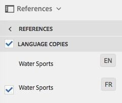

# Vertaalprojecten maken {#creating-translation-projects}

Als u een taalkopie wilt maken, activeert u een van de volgende workflows voor het kopiëren van talen die beschikbaar zijn onder de References-rail in de [!DNL Experience Manager] gebruikersinterface.

* **Maken en vertalen**: In deze workflow worden elementen die moeten worden vertaald, gekopieerd naar de hoofdtaal van de taal waarnaar u wilt vertalen. Bovendien wordt, afhankelijk van de opties u kiest, een vertaalproject gecreeerd voor de activa in de console van Projecten. Afhankelijk van de instellingen kan het vertaalproject handmatig worden gestart of automatisch worden uitgevoerd zodra het vertaalproject is gemaakt.

* **Taalkopieën** bijwerken: Voer deze workflow uit om een extra groep elementen te vertalen en deze op te nemen in een taalkopie voor een bepaalde landinstelling. In dit geval worden de vertaalde elementen toegevoegd aan de doelmap die al eerder vertaalde elementen bevat.

>[!NOTE]
>
>De binaire boeken van activa worden vertaald slechts als de vertaaldienstverlener de vertaling van binaire getallen steunt.

>[!NOTE]
>
>Als u een vertaalworkflow start voor complexe elementen, zoals PDF- en [!DNL Adobe InDesign] bestandsbestanden, worden de eventuele submiddelen of uitvoeringen ervan niet verzonden voor vertaling.

## Workflow maken en vertalen {#create-and-translate-workflow}

Met de workflow Maken en vertalen kunt u voor het eerst voor een bepaalde taal een kopie van de taal genereren. De workflow bevat de volgende opties:

* Alleen structuur maken.
* Maak een nieuw vertaalproject.
* Toevoegen aan bestaand vertaalproject.

### Alleen structuur maken {#create-structure-only}

Use the **[!UICONTROL Create structure only]** option to create a target folder hierarchy within the target language root to match the hierarchy of the source folder within the source language root. In dit geval worden bronassets naar de doelmap gekopieerd. Er wordt echter geen vertaalproject gegenereerd.

1. Selecteer in de [!DNL Assets] interface de bronmap waarvoor u een structuur wilt maken in de hoofdmap van de doeltaal.
1. Open the **[!UICONTROL References]** pane and click **[!UICONTROL Language Copies]** under **[!UICONTROL Copies]**.

   

1. Klik **[!UICONTROL Create & Translate]** onderaan.

1. From the **[!UICONTROL Target Languages]** list, select the language for which you want to create a folder structure.

   

1. Kies in de lijst **[!UICONTROL Project]** de optie **[!UICONTROL Create structure only]**.

   

1. Klik op **[!UICONTROL Create]**. De nieuwe structuur voor de doeltaal wordt vermeld onder **[!UICONTROL Language Copies]**.

   

1. Klik op de structuur in de lijst en klik vervolgens **[!UICONTROL Reveal in Assets]** om naar de mapstructuur in de doeltaal te navigeren.

   

### Een nieuw vertaalproject maken {#create-a-new-translation-project}

Als u deze optie gebruikt, worden de te vertalen middelen gekopieerd aan de taalwortel van de taal waaraan u wilt vertalen. Afhankelijk van de opties u kiest, wordt een vertaalproject gecreeerd voor de activa in de console van Projecten. Afhankelijk van de instellingen kan het vertaalproject handmatig worden gestart of automatisch worden uitgevoerd zodra het vertaalproject is gemaakt.

1. Selecteer in de interface Elementen de bronmap waarvoor u een taalkopie wilt maken.
1. Open the **[!UICONTROL References]** pane and click **[!UICONTROL Language Copies]** under **[!UICONTROL Copies]**.

   

1. Klik **[!UICONTROL Create & Translate]** onderaan.

1. Selecteer in de lijst **[!UICONTROL Target Languages]** de taal of talen waarvoor u een mappenstructuur wilt maken.

   

1. From the **[!UICONTROL Project]** list, select **[!UICONTROL Create a new translation project]**.

   

1. Voer in het veld **[!UICONTROL Project Title]** een titel in voor het project.

   

1. Klik op **[!UICONTROL Create]**. Middelen uit de bronmap worden gekopieerd naar de doelmappen voor de landinstellingen die u in stap 4 hebt geselecteerd.

   

1. Als u naar de map wilt navigeren, selecteert u de taalkopie en klikt u op **[!UICONTROL Reveal in Assets]**.

   

1. Navigeer aan de console van Projecten. De vertaalomslag wordt gekopieerd aan de console van Projecten.

   

1. Open de map om het vertaalproject weer te geven.

   

1. Klik op het project om de detailpagina te openen.

   

1. Als u de status van de vertaaltaak wilt weergeven, klikt u op de ellips onder aan de **[!UICONTROL Translation Job]** tegel.

   

   Zie [De status van een vertaaltaak](/help/sites-administering/tc-manage.md#monitoring-the-status-of-a-translation-job)controleren voor meer informatie over de taakstatus.

1. Navigeer naar de interface Middelen en open de pagina Eigenschappen voor elk van de vertaalde elementen om de vertaalde metagegevens weer te geven.

   

   *Afbeelding: Vertaalde metagegevens op de pagina met eigenschappen van elementen.*

   >[!NOTE]
   >
   >Deze functie is beschikbaar voor zowel elementen als mappen. Wanneer een middel in plaats van een omslag wordt geselecteerd, wordt de volledige hiërarchie van omslagen tot de taalwortel gekopieerd om een taalexemplaar voor de activa tot stand te brengen.

### Toevoegen aan bestaand vertaalproject {#add-to-existing-translation-project}

Als u deze optie gebruikt, wordt de vertaalworkflow uitgevoerd voor elementen die u na een vorige vertaalworkflow aan de bronmap toevoegt. Alleen de nieuw toegevoegde elementen worden gekopieerd naar de doelmap die eerder vertaalde elementen bevat. In dit geval wordt geen nieuw vertaalproject opgezet.

1. Navigeer in de interface Elementen naar de bronmap die niet-vertaalde elementen bevat.
1. Selecteer een asset die u wilt vertalen en open het **[!UICONTROL Reference pane]**. In de sectie **[!UICONTROL Language Copies]** wordt het aantal momenteel beschikbare vertaalkopieën weergegeven.
1. Klik **[!UICONTROL Language Copies]** onder **[!UICONTROL Copies]**. Er wordt een lijst met beschikbare vertaalkopieën weergegeven.
1. Klik **[!UICONTROL Create & Translate]** onderaan.

1. Selecteer in de lijst **[!UICONTROL Target Languages]** de taal of talen waarvoor u een mappenstructuur wilt maken.

   

1. Selecteer in de lijst **[!UICONTROL Project]** de optie **[!UICONTROL Add to existing translation project]** om de vertaalworkflow in de map uit te voeren.

   

   >[!NOTE]
   >
   >Als u de **[!UICONTROL Add to existing translation project]** optie kiest, wordt uw vertaalproject alleen aan een reeds bestaand project toegevoegd als uw projectinstellingen exact overeenkomen met de instellingen van het reeds bestaande project. Anders wordt een nieuw project gemaakt.

1. Selecteer in de **[!UICONTROL Existing translation project]** lijst een project waaraan u het element voor vertaling wilt toevoegen.

   

1. Klik op **[!UICONTROL Create]**. De te vertalen assets worden toegevoegd aan de doelmap. De bijgewerkte map wordt weergegeven onder de sectie **[!UICONTROL Language Copies]**.

   

1. Navigeer aan de console van Projecten, en open het bestaande vertaalproject u aan toevoegde.
1. Klik op de pagina met projectdetails voor het vertaalproject.

   

1. Klik op de ellips onder aan de tegel **Vertaaltaak** om de elementen in de vertaalworkflow weer te geven. In de lijst met vertaaltaken worden ook items voor metagegevens en tags van elementen weergegeven. Deze vermeldingen geven aan dat de metagegevens en tags voor de elementen ook worden vertaald.

   >[!NOTE]
   >
   >Als u het item voor tags of metagegevens verwijdert, worden er geen tags of metagegevens voor de elementen omgezet.

   >[!NOTE]
   >
   >Als u Machine Translation gebruikt, worden binaire bestanden met elementen niet vertaald.

   >[!NOTE]
   >
   >Als het element dat u toevoegt aan de vertaaltaak subelementen bevat, selecteert u de subelementen en verwijdert u deze zodat de vertaling zonder scheuren kan worden uitgevoerd.

1. Als u de vertaling voor de elementen wilt starten, klikt u op de pijl op de **[!UICONTROL Translation Job]** tegel en selecteert u een element in de **[!UICONTROL Start]** lijst.

   

   Een bericht brengt het begin van de vertaalbaan op de hoogte.

   

1. Als u de status van de vertaaltaak wilt weergeven, klikt u op de ellips onder aan de **[!UICONTROL Translation Job]** tegel.

   

   Zie [De status van een vertaaltaak](/help/sites-administering/tc-manage.md#monitoring-the-status-of-a-translation-job)controleren voor meer informatie.

1. Nadat de vertaling is voltooid, verandert de status in Ready to Review. Navigeer naar de interface Middelen en open de pagina Eigenschappen voor elk van de vertaalde elementen om de vertaalde metagegevens weer te geven.

## Taalkopieën bijwerken {#update-language-copies}

Voer deze workflow uit om extra elementen te vertalen en deze op te nemen in een taalkopie voor een bepaalde landinstelling. In dit geval worden de vertaalde elementen toegevoegd aan de doelmap die al eerder vertaalde elementen bevat. Afhankelijk van de keuze van opties wordt een vertaalproject gemaakt of wordt een bestaand vertaalproject bijgewerkt voor de nieuwe elementen. De workflow voor het kopiëren van de taal Bijwerken bevat de volgende opties:

* Een nieuw vertaalproject maken
* Toevoegen aan bestaand vertaalproject

### Een nieuw vertaalproject maken {#create-a-new-translation-project-1}

Als u deze optie gebruikt, wordt een vertaalproject gecreeerd voor de reeks activa waarvoor u een taalexemplaar wilt bijwerken.

1. Selecteer in de interface Middelen de bronmap waarin u een element hebt toegevoegd.
1. Open the **[!UICONTROL References]** pane, and click **[!UICONTROL Language Copies]** under **[!UICONTROL Copies]** to display the list of language copies.
1. Schakel het selectievakje voor **[!UICONTROL Language Copies]** in en selecteer vervolgens de doelmap die overeenkomt met de juiste landinstelling.

   

1. Klik **[!UICONTROL Update language copies]** onderaan.

1. Kies in de lijst **[!UICONTROL Project]** de optie **[!UICONTROL Create a new translation project]**.

   

1. Voer in het veld **[!UICONTROL Project Title]** een titel in voor het project.

   

1. Klik op **[!UICONTROL Start]**.
1. Navigeer aan de console van Projecten. De vertaalomslag wordt gekopieerd aan de console van Projecten.

   

1. Open de map om het vertaalproject weer te geven.

   

1. Klik op het project om de detailpagina te openen.

   

1. Als u de vertaling voor de elementen wilt starten, klikt u op de pijl op de **[!UICONTROL Translation Job]** tegel en selecteert u een element in de **[!UICONTROL Start]** lijst.

   

   Een bericht brengt het begin van de vertaalbaan op de hoogte.

   

1. Als u de status van de vertaaltaak wilt weergeven, klikt u op de ellips onder aan de **[!UICONTROL Translation Job]** tegel.

   

   Zie [De status van een vertaaltaak](../sites-administering/tc-manage.md#monitoring-the-status-of-a-translation-job)controleren voor meer informatie over de taakstatus.

1. Navigeer naar de interface Middelen en open de pagina Eigenschappen voor elk van de vertaalde elementen om de vertaalde metagegevens weer te geven.

### Toevoegen aan bestaand vertaalproject {#add-to-existing-translation-project-1}

Als u deze optie gebruikt, worden de elementen toegevoegd aan een bestaand vertaalproject en wordt de taalkopie bijgewerkt voor de landinstelling die u kiest.

1. Selecteer in de interface Middelen de bronmap waaraan u een elementmap hebt toegevoegd.
1. Open the **[!UICONTROL References pane]**, and click **[!UICONTROL Language Copies]** under **[!UICONTROL Copies]** to display the list of language copies.

   

1. Schakel het selectievakje voor **[!UICONTROL Language Copies]** in om alle taalkopieën te selecteren. Hef de selectie van andere kopieën op, met uitzondering van de taalkopieën die overeenkomen met de landinstellingen waarnaar u wilt vertalen.

   

1. Klik **[!UICONTROL Update language copies]** onderaan.

1. Kies in de lijst **[!UICONTROL Project]** de optie **[!UICONTROL Add to existing translation project]**.

   

1. Selecteer in de **[!UICONTROL Existing translation project]** lijst een project waaraan u het element voor vertaling wilt toevoegen.

   

1. Klik op **[!UICONTROL Start]**.
1. Zie de stappen 9-14 van [Toevoegen aan bestaand vertaalproject](translation-projects.md#add-to-existing-translation-project) om de rest van de procedure te voltooien.

## Tijdelijke taalkopieën maken {#creating-temporary-language-copies}

Wanneer u een vertaalworkflow uitvoert om een taalkopie bij te werken met bewerkte versies van de originele elementen, blijft de bestaande taalkopie behouden totdat u de vertaalde elementen goedkeurt. [!DNL Adobe Experience Manager Assets] Hiermee slaat u de nieuw vertaalde middelen op een tijdelijke locatie op en werkt u de bestaande taalkopie bij nadat u de middelen expliciet hebt goedgekeurd. Als u de middelen afwijst, blijft de taalkopie ongewijzigd.

1. Click the source root folder under **[!UICONTROL Language Copies]** for which you already created a language copy, and then click **[!UICONTROL Reveal in Assets]** to open the folder in [!DNL Experience Manager Assets].

   

1. Selecteer in de [!DNL Assets] interface een element dat u al hebt vertaald en klik op **[!UICONTROL Edit]** de werkbalk om het element in de bewerkingsmodus te openen.
1. Bewerk het element en sla de wijzigingen op.
1. Voer stap 2-14 van de procedure [Toevoegen aan bestaand vertaalproject](#add-to-existing-translation-project) uit om de taalkopie bij te werken.
1. Klik op de ellips onder aan de **[!UICONTROL Translation Job]** tegel. In de lijst met elementen op de **[!UICONTROL Translation Job]** pagina kunt u duidelijk de tijdelijke locatie weergeven waar de vertaalde versie van het element is opgeslagen.

   

1. Schakel het selectievakje naast **[!UICONTROL Title]**.
1. From the toolbar, click **[!UICONTROL Accept Translation]**  and then click **[!UICONTROL Accept]** in the dialog to overwrite the translated asset in the target folder with the translated version of the edited asset.

   >[!NOTE]
   >
   >Accepteer zowel het element als de metagegevens om de vertaalworkflow in staat te stellen het doelmiddel bij te werken.

   Klik op Vertaling **[!UICONTROL Reject Translation]** afwijzen  om de oorspronkelijk vertaalde versie van het element in de hoofdmap van de doellandinstelling te behouden en de bewerkte versie af te wijzen.

1. Als u de vertaalde metagegevens wilt weergeven, navigeert u naar de [!DNL Assets] console en opent u de [!UICONTROL Properties] pagina voor elk van de vertaalde elementen.

>[!MORELIKETHIS]
>
>* [Tips om metagegevens](https://blogs.adobe.com/experiencedelivers/experience-management/translate_aemassets_metadata/)efficiënt te vertalen.

