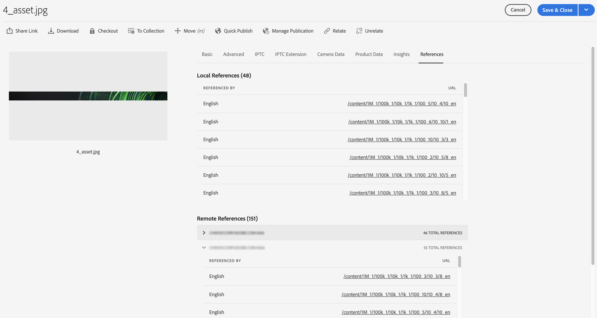

# Aangesloten middelen gebruiken om DAM-middelen te delen in [!DNL Experience Manager Sites] {#use-connected-assets-to-share-dam-assets-in-aem-sites}

| Versie | Artikelkoppeling |
| -------- | ---------------------------- |
| AEM as a Cloud Service | [Klik hier](https://experienceleague.adobe.com/docs/experience-manager-cloud-service/content/assets/admin/use-assets-across-connected-assets-instances.html?lang=en) |
| AEM 6,5 | Dit artikel |


In grote ondernemingen is de infrastructuur voor het maken van websites soms gedistribueerd. Soms zijn de functies en de digitale assets voor het maken van websites opgenomen in verschillende implementaties. Één reden kan geografisch gedistribueerde bestaande plaatsingen zijn die worden vereist om samen te werken. Een andere reden kunnen overnames zijn die leiden tot heterogene infrastructuren, waaronder verschillende [!DNL Experience Manager] versies, die het moederbedrijf samen wil gebruiken.

De functionaliteit Connected Assets ondersteunt de bovenstaande gebruiksscenario&#39;s door integratie van [!DNL Experience Manager Sites] en [!DNL Experience Manager Assets]. Gebruikers kunnen webpagina&#39;s maken in [!DNL Sites] die de digitale elementen gebruiken vanuit een aparte [!DNL Assets] implementaties.

>[!NOTE]
>
>Configureer Connected Assets alleen wanneer u de middelen moet gebruiken die beschikbaar zijn op een externe DAM-implementatie op een aparte Sites-implementatie voor het ontwerpen van webpagina&#39;s.

## Overzicht van Verbonden elementen {#overview-of-connected-assets}

Wanneer u pagina&#39;s bewerkt in [!UICONTROL Page Editor] als doeldoel kunnen de auteurs naadloos zoeken naar elementen van een andere map en deze insluiten [!DNL Assets] plaatsing die als bron van activa dienst doet. De beheerders creëren eenmalig integratie van een plaatsing van [!DNL Experience Manager] with [!DNL Sites] capaciteit met een andere plaatsing van [!DNL Experience Manager] with [!DNL Assets] capaciteit. Siteauteurs kunnen ook Dynamic Media-afbeeldingen op de webpagina&#39;s van hun site gebruiken via Connected Assets en de Dynamic Media-functies gebruiken, zoals slimme voorinstellingen voor uitsnijden en afbeeldingen.

Voor de [!DNL Sites] auteurs, zijn de verre activa beschikbaar als read-only lokale activa. De functionaliteit ondersteunt naadloze zoekopdrachten en toegang tot externe middelen in de Site-editor. Voor andere gebruiksgevallen waarbij het volledige assetcorpus op Sites beschikbaar moet zijn, kunt u overwegen de middelen in bulk te migreren in plaats van Connected Assets te gebruiken. Zie [Experience Manager Assets-migratiegids](/help/assets/assets-migration-guide.md).

### Vereisten en ondersteunde implementaties {#prerequisites}

Controleer de volgende punten voordat u deze functie gebruikt of configureert:

* De gebruikers maken deel uit van de aangewezen gebruikersgroepen op elke plaatsing.
* Voor [!DNL Adobe Experience Manager] de plaatsingstypes, één van de gesteunde criteria wordt voldaan. [!DNL Experience Manager] 6,5 [!DNL Assets] werkt met [!DNL Experience Manager] as a Cloud Service. Voor meer informatie over hoe deze functionaliteit werkt in [!DNL Experience Manager] als [!DNL Cloud Service], zie [Verbonden elementen in as a Cloud Service Experience Manager](https://experienceleague.adobe.com/docs/experience-manager-cloud-service/content/assets/admin/use-assets-across-connected-assets-instances.html).

  | | [!DNL Sites] als [!DNL Cloud Service] | [!DNL Experience Manager] 6,5 [!DNL Sites] over AMS | [!DNL Experience Manager] 6,5 [!DNL Sites] op locatie |
  |---|---|---|---|
  | **[!DNL Experience Manager Assets]als[!DNL Cloud Service]** | Ondersteund | Ondersteund | Ondersteund |
  | **[!DNL Experience Manager]6,5 [!DNL Assets] over AMS** | Ondersteund | Ondersteund | Ondersteund |
  | **[!DNL Experience Manager]6,5 [!DNL Assets] op locatie** | Niet ondersteund | Niet ondersteund | Niet ondersteund |

### Ondersteunde bestandsindelingen {#mimetypes}

Auteurs zoeken naar afbeeldingen en de volgende typen documenten in de Inhoudszoeker en slepen de gezochte elementen in de Pagina-editor. Documenten worden toegevoegd aan de `Download` en afbeeldingen naar de `Image` component. Auteurs kunnen de externe elementen ook toevoegen in aangepaste [!DNL Experience Manager] component die de standaardwaarde uitbreidt `Download` of `Image` componenten. De ondersteunde indelingen zijn:

* **Afbeeldingsindelingen**: De indelingen die de [Afbeeldingscomponent](assets-formats.md#supported-raster-image-formats) ondersteunt.
* **Documentindelingen**: Zie de [ondersteunde documentindelingen](assets-formats.md#supported-document-formats).

### Betrokken gebruikers en groepen {#users-and-groups-involved}

Hieronder worden de diverse rollen beschreven voor de configuratie en toepassing van een kenmerk en de overeenkomstige gebruikersgroepen. Het lokale bereik wordt gebruikt voor het geval waarin een auteur een webpagina maakt. De externe scope wordt gebruikt voor de DAM-implementatie die als host fungeert voor de vereiste assets. De [!DNL Sites] auteur haalt deze externe elementen op.

| Rol | Scope | Gebruikersgroep | Gebruikersnaam in voorbeeldprocedure | Beschrijvingen |
|---|---|---|---|---|
| [!DNL Sites] beheerder | Lokaal | [!DNL Experience Manager] `administrators` | `admin` | Instellen [!DNL Experience Manager] en vormt integratie met de verre [!DNL Assets] implementatie. |
| DAM-gebruiker | Lokaal | `Authors` | `ksaner` | Wordt gebruikt om de assets die bij `/content/DAM/connectedassets/` zijn opgehaald, weer te geven en te dupliceren. |
| [!DNL Sites] auteur | Lokaal | <ul><li>`Authors` (met leestoegang op de externe DAM en auteurstoegang op de lokale [!DNL Sites]) </li> <li>`dam-users` op lokaal niveau [!DNL Sites]</li></ul> | `ksaner` | Eindgebruikers zijn [!DNL Sites] auteurs die deze integratie gebruiken om de snelheid van hun inhoud te verbeteren. De auteurs zoeken naar middelen in externe DAM en bladeren deze met [!UICONTROL Content Finder] en het gebruik van de vereiste afbeeldingen op lokale webpagina&#39;s. De referenties van de `ksaner` DAM-gebruiker worden gebruikt. |
| [!DNL Assets] beheerder | Extern | [!DNL Experience Manager] `administrators` | `admin` op afstand [!DNL Experience Manager] | Configureer CORS (Cross-Origin Resource Sharing). |
| DAM-gebruiker | Extern | `Authors` | `ksaner` op afstand [!DNL Experience Manager] | Auteur-rol op de externe server [!DNL Experience Manager] implementatie. Elementen zoeken en doorbladeren in Connected Assets met de opdracht [!UICONTROL Content Finder]. |
| DAM-distributeur (technische gebruiker) | Extern | [!DNL Sites] `Authors` | `ksaner` op afstand [!DNL Experience Manager] | Deze gebruiker die aanwezig is op de externe implementatie wordt gebruikt door [!DNL Experience Manager] lokale server (niet de [!DNL Sites] auteurrol) om de verre activa, namens te halen [!DNL Sites] auteur. Deze rol is anders dan de twee bovenstaande `ksaner`-rollen en hoort bij een andere gebruikersgroep. |

### Connected Assets-architectuur {#connected-assets-architecture}

Met Experience Manager kunt u een externe DAM-implementatie als bron verbinden met meerdere Experience Managers [!DNL Sites] implementaties. U kunt echter wel verbinding maken met een [!DNL Sites] implementatie met slechts één externe DAM-implementatie.

Evalueer het optimale aantal instanties van Plaatsen om met een verre plaatsing te verbinden DAM. De Adobe adviseert om instanties van Plaatsen aan de plaatsing en test incrementeel aan te sluiten dat er geen prestatieseffect bij verre DAM is, aangezien elke verbonden instantie van Plaatsen aan het gegevensverkeer op verre DAM bijdraagt.

De volgende diagrammen illustreren de gesteunde scenario&#39;s:


Het volgende diagram illustreert een niet-ondersteund scenario:


## Een verbinding configureren tussen [!DNL Sites] en [!DNL Assets] implementaties {#configure-a-connection-between-sites-and-assets-deployments}

An [!DNL Experience Manager] de beheerder kan deze integratie tot stand brengen. Zodra gecreeerd, worden de toestemmingen die worden vereist om het te gebruiken gevestigd via gebruikersgroepen. De gebruikersgroepen worden gedefinieerd op het tabblad [!DNL Sites] de implementatie en de implementatie van DAM.

Aangesloten elementen en lokale elementen configureren [!DNL Sites] connectiviteit, volg deze stappen:

1. Toegang tot bestaande [!DNL Sites] plaatsing of creeer een plaatsing gebruikend het volgende bevel:

   1. Voer in de map van het JAR-bestand de volgende opdracht uit op een terminal om elk bestand te maken [!DNL Experience Manager] server.
      `java -Xmx4096m -jar <quickstart jar filepath> -r samplecontent -p 4502 -nofork -gui -nointeractive &`

   1. Na een paar minuten [!DNL Experience Manager] server wordt gestart. Overweeg dit [!DNL Sites] implementatie als de lokale computer voor het ontwerpen van webpagina&#39;s, bijvoorbeeld op `https://[local_sites]:4502`.

1. Ervoor zorgen dat de gebruikers en rollen met het juiste bereik aanwezig zijn op de [!DNL Sites] de implementatie en de [!DNL Assets] implementatie op AMS. Een technische gebruiker maken op [!DNL Assets] implementatie en toevoegen aan de gebruikersgroep vermeld in [betrokken gebruikers en groepen](/help/assets/use-assets-across-connected-assets-instances.md#users-and-groups-involved).

1. De lokale [!DNL Sites] implementatie bij `https://[local_sites]:4502`. Klik op **[!UICONTROL Tools]** > **[!UICONTROL Assets]** > **[!UICONTROL Connected Assets Configuration]** en geef de volgende waarden op:

   1. A **[!UICONTROL Title]** van de configuratie.
   1. **[!UICONTROL Remote DAM URL]** is de URL van het [!DNL Assets] locatie in de notatie `https://[assets_servername]:[port]`.
   1. Referenties van een DAM-distributeur (technische gebruiker).
   1. In de **[!UICONTROL Mount Point]** veld, voer de lokale [!DNL Experience Manager] pad waar [!DNL Experience Manager] haalt de elementen op. Bijvoorbeeld: `remoteassets` map. De middelen die van DAM worden opgehaald worden opgeslagen in deze omslag op [!DNL Sites] implementatie.
   1. **[!UICONTROL Local Sites URL]** is de locatie van de [!DNL Sites] implementatie. [!DNL Assets] de plaatsing gebruikt deze waarde om verwijzingen naar de digitale activa te handhaven die door dit worden gehaald [!DNL Sites] implementatie.
   1. Referenties van [!DNL Sites] technische gebruiker.
   1. De waarde van **[!UICONTROL Original Binary transfer optimization Threshold]** in het veld wordt opgegeven of de oorspronkelijke elementen (inclusief de uitvoeringen) al dan niet synchroon worden overgedragen. Elementen met een kleinere bestandsgrootte kunnen gemakkelijk worden opgehaald terwijl elementen met een relatief grotere bestandsgrootte het best asynchroon kunnen worden gesynchroniseerd. De waarde hangt van uw netwerkmogelijkheden af.
   1. Selecteren **[!UICONTROL Datastore Shared with Connected Assets]**, als u een datastore gebruikt om uw activa op te slaan en de Datastore wordt gedeeld tussen beide plaatsingen. In dit geval is de drempellimiet niet van belang omdat de werkelijke binaire activa op de datastore beschikbaar zijn en niet worden overgedragen.

   

   *Afbeelding: een typische configuratie voor de functionaliteit Verbonden elementen.*

1. De bestaande digitale middelen op [!DNL Assets] de implementatie wordt al verwerkt en de uitvoeringen worden gegenereerd. Deze vertoningen worden opgehaald gebruikend deze functionaliteit zodat is er geen behoefte om de vertoningen opnieuw te produceren. Schakel de workflowdraagprogramma&#39;s uit om te voorkomen dat uitvoeringen opnieuw worden gegenereerd. Pas de startconfiguraties aan in het dialoogvenster ([!DNL Sites]) worden geïmplementeerd om de `connectedassets` (de elementen worden in deze map opgehaald).

   1. Aan [!DNL Sites] implementatie, klik op **[!UICONTROL Tools]** > **[!UICONTROL Workflow]** > **[!UICONTROL Launchers]**.

   1. Zoek naar startprogramma&#39;s met workflows als **[!UICONTROL DAM Update Asset]** en **[!UICONTROL DAM Metadata Writeback]**.

   1. Selecteer het workflowstartprogramma en klik op **[!UICONTROL Properties]** op de actiebalk.

   1. In de [!UICONTROL Properties] de wizard **[!UICONTROL Path]** velden als de volgende toewijzingen om hun reguliere expressies bij te werken om het koppelingspunt uit te sluiten **[!UICONTROL connectedassets]**.

   | Voor | Na |
   |---|---|
   | `/content/dam(/((?!/subassets).)*/)renditions/original` | `/content/dam(/((?!/subassets)(?!connectedassets).)*/)renditions/original` |
   | `/content/dam(/.*/)renditions/original` | `/content/dam(/((?!connectedassets).)*/)renditions/original` |
   | `/content/dam(/.*)/jcr:content/metadata` | `/content/dam(/((?!connectedassets).)*/)jcr:content/metadata` |

   >[!NOTE]
   >
   >Alle uitvoeringen die beschikbaar zijn op de externe implementatie worden opgehaald, wanneer auteurs middelen ophalen. Als u meer weergaven van een opgehaalde asset tot stand wilt brengen, moet u deze configuratiestap overslaan. De [!UICONTROL DAM Update Asset] de workflow wordt geactiveerd en er worden meer uitvoeringen gemaakt. Deze uitvoeringen zijn alleen beschikbaar op de lokale [!DNL Sites] implementatie en niet op de externe DAM-implementatie.

1. Voeg de [!DNL Sites] implementatie als een toegestane oorsprong in de CORS-configuratie op de [!DNL Assets] implementatie. Zie voor meer informatie [CORS begrijpen](https://experienceleague.adobe.com/docs/experience-manager-learn/foundation/security/understand-cross-origin-resource-sharing.html).

1. Configureren [zelfde ondersteuning voor sitecookies](/help/sites-administering/same-site-cookie-support.md).

U kunt de connectiviteit tussen gevormd controleren [!DNL Sites] implementaties en [!DNL Assets] implementatie.

![Verbindingstest van geconfigureerde Connected Assets [!DNL Sites]](assets/connected-assets-multiple-config.png)
*Afbeelding: Verbindingstest van geconfigureerde Connected Assets [!DNL Sites].*

## Dynamic Media-middelen gebruiken {#dynamic-media-assets}


Met Connected Assets kunt u afbeeldingselementen gebruiken die zijn verwerkt door [!DNL Dynamic Media] vanaf de externe DAM-implementatie op sitepagina&#39;s en gebruik Dynamic Media-functies, zoals voorinstellingen voor slimme uitsnijdingen en afbeeldingen.

Te gebruiken [!DNL Dynamic Media] met verbonden elementen:

1. Configureren [!DNL Dynamic Media] op externe DAM-implementatie met ingeschakelde synchronisatiemodus.
1. Configureren [Verbonden elementen](#configure-a-connection-between-sites-and-assets-deployments).
1. Configureren [!DNL Dynamic Media] op de instantie van Plaatsen met de zelfde bedrijfsnaam zoals gevormd op verre DAM. De plaatsing van Plaatsen moet read-only toegang tot de rekening van Dynamic Media hebben om met verbonden activa te werken. Zorg er daarom voor dat u de synchronisatiemodus in Dynamic Media-configuratie op de Sites-instantie uitschakelt.

>[!CAUTION]
>
>Met verbonden middelen en [!DNL Dynamic Media] configuratie, kunt u niet gebruiken [!DNL Dynamic Media] om lokale middelen te verwerken beschikbaar op [!DNL Sites] implementatie.

## Configureren [!DNL Dynamic Media] {#configure-dynamic-media}

Om te vormen [!DNL Dynamic Media] op [!DNL Assets] en [!DNL Sites] implementaties:

1. Inschakelen en configureren [!DNL Dynamic Media] als globale configuratie op afstand [!DNL Assets] implementatie van auteurs. Voor het configureren van Dynamic Media raadpleegt u [Dynamic Media configureren](/help/assets/config-dynamic.md#configuring-dynamic-media-cloud-services).
Op afstand [!DNL Assets] implementatie, in [!UICONTROL Dynamic Media sync mode], selecteert u **[!UICONTROL Enabled by default]**.

1. Configuratie van verbonden elementen maken zoals beschreven in [Verbinding tussen plaatsen en activa plaatsingen vormen](#configure-a-connection-between-sites-and-assets-deployments). Selecteer ook **[!UICONTROL Fetch Original Rendition for Dynamic Media Connected Assets]** -optie.

1. Configureren [!DNL Dynamic Media] op lokaal niveau [!DNL Sites] en extern [!DNL Assets] implementaties. Volg de instructies op [vormen [!DNL Dynamic Media]](/help/assets/config-dynamic.md#configuring-dynamic-media-cloud-services).

   * Gebruik dezelfde bedrijfsnaam in alle configuraties.
   * Op lokaal niveau [!DNL Sites], in [!UICONTROL Dynamic Media sync mode], selecteert u **[!UICONTROL Disabled by default]**. De [!DNL Sites] de plaatsing moet read-only toegang tot hebben [!DNL Dynamic Media] account.
   * Op lokaal niveau [!DNL Sites]in de **[!UICONTROL Publish Assets]** selecteert u **[!UICONTROL Selective Publish]**. Niet selecteren **[!UICONTROL Sync All Content]**.

1. Inschakelen [[!DNL Dynamic Media] ondersteuning in Image Core-component](https://experienceleague.adobe.com/docs/experience-manager-core-components/using/components/image.html#dynamic-media). Met deze functie wordt de standaardinstelling ingeschakeld [Afbeeldingscomponent](https://www.aemcomponents.dev/content/core-components-examples/library/core-content/image.html) op weergave [!DNL Dynamic Media] afbeeldingen wanneer [!DNL Dynamic Media] afbeeldingen worden door auteurs gebruikt in webpagina&#39;s op lokale [!DNL Sites] implementatie.

## Externe elementen gebruiken {#use-remote-assets}

De auteurs van de website maken gebruik van Content Finder om verbinding te maken met de DAM-implementatie. Auteurs kunnen externe assets zoeken, doorbladeren en naar een component slepen. Om aan verre DAM voor authentiek te verklaren, houd de geloofsbrieven die door uw beheerder (als om het even welk) worden verstrekt handig.

Auteurs kunnen de middelen die beschikbaar zijn op de lokale DAM en de externe DAM-implementatie, in één webpagina gebruiken. Gebruik de Content Finder om te schakelen tussen het doorzoeken van de lokale of de externe DAM.

Alleen die tags met externe elementen worden opgehaald die een exact overeenkomende tag hebben samen met dezelfde taxonomihiërarchie, beschikbaar op de lokale [!DNL Sites] implementatie. Alle andere tags worden verwijderd. Auteurs kunnen naar externe elementen zoeken met alle tags op de externe server [!DNL Experience Manager] implementatie, aangezien het een full-text onderzoek aanbiedt.

### Doorloop van het gebruik {#walk-through-of-usage}

Gebruik bovenstaande instellingen om de functionaliteit van een authoring-ervaring beter te begrijpen. Gebruik documenten of afbeeldingen van uw keuze op de externe DAM-implementatie.

1. Ga naar de [!DNL Assets] interface op de verre plaatsing door tot **[!UICONTROL Assets]** > **[!UICONTROL Files]** van [!DNL Experience Manager] werkruimte. U kunt `https://[assets_servername_ams]:[port]/assets.html/content/dam` ook in een browser openen. Upload de assets van uw keuze.
1. Op de [!DNL Sites] implementatie, klikt u in de profielactivator in de rechterbovenhoek op **[!UICONTROL Impersonate as]**. Geef `ksaner` op als gebruikersnaam, selecteer de opgegeven optie en klik op **[!UICONTROL OK]**.
1. Open een websitepagina van het type Web.Retail op **[!UICONTROL Sites]** > **[!UICONTROL We.Retail]** > **[!UICONTROL us]** > **[!UICONTROL en]**. Bewerk de pagina. U kunt `https://[aem_server]:[port]/editor.html/content/we-retail/us/en/men.html` ook in een browser openen om een pagina te bewerken.

   Klik op **[!UICONTROL Toggle Side Panel]** in de linkerbovenhoek van de pagina.

1. Open de [!UICONTROL Assets] tab (Remote Content Finder) en klik op **[!UICONTROL Log in to Connected Assets]**.
1. Geef de referenties op: `ksaner` als gebruikersnaam en `password` als wachtwoord. Deze gebruiker heeft auteursrechten op beide [!DNL Experience Manager] implementaties.
1. Zoek naar de asset die u aan DAM hebt toegevoegd. De externe assets worden weergegeven in het linkerdeelvenster. Filter op afbeeldingen of documenten en filter verder op de typen ondersteunde documenten. Sleep de afbeeldingen naar een `Image`-component en sleep documenten naar een `Download`-component.

   De opgehaalde elementen zijn alleen-lezen op de lokale computer [!DNL Sites] implementatie. U kunt nog steeds gebruikmaken van de opties van uw [!DNL Sites] componenten om het opgehaalde element te bewerken. Het bewerken op basis van componenten is niet-destructief.

   

   *Afbeelding: Opties voor het filteren van documenttypen en afbeeldingen bij het zoeken naar elementen op externe DAM.*

1. De auteur van een site krijgt een melding als het origineel van een element asynchroon wordt opgehaald en als een haaltaak mislukt. Tijdens het ontwerpen of zelfs na het ontwerpen kunnen de auteurs gedetailleerde informatie over taken en fouten in het dialoogvenster [asynchrone taken](/help/sites-administering/asynchronous-jobs.md) gebruikersinterface.

   

   *Afbeelding: Melding van het asynchroon op de achtergrond ophalen van assets.*

1. Bij het publiceren van een pagina [!DNL Experience Manager] Hiermee geeft u een volledige lijst met elementen weer die op de pagina worden gebruikt. Zorg ervoor dat de externe assets op het moment van publicatie worden opgehaald. Als u de status van elk opgehaald element wilt controleren, raadpleegt u [asynchrone taken](/help/sites-administering/asynchronous-jobs.md) gebruikersinterface.

   >[!NOTE]
   >
   >Zelfs als een of meer externe middelen niet volledig zijn opgehaald, wordt de pagina gepubliceerd. De [!DNL Experience Manager] Het berichtgebied toont een bericht voor fouten die in asynchrone baanpagina tonen.

>[!CAUTION]
>
>Nadat de opgehaalde externe elementen in een webpagina zijn gebruikt, kunnen ze worden doorzocht en kunnen ze worden gebruikt door iedereen die toegangsrechten heeft tot de lokale map. De opgehaalde elementen worden opgeslagen in de lokale map (`connectedassets` in de bovenstaande doorloop). De assets zijn ook doorzoekbaar en zichtbaar in de lokale opslagplaats, en wel via [!UICONTROL Content Finder].

De opgehaalde assets kunnen net als elke andere lokale asset worden gebruikt, alleen kunnen de bijbehorende metadata niet worden bewerkt.

### Gebruik van een element op verschillende webpagina&#39;s controleren {#asset-usage-references}

[!DNL Experience Manager] Hiermee kunnen DAM-gebruikers alle verwijzingen naar een element controleren. Het helpt het gebruik van een middel in ver begrijpen en beheren [!DNL Sites] en in samengestelde activa. Veel auteurs van webpagina&#39;s op [!DNL Experience Manager Sites] implementatie kan een middel op een externe [!DNL Assets] in verschillende webpagina&#39;s. Om het beheer van bedrijfsmiddelen te vereenvoudigen en niet tot verbroken verwijzingen te leiden, is het belangrijk dat de DAM-gebruikers het gebruik van middelen op lokale en externe webpagina&#39;s controleren. De [!UICONTROL References] in een element [!UICONTROL Properties] op de pagina worden de lokale en externe referenties van het element weergegeven.

Referenties weergeven en beheren op het tabblad [!DNL Assets] implementatie, voert u de volgende stappen uit:

1. Middelen selecteren in [!DNL Assets] Console en klik op **[!UICONTROL Properties]** op de werkbalk.
1. Klik op het tabblad **[!UICONTROL References]**. Zie **[!UICONTROL Local References]** voor gebruik van het actief op het [!DNL Assets] implementatie. Zie **[!UICONTROL Remote References] voor gebruik van het actief op [!DNL Sites] implementatie waarbij het element is opgehaald met de functionaliteit Verbonden elementen.

   

1. De verwijzingen naar [!DNL Sites] pagina&#39;s geven het totale aantal verwijzingen voor elke lokale pagina weer [!DNL Sites]. Het kan enige tijd duren om alle verwijzingen te vinden en het totale aantal verwijzingen te tonen.
1. De lijst met verwijzingen is interactief en DAM-gebruikers kunnen op een verwijzing klikken om de pagina waarnaar wordt verwezen, te openen. Als de verre verwijzingen niet om één of andere reden kunnen worden gehaald, wordt een bericht getoond op de hoogte brengend van de mislukking.
1. Gebruikers kunnen het element verplaatsen of verwijderen. Wanneer u een element verplaatst of verwijdert, wordt het totale aantal referenties van alle geselecteerde elementen/mappen weergegeven in een waarschuwingsvenster. Wanneer u een element verwijdert waarvoor de referenties nog niet zijn opgehaald, wordt een waarschuwingsvenster weergegeven.

   

### Updates van middelen beheren in externe DAM {#manage-updates-in-remote-dam}

Na [configureren, verbinding](#configure-a-connection-between-sites-and-assets-deployments) tussen externe DAM en [!DNL Sites] implementaties, de middelen op externe DAM worden beschikbaar gesteld op de [!DNL Sites] implementatie. Vervolgens kunt u de bewerkingen bijwerken, verwijderen, hernoemen en verplaatsen op de externe DAM-middelen of -mappen. De updates zijn met enige vertraging automatisch beschikbaar op de [!DNL Sites] implementatie. Daarnaast als een element op een externe DAM wordt gebruikt op een lokale [!DNL Experience Manager Sites] pagina, worden de updates van het middel op verre DAM getoond op [!DNL Sites] pagina.

Zorg er tijdens het verplaatsen van een element van de ene naar de andere locatie voor dat u [verwijzingen aanpassen](/help/assets/manage-assets.md) zodat het element op het [!DNL Sites] pagina. Als u een element verplaatst naar een locatie die niet toegankelijk is vanuit de lokale [!DNL Sites] implementatie, kan het middel niet worden weergegeven op de implementatie van Sites.

U kunt ook de metagegevenseigenschappen van een element op de externe DAM bijwerken en de wijzigingen zijn beschikbaar op de lokale [!DNL Sites] implementatie.

[!DNL Sites] auteurs kunnen de beschikbare updates voorvertonen op de [!DNL Sites] de implementatie en publiceer de wijzigingen opnieuw om deze beschikbaar te maken op de [!DNL Experience Manager] -instantie publiceren.

[!DNL Experience Manager] geeft een verlopen visuele statusindicator weer voor elementen in `Remote Assets Content Finder` om te voorkomen dat siteauteurs het element op een [!DNL Sites] pagina. Als u een element met een verlopen status gebruikt op een [!DNL Sites] pagina, wordt het element niet weergegeven op de [!DNL Experience Manager] -instantie publiceren.

## Veelgestelde vragen {#frequently-asked-questions}

+++**Moet u Connected Assets configureren als u de middelen die beschikbaar zijn op uw [!DNL Sites] implementatie?**

In dat geval is het niet nodig om Connected Assets te configureren. U kunt de middelen gebruiken die op [!DNL Sites] implementatie.

+++

+++**Wanneer moet u de Connected Assets-functie configureren?**

Configureer de functie Connected Assets alleen wanneer u de middelen die beschikbaar zijn op een externe DAM-implementatie moet gebruiken op een [!DNL Sites] implementatie.

+++

+++**U kunt meerdere verbindingen maken [!DNL Sites] implementaties naar een externe DAM-implementatie na het configureren van Connected Assets?**

Ja, u kunt meerdere [!DNL Sites] implementaties naar een externe DAM-implementatie na het configureren van Connected Assets. Zie voor meer informatie [Connected Assets-architectuur](#connected-assets-architecture).

+++

+++**Hoeveel verre plaatsingen DAM u met een [!DNL Sites] implementatie na het configureren van Connected Assets?**

U kunt één externe DAM-implementatie verbinden met een [!DNL Sites] implementatie na het configureren van Connected Assets. Zie voor meer informatie [Connected Assets-architectuur](#connected-assets-architecture).

+++

+++**Kunt u Dynamic Media-elementen van uw [!DNL Sites] implementatie na het configureren van Connected Assets?**

Na het configureren van Connected Assets, [!DNL Dynamic Media] elementen zijn beschikbaar op [!DNL Sites] implementatie in de modus Alleen-lezen. U kunt daarom niet [!DNL Dynamic Media] om elementen op de [!DNL Sites] implementatie. Zie voor meer informatie [Een verbinding tussen Sites en Dynamic Media-implementaties configureren](#dynamic-media-assets).

+++

+++**Kunt u elementen van de indeling Afbeelding en Document gebruiken, van de externe DAM-implementatie op de [!DNL Sites] implementatie na het configureren van Connected Assets?**

Ja, u kunt middelen van beeld en formaat van het Document types van de verre plaatsing van DAM op [!DNL Sites] implementatie na het configureren van Connected Assets.

+++

+++**Kan u inhoudsfragmenten en video-elementen van de externe DAM-implementatie gebruiken op de [!DNL Sites] implementatie na het configureren van Connected Assets?**

Nee, u kunt inhoudsfragmenten en video-elementen van de externe DAM-implementatie niet gebruiken op de [!DNL Sites] implementatie na het configureren van Connected Assets.

+++

+++**Kunt u Dynamic Media-middelen van de externe DAM-implementatie gebruiken op de [!DNL Sites] implementatie na het configureren van Connected Assets?**

Ja, u kunt Dynamic Media image assets configureren en gebruiken vanaf de externe DAM-implementatie op de [!DNL Sites] implementatie na het configureren van Connected Assets. Zie voor meer informatie [Een verbinding tussen Sites en Dynamic Media-implementaties configureren](#dynamic-media-assets).

+++

+++**Nadat u Connected Assets hebt geconfigureerd, kunt u de bewerkingen voor bijwerken, verwijderen, hernoemen en verplaatsen op de externe DAM-middelen of -mappen?**

Ja, nadat u Connected Assets hebt geconfigureerd, kunt u de update uitvoeren, verwijderen, hernoemen en bewerkingen verplaatsen op de externe DAM-middelen of -mappen. De updates zijn, met wat vertraging, automatisch beschikbaar op de plaatsing van Plaatsen. Zie voor meer informatie [Updates van middelen beheren in externe DAM](#handling-updates-to-remote-assets).

+++

+++**Nadat u Connected Assets hebt geconfigureerd, kunt u elementen aan uw [!DNL Sites] implementatie en beschikbaar stellen voor externe DAM-implementatie?**

U kunt elementen toevoegen aan de [!DNL Sites] implementatie, maar deze middelen kunnen niet beschikbaar worden gemaakt voor de externe DAM-implementatie.

+++

## Beperkingen en aanbevolen procedures {#tip-and-limitations}

* Om inzichten over activagebruik te krijgen, vorm [Middelen Insight](/help/assets/asset-insights.md) op de [!DNL Sites] -instantie.

* U kunt het externe element niet naar de [Dialoogvenster Componentconfiguratie van afbeelding](https://experienceleague.adobe.com/docs/experience-manager-core-components/using/wcm-components/image.html?lang=en#configure-dialog). U kunt het externe element echter rechtstreeks naar de afbeeldingscomponent op de pagina Sites slepen zonder op **[!UICONTROL Configure]**.

### Machtigingen en vermogensbeheer {#permissions-and-managing-assets}

* Lokale assets zijn alleen-lezen kopieën. [!DNL Experience Manager] componenten bewerken niet-destructieve elementen in elementen. Andere soorten bewerkingen zijn niet toegestaan.
* Lokaal opgehaalde assets zijn alleen beschikbaar voor authoring. Workflows voor het bijwerken van assets kunnen niet worden toegepast en metadata kunnen niet worden bewerkt.
* Alleen afbeeldingen en de vermelde documentindelingen worden ondersteund. [!DNL Content Fragments] en [!DNL Experience Fragments] worden niet ondersteund.
* [!DNL Experience Manager] haalt niet de meta-gegevensschema&#39;s. Dit betekent dat mogelijk niet alle opgehaalde metagegevens worden weergegeven. Als het schema afzonderlijk wordt bijgewerkt op het tabblad [!DNL Sites] worden alle eigenschappen van de metagegevens weergegeven.
* Alles [!DNL Sites] auteurs hebben leesmachtigingen voor de opgehaalde kopieën, zelfs als auteurs geen toegang hebben tot de externe DAM-implementatie.
* Geen API-ondersteuning om de integratie aan te passen.
* De functionaliteit ondersteunt naadloos zoeken en gebruiken van externe assets. Als u veel externe assets in één keer beschikbaar wilt maken voor lokale implementatie, kunt u overwegen om de assets te migreren. Zie de [Assets-migratiegids](assets-migration-guide.md).
* Het is niet mogelijk om een extern middel als paginaminiatuur te gebruiken op [!UICONTROL Page Properties] gebruikersinterface. U kunt in [!UICONTROL Page Properties] gebruikersinterface van [!UICONTROL Thumbnail] door te klikken [!UICONTROL Select Image].

### Instellen en licenties verlenen {#setup-licensing}

* [!DNL Assets] implementatie op [!DNL Adobe Managed Services] wordt ondersteund.
* [!DNL Sites] kan verbinding maken met [!DNL Assets] implementatie tegelijk.
* Een vergunning van [!DNL Assets] werken als externe opslagplaats is vereist.
* Een of meer licenties van [!DNL Sites] het werken als lokale auteursplaatsing wordt vereist.

### Gebruik {#usage}

* Gebruikers kunnen tijdens het ontwerpen zoeken naar externe elementen en deze naar de lokale pagina slepen. Er wordt geen andere functionaliteit ondersteund.
* Voor ophaalbewerkingen geldt een time-out na 5 seconden. Auteurs kunnen problemen ervaren bij het ophalen van assets, bijvoorbeeld als er netwerkproblemen optreden. Auteurs kunnen proberen door het externe element te slepen van [!UICONTROL Content Finder] tot [!UICONTROL Page Editor].
* Eenvoudige bewerkingen die niet-destructief zijn en de bewerking worden ondersteund via het dialoogvenster `Image` kan worden uitgevoerd op opgehaalde elementen. Assets zijn alleen-lezen.
* De enige methode om het element opnieuw op te halen is het op een pagina te slepen. Er is geen API-ondersteuning of andere methoden om middelen opnieuw op te halen om deze bij te werken.
* Indien activa uit de DAM worden ontmanteld, blijven deze in gebruik [!DNL Sites] pagina&#39;s.
* De externe referentie-items van een element worden asynchroon opgehaald. De verwijzingen en het totale aantal zijn niet echt - tijd en er kan één of ander verschil zijn als een auteur van Plaatsen het middel gebruikt terwijl een DAM gebruiker de verwijzing bekijkt. DAM-gebruikers kunnen de pagina vernieuwen en het totaalaantal over een paar minuten opnieuw proberen.

## Problemen oplossen {#troubleshoot}

Ga als volgt te werk om algemene fouten op te lossen:

* Als u niet kunt zoeken naar externe middelen van de [!UICONTROL Content Finder]en zorgt u ervoor dat de vereiste rollen en machtigingen zijn ingesteld.

* Een middel dat van verre DAM wordt gehaald kan niet op een Web-pagina om één of meerdere redenen worden gepubliceerd. Het bestaat niet op verre server, gebrek aan aangewezen toestemmingen om het te halen, of de netwerkmislukking kan de redenen zijn. Zorg ervoor dat het element niet wordt verwijderd van de externe DAM. Zorg ervoor dat de juiste machtigingen zijn ingesteld en dat aan de voorwaarden is voldaan. Voeg het element opnieuw toe aan de pagina en publiceer het opnieuw. Controleer de [lijst met asynchrone taken](/help/sites-administering/asynchronous-jobs.md) op fouten bij het ophalen van assets.

* Als u geen toegang hebt tot de externe DAM-implementatie vanaf de lokale [!DNL Sites] implementatie, zorgen ervoor dat cookies die naar andere sites verwijzen, zijn toegestaan en [zelfde ondersteuning voor sitecookies](/help/sites-administering/same-site-cookie-support.md) is geconfigureerd. Als cookies die naar andere sites worden verzonden, worden geblokkeerd, worden de implementaties van [!DNL Experience Manager] mag niet worden geverifieerd. Bijvoorbeeld: [!DNL Google Chrome] in de Incognito-modus cookies van derden kunnen blokkeren. Cookies toestaan in [!DNL Chrome] browser, klik het &quot;oogpictogram&quot;in de adresbar, navigeer aan **Site werkt niet** > **Geblokkeerd**, selecteert u de externe DAM-URL en staat u aanmeldings-token cookie toe. Afwisselend, zie [hoe cookies van derden kunnen worden ingeschakeld](https://support.google.com/chrome/answer/95647).

  

* Als u geen toegang hebt tot de externe DAM-implementatie van de Adobe Managed Services vanaf de Experience Manager Sites-implementatie van as a Cloud Service sites, werkt u de `aem_author.vhost` bestand, beschikbaar op `"/etc/httpd/conf.d/available_vhosts`, voor verre DAM om de volgende kopballen in de configuratie van de Verzender op te nemen:

  ```xml
  Header Set Access-Control-Allow-Origin <Local Sites instance host>
  Header Set Access-Control-Allow-Credentials true
  ```

* Als er geen externe referenties worden opgehaald en dit resulteert in een foutbericht, controleert u of [!DNL Sites] de implementatie is beschikbaar en controleert op netwerkconnectiviteitsproblemen. Probeer het later opnieuw om te controleren. [!DNL Assets] implementatiepogingen om tweemaal verbinding te maken met [!DNL Sites] implementatie en rapporteert vervolgens een fout.

  

* Als de cookies niet van de Sites-server naar de Assets-server in Google Chrome worden verzonden, is dit omdat de Assets-verbinding niet via HTTPS wordt uitgevoerd. Als u geen HTTPS gebruikt voor de instantie Assets, wordt de `SameSite=None` koptekst kan niet worden toegevoegd aan de reactie nadat u de toepassing hebt geverifieerd met de middelenserver.

