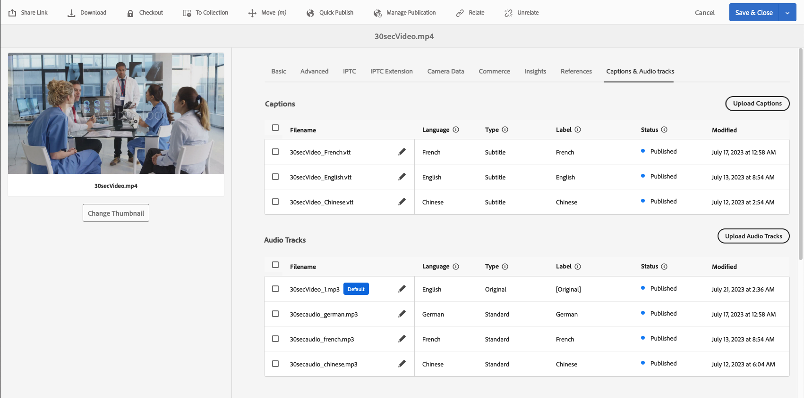
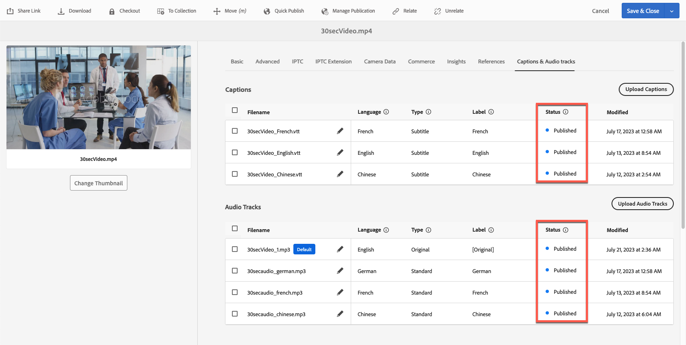
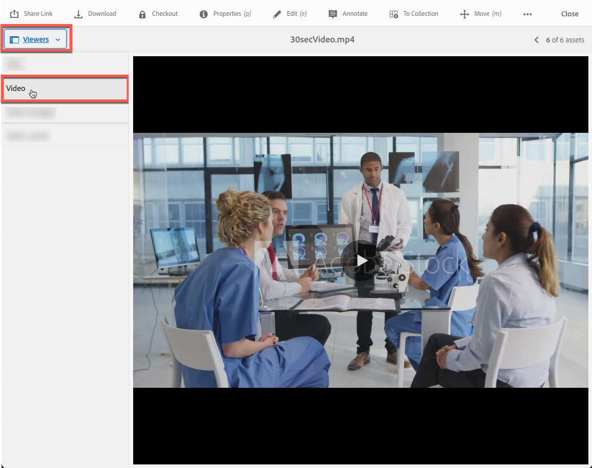

# Video in Dynamic Media {#video}

In deze sectie wordt het werken met video in Dynamic Media beschreven.

## Snel starten: Video&#39;s {#quick-start-videos}

De volgende stapsgewijze workflowbeschrijving is ontworpen om u te helpen snel aan de slag te gaan met adaptieve videosets in Dynamic Media. Na elke stap, zijn er verwijzingen naar onderwerprubrieken waar u meer informatie kunt vinden.

>[!IMPORTANT]
>
>Voordat u in Dynamic Media met video werkt, moet u ervoor zorgen dat uw Adobe Experience Manager-beheerder Dynamic Media-Cloud Servicen al heeft ingeschakeld en geconfigureerd in de Dynamic Media-Scene7-modus of in de Dynamic Media-hybride modus.
>
>* Zie [ de Cloud Servicen van Dynamic Media ](/help/assets/config-dms7.md#configuring-dynamic-media-cloud-services) vormen in het Vormen Dynamic Media - de wijze van Scene7 en [ oplossen Dynamic Media - de wijze van Scene7 ](/help/assets/troubleshoot-dms7.md).
>
>* Zie [ de Cloud Servicen van Dynamic Media ](/help/assets/config-dynamic.md#configuring-dynamic-media-cloud-services) vormen in het Vormen Dynamic Media - Hybride wijze.
>
>Huidige bekende videoplaybackkwestie in Dynamic Media *op Experience Manager 6.5.9.0 slechts*:
>
>* Als een gepubliceerde video wordt bijgewerkt, moet deze opnieuw worden gepubliceerd om wijzigingen in de levering te weerspiegelen.
>

1. **upload uw video&#39;s van Dynamic Media** door het volgende te doen:

   * Maak uw eigen videocoderingsprofiel. Of, kunt u het vooraf bepaalde _Aangepaste Video Coderen_ profiel eenvoudig gebruiken dat met Dynamic Media komt.

      * [ creeer een video het coderen profiel ](/help/assets/video-profiles.md#creating-a-video-encoding-profile-for-adaptive-streaming).
      * Leer meer over [ Beste praktijken voor video het coderen ](#best-practices-for-encoding-videos).

   * Koppel het videoverwerkingsprofiel aan een of meer mappen waar u de primaire bronvideo&#39;s gaat uploaden.

      * [ pas een videoprofiel op omslagen ](/help/assets/video-profiles.md#applying-a-video-profile-to-folders) toe.
      * Leer meer over [ Beste praktijken voor het organiseren van uw digitale activa voor het gebruiken van verwerkingsprofielen ](/help/assets/organize-assets.md).
      * Leer meer over [ Organiseer digitale activa ](/help/assets/organize-assets.md).

   * Upload uw primaire bronvideo&#39;s naar de mappen. Wanneer u video&#39;s aan de map toevoegt, worden deze gecodeerd volgens het videoverwerkingsprofiel dat u aan de map hebt toegewezen.

      * Dynamic Media ondersteunt voornamelijk korte video&#39;s met een maximale lengte van 30 minuten en een minimale resolutie van meer dan 25 x 25.
      * U kunt videobestanden uploaden van maximaal 15 GB elk.
      * [ upload uw video&#39;s ](/help/assets/managing-video-assets.md#upload-and-preview-video-assets).
      * Leer meer over [ Ondersteunde formaten van het inputdossier ](/help/assets/assets-formats.md#supported-multimedia-formats).

   * Monitor hoe [ video het coderen ](#monitoring-video-encoding-and-youtube-publishing-progress) of van de activa of werkschemamening vooruitgaat.

1. **beheer uw video&#39;s van Dynamic Media** door om het even welke volgend te doen:

   * Video-elementen organiseren, doorbladeren en zoeken

      * [ Organiseer digitale activa ](/help/assets/organize-assets.md)
Leer meer over [ Beste praktijken voor het organiseren van uw digitale activa voor het gebruiken van verwerkingsprofielen ](organize-assets.md)

      * [ videoactiva van het Onderzoek ](search-assets.md#custompredicates) of [ activa van het Onderzoek ](/help/assets/search-assets.md)

   * Video-elementen voorvertonen en publiceren

      * Bekijk de bronvideo en de gecodeerde vertoningen van de video samen met de bijbehorende miniaturen:
        [ de video&#39;s van de Voorproef ](managing-video-assets.md#upload-and-preview-video-assets) of [ activa van de Voorproef ](previewing-assets.md)
        [ de videovertoningen van de Mening ](video-renditions.md)
        [ beheer videovertoningen ](manage-assets.md#managing-renditions)

      * [Voorinstellingen voor viewers beheren](managing-viewer-presets.md)
      * [Publish-middelen](publishing-dynamicmedia-assets.md)

   * Werken met videometagegevens

      * Bekijk de eigenschappen van een gecodeerde video-uitvoering, zoals framesnelheid, audio- en videobitsnelheid en codec:
        [ de eigenschappen van de videovertoning van de Mening ](video-renditions.md)

      * Bewerk de eigenschappen van video, zoals de titel, beschrijving en tags, aangepaste metagegevensvelden:
        [ geef videoeigenschappen ](manage-assets.md#editing-properties) uit

      * [Metagegevens voor digitale elementen beheren](metadata.md)
      * [Metagegevensschema&#39;s](metadata-schemas.md)

   * Video&#39;s bekijken, goedkeuren en annoteren en volledige versiebeheer behouden

      * [ Annoteer video&#39;s ](managing-video-assets.md#annotate-video-assets) of [ activa ](manage-assets.md#annotating) annoteren

      * [Een versie maken](manage-assets.md#asset-versioning)
      * [ pas werkschema&#39;s op activa ](assets-workflow.md) toe of zie [ Begin een werkschema op een activa ](manage-assets.md#starting-a-workflow-on-an-asset)

      * [Mapmiddelen controleren](bulk-approval.md)
      * [Projecten](../sites-authoring/projects.md)

1. **Publish uw video&#39;s van Dynamic Media** door één van het volgende te doen:

   * Als u Adobe Experience Manager gebruikt als beheersysteem voor webinhoud, kunt u video&#39;s rechtstreeks aan uw webpagina&#39;s toevoegen.

      * [ voegt video&#39;s aan uw Web-pagina&#39;s ](adding-dynamic-media-assets-to-pages.md) toe.

   * Als u een systeem voor webcontentbeheer van derden gebruikt, kunt u video&#39;s koppelen aan of insluiten in uw webpagina&#39;s.

      * Video integreren met URL:
        [ Verbinding URLs aan uw Webtoepassing ](linking-urls-to-yourwebapplication.md).

      * Video integreren met behulp van ingesloten code op een webpagina:
        [ bedt de videokijker op een Web-pagina ](embed-code.md) in.

   * [ produceer videorapporten ](#viewing-video-reports).

   * [ voegt titels aan de video ](#adding-captions-to-video) toe.

## Werken met video in Dynamic Media {#working-with-video-in-dynamic-media}

Video in Dynamic Media is een end-to-end oplossing waarmee u eenvoudig Adaptieve video van hoge kwaliteit kunt publiceren voor streaming op meerdere schermen, zoals desktopcomputers, iOS, Android™, BlackBerry® en mobiele Windows-apparaten. Een adaptieve videoreeks groepeert versies van de zelfde video die bij verschillende beetjetarieven en formaten zoals 400 kbps, 800 kbps, en 1000 kbps worden gecodeerd. De desktopcomputer of het mobiele apparaat detecteert de beschikbare bandbreedte.

Op een mobiel iOS-apparaat wordt bijvoorbeeld een bandbreedte gedetecteerd, zoals 3G, 4G of Wi-Fi. Vervolgens wordt automatisch de naar rechts gecodeerde video geselecteerd bij de verschillende bitsnelheden van de video in de adaptieve videoset. De video wordt gestreamd naar desktops, mobiele apparaten of tablets.

Bovendien wordt de videokwaliteit automatisch dynamisch geschakeld als de netwerkomstandigheden veranderen op het bureaublad of op het mobiele apparaat. Als een klant de modus Volledig scherm op een desktopcomputer inschakelt, reageert de Adaptive Video Set met een betere resolutie, waardoor de kijkervaring van de klant wordt verbeterd. Met Adaptieve videosets kunt u Dynamic Media-video op meerdere schermen en apparaten het best afspelen.

De logica die een videospeler gebruikt om te bepalen welke gecodeerde video moet worden afgespeeld of tijdens het afspelen moet worden geselecteerd, is gebaseerd op het volgende algoritme:

1. De videospeler laadt het eerste videofragment op basis van de bitsnelheid die het dichtst bij de waarde ligt die voor de beginbitsnelheid is ingesteld in de speler zelf.
1. De videospelerschakelaars die op veranderingen in de bandbreedtesnelheid worden gebaseerd die de volgende criteria gebruiken:

   1. De speler kiest de hoogste bandbreedtestroom onder of gelijk aan de geschatte bandbreedte.
   1. De speler overweegt slechts 80% van de beschikbare bandbreedte. Als er echter een overstap wordt gemaakt, is het conservatiever bij slechts 70% om overschatting te voorkomen en onmiddellijk terug te keren.

Voor gedetailleerde technische informatie over het algoritme, zie [ https://android.googlesource.com/platform/frameworks/av/+/master/media/libstagefright/httplive/LiveSession.cpp ](https://android.googlesource.com/platform/frameworks/av/+/master/media/libstagefright/httplive/LiveSession.cpp)

Voor het beheren van afzonderlijke video- en adaptieve videosets wordt het volgende ondersteund:

* Video uploaden van video-indelingen en audio-indelingen die ondersteuning bieden voor een groot aantal apparaten en het coderen van video naar de MP4 H.264-indeling, zodat deze op meerdere schermen kan worden afgespeeld. U kunt vooraf gedefinieerde adaptieve videovoorinstellingen gebruiken, voorinstellingen voor één videocodering gebruiken of uw eigen codering aanpassen om de kwaliteit en de grootte van de video te bepalen.

   * Wanneer een adaptieve videoset wordt gegenereerd, bevat deze MP4-video&#39;s.
   * **Nota**: De hoofd/bronvideo&#39;s worden niet toegevoegd aan een Aangepaste VideoReeks.

* ondertiteling in alle HTML5-videoviewers.
* Video organiseren, doorbladeren en doorzoeken met volledige metagegevensondersteuning voor een efficiënt beheer van video-elementen.
* Lever Adaptieve videosets naar het web en naar desktops en mobiele apparaten, zoals de iPhone, iPad, Android™, BlackBerry® en Windows-telefoon.

Adaptieve videostreaming wordt ondersteund op verschillende iOS-platforms. Zie {de Gids van de Verwijzing van de Kijkers van Dynamic Media 0} ](https://experienceleague.adobe.com/docs/dynamic-media-developer-resources/library/viewers-aem-assets-dmc/video/c-html5-video-reference.html#video).[

Dynamic Media ondersteunt het afspelen van mobiele video voor MP4 H.264-video. <!-- LINK IS 404 WITH NO SUITABLE REPLACEMENT You can find BlackBerry&reg; devices that support this video format at the following: [Supported video formats on BlackBerry&reg;](https://support.blackberry.com/kb/articleDetail?ArticleNumber=000005482). -->

U kunt de apparaten vinden van Vensters die dit videoformaat bij het volgende steunen: [ Gesteunde media codecs voor Telefoon 8 van Vensters ](https://learn.microsoft.com/en-us/windows/uwp/audio-video-camera/supported-codecs)

* Speel de video terug gebruikend de Voorinstellingen van de VideoKijker van Dynamic Media, met inbegrip van:

   * Enkele videoviewers.
   * Gemengde Media-viewers die zowel video- als afbeeldingsinhoud combineren.

* Configureer videospelers om aan uw brandingbehoeften te voldoen.
* Video met een eenvoudige URL of insluitcode integreren in uw website, mobiele site of mobiele toepassing.

<!-- See [Dynamic video playback](https://s7d9.scene7.com/s7/uvideo.jsp?asset=GeoRetail/Mop_AVS&config=GeoRetail/Universal_Video1&stageSize=640,480) sample. -->

Zie ook [ Kijkers voor Experience Manager Assets en Dynamic Media Classic ](https://experienceleague.adobe.com/docs/dynamic-media-developer-resources/library/viewers-aem-assets-dmc/c-html5-s7-aem-asset-viewers.html#viewers-aem-assets-dmc) en [ Kijkers voor slechts de activa van de Experience Manager ](https://experienceleague.adobe.com/docs/dynamic-media-developer-resources/library/viewers-for-aem-assets-only/c-html5-aem-asset-viewers.html#viewers-for-aem-assets-only).

## Tips en trucs: De HTML5-videoviewer gebruiken {#best-practice-using-the-html-video-viewer}

De Dynamic Media HTML5 Video viewer-voorinstellingen zijn robuuste videospelers. U kunt deze gebruiken om veel voorkomende problemen te voorkomen die samenhangen met het afspelen van HTML5-video. En problemen met mobiele apparaten, zoals een gebrek aan adaptieve streaminglevering met bitsnelheid en een beperkt bereik van de desktopbrowser.

Aan de ontwerpkant van de speler, kunt u de functionaliteit van de videospeler ontwerpen gebruikend standaardWeb ontwikkelingshulpmiddelen. U kunt bijvoorbeeld de knoppen, besturingselementen en de achtergrond van een aangepaste posterafbeelding ontwerpen met behulp van HTML5 en CSS om u te helpen uw klanten te bereiken met een aangepaste weergave.

Aan de afspeelzijde van de viewer wordt automatisch de videocapaciteit van de browser gedetecteerd. Vervolgens wordt de video weergegeven met HLS (Live HTTP-streaming) of DASH (Dynamic Adaptive Streaming over HTTP), ook wel adaptieve bitsnelheidstreaming genoemd. Of als deze leveringsmethoden niet aanwezig zijn, wordt in plaats daarvan HTML5 progressief gebruikt.

Door het volgende te combineren in één speler:

* De mogelijkheid om de afspeelcomponenten te ontwerpen met behulp van HTML5 en CSS
* Ingesloten afspelen hebben
* Adaptieve en progressieve streaming gebruiken, afhankelijk van de browsermogelijkheden

U vergroot het bereik van uw rijke media-inhoud tot zowel gebruikers op het bureaublad als mobiele gebruikers en zorgt voor een gestroomlijnde videobeleving.

Zie ook [ Ongeveer HTML5 Kijkers ](https://experienceleague.adobe.com/docs/dynamic-media-developer-resources/library/viewers-for-aem-assets-only/c-html5-aem-asset-viewers.html#viewers-for-aem-assets-only).

### Video afspelen op bureaubladcomputers en mobiele apparaten met de HTML5-videoviewer {#playback-of-video-on-desktop-computers-and-mobile-devices-using-the-html-video-viewer}

Voor adaptieve videostreaming op het bureaublad en mobiele apparaten zijn de video&#39;s die worden gebruikt voor het schakelen naar een andere bitsnelheid, gebaseerd op alle MP4-video&#39;s in de adaptieve videoset.

Het afspelen van video vindt plaats met behulp van DASH of HLS of via progressieve videodownload. In eerdere versies van Experience Manager, zoals 6.0, 6.1 en 6.2, werden video&#39;s gestreamd via HTTP.

In Experience Manager 6.3 en op, worden de video&#39;s nu gestreamd over HTTPS (namelijk DASH of HLS) omdat de de gatewaydienst URL van DM altijd HTTPS ook gebruikt. Dit standaardgedrag heeft geen gevolgen voor de klant. Videostreaming vindt dus altijd plaats via HTTPS, tenzij dit niet door de browser wordt ondersteund. (Zie de volgende tabel). Daarom

* Als u een HTTPS-website met HTTPS-videostreaming hebt, is streaming prima.
* Als u een HTTP-website met HTTPS-videostreaming hebt, is streaming prima en zijn er geen problemen met gemengde inhoud in de webbrowser.

DASH is de internationale standaard en HLS is een Apple-standaard. Beide worden gebruikt voor adaptieve videostreaming. En, passen beide technologieën automatisch playback aan die op de capaciteit van de netwerkbandbreedte wordt gebaseerd. Het laat de klant ook &quot;zoeken&quot;aan om het even welk punt in de video zonder de behoefte om op de rest van de video te wachten te downloaden.

Progressieve video wordt geleverd door de video lokaal te downloaden en op het desktopsysteem of mobiele apparaat van de gebruiker op te slaan.

In de volgende tabel worden het apparaat, de browser en de afspeelmethode beschreven van video&#39;s op bureaubladcomputers en mobiele apparaten met de Dynamic Media Video Viewer.

<table>
 <tbody>
  <tr>
   <td><strong>Apparaat</strong></td>
   <td><strong>Browser</strong></td>
   <td><strong>Video-afspeelmodus</strong></td>
  </tr>
  <tr>
   <td>Desktop</td>
   <td>Internet Explorer 9 en 10</td>
   <td>Progressieve download.</td>
  </tr>
  <tr>
   <td>Desktop</td>
   <td>Internet Explorer 11+</td>
   <td>In Windows 8 en Windows 10 - Gebruik HTTPS wanneer DASH* of HLS wordt aangevraagd, forceren. Bekende beperking: HTTP op DASH* of HLS werkt niet in deze combinatie browser/besturingssysteem <br /> <br /> In Windows 7 - Progressief downloaden. Gebruikt de standaardlogica voor het selecteren van het protocol HTTP versus HTTPS.</td>
  </tr>
  <tr>
   <td>Desktop</td>
   <td>Firefox 23-44</td>
   <td>Progressieve download.</td>
  </tr>
  <tr>
   <td>Desktop</td>
   <td>Firefox 45 of hoger</td>
   <td>Aangepaste streaming bitsnelheid van DASH* of HLS.</td>
  </tr>
  <tr>
   <td>Desktop</td>
   <td>Chrome</td>
   <td>Aangepaste streaming bitsnelheid van DASH* of HLS.</td>
  </tr>
  <tr>
   <td>Desktop</td>
   <td>Safari (Mac)</td>
   <td>HLS adaptieve bitsnelheidstreaming.</td>
  </tr>
  <tr>
   <td>Mobiel</td>
   <td>Chrome (Android™ 6 of eerder)</td>
   <td>Progressieve download.</td>
  </tr>
  <tr>
   <td>Mobiel</td>
   <td>Chrome (Android™ 7 of hoger)</td>
   <td>Aangepaste streaming bitsnelheid van DASH* of HLS.</td>
  </tr>
  <tr>
   <td>Mobiel</td>
   <td>Android™ (standaardbrowser)</td>
   <td>Progressieve download.</td>
  </tr>
  <tr>
   <td>Mobiel</td>
   <td>Safari (iOS)</td>
   <td>HLS adaptieve bitsnelheidstreaming.</td>
  </tr>
  <tr>
   <td>Mobiel</td>
   <td>Chrome (iOS)</td>
   <td>HLS adaptieve bitsnelheidstreaming.</td>
  </tr>
  <tr>
   <td>Mobiel</td>
   <td>BlackBerry®</td>
   <td>Aangepaste streaming bitsnelheid van DASH* of HLS./td&gt;
  </tr>
 </tbody>
</table>

>[!IMPORTANT]
>
>*Als u DASH wilt gebruiken voor uw video&#39;s, moet u deze eerst inschakelen via de Adobe Technical Support op uw account. Zie [ DASH op uw rekening van Dynamic Media ](#enable-dash) toelaten.

## Architectuur van Dynamic Media-videooplossing {#architecture-of-dynamic-media-video-solution}

In de volgende afbeelding ziet u de algemene ontwerpworkflow voor video&#39;s die via DMGateway (in de Dynamic Media Hybrid-modus) worden geüpload en gecodeerd en die voor openbare consumptie beschikbaar worden gesteld.


## Hybride publicatiearchitectuur voor video&#39;s {#hybrid-publishing-architecture-for-videos}


## Aanbevolen werkwijzen voor het coderen van video&#39;s {#best-practices-for-encoding-videos}

Het **Dynamic Media codeert Video** werkschema codeert video als u Dynamic Media en de diensten van de opstellingsvideowolk hebt toegelaten. In deze workflow worden de historie en informatie over fouten van het workflowproces vastgelegd. Als u Dynamic Media hebt ingeschakeld en cloudservices voor video hebt ingesteld, wordt de **[!UICONTROL Dynamic Media Encode Video]** -workflow automatisch van kracht wanneer u een video uploadt. (Als u Dynamic Media niet gebruikt, wordt de **[!UICONTROL DAM Update Asset]** -workflow van kracht.)

<!-- DEAD The following are best-practice tips for encoding source video files.

For advice about video encoding, see [Video Encoding Basics](https://www.adobe.com/go/learn_s7_encoding_en).

* [Streaming 101: The Basics — Codecs, Bandwidth, Data Rate, and Resolution](https://www.adobe.com/go/learn_s7_streaming101_en). -->

### Source-videobestanden {#source-video-files}

Wanneer u een videobestand codeert, gebruikt u een videobronbestand van de hoogst mogelijke kwaliteit. Gebruik geen eerder gecodeerde videobestanden omdat deze bestanden al zijn gecomprimeerd en als u verder codeert, wordt een video van subparkwaliteit gemaakt.

* Dynamic Media ondersteunt voornamelijk korte video&#39;s met een maximale lengte van 30 minuten en een minimale resolutie van meer dan 25 x 25.
* U kunt primaire bronvideobestanden uploaden die elk maximaal 15 GB bedragen.

In de volgende tabel worden de aanbevolen grootte, hoogte-breedteverhouding en minimale bitsnelheid beschreven die uw bronvideobestanden moeten hebben voordat u ze codeert:

| Grootte | Hoogte-breedteverhouding | Minimale bitsnelheid |
|--- |--- |--- |
| 1024 x 768 | 4:3 | 4500 kbps voor de meeste video&#39;s. |
| 1280 x 720 | 16:9 | 3000 - 6000 kbps, afhankelijk van de hoeveelheid beweging in de video. |
| 1920 x 1080 | 16:9 | 6000 - 8000 kbps, afhankelijk van de mate van beweging in de video. |

### De metagegevens van een bestand verkrijgen {#obtaining-a-file-s-metadata}

U kunt de metagegevens van een bestand verkrijgen door de metagegevens van het bestand te bekijken met een programma voor videobewerking of met een toepassing die is ontworpen voor het verkrijgen van metagegevens. Hieronder vindt u instructies voor het gebruik van MediaInfo, een toepassing van derden, voor het verkrijgen van de metagegevens van een videobestand:

1. Ga naar [ Download MediaInfo ](https://mediaarea.net/en/MediaInfo/Download).
1. Selecteer en download het installatieprogramma voor de GUI-versie en volg de installatie-instructies.
1. Klik na de installatie met de rechtermuisknop op het videobestand (alleen Windows) en selecteer MediaInfo, of open MediaInfo en sleep het videobestand naar de toepassing. U ziet alle metagegevens die aan het videobestand zijn gekoppeld, inclusief de breedte, hoogte en fps.

### Hoogte-breedteverhouding {#aspect-ratio}

Wanneer u een voorinstelling voor videocodering kiest of maakt voor uw primaire bronvideobestand, moet u ervoor zorgen dat de voorinstelling dezelfde hoogte-breedteverhouding heeft als het primaire bronvideobestand. De hoogte-breedteverhouding is de verhouding tussen de breedte en de hoogte van de video.

Als u de hoogte-breedteverhouding van een videobestand wilt bepalen, vraagt u de metagegevens van het bestand op en noteert u de breedte en hoogte van het bestand (zie De metagegevens van het bestand hierboven verkrijgen). Gebruik vervolgens deze formule om de hoogte-breedteverhouding te bepalen:

width/height = hoogte-breedteverhouding

In de volgende tabel wordt beschreven hoe de resultaten van de formule worden omgezet in algemene opties voor de hoogte-breedteverhouding:

| Formulerresultaat | Hoogte-breedteverhouding |
|--- |--- |
| 1,33 | 4:3 |
| 0,75 | 3:4 |
| 1,78 | 16:9 |
| 0,56 | 9:16 |

Een video van 1440 x 1080 hoogte heeft bijvoorbeeld een hoogte-breedteverhouding van 1440/1080 of 1,33. In dit geval kiest u een voorinstelling voor videocodering met een hoogte-breedteverhouding van 4:3 om het videobestand te coderen.

### Bitsnelheid {#bitrate}

Bitsnelheid is de hoeveelheid gegevens die wordt gecodeerd om één seconde video af te spelen. De bitsnelheid wordt gemeten in kilobits per seconde (Kbps).

>[!NOTE]
>
>Omdat in alle codecs compressie met verlies wordt gebruikt, is bitsnelheid de belangrijkste factor voor de videokwaliteit. Bij compressie met verlies neemt de kwaliteit af naarmate u een videobestand comprimeert. Daarom zijn alle andere eigenschappen gelijk (de resolutie, framesnelheid en codec), hoe lager de bitsnelheid, hoe lager de kwaliteit van het gecomprimeerde bestand.

Wanneer u een codering voor bitsnelheden selecteert, kunt u kiezen uit twee typen:

* **[!UICONTROL Constant Bitrate Encoding]** (CBR) - Tijdens CBR-codering blijft de bitsnelheid of het aantal bits per seconde tijdens het coderingsproces ongewijzigd. Bij CBR-codering blijft de gegevenssnelheid van de set behouden voor de instelling van de gehele video. Bij CBR-codering worden mediabestanden niet geoptimaliseerd voor kwaliteit, maar wordt opslagruimte bespaard.
Gebruik CBR als uw video een vergelijkbaar bewegingsniveau in de gehele video bevat. CBR wordt meestal gebruikt voor het streamen van video-inhoud. Zie ook [ douane-toegevoegde videocoderingsparameters van het Gebruik ](/help/assets/video-profiles.md#using-custom-added-video-encoding-parameters).

* **[!UICONTROL Variable Bitrate Encoding]** (VBR) - VBR-codering past de gegevenssnelheid naar beneden en naar de bovenste limiet die u instelt, aan op basis van de gegevens die de compressor nodig heeft. Deze functionaliteit houdt in dat de bitsnelheid van het mediabestand tijdens een VBR-coderingsproces dynamisch wordt verhoogd of verlaagd, afhankelijk van de behoeften aan bitsnelheid van mediabestanden.
VBR duurt langer om te coderen, maar geeft de meest gunstige resultaten. De kwaliteit van het mediabestand is superieur. VBR wordt het meest meestal gebruikt voor http progressieve levering van video-inhoud.

Wanneer gebruikt u VBR versus CRB?
Als u VBR en CBR selecteert, wordt het bijna altijd aanbevolen VBR te gebruiken voor uw mediabestanden. VBR biedt bestanden van hogere kwaliteit tegen concurrerende bitsnelheden. Wanneer u VBR gebruikt, moet u ervoor zorgen dat u met codering met twee controles gebruikt en de maximale bitsnelheid instellen op 1,5x de bitsnelheid van de doelvideo.

Wanneer u een voorinstelling voor videocodering kiest, moet u rekening houden met de verbindingssnelheid van de eindgebruiker. Kies een voorinstelling met een gegevenssnelheid van 80 procent van die snelheid. Als de verbindingssnelheid van de eindgebruiker van het doel bijvoorbeeld 1000 Kbps is, is de beste voorinstelling een snelheid met een videogegevenssnelheid van 800 Kbps.

In deze tabel wordt de gegevenssnelheid beschreven van standaardverbindingssnelheden.

| Snelheid (Kbps) | Verbindingstype |
|--- |--- |
| 256 | Inbelverbinding. |
| 800 | Normale mobiele verbinding. Kies hiervoor een gegevenssnelheid tussen 400 en maximaal 800 voor 3G-ervaringen. |
| 2000 | Standaardbreedbandverbinding voor desktops. Voor deze verbinding, richt een gegevenstarief in de waaier 800-2000 Kbps, met de meeste doelstellingen gemiddeld 1200-1500 Kbps. |
| 5000 | Typische breedbandverbinding. Codering in dit bovenste bereik wordt niet aanbevolen, omdat de video bij deze snelheid niet beschikbaar is voor de meeste consumenten. |

### Resolutie {#resolution}

**Resolutie** beschrijft de hoogte en de breedte van een videodossier in pixel. De meeste bronvideo wordt opgeslagen met een hoge resolutie (bijvoorbeeld 1920 x 1080). Voor streamingdoeleinden wordt bronvideo gecomprimeerd tot een lagere resolutie (640 x 480 of lager).

Resolutie en gegevenssnelheid zijn twee geïntegreerde gekoppelde factoren die de videokwaliteit bepalen. Als u dezelfde videokwaliteit wilt behouden, geldt dat hoe hoger het aantal pixels in een videobestand (hoe hoger de resolutie), hoe hoger de gegevenssnelheid. Neem bijvoorbeeld het aantal pixels per frame in een videobestand met een resolutie van 320 x 240 en een resolutie van 640 x 480:

| Resolutie | Pixels per frame |
|--- |--- |
| 320 x 240 | 76.800 |
| 640 x 480 | 307.200 |

Het bestand van 640 x 480 heeft vier keer zoveel pixels per frame. Als u voor deze twee voorbeeldresoluties dezelfde gegevenssnelheid wilt bereiken, past u viermaal de compressie toe op het bestand van 640 x 480, waardoor de kwaliteit van de video kan afnemen. Daarom levert een videogegevenssnelheid van 250 Kbps beelden van hoge kwaliteit bij een resolutie van 320 x 240, maar niet bij een resolutie van 640 x 480.

Over het algemeen geldt dat hoe hoger de gegevenssnelheid, hoe beter de video er uitziet en hoe hoger de resolutie die u gebruikt, hoe hoger de gegevenssnelheid waarmee u de weergavekwaliteit wilt behouden (in vergelijking met lagere resoluties).

Omdat de resolutie en de gegevenssnelheid zijn gekoppeld, hebt u twee opties bij het coderen van video:

* Kies een gegevenssnelheid en codeer vervolgens met de hoogste resolutie die er goed uitziet in de gekozen gegevenssnelheid.
* Kies een resolutie en codeer met de gegevenssnelheid die nodig is voor video van hoge kwaliteit met de gekozen resolutie.

Wanneer u een voorinstelling voor videocodering kiest (of maakt) voor uw primaire bronvideobestand, gebruikt u deze tabel om de juiste resolutie in te stellen:

| Resolutie | Hoogte (pixels) | Schermgrootte |
|--- |--- |--- |
| 240p | 240 | Glanzend scherm |
| 300p | 300 | Klein scherm, meestal voor mobiele apparaten |
| 360p | 360 | Klein scherm |
| 480p | 480 | Medium-scherm |
| 720p | 720 | Groot scherm |
| 1080p | 1080 | High-definition groot scherm |

### FPS (frames per seconde) {#fps-frames-per-second}

In de Verenigde Staten en Japan wordt de meeste video met 29,97 frames per seconde (fps) opgenomen; in Europa wordt de meeste video met 25 fps opgenomen. Film wordt opgenomen bij 24 fps.

Kies een voorinstelling voor videocodering die overeenkomt met de fps-snelheid van het primaire bronvideobestand. Als uw primaire bronvideo bijvoorbeeld 25 fps is, kiest u een coderingsvoorinstelling met 25 fps. Standaard wordt bij alle aangepaste codering de fps van het primaire bronvideobestand gebruikt. Daarom hoeft u de fps-instelling niet expliciet op te geven wanneer u een voorinstelling voor videocodering maakt.

### Afmetingen videocodering {#video-encoding-dimensions}

Voor optimale resultaten selecteert u de coderingsafmetingen, zodat de bronvideo een volledig veelvoud van alle gecodeerde video&#39;s is.

Als u deze verhouding wilt berekenen, deelt u de bronbreedte door de gecodeerde breedte om de breedteverhouding op te halen. Vervolgens deelt u de bronhoogte door de gecodeerde hoogte om de hoogte-breedteverhouding te bepalen.

Als de resulterende verhouding een geheel geheel getal is, betekent dit dat de video optimaal wordt geschaald. Als de resulterende verhouding geen geheel geheel getal is, is dit van invloed op de videokwaliteit doordat pixelartefacten overblijven op het scherm. Dit effect is vooral opvallend wanneer de video tekst heeft.

Stel dat uw bronvideo bijvoorbeeld 1920 x 1080 is. In de volgende tabel bieden de drie gecodeerde video&#39;s de optimale coderingsinstellingen.

| Videotype | Breedte x hoogte | Breedteverhouding | Hoogteverhouding |
|--- |--- |--- |--- |
| Source | 1920 x 1080 | 1 | 1 |
| Gecodeerd | 960 x 540 | 2 | 2 |
| Gecodeerd | 640 x 360 | 3 | 3 |
| Gecodeerd | 480 x 270 | 4 | 4 |

### Gecodeerde videobestandsindeling {#encoded-video-file-format}

Dynamic Media raadt u aan voorinstellingen voor MP4 H.264-videocodering te gebruiken. Omdat MP4-bestanden de H.264-videocodec gebruiken, biedt deze video van hoge kwaliteit, maar met een gecomprimeerde bestandsgrootte.

### Ondersteuning voor DASH, meerdere bijschriften en audiotracks inschakelen voor uw Dynamic Media-account {#enable-dash}

**Ongeveer toelatend DASH op uw rekening**
DASH (Digital Adaptive Streaming via HTTP) is de internationale standaard voor videostreaming en wordt op grote schaal toegepast door verschillende videoviewers. Als DASH op uw account is ingeschakeld, kunt u kiezen uit DASH of HLS voor adaptieve videostreaming. U kunt ook kiezen voor beide opties met automatische schakelen tussen spelers als **[!UICONTROL auto]** is geselecteerd als het afspeeltype in de voorinstelling van de viewer.

Enkele belangrijke voordelen van het inschakelen van DASH voor uw account zijn:

* Pakketvideo voor aangepaste bitsnelheidstreaming. Deze methode leidt tot een efficiëntere levering. Adaptieve streaming zorgt voor de beste kijkervaring voor uw klanten.
* Bij voor browsers geoptimaliseerde streaming met Dynamic Media-spelers wordt geschakeld tussen HLS- en DASH-streaming voor de beste kwaliteit van de service. Wanneer een Safari-browser wordt gebruikt, schakelt de videospeler automatisch over naar HLS.
* U kunt uw voorkeursstreammethode (HLS of DASH) configureren door de voorinstelling voor de videoviewer te bewerken.
* Geoptimaliseerde videocodering zorgt ervoor dat er geen extra opslagruimte wordt gebruikt terwijl DASH-mogelijkheden worden ingeschakeld. Er wordt één set videocoderingscodes gemaakt voor zowel HLS als DASH om de opslagkosten voor video te optimaliseren.
* Helpt de levering van video toegankelijker te maken voor uw klanten.
* U kunt de URL voor streaming ook ophalen via API&#39;s.

Voor het inschakelen van DASH voor uw account zijn twee stappen vereist:

* Dynamic Media configureren voor gebruik van DASH, wat u eenvoudig kunt doen.
* Het vormen van Experience Manager 6.5 om DASH te gebruiken die door een geval van de Steun van de Klant van de Adobe wordt gedaan dat u creeert en voorlegt.

**Ongeveer toelatend veelvoudige titel en audio spoorsteun op uw rekening**

Tegelijkertijd maakt u een Adobe Support-case om DASH in te schakelen voor uw account, maar u profiteert ook van het automatisch inschakelen van ondersteuning voor meerdere bijschriften en audiotracks. Nadat u deze optie hebt ingeschakeld, worden alle volgende video&#39;s die u uploadt, verwerkt met een nieuwe back-endarchitectuur die ondersteuning biedt voor het toevoegen van meerdere bijschriften en audiotracks aan uw video&#39;s.

>[!IMPORTANT]
>
>Om het even welke video&#39;s die u *alvorens* toelatend veelvoudige titel en audiospoorsteun op uw rekening van Dynamic Media uploadde, [ moet worden opnieuw verwerkt ](/help/assets/processing-profiles.md#reprocessing-assets). Deze videoopwerkingsstap is nodig om ervoor te zorgen dat meerdere bijschriften en audiotrackmogelijkheden beschikbaar zijn. De video-URL&#39;s blijven werken en worden na de opwerking op de gebruikelijke wijze afgespeeld.

**om DASH, veelvoudige titel en veelvoudige audio spoorsteun op uw rekening van Dynamic Media toe te laten:**

<!-- 1. **Configure Dynamic Media for DASH** - In Dynamic Media on Experience Manager 6.5, navigate to [https://localhost:4502/system/console/configMgr](https://localhost:4502/system/console/configMgr).

1. Search for **AEM Assets Dynamic Media Video Advanced Streaming** feature flag.
1. To enable (turn on) DASH, select the checkbox. -->
1. Begin door **het vormen Dynamic Media voor DASH** - van Experience Manager, navigeer aan **[!UICONTROL Tools]** > **[!UICONTROL Operations]** > **[!UICONTROL Web Console]**.

1. Van de **[!UICONTROL Adobe Experience Manager Web Console Configuration]** pagina, scrol aan de naam *AEM Assets Dynamic Media Video Geavanceerde het Streamen Vlag van de Eigenschap*.

1. Schakel links van de naam het selectievakje in om DASH in te schakelen (inschakelen).

1. Selecteer **[!UICONTROL Save]** .

1. Nu [ gebruik de Admin Console om de verwezenlijking van een nieuw steungeval ](https://helpx.adobe.com/enterprise/using/support-for-experience-cloud.html) te beginnen.
1. Als u een ondersteuningsgeval wilt maken, volgt u de instructies en zorgt u ervoor dat u de volgende informatie opgeeft:

   * Primaire contactpersoon, e-mail, telefoon.
   * Naam van je Dynamic Media-account.
   * Geef op of u ondersteuning voor DASH, meerdere bijschriften en meerdere audiotracks wilt inschakelen voor uw Dynamic Media-account, op Experience Manager 6.5.

1. De Steun van de Klant van de Adobe voegt u aan de klant toe wachtlijst die op de orde wordt gebaseerd waarin de verzoeken worden voorgelegd.
1. Wanneer de Adobe klaar is om uw verzoek te behandelen, contacteert de Steun van de Klant u om een doeldatum voor enablement te coördineren en te plaatsen.
1. Klantenondersteuning stuurt u een melding nadat de service is voltooid.
1. U kunt nu een van de volgende twee handelingen uitvoeren:

   * Creeer uw [ vooraf ingestelde videokijker ](/help/assets/managing-viewer-presets.md#creating-a-new-viewer-preset) zoals gebruikelijk.
   * [ voeg veelvoudige titel en audiosporen ](#add-msma) aan uw video toe.

## Videorapporten weergeven {#viewing-video-reports}

>[!NOTE]
>
>Videorapporten zijn alleen beschikbaar wanneer u de modus Dynamic Media - Hybride uitvoert.

De videoRapporten tonen verscheidene gezamenlijke metriek over een gespecificeerde tijd om u te helpen controleren dat *gepubliceerde* individuele en gezamenlijke video&#39;s zoals verwacht presteren. De volgende statistische gegevens worden geaggregeerd voor alle gepubliceerde video&#39;s op uw gehele website:

* Video start
* Voltooiingssnelheid
* Gemiddelde tijd op video
* Totale tijd op video
* Video&#39;s per bezoek

Een lijst van alle *gepubliceerde* video&#39;s is ook vermeld zodat kunt u de hoogste bekeken video&#39;s op uw website volgen die op totale videobegin wordt gebaseerd.

Wanneer u een videonaam in de lijst selecteert, wordt het rapport voor het vasthouden van het publiek van de video (drop-off) weergegeven in de vorm van een lijndiagram. Het diagram toont het aantal weergaven voor een bepaald tijdstip tijdens het afspelen van video. Wanneer u de video afspeelt, wordt de verticale balk gesynchroniseerd met de tijdindicator in de speler. De vallen in de gegevens van het lijndiagram wijzen op waar uw publiek van oninteresse wegvalt.

Als de video buiten Adobe Experience Manager Dynamic Media is gecodeerd, zijn het diagram voor het vasthouden van het publiek (drop-off) en de gegevens voor het afspeelpercentage in de tabel niet beschikbaar.

Zie ook [ vormen de Cloud Servicen van Dynamic Media ](/help/assets/config-dynamic.md).

>[!NOTE]
>
>Het bijhouden en rapporteren van gegevens is uitsluitend gebaseerd op het gebruik van de eigen videospeler van Dynamic Media en de bijbehorende voorinstelling van de videospeler. U kunt dus geen video&#39;s bijhouden en rapporteren die door andere videospelers worden afgespeeld.

Door gebrek, de eerste keer u VideoRapporten ingaat, toont het rapport videogegevens die bij de eerste van de huidige maand beginnen en met de datum van de huidige maand beëindigen. U kunt het standaarddatumbereik echter overschrijven door uw eigen datumbereik op te geven. De volgende keer dat u Video-rapporten invoert, wordt het opgegeven datumbereik gebruikt.

Voor het correct werken van videorapporten, wordt een identiteitskaart van de Reeks van het Rapport automatisch gecreeerd wanneer de Cloud Servicen van Dynamic Media wordt gevormd. Tegelijkertijd wordt de rapportsuite-id doorgegeven aan de Publish-server, zodat deze beschikbaar is voor de functie URL kopiëren wanneer u een voorvertoning van elementen weergeeft. Voor deze functionaliteit is echter wel vereist dat de Publish-server al is ingesteld. Als de Publish-server niet is ingesteld, kunt u toch publiceren om het videoverslag te bekijken. U moet echter terugkeren naar de Dynamic Media Cloud Configuration en **[!UICONTROL OK]** selecteren.

**aan meningsvideorapporten:**

1. Selecteer in de linkerbovenhoek van de Experience Manager het logo van de Experience Manager en selecteer vervolgens in de linkertrack **[!UICONTROL Tools]** (hamerpictogram) > **[!UICONTROL Assets]** > **[!UICONTROL Video Reports]** .
1. Voer een van de volgende handelingen uit op de pagina Videorapporten:

   * Vlak de hoger-juiste hoek, selecteer **verfrissen Videopictogram van het Rapport**.
Gebruik alleen Vernieuwen als de einddatum van het rapport de huidige dag is. Dit zorgt ervoor dat u de video het volgen ziet die sinds de laatste tijd is voorgekomen u het rapport in werking stelde.

   * Vlak de hoger-juiste hoek, selecteer het **pictogram van de Plukker van 0} Datum {.**
Geef het begin- en einddatumbereik op waarvoor u videogegevens wilt en selecteer vervolgens **[!UICONTROL Run Report]** .

   De Hoogste de groepsdoos van Metriek identificeert diverse gezamenlijke metingen voor alle *gepubliceerde* video&#39;s over uw plaats.

1. Selecteer in de tabel met de bovenste gepubliceerde video&#39;s een videonaam om de video af te spelen en zie ook het rapport voor het vasthouden van het publiek van de video (drop-off).

### Videorapporten weergeven op basis van een videoviewer die u hebt gemaakt met de SDK van de Dynamic Media HTML5 Viewer {#viewing-video-reports-based-on-a-video-viewer-that-you-created-using-the-scene-hmtl-viewer-sdk}

Als u een uit-van-doos videoviewer gebruikt die door Dynamic Media wordt verstrekt, of als u een vooraf ingestelde douaneviewer creeerde die van een uit-van-doos videokijker wordt gebaseerd, dan worden geen extra stappen vereist om videorapporten te bekijken. Als u echter uw eigen videoviewer hebt gemaakt op basis van de HTML5 Viewer SDK API, voert u de volgende stappen uit om ervoor te zorgen dat uw videoviewer traceergebeurtenissen naar Dynamic Media Video Reports verzendt.

Gebruik de [ Gids van de Verwijzing van de Kijkers van Dynamic Media van de Adobe ](https://experienceleague.adobe.com/docs/dynamic-media-developer-resources.html) en [ HTML5 SDK API van de Kijker ](https://s7d1.scene7.com/s7sdk/3.10/docs/jsdoc/index.html) om uw eigen videokijkers tot stand te brengen.

**aan meningsvideorapporten die op een videokijker worden gebaseerd die u gebruikend Dynamic Media HTML5 Viewer SDK creeerde:**

1. Navigeer naar een gepubliceerd video-element.
1. Selecteer in de vervolgkeuzelijst in de linkerbovenhoek van de assetpagina de optie **[!UICONTROL Viewers]**.
1. Selecteer een voorinstelling voor een videoviewer en kopieer de insluitcode.
1. Zoek in de insluitcode de regel met het volgende:

   `videoViewer.setParam("config2", "<value>");`

   Met de parameter `config2` kunt u afbeeldingen bijhouden in HTML5 Viewers. Het is ook een bedrijf-specifieke vooraf ingesteld die de configuratieinformatie voor Video die, en voor klant-specifieke configuraties van Adobe Analytics bevat meldt.

   De juiste waarde voor de config2-parameter wordt gevonden in zowel de functie **[!UICONTROL Embed Code]** als de functie copy **[!UICONTROL URL]** . In de URL van de opdracht copy **[!UICONTROL URL]** is de parameter die moet worden gezocht `&config2=<value>` . De waarde is bijna altijd `companypreset`, maar in sommige gevallen ook `companypreset-1`, `companypreset-2`, enz.

1. Voeg in uw aangepaste videoviewercode AppMeasurementBridge .jsp als volgt toe aan de viewerpagina:

   * Bepaal eerst of u de parameter `&preset` nodig hebt.

     Als de `config2` parameter `companypreset` is, hebt u ** niet nodig `&preset=parameter`.

     Als `config2` iets anders is, stelt u de parameter preset in op dezelfde waarde als de parameter `config2` . Voeg bijvoorbeeld `&param2=companypreset-2` , indien `config2=companypreset-2` , toe aan de URL AppMeasurmentBridge.jsp.

   * Voeg vervolgens het script AppMeasurementBridge.jsp toe:

     `<script language="javascript" type="text/javascript" src="https://s7d1.scene7.com/s7viewers/AppMeasurementBridge.jsp?company=robindallas&preset=companypreset-2"></script>`

1. Maak als volgt de component TrackingManager:

   * Nadat u `s7sdk.Util.init();` hebt aangeroepen, maakt u een instantie TrackingManager om gebeurtenissen bij te houden door het volgende toe te voegen:

     `var trackingManager = new s7sdk.TrackingManager();`

   * Verbind componenten met TrackingManager door het volgende te doen:

     Koppel in de gebeurtenishandler `s7sdk.Event.SDK_READY` de component die u wilt bijhouden aan TrackingManager.

     Als de component bijvoorbeeld `videoPlayer` is, voegt u

     `trackingManager.attach(videoPlayer);`

     om de component aan trackingManager vast te maken. Als u meerdere viewers op een pagina wilt bijhouden, gebruikt u meerdere beheercomponenten voor bijhouden.

   * Maak het object AppMeasurementBridge door het volgende toe te voegen:

     ```
     var appMeasurementBridge = new AppMeasurementBridge(); appMeasurementBridge.setVideoPlayer(videoPlayer);
     ```

   * Voeg de functie voor bijhouden toe door het volgende toe te voegen:

     ```
     trackingManager.setCallback(appMeasurementBridge.track, 
      appMeasurementBridge);
     ```

   Het object appMeturementBridge heeft een ingebouwde trackfunctie. U kunt echter uw eigen systeem beschikbaar stellen voor de ondersteuning van meerdere trackingsystemen of andere functies.

<!--    For more information, see *Using the TrackingManager Component* in the *Scene7 HTML5 Viewer SDK User Guide* available for download from [Adobe Developer Connection](https://help.adobe.com/en_US/scene7/using/WSef8d5860223939e2-43dedf7012b792fc1d5-8000.html). -->


## Ondersteuning voor meerdere bijschriften en audiotracks voor video&#39;s in Dynamic Media{#about-msma}

Met de mogelijkheden voor meerdere bijschriften en audiotracks in Dynamic Media kunt u eenvoudig meerdere ondertitels en audiotracks toevoegen aan een primaire video. Dit betekent dat uw video&#39;s toegankelijk zijn voor een breed publiek. U kunt één gepubliceerde primaire video aanpassen aan een wereldwijd publiek in meerdere talen en de richtlijnen voor toegankelijkheid voor verschillende geografische regio&#39;s naleven. Auteurs kunnen de ondertitels en audiotracks ook beheren vanaf één tabblad in de gebruikersinterface.



Een aantal van de gebruiksscenario&#39;s die u kunt gebruiken voor het toevoegen van meerdere bijschriften en audiotracks aan uw primaire video zijn onder meer:

| Type | Hoofdletters gebruiken |
|--- |--- |
| **Bijschriften** | Ondersteuning voor meerdere talen |
|  | Beschrijvende tekst voor toegankelijkheid |
| **Audiosporen** | Ondersteuning voor meerdere talen |
|  | Commentaartracks |
|  | Beschrijvende audio |

Alle [ video formaten die in Dynamic Media ](/help/assets/assets-formats.md) worden gesteund en al videoViewers-behalve Dynamic Media *Video_360* viewer-worden gesteund voor gebruik met veelvoudige titel en audiosporen.

U kunt voor uw Dynamic Media-account meerdere bijschriften en audiotracks gebruiken via een functieschakeloptie die door de Adobe Klantenondersteuning moet worden ingeschakeld.

### Meerdere bijschriften en audiotracks toevoegen aan uw video {#add-msma}

Voordat u meerdere bijschriften en audiotracks aan uw video toevoegt, moet u controleren of u al over het volgende beschikt:

* Dynamic Media wordt ingesteld in een AEM omgeving.
* A [ wordt het Videoprofiel van Dynamic Media toegepast op de omslag waar uw video&#39;s ](/help/assets/video-profiles.md#applying-a-video-profile-to-folders) worden opgenomen.
* [ de Veelvoudige titel en audiospoor worden toegelaten op uw rekening van Dynamic Media ](#enable-dash).

Toegevoegde bijschriften en bijschriften worden ondersteund met de indelingen WebVTT en Adobe VTT. Toegevoegde audiotrackbestanden worden ook ondersteund in de MP3-indeling.

>[!IMPORTANT]
>
>Om het even welke video&#39;s die u *alvorens* toelatend veelvoudige titel en audiospoorsteun op uw rekening van Dynamic Media uploadde, [ moet worden opnieuw verwerkt ](/help/assets/processing-profiles.md#reprocessing-assets). Deze videoopwerkingsstap is nodig om ervoor te zorgen dat meerdere bijschriften en audiotrackmogelijkheden beschikbaar zijn. De video-URL&#39;s blijven werken en worden na de opwerking op de gebruikelijke wijze afgespeeld.

**om veelvoudige titel en audiosporen aan uw video toe te voegen:**

1. [ uploadt uw primaire video aan een omslag ](/help/assets/managing-video-assets.md#upload-and-preview-video-assets) die reeds een videoprofiel heeft dat aan het wordt toegewezen.
1. Navigeer naar het geüploade video-element waaraan u meerdere bijschriften en audiotracks wilt toevoegen.
1. Selecteer het video-element in de modus voor selectie van elementen in de lijstweergave of de kaartweergave.
1. Selecteer op de werkbalk het pictogram Eigenschappen (een cirkel met een &quot;i&quot; erin).
   *Geselecteerde videoactiva in de mening van de Kaart.*
1. Selecteer de tab **[!UICONTROL Captions & Audio Tracks]** op de pagina Eigenschappen van video.

   >[!TIP]
   >Als u het tabblad **[!UICONTROL Captions & Audio Tracks]** niet ziet, betekent dit een van de volgende twee dingen:
   >
   >* Aan de map waarin de geselecteerde video zich bevindt, is geen videoprofiel toegewezen. In welk geval, zie [ een videoprofiel op de omslag ](/help/assets/video-profiles.md#applying-video-profiles-to-specific-folders) toepassen.
   >* Of de video moet opnieuw worden verwerkt door Dynamic Media. In welk geval, zie [ activa in een omslag ](/help/assets/processing-profiles.md#reprocessing-assets) opnieuw verwerken.
   >
   >Als u een van de bovenstaande taken hebt uitgevoerd, gaat u terug naar deze stappen.

   *Bijschriften en Audiosporen lusje op de pagina van de Eigenschappen van de video.*

1. (Optioneel) Ga als volgt te werk om een of meer bijschriftbestanden aan een video toe te voegen:
   * Selecteer **[!UICONTROL Upload Captions]** .
   * Navigeer naar en selecteer een of meer .vtt-bestanden (videoteksttracks) en open deze.
   * Voor titels om op de media speler zichtbaar te zijn, moet u ** vereiste details (meta-gegevens) over *toevoegen elk* titeldossier dat u uploadde. Selecteer het potloodpictogram rechts van de bestandsnaam van een bijschrift. In **geef de dialoogdoos van de Titel** uit, ga de volgende vereiste details over het dossier in, dan uitgezocht **[!UICONTROL Save]**. Herhaal dit proces voor elk bijschriftbestand dat u hebt geüpload:

     | Metagegevens bijschrift | Beschrijving |
     |--- |--- |
     | Bestandsnaam | De standaardbestandsnaam wordt afgeleid van de oorspronkelijke bestandsnaam. De bestandsnaam kan alleen tijdens het uploaden worden gewijzigd en kan later niet worden gewijzigd. De vereisten voor bestandsnaamtekens zijn gelijk aan die voor AEM Assets.<br> zelfde filename kan niet voor extra titeldossiers en audiospoordossiers worden gebruikt. |
     | Taal | Selecteer de taal van het bijschrift. |
     | Type | Selecteer het type bijschrift dat u gebruikt.<br>**Ondertitel** - de titeltekst die met de video wordt getoond die vertaalt of de dialoog transcripting.<br>**Titel** - de bijschrifttekst omvat ook achtergrondgeluiden, sprekersdifferentiatie, en andere relevante informatie, samen met de vertaling of transcriptie van de dialoog, die de inhoud toegankelijker maken voor individuen die doof of moeilijk zijn te horen. |
     | Label | De tekst die voor de naam van het bijschrift wordt weergegeven in de pop-uplijst **[!UICONTROL Select audio or subtitle]** in de mediaspeler. Het label is wat een klant ziet die met een ondertitel of bijschrifttrack correspondeert. Bijvoorbeeld `English (CC)` . |

     U kunt de metagegevens van bijschriften indien nodig later wijzigen of bewerken. Wanneer de video wordt gepubliceerd, worden deze details weerspiegeld op openbare URLs in gepubliceerde video&#39;s.

1. (Optioneel) Ga als volgt te werk om een of meer audiotracks aan een video toe te voegen:
   * Selecteer **[!UICONTROL Upload Audio Tracks]** .
   * Navigeer naar en selecteer een of meer MP3-bestanden en open deze.
   * Voor audiosporen om in de **[!UICONTROL Select audio or caption]** pop-up lijst op de media speler zichtbaar te zijn, moet u ** vereiste details over *elk* audiospoordossier toevoegen dat u toevoegde. Selecteer het potloodpictogram rechts van de bestandsnaam van een audiotrack. In **geef Audiospoor** dialoogdoos uit, ga de volgende vereiste details in, dan uitgezocht **[!UICONTROL Save]**. Herhaal dit proces voor elk audiospoordossier dat u uploadde.

     | Metagegevens audiotrack | Beschrijving |
     |--- |--- |
     | Bestandsnaam | De standaardbestandsnaam wordt afgeleid van de oorspronkelijke bestandsnaam. De bestandsnaam kan alleen tijdens het uploaden worden gewijzigd en kan later niet worden gewijzigd. De vereisten voor bestandsnaamtekens zijn gelijk aan die voor AEM Assets.<br> zelfde filename kan niet voor extra audiospoordossiers of titeldossiers worden gebruikt. |
     | Taal | Selecteer de taal van de audiotrack. |
     | Type | Selecteer het type audiotrack dat u gebruikt.<br>**Origineel** - het audiospoor oorspronkelijk in bijlage aan de video en vertegenwoordigd als `[Original]` in het etiket met `English` taal die door gebrek wordt geselecteerd. Hoewel **[!UICONTROL Label]** en **[!UICONTROL Language]** kunnen worden gewijzigd in het dialoogvenster **[!UICONTROL Edit Audio Track]** , worden de oorspronkelijke waarden gebruikt als de primaire video opnieuw wordt verwerkt.<br>**Norm** - een toe:voegen-op audiospoor voor een taal buiten origineel.<br>**audiobeschrijving** - een audiospoor dat ook een beschrijvend verhaal van non-verbale acties en gebaren in de video omvat, die inhoud toegankelijker maken voor individuen die visueel gehandicapt zijn. |
     | Label | De tekst die als naam van de audiotrack in de pop-uplijst **[!UICONTROL Select audio or subtitle]** in de mediaspeler wordt weergegeven. Het label is wat een klant ziet die met een audiotrack correspondeert. Bijvoorbeeld `English [Original]` . Het label van de audio die aan een video is gekoppeld, wordt standaard ingesteld op `[Original]` . |

     U kunt deze metagegevens van de audiotrack indien nodig later wijzigen of bewerken. Wanneer de video wordt gepubliceerd, worden deze details weerspiegeld op openbare URLs in gepubliceerde video&#39;s.

1. Selecteer **[!UICONTROL Save]** in de rechterbovenhoek van de pagina in de vervolgkeuzelijst **[!UICONTROL Save & Close]** . De dossiers worden geupload en de meta-gegevensverwerking begint, zoals gezien in de **kolom van de Status** van de interface.

   >[!NOTE]
   >
   >Op basis van de cacheinstellingen van uw instantie kan het verwerken van metagegevens enkele minuten duren voordat dit effect wordt weerspiegeld in de voorvertoning en in gepubliceerde URL&#39;s.

1. (Optioneel) Als u **[!UICONTROL Save & Close]** in de vorige stap hebt geselecteerd in plaats van **[!UICONTROL Save]** te selecteren, kunt u nog steeds de verwerkingsstatus van de geüploade bestanden bekijken. Zie [ Mening de levenscyclusstatus van geupload titels en audiospoordossiers ](#lifecycle-status-video).
1. (Optioneel) Geef een voorvertoning van de video weer voordat u de video publiceert, zodat de bijschriften en audio naar behoren werken. Zie [ Voorproef een video die veelvoudige titel en audiosporen ](#preview-video-audio-subtitle) heeft
1. Publish the video. Zie [ de activa van Publish ](publishing-dynamicmedia-assets.md).

#### Bijschrift- en audiotrackbestanden toevoegen aan een video die al is gepubliceerd

Wanneer u aanvullende bijschriftbestanden of audiotrackbestanden uploadt naar een video die al is gepubliceerd, betekent dit dat deze bestanden de status `Processed` hebben nadat ze zijn voorbereid, na het uploaden. Op dat moment kunt u de video voorvertonen in Dynamic Media om de nieuw geüploade bestanden te bekijken of te horen.

Na voorproef, echter, moet u *de video opnieuw voor de onlangs toegevoegde titel of audiospoordossiers publiceren die, ook moeten worden gepubliceerd.* Na publicatie worden de bijschriften of audio beschikbaar via de openbare Dynamic Media-URL.

>[!NOTE]
>
>Op basis van de cacheinstellingen van uw instantie kunnen updates van metagegevens enkele minuten duren voordat deze worden weergegeven in de voorvertoning en in gepubliceerde URL&#39;s.

In het scenario waarin u Dynamic Media hebt geconfigureerd voor direct publiceren, wordt door het uploaden van extra bijschrift- of audiobestanden direct een publicatie van de video gestart na het uploaden van bijschrift- of audiobestanden.

>[!CAUTION]
>
>Wanneer u titeldossiers of audiodossiers aan een video uploadt die of gepubliceerd of unpublished is, worden de dossiers geschrapt als u [**](/help/assets/processing-profiles.md#reprocessing-assets) de video opnieuw verwerkt. Alleen de oorspronkelijke audio van de video blijft intact. In dergelijke gevallen moet u de bijschriftbestanden en audiotrackbestanden opnieuw uploaden naar de video.

#### Meerdere bijschriften toevoegen aan een video met een bestaande URL met bijschriftoptie

Dynamic Media ondersteunt het toevoegen van één bijschrift met video via een URL-modifier. Zie [ titels aan video ](#adding-captions-to-video) toevoegen.

Meerdere bijschriftwijzigingen hebben voorrang op een bijschrift dat is toegevoegd via een URL-modifier voor gepubliceerde video&#39;s.

**om veelvoudige titels aan een video toe te voegen die bestaande URL met titelbepaling heeft:**

1. Upload het bijschriftbestand dat al als een modifier aan de video is toegevoegd, zodat u het bestand expliciet kunt beheren.
1. U kunt desgewenst aanvullende bijschriftbestanden uploaden.
1. Publish de video zoals gewoonlijk.
De bestaande URL met de optie caption kan nu meerdere bijschriften laden.

### De levenscyclusstatus van geüploade bijschriften en audiotrackbestanden weergeven{#lifecycle-status-video}

U kunt de levenscyclusstatus van om het even welk die titel of audiospoordossier waarnemen aan uw primaire video van **wordt geupload Bijschriften &amp; Audiosporen** lusje van **Eigenschappen**.

**om de levenscyclusstatus van een video te bekijken:**

1. Navigeer naar het video-element waarvan u de levenscyclusstatus wilt weergeven.
1. Selecteer het video-element in de modus voor selectie van elementen in de lijstweergave of de kaartweergave.
1. Selecteer op de werkbalk het pictogram Eigenschappen (een cirkel met een &quot;i&quot; erin).
1. Selecteer op de pagina Eigenschappen de tab **[!UICONTROL Captions & Audio Tracks]** . Noteer in de kolom Status de status van elk bijschrift of audiobestand.

| Status bijschrift of audiotrack | Beschrijving |
| --- | --- |
| Verwerking | Wanneer een nieuw bijschrift of audiotrackbestand wordt toegevoegd en opgeslagen, verandert dit in de status &quot;Verwerking&quot;. Dynamic Media verwerkt het bestand door het streamingmanifest aan de primaire video te koppelen. |
| Verwerkt | Nadat de verwerking is voltooid, wordt het bijschrift of audiotrackbestand, of de oorspronkelijke audiotrack die is gekoppeld aan de primaire video, weergegeven in de status &quot;Verwerkt&quot;. U kunt voorproef titel en audiospoordossiers die als &quot;Bewerkt&quot;*verschijnen alvorens* u de video live publiceert. |
| Gepubliceerd | De status &quot;Gepubliceerd&quot; vertegenwoordigt een vergelijkbare status als &quot;Gepubliceerd&quot; voor een primaire video. Assets wordt gepubliceerd wanneer de primaire video wordt gepubliceerd en is beschikbaar op de openbare URL van Dynamic Media. |
| Mislukt | De status &quot;Mislukt&quot; betekent dat de verwerking van een bijschrift of audiotrackbestand niet is voltooid. Verwijder het bijschrift of het audiotrackbestand en upload het opnieuw. |
| Ongepubliceerd | Wanneer een gepubliceerde primaire video niet expliciet wordt gepubliceerd, worden alle bijschriften of audiotrackbestanden die u aan de video hebt toegevoegd, ook niet gepubliceerd. |

*de status van de levenscyclus van elk geupload caption en audiospoordossier.*

### De standaardaudio instellen voor een video met meerdere audiotracks

Standaard wordt de oorspronkelijke audio van een video ingesteld als de standaardaudio die moet worden afgespeeld.

Geüploade audiotrackbestanden kunnen echter worden ingesteld als de standaardaudio die moet worden afgespeeld nadat een video in de viewer is geladen. In het gebruikersinterface van Eigenschappen, onder het **Bijschriften &amp; Audiosporen** lusje, wordt het `Default` etiket toegepast rechts van het audiospoordossier voor videoplayback.

>[!NOTE]
>
>Het afspelen van standaardaudio kan ook afhankelijk zijn van de instelling in de volgende browsers:
>
>* Chrome - De standaardaudio die in de video is ingesteld, wordt afgespeeld.
>* Safari - Als de standaardtaal in Safari wordt geplaatst, wordt de audio gespeeld met de vastgestelde standaardtaal, als beschikbaar met manifest van de video. Anders wordt de standaardaudio afgespeeld die is ingesteld als onderdeel van de eigenschappen van een video.

**om de standaardaudio voor een video te plaatsen die veelvoudige audiosporen heeft:**

1. Navigeer naar het video-element waarvan u de standaardaudiotrack wilt instellen.
1. Selecteer het video-element in de modus voor selectie van elementen in de lijstweergave of de kaartweergave.
1. Selecteer op de werkbalk het pictogram Eigenschappen (een cirkel met een &quot;i&quot; erin).
1. Selecteer op de pagina Eigenschappen de tab **[!UICONTROL Captions & Audio Tracks]** .
1. Onder de **Audiosporen** rubriek, selecteer het audiospoordossier dat u als gebrek van de video wilt plaatsen.
1. Selecteer **[!UICONTROL Set as default]** .
In de **Reeks als standaard** dialoogdoos, uitgezochte **[!UICONTROL Replace]**.

   *plaatsend het standaard audiospoor voor een video.*

1. Selecteer **[!UICONTROL Save & Close]** in de rechterbovenhoek.
1. Publish the video. Zie [ de activa van Publish ](publishing-dynamicmedia-assets.md).

### Een voorvertoning weergeven van een video met meerdere bijschriften en audiotracks{#preview-video-audio-subtitle}

Nadat bijschriftbestanden en audiotrackbestanden naar een video zijn geüpload en zijn verwerkt, kunt u de Dynamic Media-videoviewer (of andere viewertypen indien gewenst) gebruiken om een voorvertoning van alle verschillende tracks weer te geven. Door een voorvertoning weer te geven, kunt u zien hoe uw video er uitziet en hoe de video eruit ziet en klinkt. Zo weet u zeker dat de video zich naar behoren gedraagt.

Wanneer u met de video wordt tevreden, kunt u het ](publishing-dynamicmedia-assets.md) publiceren gebruikend om het even welke volgende methodes.[

Zie [ de Video of Kijker van het Beeld op een Web-pagina ](/help/assets/embed-code.md) inbedden.
Zie [ Verbinding URLs aan uw Webtoepassing ](/help/assets/linking-urls-to-yourwebapplication.md). De op URL gebaseerde methode van het verbinden is niet mogelijk als uw interactieve inhoud verbindingen met relatieve URLs, in het bijzonder verbindingen met Experience Manager Sites pagina&#39;s heeft.
Zie [ Dynamic Media Assets aan pagina&#39;s ](/help/assets/adding-dynamic-media-assets-to-pages.md) toevoegen.

>[!NOTE]
>
>Het standaardtabblad voor voorvertoningen van Experience Managers bevat geen bijschrift en audiotracks. De reden hiervoor is dat deze tracks zijn gekoppeld aan Dynamic Media en alleen kunnen worden weergegeven met de voorvertoning van de Dynamic Media Viewer.

**aan voorproef een video die veelvoudige titels en audiosporen heeft:**

1. Navigeer in **[!UICONTROL Assets]** naar een bestaande video waaraan u meerdere bijschriften en audiotracks hebt toegevoegd.
1. Klik op het video-element zodat u dit kunt openen in de voorvertoningsmodus.
1. Selecteer op de voorvertoningspagina, linksboven op de pagina, de vervolgkeuzelijst en selecteer vervolgens **[!UICONTROL Viewers]** .

   

1. Selecteer in de lijst Viewers een viewer die u wilt gebruiken voor de videovoorvertoning. In de volgende schermafbeelding ziet u bijvoorbeeld hoe de **[!UICONTROL Video]** -viewer wordt geselecteerd.

   

1. Selecteer bij de rechterbenedenhoek, links van het volumepictogram, het pictogram van de spraakballon en selecteer vervolgens de audio of het bijschrift die u wilt horen, of zien of beide. U kunt desgewenst onder Bijschriften **[!UICONTROL Off]** selecteren om geen bijschriften weer te geven.

   *Simulatie van een gebruiker die de audio en de titel voor videoplayback selecteren.*

1. Selecteer de knop **[!UICONTROL Play]** van de video om het afspelen te starten.
Noteer de knoppen **[!UICONTROL URL]** en **[!UICONTROL Embed]** in de linkerbenedenhoek. Gebruik deze knopen aan [ verbinding URL van de video aan uw Webtoepassing ](/help/assets/linking-urls-to-yourwebapplication.md) of [ bed de video op een Web-pagina ](/help/assets/embed-code.md) in, respectievelijk.
1. Selecteer **[!UICONTROL Close]** in de rechterbovenhoek van de voorvertoningspagina.

### Bijschrift- of audiotrackbestanden verwijderen uit een video

U kunt bijschrift- of audiotrackbestanden verwijderen uit een video. Het verwijderen van gepubliceerde bijschriften of audiotrackbestanden wordt automatisch weerspiegeld in de gepubliceerde URL van de video.

De oorspronkelijke audiotrack die uit een primaire video is geëxtraheerd, kan niet worden verwijderd.

**om titel of audiospoordossiers van een video te schrappen:**

1. Navigeer naar het video-element waarvan u de standaardaudiotrack wilt instellen.
1. Selecteer het video-element in de modus voor selectie van elementen in de lijstweergave of de kaartweergave.
1. Selecteer op de werkbalk het pictogram Eigenschappen (een cirkel met een &quot;i&quot; erin).
1. Selecteer op de pagina Eigenschappen de tab **[!UICONTROL Captions & Audio Tracks]** .
1. Voer een van de volgende handelingen uit:

   * Bijschriften-onder de **rubriek van Bijschriften**, selecteer één of meerdere titeldossiers die u van de video wilt schrappen, dan selecteren **[!UICONTROL Delete]**.
   * De audio sporen-onder de **Audiosporen** rubriek, selecteert één of meerdere audiospoordossiers die u van de video wilt schrappen, dan selecteren **[!UICONTROL Delete]**.

1. Selecteer **[!UICONTROL OK]** in het dialoogvenster Verwijderen.
1. Publish the video.

### Bijschrift- of audiotrackbestanden downloaden die naar een video zijn geüpload

U kunt een of meer bijschrift- of audiotrackbestanden downloaden die u hebt geüpload voor gebruik met een video. U kunt alle geselecteerde bestanden downloaden als ZIP-bestand of een aparte downloadmap maken voor elk bestand.

De oorspronkelijke audiotrack die uit een primair bestand is gehaald, kan niet worden gedownload.

**om titel of audiospoordossiers van een video te downloaden:**

1. Navigeer naar het video-element waarvan u de standaardaudiotrack wilt instellen.
1. Selecteer het video-element in de modus voor selectie van elementen in de lijstweergave of de kaartweergave.
1. Selecteer op de werkbalk het pictogram Eigenschappen (een cirkel met een &quot;i&quot; erin).
1. Selecteer op de pagina Eigenschappen de tab **[!UICONTROL Captions & Audio Tracks]** .
1. Voer een van de volgende handelingen uit:

   * Bijschriften-onder de **rubriek van Bijschriften**, selecteer één of meerdere titeldossiers die u van de video wilt downloaden, dan selecteren **[!UICONTROL Download]**.
   * De audio sporen-onder de **Audiosporen** rubriek, selecteert één of meerdere audiospoordossiers die u van de video wilt downloaden, dan selecteren **[!UICONTROL Download]**.

1. Stel in het dialoogvenster Downloaden de volgende opties in:

   | Optie | Beschrijving |
   |--- |--- |
   | Opslaan als | Gebruik de standaardbestandsnaam die u in het tekstveld Opslaan als hebt opgegeven of geef uw eigen naam op. |
   | Een aparte map maken voor elk element | Maak een map voor elk bijschriftbestand of audiotrackbestand dat u hebt geselecteerd om te downloaden. |
   | E-mail | Gebruik uw standaard e-mailprogramma om het .zip-bestand naar een opgegeven e-mailadres te verzenden. |
   | Assets | Hiermee geeft u het aantal bestanden op dat u downloadt en de gecombineerde totale grootte van alle geselecteerde bestanden. Als u deze optie uitschakelt, wordt de knop **[!UICONTROL Download]** gedimd (uitgeschakeld), zodat u geen bestand kunt downloaden. |

1. Selecteer **[!UICONTROL Download]** .
1. Publish the video. Zie [ de activa van Publish ](publishing-dynamicmedia-assets.md).


## Gesloten bijschriften toevoegen aan een video {#adding-captions-to-video}

>[!IMPORTANT]
>
>De Adobe adviseert dat u [ veelvoudige titel en audiospoorvermogen ](#enable-dash) op uw rekening van Dynamic Media toelaat. Zo kunt u profiteren van de nieuwste Dynamic Media-backendarchitectuur en een vereenvoudigde workflow voor het toevoegen van bijschriften, ondertitels en audiotracks aan uw video&#39;s.

U kunt het bereik van uw video&#39;s uitbreiden naar wereldwijde markten door ondertiteling toe te voegen aan enkele video&#39;s of aan Adaptive Video Sets. Door ondertiteling toe te voegen, vermijdt u de behoefte om de audio te duwen, of de behoefte om inheemse sprekers te gebruiken om de audio voor elke verschillende taal opnieuw op te nemen. De video wordt afgespeeld in de taal waarin deze is opgenomen. Bijschriften in vreemde talen worden weergegeven zodat mensen in verschillende talen het audiogedeelte nog steeds kunnen begrijpen.

Ondertiteling met gesloten deuren maakt ook een betere toegankelijkheid mogelijk voor doven of slechthorenden.

>[!NOTE]
>
>De videospeler die u gebruikt moet de vertoning van titels steunen.

Zie ook [ Toegankelijkheid in Dynamic Media ](/help/assets/accessibility-dm.md).

Dynamic Media converteert bijschriftbestanden naar de JSON-indeling (JavaScript Object Notation). Met deze conversie kunt u de JSON-tekst insluiten in een webpagina als een verborgen, maar volledige transcriptie van de video. Zoekprogramma&#39;s kunnen de inhoud vervolgens verkennen en indexeren, zodat de video&#39;s gemakkelijker te vinden zijn en klanten meer informatie krijgen over de video-inhoud.

Zie [ statische inhoud (niet beeld) van de Server ](https://experienceleague.adobe.com/docs/dynamic-media-developer-resources/image-serving-api/image-serving-api/c-serving-static-nonimage-contents.html#image-serving-api) in het *Beeld van Dynamic Media die en API Hulp teruggeven* voor meer informatie over het gebruiken van de functie JSON in een URL.

**om gesloten titels aan een video toe te voegen:**

1. U kunt een toepassing of service van derden gebruiken om uw videobijschriftbestand te maken.

   Zorg ervoor dat het bestand dat u maakt, voldoet aan de WebVTT-standaard (Web Video Text Tracks). De bestandsnaamextensie voor ondertiteling is .vtt. U kunt meer informatie over de WebVTT ondertitelingsnorm leren.

   Zie [ WebVTT: Het formaat van de Tracks van de Tekst van het Web Video ](https://w3c.github.io/webvtt/).

   Er zijn vele websites die zowel gratis als premiumtools en -services bieden die u kunt gebruiken om WebVTT-bijschriften/bijschriftbestanden buiten Dynamic Media te maken. <!-- THE FOLLOWING LINK IS NO LONGER LIVE. CHECKED DECEMBER 13, 2023 For example, to create a simple video caption file with no styling, you can use the following free online caption authoring and editing tool: -->

   <!--[WebVTT Caption Maker](https://testdrive-archive.azurewebsites.net/Graphics/CaptionMaker/Default.html)

   For best results, use the tool in Internet Explorer 9 or above, Google Chrome, or Safari.

   In the tool, in the **[!UICONTROL Enter URL of video file]** field, paste the copied URL of your video file and then click **[!UICONTROL Load]**. See [Obtain a URL for an Asset](/help/assets/linking-urls-to-yourwebapplication.md#obtaining-a-url-for-an-asset) to get the URL to the video file itself which you can then paste into the **[!UICONTROL Enter URL of video file field]**. Internet Explorer, Chrome, or Safari can then natively play back the video. -->

   Volg de aanwijzingen op het scherm van een site om het WebVTT-bestand te ontwerpen en op te slaan. Wanneer u klaar bent, kopieert u de inhoud van het bijschriftbestand en plakt u deze in een teksteditor zonder opmaak en slaat u het bestand op met de bestandsnaamextensie `.vtt` .

   >[!NOTE]
   >
   >Voor algemene ondersteuning van videobijschriften in meerdere talen, vereist de WebVTT-standaard dat u afzonderlijke .vtt-bestanden maakt en dat u elke taal die u wilt ondersteunen, aanroept.

   Over het algemeen wilt u het VTT-bestand van het bijschrift dezelfde naam geven als het videobestand en dit bestand toevoegen met de landinstelling van de taal, zoals -EN, -FR of -DE. Op deze manier kunt u het genereren van video-URL&#39;s automatiseren met behulp van uw bestaande systeem voor webcontentbeheer.

1. Upload in Experience Manager uw WebVTT-bijschriftbestand naar DAM.
1. Navigeer aan *gepubliceerde* videoactiva die u met het titeldossier wilt associëren dat u uploadde.

   Houd er rekening mee dat URL&#39;s alleen beschikbaar zijn om te kopiëren *nadat* u de assets eerst hebt *gepubliceerd*.

   Zie [ de activa van Publish ](/help/assets/publishing-dynamicmedia-assets.md).

1. Voer een van de volgende handelingen uit:

   * Selecteer **[!UICONTROL URL]** voor een ervaring met een pop-upvideoviewer. Selecteer in het dialoogvenster URL de URL en kopieer deze naar het Klembord en passeer de URL naar een eenvoudige teksteditor. Voeg de gekopieerde URL van de video toe met de volgende syntaxis:

     `&caption=<server_path>/is/content/<path_to_caption.vtt_file,1>`

     Noteer de `,1` aan het einde van het bijschriftpad. Direct na de bestandsnaamextensie van `.vtt` in het pad kunt u optioneel de knop voor een gesloten bijschrift op de videospelerbalk in- of uitschakelen (uitschakelen) door deze in te stellen op respectievelijk `,1` of `,0` .

   * Selecteer **[!UICONTROL Embed Code]** voor een ingesloten videoviewerervaring. Selecteer in het dialoogvenster Code insluiten de insluitcode en kopieer deze naar het klembord. Plak de code vervolgens in een eenvoudige teksteditor. Voeg de gekopieerde insluitcode toe met de volgende syntaxis:

     `videoViewer.setParam("caption","<path_to_caption.vtt_file,1>");`

     Noteer de `,1` aan het einde van het bijschriftpad. Direct na de bestandsnaamextensie van `.vtt` in het pad kunt u optioneel de knop voor een gesloten bijschrift op de videospelerbalk in- of uitschakelen (uitschakelen) door deze in te stellen op respectievelijk `,1` of `,0` .

## Hoofdstukmarkeringen aan video toevoegen {#adding-chapter-markers-to-video}

U kunt lange-vormvideo&#39;s gemakkelijker bekijken en navigeren door hoofdstukmarkeringen toe te voegen aan enkele video&#39;s of aan Adaptieve videosets. Wanneer een gebruiker de video afspeelt, kunnen hij of zij op de hoofdstukmarkeringen op de videotijdlijn (ook wel de videoscrubber genoemd) klikken om gemakkelijk naar zijn of haar interessepunt te navigeren. Of ze kunnen meteen naar nieuwe inhoud, demonstraties en zelfstudies gaan.

>[!NOTE]
>
>De videospeler die wordt gebruikt moet het gebruik van hoofdstukmarkeringen steunen. Dynamic Media-videospelers ondersteunen wel hoofdstukmarkeringen, maar het gebruik van videospelers van derden is mogelijk niet mogelijk.

Desgewenst kunt u uw eigen aangepaste videoviewer maken en markeren met hoofdstukken in plaats van een voorinstelling voor de videoviewer te gebruiken. Voor instructies voor het maken van uw eigen HTML5-viewer met hoofdstuknavigatie verwijst u in de Adobe HTML SDK API van de Viewer naar de kop &quot;Gedrag aanpassen met behulp van wijzigingstoetsen&quot; onder de klassen `s7sdk.video.VideoPlayer` en `s7sdk.video.VideoScrubber` . Zie [ HTML5 de API ](https://s7d1.scene7.com/s7sdk/3.10/docs/jsdoc/index.html) documentatie van de Kijker SDK van de Kijker.

<!-- If desired, you can create and brand your own custom video viewer with chapters instead of using a video viewer preset. For instructions on creating your own HTML5 viewer with chapter navigation, in the Adobe Scene7 Viewer SDK for HTML5 guide, reference the heading "Customizing Behavior Using Modifiers" under the classes `s7sdk.video.VideoPlayer` and `s7sdk.video.VideoScrubber`. The Adobe Scene7 Viewer SDK is available as a download from [Adobe Developer Connection](https://help.adobe.com/en_US/scene7/using/WSef8d5860223939e2-43dedf7012b792fc1d5-8000.html). -->

U maakt een hoofdstuklijst voor uw video op ongeveer dezelfde manier als u bijschriften maakt. U maakt dus een WebVTT-bestand. Dit bestand moet echter gescheiden zijn van elk WebVTT-bijschriftbestand dat u ook gebruikt. U kunt bijschriften en hoofdstukken niet combineren tot één WebVTT-bestand.

U kunt het volgende voorbeeld als voorbeeld van het formaat gebruiken u gebruikt om een dossier WebVTT met hoofdstuknavigatie tot stand te brengen:

### WebVTT-bestand met navigatie in videohoofdstukken {#webvtt-file-with-video-chapter-navigation}

```xml
WEBVTT
Chapter 1
00:00.000 --> 01:04.364
The bicycle store behind it all.
Chapter 2
01:04.364 --> 02:00.944
Creative Cloud.
Chapter 3
02:00.944 --> 03:02.937
Ease of management for a working solution.
Chapter 4
03:02.937 --> 03:35.000
Cost-efficient access to rapidly evolving technology.
```

In het bovenstaande voorbeeld is `Chapter 1` de cue-id en optioneel. De actieduur van `00:00:000 --> 01:04:364` geeft de begin- en eindtijd van het hoofdstuk op in de `00:00:000` -indeling. Deze laatste drie cijfers zijn milliseconden en kunnen desgewenst als `000` worden verlaten. De hoofdstuktitel van `The bicycle store behind it all` is de feitelijke beschrijving van de inhoud van het hoofdstuk. De actidentificator, de begintijd en de hoofdstuktitel worden allemaal weergegeven in een pop-up van een videospeler wanneer een gebruiker de muisaanwijzer boven een visueel actiepunt in de tijdlijn van de video houdt.

Omdat u een HTML5-videoviewer gebruikt, moet u ervoor zorgen dat het hoofdstukbestand dat u maakt, voldoet aan de WebVTT-standaard (Web Video Text Tracks). De bestandsextensie van het hoofdstuk is `.vtt` . U kunt meer informatie over de WebVTT ondertitelingsnorm leren.

Zie [ WebVTT: Het formaat van de Tracks van de Tekst van het Web Video ](https://w3c.github.io/webvtt/)

**om de navigatie van het videohoofdstuk toe te voegen:**

1. Sla het `.vtt` -bestand op in UTF8-codering, zodat u problemen met tekenuitvoering in de hoofdstuktiteltekst voorkomt.

   Over het algemeen wilt u het hoofdstuk VTT-bestand dezelfde naam geven als het videobestand en het toevoegen met hoofdstukken. Op deze manier kunt u het genereren van video-URL&#39;s automatiseren met behulp van uw bestaande systeem voor webcontentbeheer.
1. Upload in Experience Manager uw WebVTT-hoofdstukbestand.

   Zie [ Uploading Assets ](/help/assets/manage-assets.md#uploading-assets).

1. Voer een van de volgende handelingen uit:

   <table>
     <tbody>
      <tr>
       <td>Voor een ervaring met een pop-upvideoviewer</td>
       <td>
       <ol>
       <li>Navigeer aan <i> gepubliceerde </i> videoactiva die u met het hoofdstukdossier wilt associëren dat u uploadde. Houd er rekening mee dat URL's alleen beschikbaar zijn om te kopiëren <i>nadat</i> u de assets eerst hebt <i>gepubliceerd</i>. Zie <a href="/help/assets/publishing-dynamicmedia-assets.md"> het Publiceren Assets.</a></li>
       <li>Van het drop-down menu, dan klik <strong> Kijkers </strong>.</li>
       <li>Klik in de linkertrack op de naam van de voorinstelling voor de videoviewer. Er wordt een voorvertoning van de video geopend op een aparte pagina.</li>
       <li>In het linkerspoor, bij de bodem, klik <strong> URL </strong>.</li>
       <li>Selecteer in het dialoogvenster URL de URL en kopieer deze naar het Klembord. Plak vervolgens de URL in een eenvoudige teksteditor.</li>
       <li>Voeg de gekopieerde URL van de video toe aan de volgende syntaxis, zodat u deze kunt koppelen aan de gekopieerde URL naar het hoofdstukbestand: <br /> <br /> <code>&navigation=<<i>full_copied_URL_path_to_chapter_file</i>.vtt></code><br /> </li>
       </ol> </td>
      </tr>
      <tr>
       <td>Voor een ingebedde videoviewerervaring <br /> </td>
       <td>
       <ol>
       <li>Navigeer aan <i> gepubliceerde </i> videoactiva die u met het hoofdstukdossier wilt associëren dat u uploadde. Houd er rekening mee dat URL's alleen beschikbaar zijn om te kopiëren <i>nadat</i> u de assets eerst hebt <i>gepubliceerd</i>. Zie <a href="/help/assets/publishing-dynamicmedia-assets.md"> het Publiceren Assets.</a></li>
       <li>Van het drop-down menu, dan klik <strong> Kijkers </strong>.</li>
       <li>Klik in de linkertrack op de naam van de voorinstelling voor de videoviewer. Er wordt een voorvertoning van de video geopend op een aparte pagina.</li>
       <li>In het linkerspoor, bij de bodem, klik <strong> bed </strong> in.</li>
       <li>Selecteer in het dialoogvenster Code insluiten de gehele code en kopieer deze naar het klembord. Plak de code vervolgens in een eenvoudige teksteditor.</li>
       <li>Voeg de insluitcode van de video toe aan de volgende syntaxis, zodat u deze kunt koppelen aan de gekopieerde URL naar het hoofdstukbestand:<br /> <br /> <code>videoViewer.setParam("navigation","&lt;<i>full_copied_URL_path_to_chapter_file</i>.vtt&gt;"</code></li>
       </ol> </td>
      </tr>
     </tbody>
   </table>

## Informatie over videominiaturen in de modus Dynamic Media - Scene7 {#about-video-thumbnails-in-dynamic-media-scene-mode}

Een videominiatuur is een verkleinde versie van een videoframe of een afbeeldingselement dat de video voor de klant vertegenwoordigt. De miniatuur moedigt een klant aan om de video te selecteren.

Aan alle video&#39;s in de Experience Manager moet een miniatuur zijn gekoppeld. U kunt een miniatuur niet verwijderen zonder deze te vervangen. Wanneer u een video uploadt naar Experience Manager, wordt standaard het eerste frame gebruikt als miniatuur. U kunt de miniatuur echter aanpassen voor bijvoorbeeld branding of visuele zoekopdracht. Wanneer u een videominiatuur aanpast, kunt u de video afspelen en pauzeren op het frame dat u wilt gebruiken. Of, kunt u een beeldactiva selecteren die u reeds hebt geupload en *gepubliceerd* in uw digitale activamanager.

Een aangepaste videominiatuurafbeelding die u selecteert uit een video, wordt niet geëxtraheerd en in de DAM opgeslagen als een afzonderlijk en afzonderlijk element. Een aangepaste videominiatuur die u selecteert uit een bestaand afbeeldingselement, wordt echter opgeslagen in de tekenherkenning. Het pad van het geselecteerde element wordt opgeslagen onder het knooppunt van het video-element, zoals in het volgende voorbeeldpad:

`/content/dam/*<folder_name*>/<*video_name*>/jcr:content/manualThumbnail`

De mogelijkheid om een videominiatuur aan te passen is alleen beschikbaar nadat u een videoprofiel hebt toegepast op de map waarin de video zich bevindt.

Zie ook [ Ongeveer videoduimnagels in Dynamic Media - Hybride wijze ](#about-video-thumbnails-in-dynamic-media-hybrid-mode).

### Een aangepaste videominiatuur toevoegen {#adding-a-custom-video-thumbnail}

Deze stappen zijn alleen van toepassing op Dynamic Media die wordt uitgevoerd in de modus &quot;Dynamicmedia_Scene7&quot;.

**om een duimnagel van de douanevideo toe te voegen:**

1. Zorg ervoor dat u al het volgende hebt gedaan:

   * Er is een map gemaakt voor uw video-elementen.
   * [ pas een videoprofiel op de omslag ](/help/assets/video-profiles.md#applying-a-video-profile-to-folders) toe.

   * [ uploadde uw video&#39;s aan de omslag ](/help/assets/managing-video-assets.md#upload-and-preview-video-assets).

1. Navigeer naar een geüpload video-element waarvan u de miniatuurafbeelding wilt wijzigen.
1. Selecteer het video-element in de modus voor middelenselectie van **[!UICONTROL List View]** of **[!UICONTROL Card View]** .
1. Selecteer op de werkbalk het pictogram **[!UICONTROL Properties]** (een cirkel met een &quot;i&quot; erin).
1. Selecteer **[!UICONTROL Change Thumbnail]** op de pagina Eigenschappen van video.
1. Voer een van de volgende handelingen uit op de pagina Miniatuur wijzigen:

   * Een frame uit de video gebruiken als de nieuwe miniatuur:

      * Selecteer **[!UICONTROL Select Frame from video]** op de werkbalk.
      * Selecteer de knop Afspelen en selecteer vervolgens de knop Pauzeren in het frame dat u wilt vastleggen als de nieuwe miniatuur van de video.

   * Een afbeeldingselement gebruiken als de nieuwe miniatuur:

      * Selecteer **[!UICONTROL Select Thumbnail from Assets]** op de werkbalk.
      * Selecteer **[!UICONTROL Select Thumbnail]** .
      * Navigeer naar een eerder geüpload en gepubliceerd afbeeldingselement dat u wilt gebruiken. De grootte van het element wordt automatisch gewijzigd om te dienen als miniatuurafbeelding voor de video.
      * Selecteer het afbeeldingselement en selecteer vervolgens **[!UICONTROL Select]** .

1. Selecteer **[!UICONTROL Save Change]** op de pagina Miniatuur wijzigen.
1. Selecteer **[!UICONTROL Save & Close]** in de rechterbovenhoek van de pagina Eigenschappen van video.

## Informatie over videominiaturen in Dynamic Media - hybride modus {#about-video-thumbnails-in-dynamic-media-hybrid-mode}

U kunt kiezen uit een van de tien miniatuurafbeeldingen die automatisch door Dynamic Media worden gegenereerd om aan uw video toe te voegen. De videospeler geeft de geselecteerde miniatuur weer wanneer een video-element wordt gebruikt met de Dynamic Media-component in de ontwerpomgeving van Experience Manager Sites, Experience Manager Mobile of Experience Managers Screens. De miniatuur fungeert als een statisch beeld dat de inhoud van de gehele video het beste vertegenwoordigt en dat gebruikers verder aanmoedigt om op de knop Afspelen te klikken.

Dynamic Media legt tien (standaard)miniatuurafbeeldingen vast op basis van de totale tijd van de video. De afbeeldingen worden vastgelegd op 1%, 11%, 21%, 31%, 41%, 51%, 61%, 71%, 81% en 91% in de video. De tien miniaturen blijven bestaan. Dit betekent dat als u een andere miniatuur kiest, u de reeks niet opnieuw hoeft te genereren. U bekijkt een voorvertoning van de tien miniatuurafbeeldingen en selecteert vervolgens de miniatuurafbeelding die u voor de video wilt gebruiken. Als u wilt veranderen in het gebrek, kunt u CRXDE Lite gebruiken om het tijdinterval te vormen dat duimnagelbeelden worden geproduceerd. Als u bijvoorbeeld alleen een reeks van vier miniatuurafbeeldingen met gelijkmatige tussenruimte uit uw video wilt genereren, kunt u de intervaltijd instellen op 24%, 49%, 74% en 99%.

In het ideale geval kunt u een videominiatuur toevoegen nadat u de video hebt geüpload, maar voordat u de video op uw website publiceert.

Desgewenst kunt u een aangepaste miniatuur uploaden die uw video vertegenwoordigt in plaats van een miniatuur die door Dynamic Media is gegenereerd. U kunt bijvoorbeeld een aangepaste miniatuurafbeelding maken met de titel van uw video, een opvallende openingsafbeelding of een specifieke afbeelding die u van uw video hebt vastgelegd. De aangepaste videominiatuurafbeelding die u uploadt, moet een maximale resolutie van 1280 x 720 pixels (minimale breedte van 640 pixels) en niet groter zijn dan 2 MB.

Zie ook [ Ongeveer videoduimnagels in Dynamic Media - de wijze van Scene7 ](/help/assets/video.md#about-video-thumbnails-in-dynamic-media-scene-mode).

### Een videominiatuur toevoegen {#adding-a-video-thumbnail}

Deze stappen zijn alleen van toepassing op Dynamic Media die wordt uitgevoerd in de hybride modus.

**om een videoduimnagel toe te voegen:**

1. Navigeer naar een geüpload video-element waaraan u een videominiatuur wilt toevoegen.
1. Selecteer het video-element in de modus voor selectie van elementen in de lijstweergave of de kaartweergave.
1. Selecteer op de werkbalk het pictogram **[!UICONTROL View Properties]** (een cirkel met een &quot;i&quot; erin).
1. Selecteer **[!UICONTROL Change Thumbnail]** op de pagina Eigenschappen van video.
1. Selecteer op de pagina Miniatuur wijzigen op de werkbalk de optie **[!UICONTROL Select Frame]** .

   Dynamic Media genereert een reeks miniatuurafbeeldingen van uw video op basis van het standaardtijdinterval of -interval dat u hebt aangepast.

1. Geef een voorvertoning van de gegenereerde miniatuurafbeeldingen weer en selecteer de miniatuurafbeelding die u aan de video wilt toevoegen.
1. Selecteer **[!UICONTROL Save Change]** .

   De miniatuurafbeelding van de video wordt bijgewerkt zodat deze de geselecteerde miniatuur gebruikt. Als u later besluit de miniatuurafbeelding te wijzigen, gaat u terug naar de pagina **[!UICONTROL Change Thumbnail]** en selecteert u een nieuwe pagina.

   Als u nieuwe standaardtijdintervallen hebt geconfigureerd of als u een nieuwe video hebt geüpload ter vervanging van de bestaande video, moet Dynamic Media de miniaturen opnieuw genereren.

   Zie [ het standaardtijdinterval vormen dat de videoduimnagels ](#configuring-the-default-time-interval-that-video-thumbnails-are-generated) worden geproduceerd.

#### Configureer het standaardtijdinterval dat videominiaturen worden gegenereerd {#configuring-the-default-time-interval-that-video-thumbnails-are-generated}

Wanneer u het nieuwe standaardtijdinterval configureert en opslaat, is uw wijziging automatisch alleen van toepassing op video&#39;s die u in de toekomst uploadt. De nieuwe standaard wordt niet automatisch toegepast op video&#39;s die u eerder hebt geüpload. Voor bestaande video&#39;s moet u de miniaturen opnieuw genereren.

Zie [ een videoduimnagel ](#adding-a-video-thumbnail) toevoegen.

**om het standaardtijdinterval te vormen dat de videoduimnagels worden geproduceerd:**

1. Selecteer in Experience Manager **[!UICONTROL Tools]** > **[!UICONTROL General]** > **[!UICONTROL CRXDE Lite]** .

1. Navigeer op de pagina CRXDE Lite in het mappenvenster aan de linkerkant naar `o etc/dam/imageserver/configuration/jcr:content/settings.`

   als het mappendeelvenster niet zichtbaar is, selecteert u het pictogram >> links van het tabblad Start.

1. Dubbelselecteer `thumbnailtime` op het tabblad Eigenschappen in het deelvenster rechtsonder.
1. Gebruik de tekstvelden in het dialoogvenster **[!UICONTROL Edit thumbnailtime]** om intervalwaarden in te voeren als percentages.

   * Selecteer het plusteken (+) pictogram als u één of meerdere gebieden van de intervalwaarde wilt toevoegen. Blader zo nodig naar de onderkant van het dialoogvenster om het pictogram weer te geven.
   * Selecteer het minteken (-) rechts van een veld voor de intervalwaarde als u het uit de lijst wilt verwijderen.
   * Selecteer het pictogram pijl-omhoog en pijl-omlaag als u de intervalwaarden opnieuw wilt rangschikken.

1. Selecteer **[!UICONTROL OK]** en ga terug naar het tabblad Eigenschappen.
1. Selecteer **[!UICONTROL Save All]** in de linkerbovenhoek van de pagina CRXDE Lite en selecteer vervolgens het pictogram Startpagina Vorige in de linkerbovenhoek om terug te keren naar de Experience Manager.

   Zie [ een videoduimnagel ](#adding-a-video-thumbnail) toevoegen.

### Een aangepaste videominiatuur toevoegen {#adding-a-custom-video-thumbnail-1}

Deze stappen zijn alleen van toepassing op Dynamic Media die wordt uitgevoerd in de hybride modus.

**om een duimnagel van de douanevideo toe te voegen:**

1. Navigeer naar een geüpload video-element waaraan u een aangepaste miniatuur voor video wilt toevoegen.
1. Selecteer het video-element in de modus voor selectie van elementen in de lijstweergave of de kaartweergave.
1. Selecteer op de werkbalk het pictogram **[!UICONTROL View Properties]** (een cirkel met een &quot;i&quot; erin).
1. Selecteer **[!UICONTROL Change Thumbnail]** op de pagina Eigenschappen van video.
1. Selecteer op de pagina Miniatuur wijzigen op de werkbalk de optie **[!UICONTROL Upload New Thumbnail]** .
1. Navigeer naar een miniatuurafbeelding die u wilt gebruiken, selecteer deze en selecteer vervolgens **[!UICONTROL Open]** om de afbeelding naar de Experience Manager te uploaden. Na het uploaden moet u de afbeelding publiceren.
1. Selecteer **[!UICONTROL Save Changes]** nadat u de afbeelding hebt geüpload en gepubliceerd op de pagina Miniatuur wijzigen.

   De aangepaste miniatuur wordt toegevoegd aan uw video.

## De Dynamic Media-URL voor Dynamic Media-elementen wijzigen {#manifest-urls}

Video&#39;s die in Dynamic Media worden verwerkt, kunnen worden gebruikt in de vorm van verouderde viewers en ook door rechtstreeks toegang te krijgen tot de manifest-URL&#39;s en deze af te spelen via uw eigen aangepaste viewers. Hier volgt de API voor het ophalen van manifest-URL&#39;s voor een video.

### Over de getVideoManifestURI-API

`getVideoManifestURI` API wordt blootgesteld door c `q-scene7-api:com.day.cq.dam.scene7.api` en kan worden gebruikt om volgende manifest URLs te produceren:

```java
/**   
* Returns the manifest url for videos 
* @param resource video resource 
* @param manifestType type of video streaming manifest being requested 
* @param onlyIfPublished return a manifest only if the video is published 
* @return the manifest url for videos 
* 
* @throws Exception 
*/
@Nullable 
String getVideoManifestURI(Resource resource, ManifestType manifestType, boolean onlyIfPublished) throws Exception;
```

#### getVideoManifestURI API-parameters

Deze API heeft de volgende drie parameters:

| Parameter | Beschrijving |
| --- | --- |
| `resource` | De bron die correspondeert met de video die Dynamic Media heeft gegeten. |
| `manifestType` | Kan `ManifestType.DASH` of `ManifestType.HLS` zijn |
| `onlyIfPublished` | Ingesteld op true voor het geval dat de manifest-uri alleen wordt gegenereerd als deze wordt gepubliceerd en beschikbaar is op de leveringslaag. |

Om manifest URLs voor video&#39;s te halen die de methode hierboven gebruiken, voeg a [ video het coderen profiel ](/help/assets/video-profiles.md#creating-a-video-encoding-profile-for-adaptive-streaming) aan een &quot;upload video&quot;omslag toe. Dynamic Media verwerkt deze video&#39;s op basis van de coderingen in het videocoderingsbestand dat aan de map is toegewezen. Nu kunt u de bovenstaande API aanroepen om manifest-URL&#39;s voor de geüploade video&#39;s op te halen.

### Foutscenario&#39;s

De API retourneert null als er fouten zijn. Uitzonderingen worden geregistreerd in foutenlogboeken voor Experience Managers. Dergelijke geregistreerde fouten beginnen met `Could not generate Video Manifest URI`. Dergelijke fouten kunnen in de volgende scenario&#39;s optreden:

* Een `IllegalArgumentException` wordt geregistreerd voor om het even welke volgend:

   * De doorgegeven parameter `resource` is null.
   * De doorgegeven parameter `resource` is geen video.
   * De doorgegeven parameter `manifestType` is null.
   * De parameter `onlyIfPublished` wordt doorgegeven als true, maar de video wordt niet gepubliceerd.
   * De video is niet opgenomen met een adaptieve videoset van Dynamic Media.

* `IOException` wordt geregistreerd als er een probleem is met de verbinding met Dynamic Media.
* `UnsupportedOperationException` wordt geregistreerd wanneer een doorgegeven `manifestType` parameter `ManifestType.DASH` is, terwijl de video niet is verwerkt met de DASH-indeling.

Het volgende is een voorbeeld van bovengenoemde API gebruikend servlets die in *worden geschreven HTTPWhiteBoard* specificatie. Selecteer elk tabblad voor de codesyntaxis.

>[!BEGINTABS]

>[!TAB  voegt gebiedsdeel in pom.xml ] toe

+++**voegt gebiedsdeel in pom.xml** toe

```java
dependency> 
     <groupId>com.day.cq.dam</groupId> 
     <artifactId>cq-scene7-api</artifactId> 
     <version>5.12.64</version> 
     <scope>provided</scope> 
</dependency> 
```

+++

>[!TAB  servlet van de Steekproef ]

+++**servlet van de Steekproef**

```java
@Component
        service = Servlet.class 
) 
@HttpWhiteboardServletPattern(value = ManifestServlet.SERVLET_PATTERN) 
@HttpWhiteboardContextSelect(value = Constants.SERVLET_CONTEXT_SELECTOR) 
public class ManifestServlet extends HttpServlet { 

   private static final Logger LOGGER = LoggerFactory.getLogger(ManifestServlet.class); 

   private final ObjectMapper objectMapper; 

    @Reference 
    private Scene7Service scene7Service; 

   public static final String SERVLET_PATTERN = Constants.VIDEO_API_PREFIX + "/manifestUrl"; 

   public ManifestServlet() {
         this.objectMapper = new ObjectMapper(); 
         objectMapper.setSerializationInclusion(JsonInclude.Include.NON_NULL); 
   }

   @Override 

   protected void doGet(HttpServletRequest request, HttpServletResponse response) throws IOException {
        final ResourceResolver resolver = getResourceResolver(request); 
        String assetPath = request.getParameter("assetPath"); 
        String manifest = request.getParameter("manifestType"); 
        String onlyIfPublished = request.getParameter("onlyIfPublished"); 
        Resource resource = resolver.getResource(assetPath); 
        response.setCharacterEncoding(StandardCharsets.UTF_8.toString()); 
        response.setContentType("application/json"); 
        if(resource == null) { 
            LOGGER.info("could not retrieve the resource from JCR"); 
            error("could not retrieve the resource from JCR", response); 
            return; 
        }

        String manifestUri = null; 

        try{ 
            ManifestType manifestType =  ManifestType.DASH; 
            if(manifest != null) { 
                manifestType = ManifestType.valueOf(manifest); 
            } 
            manifestUri = scene7Service.getVideoManifestURI(resource, manifestType, onlyIfPublished != null); 
            objectMapper.writeValue(response.getWriter(), new ManifestUrl(manifestUri)); 
            response.setContentType("application/json"); 
        } catch (Exception e) { 
            LOGGER.error(e.getMessage(), e); 
            error(String.format("Unable to get the manifest url for %s. %s", assetPath, e.getMessage()), response); 
        } 
    } 

    private ResourceResolver getResourceResolver(HttpServletRequest request) { 
        Object rr = request.getAttribute(AuthenticationSupport.REQUEST_ATTRIBUTE_RESOLVER); 
        if (!(rr instanceof ResourceResolver)) { 
            throw new IllegalStateException( 
                    "The request does not seem to have been created via Apache Sling's authentication mechanism."); 
        } else { 
            return (ResourceResolver) rr; 
        } 
    } 

    private void error(String errorMessage, HttpServletResponse response) throws IOException { 
        ManifestUrl errorManifest = new ManifestUrl(null); 
        errorManifest.setErrorMessage(errorMessage); 
        response.setStatus(HttpServletResponse.SC_INTERNAL_SERVER_ERROR); 
        objectMapper.writeValue(response.getWriter(), errorManifest); 
    } 
} 
```

+++

>[!TAB  Klasse van de Reactie voor servlet ]

+++**Klasse van de Reactie voor servlet**

```java
public class ManifestUrl extends VideoResponse { 
     String manifestUrl; 
     public ManifestUrl(String manifestUrl) { 
         this.manifestUrl = manifestUrl; 
     } 
     public String getManifestUrl() { 
         return manifestUrl; 
     } 
} 

public abstract class VideoResponse { 
     String errorString; 

     public String getErrorString() { 
         return errorString; 
     } 

     public void setErrorMessage(String errorString) { 
         this.errorString = errorString; 
     } 
} 
```

+++

>[!TAB  het dossier van constanten die in servlet van verwijzingen worden voorzien ]

+++**het dossier van constanten die in servlet van verwijzingen worden voorzien**

```java
public final class Constants { 

     private Constants() { 
     } 

     public static final String VIDEO_API_PREFIX = "/dynamicmedia/video"; 
     public static final String SERVLET_CONTEXT_SELECTOR = "(" + HttpWhiteboardConstants.HTTP_WHITEBOARD_CONTEXT_NAME + "=" + 
             DMSampleApiHttpContext.CONTEXT_NAME + ")"; 

 } 
```

+++

>[!TAB  ServletContext ]

+++**ServletContext**

Koppel de bovenstaande servlet met een `servletContext` . Hieronder ziet u een voorbeeld van `servletContext` .

```java
public class DMSampleApiHttpContext extends ServletContextHelper { 

 public static final String CONTEXT_NAME = "com.adobe.dmSample"; 
 public static final String CONTEXT_PATH = "/dmSample"; 

 private final MimeTypeService mimeTypeService; 

 private final AuthenticationSupport authenticationSupport; 

 /** 
  * Constructs a new context that will use the given dependencies. 
  * 
  * @param mimeTypeService Used when providing mime type of requests. 
  * @param authenticationSupport Used to authenticate requests with sling. 
  */ 
 @Activate 
 public DMSampleApiHttpContext(@Reference final MimeTypeService mimeTypeService, 
                               @Reference final AuthenticationSupport authenticationSupport) { 
     this.mimeTypeService = mimeTypeService; 
     this.authenticationSupport = authenticationSupport; 
 } 

 // ---------- HttpContext interface ---------------------------------------- 
 /** 
  * Returns the MIME type as resolved by the <code>MimeTypeService</code> or 
  * <code>null</code> if the service is not available. 
  */ 
 @Override 
 public String getMimeType(String name) { 
     MimeTypeService mtservice = mimeTypeService; 
     if (mtservice != null) { 
         return mtservice.getMimeType(name); 
     } 
     return null; 
 } 

 /** 
  * Returns the real context path that is used to mount this context. 
  * @param req servlet request 
  * @return the context path 
  */ 
 public static String getRealContextPath(HttpServletRequest req) { 
     final String path = req.getContextPath(); 
     if (path.equals(CONTEXT_PATH)) { 
         return ""; 
     } 
     return path.substring(CONTEXT_PATH.length()); 
 } 

 /** 
  * Returns a request wrapper that transforms the context path back to the original one 
  * @param req request 
  * @return the request wrapper 
  */ 
 public static HttpServletRequest createContextPathAdapterRequest(HttpServletRequest req) { 
     return new HttpServletRequestWrapper(req) { 

         @Override 
         public String getContextPath() { 
             return getRealContextPath((HttpServletRequest) getRequest()); 
         } 

     }; 

 } 

 /** 
  * Always returns <code>null</code> because resources are all provided 
  * through individual endpoint implementations. 
  */ 
 @Override 
 public URL getResource(String name) { 
     return null; 
 } 

 /** 
  * Tries to authenticate the request using the 
  * <code>SlingAuthenticator</code>. If the authenticator or the Repository 
  * is missing this method returns <code>false</code> and sends a 503/SERVICE 
  * UNAVAILABLE status back to the client. 
  */ 
 @Override 
 public boolean handleSecurity(HttpServletRequest request, 
                               HttpServletResponse response) throws IOException { 

     final AuthenticationSupport authenticator = this.authenticationSupport; 
     if (authenticator != null) { 
         return authenticator.handleSecurity(createContextPathAdapterRequest(request), response); 
     } 

     // send 503/SERVICE UNAVAILABLE, flush to ensure delivery 
     response.sendError(HttpServletResponse.SC_SERVICE_UNAVAILABLE, 
             "AuthenticationSupport service missing. Cannot authenticate request."); 
     response.flushBuffer(); 

     // terminate this request now 
     return false; 
 } 
}
```

+++

>[!ENDTABS]

### De voorbeeldservlet gebruiken

U roept de servlet aan door een `GET` -bewerking bij `/dmSample/dynamicmedia/video/manifestUrl` uit te voeren. De volgende queryparameters worden doorgegeven:

| Query-parameter | Beschrijving |
| --- | --- |
| `assetPath` | Verplicht. Het pad naar de video waarvoor `manifestUrl` wordt gegenereerd. |
| `manifestType` | Optioneel. De parameter kan DASH of HLS zijn. Als het niet wordt overgegaan, blijft het aan DASH in gebreke. |
| `onlyIfPublished` | Optioneel. Als de waarde wordt doorgegeven, wordt de waarde `manifestUrl` alleen geretourneerd als de video is gepubliceerd. |

In dit voorbeeld, laten wij de volgende opstelling veronderstellen:

* Het bedrijf is `samplecompany` .
* De ontwerpinstantie is `http://sample-aem-author.com` .
* Op de map `/content/dam/video-example` is een videocoderingsprofiel toegepast.
* De video `scenery.mp4` wordt geüpload naar de map `/content/dam/video-example` .

U kunt de servlet op de volgende manieren aanroepen:

| Type | Beschrijving |
| :--- | --- |
| HLS | `http://sample-aem-author.com/dmSample/dynamicmedia/video/manifestUrl?manifestType=HLS&assetPath=/content/dam/video-example/scenery.mp4`<br><br> In het geval wordt de levering DASH toegelaten:<br>`{"manifestUrl":"https://s7d1.scene7.com/is/content/samplecompany/scenery-AVS.m3u8?packagedStreaming=true"}`<br><br> In het geval wordt de levering DASH onbruikbaar gemaakt:<br>`{"manifestUrl":"https://s7d1.scene7.com/is/content/samplecompany/scenery-AVS.m3u8"}` |
| DASH | `http://sample-aem-author.com/dmSample/dynamicmedia/video/manifestUrl?manifestType=DASH&assetPath=/content/dam/video-example/scenery.mp4`<br><br> In het geval wordt de levering DASH toegelaten:<br>`{"manifestUrl":"https://s7d1.scene7.com/is/content/samplecompany/scenery-AVS.mpd"}`<br><br> In het geval wordt de levering DASH onbruikbaar gemaakt:<br>`{}` |
| Fout: middelenpad is onjuist | `http://sample-aem-author.com/dmSample/dynamicmedia/video/manifestUrl?manifestType=DASH&assetPath=/content/dam/video-example/scennnnnnery.mp4`<br><br>`{"errorString":"could not retrieve the resource from JCR"}` |


