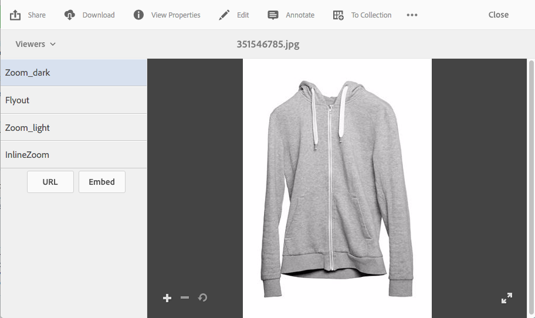

# Dynamic Media-viewervoorinstellingen toepassen {#applying-viewer-presets}

Een voorinstelling voor de viewer is een verzameling instellingen die bepalen hoe gebruikers multimedia-elementen op hun computerschermen en mobiele apparaten weergeven. U kunt alle viewervoorinstellingen die door de beheerder zijn gemaakt, toepassen op een element.

Als u een beheerder bent en moet leiden, tot stand brengen, sorteren, en de kijker schrappen stelt vooraf in, zie [&#x200B; Kijker beheren vooraf instelt &#x200B;](managing-viewer-presets.md).

Zie ook [&#x200B; de Kijker van Publish stelt &#x200B;](managing-viewer-presets.md#publishing-viewer-presets) vooraf in.

U hoeft geen viewervoorinstellingen te publiceren, afhankelijk van de publicatiemodus die u gebruikt.
Om het even welke problemen met kijkervoorinstellingen, zie [&#x200B; Problemen met Dynamic Media oplossen - Scene7 &#x200B;](troubleshoot-dms7.md#viewers).

## Een Dynamic Media-viewervoorinstelling toepassen op een element {#applying-a-viewer-preset-to-an-asset}

1. Open het element en in de linkertrack en selecteer **[!UICONTROL Viewers]** .

   

   * De knoppen **[!UICONTROL URL]** en **[!UICONTROL Embed]** worden weergegeven nadat u een viewervoorinstelling hebt geselecteerd.
   * Het systeem bevat een groot aantal viewervoorinstellingen wanneer u Viewers selecteert in **[!UICONTROL Detail View]** van een asset. U kunt het aantal weergegeven voorinstellingen verhogen. Zie [&#x200B; Verhoog het aantal kijker vooraf instelt die &#x200B;](managing-viewer-presets.md) worden getoond.

1. Selecteer een viewer in het linkerdeelvenster, zodat u deze kunt toepassen op het element, zoals in het rechterdeelvenster. U kunt [&#x200B; URL ook kopiëren om &#x200B;](linking-urls-to-yourwebapplication.md) met anderen gebruikers te delen.

## URL&#39;s met voorinstellingen van viewer verkrijgen {#obtaining-viewer-preset-urls}

Om URLs voor Kijker te krijgen stelt vooraf in, zie [&#x200B; Verbinding URLs aan uw Webtoepassing &#x200B;](linking-urls-to-yourwebapplication.md).
