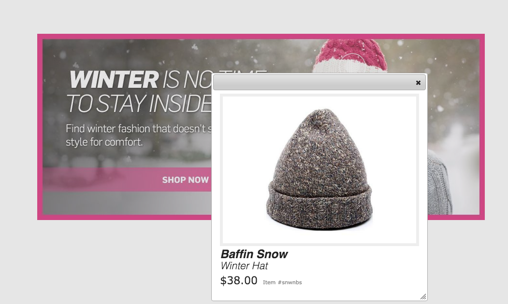
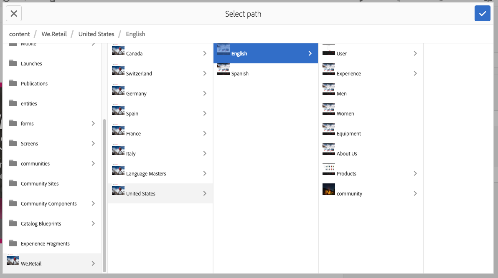

# Werken met kiezers {#working-with-selectors}

Wanneer u werkt met een interactieve afbeelding, interactieve video of carrouselbanner, selecteert u elementen en selecteert u sites en producten voor hotspots en afbeeldingen met hyperlinks waarnaar u wilt koppelen. Wanneer u werkt met Afbeeldingssets, Draaisets en Multimediasets, selecteert u ook elementen met de Asset Selector.

In dit onderwerp wordt beschreven hoe u de kiezers Product, Site en Asset kunt gebruiken, inclusief de mogelijkheid om te bladeren, te filteren en te sorteren binnen de kiezers.

U opent de kiezers door carrouselsets te maken, hotspots en afbeeldingen met hyperlinks toe te voegen en interactieve video&#39;s en afbeeldingen te maken.

In deze Carousel Banner gebruikt u bijvoorbeeld de productkiezer als u een hotspot of afbeelding met hyperlinks koppelt aan een Quickview-pagina. Gebruik de sitekiezer als u een hotspot of afbeelding met hyperlink koppelt. Gebruik de functie Asset Selector wanneer u een dia maakt.

Wanneer u selecteert (in plaats van handmatig in te voeren) waar hotspots of afbeeldingen met hyperlinks naartoe gaan, gebruikt u de kiezer. De Sitekiezer werkt alleen als u een Experience Manager Sites-klant bent. Voor de productkiezer is ook Experience Manager Commerce vereist.

## Productkiezer gebruiken {#selecting-products}

Gebruik de productkiezer om een product te kiezen wanneer u een hotspot of afbeelding met hyperlinks wilt gebruiken om een snelle weergave van een specifiek product in uw productcatalogus te maken.

1. Navigeer naar de carrouselset, de interactieve afbeelding of de interactieve video en selecteer het tabblad **[!UICONTROL Actions]** (alleen beschikbaar als u een hotspot of afbeelding met hyperlinks hebt gedefinieerd).

   De productkiezer bevindt zich in het gebied **[!UICONTROL Action Type]** .

   

1. Selecteer het pictogram **[!UICONTROL Product Selector]** (vergrootglas) en navigeer naar een product in de catalogus.

   

   Filter op trefwoord of tag door te tikken **[!UICONTROL Filter]** en trefwoorden in te voeren of tags te selecteren, of beide.

   

   Wijzig de locatie waar Experience Managers naar productgegevens bladeren door op **[!UICONTROL Browse]** te tikken en naar een andere map te navigeren.

   

   Selecteer **[!UICONTROL Sort]** door om te wijzigen of Experience Manager op nieuwste sorteert in oudste of oudste in nieuwste.

   

   Selecteer **[!UICONTROL View as]** om te wijzigen hoe producten worden weergegeven - **[!UICONTROL List View]** of **[!UICONTROL Card View]** .

   

1. Nadat het product is geselecteerd, worden in het veld de miniatuur en de naam van het product weergegeven.

   

1. In de modus **[!UICONTROL Preview]** kunt u de hotspot of de afbeelding met hyperlinks selecteren en zien hoe de Snelle weergave eruitziet.

   

## Site-kiezer gebruiken {#selecting-sites}

Gebruik de sitekiezer om een webpagina te kiezen als u een hotspot of afbeeldingskaart wilt koppelen aan een webpagina die wordt beheerd in Experience Manager Sites.

1. Navigeer naar de carrouselset, de interactieve afbeelding of de interactieve video en selecteer het tabblad **[!UICONTROL Actions]** (alleen beschikbaar als u een hotspot of afbeelding met hyperlinks hebt gedefinieerd).

   De sitekiezer bevindt zich in het gebied **[!UICONTROL Action Type]**.

   

1. Selecteer het pictogram **[!UICONTROL Site Selector]** (map met vergrootglas) en navigeer naar een pagina in uw Experience Manager Sites waarnaar u de hotspot of afbeelding met hyperlinks wilt koppelen.

   

1. Nadat de site is geselecteerd, wordt het pad in het veld weergegeven.

   

1. Als u in de modus **[!UICONTROL Preview]** de hotspot of de afbeelding met hyperlinks selecteert, navigeert u naar de door u opgegeven Experience Manager-sitepagina.

## Asset Selector gebruiken {#selecting-assets}

Gebruik deze kiezer om afbeeldingen te kiezen voor gebruik in een carrouselbanner, een interactieve video, afbeeldingssets, gemengde mediasets en centrifugesets. In interactieve video is de elementenkiezer beschikbaar wanneer u **[!UICONTROL Select Assets]** selecteert op het tabblad **[!UICONTROL Content]** . In Carousel-sets is de elementenkiezer beschikbaar wanneer u een dia maakt. In de Reeksen van het Beeld, Gemengde Plaatsen van Media, en de Reeksen van de Rotatie, is de activaselecteur beschikbaar wanneer u een Reeks van het Beeld, Gemengde Geplaatste Media, of Reeks van de Rotatie creeert.

Zie ook [&#128279;](search-assets.md#assetpicker) van de Plukker van 0&rbrace; Activa voor meer informatie.

1. Navigeer naar de Carousel-set en maak een dia. Of navigeer naar de interactieve video, ga naar het tabblad **[!UICONTROL Content]** en selecteer elementen. U kunt ook een gemengde mediaset, Afbeeldingsset of Spin-set maken.
1. Selecteer het pictogram **[!UICONTROL Asset Selector]** (map met vergrootglas) en navigeer naar een element.

   

   Filter op trefwoord of tag door te tikken **[!UICONTROL Filter]** en trefwoorden in te voeren of criteria toe te voegen, of beide.

   

   Wijzig de locatie waar Experience Managers naar elementen bladeren door naar een andere map in het veld **[!UICONTROL Path]** te navigeren.

   Selecteer **[!UICONTROL Collection]** om alleen te zoeken naar elementen in verzamelingen.

   

   Selecteer **[!UICONTROL View as]** om te wijzigen hoe producten worden weergegeven - **[!UICONTROL List View]** , **[!UICONTROL Column View]** of **[!UICONTROL Card View]** .

   

1. Selecteer het element door op het vinkje te tikken. Het element wordt weergegeven.

   
