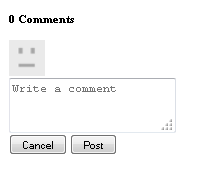

# Clientlibs {#add-clientlibs} toevoegen

## Een ClientLibraryFolder (clientlibs) {#add-a-clientlibraryfolder-clientlibs} toevoegen

Maak een ClientLibraryFolder met de naam `clientlibs` die de JS en CSS bevat die worden gebruikt om de pagina&#39;s van uw site weer te geven.

De waarde van de eigenschap `categories` die aan deze clientbibliotheek wordt gegeven, is de id die wordt gebruikt om deze client rechtstreeks vanaf een inhoudspagina op te nemen of om deze in andere clientlibs in te sluiten.

1. Met **CRXDE Lite** uitvouwen `/etc/designs`

1. Klik met de rechtermuisknop `an-scf-sandbox` en selecteer `Create Node`

   * Naam : `clientlibs`
   * Type : `cq:ClientLibraryFolder`

1. Klik **OK**


Voer op het tabblad **Eigenschappen** voor het nieuwe `clientlibs`-knooppunt de eigenschap **Categorieën** in:

* Naam: **categorieën**
* Type: **String**
* Waarde: **apps.an-scf-sandbox**
* Klik **Toevoegen**
* Klik **Alles opslaan**

Opmerking: De waarde voor categorieën wordt voorafgegaan door &#39;apps&#39;. is een conventie om aan te geven dat de &#39;toepassing die eigenaar is&#39; zich in de map /apps bevindt, niet /libs.  BELANGRIJK : Voeg placeholder `js.tx`t en **`css.txt`** dossiers toe. (Het is officieel geen cq:ClientLibraryFolder zonder hen.)

1. Klik met de rechtermuisknop **`/etc/designs/an-scf-sandbox/clientlibs`**
1. Selecteer **Bestand maken..**
1. Voer **Naam in:** `css.txt`
1. Selecteer **Bestand maken..**
1. Voer **Naam in:** `js.txt`
1. Klik **Alles opslaan**


De eerste regel van css.txt en js.txt identificeert de basislocatie van waaruit de volgende lijsten met bestanden moeten worden gevonden.

Stel de inhoud van css.txt in op

```
#base=.
 style.css
```

Maak vervolgens een bestand onder clientlibs met de naam style.css en stel de inhoud in op

`body {`

`background-color: #b0c4de;`

`}`

### SCF-clips {#embed-scf-clientlibs} insluiten

Op **Eigenschappen** lusje voor de `clientlibs` knoop, ga het multi-waardebezit van het Koord **embed** in. Dit sluit de noodzakelijke [cliënt-zijbibliotheken (clientlibs) voor SCF componenten](/help/communities/client-customize.md#clientlibs-for-scf) in. Voor deze zelfstudie worden veel clientlibs toegevoegd die nodig zijn voor de onderdelen Communities.

**** Merk op dat dit al dan niet de gewenste benadering voor een productiesite kan zijn aangezien er overwegingen van gemak tegenover grootte/snelheid van de clientlibs die voor elke pagina worden gedownload zijn.

Als u slechts één functie op één pagina gebruikt, kunt u de volledige clientlib van die functie rechtstreeks op de pagina opnemen, bijvoorbeeld:

`% ui:includeClientLib categories=cq.social.hbs.forum" %`

In dit geval, met inbegrip van hen allen en zo worden de meer basiscliënten SCF die de auteur clientlibs zijn verkiesd:

* Naam : **`embed`**
* Type: **`String`**
* Klik op **`Multi`**
* Waarde: **`cq.social.scf`**

   * Er wordt een dialoogvenster weergegeven,
Klik **`+`** na elke ingang om de volgende cliëntlib categorieën toe te voegen:

      * **`cq.ckeditor`**
      * **`cq.social.author.hbs.comments`**
      * **`cq.social.author.hbs.forum`**
      * **`cq.social.author.hbs.rating`**
      * **`cq.social.author.hbs.reviews`**
      * **`cq.social.author.hbs.voting`**
      * Klik **OK**

* Klik **Alles opslaan**


Op deze manier wordt `/etc/designs/an-scf-sandbox/clientlibs` nu weergegeven in de opslagplaats:


### Clientlibs opnemen in PlayPage-sjabloon {#include-clientlibs-in-playpage-template}

Zonder de categorie `apps.an-scf-sandbox` ClientLibraryFolder op de pagina te plaatsen, zijn de SCF-componenten niet functioneel en niet opgemaakt omdat de benodigde Javascript(s) en stijl(en) niet beschikbaar zijn.

Bijvoorbeeld, zonder de clientlibs op te nemen, lijkt de SCF commentaarcomponent ongestileerd:



Zodra apps.an-scf-sandbox clientlibs is opgenomen, wordt de stijl van de SCF-commentaarcomponent weergegeven:


De include-instructie behoort tot de sectie `head` van het `html`-script. De standaardwaarde **`foundation head.jsp`** bevat een script dat kan worden bedekt: **`headlibs.jsp`**.

**Kopieer koplibs.jsp en neem clientlibs op:**

1. Selecteer **CRXDE Lite****`/libs/foundation/components/page/headlibs.jsp`**

1. Klik met de rechtermuisknop en selecteer **Kopiëren** (of selecteer Kopiëren op de werkbalk)
1. Selecteer **`/apps/an-scf-sandbox/components/playpage`**
1. Klik met de rechtermuisknop en selecteer **Plakken** (of selecteer Plakken op de werkbalk)
1. Dubbelklik **`headlibs.jsp`** om deze te openen
1. De volgende regel toevoegen aan het einde van het bestand
   **`<ui:includeClientLib categories="apps.an-scf-sandbox"/>`**

1. Klik **Alles opslaan**

```xml
<%@ page session="false" %><%
%><%@include file="/libs/foundation/global.jsp" %><%
%><ui:includeClientLib categories="cq.foundation-main"/><%
%>
<cq:include script="/libs/cq/cloudserviceconfigs/components/servicelibs/servicelibs.jsp"/>
<% currentDesign.writeCssIncludes(pageContext); %>
<ui:includeClientLib categories="apps.an-scf-sandbox"/>
```

Laad uw website in de browser en controleer of de achtergrond geen blauwe tint heeft.

[https://localhost:4502/content/an-scf-sandbox/en/play.html](https://localhost:4502/content/an-scf-sandbox/en/play.html)


### Uw werk tot nu toe opslaan {#saving-your-work-so-far}

Op dit moment bestaat er een minimalistische sandbox en het is misschien de moeite waard om op te slaan als een pakket, zodat u tijdens het afspelen, als uw opslagplaats beschadigd raakt en u opnieuw wilt beginnen, uw server kunt uitschakelen, de naam van de map crx-quickstart/ wijzigen of verwijderen, uw server in kunt schakelen, uploaden en installeren van dit opgeslagen pakket, en deze basisstappen niet hoeft te herhalen.

Dit pakket bevindt zich op de zelfstudie [Een voorbeeldpagina maken](/help/communities/create-sample-page.md) voor diegenen die niet kunnen wachten om gewoon binnen te springen en af te spelen!..

Een pakket maken:

* Van CRXDE Lite klik [het pictogram van het Pakket](https://localhost:4502/crx/packmgr/)
* Klik **Pakket maken**

   * Pakketnaam: an-scf-sandbox-minimum-pkg
   * Versie: 0,1
   * Groeperen: `leave as default`
   * Klik **OK**

* Klik **Bewerken**

   * Tabblad **Filters** selecteren

      * Klik **Filter toevoegen**
      * Hoofdpad: bladeren naar `/apps/an-scf-sandbox`
      * Klik **Gereed**
      * Klik **Filter toevoegen**
      * Hoofdpad: bladeren naar `/etc/designs/an-scf-sandbox`
      * Klik **Gereed**
      * Klik **Filter toevoegen**
      * Hoofdpad: bladeren naar `/content/an-scf-sandbox**`
      * Klik **Gereed**
   * Klik **Opslaan**


* Klik **Build**

U kunt nu **Downloaden** selecteren om het op schijf en **Pakket uploaden** elders op te slaan en **Meer > Replicate** selecteren om de sandbox naar een publicatieinstantie van een lokale host te duwen om het domein van uw sandbox uit te breiden.