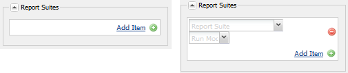
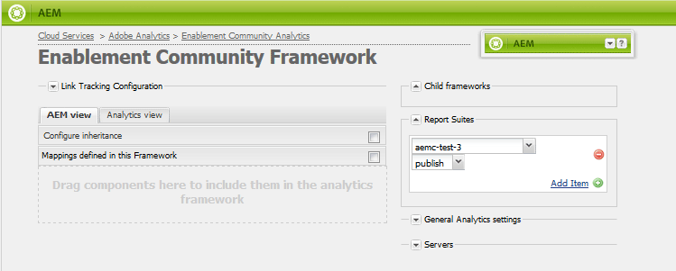

# Analytische configuratie voor functies {#analytics-configuration-for-communities-features}

## Overzicht {#overview}

Adobe Analytics en Adobe Experience Manager (AEM) zijn beide oplossingen van Adobe Marketing Cloud.

Adobe Analytics kan voor AEM Communities zodanig worden geconfigureerd dat, als lid communiceert met ondersteunde functies van de Gemeenschappen, gebeurtenissen worden verzonden naar Adobe Analytics waaruit rapporten worden gegenereerd.

Bijvoorbeeld, wanneer een lid van een enablement communautaire plaats een videobron bekijkt die aan hen wordt toegewezen, zal de middelspeler gebeurtenissen naar Analytics, met inbegrip van videohartslaggegevens verzenden. Van de communautaire plaats, kunnen de beheerders diverse rapporten zien betreffende het spelen van de video.

Daarnaast is een analyse nodig voor:

* In de publicatieomgeving:

   * Rapportage over community [trends](/help/communities/trends.md)
   * Toestaan dat sitebezoekers kunnen sorteren op &quot;meest bekeken&quot;, &quot;meest actief&quot;, &quot;meest geliefd&quot;
   * Tellingen van UGC-lijsten weergeven

* In de ontwerpomgeving:

   * Weergave van gegevens over deelname in de [ledenbeheerconsole](/help/communities/members.md) (weergaven, posten, volgen, zoals)
   * Trend summary, video hartslag en video device for enablement resource [reports](/help/communities/reports.md)

Tot de ondersteunde Gemeenschappen behoren:

* [Middelen inschakelen](/help/communities/resources.md)
* [Forum](/help/communities/forum.md)
* [QnA](/help/communities/working-with-qna.md)
* [Blog](/help/communities/blog-feature.md)
* [Bestandsbibliotheek](/help/communities/file-library.md)
* [Kalender](/help/communities/calendar.md)

In deze sectie van de documentatie wordt beschreven hoe u een serie Analytics-rapporten kunt koppelen aan de functies van Communities. De basisstappen zijn:

1. [Repliceer het crypto-](#replicate-the-crypto-key) sleutelwoord om ervoor te zorgen dat codering/decryptie op de juiste wijze in alle AEM voorkomen
1. Een Adobe Analytics [rapportsuite](#adobe-analytics-report-suite-for-video-reporting) voorbereiden
1. Maak een AEM Analytics [cloudservice](#aem-analytics-cloud-service-configuration) en [framework](#aem-analytics-framework-configuration)

1. [Analyses ](#enable-analytics-for-a-community-site) voor een communitysite inschakelen
1. [****](#verify-analytics-to-aem-variable-mapping) VerifyAnalytics aan AEM veranderlijke afbeelding
1. [primaire uitgever](#primary-publisher) identificeren
1. [Site van ](#publish-community-site-and-analytics-cloud-service) community publiceren
1. [importeren van rapportgegevens](#obtaining-reports-from-analytics) vanuit Adobe Analytics naar de communitysite configureren

## Vereisten {#prerequisites}

Om Analytics voor de eigenschappen van Gemeenschappen te vormen, is het noodzakelijk om met uw rekeningsvertegenwoordiger samen te werken om een Adobe Analytics rekening en [rapportreeks ](#adobe-analytics-report-suite-for-video-reporting) te installeren. Zodra dit is vastgesteld, moet de volgende informatie beschikbaar zijn:

* **Bedrijfsnaam**

   Het bedrijf dat is gekoppeld aan de Adobe Analytics-account.

* **Gebruikersnaam**

   De aanmeldingsgebruikersnaam voor de gebruiker die gemachtigd is om de account Analytics te beheren
(zou de voorrechten van de Toegang van de Dienst van het Web moeten omvatten).

* **Wachtwoord**

   Het aanmeldingswachtwoord voor de geautoriseerde gebruiker.

* **Analysecentrum**

   De URL van het datacenter Analytics voor de account.

* **Rapportsuite**

   De naam van de te gebruiken analytische rapportsuite.

## Adobe Analytics Report Suite for Video Reporting {#adobe-analytics-report-suite-for-video-reporting}

Met de [Report Suite Manager](https://docs.adobe.com/content/help/en/analytics/admin/manage-report-suites/new-report-suite/new-report-suite.html) van de Adobe Marketing Cloud kunnen de Analytics-rapportreeksen worden geconfigureerd, zodat een communitysite mogelijk rapporten kan leveren voor de functies van de Gemeenschappen.

Door u aan te melden bij [Adobe Experience Cloud](https://docs.adobe.com/content/help/en/analytics/analyze/analysis-workspace/home.html) met [Bedrijfsnaam en Gebruikersnaam](/help/communities/analytics.md#prerequisites), is het mogelijk om een nieuwe of bestaande rapportreeks te vormen om te hebben:

* [11 Conversievariabelen](https://docs.adobe.com/content/help/en/analytics/admin/admin-tools/conversion-variables/conversion-var-admin.html)  (eVars)

   * **`evar1`** via  **`evar11`** ingeschakeld

   * Kan bestaande eVars opnieuw gebruiken (naam wijzigen) of nieuwe sites maken voor gebruik door communautaire functies

* [7 Succesgebeurtenissen](https://docs.adobe.com/content/help/en/analytics/admin/admin-tools/success-events/success-event.html) (gebeurtenissen)

   * **`event1`** via  **`event7`** ingeschakeld

   * tekst **`Counter`**

      * not **`Counter (no subrelations)`**
   * Kan bestaande gebeurtenissen opnieuw gebruiken (naam wijzigen) of nieuwe gebeurtenissen maken die kunnen worden gebruikt voor communautaire functies


* [Videobeheer](https://docs.adobe.com/content/help/en/media-analytics/using/media-overview.html)

   * Video Reporting-console

      * `Video Core` inschakelen
      * Selecteer Opslaan
   * Video Core-meetconsole

      * Selecteer `Use Solution Variables`
      * Selecteer Opslaan


Als u een **new report suite** gebruikt, dient u er rekening mee te houden dat een nieuwe rapportsuite slechts 4 gebeurtenissen en 6 gebeurtenisvariabelen kan bevatten, terwijl 11 gebeurtenissen en 7 gebeurtenisvars vereist zijn voor de Gemeenschappen.

Als u een **bestaande rapportsuite** gebruikt, kan het nodig zijn om [de variabele mapping](#modifying-analytics-variable-mapping) te wijzigen voordat het Analytics-framework voor een communitysite wordt geactiveerd.

Neem contact op met uw accountvertegenwoordiger voor eventuele problemen met betrekking tot de variabelen die voor Gemeenschappen zijn bestemd.

>[!CAUTION]
>
>**Als u een bestaande rapportsuite gebruikt die al variabelen gebruikt binnen**
>
>* **`evar1`** doorheen  **`evar11`**
   >
   >
* **`event1`** doorheen  **`event7`**
>
>
**Voordat de communitysite wordt gepubliceerd, is** het belangrijk dat u de bestaande toewijzing herstelt door de AEM variabelen te verplaatsen die automatisch zijn toegewezen aan analytische variabelen wanneer Analytics is ingeschakeld voor een communitysite.
>
>Als u de bestaande toewijzing wilt herstellen en AEM variabelen wilt verplaatsen naar andere variabelen van Analytics, raadpleegt u de sectie over [Variabele voor analyse wijzigen](#modifying-analytics-variable-mapping).
>
>Als u dit niet doet, kan dit leiden tot onherstelbaar gegevensverlies.

### Video-hartslaganalyse {#video-heartbeat-analytics}

Als er een licentie is voor de functie Videohartslaganalyse, wordt een `Marketing Cloud Org Id` toegewezen.

Om Video toe te laten hartslagrapportering na [het vormen van de het rapportreeks van Analytics voor video rapportering](#adobe-analytics-report-suite-for-video-reporting):

* Een [Analytics Cloud Service](#aem-analytics-cloud-service-configuration) maken
* [Analyse inschakelen voor een communitysite](#enable-analytics-for-a-community-site)
* `Marketing Cloud Org Id` koppelen aan de communitysite

De `Marketing Cloud Org Id` kan worden ingegaan op het tijdstip van [het verwezenlijking van de communautaire plaats](/help/communities/sites-console.md#enablement) of later door [het wijzigen](/help/communities/sites-console.md#modifying-site-properties) de eigenschappen van de communautaire plaats. [](#aem-analytics-cloud-service-configuration)


Wanneer Video Heartbone Analytics wordt toegelaten, concretiseert de code JavaScript (JS) voor de videospeler de videohartslagbibliotheekcode (ook in JS) die al logica voor het verzenden van videostatusupdates naar de Analytics video volgende servers om de 10 seconden (niet configureerbaar) behandelt en uiteindelijk verzendt een cumulatief rapport van de videozitting naar de belangrijkste servers van Analytics.

Als deze optie niet is ingeschakeld, wordt de videohartslagcode nooit geïnstantieerd en wordt alleen de videovoortgang en het volgen van de hervattingspositie voortgezet in SRP voor rapportage.

## Configuratie van Analytics Cloud-service AEM {#aem-analytics-cloud-service-configuration}

Om een nieuwe Integratie van Analytics tot stand te brengen, die Adobe Analytics met de AEM communautaire plaats integreert, gebruikend standaard UI op de auteursinstantie:

* Vanuit globale navigatie: **[!UICONTROL Tools]** > **[!UICONTROL Deployment]** > **[!UICONTROL Cloud Services]**
* Omlaag schuiven naar **[!UICONTROL Adobe Analytics]**
* Selecteer **[!UICONTROL Configure Now]** of **[!UICONTROL Show Configurations]**


### Configuratiedialoogvenster maken {#create-configuration-dialog}

* Selecteer `[+]` pictogram naast **[!UICONTROL  Available Configurations]** om een nieuwe configuratie tot stand te brengen

In het dialoogvenster Configuratie maken identificeren de waarden die moeten worden ingevoerd de configuratie.


* **Titel**

   (Vereist) Een weergavetitel voor de configuratie.
Typ bijvoorbeeld *Community Analytics inschakelen*

* **Naam**

   (Optioneel) Indien niet opgegeven, wordt de naam standaard ingesteld op een geldige knooppuntnaam die is afgeleid van de titel.
U kunt bijvoorbeeld *gemeenschappen* invoeren

* **Sjabloonmodel**

   Selecteer `Adobe Analytics Configuration`

* Selecteer **Maken**

   * Hiermee wordt de configuratiepagina gestart en wordt het dialoogvenster `Analytics Settings` geopend

### Dialoogvenster Analyse-instellingen {#analytics-settings-dialog}

Het eerste ontwerp van een nieuwe analytische configuratie resulteert in de weergave van de configuratie en een nieuw dialoogvenster voor het invoeren van de Analytische instellingen. Voor dit dialoogvenster is de [vereiste accountinformatie](#prerequisites) van de accountvertegenwoordiger vereist.


* **Bedrijf**

   Het bedrijf dat is gekoppeld aan de Adobe Analytics-account.

* **Gebruikersnaam**

   De aanmeldingsgebruikersnaam voor de gebruiker die is geautoriseerd voor het beheer van de account Analytics.

* **Wachtwoord**

   Het aanmeldingswachtwoord voor de geautoriseerde gebruiker.

* **Datacenter**

   Selecteer het datacenter Analytics dat als host fungeert voor de rapportsuite.

* **Trackingtag niet toevoegen aan pagina**

   Standaard laten (uitgeschakeld).

* **AppMeasurement gebruiken**

   Standaard laten (uitgeschakeld).

* **Pagina-afbeeldingen niet elke avond importeren (auteur)**

   Standaard laten (uitgeschakeld).

* **Paginaafbeeldingen niet elke avond importeren (publiceren)**

   Standaard laten (uitgeschakeld).

De instellingen opslaan:

* Selecteer **Verbinding maken met Analytics**

   * Indien niet gelukt,

      * Verifieer de ingangen geen belangrijke ruimten bevatten.
      * Probeer een ander datacenter.

* Selecteer **OK**.

   

### Framework {#create-framework} maken

Nadat de basisverbinding met Adobe Analytics met succes is geconfigureerd, moet u een framework voor de communitysite maken of bewerken. Het doel van het kader is om de eigenschapvariabelen van de Gemeenschappen (AEM) aan (rapportreeks) variabelen Analytics in kaart te brengen.

* Selecteer `[+]` pictogram naast **[!UICONTROL  Available Frameworks]** om een nieuw kader tot stand te brengen

   

* **Titel**

   (Vereist) Een titel voor het weergeven van het framework
Typ bijvoorbeeld *Community Framework inschakelen*.

* **Naam**

   (Optioneel) Indien niet opgegeven, wordt de naam standaard ingesteld op een geldige knooppuntnaam die is afgeleid van de titel.
Typ bijvoorbeeld *community*.

* *Sjabloonmodel*

   Selecteer `Adobe Analytics Framework`.

* Selecteer **Maken**.

Het creëren van het Kader van Analytics opent het kader voor configuratie.

## Configuratie van AEM Analytics Framework {#aem-analytics-framework-configuration}

Het doel van het kader is AEM variabelen toe te wijzen aan analytische variabelen (eVars en events). De variabelen van Analytics beschikbaar voor afbeelding zijn [bepaald in de rapportreeks](#adobe-analytics-report-suite-for-video-reporting).


### Selecteer rapportsuite {#select-report-suite}

Selecteer de rapportsuite die is ingesteld voor videoverslag.

Zie de vorige sectie als er nog geen rapportsuite is gemaakt of niet juist is ingesteld:
[Adobe Analytics Report Suite for Video Reporting](#adobe-analytics-report-suite-for-video-reporting)

De Sidetrap is niet nodig en kan worden geminimaliseerd zodat het de toegang tot de montages van de Suites van het Rapport niet belemmert.

#### Dialoogvenster Suitten rapporteren vóór en na het selecteren van Item toevoegen {#report-suites-dialog-before-and-after-selecting-add-item}



1. Selecteer **Item toevoegen +**.

   Er worden twee vervolgkeuzelijsten weergegeven.

1. Kies een `Report suite.`

   De rapportsuites verbonden aan de rekening van het Bedrijf zijn beschikbaar voor selectie.

1. Selecteer **Ja** in het dialoogvenster dat wordt geopend:

   ```
   Load default server settings?
    Do you want to load the default server settings and overwrite current values in the Server section?
   ```

1. Kies een `Run Mode`.

1. Selecteer **Publiceren**.



De analytische cloudservice en het framework zijn nu voltooid. De toewijzingen worden gedefinieerd zodra een communitysite is gemaakt en deze Analytics-service is ingeschakeld.

## Analyses inschakelen voor een communautaire site {#enable-analytics-for-a-community-site}

### Inschakelen voor nieuwe communautaire site {#enable-for-new-community-site}

De cloudservice Analytics toevoegen terwijl [een nieuwe communitysite wordt gemaakt](/help/communities/sites-console.md):

* In stap 3, onder [ANALYTICS tab](/help/communities/sites-console.md#analytics):
   * Schakel het selectievakje **Analytics inschakelen** in.
   * Selecteer het framework in de keuzelijst.

* U kunt desgewenst terugkeren naar de configuratie van het analyseframework om de variabele toewijzingen aan te passen.

### Inschakelen voor bestaande communautaire site {#enable-for-existing-community-site}

De cloudservice Analytics toevoegen aan een [bestaande communitysite](/help/communities/sites-console.md#modifying-site-properties):

* Navigeer naar **Communities > Sites** console.
* Selecteer het pictogram Site bewerken van de communitysite.
* Selecteer de INSTELLINGEN.
* In de sectie Analytics:
   * Schakel het selectievakje **Analytics inschakelen** in.
   * Kies het framework in de keuzelijst.

* U kunt desgewenst terugkeren naar de configuratie van het analyseframework om de variabele toewijzingen aan te passen.

### Inschakelen voor aangepaste sites {#enable-for-customized-sites}

Voor het correct werken van Analytics het volgen en de invoer voor een communautaire plaats, moet een paginaelement met de `scf-js-site-title` klasse en href attributen aanwezig zijn. Slechts één dergelijk element zou op de pagina, zoals het in een ongewijzigd `sitepage.hbs` manuscript voor een communautaire plaats moeten bestaan. De waarde van `siteUrl` wordt geëxtraheerd en naar Adobe Analytics verzonden als het *sitepad*.

```xml
# present in default sitepage.hbs
# only one scf-js-site-title class should be included
# this example sets it to be hidden as it serves no visual purpose
<div
    class="navbar-brand scf-js-site-title"
    href="{{siteUrl}}.html"
    style="visibility: hidden;"
>
</div>
```

Voor een **aangepaste communitysite** die het `sitepage.hbs`-script bedekt, controleert u of het element aanwezig is. De variabele `siteUrl` wordt ingesteld wanneer deze op de server wordt gerenderd voordat de client wordt ingeschakeld.

Voor een **generische AEM site** die onderdelen van de Gemeenschappen bevat, maar die niet is gemaakt met de wizard [Site maken](/help/communities/sites-console.md), is het nodig om het element toe te voegen. De waarde van de href moet het pad naar de site zijn. Als het sitepad bijvoorbeeld `/content/my/company/en` is, gebruikt u:

```xml
<div
    class="navbar-brand scf-js-site-title"
    href="/content/my/company/en.html"
    style="visibility: hidden;"
>
</div>
```

## Analyses voor functies {#analytics-for-communities-features}

Analytics wordt automatisch gebruikt voor verschillende functies van de Gemeenschappen.

De [OSGi configuratie](/help/sites-deploying/configuring-osgi.md), `AEM Communities Analytics Component Configuration`, verstrekt een lijst van de componenten die van instrumenten voor Analytics zijn voorzien. De automatische toewijzing van variabelen wordt bepaald door de vermelde componenten.

Als nieuwe douanecomponenten worden gecreeerd die voor Analytics van instrumenten worden voorzien, zouden zij aan deze lijst van gevormde componenten moeten worden toegevoegd.

### Componentconfiguratie {#component-configuration}


>[!NOTE]
>
>De dagboekcomponenten worden gebruikt om de blogeigenschap uit te voeren.

### Analyses toegewezen aan AEM variabelen {#mapped-analytics-to-aem-variables}

Zodra de communautaire plaats met toegelaten Analytics en geselecteerd wolkenconfig kader wordt bewaard, zullen de AEM variabelen automatisch aan Analytics eVars en gebeurtenissen worden in kaart gebracht die met evar1 en event1, respectievelijk beginnen, en het verhogen met 1.

Als het gebruiken van een bestaande rapportreeks die om het even welke variabelen binnen evar1 tot evar11 en event1 door event7 in kaart bracht, zal het noodzakelijk zijn om [de AEM variabelen opnieuw in kaart te brengen ](#modifying-analytics-variable-mapping) en de originele afbeelding te herstellen.

Hier volgt een voorbeeld van standaardtoewijzingen na het volgen van de [Aan de slag-zelfstudie](/help/communities/getting-started-enablement.md):


#### Kaart van eVars verzonden met elke gebeurtenis {#map-of-evars-sent-with-each-event}

<table>
 <tbody>
  <tr>
   <td><strong> </strong></td>
   <td><strong>Enablement<br /> Resource<br /> Type</strong></td>
   <td><strong>Site<br /> Titel</strong></td>
   <td><strong>Functie<br /> Type</strong></td>
   <td><strong>Groep<br /> Titel</strong></td>
   <td><strong>Groep<br /> Pad</strong></td>
   <td><strong>UGC<br /> Type</strong></td>
   <td><strong>UGC<br /> Titel</strong></td>
   <td><strong>Gebruiker<br /> (lid)</strong></td>
   <td><strong>UGC<br /> Pad</strong></td>
   <td><strong>Site<br /> Pad</strong></td>
  </tr>
  <tr>
   <td><strong> </strong></td>
   <td><strong>eVar1</strong></td>
   <td><strong>eVar2</strong></td>
   <td><strong>eVar3</strong></td>
   <td><strong>eVar4</strong></td>
   <td><strong>eVar5</strong></td>
   <td><strong>eVar6</strong></td>
   <td><strong>eVar7</strong></td>
   <td><strong>eVar8</strong></td>
   <td><strong>eVar9</strong></td>
   <td><strong>eVar10</strong></td>
  </tr>
  <tr>
   <td><strong>event1<br /> Resource Play</strong></td>
   <td><em>(a)</em></td>
   <td><em>-</em></td>
   <td><em>-</em></td>
   <td><em>-</em></td>
   <td><em>-</em></td>
   <td><em>-</em></td>
   <td><em>-</em></td>
   <td><em>-</em></td>
   <td><em>i)</em></td>
   <td><em>-</em></td>
  </tr>
  <tr>
   <td><strong>event2<br /> SCFView</strong></td>
   <td><em>a)</em></td>
   <td><em>b)</em></td>
   <td><em>c)</em></td>
   <td><em>(d)</em></td>
   <td><em>e)</em></td>
   <td><em>(f)</em></td>
   <td><em>(g)</em></td>
   <td><em>(h)</em></td>
   <td><em>i)</em></td>
   <td><em>j)</em></td>
  </tr>
  <tr>
   <td><strong>event3<br /> SCFCreate (Post)</strong></td>
   <td><em>-</em></td>
   <td><em>b)</em></td>
   <td><em>c)</em></td>
   <td><em>d)</em></td>
   <td><em>e)</em></td>
   <td><em>f)</em></td>
   <td><em>g)</em></td>
   <td><em>h)</em></td>
   <td><em>i)</em></td>
   <td><em>j)</em></td>
  </tr>
  <tr>
   <td><strong>event4<br /> SCFFollow</strong></td>
   <td><em>-</em></td>
   <td><em>b)</em></td>
   <td><em>c)</em></td>
   <td><em>d)</em></td>
   <td><em>e)</em></td>
   <td><em>f)</em></td>
   <td><em>g)</em></td>
   <td><em>h)</em></td>
   <td><em>i)</em></td>
   <td><em>j)</em></td>
  </tr>
  <tr>
   <td><strong>event5<br /> SCFVoteUp</strong></td>
   <td><em>-</em></td>
   <td><em>b)</em></td>
   <td><em>c)</em></td>
   <td><em>d)</em></td>
   <td><em>e)</em></td>
   <td><em>f)</em></td>
   <td><em>g)</em></td>
   <td><em>h)</em></td>
   <td><em>i)</em></td>
   <td><em>j)</em></td>
  </tr>
  <tr>
   <td><strong>event6<br /> SCFVoteDown</strong></td>
   <td><em>-</em></td>
   <td><em>b)</em></td>
   <td><em>c)</em></td>
   <td><em>d)</em></td>
   <td><em>e)</em></td>
   <td><em>f)</em></td>
   <td><em>g)</em></td>
   <td><em>h)</em></td>
   <td><em>i)</em></td>
   <td><em>j)</em></td>
  </tr>
  <tr>
   <td><strong>event7<br /> SCFRate</strong></td>
   <td><em>-</em></td>
   <td><em>b)</em></td>
   <td><em>c)</em></td>
   <td><em>d)</em></td>
   <td><em>e)</em></td>
   <td><em>f)</em></td>
   <td><em>g)</em></td>
   <td><em>h)</em></td>
   <td><em>i)</em></td>
   <td><em>j)</em></td>
  </tr>
 </tbody>
</table>

**Voorbeelden van waarden voor eVar:**

* *[MIME-type](https://www.iana.org/assignments/media-types)*: video/mp4
* *[titel](/help/communities/sites-console.md#step13asitetemplate)* van gemeenschapssite: Geometrixx
* *[communautaire functienaam](/help/communities/functions.md)*: Forum
* *[groepsnaam](/help/communities/creating-groups.md#creating-a-new-group)* van de gemeenschap: Hiking
* *pad naar community group content*:  `/content/sites/<site name>/en/groups/hiking`
* *[Resourcetype](/help/communities/essentials.md)* UGC-component:  `social/forum/components/hbs/topic`
* *Titel* van UGC-component: Wikingonderwerpen
* *login (authorizableId)*:  `aaron.mcdonald@mailinator.com`
* *SRP-pad naar UGC*:  `/content/usergenerated/asi/.../forum/jmtz-topic3`
of 
*pad van te volgen* component:  `/content/sites/<site name>/en/jcr:content/content/primary/forum`

* *pad naar community-site-inhoud*:  `/content/sites/<site name>/en`

### Wijzigen van variabele-analysetoewijzing {#modifying-analytics-variable-mapping}

De toewijzing van Analytics Vars en events aan AEM variabelen is zichtbaar van de kaderconfiguratie nadat Analytics voor een communautaire plaats wordt toegelaten.

Nadat Analytics is toegelaten en alvorens de communautaire plaats wordt gepubliceerd, kan de afbeelding in het kader worden veranderd door de gewenste Analytics evar of de gebeurtenis van de linkerspoorstaaf te slepen en het neer te zetten in de relevante rij in de mappingstabel.

Als u dubbele toewijzingen wilt voorkomen, moet u de vervangen Analytics verwijderen uit de rij door de muis erboven te plaatsen en de X te selecteren die rechts van het variabele-element Analytics wordt weergegeven.

Als Communities Vars en events toewijzingen overschrijven die al in de rapportsuite bestonden, dan om gegevensverlies te voorkomen, wijst u de AEM variabelen voor Gemeenschapsfuncties toe aan andere Analytics Vars of -gebeurtenissen en herstelt u de oorspronkelijke toewijzingen.

>[!CAUTION]
>
>Het is belangrijk om opnieuw toe te wijzen alvorens de communautaire plaats [published](#publishing-the-community-site) met toegelaten Analytics is, anders is er risico van gegevensverlies.

#### Voorbeeld, stap 1: Analytics evar14 naar toewijzingstabel {#example-step-dragging-analytics-evar-into-mapping-table} slepen


#### Voorbeeld stap 2: &#39;x&#39; selecteren om vervangen evar11 {#example-step-selecting-x-to-remove-replaced-evar} te verwijderen


#### Voorbeeld stap 3: AEM var eventData.siteId opnieuw toegewezen aan Analytics evar14 {#example-step-aem-var-eventdata-siteid-remapped-to-analytics-evar}


## De communautaire site {#publishing-the-community-site} publiceren

### Analyses verifiëren om variabele-toewijzing {#verify-analytics-to-aem-variable-mapping} te AEM

Het is verstandig om de variabeletoewijzing te controleren voordat de communitysite wordt gepubliceerd, die ook de cloudservice en het framework Analytics publiceert.

Zie secties:

* [Analyses toegewezen aan AEM variabelen](#mapped-analytics-to-aem-variables)
* [Variabele-toewijzing Analytics wijzigen](#modifying-analytics-variable-mapping)

>[!CAUTION]
>
>**Als u een bestaande rapportsuite gebruikt die al variabelen gebruikt binnen**
>
>* **`evar1`** doorheen  **`evar11`**
   >
   >
* **`event1`** doorheen  **`event7`**
>
>
**Voordat de site van de community wordt gepubliceerd, is** het belangrijk dat de bestaande toewijzing wordt hersteld en dat de variabelen van de Gemeenschappen AEM die automatisch zijn toegewezen (wanneer Analytics is ingeschakeld voor de site van de community), worden verplaatst naar andere variabelen van Analytics. Deze nieuwe toewijzing moet voor alle onderdelen van de Gemeenschappen consistent zijn.
>
>Als u dit niet doet, kan dit leiden tot onherstelbaar gegevensverlies.

### Primaire uitgever {#primary-publisher}

Wanneer de gekozen implementatie een [publicatiecentrum](/help/communities/topologies.md#tarmk-publish-farm) is, moet één AEM publicatieexemplaar worden geïdentificeerd als de primaire uitgever voor opiniepeiling van Adobe Analytics voor rapportgegevens om aan [SRP](/help/communities/working-with-srp.md) te schrijven.

Door gebrek, identificeert de `AEM Communities Publisher Configuration` configuratie OSGi zijn publicatieinstantie als primaire uitgever, dusdanig dat alle publiceer instanties in een publicatielandbouwbedrijf zich als primair zou identificeren.

Daarom is het noodzakelijk om de configuratie op alle secundaire publicatieinstanties uit te geven om **Primaire Uitgever** controledoos te schrappen.

Voor specifieke instructies, zie de primaire uitgeverssectie van [Het Opstellen van Gemeenschappen](/help/communities/deploy-communities.md#primary-publisher).

>[!CAUTION]
>
>Het is belangrijk dat de primaire uitgever wordt gevormd om het opiniepeilen van veelvoudige publicatieinstanties te verhinderen.

### Repliceer de Crypto Sleutel {#replicate-the-crypto-key}

De Adobe Analytics-referenties worden versleuteld. Om het repliceren of verzenden van gecodeerde analysegegevens tussen auteur en uitgever te vergemakkelijken, moeten alle AEM instanties dezelfde primaire coderingssleutel delen.

Hiervoor volgt u de instructies op [Crypto Key](/help/communities/deploy-communities.md#replicate-the-crypto-key) repliceren.

### Community Site en Analytics Cloud Service {#publish-community-site-and-analytics-cloud-service} publiceren

Zodra de Analytics-cloudservice is ingeschakeld voor een communitysite en, indien nodig, de [mapping van Analytics naar AEM variabelen is aangepast](#mapped-analytics-to-aem-variables), is het nodig om de configuratie te repliceren naar de publicatieomgeving door [(re)publishing van de communitysite](/help/communities/sites-console.md#publishing-the-site).

## Rapporten verkrijgen van Analytics {#obtaining-reports-from-analytics}

### Rapportbeheer {#report-management}

De auteur en primaire uitgever [OSGi configuratie](/help/sites-deploying/configuring-osgi.md), `AEM Communities Analytics Report Management`, wordt gebruikt om Analytics te vragen.

Bij de auteur zijn de vragen bestemd voor real-time rapporten.

Voor de primaire uitgever, worden de vragen gebruikt om informatie ter voorbereiding van de de gegevensinvoer van de Importeur van het Rapport Analytische te verstrekken.

Het vraaginterval blijft aan 10 seconden in gebreke.

### Rapportimportmodule {#report-importer}

Zodra een Analytics toegelaten communautaire plaats is gepubliceerd, kunnen de primaire uitgever [OSGi configuratie](/help/sites-deploying/configuring-osgi.md), `AEM Communities Analytics Report Importer`, worden gevormd om het standaardopiniepeilingsinterval voor die configuraties te plaatsen die niet individueel in CRXDE worden gevormd.

Het opiniepeilingsinterval bepaalt de frequentie van aanvragen aan Adobe Analytics voor gegevens die moeten worden opgehaald en opgeslagen in [SRP](/help/communities/working-with-srp.md).

Wanneer de gegevens als &quot;grote gegevens&quot; kunnen worden gecategoriseerd, kan een frequentere opiniepeiling een grote belasting op de plaats van de gemeenschap veroorzaken.

De standaardpolling **het interval van de Invoer** wordt geplaatst aan 12 uren.


### Componentrapport aanpassen {#component-report-customization}

Momenteel, om de metriek aan spoor aan te passen, worden de knopen gecreeerd in de bewaarplaats die tijdsperioden bepalen waarvoor om een rapport over dat metrisch te produceren.

Het forumonderwerp is momenteel het enige voorbeeld van deze aanpassing:

* Meld u aan bij de primaire uitgever met beheerdersrechten.
* Navigeer naar [CRXDE Lite](/help/sites-developing/developing-with-crxde-lite.md). Bijvoorbeeld [https://localhost:4503/crx/de](https://localhost:4503/crx/de).

* Onder het jcr:content-knooppunt van de taalhoofdmap (bijvoorbeeld `/content/sites/engage/en/jcr:content),`navigeer naar de component die is geconfigureerd voor Analytics-rapportage.
Bijvoorbeeld, **`analytics/reportConfigs/social_forum_components_hbs_topic`**

* Let op de gemaakte tijdsperiodes:

   * `last30Days`
   * `last90Days`
   * `thisYear`

* Let op het `total`knooppunt.

   * Het wijzigen van **`interval`** bezit treedt het interval van de Importeur van het Rapport met voeten.
   * De waarde is in seconden en wordt ingesteld op 4 uur (14400 seconden).


## Gebruikersgegevens beheren in Analytics {#manage-user-data-in-analytics}

Adobe Analytics biedt API&#39;s waarmee u gebruikersgegevens kunt openen, exporteren en verwijderen. Zie [Toegang verzenden en Verzoeken verwijderen](https://docs.adobe.com/content/help/en/analytics/admin/data-governance/gdpr-submit-access-delete.html) voor meer informatie.

## Bronnen {#resources}

* Adobe Experience Cloud: [Analytische Help en referentie](https://docs.adobe.com/content/help/en/analytics/landing/home.html)
* AEM: [Integratie met Adobe Analytics](/help/sites-administering/adobeanalytics.md)
* AEM: [Analyse met externe providers](/help/sites-administering/external-providers.md)
