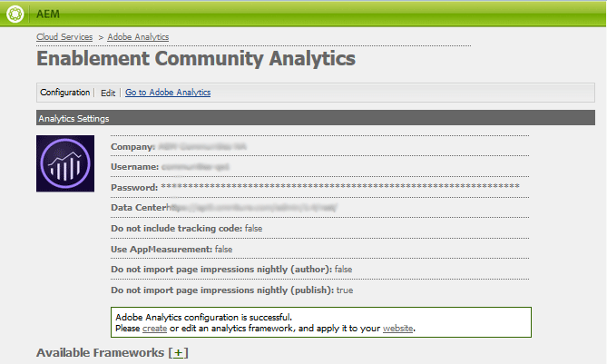

# Analytische configuratie voor functies van Gemeenschappen {#analytics-configuration-for-communities-features}

## Overzicht {#overview}

Adobe Analytics en Adobe Experience Manager (AEM) zijn beide oplossingen van Adobe Experience Cloud.

Adobe Analytics kan voor AEM Communities zodanig worden geconfigureerd dat, als lid communiceert met ondersteunde functies van de Gemeenschappen, gebeurtenissen worden verzonden naar Adobe Analytics waaruit rapporten worden gegenereerd.

Bijvoorbeeld, van de communautaire plaats, kunnen de beheerders diverse rapporten zien betreffende het spelen van de video.

Daarnaast is een analyse nodig voor:

* In de publicatieomgeving:

   * Rapportage over de gemeenschap [trends](/help/communities/trends.md)
   * Toestaan dat sitebezoekers kunnen sorteren op &quot;meest bekeken&quot;, &quot;meest actief&quot;, &quot;meest geliefd&quot;
   * De tellingen van de mening op (Gebruiker-Gegenereerde Inhoud) lijsten UGC

* In de ontwerpomgeving:

   * Weergave van deelnemingsgegevens in de [beheerconsole voor leden](/help/communities/members.md) (weergaven, berichten, volgen, zoals)
   * Trend summary, video hartslag en video device for enablement resource [rapporten](/help/communities/reports.md)

Tot de ondersteunde Gemeenschappen behoren:

* [Forum](/help/communities/forum.md)
* [QnA](/help/communities/working-with-qna.md)
* [Blog](/help/communities/blog-feature.md)
* [Bestandsbibliotheek](/help/communities/file-library.md)
* [Kalender](/help/communities/calendar.md)

In deze sectie van de documentatie wordt beschreven hoe u een serie Analytics-rapporten kunt koppelen aan de functies van Communities. De basisstappen zijn:

1. [De cryptotoets dupliceren](#replicate-the-crypto-key) zodat u ervoor kunt zorgen dat encryptie/decryptie correct op alle AEM instanties voorkomt
1. Een Adobe Analytics voorbereiden [rapportsuite](#adobe-analytics-report-suite-for-video-reporting)
1. Een AEM-analyse maken [Cloud-service](#aem-analytics-cloud-service-configuration) en [kader](#aem-analytics-framework-configuration)

1. [Analyse inschakelen](#enable-analytics-for-a-community-site) voor een community-site
1. [**Verifiëren**](#verify-analytics-to-aem-variable-mapping) Analyse naar AEM variabele toewijzing
1. Identificeren [primaire uitgever](#primary-publisher)
1. [Publiceren](#publish-community-site-and-analytics-cloud-service) de site van de gemeenschap
1. Configureren [invoer van rapportgegevens](#obtaining-reports-from-analytics) van Adobe Analytics naar de communitysite

## Vereisten {#prerequisites}

Als u Analytics voor Community-functies wilt configureren, moet u samenwerken met uw accountvertegenwoordiger om een Adobe Analytics-account in te stellen en [rapportsuite](#adobe-analytics-report-suite-for-video-reporting). Zodra dit is vastgesteld, moet de volgende informatie beschikbaar zijn:

* **Bedrijfsnaam**

  Het bedrijf dat is gekoppeld aan de Adobe Analytics-account.

* **Gebruikersnaam**

  De login gebruikersnaam voor de gebruiker die wordt gemachtigd om de rekening van Analytics te beheren (zou de voorrechten van de Toegang van de Dienst van het Web moeten omvatten).

* **Wachtwoord**

  Het aanmeldingswachtwoord voor de geautoriseerde gebruiker.

* **Analysecentrum**

  De URL van het datacenter Analytics voor de account.

* **Rapportsuite**

  De naam van de te gebruiken analytische rapportsuite.

## Adobe Analytics Report Suite for Video Reporting {#adobe-analytics-report-suite-for-video-reporting}

De Adobe Experience Cloud gebruiken [Report Suite Manager](https://experienceleague.adobe.com/docs/analytics/admin/admin-tools/manage-report-suites/c-new-report-suite/new-report-suite.html)kunnen analytische rapportreeksen zodanig worden geconfigureerd dat een communitysite rapporten kan leveren voor de functies van Gemeenschappen.

Door u aan te melden [Adobe Experience Cloud](https://experienceleague.adobe.com/docs/analytics/analyze/analysis-workspace/home.html) with [Bedrijfsnaam en gebruikersnaam](/help/communities/analytics.md#prerequisites), is het mogelijk om een nieuwe of bestaande rapportreeks te vormen om te hebben:

* [11 Conversievariabelen](https://experienceleague.adobe.com/docs/analytics/admin/admin-tools/manage-report-suites/edit-report-suite/conversion-variables/conversion-var-admin.html) (eVars)

   * **`evar1`** doorheen **`evar11`** enabled

   * Kan bestaande eVars opnieuw gebruiken (naam wijzigen) of bestaande eVars maken voor gebruik door communautaire functies

* [7 Succesgebeurtenissen](https://experienceleague.adobe.com/docs/analytics/admin/admin-tools/manage-report-suites/edit-report-suite/conversion-variables/success-events/success-event.html) (gebeurtenissen)

   * **`event1`** doorheen **`event7`** enabled

   * type **`Counter`**

      * niet **`Counter (no subrelations)`**

   * Kan bestaande gebeurtenissen opnieuw gebruiken (naam wijzigen) of gebeurtenissen maken die kunnen worden gebruikt voor communautaire functies

* [Videobeheer](https://experienceleague.adobe.com/docs/media-analytics/using/media-overview.html)

   * Video Reporting-console

      * Inschakelen `Video Core`
      * Selecteer Opslaan

   * Video Core-meetconsole

      * Selecteren `Use Solution Variables`
      * Selecteer Opslaan

Als u een **nieuwe rapportsuite** Een nieuwe rapportsuite kan slechts 4 gebeurtenissen en 6 gebeurtenisvariabelen bevatten, terwijl 11 gebeurtenissen en 7 gebeurtenislisteners vereist zijn voor de Gemeenschappen.

Als u een **bestaande rapportsuite** kan het nodig zijn [de variabele-toewijzing wijzigen](#modifying-analytics-variable-mapping) voordat u het Analyseframework activeert voor een communitysite.

Neem contact op met uw accountvertegenwoordiger voor eventuele problemen met betrekking tot de variabelen die voor Gemeenschappen zijn bestemd.

>[!CAUTION]
>
>**Als u een bestaande rapportsuite gebruikt die al variabelen gebruikt binnen**
>
>* **`evar1`** doorheen **`evar11`**
>
>* **`event1`** doorheen **`event7`**
>
>**Voordat de site van de community wordt gepubliceerd,** Het is belangrijk om de reeds bestaande afbeelding te herstellen door de AEM variabelen te verplaatsen die automatisch aan de variabelen van de Analyse werden toegewezen toen Analytics voor een communautaire plaats werd toegelaten.
>
>Als u de bestaande toewijzing wilt herstellen en AEM variabelen wilt verplaatsen naar andere variabelen van Analytics, raadpleegt u de sectie over [Variabele-toewijzing Analytics wijzigen](#modifying-analytics-variable-mapping).
>
>Als u dit niet doet, kan dit leiden tot onherstelbaar gegevensverlies.

### Video-hartslaganalyse {#video-heartbeat-analytics}

Als er een licentie is voor Video Heartbone Analytics, kunt u een `Marketing Cloud Org Id` is toegewezen.

Video-hartslagrapportage inschakelen na [het vormen van de het rapportreeks van Analytics voor videorapportering](#adobe-analytics-report-suite-for-video-reporting):

* Een [Analytics Cloud-service](#aem-analytics-cloud-service-configuration)
* Inschakelen [Analyses voor een communitysite](#enable-analytics-for-a-community-site)
* Koppel de `Marketing Cloud Org Id` met de site van de gemeenschap

De `Marketing Cloud Org Id` kan worden ingevoerd op het tijdstip van [site maken](/help/communities/sites-console.md) of later [wijzigen](/help/communities/sites-console.md#modifying-site-properties) de eigenschappen van de site van de gemeenschap.


Wanneer Video Heartbone Analytics is ingeschakeld, wordt met de JavaScript-code (JS) voor de videospeler de videohartslagbibliotheekcode (ook in JS) geïnstantieerd. De code handelt alle logica voor het verzenden van videostatusupdates naar de analytische video het volgen servers om de 10 seconden (niet configureerbaar) af. Uiteindelijk wordt een cumulatief rapport van de videosessie naar de belangrijkste Analyseservers verzonden.

Als deze optie niet is ingeschakeld, wordt de videohartslagcode nooit geïnstantieerd en wordt alleen de videovoortgang en het volgen van de hervattingspositie voortgezet in SRP voor rapportage.

## Configuratie van Analytics Cloud-service AEM {#aem-analytics-cloud-service-configuration}

Om een Integratie van Analytics tot stand te brengen, die Adobe Analytics met de AEM communautaire plaats integreert, gebruikend standaard UI op de auteursinstantie:

* Vanuit globale navigatie: **[!UICONTROL Tools]** > **[!UICONTROL Deployment]** > **[!UICONTROL Cloud Services]**
* Omlaag schuiven naar **[!UICONTROL Adobe Analytics]**
* Selecteren **[!UICONTROL Configure Now]** of **[!UICONTROL Show Configurations]**


### Configuratiedialoogvenster maken {#create-configuration-dialog}

* Selecteren `[+]` pictogram naast **[!UICONTROL Available Configurations]** zodat kunt u een configuratie creëren.

In het dialoogvenster Configuratie maken identificeren de waarden die moeten worden ingevoerd de configuratie.


* **Titel**

  (Vereist) Een weergavetitel voor de configuratie.
Voer bijvoorbeeld *Community Analytics*

* **Naam**

  (Optioneel) Indien niet opgegeven, krijgt de naam standaard een geldige knooppuntnaam die is afgeleid van de titel.
Voer bijvoorbeeld *gemeenschappen*

* **Sjabloon**

  Selecteren `Adobe Analytics Configuration`

* Selecteren **Maken**

   * De configuratiepagina van lanceert en opent `Analytics Settings` dialoogvenster

### Dialoogvenster Analyse-instellingen {#analytics-settings-dialog}

Het eerste ontwerp van een nieuwe analytische configuratie resulteert in de weergave van de configuratie en een nieuw dialoogvenster voor het invoeren van de Analytische instellingen. Voor dit dialoogvenster is het [vereiste accountgegevens](#prerequisites) verkregen van de rekeningvertegenwoordiger.


* **Bedrijf**

  Het bedrijf dat is gekoppeld aan de Adobe Analytics-account.

* **Gebruikersnaam**

  De aanmeldingsgebruikersnaam voor de gebruiker die is geautoriseerd voor het beheer van de account Analytics.

* **Wachtwoord**

  Het aanmeldingswachtwoord voor de geautoriseerde gebruiker.

* **Datacenter**

  Selecteer het datacenter Analytics dat als host fungeert voor de rapportsuite.

* **Trackingtag niet toevoegen aan pagina**

  Standaard laten (uitgeschakeld).

* **AppMeasurement gebruiken**

  Standaard laten (uitgeschakeld).

* **Pagina-afbeeldingen niet elke avond importeren (auteur)**

  Standaard laten (uitgeschakeld).

* **Paginaafbeeldingen niet elke avond importeren (publiceren)**

  Standaard laten (uitgeschakeld).

De instellingen opslaan:

* Selecteren **Verbinding maken met Analytics**

   * Indien niet gelukt,

      * Controleer of vermeldingen geen spaties voor de regelafstand bevatten.
      * Probeer een ander datacenter.

* Selecteren **OK**.

  

### Framework maken {#create-framework}

Nadat de basisverbinding met Adobe Analytics met succes is geconfigureerd, moet u een framework voor de communitysite maken of bewerken. Het doel van het kader is om de eigenschapvariabelen van de Gemeenschappen (AEM) aan (rapportreeks) variabelen Analytics in kaart te brengen.

* Selecteren `[+]` pictogram naast **[!UICONTROL  Available Frameworks]** zodat u een framework kunt creëren.

  

* **Titel**

  (Vereist) Typ bijvoorbeeld een titel voor de weergave van het framework. *Communautair kader*.

* **Naam**

  (Optioneel) Indien niet opgegeven, krijgt de naam standaard een geldige knooppuntnaam die is afgeleid van de titel.
Voer bijvoorbeeld *gemeenschappen*.

* *Sjabloon*

  Selecteren `Adobe Analytics Framework`.

* Selecteren **Maken**.

Het creëren van het Kader van Analytics opent het kader voor configuratie.

## Configuratie van AEM Analytics Framework {#aem-analytics-framework-configuration}

Het doel van het kader is AEM variabelen toe te wijzen aan analytische variabelen (eVars en events). De beschikbare variabelen voor Analytics zijn: [gedefinieerd in de rapportsuite](#adobe-analytics-report-suite-for-video-reporting).


### Rapportsuite selecteren {#select-report-suite}

Selecteer de rapportsuite die is ingesteld voor videoverslag.

Zie de vorige sectie als er nog geen rapportsuite is gemaakt of niet juist is ingesteld:
[Adobe Analytics Report Suite for Video Reporting](#adobe-analytics-report-suite-for-video-reporting)

De Sidekick is niet nodig en kan worden geminimaliseerd zodat het de toegang tot de montages van de Suites van het Rapport niet belemmert.

#### Dialoogvenster Suitten rapporteren vóór en na het selecteren van Item toevoegen {#report-suites-dialog-before-and-after-selecting-add-item}


1. Selecteren **Item toevoegen +**.

   Er worden twee vervolgkeuzelijsten weergegeven.

1. Kies een `Report suite.`

   De rapportsuites verbonden aan de rekening van het Bedrijf zijn beschikbaar voor selectie.

1. Selecteren **Ja** in het dialoogvenster dat wordt geopend:

   ```
   Load default server settings?
    Do you want to load the default server settings and overwrite current values in the Server section?
   ```

1. Kies een `Run Mode`.

1. Selecteren **Publiceren**.


De analytische cloudservice en het framework zijn nu voltooid. De toewijzingen worden bepaald nadat een communautaire plaats met deze toegelaten dienst van Analytics wordt gecreeerd.

## Analyses inschakelen voor een Community-site {#enable-analytics-for-a-community-site}

### Inschakelen voor nieuwe Community-site {#enable-for-new-community-site}

Als u de Analytics Cloud-service wilt toevoegen terwijl [het creëren van een communautaire plaats](/help/communities/sites-console.md):

* In stap 3, onder de [TABBLAD ANALYTICA](/help/communities/sites-console.md#analytics):
   * Selecteer de **Analyse inschakelen** selectievakje.
   * Selecteer het framework in de keuzelijst.

* U kunt desgewenst terugkeren naar de configuratie van het analyseframework om de variabeletoewijzingen aan te passen.

### Inschakelen voor bestaande communautaire site {#enable-for-existing-community-site}

De Analytics Cloud-service toevoegen aan een [bestaande community-site](/help/communities/sites-console.md#modifying-site-properties):

* Ga naar de **Gemeenschappen > Sites** console.
* Selecteer het pictogram Site bewerken van de communitysite.
* Selecteer de instellingen.
* In de sectie Analytics:
   * Selecteer de **Analyse inschakelen** selectievakje.
   * Kies het framework in de keuzelijst.

* U kunt desgewenst terugkeren naar de configuratie van het analyseframework om de variabeletoewijzingen aan te passen.

### Inschakelen voor aangepaste sites {#enable-for-customized-sites}

Als u wilt dat Analytics bijhouden en importeren correct werken voor een communitysite, moet u een pagina-element gebruiken met de opdracht `scf-js-site-title` klasse- en href-kenmerken moeten aanwezig zijn. Er mag slechts één dergelijk element op de pagina voorkomen, zoals in een ongewijzigd `sitepage.hbs` script voor een communitysite. De waarde van `siteUrl` wordt geëxtraheerd en naar Adobe Analytics verzonden als de *sitepad*.

```xml
# present in default sitepage.hbs
# only one scf-js-site-title class should be included
# this example sets it to be hidden as it serves no visual purpose
<div
    class="navbar-brand scf-js-site-title"
    href="{{siteUrl}}.html"
    style="visibility: hidden;"
>
</div>
```

Voor een **aangepaste communitysite** die de `sitepage.hbs` script, zorg ervoor dat het element aanwezig is. De `siteUrl` De variabele wordt ingesteld wanneer deze op de server wordt gerenderd voordat de client wordt ingeschakeld.

Voor een **algemene AEM** die onderdelen van de Gemeenschappen omvat, maar niet is gemaakt met de [wizard voor het maken van sites](/help/communities/sites-console.md), moet het element worden toegevoegd. De waarde van de href moet het pad naar de site zijn. Als het sitepad bijvoorbeeld `/content/my/company/en`en vervolgens gebruiken:

```xml
<div
    class="navbar-brand scf-js-site-title"
    href="/content/my/company/en.html"
    style="visibility: hidden;"
>
</div>
```

## Analyses voor functies van Gemeenschappen {#analytics-for-communities-features}

Analytics wordt automatisch gebruikt voor verschillende functies van de Gemeenschappen.

De omgeving van de auteur [OSGi-configuratie](/help/sites-deploying/configuring-osgi.md), `AEM Communities Analytics Component Configuration`, bevat een lijst met de componenten die van instrumenten zijn voorzien voor Analytics. De automatische toewijzing van variabelen wordt bepaald door de vermelde componenten.

Als nieuwe douanecomponenten worden gecreeerd die voor Analytics van instrumenten worden voorzien, zouden zij aan deze lijst van gevormde componenten moeten worden toegevoegd.

### Componentconfiguratie {#component-configuration}


>[!NOTE]
>
>De dagboekcomponenten worden gebruikt om de blogeigenschap uit te voeren.

### Analyses toegewezen aan AEM variabelen {#mapped-analytics-to-aem-variables}

Nadat de communitysite is opgeslagen en Analytics is ingeschakeld en het Cloud config-framework is geselecteerd, worden de AEM variabelen automatisch toegewezen aan de Analytics Vars en -gebeurtenissen. Het begint met evar1 en event1, respectievelijk, en toename door 1.

Als het gebruiken van een bestaande rapportreeks die om het even welke variabelen binnen evar1 door evar11 en event1 door event7 in kaart bracht, wordt het noodzakelijk om [opnieuw toewijzen van de AEM variabelen](#modifying-analytics-variable-mapping) en herstelt u de oorspronkelijke toewijzing.

Hier volgt een voorbeeld van standaardtoewijzingen:


#### Kaart met eVars die met elke gebeurtenis worden verzonden {#map-of-evars-sent-with-each-event}

<table>
 <tbody>
  <tr>
   <td><strong> </strong></td>
   <td><strong>Enablement<br /> Bron<br /> Type</strong></td>
   <td><strong>Site<br /> Titel</strong></td>
   <td><strong>Functie<br /> Type</strong></td>
   <td><strong>Groep<br /> Titel</strong></td>
   <td><strong>Groep<br /> Pad</strong></td>
   <td><strong>UGC<br /> Type</strong></td>
   <td><strong>UGC<br /> Titel</strong></td>
   <td><strong>Gebruiker<br /> (Lid)</strong></td>
   <td><strong>UGC<br /> Pad</strong></td>
   <td><strong>Site<br /> Pad</strong></td>
  </tr>
  <tr>
   <td><strong> </strong></td>
   <td><strong>eVar1</strong></td>
   <td><strong>eVar2</strong></td>
   <td><strong>eVar3</strong></td>
   <td><strong>eVar4</strong></td>
   <td><strong>eVar5</strong></td>
   <td><strong>eVar6</strong></td>
   <td><strong>eVar7</strong></td>
   <td><strong>eVar8</strong></td>
   <td><strong>eVar9</strong></td>
   <td><strong>eVar10</strong></td>
  </tr>
  <tr>
   <td><strong>event1<br /> Resource Play</strong></td>
   <td><em>a)</em></td>
   <td><em>-</em></td>
   <td><em>-</em></td>
   <td><em>-</em></td>
   <td><em>-</em></td>
   <td><em>-</em></td>
   <td><em>-</em></td>
   <td><em>-</em></td>
   <td><em>i)</em></td>
   <td><em>-</em></td>
  </tr>
  <tr>
   <td><strong>event2<br /> SCFView</strong></td>
   <td><em>a)</em></td>
   <td><em>b)</em></td>
   <td><em>c)</em></td>
   <td><em>d)</em></td>
   <td><em>e)</em></td>
   <td><em>f)</em></td>
   <td><em>g)</em></td>
   <td><em>h)</em></td>
   <td><em>i)</em></td>
   <td><em>(j)</em></td>
  </tr>
  <tr>
   <td><strong>event3<br /> SCFCreate (Post)</strong></td>
   <td><em>-</em></td>
   <td><em>b)</em></td>
   <td><em>c)</em></td>
   <td><em>d)</em></td>
   <td><em>e)</em></td>
   <td><em>f)</em></td>
   <td><em>g)</em></td>
   <td><em>h)</em></td>
   <td><em>i)</em></td>
   <td><em>(j)</em></td>
  </tr>
  <tr>
   <td><strong>event4<br /> SCFFollow</strong></td>
   <td><em>-</em></td>
   <td><em>b)</em></td>
   <td><em>c)</em></td>
   <td><em>d)</em></td>
   <td><em>e)</em></td>
   <td><em>f)</em></td>
   <td><em>g)</em></td>
   <td><em>h)</em></td>
   <td><em>i)</em></td>
   <td><em>(j)</em></td>
  </tr>
  <tr>
   <td><strong>event5<br /> SCFVoteUp</strong></td>
   <td><em>-</em></td>
   <td><em>b)</em></td>
   <td><em>c)</em></td>
   <td><em>d)</em></td>
   <td><em>e)</em></td>
   <td><em>f)</em></td>
   <td><em>g)</em></td>
   <td><em>h)</em></td>
   <td><em>i)</em></td>
   <td><em>(j)</em></td>
  </tr>
  <tr>
   <td><strong>event6<br /> SCFVoteDown</strong></td>
   <td><em>-</em></td>
   <td><em>b)</em></td>
   <td><em>c)</em></td>
   <td><em>d)</em></td>
   <td><em>e)</em></td>
   <td><em>f)</em></td>
   <td><em>g)</em></td>
   <td><em>h)</em></td>
   <td><em>i)</em></td>
   <td><em>(j)</em></td>
  </tr>
  <tr>
   <td><strong>event7<br /> SCFRate</strong></td>
   <td><em>-</em></td>
   <td><em>b)</em></td>
   <td><em>c)</em></td>
   <td><em>d)</em></td>
   <td><em>e)</em></td>
   <td><em>f)</em></td>
   <td><em>g)</em></td>
   <td><em>h)</em></td>
   <td><em>i)</em></td>
   <td><em>(j)</em></td>
  </tr>
 </tbody>
</table>

**Voorbeelden van waarden voor eVar:**

* *[MIME-type](https://www.iana.org/assignments/media-types/media-types.xhtml)*: video/mp4
* *[community site title](/help/communities/sites-console.md#step13asitetemplate)* Geometrixx
* *[communautaire functienaam](/help/communities/functions.md)*: Forum
* *[groepsnaam van de gemeenschap](/help/communities/creating-groups.md#creating-a-new-group)*: Hiking
* *pad naar inhoud van groep met gemeenschappen*: `/content/sites/<site name>/en/groups/hiking`
* *[Resourcetype van UGC-component](/help/communities/essentials.md)*: `social/forum/components/hbs/topic`
* *Titel van UGC-component*: wandelende onderwerpen
* *login (authorizableId)*: `aaron.mcdonald@mailinator.com`
* *SRP-pad naar UGC*: `/content/usergenerated/asi/.../forum/jmtz-topic3`
of *pad van te volgen component*: `/content/sites/<site name>/en/jcr:content/content/primary/forum`

* *pad naar community-site-inhoud*: `/content/sites/<site name>/en`

### Variabele-toewijzing Analytics wijzigen {#modifying-analytics-variable-mapping}

De toewijzing van Analytics Vars en events aan AEM variabelen is zichtbaar van de kaderconfiguratie nadat Analytics voor een communautaire plaats wordt toegelaten.

Nadat Analytics is ingeschakeld en voordat de site van de community wordt gepubliceerd, kan de toewijzing in het framework worden gewijzigd. U sleept de gewenste Analytics-gebeurtenis of -gebeurtenis gewoon van het linkerspoor naar de desbetreffende rij in de toewijzingstabel.

Als u dubbele toewijzingen wilt voorkomen, moet u de vervangen Analytics verwijderen uit de rij door de muis erboven te plaatsen en de X te selecteren die rechts van het variabele-element Analytics wordt weergegeven.

Als Communities Vars en events toewijzingen overschrijven die al in de rapportsuite bestonden, dan om gegevensverlies te voorkomen, wijst u de AEM variabelen voor Gemeenschapsfuncties toe aan andere Analytics Vars of -gebeurtenissen en herstelt u de oorspronkelijke toewijzingen.

>[!CAUTION]
>
>Het is belangrijk om opnieuw toe te wijzen voordat de site van de community [gepubliceerd](#publishing-the-community-site) Als Analytics is ingeschakeld, is er anders een risico op gegevensverlies.

#### Voorbeeldstap 1: Analytics evar14 naar toewijzingstabel slepen {#example-step-dragging-analytics-evar-into-mapping-table}


#### Voorbeeld van stap 2: het selecteren van &#39;x&#39; om vervangen evar11 te verwijderen {#example-step-selecting-x-to-remove-replaced-evar}


#### Voorbeeld stap 3: AEM var eventData.siteId opnieuw toegewezen aan Analytics evar14 {#example-step-aem-var-eventdata-siteid-remapped-to-analytics-evar}


## De website van de Gemeenschap publiceren {#publishing-the-community-site}

### Analyses controleren op AEM variabele toewijzing {#verify-analytics-to-aem-variable-mapping}

Het is verstandig om de variabeletoewijzing te controleren voordat de site van de gebruikersgemeenschap wordt gepubliceerd, die ook de Analytics Cloud-service en het-framework publiceert.

Zie secties:

* [Analyses toegewezen aan AEM variabelen](#mapped-analytics-to-aem-variables)
* [Variabele-toewijzing Analytics wijzigen](#modifying-analytics-variable-mapping)

>[!CAUTION]
>
>**Als u een bestaande rapportsuite gebruikt die al variabelen gebruikt binnen**
>
>* **`evar1`** doorheen **`evar11`**
>
>* **`event1`** doorheen **`event7`**
>
>**Voordat de site van de community wordt gepubliceerd,** de bestaande toewijzing herstellen. Verplaats Gemeenschappen AEM variabelen die automatisch werden toegewezen (toen Analytics voor de communautaire plaats werd toegelaten) aan andere variabelen van de Analyse. Deze hertoewijzing moet consistent zijn in alle onderdelen van de Gemeenschappen.
>
>Als u dit niet doet, kan dit leiden tot onherstelbaar gegevensverlies.

### Primaire uitgever {#primary-publisher}

Wanneer de gekozen implementatie een [publicatiebedrijf](/help/communities/topologies.md#tarmk-publish-farm), dan moet één AEM publicatieexemplaar als primaire uitgever voor het opiniepeilen Adobe Analytics voor rapportgegevens worden geïdentificeerd om te schrijven [SRP](/help/communities/working-with-srp.md).

Standaard worden de `AEM Communities Publisher Configuration` De configuratie OSGi identificeert zijn publicatiegeval als primaire uitgever, dusdanig dat alle publiceer instanties in een publicatielandbouwbedrijf zich als primair zou identificeren.

Daarom is het noodzakelijk om de configuratie op alle secundaire publicatieinstanties uit te geven om te schrappen **Primaire uitgever** selectievakje.

Voor specifieke instructies raadpleegt u de sectie primaire uitgever van [Gemeenschappen inzetten](/help/communities/deploy-communities.md#primary-publisher).

>[!CAUTION]
>
>Het is belangrijk dat de primaire uitgever wordt gevormd om het opiniepeilen van veelvoudige publicatieinstanties te verhinderen.

### De cryptosleutel dupliceren {#replicate-the-crypto-key}

De Adobe Analytics-referenties worden versleuteld. Om het repliceren of verzenden van gecodeerde analysegegevens tussen auteur en uitgever te vergemakkelijken, moeten alle AEM instanties dezelfde primaire coderingssleutel delen.

Volg hiervoor de instructies op [De cryptosleutel dupliceren](/help/communities/deploy-communities.md#replicate-the-crypto-key).

### Communitysite en Analytics Cloud-service publiceren {#publish-community-site-and-analytics-cloud-service}

Nadat de Analytics Cloud-service is ingeschakeld voor een communitysite en, indien nodig, de [toewijzing van analytische gegevens aan AEM variabelen wordt aangepast](#mapped-analytics-to-aem-variables), repliceer de configuratie aan het publicatiemilieu door [(re)publiceren van de communitysite](/help/communities/sites-console.md#publishing-the-site).

## Rapporten van Analytics verkrijgen {#obtaining-reports-from-analytics}

### Rapportbeheer {#report-management}

De auteur en de primaire uitgever [OSGi-configuratie](/help/sites-deploying/configuring-osgi.md), `AEM Communities Analytics Report Management`, wordt gebruikt om een query op Analytics uit te voeren.

Bij de auteur zijn de vragen voor real-time rapporten.

Voor de primaire uitgever, worden de vragen gebruikt om informatie ter voorbereiding van de de gegevensinvoer van de Importeur van het Rapport Analytische te verstrekken.

Het vraaginterval blijft aan 10 seconden in gebreke.

### Rapportimportmodule {#report-importer}

Nadat een voor Analytics geschikte communitysite is gepubliceerd, worden de primaire uitgevers [OSGi-configuratie](/help/sites-deploying/configuring-osgi.md), `AEM Communities Analytics Report Importer`, kan worden gevormd om het standaardopiniepeilingsinterval voor die configuraties te plaatsen die niet individueel in CRXDE worden gevormd.

Het opiniepeilingsinterval bepaalt de frequentie van aanvragen aan Adobe Analytics voor gegevens die moeten worden opgehaald en opgeslagen in [SRP](/help/communities/working-with-srp.md).

Wanneer de gegevens als &quot;grote gegevens&quot; kunnen worden gecategoriseerd, kan een frequentere opiniepeiling een grote belasting op de plaats van de gemeenschap veroorzaken.

De standaardopiniepeiling **Importinterval** wordt ingesteld op 12 uur.


### Componentrapport aanpassen {#component-report-customization}

Momenteel, om de metriek aan spoor aan te passen, worden de knopen gecreeerd in de bewaarplaats die tijdsperioden bepalen waarvoor om een rapport over dat metrisch te produceren.

Het forumonderwerp is momenteel het enige voorbeeld van deze aanpassing:

* Meld u aan bij de primaire uitgever met beheerdersrechten.
* Navigeren naar [CRXDE Lite](/help/sites-developing/developing-with-crxde-lite.md). Bijvoorbeeld: [https://localhost:4503/crx/de](https://localhost:4503/crx/de).

* Onder de `jcr:content` knooppunt van de hoofdtaal (bijvoorbeeld `/content/sites/engage/en/jcr:content`), navigeert u naar de component die is geconfigureerd voor analytische rapportage.
Bijvoorbeeld: **`analytics/reportConfigs/social_forum_components_hbs_topic`**

* Let op de gemaakte tijdsperiodes:

   * `last30Days`
   * `last90Days`
   * `thisYear`

* Let op: `total`knooppunt.

   * Het wijzigen van **`interval`** Het bezit treedt het interval van de Importeur van het Rapport met voeten.
   * De waarde is in seconden en wordt ingesteld op vier uur (14400 seconden).


## Gebruikersgegevens beheren in Analytics {#manage-user-data-in-analytics}

Adobe Analytics biedt API&#39;s waarmee u gebruikersgegevens kunt openen, exporteren en verwijderen. Zie voor meer informatie [Toegang verzenden en verzoeken verwijderen](https://experienceleague.adobe.com/docs/analytics/admin/admin-tools/data-governance/an-gdpr-workflow.html).

## Bronnen {#resources}

* Adobe Experience Cloud: [Help en naslaggids voor analysemogelijkheden](https://experienceleague.adobe.com/docs/analytics.html)
* AEM: [Integreren met Adobe Analytics](/help/sites-administering/adobeanalytics.md)
* AEM: [Analyse met externe providers](/help/sites-administering/external-providers.md)
