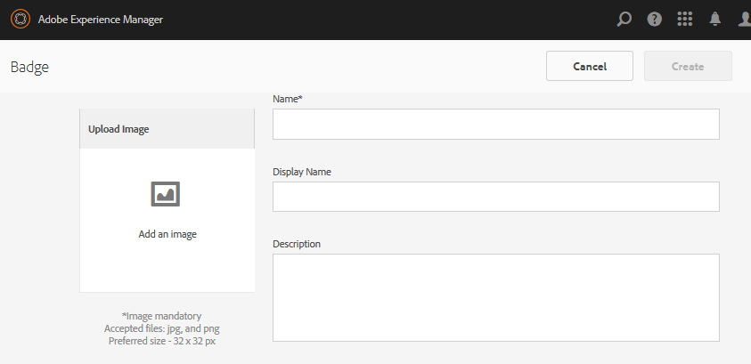

# Badges-console {#badges-console}

## Informatie over Badges {#about-badges}

De console van de Badges van de Gemeenschappen verstrekt de capaciteit om douanebadges toe te voegen die voor een lid kunnen worden getoond wanneer verdiend (toegekend) of wanneer zij een specifieke rol in de gemeenschap (toegewezen) nemen.

### Zichtbaarheid badge {#badge-visibility}

Badges die een lid van de gemeenschap verdient of toegewezen krijgt, worden samen met zijn naam en avatar op de volgende locaties weergegeven:

* Profielen
* [Forums](/help/communities/forum.md)
* [QnA](/help/communities/working-with-qna.md)
* [Leaderboards](/help/communities/enabling-leaderboard.md)
* [Ideatie](/help/communities/ideation-feature.md)

Navigeer in de ontwerpomgeving naar de Badges-console:

* Vanuit globale navigatie: **[!UICONTROL Tools]** > **[!UICONTROL Communities]** > **[!UICONTROL Badges]**

Op deze console worden de badges weergegeven die momenteel beschikbaar zijn en waaruit nieuwe badges kunnen worden toegevoegd.

## Badge {#create-badge} maken

Een badge wordt gemaakt door het uploaden van een voldoende kleine afbeelding (72 dpi met een hoogte tussen 26 en 32 pixels) en het opgeven van een naam. De badge-afbeelding wordt opgeslagen in de opslagplaats op `/libs/settings/community/badging/images` en wordt automatisch gerepliceerd naar de publicatieomgeving.

Als de publicatieomgeving een bedrijf van uitgevers is, is het nodig om [user sync](/help/communities/sync.md) te configureren.

* **Afbeelding uploaden**

   (*Required*) Een afbeelding met een badge met een aanbevolen grootte van 32 x 32 pixels bij 72 dpi in JPEG- of PNG-indeling.

* **Naam**

   (*Required*) De merknaam. Het is de standaard `Display Name` evenals de naam van de repository node. Als `Name` geen geldige naam voor een opslagplaats is, wordt deze gewijzigd.

* **Weergavenaam**

   (*Optioneel*) De naam die moet worden weergegeven voor de badge in de gebruikersinterface. Standaard is de ongewijzigde tekst die voor `Name` wordt ingevoerd.

* **Beschrijving**

   (*Optioneel*) Een beschrijving voor de badge.

## Aanvullende informatie {#additional-information}

Zie [Scores en Badges](/help/communities/implementing-scoring.md) voor meer informatie over het instellen van regels voor scoring en badging.

Zie [Ledenconsole](/help/communities/members.md) voor het beheren van badges voor leden.
