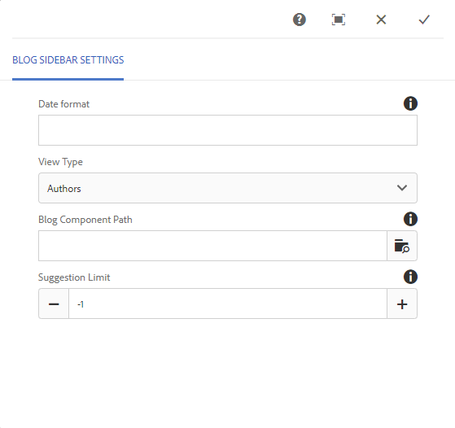

# Blogonderdeel {#blog-feature}

## Inleiding {#introduction}

De blogfunctie voor AEM Communities is veranderd van een ontwerpactiviteit in een echte gemeenschapsactiviteit die plaatsvindt in de Publish-omgeving.

De blogfunctie ondersteunt het verschaffen van gemeenschapsinformatie in een journalistieke indeling. Blogberichten worden in de Publish-omgeving gemaakt door geautoriseerde leden (geregistreerde, aangemelde gebruikers).

De blogfunctie biedt het volgende:

* Maken van blogartikelen en commentaar op Publish
* RTF-bewerking
* Inline-afbeeldingen (met ondersteuning voor slepen en neerzetten)
* Ingesloten sociale voorzien van een netwerkinhoud ([ bed steun ](/help/communities/blog-developer-basics.md#allowing-rich-media) in)
* Conceptmodus
* Gepland publiceren
* Samenstellen namens (a [ bevoorrecht lid ](/help/communities/users.md#privileged-members-group) kan inhoud namens een verschillend communautair lid tot stand brengen)
* [ In-context en bulkmoderatie ](/help/communities/moderate-ugc.md) van blogartikelen en commentaren

In dit gedeelte van de documentatie wordt het volgende beschreven:

* De blogfunctie toevoegen aan een AEM-site
* Configuratie-instellingen voor blogcomponenten

>[!NOTE]
>
>De componenten `Journal` en `Journal Sidebar` krijgen de naam `Blog` en `Blog Sidebar` .
>
>De blogfunctie in AEM 6.0 en eerdere versies wordt nu verwijderd. Het is gebaseerd op een sjabloon en auteurs mogen alleen inhoud maken in de auteursomgeving.

## Blogcomponenten toevoegen aan een pagina {#adding-blog-components-to-a-page}

Als u een blog wilt toevoegen aan een pagina in de ontwerpmodus, gebruikt u de componentbrowser om de blog te zoeken

* `Communities / Blog`
* `Communities / Blog Sidebar`

En sleep ze naar de juiste plaats op een pagina waarop de blog moet worden weergegeven.

Voor noodzakelijke informatie, bezoek {de Grondbeginselen van de Componenten van 0} Gemeenschappen ](/help/communities/basics.md).[

Wanneer de [ vereiste cliënt-zijbibliotheken ](/help/communities/blog-developer-basics.md#essentials-for-client-side) inbegrepen zijn, verschijnt de `Blog` component als volgt:

### Blog configureren {#configuring-blog}

Selecteer de geplaatste component `Blog` , zodat u het pictogram `Configure` kunt openen en selecteren waarmee het dialoogvenster Bewerken wordt geopend.

#### Het tabblad Instellingen {#settings-tab}

Onder het **lusje van Montages**, specificeer de basiseigenschappen van blog:

* **staat de Duimnagel van de Bijlage** toe

  Als deze optie is ingeschakeld, wordt een miniatuur van de bijgevoegde afbeelding gemaakt.

* **Max de Grootte van de Duimnagel van de Band**

  Maximale grootte (in pixels) van de miniatuurafbeelding van de bijlage. De standaardwaarde is 800 x 800.

* **Min de Grootte van het Beeld voor Duimnagel**

  Minimale afbeeldingsgrootte (in bytes) voor het genereren van miniaturen voor inline-afbeeldingen. De standaardwaarde is 100000 bytes (100 kB).

* **Max de Grootte van de Duimnagel**

  Maximale grootte (in pixels) van de miniatuurafbeelding voor inline-afbeelding. De standaardwaarde is 800 x 800.

* **staat Geprivilegieerde Leden** toe

  Als deze optie is ingeschakeld, mogen alleen leden met Geprivilegieerde inhoud maken.

* **Toegelaten Geprivilegieerde Leden**

  Voeg de geprivilegieerde leden toe die inhoud mogen maken.

* **Blok gebruiker-Gegenereerde Inhoud in Auteur geeft Wijze** uit

  Als deze optie is ingeschakeld, wordt door de gebruiker gegenereerde inhoud geblokkeerd tijdens het bewerken in de auteurmodus.

* **Titel van het Dagboek**

  De blogtitel die op de pagina moet worden weergegeven.

>[!NOTE]
>
>Met de functie Dagboek wordt automatisch een URL voor de blog gemaakt.
>
>Er worden maximaal 50 tekens (met 5 tekens extra voor uniciteit) gebruikt uit de dagboektitel die u hier opgeeft om een URL voor de blog te maken.

* **Beschrijving van het Dagboek**

  De blogbeschrijving.

* **Onderwerpen per Pagina**

  Hiermee definieert u het aantal blogberichten/opmerkingen dat per pagina wordt weergegeven. De standaardwaarde is 10.

* **Gematigd**

  Als deze optie is ingeschakeld, moet het plaatsen van blogberichten en opmerkingen worden goedgekeurd voordat ze op een gepubliceerde site worden weergegeven. De standaardinstelling is uitgeschakeld.

* **Gesloten**

  Als deze optie is ingeschakeld, wordt de blog afgesloten met nieuwe blogberichten en opmerkingen. De optie Standaard is uitgeschakeld.

* **Rich Text Editor**

  Als deze optie is ingeschakeld, kunnen blogberichten en opmerkingen worden ingevoerd met een markering. Standaard is ingeschakeld.

* **Toestaan Tags**

  Als gecontroleerd, sta leden toe om markeringsetiketten aan hun posten toe te voegen (zie {het gebied van de Markering **tabel).** De optie Standaard is uitgeschakeld.

* **staat Dossier toe uploadt**

  Als deze optie is ingeschakeld, staat u toe dat bestandsbijlagen worden toegevoegd aan een blogbericht of opmerking. De optie Standaard is uitgeschakeld.

* **Max de Grootte van het Dossier**

  Alleen relevant als `Allow File Uploads` is gecontroleerd. Dit veld beperkt de grootte (in bytes) van een geüpload bestand. De standaardwaarde is 104857600 (10 MB).

* **Toegestane Types van Dossier**

  Alleen relevant als `Allow File Uploads` is gecontroleerd. Een door komma&#39;s gescheiden lijst met bestandsextensies met het scheidingsteken &#39;punt&#39;. Bijvoorbeeld: .jpg, .jpeg, .png, .doc, .docx, .pdf. Als er bestandstypen zijn opgegeven, kunnen de bestandstypen die niet zijn opgegeven, niet worden geüpload. De standaardinstelling is niet opgegeven, zodat alle bestandstypen zijn toegestaan.

* **Max de Grootte van het Dossier van het Beeld van de Band**

  Alleen relevant als Uploaden van bestand toestaan is ingeschakeld. Het maximum aantal bytes dat een geüploade afbeeldingsbestand kan hebben. De standaardwaarde is 2097152 (2 MB).

* **sta Antwoorden** toe

  Als deze optie is ingeschakeld, kunt u reacties op opmerkingen op het blogbericht toestaan. De optie Standaard is uitgeschakeld.

* **Toestaan het Stemmen**

  Als deze optie is ingeschakeld, voegt u de functie Stemmen toe aan een blogbericht. De optie Standaard is uitgeschakeld.

* **staat Gebruikers toe om Commentaren en Onderwerpen te schrappen**

  Als deze optie is ingeschakeld, kunnen leden de opmerkingen en blogberichten verwijderen die ze hebben gepost. De optie Standaard is uitgeschakeld.

* **toestaat na**

  Als gecontroleerd, omvat de volgende eigenschap voor blogartikelen, die leden [ toestaat om ](/help/communities/notifications.md) van nieuwe posten op de hoogte worden gebracht. De optie Standaard is uitgeschakeld.

* **staat E-mailAbonnementen** toe

  Als gecontroleerd, sta leden toe om van nieuwe posten door e-mail ([ abonnement ](/help/communities/subscriptions.md)) op de hoogte te worden gebracht. Vereist `Allow Following` worden gecontroleerd en [ gevormde e-mail ](/help/communities/email.md). De optie Standaard is uitgeschakeld.

* **Badges van de Vertoning**

  Als gecontroleerd, vertoning verdiende en toegewezen [ badges ](/help/communities/implementing-scoring.md) met de blogingang van een lid. De optie Standaard is uitgeschakeld.

* **krijgt geen antwoorden op het vermelden van de Pagina**

* **sta Aanbevolen Inhoud** toe

  Als gecontroleerd, wordt het idee geïdentificeerd als [ gekenmerkte inhoud ](/help/communities/featured.md). De optie Standaard is uitgeschakeld.

* **laat Mentie** toe

  Als deze optie is ingeschakeld, kunnen geregistreerde gebruikers in de gemeenschap andere geregistreerde leden identificeren (met voornaam, achternaam, gebruikersnaam) en ze tags toewijzen met behulp van de algemene syntaxis voor @user-name. De gecodeerde gebruikers ontvangen meldingen over hun eigen aanhalingstekens.

* **Maximale Onthulpingen**

  Beperk het maximum aantal berichten dat in een bericht is toegestaan. De standaardwaarde is 10.

* **het Patroon van de Mentie UI**

  Geef de patroontekenreeks op die de geregistreerde gebruiker in een bericht mag labelen (@genoemd). Bijvoorbeeld `~{{familyName}}{{givenName}}` .

#### Tabblad Gebruikersmodernisering {#user-moderation-tab}

Onder het **lusje van de Moderatie van de Gebruiker**, specificeer de moderatie montages:

* **ontken Post**

  Indien deze optie is ingeschakeld, mogen de verantwoordelijken voor het lid die hun functie hebben erkend, posten ontkennen en voorkomen dat de functie op het openbare forum verschijnt. De optie Standaard is uitgeschakeld.

* **dicht/heropen Onderwerpen**

  Indien gecontroleerd, kunnen de vertrouwde op lidmoderatoren een onderwerp aan verdere uitgeeft en commentaren sluiten, en kunnen een onderwerp ook heropenen. De optie Standaard is uitgeschakeld.

* **Punten van de Vlag**

  Als deze optie is ingeschakeld, kunnen leden onderwerpen of opmerkingen van anderen als ongeschikt markeren. De optie Standaard is uitgeschakeld.

* **Lijst van de Reden van de Vlag**

  Als deze optie is ingeschakeld, kunnen leden in een vervolgkeuzelijst kiezen waarom een onderwerp of opmerking niet als ongepast wordt gemarkeerd. De optie Standaard is uitgeschakeld.

* **Reden van de Vlag van de Douane**

  Als deze optie is ingeschakeld, kunnen leden hun eigen reden opgeven om een onderwerp of opmerking als ongeschikt te bestempelen. De optie Standaard is uitgeschakeld.

* **Drempel van de Moderatie**

  Ga het aantal tijden in een onderwerp of een commentaar moet door leden worden gemarkeerd alvorens moderators worden meegedeeld. De standaardwaarde is 1 (één keer).

* **het Vlaggen Grens**

  Voer het aantal keren in dat een onderwerp of opmerking moet worden gemarkeerd voordat het wordt verborgen in de openbare weergave. Indien ingesteld op -1, wordt het gemarkeerde onderwerp of de opmerking nooit verborgen in de openbare weergave. Anders, moet dit aantal groter dan of gelijk aan de Drempel van de Moderatie zijn. De standaardwaarde is 5.

#### Tabblad Tagveld {#tag-field-tab}

Onder het **gebied van de Markering** lusje, specificeer welke markeringen kunnen worden toegepast als **het Etiketteren** wordt gecontroleerd op het **Montages** lusje:

* **Toegestane Namespaces**

  Relevant als `Allow Tagging` onder de **Montages** tabel wordt gecontroleerd. De tags die kunnen worden toegepast, zijn beperkt tot de tags binnen de naamruimtecategorieën die zijn gecontroleerd. De lijst met naamruimten bevat &quot;Standaardtags&quot; (de standaardnaamruimte) en &quot;Alle tags opnemen&quot;. De standaardwaarde is niet ingeschakeld, hetgeen betekent dat alle naamruimten zijn toegestaan.

* **de Grens van de Suggestie**

  Voer het aantal tags in dat moet worden weergegeven als suggestie aan het lid dat naar het forum post. De waarde -1 betekent geen limieten. De standaardwaarde is 0.

### Blogzijbalk configureren {#configuring-blog-sidebar}

Wanneer u dubbelklikt op de component `Blog Sidebar` , wordt een dialoogvenster voor bewerken geopend.

Onder het **lusje van de Montages van de Zijbalk van het Dagboek**, specificeer het datumformaat voor archieven en welk type van ingangen in sidebar te tonen:

* **formaat van de Datum**

  De indeling die wordt gebruikt om weer te geven voor archieven van blogberichten. Voor deze indeling worden plaatsaanduidingen gebruikt die voldoen aan de Java™-conventie.

   * jjjj : volledig jaar, zoals &#39;2015&#39;
   * yy : kort jaar, zoals &#39;15&#39;
   * MMMMM: volledige maand, zoals juni
   * MMM: korte maand, zoals jun
   * MM: maandnummer, bijvoorbeeld 06

  De standaardwaarde is &quot;jjjj MMMMM&quot;, die bijvoorbeeld &quot;2015 juni&quot; zou weergeven

* **Type van Mening**

  De titel en het type blogberichten die op de zijbalk moeten worden weergegeven. De keuze is tussen

   * Auteurs
   * Categorieën
   * Archieven

* **Weg van de Component van Blog**

  *(Facultatief)* De plaats van de blogmiddel waarvan blogartikelen moeten worden vermeld. Als deze parameter leeg wordt gelaten, wordt de component resourceType `social/journal/components/hbs/journal` gebruikt die op dezelfde pagina wordt weergegeven.

   * Bijvoorbeeld: `/content/sites/engage/en/blog/jcr:content/content/primary/blog`

* **de Grens van de Suggestie**

  Het aantal blogartikelen dat moet worden weergegeven. De waarde -1 betekent geen limiet. De standaardwaarde is -1.

## Ervaring met sitebezoekers {#site-visitor-experience}

In de publicatieomgeving wordt met de blogfunctie het meest recente blogartikel weergegeven, gevolgd door oudere blogartikelen in aflopende volgorde van ontwerp. Met blogzijbalken kunnen sitebezoekers filters toepassen om de selectie van weergegeven blogartikelen te beperken.

Het blogartikel wordt gevolgd door een koppeling om opmerkingen te plaatsen of weer te geven.

Wanneer een blogartikel is geselecteerd, worden het blogartikel en de opmerkingen weergegeven (indien ingeschakeld).

Andere vaardigheden hangen af van het feit of de bezoeker van de site een moderator, beheerder, lid van de gemeenschap, geprivilegieerd lid of anoniem is.

### Werken met artikelen {#working-with-articles}

Wanneer u een blogartikel maakt, kunt u het volgende doen:

1. Publish onmiddellijk
1. Publish a Draft
1. Publish op een geplande datum en tijd

De blogartikelen worden op het desbetreffende tabblad (Gepubliceerd, Concepten of Gepland) weergegeven voor leden die tijdens het publiceren kunnen ontwerpen.

#### Moderatoren en beheerders {#moderators-and-administrators}

Wanneer de ondertekende in gebruiker moderator of beheerdervoorrechten heeft, kunnen zij [ matigingstaken ](/help/communities/moderate-ugc.md) (zoals toegelaten door de configuratie van de component) op alle blogartikelen en commentaren uitvoeren die aan een blog worden gepost.

#### Leden {#members}

Wanneer de ondertekende in gebruiker een communautair lid of [ bevoorrecht lid ](/help/communities/users.md#privileged-members-group) (afhankelijk van configuratie) is, kunnen zij `New Article` selecteren om een nieuw blogartikel tot stand te brengen en te posten.

Zij kunnen met name:

* Blogartikelen maken
* Post: een nieuw blogartikel namens een ander lid
* Een opmerking naar een blogartikel Post
* Uw eigen blogartikel of commentaar bewerken
* Hun eigen blogartikel of commentaar verwijderen
* Blogartikelen of opmerkingen van anderen markeren

#### Anoniem {#anonymous}

Sitebezoekers die niet zijn aangemeld, kunnen alleen geposte blogartikelen en opmerkingen lezen, deze vertalen als ze worden ondersteund, maar mogen geen blogartikel of commentaar toevoegen en de artikelen of opmerkingen van anderen niet markeren.

## Aanvullende informatie {#additional-information}

Meer informatie kan op de [ pagina van de Hoofdzaak van Blog ](/help/communities/blog-developer-basics.md) voor ontwikkelaars worden gevonden.

Voor moderatie van blogingangen en commentaren, zie [ Modererend Gebruiker-Gegenereerde Inhoud ](/help/communities/moderate-ugc.md).

Voor het etiketteren van blogingangen en commentaren, zie [ Tags Gebruiker-Gegenereerde Inhoud ](/help/communities/tag-ugc.md).

Voor vertaling van blogingangen en commentaren, zie [ Vertaal Gebruiker-Gegenereerde Inhoud ](/help/communities/translate-ugc.md).
