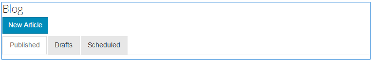

# Blogonderdeel {#blog-feature}

## Inleiding {#introduction}

De blogfunctie voor AEM Communities is veranderd van een ontwerpactiviteit in een echte gemeenschapsactiviteit die plaatsvindt in de publicatieomgeving.

De blogfunctie ondersteunt het verschaffen van gemeenschapsinformatie in een journalistieke indeling. Blogberichten worden in de publicatieomgeving gemaakt door geautoriseerde leden (geregistreerde, aangemelde gebruikers).

De blogfunctie biedt het volgende:

* Blogartikelen en opmerkingen maken
* RTF-bewerking
* Inline-afbeeldingen (met ondersteuning voor slepen en neerzetten)
* Inhoud ingesloten sociale netwerken ([Ondersteuning voor insluiten](/help/communities/blog-developer-basics.md#allowing-rich-media))
* Conceptmodus
* Gepland publiceren
* Samenstellen namens (a [bevoorrecht lid](/help/communities/users.md#privileged-members-group) kan inhoud maken namens een ander lid van de gemeenschap )
* [In de context en bulkmatiging](/help/communities/moderate-ugc.md) blogartikelen en commentaar

In dit gedeelte van de documentatie wordt het volgende beschreven:

* De blogfunctie toevoegen aan een AEM-site
* Configuratie-instellingen voor blogcomponenten

>[!NOTE]
>
>De componenten `Journal` en `Journal Sidebar` zijn genoemd `Blog` en `Blog Sidebar`.
>
>De blogfunctie in AEM 6.0 en eerdere versies wordt nu verwijderd. Het is gebaseerd op een sjabloon en auteurs mogen alleen inhoud maken in de auteursomgeving.

## Blogcomponenten toevoegen aan een pagina {#adding-blog-components-to-a-page}

Als u een blog wilt toevoegen aan een pagina in de ontwerpmodus, gebruikt u de componentbrowser om de blog te zoeken

* `Communities / Blog`
* `Communities / Blog Sidebar`

En sleep ze naar de juiste plaats op een pagina waarop de blog moet worden weergegeven.

Voor de nodige informatie gaat u naar [Grondbeginselen van Community-componenten](/help/communities/basics.md).

Wanneer de [vereiste clientbibliotheken](/help/communities/blog-developer-basics.md#essentials-for-client-side) worden opgenomen, `Blog` wordt als volgt weergegeven:

### Blog configureren {#configuring-blog}

Selecteer de geplaatste `Blog` zodat u toegang hebt tot `Configure` Het pictogram waarmee het dialoogvenster Bewerken wordt geopend.

#### Het tabblad Instellingen {#settings-tab}

Onder de **Instellingen** -tab, geeft u de basisfuncties van de blog op:

* **Miniatuur van bijlage toestaan**

  Als deze optie is ingeschakeld, wordt een miniatuur van de bijgevoegde afbeelding gemaakt.

* **Maximale grootte miniatuur bijvoegen**

  Maximale grootte (in pixels) van de miniatuurafbeelding van de bijlage. De standaardwaarde is 800 x 800.

* **Minimale afbeeldingsgrootte voor miniatuur**

  Minimale afbeeldingsgrootte (in bytes) voor het genereren van miniaturen voor inline-afbeeldingen. De standaardwaarde is 100000 bytes (100 kB).

* **Maximale miniatuurgrootte**

  Maximale grootte (in pixels) van de miniatuurafbeelding voor inline-afbeelding. De standaardwaarde is 800 x 800.

* **Geprivilegieerde leden toestaan**

  Als deze optie is ingeschakeld, mogen alleen leden met Geprivilegieerde inhoud maken.

* **Toegestane geprivilegieerde leden**

  Voeg de geprivilegieerde leden toe die inhoud mogen maken.

* **Door gebruiker gegenereerde inhoud blokkeren in de bewerkingsmodus van auteur**

  Als deze optie is ingeschakeld, wordt door de gebruiker gegenereerde inhoud geblokkeerd tijdens het bewerken in de auteurmodus.

* **Dagboektitel**

  De blogtitel die op de pagina moet worden weergegeven.

>[!NOTE]
>
>Met de functie Dagboek wordt automatisch een URL voor de blog gemaakt.
>
>Er worden maximaal 50 tekens (met 5 tekens extra voor uniciteit) gebruikt uit de dagboektitel die u hier opgeeft om een URL voor de blog te maken.

* **Dagboekbeschrijving**

  De blogbeschrijving.

* **Onderwerpen per pagina**

  Hiermee definieert u het aantal blogberichten/opmerkingen dat per pagina wordt weergegeven. De standaardwaarde is 10.

* **Gematigd**

  Als deze optie is ingeschakeld, moet het plaatsen van blogberichten en opmerkingen worden goedgekeurd voordat ze op een gepubliceerde site worden weergegeven. De standaardinstelling is uitgeschakeld.

* **Gesloten**

  Als deze optie is ingeschakeld, wordt de blog afgesloten met nieuwe blogberichten en opmerkingen. De optie Standaard is uitgeschakeld.

* **RTF-editor**

  Als deze optie is ingeschakeld, kunnen blogberichten en opmerkingen worden ingevoerd met een markering. Standaard is ingeschakeld.

* **Tags toestaan**

  Als deze optie is ingeschakeld, kunnen leden labels toevoegen aan hun berichten (zie **Veld code** ). De optie Standaard is uitgeschakeld.

* **Uploaden van bestanden toestaan**

  Als deze optie is ingeschakeld, staat u toe dat bestandsbijlagen worden toegevoegd aan een blogbericht of opmerking. De optie Standaard is uitgeschakeld.

* **Max. bestandsgrootte**

  Alleen relevant als `Allow File Uploads` is ingeschakeld. Dit veld beperkt de grootte (in bytes) van een geüpload bestand. De standaardwaarde is 104857600 (10 MB).

* **Toegestane bestandstypen**

  Alleen relevant als `Allow File Uploads` is ingeschakeld. Een door komma&#39;s gescheiden lijst met bestandsextensies met het scheidingsteken &#39;punt&#39;. Bijvoorbeeld: .jpg, .jpeg, .png, .doc, .docx, .pdf. Als er bestandstypen zijn opgegeven, kunnen de bestandstypen die niet zijn opgegeven, niet worden geüpload. De standaardinstelling is niet opgegeven, zodat alle bestandstypen zijn toegestaan.

* **Maximale bestandsgrootte afbeelding bijvoegen**

  Alleen relevant als Uploaden van bestand toestaan is ingeschakeld. Het maximum aantal bytes dat een geüploade afbeeldingsbestand kan hebben. De standaardwaarde is 2097152 (2 MB).

* **Reacties toestaan**

  Als deze optie is ingeschakeld, kunt u reacties op opmerkingen op het blogbericht toestaan. De optie Standaard is uitgeschakeld.

* **Stemmen toestaan**

  Als deze optie is ingeschakeld, voegt u de functie Stemmen toe aan een blogbericht. De optie Standaard is uitgeschakeld.

* **Gebruikers toestaan opmerkingen en onderwerpen te verwijderen**

  Als deze optie is ingeschakeld, kunnen leden de opmerkingen en blogberichten verwijderen die ze hebben gepost. De optie Standaard is uitgeschakeld.

* **Volgen toestaan**

  Indien ingeschakeld, neemt u de volgende functie voor blogartikelen op, waardoor leden kunnen worden [aangemeld](/help/communities/notifications.md) van nieuwe posten. De optie Standaard is uitgeschakeld.

* **E-mailabonnementen toestaan**

  Als deze optie ingeschakeld is, kunnen leden per e-mail op de hoogte worden gesteld van nieuwe berichten ([abonnement](/help/communities/subscriptions.md)). Vereisten `Allow Following` te controleren en [e-mail geconfigureerd](/help/communities/email.md). De optie Standaard is uitgeschakeld.

* **Badges weergeven**

  Indien ingeschakeld, verdiende en toegewezen weergave [badges](/help/communities/implementing-scoring.md) met het blogbericht van een lid. De optie Standaard is uitgeschakeld.

* **Geen reacties ophalen op aanbiedingspagina**

* **Aanbevolen inhoud toestaan**

  Indien deze optie is ingeschakeld, wordt het idee geïdentificeerd als [aanbevolen inhoud](/help/communities/featured.md). De optie Standaard is uitgeschakeld.

* **Menu inschakelen**

  Als deze optie is ingeschakeld, kunnen geregistreerde gebruikers in de gemeenschap andere geregistreerde leden identificeren (met voornaam, achternaam, gebruikersnaam) en ze tags toewijzen met behulp van de algemene syntaxis voor @user-name. De gecodeerde gebruikers ontvangen meldingen over hun eigen aanhalingstekens.

* **Max. aantal meldingen**

  Beperk het maximum aantal berichten dat in een bericht is toegestaan. De standaardwaarde is 10.

* **Menatiepatroon gebruikersinterface**

  Geef de patroontekenreeks op die de geregistreerde gebruiker in een bericht mag labelen (@genoemd). Bijvoorbeeld: `~{{familyName}}{{givenName}}`.

#### Tabblad Gebruikersmodernisering {#user-moderation-tab}

Onder de **Moderatie gebruiker** tab, specificeer de moderatie montages:

* **Posten weigeren**

  Indien deze optie is ingeschakeld, mogen de verantwoordelijken voor het lid die hun functie hebben erkend, posten ontkennen en voorkomen dat de functie op het openbare forum verschijnt. De optie Standaard is uitgeschakeld.

* **Onderwerpen sluiten/opnieuw openen**

  Indien gecontroleerd, kunnen de vertrouwde op lidmoderatoren een onderwerp aan verdere uitgeeft en commentaren sluiten, en kunnen een onderwerp ook heropenen. De optie Standaard is uitgeschakeld.

* **Vlagberichten**

  Als deze optie is ingeschakeld, kunnen leden onderwerpen of opmerkingen van anderen als ongeschikt markeren. De optie Standaard is uitgeschakeld.

* **Lijst met redenen voor vlag**

  Als deze optie is ingeschakeld, kunnen leden in een vervolgkeuzelijst kiezen waarom een onderwerp of opmerking niet als ongepast wordt gemarkeerd. De optie Standaard is uitgeschakeld.

* **Reden voor aangepaste vlag**

  Als deze optie is ingeschakeld, kunnen leden hun eigen reden opgeven om een onderwerp of opmerking als ongeschikt te bestempelen. De optie Standaard is uitgeschakeld.

* **Moderniseringsdrempel**

  Ga het aantal tijden in een onderwerp of een commentaar moet door leden worden gemarkeerd alvorens moderators worden meegedeeld. De standaardwaarde is 1 (één keer).

* **Limiet voor markering**

  Voer het aantal keren in dat een onderwerp of opmerking moet worden gemarkeerd voordat het wordt verborgen in de openbare weergave. Indien ingesteld op -1, wordt het gemarkeerde onderwerp of de opmerking nooit verborgen in de openbare weergave. Anders, moet dit aantal groter dan of gelijk aan de Drempel van de Moderatie zijn. De standaardwaarde is 5.

#### Tabblad Tagveld {#tag-field-tab}

Onder de **Veld code** -tabblad, geeft u op welke tags kunnen worden toegepast als **Tags toestaan** is ingeschakeld op het tabblad **Instellingen** tab:

* **Toegestane naamruimten**

  Relevant indien `Allow Tagging` wordt gecontroleerd onder de **Instellingen** tab. De tags die kunnen worden toegepast, zijn beperkt tot de tags binnen de naamruimtecategorieën die zijn gecontroleerd. De lijst met naamruimten bevat &quot;Standaardtags&quot; (de standaardnaamruimte) en &quot;Alle tags opnemen&quot;. De standaardwaarde is niet ingeschakeld, hetgeen betekent dat alle naamruimten zijn toegestaan.

* **Suggestiegrenswaarde**

  Voer het aantal tags in dat moet worden weergegeven als suggestie aan het lid dat naar het forum post. De waarde -1 betekent geen limieten. De standaardwaarde is 0.

### Blogzijbalk configureren {#configuring-blog-sidebar}

Wanneer u dubbelklikt op de knop `Blog Sidebar` wordt geopend.

Onder de **Dagboekzijbalkinstellingen** op, geeft u de datumnotatie voor archieven op en het type items dat op de zijbalk moet worden weergegeven:

* **Datumnotatie**

  De indeling die wordt gebruikt om weer te geven voor archieven van blogberichten. Voor deze indeling worden plaatsaanduidingen gebruikt die voldoen aan de Java™-conventie.

   * jjjj : volledig jaar, zoals &#39;2015&#39;
   * yy : kort jaar, zoals &#39;15&#39;
   * MMMMM: volledige maand, zoals juni
   * MMM: korte maand, zoals jun
   * MM: maandnummer, bijvoorbeeld 06

  De standaardwaarde is &quot;jjjj MMMMM&quot;, die bijvoorbeeld &quot;2015 juni&quot; zou weergeven

* **Type weergave**

  De titel en het type blogberichten die op de zijbalk moeten worden weergegeven. De keuze is tussen

   * Auteurs
   * Categorieën
   * Archieven

* **Pad van blogcomponent**

  *(Optioneel)* De locatie van de blogbron waaruit blogartikelen moeten worden vermeld. Indien leeg gelaten, gebruikt het de component van resourceType `social/journal/components/hbs/journal` die op dezelfde pagina wordt weergegeven.

   * Bijvoorbeeld: `/content/sites/engage/en/blog/jcr:content/content/primary/blog`

* **Suggestiegrenswaarde**

  Het aantal blogartikelen dat moet worden weergegeven. De waarde -1 betekent geen limiet. De standaardwaarde is -1.

## Ervaring met sitebezoekers {#site-visitor-experience}

In de publicatieomgeving wordt met de blogfunctie het meest recente blogartikel weergegeven, gevolgd door oudere blogartikelen in aflopende volgorde van ontwerp. Met blogzijbalken kunnen sitebezoekers filters toepassen om de selectie van weergegeven blogartikelen te beperken.

Het blogartikel wordt gevolgd door een koppeling om opmerkingen te plaatsen of weer te geven.

Wanneer een blogartikel is geselecteerd, worden het blogartikel en de opmerkingen weergegeven (indien ingeschakeld).

Andere vaardigheden hangen af van het feit of de bezoeker van de site een moderator, beheerder, lid van de gemeenschap, geprivilegieerd lid of anoniem is.

### Werken met artikelen {#working-with-articles}

Wanneer u een blogartikel maakt, kunt u het volgende doen:

1. Direct publiceren
1. Een concept publiceren
1. Publiceren op een geplande datum en tijd

De blogartikelen worden op het desbetreffende tabblad (Gepubliceerd, Concepten of Gepland) weergegeven voor leden die tijdens het publiceren kunnen ontwerpen.

#### Moderatoren en beheerders {#moderators-and-administrators}

Wanneer de ondertekende in gebruiker moderator of beheerdervoorrechten heeft, kunnen zij uitvoeren [matigingstaken](/help/communities/moderate-ugc.md) (zoals toegestaan door de configuratie van de component) op alle blogartikelen en op blogberichten gepost commentaar.

#### Leden {#members}

Wanneer de gebruiker met de aanmelding lid is van de gemeenschap of [bevoorrecht lid](/help/communities/users.md#privileged-members-group) (afhankelijk van de configuratie), kunnen zij selecteren `New Article` om een nieuw blogartikel te maken en te plaatsen.

Zij kunnen met name:

* Blogartikelen maken
* Plaats een nieuw blogartikel namens een ander lid
* Opmerkingen op een blogartikel plaatsen
* Uw eigen blogartikel of commentaar bewerken
* Hun eigen blogartikel of commentaar verwijderen
* Blogartikelen of opmerkingen van anderen markeren

#### Anoniem {#anonymous}

Sitebezoekers die niet zijn aangemeld, kunnen alleen geposte blogartikelen en opmerkingen lezen, deze vertalen als ze worden ondersteund, maar mogen geen blogartikel of commentaar toevoegen en de artikelen of opmerkingen van anderen niet markeren.

## Aanvullende informatie {#additional-information}

Meer informatie is te vinden op de [Grondbeginselen van blogs](/help/communities/blog-developer-basics.md) pagina voor ontwikkelaars.

Zie voor de moderatie van blogberichten en commentaar [Door de gebruiker gegenereerde inhoud moderniseren](/help/communities/moderate-ugc.md).

Zie voor het labelen van blogberichten en opmerkingen [Door de gebruiker gegenereerde inhoud labelen](/help/communities/tag-ugc.md).

Zie voor een vertaling van blogberichten en opmerkingen [Door de gebruiker gegenereerde inhoud vertalen](/help/communities/translate-ugc.md).
