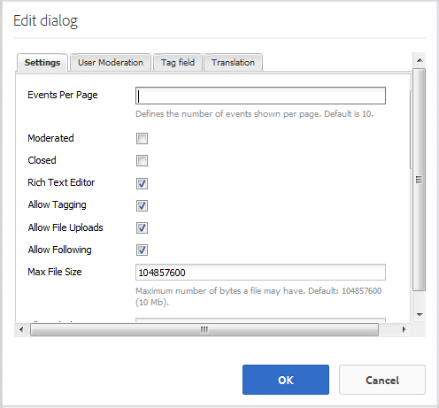

# Kalenderfunctie {#calendar-feature}

## Inleiding {#introduction}

De kalenderfunctie biedt ondersteuning voor het verschaffen van informatie over gebeurtenissen van de gebruikersgemeenschap in een kalendernotatie aan alle bezoekers van de site of alleen aangemeld bij bezoekers van de site (leden van de gemeenschap), terwijl alleen geautoriseerde leden gebeurtenissen mogen toevoegen.

In deze sectie van de documentatie wordt beschreven

* De kalenderfunctie toevoegen aan een AEM-site
* Configuration settings for `Calendar` components

## Een kalender toevoegen aan een pagina {#adding-a-calendar-to-a-page}

Als u een component `Calendar` in de ontwerpmodus aan een pagina wilt toevoegen, gebruikt u de componentbrowser om te zoeken naar

* `Communities / Calendar`

En sleep het op zijn plaats op een pagina, zoals een positie met betrekking tot de eigenschap voor gebruikers om te herzien.

Voor noodzakelijke informatie, bezoek {de Grondbeginselen van de Componenten van 0} Gemeenschappen ](/help/communities/basics.md).[

Wanneer de [ vereiste cliënt-zijbibliotheken ](/help/communities/calendar-basics-for-developers.md#essentials-for-client-side) inbegrepen zijn, is dit hoe de `Calendar` component verschijnt.

### Kalender configureren {#configuring-calendar}

Selecteer de geplaatste component `Calendar` , zodat u het pictogram `Configure` kunt openen en selecteren waarmee het dialoogvenster Bewerken wordt geopend.

#### Het tabblad Instellingen {#settings-tab}

Onder het **lusje van Montages**, specificeer of om markeringen toe te staan om op kalenderingangen worden toegepast.

* **Gebeurtenissen per Pagina**

  Hiermee definieert u het aantal gebeurtenissen dat per pagina wordt weergegeven. De standaardwaarde is 10.

* **Gematigd**

  Als deze optie is ingeschakeld, moet het posten van kalendergebeurtenissen en opmerkingen worden goedgekeurd voordat ze op een publicatiesite worden weergegeven. De optie Standaard is uitgeschakeld.

* **Gesloten**

  Als deze optie is ingeschakeld, wordt de kalender gesloten voor nieuwe gebeurtenisitems en opmerkingen. De optie Standaard is uitgeschakeld.

* **Rich Text Editor**

  Als deze optie is ingeschakeld, kunnen kalendergebeurtenissen en opmerkingen worden ingevoerd met een markering. Standaard is ingeschakeld.

* **Toestaan Tags**

  Als gecontroleerd, sta leden toe om markeringsetiketten aan de gebeurtenissen toe te voegen zij posten (zie {het 1} lusje van het gebied van de Markering **).** Standaard is ingeschakeld.

* **staat Dossier toe uploadt**

  Als deze optie is ingeschakeld, staat u toe dat bestandsbijlagen worden toegevoegd aan een agendagebeurtenis of -opmerking. Standaard is ingeschakeld.

* **toestaat na**

  Als deze optie is ingeschakeld, kunnen leden gebeurtenissen volgen die naar de kalender zijn gepost. Standaard is ingeschakeld.

* **Max de Grootte van het Dossier**

  Alleen relevant als `Allow File Uploads` is gecontroleerd. Dit veld beperkt de grootte (in bytes) van een geüpload bestand. De standaardwaarde is 104857600 (10 MB).

* **Toegestane Types van Dossier**

  Alleen relevant als `Allow File Uploads` is gecontroleerd. Een door komma&#39;s gescheiden lijst met bestandsextensies met het scheidingsteken &#39;punt&#39;. Bijvoorbeeld .jpg, .jpeg, .png, .doc, .docx, .pdf. Als er bestandstypen zijn opgegeven, kunnen deze niet worden geüpload. De standaardinstelling is niet opgegeven, zodat alle bestandstypen zijn toegestaan.

* **Max de Grootte van het Dossier van het Beeld van de Band**

  Alleen relevant als Uploaden van bestand toestaan is ingeschakeld. Het maximum aantal bytes dat een geüploade afbeeldingsbestand kan hebben. De standaardwaarde is 2097152****(2 MB).

* **Toegestane Types van Beeld van de Omslag**

  Een door komma&#39;s gescheiden lijst met extensies voor afbeeldingsbestanden met het puntscheidingsteken. De standaardwaarde is `.jpg,.jpeg,.png,.gif,.bmp` .

* **staat Verbonden Antwoorden** toe

  Als deze optie is ingeschakeld, kunt u reacties op opmerkingen die zijn geplaatst voor de agendagebeurtenis toestaan. Standaard is ingeschakeld.

* **staat Gebruikers toe om Commentaren en Gebeurtenissen te schrappen**

  Als deze optie is ingeschakeld, kunnen leden de opmerkingen en kalendergebeurtenissen verwijderen die ze hebben gepost. Standaard is ingeschakeld.

* **Toestaan het Stemmen**

  Indien ingeschakeld, neemt u de functie Stemmen op met een agendagebeurtenis. Standaard is ingeschakeld.

* **toon Broodkruimels**

  Breedkruimels tonen op gebeurtenispagina. Standaard is ingeschakeld.

* **de Filter van de Waaier van de Datum**

  Definieert het aantal dagen dat aan de huidige datum wordt toegevoegd om de waarde &quot;Aan&quot; van het filter voor de paginanummering van kalendergebeurtenissen te berekenen. Het standaardnummer is 30.

* **sta Aanbevolen Inhoud** toe

  Als gecontroleerd, is het idee identificeerbaar als [ gekenmerkte inhoud ](/help/communities/featured.md). De optie Standaard is uitgeschakeld.

Onder het **lusje van de Moderatie van de Gebruiker**, specificeer hoe de geposte onderwerpen en de antwoorden (gebruiker geproduceerde inhoud) worden beheerd. Voor meer informatie, zie [ het Matigen van Gebruiker Gegenereerde Inhoud ](/help/communities/moderate-ugc.md).

#### Tabblad Gebruikersmodernisering {#user-moderation-tab}

* **ontken Post**

  Indien deze optie is ingeschakeld, mogen de moderatoren van de leden die vertrouwen, posten ontkennen en voorkomen dat de post op het openbare forum verschijnt. Standaard is ingeschakeld.

* **dicht/heropen Gebeurtenissen**

  Als deze optie ingeschakeld is, kunnen vertrouwde moderatoren van leden een gebeurtenis sluiten voor verdere bewerkingen en opmerkingen, en kunnen ze ook een gebeurtenis opnieuw openen. Standaard is ingeschakeld.

* **Punten van de Vlag**

  Als deze optie is ingeschakeld, kunnen leden gebeurtenissen of opmerkingen van anderen als ongeschikt markeren. Standaard is ingeschakeld.

* **Lijst van de Reden van de Vlag**

  Als deze optie is ingeschakeld, kunnen leden in een vervolgkeuzelijst kiezen waarom zij een gebeurtenis of opmerking als ongeschikt aanmerken. De optie Standaard is uitgeschakeld.

* **Reden van de Vlag van de Douane**

  Als deze optie is ingeschakeld, kunnen leden hun eigen reden opgeven om een gebeurtenis of opmerking als ongeschikt aan te duiden. De optie Standaard is uitgeschakeld.

* **Drempel van de Moderatie**

  Voer het aantal keren in dat een gebeurtenis of opmerking moet worden gemarkeerd door leden voordat moderatoren op de hoogte worden gesteld. De standaardwaarde is 1 (één keer).

* **het Vlaggen Grens**

  Voer het aantal keren in dat een gebeurtenis of opmerking moet worden gemarkeerd voordat deze wordt verborgen in de openbare weergave. Indien ingesteld op -1, wordt het gemarkeerde onderwerp of de opmerking nooit verborgen in de openbare weergave. Anders, moet dit aantal groter dan of gelijk aan de Drempel van de Moderatie zijn. De standaardwaarde is 5.

#### Tabblad Tagveld {#tag-field-tab}

Onder het **gebied van de Markering** lusje, zijn de markeringen die kunnen worden toegepast, indien toegestaan onder het **3} lusje van Montages {, beperkt volgens gekozen namespaces.**

* **Toegestane Namespaces**

  Relevant als `Allow Tagging` onder de **Montages** tabel wordt gecontroleerd. De tags die kunnen worden toegepast, zijn beperkt tot de tags binnen de geselecteerde naamruimtecategorieën. De lijst met naamruimten bevat &quot;Standaardtags&quot; (de standaardnaamruimte) en &quot;Alle tags opnemen&quot;. De standaardwaarde is niet ingeschakeld, hetgeen betekent dat alle naamruimten zijn toegestaan.

* **de Grens van de Suggestie**

  Voer het aantal tags in dat moet worden weergegeven als suggestie aan het lid dat naar het forum post. De standaardwaarde is **-**1 (geen limieten).

>[!NOTE]
>
>Bezoek [ Beherende Markeringen ](/help/sites-administering/tags.md) waar u kunt leren hoe te om een markering toe te voegen namespace (taxonomie).

#### Tabblad Vertaling {#translation-tab}

Onder het **Vertaal** lusje, als de vertaling voor de communautaire plaats wordt toegelaten, kan de vertaling worden geplaatst om de volledige draad (gebeurtenis en commentaren) in plaats van specifieke posten te vertalen.

* **vertaal allen**

  Als deze optie is ingeschakeld, worden de gebeurtenis en de opmerkingen vertaald naar de voorkeurstaal van de gebruiker. Standaard is ingeschakeld.

## Ervaring met sitebezoekers {#site-visitor-experience}

In de publicatieomgeving wordt met de kalenderfunctie een zoekveld weergegeven met een standaarddatumbereik en alle kalendergebeurtenissen die binnen dat bereik vallen.

Wanneer een agendagebeurtenis is geselecteerd, worden de details, beschrijving en opmerkingen van de kalendergebeurtenis weergegeven.

Andere vaardigheden hangen af van het feit of de bezoeker van de site een moderator, beheerder, lid van de gemeenschap, geprivilegieerd lid of anoniem is.

### Moderatoren en beheerders {#moderators-and-administrators}

Wanneer de ondertekende in gebruiker moderator of beheerdervoorrechten heeft, kunnen zij [ matigingstaken ](/help/communities/moderate-ugc.md) (zoals toegelaten door de configuratie van de component) op alle kalendergebeurtenissen en commentaren uitvoeren die aan een gebeurtenis worden gepost.

#### Leden {#members}

Wanneer de ondertekende binnen gebruiker een communautair lid of [ bevoorrecht lid ](/help/communities/users.md#privileged-members-group) (afhankelijk van configuratie) is, kunnen zij `New Event` selecteren om een nieuwe kalendergebeurtenis tot stand te brengen en te posten.

Zij kunnen met name:

* Een agendagebeurtenis maken
* Opmerkingen Post to a agenda event
* Een eigen agendagebeurtenis of commentaar bewerken
* Verwijder hun eigen agendagebeurtenis of commentaar
* Andere kalendergebeurtenissen of opmerkingen markeren

#### Anoniem {#anonymous}

Sitebezoekers die niet zijn aangemeld, kunnen alleen geposte kalendergebeurtenissen lezen, deze vertalen indien deze worden ondersteund, maar kunnen geen gebeurtenis of opmerking toevoegen en de gebeurtenissen of opmerkingen van anderen niet markeren.

## Aanvullende informatie {#additional-information}

Meer informatie kan op de ](/help/communities/calendar-basics-for-developers.md) pagina van de Hoofdzaak van de Kalender [ worden gevonden voor ontwikkelaars.

Voor moderatie van kalendergebeurtenissen en commentaren, zie [ het Mativeren van Gebruiker Gegenereerde Inhoud ](/help/communities/moderate-ugc.md).

Voor het etiketteren van kalendergebeurtenissen en commentaren, zie [ Tags Gebruiker Gegenereerde Inhoud ](/help/communities/tag-ugc.md).

Voor vertaling van kalendergebeurtenissen en commentaren, zie [ Vertaal Door Gebruiker Gegenereerde Inhoud ](/help/communities/translate-ugc.md).
