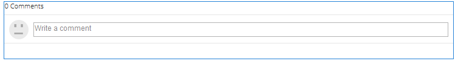

# Opmerkingen gebruiken {#using-comments}

## Inleiding {#introduction}

De functie voor opmerkingen wordt gebruikt om bezoekers die zich hebben aangemeld (leden) in staat te stellen hun mening en kennis over de inhoud van de site te delen. Deze functie is vaak al aanwezig in andere functies, maar kan aan elke website worden toegevoegd.

In het document wordt beschreven:

* `Comments` toevoegen aan een pagina.
* Configuration settings for the `Comments` component.

>[!NOTE]
>
>Anoniem plaatsen van een opmerking wordt niet ondersteund. Site-bezoekers moeten zich registreren (lid worden) en zich aanmelden om deel te nemen.

### Opmerkingen toevoegen aan een pagina {#adding-comments-to-a-page}

Als u een component `Comments` in de ontwerpmodus aan een pagina wilt toevoegen, gebruikt u de componentbrowser om te zoeken naar

* `Communities / Comments`

en sleep het naar de juiste positie op een pagina, zoals een positie ten opzichte van de functie waar gebruikers opmerkingen over kunnen plaatsen, of gewoon onder aan de pagina.

Voor noodzakelijke informatie, bezoek {de Grondbeginselen van de Componenten van 0} Gemeenschappen [&#128279;](/help/communities/basics.md).

Wanneer de [&#x200B; vereiste cliënt-zijbibliotheken &#x200B;](/help/communities/essentials-comments.md#essentials-for-client-side) inbegrepen zijn, is dit hoe de `Comments` component verschijnt.

>[!NOTE]
>
>Er mag slechts één `Comments` -component op een pagina voorkomen. Houd er rekening mee dat diverse functies van een Gemeenschappen al opmerkingen bevatten, zoals een blog, agenda, forum, QnA en revisies.

### Opmerkingen configureren {#configuring-comments}

Selecteer de geplaatste component `Comments` die u wilt openen en selecteer het pictogram `Configure` waarmee het dialoogvenster Bewerken wordt geopend.

#### Tabblad Opmerkingen {#comments-tab}

Onder het **lusje van Commentaren**, specificeer hoe de commentaren door bezoekers zijn ingegaan.

* **staat antwoorden** toe

  Als deze optie is ingeschakeld, kunnen leden reageren op bestaande opmerkingen. De optie Standaard is uitgeschakeld.

* **Commentaren per Pagina**

  Hiermee beperkt u het aantal opmerkingen dat per pagina wordt weergegeven en het aantal reacties dat wordt weergegeven. De standaardwaarde is 10.

* **staat Dossier toe uploadt**

  Als deze optie is ingeschakeld, wordt de optie voor het uploaden van een bestand weergegeven in het tekstinvoervak. De optie Standaard is uitgeschakeld.

* **Max de Grootte van het Dossier**

  Alleen relevant als Uploaden van bestand toestaan is ingeschakeld. Deze waarde beperkt de grootte van het geüploade bestand. Standaardlimiet is 10 MB.

* **Maximale Lengte van het Bericht**

  Maximumaantal tekens dat in het tekstvak kan worden ingevoerd. De standaardwaarde is 4096 tekens.

* **Toegestane Types van Dossier**

  Alleen relevant als Uploaden van bestand toestaan is ingeschakeld. Een door komma&#39;s gescheiden lijst met bestandsextensies met het puntscheidingsteken. Bijvoorbeeld: .jpg, .jpeg, .png, .doc, .docx, .pdf. Als er bestandstypen zijn opgegeven, zijn deze niet toegestaan. De standaardinstelling is niet opgegeven, zodat alle bestandstypen zijn toegestaan.

* **Rich Text Editor**

  Als deze optie is ingeschakeld, worden opmerkingen ingevoerd met een markering. De optie Standaard is uitgeschakeld.

* **Toestaan het Stemmen**

  Als deze optie is ingeschakeld, wordt de optie om omhoog of omlaag te stemmen weergegeven met het tekstinvoervak. De optie Standaard is uitgeschakeld.

* **toestaat na**

  Als deze optie is ingeschakeld, kunnen leden opmerkingen volgen. De optie Standaard is uitgeschakeld.

* **Badges van de Vertoning**

  Als deze optie is ingeschakeld, kunnen verdiende en toegekende badges worden weergegeven. De optie Standaard is uitgeschakeld.

#### Tabblad Gebruikersmodernisering {#user-moderation-tab}

Onder het **lusje van de Moderatie van de Gebruiker**, specificeer hoe de geposte commentaren worden geleid. Voor meer informatie, zie [&#x200B; het Matigen van Gebruiker Gegenereerde Inhoud &#x200B;](/help/communities/moderate-ugc.md).

* **pre-Moderatie**

  Als deze optie is ingeschakeld, moeten opmerkingen worden goedgekeurd voordat ze op een publicatiesite worden weergegeven. De optie Standaard is uitgeschakeld.

* **Schrap Commentaren**

  Als deze optie is ingeschakeld, kan het lid dat de opmerking heeft geplaatst deze verwijderen. De optie Standaard is uitgeschakeld.

* **ontken Commentaren**

  Indien gecontroleerd, sta moderators toe om commentaren te ontkennen. De optie Standaard is uitgeschakeld.

* **dicht/heropen Commentaren**

  Als deze optie ingeschakeld is, kan de moderator opmerkingen sluiten en opnieuw openen. De optie Standaard is uitgeschakeld.

* **Commentaren van de Vlag**

  Als deze optie is ingeschakeld, kunnen leden opmerkingen als onjuist markeren. De optie Standaard is uitgeschakeld.

* **Lijst van de Reden van de Vlag**

  Als deze optie is ingeschakeld, kunnen leden in een vervolgkeuzelijst de reden kiezen waarom een opmerking als onjuist wordt gemarkeerd. De optie Standaard is uitgeschakeld.

* **Reden van de Vlag van de Douane**

  Als deze optie is ingeschakeld, kunnen leden hun eigen reden opgeven om een opmerking als ongeschikt te markeren. De optie Standaard is uitgeschakeld.

* **Drempel van de Moderatie**

  Voer het aantal keren in dat een opmerking moet worden gemarkeerd door de leden voordat de moderatoren op de hoogte worden gesteld. De standaardwaarde is één keer (1).

* **het Vlaggen Grens**

  Voer het aantal keren in dat een opmerking moet worden gemarkeerd voordat deze wordt verborgen in de openbare weergave. Dit aantal moet groter dan of gelijk aan de **Drempel van de Moderatie** zijn. De standaardwaarde is 5.

#### Tabblad Instellingen sorteren {#sort-settings-tab}

Onder het **lusje van de Montages van de Soort**, specificeer hoe de geposte commentaren wanneer getoond worden gesorteerd.

* **Gebied van de Sortering**

  Trek omlaag om een van `Newest, Oldest, Last Updated, Most Viewed, Most Active, Most Followed` of `Most Liked` te selecteren.

* **de Orde van de Sortering**

  Trek omlaag om een van `Ascending` of `Descending` te selecteren.

### Wijzigen in type aangepaste opmerking {#changing-to-a-custom-comment-type}

Door het Type van Middel van de Commentaar te veranderen, produceert het commentaarsysteem niet meer een geval van een commentaar gebruikend het gebrek, maar eerder die is aangepast (uitgebreid) door ontwikkelaars.

Zodra de types van douanemiddel gekend zijn, ga [&#x200B; Wijze van het Ontwerp &#x200B;](/help/sites-authoring/default-components-designmode.md) in en klik de geplaatste `Comments` component tweemaal om een dialoog met een extra lusje te openen.

Onder het **lusje van de Types van Middel**, specificeer douane resourceType voor nieuwe instanties van de `Comments or Voting` componenten:

* **Type van Middel van Commentaar**

  Navigeer naar het resourceType van een uitgebreide `comment` component (enkele opmerking) in /apps. Bijvoorbeeld: `/apps/social/commons/components/hbs/comments/comment`

  Deze bron identificeert het resourceType van UGC die wordt gecreeerd wanneer een bezoeker een commentaar plaatst.

* **het Stemmen het Type van Middel**

  Navigeer naar het resourceType van een uitgebreide `voting` component in /apps. Bijvoorbeeld: `/apps/social/components/hbs/voting`

  Dit middel identificeert het middeltype van UGC die wordt gecreeerd wanneer een bezoeker een stem plaatst.

* **Type van Middel van het Systeem van de Commentaar**

  Navigeer aan resourceType van een uitgebreide `comments` component (het Systeem van de Commentaar) in /apps. Laat leeg tenzij het paginamalplaatje [&#128279;](/help/communities/scf.md#add-or-include-a-communities-component) dynamisch omvat het Systeem van de Commentaar in het onderliggende manuscript in plaats van wordt toegevoegd aan de pagina als middel (commentaarknoop). Lees meer over de [`{{include}}` helper &#x200B;](/help/communities/handlebars-helpers.md#include) .

### Ervaring met sitebezoekers {#site-visitor-experience}

#### Moderatoren en beheerders {#moderators-and-administrators}

Wanneer de ondertekende binnen gebruiker moderator of beheerdervoorrechten heeft, kunnen zij de matigingstaken uitvoeren die door de configuratie van de component worden toegelaten, ongeacht wie de commentaar authored.

#### Leden {#members}

Wanneer de bezoeker van de site zich heeft aangemeld, kunnen deze, afhankelijk van de configuratie

* Post een nieuwe opmerking
* Een eigen opmerking bewerken
* Een eigen opmerking verwijderen
* Opmerkingen van anderen markeren

#### Anoniem {#anonymous}

Sitebezoekers die niet zijn aangemeld, kunnen alleen geposte opmerkingen lezen, deze vertalen indien deze worden ondersteund, maar kunnen geen opmerking toevoegen of opmerkingen van anderen markeren.

### Aanvullende informatie {#additional-information}

Meer informatie kan op de [&#x200B; Hoofdzaak van Commentaren &#x200B;](/help/communities/essentials-comments.md) pagina voor ontwikkelaars worden gevonden.

Voor moderatie van geposte commentaren, zie [&#x200B; het Modereren van Gebruiker Gegenereerde Inhoud &#x200B;](/help/communities/moderate-ugc.md).

Voor vertaling van geposte commentaren, zie [&#x200B; Vertaal Door de Gebruiker Gegenereerde Inhoud &#x200B;](/help/communities/translate-ugc.md).
