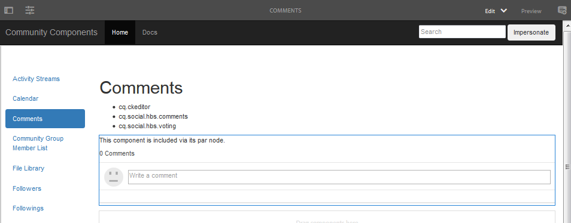

# Community Components Guide  {#community-components-guide}

De communautaire gids voor componenten is een interactief ontwikkelingsinstrument voor het [sociale-componentkader (SCF)](scf.md). Het verstrekt een lijst van beschikbare AEM Communities componenten of de complexere eigenschappen die van veelvoudige componenten worden gebouwd.

Samen met basisinformatie voor elke component, staat de gids voor het experimenteren met toe hoe de componenten SCF/de eigenschappen werken en hoe zij kunnen worden gevormd of worden aangepast.

Voor informatie betreffende de ontwikkelingsprincipes met betrekking tot elke component, zie de Hoofdzaak van de [Eigenschap en van de Component](essentials.md).

## Aan de slag {#getting-started}

De handleiding is bedoeld voor gebruik in ontwikkelinstallaties van de auteur (localhost:4502) en publiceer instanties (localhost:4503).

De site Community Components is toegankelijk door naar

* [https://&lt;server>:&lt;port>/content/community-components/en.html](http://localhost:4502/content/community-components/en.html)

De wisselwerking met de communautaire componenten is afhankelijk van:

* De server (auteur of publicatie).
* Of de bezoeker van de site al dan niet is aangemeld.
* Indien aangemeld, de aan het lid toegewezen rechten.
* Of al dan niet standaardSRP, [JSRP](jsrp.md), in gebruik is.

Als u de modus Bewerken bij de auteur wilt activeren, voegt u een `editor.html` of `cf#` als het eerste padsegment in na de naam van de server:

* Standaardinterface:

   [https://&lt;server>:&lt;port>/editor.html/content/community-components/en.html](http://localhost:4502/editor.html/content/community-components/en.html)

* Klassieke gebruikersinterface:

   [https://&lt;server>:&lt;port>/cf#/content/community-components/en.html](http://localhost:4502/cf#/content/community-components/en.html)

>[!NOTE]
>
>Op auteur in Edit wijze, zijn de verbindingen op een pagina niet actief.
>
>Als u naar een componentpagina wilt navigeren, selecteert u eerst de modus Voorbeeld om de koppelingen te activeren.
>
>Wanneer de componentpagina in de browser wordt weergegeven, gaat u terug naar de modus Bewerken om het dialoogvenster voor bewerken van de component te openen.
>
>Voor algemene ontwerpinformatie raadpleegt u de [handleiding voor het maken van pagina](../../help/sites-authoring/qg-page-authoring.md)&#39;s.
>
>Als u niet bekend bent met AEM, bekijkt u de documentatie over [basisverwerking](../../help/sites-authoring/basic-handling.md).

### Startpagina {#home-page}

De handleiding bevat een lijst met SCF-componenten die beschikbaar zijn voor voorvertoning en prototypen aan de linkerkant van de pagina.

De Gids van Componenten zoals bekeken op een auteursinstantie op Edit wijze:

## Componentpagina&#39;s {#component-pages}

Selecteer een component in de lijst links op de pagina.

De hoofdtekst van de hulplijn wordt weergegeven:

1. Titel: De naam van de geselecteerde component
1. [Client-Side Llibraries](#client-side-libraries): Een lijst van een of meer verplichte categorieën
1. [Inbegrepen](scf.md#add-or-include-a-communities-component): Als de component dynamisch kan worden opgenomen, kunt u in de bewerkingsmodus van de auteur schakelen tussen de statussen:

   * Indien toegevoegd, wordt weergegeven tekst: &quot;Deze component is opgenomen via het pari-knooppunt.&quot;
   * Indien inbegrepen, wordt weergegeven tekst: &quot;Deze component wordt dynamisch opgenomen.&quot;
   * Indien niet inbegrepen, dan wordt geen tekst getoond

1. Voorbeeldcomponent of -functie: een actieve instantie van de component of eigenschap. Als een component, kan het met veranderingen worden veranderd die in de malplaatjes, CSS en gegevens worden aangebracht die in de lusjesectie worden verstrekt.

>[!NOTE]
>
>Nadat u links een selectie hebt gemaakt, wordt de component hieronder weergegeven in plaats van naast de componenten wanneer het browservenster te smal is.

### Interacties tussen auteurs {#author-interactions}

Wanneer u de handleiding gebruikt voor een instantie van de auteur, kunt u het configureren van een component ervaren door het dialoogvenster te openen. De informatie voor ontwikkelaars wordt verstrekt in de sectie van de Hoofdzaak van de [Component en van de Eigenschap](essentials.md) van de documentatie, terwijl de dialoogmontages in de sectie van Componenten [van](author-communities.md) Gemeenschappen voor auteurs worden beschreven.

Voor de gids van Componenten Community, worden sommige montages van de componentendialoog bedekt met de [Includable](scf.md#add-or-include-a-communities-component) knevelstaat. Als u wilt schakelen tussen het gebruik van de bestaande bron of een dynamisch opgenomen bron, selecteert u in de bewerkingsmodus zowel de component als de insluitende tekst en dubbelklikt u om het dialoogvenster Bewerken te openen:

Onder het tabblad **Sjablonen** :

* **Inclusief de onderliggende component met sling:include**

   Als deze optie niet is ingeschakeld, gebruikt de Component Guide de bestaande bron in de repository (een jcr-knooppunt dat een onderliggend knooppunt is van een par-knooppunt).

   * weergegeven tekst is: &quot;Deze component is opgenomen via het pari-knooppunt.&quot;
   Indien gecontroleerd, zal de Gids van de Component sling gebruiken om dynamisch een component van het resourceType van de kindknoop (niet-bestaande middel) te omvatten.

   * weergegeven tekst is: &quot;Deze component wordt dynamisch opgenomen.&quot;
   De optie Standaard is uitgeschakeld.

### Interacties publiceren {#publish-interactions}

Wanneer u de handleiding gebruikt op een publicatie-instantie, kunt u de componenten en functies ervaren als bezoeker van de site (niet aangemeld) en als leden met verschillende bevoegdheden wanneer u zich hebt aangemeld.

>[!NOTE]
>
>Houd er rekening mee dat als SRP standaard op [JSRP](jsrp.md)blijft staan, UGC die op de publicatieinstantie is ingevoerd, alleen zichtbaar is op de publicatie-instantie en *niet* zichtbaar is vanaf de [moderatieconsole](moderate-ugc.md) op de auteurinstantie.

## Client-Side bibliotheken {#client-side-libraries}

De client-side bibliotheken (clientlibs) die voor elke component worden vermeld, zijn de bibliotheken die *vereist* zijn om ernaar te verwijzen wanneer de component op een pagina wordt geplaatst. De clientlibs bieden een manier om het downloaden van Javascript en CSS die worden gebruikt om de component in de browser te renderen, te beheren en te optimaliseren.

Ga voor meer informatie naar [Clientlibs voor Community Components](clientlibs.md).

## Imitatie {#impersonation}

Voor de auteurinstantie, waar men vaak als beheerder of ontwikkelaar wordt aangemeld, om de component te ervaren die als een andere gebruiker wordt aangemeld, gebruik het tekstvakje links van de **[!UICONTROL Impersonate]** knoop om of in de gebruikersbenaming te typen of van de trekkrachtlijst te selecteren, en dan de knoop te klikken. Klik op Vorige versie om af te melden en de imitatie te beëindigen.

De publicatie-instantie hoeft zich niet voor te doen. U gebruikt gewoon de koppeling Aanmelden/Afmelden om verschillende gebruikers na te bootsen, zoals de [demogebruikers](tutorials.md#demo-users).

## Aanpassing {#customization}

Wanneer toegelaten, is elke component SCF beschikbaar voor prototyping van mogelijke aanpassingen door het malplaatje van de component, CSS en gegevens tijdelijk te wijzigen.

### Aanpassing inschakelen {#enabling-customization}

>[!NOTE]
>
>**Dit gereedschap is alleen**-lezen. Geen van de bewerkingen aan sjablonen, CSS of gegevens worden opgeslagen in de gegevensopslagruimte.

Als u snel wilt experimenteren met aanpassingen, moet de `scg:showIde`eigenschap worden toegevoegd aan het JCR-knooppunt voor inhoud van de componentpagina en worden ingesteld op true.

De component comments als voorbeeld gebruiken voor de auteur of de publicatie-instantie, aangemeld met beheerdersrechten:

1. Bladeren naar [CRXDE Lite](../../help/sites-developing/developing-with-crxde-lite.md)

   Bijvoorbeeld: [http://localhost:4503/crx/de](http://localhost:4503/crx/de)

1. Selecteer het `jcr:content` knooppunt van de component

   Bijvoorbeeld, `/content/community-components/en/comments/jcr:content`

1. Een eigenschap toevoegen

   * **Naam** `scg:showIde`
   * **Type** `String`
   * **Waarde** `true`

1. Selecteer **[!UICONTROL Save All]**
1. Laad de pagina Opmerkingen in de handleiding opnieuw

   [http://localhost:4503/content/community-components/en/comments.html](http://localhost:4503/content/community-components/en/comments.html)

1. Er zijn nu drie tabbladen voor sjablonen, CSS en gegevens.

 

### Tabblad Sjablonen {#templates-tab}

Selecteer het tabblad Sjablonen om de sjablonen weer te geven die aan de component zijn gekoppeld.

Met de Sjablooneditor kunnen lokale bewerkingen worden gecompileerd en toegepast op de voorbeeldcomponentinstantie boven aan de pagina zonder dat dit van invloed is op de component in de opslagplaats.

Wanneer compileert op lokale bewerkingen, worden eventuele fouten gemarkeerd door een punt in de tussenruimte te plaatsen en de tekst rood te markeren.

### CSS-tabblad {#css-tab}

Selecteer het tabblad CSS om de CSS weer te geven die aan de component is gekoppeld.

Als een component een samenstelling van veelvoudige componenten is, kan sommige CSS onder één van de andere componenten worden vermeld.

Met de CSS-editor kunt u de CSS wijzigen en toepassen op de voorbeeldcomponentinstantie boven aan de pagina.

U kunt een regel selecteren om de onderdelen van het DOM te markeren met behulp van die regel door naast de regel in de tussenruimte te klikken.

### Tabblad Gegevens {#data-tab}

Selecteer het lusje van Gegevens om de .social.json eindpuntgegevens te tonen. Dit gegeven is editable en wordt toegepast op de instantie van de steekproefcomponent.

Syntaxisfouten kunnen in de tussenruimte worden gemarkeerd en in de editor worden gemarkeerd.
