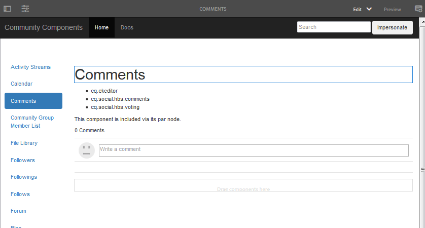

# Community Components Guide  {#community-components-guide}

De communautaire gids van Componenten is een interactief ontwikkelingshulpmiddel voor het [ sociale componentenkader (SCF) ](scf.md). Het verstrekt een lijst van beschikbare componenten van de Gemeenschappen van Adobe Experience Manager (AEM) of de complexere eigenschappen die van veelvoudige componenten worden gebouwd.

Samen met basisinformatie voor elke component, staat de gids voor het experimenteren met toe hoe de componenten SCF/de eigenschappen werken en hoe zij kunnen worden gevormd of worden aangepast.

Voor informatie betreffende ontwikkelingshoofdstukken met betrekking tot elke component, zie [ de Hoofdzaak van de Eigenschap en van de Component ](essentials.md).

## Aan de slag {#getting-started}

De handleiding is bedoeld voor gebruik in ontwikkelinstallaties van instanties van de auteur (localhost:4502) en voor het publiceren van instanties (localhost:4503).

De site Community Components is toegankelijk door naar

* [ https://&lt;server>:&lt;port>/content/community-components/en.html](http://localhost:4502/content/community-components/en.html)

De interactie met de communautaire componenten is afhankelijk van:

* De server (auteur of publicatie).
* Of de bezoeker van de site al dan niet is aangemeld.
* Indien aangemeld, de aan het lid toegewezen rechten.
* Of het gebrek SRP, [ JSRP ](jsrp.md), in gebruik is.

Als u de bewerkingsmodus wilt activeren bij de auteur, voegt u `editor.html` of `cf#` in als het eerste padsegment na de servernaam:

* Standaardinterface:

  [ https://&lt;server>:&lt;port>/editor.html/content/community-components/en.html](http://localhost:4502/editor.html/content/community-components/en.html)

* Klassieke gebruikersinterface:

  [ https://&lt;server>:&lt;port>/cf#/content/community-components/en.html](http://localhost:4502/cf#/content/community-components/en.html)

>[!NOTE]
>
>Op auteur in Edit wijze, zijn de verbindingen op een pagina niet actief.
>
>Als u naar een componentpagina wilt navigeren, selecteert u eerst de modus Voorbeeld om de koppelingen te activeren.
>
>Wanneer de componentpagina in de browser wordt weergegeven, gaat u terug naar de modus Bewerken om het dialoogvenster voor bewerken van de component te openen.
>
>Voor algemene auteursinformatie, bekijk de [ snelle gids aan auteurspagina&#39;s ](../../help/sites-authoring/qg-page-authoring.md).
>
>Als niet vertrouwd met AEM, bekijk de documentatie over [ basisbehandeling ](../../help/sites-authoring/basic-handling.md).

### Startpagina {#home-page}

De handleiding bevat een lijst met SCF-componenten die beschikbaar zijn voor voorvertoning en prototypen aan de linkerkant van de pagina.

De Gids van Componenten zoals bekeken op een auteursinstantie op Edit wijze:

## Componentpagina&#39;s {#component-pages}

Selecteer een component in de lijst links op de pagina.

De hoofdtekst van de hulplijn wordt weergegeven:

1. Titel: De naam van de geselecteerde component
1. [ cliënt-Kant bibliotheken ](#client-side-libraries): Een lijst van één of meerdere vereiste categorieën
1. [ Includable ](scf.md#add-or-include-a-communities-component): Als de component dynamisch kan worden omvat, dan kan de staat op auteur worden van een knevel voorzien uitgeeft wijze:

   * Indien toegevoegd, wordt weergegeven tekst: &quot;Deze component is opgenomen via het bijbehorende knooppunt.&quot;
   * Indien inbegrepen, wordt de getoonde tekst: &quot;Deze component is dynamisch inbegrepen.&quot;
   * Indien niet inbegrepen, dan wordt geen tekst getoond

1. Voorbeeldcomponent of -functie: een actieve instantie van de component of functie. Als een component, kan het met veranderingen worden veranderd die in de malplaatjes, CSS, en gegevens worden aangebracht die in de lusjesectie worden verstrekt.

>[!NOTE]
>
>Nadat u links een selectie hebt gemaakt, wordt de component hieronder weergegeven in plaats van naast de componenten wanneer het browservenster te smal is.

### Interacties tussen auteurs {#author-interactions}

Wanneer u de handleiding gebruikt voor een instantie van de auteur, kunt u het configureren van een component ervaren door het dialoogvenster te openen. De informatie voor ontwikkelaars wordt verstrekt in de [ sectie van de Hoofdzaak van de Component en van de Eigenschap ](essentials.md) van de documentatie, terwijl de dialoogmontages in [ sectie van de Componenten van Gemeenschappen ](author-communities.md) voor auteurs worden beschreven.

Voor de gids van Componenten Gemeenschap, worden sommige montages van de componentendialoog bedekt met [ Includable ](scf.md#add-or-include-a-communities-component) knevelstaat. Als u wilt schakelen tussen het gebruik van de bestaande bron of een dynamisch opgenomen bron, selecteert u in de bewerkingsmodus zowel de component als de insluitende tekst en dubbelklikt u om het dialoogvenster Bewerken te openen:

Onder het **lusje van Malplaatjes**:

* **omvat de kindcomponent met het verbinden:omvat**

  Als deze optie niet is ingeschakeld, gebruikt de Component Guide de bestaande bron in de repository (een jcr-knooppunt dat een onderliggend knooppunt is van een par-knooppunt).

   * weergegeven tekst is: &quot;Deze component is opgenomen via het bijbehorende knooppunt.&quot;

  Indien gecontroleerd, gebruikt de Gids van de Component sling om dynamisch een component van het resourceType van de kindknoop (niet-bestaande middel) te omvatten.

   * weergegeven tekst is: &quot;Deze component is dynamisch opgenomen.&quot;

  De optie Standaard is uitgeschakeld.

### Publish-interacties {#publish-interactions}

Wanneer u de handleiding gebruikt op een publicatie-instantie, kunt u de componenten en functies ervaren als bezoeker van de site (niet aangemeld) en als leden met verschillende bevoegdheden wanneer u zich hebt aangemeld.

>[!NOTE]
>
>Ben zich bewust, als SRP aan [ JSRP ](jsrp.md) wordt verlaten, dan zal UGC ingegaan op publiceer instantie slechts op zichtbaar zijn publiceren, en ** niet [ van de ](moderate-ugc.md) console van de moderatie {op de auteursinstantie zichtbaar zijn.

## Client-Side bibliotheken {#client-side-libraries}

De cliënt-zijbibliotheken (clientlibs) die voor elke component worden vermeld zijn die *worden vereist* om worden van verwijzingen voorzien wanneer de component op een pagina wordt geplaatst. De clientlibs bieden een manier om de download van de JavaScript en CSS die worden gebruikt om de component in de browser te renderen, te beheren en te optimaliseren.

Voor meer informatie, bezoek [ Clientlibs voor de Componenten van Gemeenschappen ](clientlibs.md).

## Imitatie {#impersonation}

Voor de auteurinstantie, waar men vaak als beheerder of ontwikkelaar wordt aangemeld, om de component te ervaren die als een andere gebruiker wordt aangemeld, gebruik het tekstvakje links van de **[!UICONTROL Impersonate]** knoop om of in de gebruikersbenaming te typen of van de pull-down lijst te selecteren, en dan de knoop te klikken. Klik op Vorige versie om u af te melden en de imitatie te beëindigen.

De publicatie-instantie hoeft zich niet voor te doen. Eenvoudig gebruik de Login/Logout verbinding om zich als diverse gebruikers, zoals de [ demogebruikers ](tutorials.md#demo-users) na te bootsen.

## Aanpassing {#customization}

Wanneer toegelaten, is elke component SCF beschikbaar voor prototyping van mogelijke aanpassingen door het malplaatje van de component, CSS, en gegevens tijdelijk te wijzigen.

### Aanpassing inschakelen {#enabling-customization}

>[!NOTE]
>
>**Dit hulpmiddel is read-only**. Geen van de bewerkingen aan sjablonen, CSS of gegevens worden opgeslagen in de gegevensopslagruimte.

Om snel met aanpassingen te experimenteren, moet het `scg:showIde` bezit aan de inhoudJCR van de componentenpagina worden toegevoegd knoop en aan waar worden geplaatst.

De component comments als voorbeeld gebruiken voor de auteur of de publicatie-instantie, aangemeld met beheerdersrechten:

1. Blader naar [ CRXDE Lite ](../../help/sites-developing/developing-with-crxde-lite.md)

   Bijvoorbeeld, [ http://localhost:4503/crx/de](http://localhost:4503/crx/de)

1. De node `jcr:content` van de component selecteren

   Bijvoorbeeld: `/content/community-components/en/comments/jcr:content`

1. Een eigenschap toevoegen

   * **Naam** `scg:showIde`
   * **Type** `String`
   * **Waarde** `true`

1. Selecteren **[!UICONTROL Save All]**
1. Laad de pagina Opmerkingen in de handleiding opnieuw

   [ http://localhost:4503/content/community-components/en/comments.html](http://localhost:4503/content/community-components/en/comments.html)

1. Er zijn nu drie tabbladen voor sjablonen, CSS en gegevens.

### Tabblad Sjablonen {#templates-tab}

Selecteer het tabblad Sjablonen om de sjablonen weer te geven die aan de component zijn gekoppeld.

Met de Sjablooneditor kunnen lokale bewerkingen worden gecompileerd en toegepast op de voorbeeldcomponentinstantie boven aan de pagina zonder dat dit van invloed is op de component in de opslagplaats.

Wanneer compileert op lokale bewerkingen, worden eventuele fouten gemarkeerd door een punt in de tussenruimte te plaatsen en de tekst rood te markeren.

### CSS-tabblad {#css-tab}

Selecteer het tabblad CSS om de CSS weer te geven die aan de component is gekoppeld.

Als een component een samenstelling van veelvoudige componenten is, kan sommige CSS onder één van de andere componenten worden vermeld.

Met de CSS-editor kunt u de CSS wijzigen en toepassen op de voorbeeldcomponentinstantie boven aan de pagina.

U kunt een regel selecteren om de onderdelen van het DOM te markeren met behulp van die regel door naast de regel in de tussenruimte te klikken.

### Tabblad Gegevens {#data-tab}

Selecteer het lusje van Gegevens om de .social.json eindpuntgegevens te tonen. Dit gegeven is editable en wordt toegepast op de instantie van de steekproefcomponent.

Syntaxisfouten kunnen in de tussenruimte worden gemarkeerd en in de editor worden gemarkeerd.
