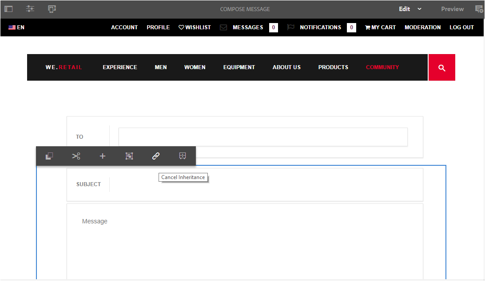

# Berichtenonderdeel {#messaging-feature}

Naast de openbaar zichtbare interactie die in forums en commentaren voorkomt, laat de overseineneigenschap van AEM Communities communautaire leden toe om met elkaar meer privé in wisselwerking te staan.

Deze functie kan worden opgenomen wanneer een [communitysite](/help/communities/overview.md#communitiessites) wordt gemaakt.

De overseineneigenschap verstrekt de capaciteit om:

**A** - een bericht sturen naar een of meer leden van de community

**B** - directe berichten in [bulk verzenden naar groepen die lid zijn van de gemeenschap](/help/communities/messaging.md#group-messaging)

**C** - verzend een bericht met gehechtheid

**D** - een bericht doorsturen

**E** - een bericht beantwoorden

**F** - verwijder een bericht

**G** - herstel een geschrapt bericht

 

Om de overseineneigenschap toe te laten en te wijzigen, zie:

* [Berichten](/help/communities/messaging.md) voor beheerders configureren
* [Essentiële elementen](/help/communities/essentials-messaging.md) voor berichten voor ontwikkelaars

>[!NOTE]
>
>Het wordt niet ondersteund om `Compose Message, Message, or Message List` componenten (gevonden in `Communities`componentgroep) toe te voegen aan een pagina in de modus Schrijven.

## Berichtcomponenten configureren {#configure-messaging-components}

Wanneer het overseinen voor een communautaire plaats wordt toegelaten, wordt het opstelling zonder verdere configuratie noodzakelijk. De informatie wordt verstrekt als er een behoefte is om de standaardconfiguratie te veranderen.

### Berichtlijst configureren (berichtvenster) {#configure-message-list-message-box}

Om de configuratie van de lijst van berichten voor **Inbox**, **Verzonden Punten**, en de pagina&#39;s van het **Afval** van de overseineneigenschap te wijzigen, open de plaats in [auteur uitgeeft wijze](/help/communities/sites-console.md#authoring-site-content).

1. In `Preview` wijze, selecteer de verbinding van **Berichten** om de belangrijkste overseinenpagina te openen. Selecteer vervolgens **Inbox**, **Verzonden items** of **Prullenmand** om de component voor die berichtlijst te configureren.

1. Selecteer in de `Edit` modus de component op de pagina.
1. U opent het configuratiedialoogvenster door overerving te annuleren door het `link` pictogram te selecteren.
Nadat de overerving is geannuleerd, is het mogelijk om het configuratiepictogram te selecteren om het configuratiedialoogvenster te openen.

1. Nadat de configuratie is voltooid, moet de overerving worden hersteld door het `broken link` pictogram te selecteren.

#### Het tabblad Basis {#basic-tab}

* **Servicekiezer**

   (*Vereist*) plaats dit aan de waarde van het bezit **`serviceSelector.name`** van de Dienst [van de Verrichtingen van het Overseinen van](/help/communities/messaging.md#messaging-operations-service)AEM Communities.

* **Pagina samenstellen**

   (*Vereist*) De pagina die moet worden geopend wanneer een lid op de **`Reply`** knop klikt. De doelpagina moet het formulier voor **samenstellingsbericht** bevatten.

* **Reageren/weergeven als bron**

   Als deze optie is ingeschakeld, verwijzen de URL van de reactie en de URL van de weergave naar een bron, anders worden gegevens doorgegeven als queryparameters in de URL.

* **Profielweergaveformulier**

   Het profielformulier dat moet worden gebruikt om het afzenderprofiel weer te geven.

* **Prullenmap**

   Als deze optie is ingeschakeld, worden in deze component Berichtlijst alleen berichten weergegeven die zijn gemarkeerd als verwijderd (prullenbak).

* **Mappaden**

   (*Vereist*) Verwijzend de waarden die voor **inbox.path.name** en **sentitems.path.name** in de Dienst [van de Verrichtingen van het Overseinen van](/help/communities/messaging.md#messaging-operations-service)AEM Communities worden geplaatst. Wanneer het vormen voor een `Inbox`, voeg één ingang toe gebruikend de waarde van **inbox.path.name**. Wanneer het vormen voor een `Outbox`, voeg één ingang toe gebruikend de waarde van **sentitems.path.name**. Voeg bij de configuratie voor `Trash`twee items met beide waarden toe.

#### Tabblad Weergave {#display-tab}

* **Knop Markeren als lezen**

   Als deze optie is ingeschakeld, wordt een `Read`knop weergegeven waarmee een bericht kan worden gemarkeerd als gelezen.

* **Knop Markeren als ongelezen**

   Als deze optie is ingeschakeld, wordt een `Mark Unread` knop weergegeven waarmee een bericht kan worden gemarkeerd als gelezen.

* **Knop Verwijderen**

   Als deze optie is ingeschakeld, wordt een `Delete` knop weergegeven waarmee een bericht kan worden gemarkeerd als gelezen. Hiermee wordt de verwijderfunctionaliteit gedupliceerd als deze ook **`Message Options`** is ingeschakeld.

* **Berichtopties**

   Als deze optie is ingeschakeld, worden er knoppen weergegeven **`Reply`**, **`Reply All`** en **`Forward`** **`Delete`** weergegeven waarmee een bericht kan worden verzonden of verwijderd. Hiermee wordt de verwijderfunctionaliteit gedupliceerd als deze ook **`Delete Button`** is ingeschakeld.

* **Berichten per pagina**

   Het opgegeven aantal is het maximumaantal berichten dat per pagina in een pagineringsschema wordt weergegeven. Als geen aantal wordt gespecificeerd (verlaten leeg), dan worden alle berichten getoond en er is geen paginering.

* **Tijdstempelpatronen**

   Geef tijdstempelpatronen op voor een of meer talen. Standaard is dit voor en, de, fr, it, es, ja, zh_CN, ko_KR.

* **Gebruiker weergeven**

   Kies **`Sender`** of **`Recipients`** om te bepalen of de afzender of de Ontvanger moet worden weergegeven.

### Samenstellingsbericht configureren {#configure-compose-message}

Als u de configuratie van de pagina voor samenstellen van berichten wilt wijzigen, opent u de site in de bewerkingsmodus [van de](/help/communities/sites-console.md#authoring-site-content)auteur.

* In `Preview` wijze, selecteer de verbinding van **Berichten** om de belangrijkste overseinenpagina te openen. Selecteer vervolgens de knop Nieuw bericht om de `Compose Message` pagina te openen.

* Selecteer in de `Edit` modus de hoofdcomponent op de pagina die de berichttekst bevat.
* Als u het configuratievenster wilt openen, annuleert u de overerving door het `link` pictogram te selecteren.
Nadat de overerving is geannuleerd, is het mogelijk om het configuratiepictogram te selecteren om het configuratiedialoogvenster te openen.

* Nadat de configuratie is voltooid, moet de overerving worden hersteld door het `broken link` pictogram te selecteren.

#### Het tabblad Basis {#basic-tab-1}

* **URL omleiden**

   Voer de URL in van de pagina die wordt weergegeven nadat het bericht is verzonden. Bijvoorbeeld, `../messaging.html`.

* **URL annuleren**

   Voer de URL van de weergegeven pagina in als de afzender het bericht annuleert. Bijvoorbeeld, `../messaging.html`.

* **Maximale lengte van onderwerp van bericht**

   Het maximum aantal tekens dat is toegestaan in het veld Onderwerp. Bijvoorbeeld 500. Standaard is geen limiet.

* **Maximale lengte van berichttekst**

   Het maximum aantal tekens dat is toegestaan in het veld Inhoud. Bijvoorbeeld 10000. Standaard is geen limiet.

* **Servicekiezer**

   (*Vereist*) plaats dit aan de waarde van het bezit **`serviceSelector.name`** van de Dienst [van de Verrichtingen van het Overseinen van](/help/communities/messaging.md#messaging-operations-service)AEM Communities.

#### Tabblad Weergave {#display-tab-1}

* **Onderwerpveld tonen**

   Als deze optie is ingeschakeld, geeft u het `Subject` veld weer en schakelt u het toevoegen van een onderwerp aan het bericht in. Standaard is niet ingeschakeld.

* **Onderwerplabel**

   Voer de tekst in die naast het `Subject` veld moet worden weergegeven. Standaard is dit `Subject`.

* **Veld Bestand bijvoegen tonen**

   Als deze optie is ingeschakeld, geeft u het `Attachment` veld weer en schakelt u het toevoegen van bestandsbijlagen aan het bericht in. Standaard is niet ingeschakeld.

* **Bestandslabel bijvoegen**

   Voer de tekst in die naast het `Attachment` veld moet worden weergegeven. Standaard is dit **`Attach File`**.

* **Inhoudsveld tonen**

   Als deze optie is ingeschakeld, geeft u het `Content` veld weer en schakelt u het toevoegen van een berichttekst in. Standaard is niet ingeschakeld.

* **Inhoudslabel**

   Voer de tekst in die naast het `Content` veld moet worden weergegeven. Standaard is dit **`Body`**.

* **Met RTF-editor**

   Als deze optie is ingeschakeld, wordt het gebruik van een tekstvak met aangepaste inhoud met een eigen RTF-editor aangegeven. Standaard is niet ingeschakeld.

* **Tijdstempelpatronen**

   Geef tijdstempelpatronen op voor een of meer talen. Standaard is dit voor en, de, fr, it, es, ja, zh_CN, ko_KR.

