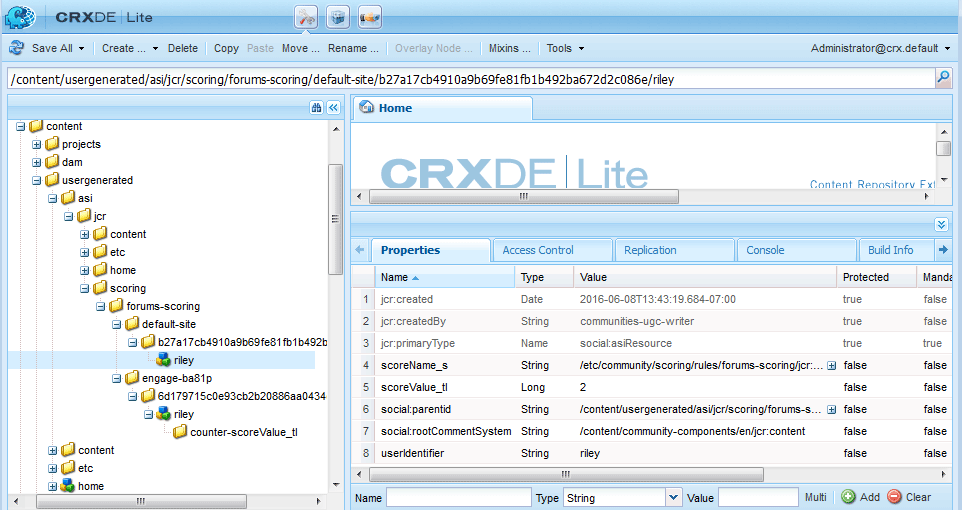

# Scores en Badges Essentials {#scoring-and-badges-essentials}

De AEM Communities-functie voor scoren en badges identificeert en beloont leden van de gemeenschap.

De details van het instellen van de functie worden beschreven op

* [Scores en badges van gemeenschappen](/help/communities/implementing-scoring.md)

Deze pagina bevat aanvullende technische gegevens:

* Hoe te [ een badge ](#displaying-badges) als of beeld of tekst tonen
* Hoe te om uitgebreide [ aan te zetten zuivert registreren ](#debug-log-for-scoring-and-badging)
* Hoe te [ toegang UGC ](#ugc-for-scoring-and-badging) verwant met het scoren en het intekenen

>[!CAUTION]
>
>De in CRXDE Lite zichtbare implementatiestructuur kan worden gewijzigd.

## Badges weergeven {#displaying-badges}

Of een badge als tekst of beeld wordt getoond wordt gecontroleerd op de cliëntkant in het malplaatje van GB.

Zoek bijvoorbeeld naar `this.isAssigned` in `/libs/social/forum/components/hbs/topic/list-item.hbs` :

```
{{#each author.badges}}

  {{#if this.isAssigned}}

    <div class="scf-badge-text">

      {{this.title}}

    </div>

  {{/if}}

{{/each}}

{{#each author.badges}}

  {{#unless this.isAssigned}}

    

  {{/unless}}

{{/each}}
```

Indien waar (true), geeft `isAssigned` aan dat de badge is toegewezen voor een rol en dat de badge moet worden weergegeven als tekst.

Als de waarde false is, geeft `isAssigned` aan dat de badge is toegekend voor een verdiende score en dat de badge moet worden weergegeven als een afbeelding.

Wijzigingen in dit gedrag moeten worden aangebracht in een aangepast script (overschrijven of bedekken). Zie [ Cliënt-kant Aanpassing ](/help/communities/client-customize.md).

## Foutopsporingslogboek voor score en Badging {#debug-log-for-scoring-and-badging}

Voor foutopsporing in scores en badging kunt u een aangepast logbestand instellen. De inhoud van dit logbestand kan dan aan de klantenondersteuning worden verstrekt als er problemen met de functie worden ondervonden.

Voor gedetailleerde instructies, leidt het bezoek [ tot een Dossier van het Logboek van de Douane ](/help/sites-deploying/monitoring-and-maintaining.md#create-a-custom-log-file).

U kunt als volgt snel een logbestand instellen:

1. Heb toegang tot de **Steun van het Logboek van de Console van Adobe Experience Manager**, bijvoorbeeld

   * https://localhost:4502/system/console/slinglog

1. Selecteer **nieuwe registreerapparaat** toevoegen

   1. Selecteer `DEBUG` voor **Niveau van het Logboek**

   1. Ga een naam voor **Dossier van het Logboek** in, bijvoorbeeld

      * logs/scoring-debug.log

   1. Ga twee **Logger** (klasse) ingangen in (gebruikend `+` pictogram)

      * `com.adobe.cq.social.scoring`
      * `com.adobe.cq.social.badging`

   1. Selecteer **sparen**


Logboekvermeldingen weergeven:

* Vanuit de webconsole

   * Onder het **menu van de Status**
   * Selecteer **Dossiers van het Logboek**
   * Zoeken naar de naam van het logbestand, bijvoorbeeld `scoring-debug`

* Op de lokale schijf van de server

   * Het logboekdossier is bij &lt;*server-installeer-dir*>/crx-quickstart/logs/&lt; *logboek-dossier-name*>.log

   * Bijvoorbeeld: `.../crx-quickstart/logs/scoring-debug.log`


## UGC voor scores en Badging {#ugc-for-scoring-and-badging}

Het is mogelijk om UGC met betrekking tot het scoring en het aanbrengen van merktekens te bekijken wanneer gekozen SRP of JSRP of MSRP, maar niet ASRP is. (Als niet vertrouwd met deze termijnen, zie [ Communautaire Opslag van de Inhoud ](/help/communities/working-with-srp.md) en [ het Overzicht van de Leverancier van het Middel van de Opslag ](/help/communities/srp.md).)

De beschrijvingen voor de toegang tot van het scoren en het merkingsgegevensgebruik JSRP, aangezien UGC gemakkelijk toegankelijk is gebruikend [ CRXDE Lite ](/help/sites-developing/developing-with-crxde-lite.md).

**JSRP op auteur**: het experimenteren in het auteursmilieu resulteert in UGC die slechts van het auteursmilieu zichtbaar is.

**JSRP op publiceert**: zo ook, als het testen op het publiceer milieu, is het noodzakelijk om tot CRXDE Lite met administratieve voorrechten op tot te gaan publiceer instantie. Als publiceer instantie op [ productiemodus ](/help/sites-administering/production-ready.md) loopt (nosamplcontent looppas wijze), is het noodzakelijk om [ CRXDE Lite ](/help/sites-administering/enabling-crxde-lite.md) toe te laten.

De basislocatie van UGC op JSRP is `/content/usergenerated/asi/jcr/` .

### API&#39;s voor scores en Badging {#scoring-and-badging-apis}

De volgende API&#39;s zijn beschikbaar voor gebruik:

* [ com.adobe.cq.social.scoring.api in 6.3 ](https://experienceleague.adobe.com/docs/experience-manager-release-information/aem-release-updates/previous-updates/aem-previous-versions.html?lang=nl-NL)
* [ com.adobe.cq.social.badging.api in 6.3 ](https://experienceleague.adobe.com/docs/experience-manager-release-information/aem-release-updates/previous-updates/aem-previous-versions.html?lang=nl-NL)

De recentste JavaDocs voor het geïnstalleerde eigenschappak zijn beschikbaar aan ontwikkelaars van de bewaarplaats van de Adobe. Zie [ Gebruikend Gemaakt voor Gemeenschappen: JavaDocs ](/help/communities/maven.md#javadocs).

**de plaats en het formaat van UGC in de bewaarplaats zijn onderworpen aan verandering zonder waarschuwing**.

### Voorbeeld instellen {#example-setup}

De screenshots van dataopslaggegevens zijn afkomstig van het instellen van scoring en badging voor een forum op twee verschillende AEM sites:

1. Een AEM plaats *met* unieke identiteitskaart (communautaire die plaats wordt gecreeerd gebruikend tovenaar):

   * Het gebruiken van het Begonnen Leerprogramma (verbind) plaats die tijdens het [ wordt gecreeerd begonnen leerprogramma ](/help/communities/getting-started.md)
   * Zoek het knooppunt voor forumpagina

     `/content/sites/engage/en/forum/jcr:content`

   * Eigenschappen voor scoring en badges toevoegen

   ```
   scoringRules = [/libs/settings/community/scoring/rules/comments-scoring,
   /libs/settings/community/scoring/rules/forums-scoring]
   ```

   ```
   badgingRules =[/libs/settings/community/badging/rules/comments-scoring,
   /libs/settings/community/badging/rules/forums-scoring]
   ```

   * Zoek het knooppunt voor de forumcomponent

     `/content/sites/engage/en/forum/jcr:content/content/primary/forum`
( `sling:resourceType = social/forum/components/hbs/forum` )

   * Om badges weer te geven, voegt u eigenschap toe

     `allowBadges = true`

   * Een gebruiker ondertekent in, maakt een forumonderwerp en krijgt een bronzen badge toegewezen

1. Een AEM plaats *zonder* unieke identiteitskaart:

   * Het gebruiken van de [ gids van Componenten Community ](/help/communities/components-guide.md)
   * Zoek het knooppunt voor forumpagina

     `/content/community-components/en/forum/jcr:content`

   * Eigenschappen voor scoring en badges toevoegen

   ```
   scoringRules = [/libs/settings/community/scoring/rules/comments-scoring,
   /libs/settings/community/scoring/rules/forums-scoring]
   ```

   ```
   badgingRules =[/libs/settings/community/badging/rules/comments-badging,
   /libs/settings/community/badging/rules/forums-badging]
   ```

   * Zoek het knooppunt voor de forumcomponent

     `/content/community-components/en/forum/jcr:content/content/forum`
( `sling:resourceType = social/forum/components/hbs/forum` )

   * Om badges weer te geven, voegt u eigenschap toe

     `allowBadges = true`

   * Een gebruiker ondertekent in, maakt een forumonderwerp en krijgt een bronzen badge toegewezen

1. Aan een gebruiker wordt een moderatorbadge toegewezen via cURL:

   ```shell
   curl -i -X POST -H "Accept:application/json" -u admin:admin -F ":operation=social:assignBadge" -F "badgeContentPath=/libs/settings/community/badging/images/moderator/jcr:content/moderator.png" https://localhost:4503/home/users/community/w271OOup2Z4DjnOQrviv/profile.social.json
   ```

   Aangezien een gebruiker twee bronzen badges heeft verdiend en een moderatorbadge heeft gekregen, verschijnt de gebruiker met zijn forumingang als volgt:

   

>[!NOTE]
>
>In dit voorbeeld worden de volgende aanbevolen procedures niet gevolgd:
>
>* Namen van scores voor regels moeten globaal uniek zijn; ze mogen niet eindigen met dezelfde naam.
>
>  Een voorbeeld van wat *niet* te doen:
>
>  /libs/settings/community/scoring/rules/site1/forums-scoring
>  /libs/settings/community/scoring/rules/site2/forums-scoring
>
>* Unieke badge-afbeeldingen maken voor verschillende AEM sites

### Toegang tot UGC-score {#access-scoring-ugc}

Het gebruik van [ APIs ](#scoring-and-badging-apis) heeft de voorkeur.

Voor onderzoeksdoeleinden, gebruikend JSRP bijvoorbeeld, is de basisomslag die scores bevat

* `/content/usergenerated/asi/jcr/scoring`

Het onderliggende knooppunt van `scoring` is de naam van de scoreregel. Daarom is het aan te raden om regelnamen op een server globaal uniek te scoren.

Voor de Geometrixx Engage-site bevinden de gebruiker en de bijbehorende score zich in een pad dat is samengesteld met de naam van de scoreregel, de site-id van de community ( `engage-ba81p` ), een unieke id en de id van de gebruiker:

* `.../scoring/forums-scoring/engage-ba81p/6d179715c0e93cb2b20886aa0434ca9b5a540401/riley`

Voor de Community Components-hulplijnsite bevinden de gebruiker en hun score zich in een pad dat is samengesteld met de naam van de scoreregel, een standaard-id ( `default-site` ), een unieke id en de id van de gebruiker:

* `.../scoring/forums-scoring/default-site/b27a17cb4910a9b69fe81fb1b492ba672d2c086e/riley`

De score wordt opgeslagen in de eigenschap `scoreValue_tl` die alleen een waarde kan bevatten of indirect naar een atomicCounter kan verwijzen.



### Access Badging UGC {#access-badging-ugc}

Het gebruik van [ APIs ](#scoring-and-badging-apis) heeft de voorkeur.

Voor onderzoeksdoeleinden, gebruikend JSRP bijvoorbeeld, is de basisomslag die informatie over toegewezen of toegekende badges bevat

* `/content/usergenerated/asi/jcr`

Wordt gevolgd door het pad naar het gebruikersprofiel en eindigt in een map met badges, zoals:

* `/home/users/community/w271OOup2Z4DjnOQrviv/profile/badges`

#### Toegewezen badge {#awarded-badge}


#### Toegewezen badge {#assigned-badge}


## Aanvullende informatie {#additional-information}

Een gesorteerde lijst met leden weergeven op basis van punten:

* [ functie van Leaderboard ](/help/communities/functions.md#leaderboard-function) voor opneming in een communautaire plaats of groepsmalplaatje.
* [ component Leaderboard ](/help/communities/enabling-leaderboard.md), de gekenmerkte component van de functie Leaderboard, voor paginacreatie.
