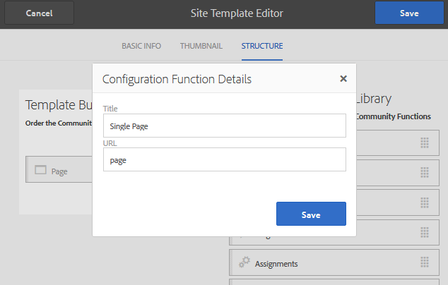

# Een voorbeeldpagina maken {#create-a-sample-page}

Vanaf AEM 6.1 Gemeenschappen is de eenvoudigste manier om een voorbeeldpagina te maken een eenvoudige gemeenschapssite te maken, die bestaat uit een functie Pagina.

Dit omvat een component parsys zodat u componenten voor creatie [&#128279;](basics.md#accessing-communities-components) kunt  toelaten.

Een andere optie voor exploratie met steekproefcomponenten moet de eigenschappen gebruiken die in de [&#x200B; Gids van Communautaire Componenten &#x200B;](components-guide.md) worden voorgesteld.

## Een Community-site maken {#create-a-community-site}

Dit is gelijkaardig aan het creëren van een plaats die in [&#x200B; wordt beschreven Begonnen die met AEM Communities &#x200B;](getting-started.md).

Het belangrijkste verschil is dat dit leerprogramma tot een malplaatje van de communautaire plaats leidt dat slechts de [&#x200B; functie van de Pagina &#x200B;](functions.md#page-function) bevat om een eenvoudige communautaire plaats tot stand te brengen. Het doet dit vrij van andere eigenschappen (behalve de pre-getelegrafeerde eigenschappen fundamenteel voor alle communautaire plaatsen).

### Nieuw sitesjabloon maken {#create-new-site-template}

Om begonnen te worden, creeer een eenvoudig [&#x200B; malplaatje van de communautaire plaats &#x200B;](sites.md).

Selecteer **[!UICONTROL Tools]** > **[!UICONTROL Communities]** > **[!UICONTROL Site Templates]** bij globale navigatie op een auteurinstantie.

* Selecteren `Create button`
* BASISINFO

   * `Name`: Sjabloon voor één pagina
   * `Description`: Een sjabloon die bestaat uit een functie Eén pagina.
   * Selecteren `Enabled`

* STRUCTUUR

   * Sleep een functie `Page` naar de Sjabloonbouwer
   * Voor de details van de Functie van de Configuratie, ga

      * `Title`: Eén pagina
      * `URL`: pagina

* Selecteer **`Save`** voor de configuratie
* Selecteer **`Save`** voor de sitesjabloon

### Nieuwe community-site maken {#create-new-community-site}

Maak nu een communitysite op basis van de eenvoudige sitesjabloon.

Selecteer na het maken van de sitesjabloon voor globale navigatie **[!UICONTROL Communities > Sites]** .

* Pictogram Selecteren **`Create`**

* Stap `1 - Site Template`

   * `Title`: eenvoudige communitysite
   * `Description`: Een communautaire site die bestaat uit één pagina voor experimenten.
   * `Community Site Root: (leave blank)`
   * `Community Site Base Language: English`
   * `Name` : voorbeeld

      * url = http://localhost:4502/content/sites/sample

      * `Template`: kies `Single Page Template`

     

* Selecteren `Next`
* Stap `2 - Design`

   * Elk ontwerp selecteren

* Selecteren `Next`
* Selecteren `Next`

  (Alle standaardinstellingen accepteren)

* Selecteren `Create`

  

## De site Publish {#publish-the-site}

Van de [&#x200B; console van communautaire plaatsen &#x200B;](sites-console.md), selecteer het publicatiepictogram om de plaats, door gebrek aan http://localhost:4503 te publiceren.

## Site openen op auteur in bewerkingsmodus {#open-the-site-on-author-in-edit-mode}

Selecteer het pictogram van de geopende site zodat u de site in de bewerkingsmodus kunt bekijken.

URL is [&#x200B; http://localhost:4502/editor.html/content/sites/sample/en.html](http://localhost:4502/editor.html/content/sites/sample/en.html)

Op de eenvoudige homepage, is het mogelijk om te zien wat door de communautaire functies en malplaatjes vooraf wordt getelegrafeerd, en spel met het toevoegen en het vormen van communautaire componenten.

## Site weergeven op Publish {#view-site-on-publish}

Na het publiceren van de pagina, open de pagina op [&#x200B; publiceer instantie &#x200B;](http://localhost:4503/content/sites/sample/en.html) om met de eigenschappen als anonieme plaatsbezoeker, in lid, of een beheerder te experimenteren. De verbinding van het Beleid zichtbaar in het auteursmilieu verschijnt niet in publiceer milieu tenzij een beheerder binnen ondertekent.
