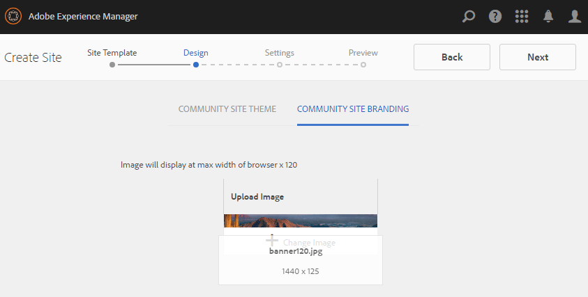

# Auteur van een nieuwe communautaire site{#author-a-new-community-site}

## Een Community-site maken {#create-a-community-site}

Gebruik de auteur instantie om een communautaire plaats tot stand te brengen. Instantie van AEM-auteur:

1. Meld u aan met beheerdersrechten.
1. Ga van globale navigatie naar **[!UICONTROL Communities]** > **[!UICONTROL Sites]**.

De console van de Plaatsen van Gemeenschappen verstrekt een tovenaar om door de stappen te begeleiden om een communautaire plaats tot stand te brengen. Het is mogelijk verder te gaan naar de `Next` stap of `Back` naar de vorige stap voordat u de site in de laatste stap toewijst.

Ga als volgt te werk om een nieuwe communitysite te maken:

* Selecteer `Create` knop.

### Stap 1: Sitesjabloon {#step-site-template}

Op de [Sjabloonstap voor site](/help/communities/sites-console.md#step2013asitetemplate)Voer een titel, beschrijving, naam voor de URL in en selecteer een sjabloon voor een community-site, bijvoorbeeld:

* **Titel van gemeenschapssite**: `Getting Started Tutorial`
* **Beschrijving van community-site**: `A site for engaging with the community.`
* **Hoofdmap van gemeenschapssite**: (leeg laten voor standaardhoofdmap `/content/sites`)
* **Cloudconfiguraties**: (leeg laten als er geen cloudconfiguraties zijn opgegeven) het pad naar de opgegeven cloudconfiguraties bieden.
* **Basis van gemeenschapssite**: (ongewijzigd laten voor één taal: Engels) gebruik de drop-down lijst om één te kiezen *of meer* basistalen uit de beschikbare talen: Duits, Italiaans, Frans, Japans, Spaans, Portugees (Brazilië), Chinees (traditioneel) en Chinees (vereenvoudigd). Er wordt één communitysite gemaakt voor elke toegevoegde taal en deze site bestaat in dezelfde sitemap volgens de in [Inhoud vertalen voor meertalige sites](/help/sites-administering/translation.md). De hoofdpagina van elke site bevat een onderliggende pagina met de taalcode van een van de geselecteerde talen, zoals &#39;en&#39; voor Engels of &#39;fr&#39; voor Frans.

* **Naam van communautaire site**: aangaan

   * Controleer de naam tweemaal omdat deze na het maken van de site niet gemakkelijk kan worden gewijzigd
   * De eerste URL wordt onder de naam van de communautaire site weergegeven
   * Voeg voor een geldige URL een basistaalcode + &quot;.html&quot; toe
   * *Bijvoorbeeld*, https://localhost:4502/content/sites/ `engage/en.html`

* **Sjabloon**: naar beneden halen om te kiezen `Reference Site`

* Selecteren **Volgende**.

### Stap 2: Ontwerp {#step-design}

De stap Ontwerp wordt in twee secties weergegeven voor het selecteren van het thema en de brandbanner:

#### COMMUNAUTAIR SITE-THEMA {#community-site-theme}

Selecteer de gewenste stijl die u op de sjabloon wilt toepassen. Als deze optie is geselecteerd, wordt op het thema een vinkje weergegeven.

#### COMMUNAUTAIRE SITOBRANDING {#community-site-branding}

(Optioneel) Upload een bannerafbeelding voor weergave op de sitepagina&#39;s. De banner is vastgezet aan de linkerrand van browser, tussen de communautaire plaatsheader en navigatiekoppelingen. De bannerhoogte wordt bijgesneden tot 120 pixels. Er wordt geen grootte van de banner aangepast aan de breedte van de browser en de hoogte van 120 pixels.

Selecteren **Volgende**.

### Stap 3: Instellingen {#step-settings}

Selecteer in de stap Instellingen voordat u `Next`, merk op dat er zeven secties zijn die toegang verlenen tot configuraties die gebruikersbeheer, tags, moderatie, groepsbeheer, analyses, vertaling en activering omvatten.

Ga naar [Aan de slag met AEM Communities for Enablement](/help/communities/getting-started-enablement.md) zelfstudie voor het werken met de functies voor activering.

#### Gebruikersbeheer {#user-management}

Alle selectievakjes inschakelen voor [Gebruikersbeheer](/help/communities/sites-console.md#user-management)

* Sitebezoekers toestaan zich te registreren
* Site-bezoekers toestaan de site weer te geven zonder zich aan te melden
* Leden toestaan berichten van andere leden van de gemeenschap te verzenden en te ontvangen
* Aanmelden met Facebook toestaan in plaats van zich te registreren en een profiel te maken
* Aanmelden met Twitter toestaan in plaats van zich te registreren en een profiel te maken

>[!NOTE]
>
>Voor een productieomgeving is het nodig om aangepaste Facebook- en Twitter-toepassingen te maken. Zie [Sociale aanmelding met Facebook en Twitter](/help/communities/social-login.md).

#### TAGS {#tagging}

De tags die kunnen worden toegepast op community-inhoud, worden beheerd door AEM naamruimten te selecteren die eerder zijn gedefinieerd via de [Tagingsconsole](/help/sites-administering/tags.md#tagging-console) (zoals de [Naamruimte voor zelfstudie](/help/communities/setup.md#create-tutorial-tags)).

Het zoeken naar naamruimten is eenvoudig met &#39;type-ahead&#39;-zoekopdracht. Bijvoorbeeld,

* Type `tut`
* Selecteer `Tutorial`

#### ROLES {#roles}

[Rol van leden van de Gemeenschap](/help/communities/users.md) worden toegewezen via de instellingen in de sectie Rollen.

Als u een lid van de gemeenschap (of groep leden) de site wilt laten ervaren als gemeenschapsbeheerder, gebruikt u de typecontrole en selecteert u de naam van het lid of de groep in de keuzelijst.

Bijvoorbeeld,

* Type `q`
* Selecteren [Quinn Harper](/help/communities/enablement-setup.md#publishcreateenablementmembers)

>[!NOTE]
>
>[Tunneldienst](https://helpx.adobe.com/experience-manager/6-3/help/communities/deploy-communities.html#tunnel-service-on-author) Hiermee kunt u leden en groepen selecteren die alleen in de publicatieomgeving aanwezig zijn.

#### MODERING {#moderation}

Accepteer de standaard algemene instellingen voor [gematigd](/help/communities/sites-console.md#moderation) door de gebruiker gegenereerde inhoud (UGC).

#### ANALYSE {#analytics}

Als Adobe Analytics een licentie heeft en er een cloudservice en -framework voor Analytics zijn geconfigureerd, is het mogelijk Analytics in te schakelen en het framework te selecteren.

Zie [Analytische configuratie voor functies van Gemeenschappen](/help/communities/analytics.md).

#### VERTALING {#translation}

De [Vertaalinstellingen](/help/communities/sites-console.md#translation) de basistaal voor de site en of UGC al dan niet kan worden vertaald en in welke taal, indien dat het geval is.

* Controleren **Machinevertaling toestaan**
* Laat standaardtalen geselecteerd blijven voor vertaling door de standaardvertaalservice voor machines
* Standaard vertaalprovider en config laten staan
* Er is geen behoefte aan een globale opslag omdat er geen taalexemplaren zijn
* Selecteren **Gehele pagina vertalen**
* De optie Standaardpersistentie behouden

#### UITSCHAKELING {#enablement}

Laat leeg als u een betrokkenheidsgemeenschap maakt.

Voor een vergelijkbare zelfstudie kunt u snel een [enablement community](/help/communities/overview.md#enablement-community), zie [Aan de slag met AEM Communities for Enablement](/help/communities/getting-started-enablement.md).

Selecteren **Volgende**.

### Stap 4: Communitysite maken {#step-create-communities-site}

Selecteer **Maken.**

Wanneer het proces is voltooid, wordt de map voor de nieuwe site weergegeven in de console Communities - Sites.

## De Community-site publiceren {#publish-the-community-site}

De gecreeerde plaats zou van de Gemeenschappen - de console van Plaatsen moeten worden beheerd, de zelfde console van waar de nieuwe plaatsen kunnen worden gecreeerd.

Nadat u de map van de communitysite hebt geselecteerd om deze te openen, houdt u de muisaanwijzer boven het sitepictogram, zodat er vier actiepictogrammen worden weergegeven:

Als u het vierde ovalenpictogram selecteert (Meer handelingen), worden de opties Site exporteren en Site verwijderen weergegeven.

Van links naar rechts zijn ze:

* **Site openen**

   Selecteer het potloodpictogram om de gemeenschapssite te openen in de modus Bewerken door auteur om paginacomponenten toe te voegen en/of te configureren

* **Site bewerken**

   Selecteer het eigenschappenpictogram om de communitysite te openen voor wijziging van eigenschappen, zoals de titel of om het thema te wijzigen

* **Site publiceren**

   Selecteer het wereldpictogram om de communitysite te publiceren (bijvoorbeeld als uw publicatieserver op uw lokale computer wordt uitgevoerd en vervolgens standaard naar localhost:4503)

* **Site exporteren**

   Selecteer het exportpictogram om een pakket te maken van de communitysite waarin beide zijn opgeslagen [pakketbeheer](/help/sites-administering/package-manager.md) en gedownload.
UGC is niet opgenomen in het sitepakket.

* **Site verwijderen**

   Selecteer het verwijderpictogram om de communitysite van binnenuit te verwijderen **[!UICONTROL Communities > Sites console]**. Met deze actie verwijdert u alle items die aan de site zijn gekoppeld, zoals UGC, gebruikersgroepen, elementen en databaserecords.

>[!NOTE]
>
>Als het gebruiken van standaardhaven 4503 voor publiceer instantie, dan geef de standaard replicatieagent uit om het havenaantal aan de correcte waarde te plaatsen.
>
>In de auteurinstantie, van het belangrijkste menu:
>
>1. Navigeren naar **[!UICONTROL Tools]** > **[!UICONTROL Operations]** > **[!UICONTROL Replication]** -menu.
>1. Selecteer **[!UICONTROL Agents on author]**.
>1. Selecteer **[!UICONTROL Default Agent (publish)]**.
>1. Volgende tot **[!UICONTROL Settings]**, selecteert u **[!UICONTROL Edit]**.
>1. Selecteer in het pop-updialoogvenster Agent-instellingen de optie **[!UICONTROL Transport]** tab.
>1. Wijzig in URI het poortnummer 4503 in het gewenste poortnummer. Als u bijvoorbeeld poort 6103 wilt gebruiken: https://localhost:6103/bin/receive?sling:authRequestLogin=1
>1. Selecteer **[!UICONTROL OK]**.
>1. (Optioneel) Selecteer **[!UICONTROL Clear]** of **[!UICONTROL Force Retry]** om de replicatiewachtrij opnieuw in te stellen.

### Publiceren selecteren {#select-publish}

Nadat u ervoor hebt gezorgd dat de publicatieserver actief is, selecteert u het wereldpictogram om de communitysite te publiceren.

Wanneer de communitysite met succes is gepubliceerd, wordt kort het bericht &#39;Site gepubliceerd&#39; weergegeven.

### Nieuwe gebruikersgroepen in de community {#new-community-user-groups}

Samen met de nieuwe communautaire plaats, worden de nieuwe gebruikersgroepen gecreeerd die de aangewezen toestemmingen hebben die voor diverse administratieve functies worden geplaatst. Ga voor meer informatie naar [Gebruikersgroepen voor communitysites](/help/communities/users.md#usergroupsforcommunitysites).

Voor deze nieuwe communautaire plaats, gezien de plaatsnaam &quot;verbind&quot;in Stap 1, kunnen de vier nieuwe gebruikersgroepen van worden gezien [Groepsconsole](/help/communities/members.md) (globale navigatie: Gemeenschappen, groepen):

* Community-managers voor community inschakelen
* Gemeenschapsgroepsbeheerders
* Samenvoegingsleden van gemeenschap
* Maatschappelijke experts
* Geprivilegieerde leden van Community Engineering
* Community Engineering Site-inhoudsbeheer

Let op: [Aaron McDonald](/help/communities/tutorials.md#demo-users) lid is van

* Community-managers voor community inschakelen
* Maatschappelijke experts
* Community Engage-leden (indirect als lid van de groep Moderatoren)

#### https://localhost:4503/content/sites/engage/en.html {#http-localhost-content-sites-engage-en-html}

## Configureren voor verificatiefout {#configure-for-authentication-error}

Nadat een site is geconfigureerd en geduwd op publiceren, [aanmeldingstoewijzing configureren](/help/communities/sites-console.md#configure-for-authentication-error) ( `Adobe Granite Login Selector Authentication Handler`) op het publicatieexemplaar. Het voordeel is dat als de aanmeldingsgegevens niet correct zijn ingevoerd, de verificatiefout de aanmeldingspagina van de communautaire site opnieuw weergeeft met een foutbericht.

Voeg een `Login Page Mapping` als

* `/content/sites/engage/en/signin:/content/sites/engage/en`

## Optionele stappen {#optional-steps}

### De standaardstartpagina wijzigen {#change-the-default-home-page}

Als u met de publicatiesite werkt voor demonstratiedoeleinden, is het handig om de standaardstartpagina te wijzigen in de nieuwe site.

Hiervoor is het gebruik van [CRXDE](https://localhost:4503/crx/de) Lite om de [resourcetoewijzing](/help/sites-deploying/resource-mapping.md) publicatietabel.

Aan de slag:

1. Meld u aan bij een publicatieexemplaar met beheerdersrechten.
1. Bladeren naar [https://localhost:4503/crx/de](https://localhost:4503/crx/de).
1. Vouw in de projectbrowser uit `/etc/map.`
1. Selecteer `http` knooppunt:

   * Selecteren **Knooppunt maken:**

      * **Naam** localhost.4503 (do *niet* use &#39;:&#39;)

      * **Type** [schuintrekken:toewijzen](https://sling.apache.org/documentation/the-sling-engine/mappings-for-resource-resolution.html)

1. Met nieuw gemaakt `localhost.4503` geselecteerd knooppunt:

   * Eigenschap toevoegen:

   * **Naam** sling:match
      * **Type** String
      * **Waarde** localhost.4503/$ (moet eindigen met &#39;$&#39; teken)
   * Eigenschap toevoegen:

      * **Naam** sling:internalRedirect
      * **Type** String
      * **Waarde** /content/sites/engage/en.html

1. Selecteren **Alles opslaan.**
1. (Optioneel) Verwijder de browsergeschiedenis.
1. Ga naar https://localhost:4503/.

   * Ga naar https://localhost:4503/content/sites/engage/en.html

>[!NOTE]
>
>Als u wilt uitschakelen, voegt u gewoon een voorvoegsel toe aan de `sling:match` eigenschapswaarde met een &#39;x&#39; - `xlocalhost.4503/$` - en **Alles opslaan**.

#### Problemen oplossen: Fout bij opslaan van kaart {#troubleshooting-error-saving-map}

Als u de wijzigingen niet kunt opslaan, controleert u of de knooppuntnaam `localhost.4503`, met een &#39;punt&#39;-scheidingsteken, en niet `localhost:4503` met een &#39;dubbele punt&#39;-scheidingsteken, als `localhost`is geen geldig naamruimtevoorvoegsel.

#### Problemen oplossen: Doorsturen mislukt {#troubleshooting-fail-to-redirect}

De &#39;**$**&#39; aan het einde van de reguliere expressie `sling:match`tekenreeks is van cruciaal belang, zodat alleen `https://localhost:4503/` wordt toegewezen, anders wordt de omleidingswaarde gepresteerd aan om het even welk weg die na server zou kunnen bestaan:haven in URL. Wanneer AEM probeert om naar de aanmeldingspagina om te leiden, mislukt dit.

### De site wijzigen {#modify-the-site}

Nadat de site voor het eerst is gemaakt, kunnen auteurs de opdracht [Site openen, pictogram](/help/communities/sites-console.md#authoring-site-content) standaardinstellingen voor AEM ontwerpactiviteiten uit te voeren.

Daarnaast kunnen beheerders de opdracht [Site-pictogram bewerken](/help/communities/sites-console.md#modifying-site-properties) om eigenschappen van de site te wijzigen, zoals de titel.

Vergeet niet om na elke wijziging **Opslaan** en re-**Publiceren** de site.

>[!NOTE]
>
>Als u niet bekend bent met AEM, kunt u de documentatie raadplegen op [basisbehandeling](/help/sites-authoring/basic-handling.md) en [snelle handleiding voor het ontwerpen van pagina&#39;s](/help/sites-authoring/qg-page-authoring.md).
