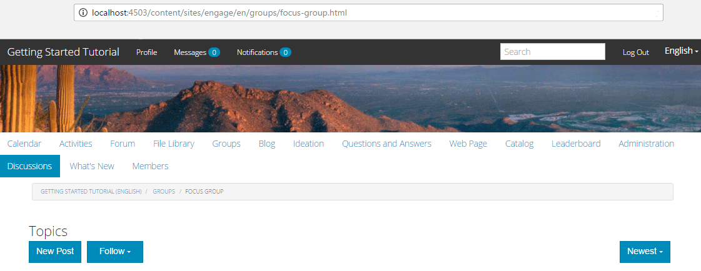

# Communautaire groepen {#community-groups}

De eigenschap van communautaire groepen is de capaciteit voor een subcommunity dynamisch om binnen een communautaire plaats door erkende gebruikers (leden van de gemeenschap en auteurs) van de publicatie en auteursmilieu&#39;s worden gecreeerd.

Deze mogelijkheid is aanwezig wanneer de functie  Groepen aanwezig is in de structuur van de [community-site](/help/communities/sites-console.md) .

Een malplaatje [van de](/help/communities/tools-groups.md) communautaire groep verstrekt het ontwerp van de pagina van de communautaire groep wanneer een communautaire groep dynamisch wordt gecreeerd.

Een of meer groepssjablonen worden geselecteerd voor de groepsfunctie wanneer de functie wordt toegevoegd aan de structuur van een gemeenschapssite of aan een sjabloon voor een gemeenschapssite. Deze lijst van groepsmalplaatjes wordt voorgesteld aan het lid of de auteur die dynamisch tot een nieuwe groep van binnen de communautaire plaats leidt.

## Een nieuwe groep maken {#creating-a-new-group}

De capaciteit om een nieuwe communautaire groep tot stand te brengen baseert zich op het bestaan van een communautaire plaats die de groepsfunctie omvat, zoals die van het Malplaatje [van de Plaats van de](/help/communities/sites.md)Verwijzing wordt gecreeerd.

De volgende voorbeelden maken gebruik van de communitysite die is gemaakt op basis van de `Reference Site Template` beschrijving in de zelfstudie [Aan de slag met AEM Communities](/help/communities/getting-started.md) .

Dit is de pagina die wordt geladen bij publiceren wanneer de menuoptie **Groepen** wordt geselecteerd:

Wanneer u het pictogram **Nieuwe groep** selecteert, wordt een dialoogvenster voor bewerken geopend.

Op het tabblad **Instellingen** geeft u de basisfuncties van de groep op:

* **Groepsnaam**

   De titel van de groep die op de communitysite moet worden weergegeven.

* **Beschrijving**

   Een beschrijving van de groep die op de communitysite moet worden weergegeven.

* **Uitnodigen**

   Een lijst met leden die moeten worden uitgenodigd om deel te nemen aan de groep. Bij het zoeken naar vooraf bepaalde typen worden suggesties van leden van de gemeenschap geleverd die u wilt uitnodigen.

* **URL-naam groep**

   De naam voor de groepspagina die deel van URL wordt.

* **Groep openen**

   Als u `Open Group` deze optie selecteert, wordt aangegeven dat een anonieme sitebezoeker de inhoud kan bekijken en wordt de selectie opgeheven `Member Only Group`.

* **Groep alleen lid**

   Als u deze optie selecteert, `Member Only Group` worden alleen leden van de groep weergegeven die de inhoud kunnen weergeven. De selectie wordt opgeheven `Open Group`.

Onder het lusje van het **Malplaatje** is de capaciteit om van de lijst van communautaire groepsmalplaatjes te selecteren die werden gespecificeerd toen de groepsfunctie in de structuur van de communautaire plaats of in een malplaatje van de communautaire plaats werd omvat.

Onder het tabblad **Afbeelding** kunt u een afbeelding uploaden om deze voor de groep weer te geven op de pagina Groepen van de website van de gemeenschap. De afbeelding wordt op het standaardstijlblad vergroot tot 170 x 90 pixels.

Door de **Create knoop van de Groep** te selecteren, worden de pagina&#39;s voor de groep gecreeerd gebaseerd op het gekozen malplaatje, en een gebruikersgroep wordt gecreeerd voor lidmaatschap en de pagina van Groepen zal worden bijgewerkt om de nieuwe subcommunity te tonen.

De pagina Groepen met een nieuwe subcommunity met de naam &quot;Focus Group&quot;, waarvoor een afbeeldingsminiatuur is geüpload, ziet er bijvoorbeeld als volgt uit (nog steeds aangemeld als beheerder van een communitygroep):

Als u de `Focus Group` koppeling selecteert, wordt de pagina Focus Group in de browser geopend. Deze bevat een beginweergave op basis van de gekozen sjabloon en een submenu onder het menu van de hoofdsite van de community:

### Component Lijst van leden van groep Gemeenschap {#community-group-member-list-component}

De `Community Group Member List` component is bedoeld voor gebruik door ontwikkelaars van groepssjablonen.

### Additional Information {#additional-information}

Meer informatie vindt u op de pagina [Community Group Essentials](/help/communities/essentials-groups.md) voor ontwikkelaars.

Voor andere informatie met betrekking tot communitygroepen, bezoek de [Managing Gebruikers en Gebruikersgroepen](/help/communities/users.md).
