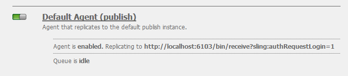

# Gemeenschappen inzetten{#deploying-communities}

## Vereisten {#prerequisites}

* [AEM 6,5 Platform](/help/sites-deploying/deploy.md)

* AEM Communities-licentie

* Optionele licenties voor:

   * [Functies van Adobe Analytics for Communities](/help/communities/analytics.md)
   * [MongoDB voor MSRP](/help/communities/msrp.md)
   * [Adobe Cloud voor ASRP](/help/communities/asrp.md)

## Controlelijst voor installatie {#installation-checklist}

**Voor het [AEM](/help/sites-deploying/deploy.md#what-is-aem)**

* De nieuwste [AEM 6.5-updates installeren](#aem64updates)

* Als het gebruiken van niet de standaardhavens (4502, 4503), dan [vorm replicatieagenten](#replication-agents-on-author)
* [De cryptotoets dupliceren](#replicate-the-crypto-key)
* Als ondersteuning wordt geboden voor globalization, [kunt u geautomatiseerde omzetting](/help/sites-administering/translation.md)instellen (voorbeeldinstallatie is beschikbaar voor ontwikkeling)

**Voor het vermogen van de [Gemeenschappen](/help/communities/overview.md)**

* Als het opstellen van [publiceer landbouwbedrijf](/help/sites-deploying/recommended-deploys.md#tarmk-farm), [identificeer de primaire uitgever](#primary-publisher)

* [De tunnelservice inschakelen](#tunnel-service-on-author)
* [Sociale aanmelding inschakelen](/help/communities/social-login.md#adobe-granite-oauth-authentication-handler)
* [Adobe Analytics configureren](/help/communities/analytics.md)
* Een [standaard e-mailservice instellen](/help/communities/email.md)
* Identificeer de keus voor [gedeelde opslag](/help/communities/working-with-srp.md) UGC (**SRP**)

   * Indien MongoDB SRP [(MSRP)](/help/communities/msrp.md)

      * [MongoDB installeren en configureren](/help/communities/msrp.md#mongodb-configuration)
      * [Solr configureren](/help/communities/solr.md)
      * [Selecteer MSRP](/help/communities/srp-config.md)
   * Indien relationele database SRP [(DSRP)](/help/communities/dsrp.md)

      * [Installeer het JDBC-stuurprogramma voor MySQL](#jdbc-driver-for-mysql)
      * [Installeer en vorm MySQL voor DSRP](/help/communities/dsrp-mysql.md)
      * [Solr configureren](/help/communities/solr.md)
      * [DSRP selecteren](/help/communities/srp-config.md)
   * Indien Adobe SRP [(ASRP)](/help/communities/asrp.md)

      * Met uw accountvertegenwoordiger samenwerken voor provisioning
      * [Selecteer ASRP](/help/communities/srp-config.md)
   * Indien JCR SRP [(JSRP)](/help/communities/jsrp.md)

      * Geen gedeelde UGC-opslag:

         * UGC wordt nooit gerepliceerd
         * UGC is alleen zichtbaar op AEM instantie of cluster waarin de UGC is ingevoerd

         * Standaard is JSRP
   Voor de functie **[enablement](/help/communities/overview.md#enablement-community)**

   * [Mpeg installeren en configureren](/help/communities/ffmpeg.md)
   * [Installeer het JDBC-stuurprogramma voor MySQL](#jdbc-driver-for-mysql)
   * [AEM Communities SCORM-engine installeren](#scorm-package)
   * [MySQL voor activering installeren en configureren](/help/communities/mysql.md)


## Latest Releases {#latest-releases}

AEM 6.5 Communautaire algemene vergadering omvat het communautaire pakket. Zie de opmerkingen bij de release [AEM 6.5 voor informatie over updates van AEM 6.5](/help/release-notes/release-notes.md#experiencemanagercommunities)Gemeenschappen [](/help/release-notes/release-notes.md#communities-release-notes.html).

### AEM 6.5 Updates {#aem-updates}

Vanaf AEM 6.4 worden updates aan de Gemeenschappen geleverd als onderdeel van AEM Cumulative Fix Packs en Service Packs.

Voor de nieuwste updates van AEM 6.5 raadpleegt u [Adobe Experience Manager 6.4 Cumulative Fix Packs en Service Packs](https://helpx.adobe.com/experience-manager/aem-releases-updates.html).

### Versiehistorie {#version-history}

Net als bij AEM 6.4 en hoger maken AEM Communities-functies en hotfixes deel uit van AEM Communities-pakketten voor cumulatieve probleemoplossingen en servicepacks. Er zijn dus geen aparte kenmerkpakketten.

### JDBC-stuurprogramma voor MySQL {#jdbc-driver-for-mysql}

Twee eigenschappen van Gemeenschappen gebruiken een gegevensbestand MySQL:

* Voor [activering](/help/communities/enablement.md): SCORM-activiteiten en -studenten opnemen
* Voor [DSRP](/help/communities/dsrp.md): door de gebruiker gegenereerde inhoud opslaan (UGC)

De MySQL-connector moet afzonderlijk worden opgehaald en geïnstalleerd.

De noodzakelijke stappen zijn:

1. Download het ZIP-archief van [https://dev.mysql.com/downloads/connector/j/](https://dev.mysql.com/downloads/connector/j/)

   * Versie moet >= 5.1.38 zijn

1. Extraheer mysql-connector-java-&lt;version>-bin.jar (bundel) uit het archief
1. Gebruik de webconsole om de bundel te installeren en te starten:

   * Bijvoorbeeld https://localhost:4502/system/console/bundles
   * Selecteer **`Install/Update`**
   * Bladeren... om de bundel te selecteren die uit het gedownloade ZIP-archief is geëxtraheerd
   * Controleer of het JDBC-stuurprogramma voor MySQLcom.mysql.jdbc *van* Oracle Corporation actief is en start dit als dat niet het geval is (of controleer de logboeken)

1. Als het installeren op een bestaande plaatsing nadat JDBC is gevormd, dan opnieuw bindt JDBC aan de nieuwe schakelaar door de configuratie JDBC van de Webconsole op te slaan:
   * Bijvoorbeeld https://localhost:4502/system/console/configMgr
   * Configuratie zoeken `Day Commons JDBC Connections Pool`
   * Selecteren om te openen
   * Selecteer `Save`

1. De stappen 3 en 4 op alle auteur herhalen en instanties publiceren

Meer informatie over het installeren van bundels vindt u op de pagina [Webconsole](/help/sites-deploying/web-console.md) .

#### Voorbeeld: MySQL-connectorbundel is geïnstalleerd {#example-installed-mysql-connector-bundle}


### SCORM-pakket {#scorm-package}

Shareable Content Object Reference Model (SCORM) is een verzameling standaarden en specificaties voor e-learning. SCORM definieert ook hoe inhoud kan worden verpakt in een overdraagbaar ZIP-bestand.

De AEM Communities SCORM-engine is vereist voor de functie [enablement](/help/communities/overview.md#enablement-community) . Scorepakketten ondersteund op AEM 6.5-gemeenschappen:

* [cq-social-scorm-package, versie 2.3.7](https://www.adobeaemcloud.com/content/marketplace/marketplaceProxy.html?packagePath=/content/companies/public/adobe/packages/cq650/social/scorm/cq-social-scorm-pkg) die de [SCORM 2017.1](https://rusticisoftware.com/blog/scorm-engine-2017-released/) -engine bevat.

**Een SCORM-pakket installeren**

1. Installeer het [cq-social-scorm-pakket, versie 2.3.7](https://www.adobeaemcloud.com/content/marketplace/marketplaceProxy.html?packagePath=/content/companies/public/adobe/packages/cq650/social/scorm/cq-social-scorm-pkg) van het Delen van het Pakket.
1. Download `/libs/social/config/scorm/database_scormengine_data.sql` van instantie cq en voer het in mysql server uit om een bevorderd schema te creëren scormEngineDB.
1. Voeg `/content/communities/scorm/RecordResults` in Uitgesloten bezit van Wegen in filter CSRF van `https://<hostname>:<port>/system/console/configMgr` op uitgevers toe.


#### SCORM-registratie {#scorm-logging}

Zoals geïnstalleerd, wordt al enablement activiteit uitgebreid geregistreerd aan de systeemconsole.

Indien gewenst, kan het logboekniveau aan WARN voor het `RusticiSoftware.*` pakket worden geplaatst.

Voor het werken met logboeken, zie het [Werken met de Verslagen van de Controle en de Dossiers](/help/sites-deploying/monitoring-and-maintaining.md#working-with-audit-records-and-log-files)van het Logboek.

### Geavanceerde MLS AEM {#aem-advanced-mls}

Voor de inzameling SRP (MSRP of DSRP) om geavanceerde meertalige onderzoek (MLS) te steunen, worden nieuwe stop-ins Solr vereist naast een douaneschema en de configuratie Solr. Alle vereiste items worden verpakt in een ZIP-bestand dat kan worden gedownload.

De geavanceerde MLS-download (ook wel &#39;phasetwo&#39; genoemd) is beschikbaar in de gegevensopslagruimte van de Adobe:

* [AEM-SOLR-MLS-fasetwo](https://repo.adobe.com/nexus/content/repositories/releases/com/adobe/tat/AEM-SOLR-MLS-phasetwo/1.2.40/)

   * Versie 1.2.40, 6 april 2016
   * Download AEM-SOLR-MLS-phasetwo-1.2.40.zip

Voor details en installatieinformatie, bezoek [Solr Configuratie](/help/communities/solr.md) voor SRP.

### Info over Koppelingen naar pakket delen {#about-links-to-package-share}

**Pakketten zichtbaar in Adobe AEM Cloud**

Voor de koppelingen naar pakketten op deze pagina is geen actieve versie van AEM vereist, aangezien deze op pakketshare moeten worden geplaatst `adobeaemcloud.com`. Terwijl de pakketten zichtbaar zijn, is de `Install` knop voor het installeren van de pakketten op een door Adobe gehoste site. Als u van plan bent op een lokale AEM te installeren, `Install` wordt er een fout gegenereerd.

**Installeren op lokale AEM**

Als u de pakketten wilt installeren die zichtbaar zijn in `adobeaemcloud.com` een lokale AEM-instantie, moet het pakket eerst naar een lokale schijf worden gedownload:

* Het tabblad **Middelen** selecteren
* Downloaden **naar schijf selecteren**

Gebruik pakketbeheer in de lokale AEM-instantie (bijvoorbeeld [https://localhost:4502/crx/packmgr/](https://localhost:4502/crx/packmgr/)) om te uploaden naar de lokale AEM pakketopslagplaats.

Als u het pakket ook opent via pakketshare van de lokale AEM-instantie (bijvoorbeeld [https://localhost:4502/crx/packageshare/](https://localhost:4502/crx/packageshare/)), wordt de `Download` knop gedownload naar de pakketopslagplaats van de lokale AEM-instantie.

Eenmaal in de pakketopslagplaats van de lokale AEM-instantie, gebruikt u pakketbeheer om het pakket te installeren.

Voor meer informatie, bezoek [hoe te met Pakketten](/help/sites-administering/package-manager.md#package-share)werken.

## Aanbevolen implementaties {#recommended-deployments}

In AEM Communities, wordt een gemeenschappelijke opslag gebruikt om gebruiker geproduceerde inhoud (UGC) op te slaan en vaak bedoeld als leverancier van [opslagmiddel (SRP)](/help/communities/working-with-srp.md). De geadviseerde plaatsingscentra bij het kiezen van een optie SRP voor de gemeenschappelijke opslag.

De gemeenschappelijke opslag steunt matiging van, en analyses op, UGC in het publicatiemilieu terwijl het elimineren van de behoefte aan [replicatie](/help/communities/sync.md) van UGC.

* [Community Content Store](/help/communities/working-with-srp.md) : bespreekt de opslagopties SRP voor AEM gemeenschappen

* [Aanbevolen topologieën](/help/communities/topologies.md) : bespreekt de topologie om afhankelijk van gebruiksgeval en keus te gebruiken SRP

## Bijwerken {#upgrading}

Wanneer u een upgrade uitvoert naar het AEM 6.5-platform van eerdere versies van AEM, is het belangrijk dat u [Upgrade naar AEM 6.5](/help/sites-deploying/upgrade.md)leest.

Lees, naast de upgrade van het platform, [Upgrade naar AEM Communities 6.5](/help/communities/upgrade.md) voor meer informatie over de wijzigingen in de Gemeenschappen.

## Configuraties {#configurations}

### Primaire uitgever {#primary-publisher}

Wanneer de gekozen plaatsing een [publicatielandbouwbedrijf](/help/communities/topologies.md#tarmk-publish-farm)is, dan moet één AEM publicatiegeval als **`primary publisher`** voor activiteiten worden geïdentificeerd die niet op alle gevallen, zoals eigenschappen zouden moeten voorkomen die op **berichten** of **Adobe Analytics** vertrouwen.

Door gebrek, wordt de configuratie `AEM Communities Publisher Configuration` OSGi gevormd met gecontroleerde **`Primary Publisher`** checkbox, zodat alle publiceer instanties in publiceer landbouwbedrijf zich als primair zou identificeren.

Daarom is het noodzakelijk om de configuratie op alle secundaire publiceer instanties **uit te** geven om **`Primary Publisher`** checkbox los te maken.


Voor alle andere (secundaire) publiceer instanties in publiceer landbouwbedrijf:

* Aanmelden met beheerdersrechten
* De [webconsole openen](/help/sites-deploying/configuring-osgi.md)

   * Bijvoorbeeld: [https://localhost:4503/system/console/configMgr](https://localhost:4503/system/console/configMgr)

* Zoek de `AEM Communities Publisher Configuration`
* Het bewerkingspictogram selecteren
* Schakel het vak **Primaire uitgever** uit
* Selecteer **Opslaan**

### Replicatieagents op auteur {#replication-agents-on-author}

De replicatie wordt gebruikt voor plaatsinhoud die in het publicatiemilieu, zoals communautaire groepen wordt gecreeerd, evenals het leiden van leden en lidgroepen van het auteursmilieu gebruikend de [tunneldienst](#tunnel-service-on-author).

Voor de primaire uitgever, zorg ervoor de Agent Config [van de](/help/sites-deploying/replication.md) Replicatie correct de publicatieserver en erkende gebruiker identificeert. De standaard gemachtigde gebruiker, heeft `admin,` reeds de aangewezen toestemmingen (is een lid van `Communities Administrators`).

Als een andere gebruiker over de juiste machtigingen beschikt, moet hij of zij als lid aan de `administrators` gebruikersgroep (ook een lid van `Communities Administrators`) worden toegevoegd.

Er zijn twee replicatieagenten in het auteursmilieu die de vervoerconfiguratie nodig hebben correct worden gevormd.

* De console van de Replicatie van de toegang op auteur

   * Navigeer vanuit globale navigatie naar **[!UICONTROL Tools]** > **[!UICONTROL Deployment]** > **[!UICONTROL Replication]** > **[!UICONTROL Agents on author]**

* Volg de zelfde procedure voor beide agenten:

   * **Standaardagent (publiceren)**
   * **Reverse Replication Agent (publiceren reverse)**

      1. Selecteer de agent
      1. Selecteer **bewerking**
      1. Selecteer het tabblad **Vervoer**
      1. Als er geen poort `4503`is, bewerkt u de **URI** om de juiste poort op te geven

      1. Als geen gebruiker `admin`, geef de **Gebruiker** en het **Wachtwoord** uit om een lid van de `administrators` gebruikersgroep te specificeren

In de volgende afbeeldingen ziet u de resultaten van het wijzigen van de poort van 4503 in 6103 door:

#### Standaardagent (publiceren) {#default-agent-publish}



#### Reverse Replication Agent (publiceren reverse) {#reverse-replication-agent-publish-reverse}


### Tunnelservice op auteur {#tunnel-service-on-author}

Wanneer het gebruiken van het auteursmilieu om plaatsen [te](/help/communities/sites-console.md)creëren, [plaatseigenschappen](/help/communities/sites-console.md#modifying-site-properties) te wijzigen of communityleden [te](/help/communities/members.md)beheren, is het noodzakelijk om tot leden (gebruikers) toegang te hebben die in het publicatiemilieu worden geregistreerd, niet gebruikers die bij auteur worden geregistreerd.

De tunneldienst verleent deze toegang gebruikend de replicatieagent op auteur.

Om de tunneldienst toe te laten:

* Meld u aan met beheerdersrechten voor de auteur.
* Als de uitgever niet localhost is:4503 of de vervoergebruiker niet is `admin`, dan [vorm de replicatieagent](#replication-agents-on-author)

* Toegang tot de [webconsole](/help/sites-deploying/configuring-osgi.md)

   * Bijvoorbeeld: [https://localhost:4502/system/console/configMgr](https://localhost:4502/system/console/configMgr)

* Zoek de `AEM Communities Publish Tunnel Service`
* Het bewerkingspictogram selecteren
* Het **selectievakje Inschakelen** inschakelen inschakelen
* Selecteer **Opslaan**

   

### De cryptosleutel dupliceren {#replicate-the-crypto-key}

Er zijn twee eigenschappen van AEM Communities die alle AEM serverinstanties vereisen om de zelfde encryptiesleutels te gebruiken. Dit zijn [Analytics](/help/communities/analytics.md) en [ASRP](/help/communities/asrp.md).

Vanaf AEM 6.3 wordt het sleutelmateriaal opgeslagen in het bestandssysteem en niet langer in de gegevensopslagruimte.

Om het belangrijkste materiaal van auteur aan alle andere instanties te kopiëren is het noodzakelijk:

* Toegang krijgen tot de AEM instantie, doorgaans een instantie van de auteur, die het te kopiëren toetsmateriaal bevat

   * Zoek de `com.adobe.granite.crypto.file` bundel bijvoorbeeld in het lokale bestandssysteem

      * `<author-aem-install-dir>/crx-quickstart/launchpad/felix/bundle21`
      * Het `bundle.info` bestand geeft de bundel aan
   * Navigeer bijvoorbeeld naar de gegevensmap

      * `<author-aem-install-dir>/crx-quickstart/launchpad/felix/bundle21/data`

      * Kopieer de hoofd- en primaire knoopdossiers


* Voor elke AEM

   * Navigeer bijvoorbeeld naar de gegevensmap

      * `<publish-aem-install-dir>/crx-quickstart/launchpad/felix/bundle21/data`
   * Plak de twee eerder gekopieerde bestanden
   * Het is noodzakelijk om de granite Crypto-bundel [te](#refresh-the-granite-crypto-bundle) vernieuwen als de doel-AEM momenteel wordt uitgevoerd


>[!CAUTION]
>
>Als een andere veiligheidseigenschap reeds is gevormd die op de crypto sleutels gebaseerd is, dan het herhalen van de crypto sleutels kon de configuratie beschadigen. Neem voor hulp [contact op met de klantenservice](https://helpx.adobe.com/marketing-cloud/contact-support.html).

#### Replicatie opslagplaats {#repository-replication}

Als het sleutelmateriaal in de bewaarplaats wordt opgeslagen, zoals het geval was voor AEM 6.2 en vroeger, kan het worden bewaard door het volgende systeembezit bij eerste opstarten van elke AEM instantie te specificeren (die tot de aanvankelijke bewaarplaats leidt):

* `-Dcom.adobe.granite.crypto.file.disable=true`

>[!NOTE]
>
>Het is belangrijk om te verifiëren dat de [replicatieagent op auteur](#replication-agents-on-author) correct wordt gevormd.

Met het belangrijkste materiaal dat in de bewaarplaats wordt opgeslagen, is de manier om de crypto sleutel van auteur aan andere instanties te herhalen als volgt:

Met [CRXDE Lite](/help/sites-developing/developing-with-crxde-lite.md):

* Ga naar [https://&lt;server>:&lt;port>/crx/de](https://localhost:4502/crx/de)
* Selecteer `/etc/key`
* Tabblad Openen `Replication`
* Selecteer `Replicate`

* [De graniet-cryptobundel vernieuwen](#refresh-the-granite-crypto-bundle)

   

#### De graniet-cryptobundel vernieuwen {#refresh-the-granite-crypto-bundle}

* Voor elke publicatie-instantie opent u de [webconsole](/help/sites-deploying/configuring-osgi.md)

   * Bijvoorbeeld [https://&lt;server>:&lt;port>/system/console/bundles](https://localhost:4503/system/console/bundles)

* Snel zoeken naar `Adobe Granite Crypto Support` bundel (com.adobe.granite.crypto)
* Selecteer **Vernieuwen**

   

* Na een ogenblik, zou een dialoog van het **Succes** moeten verschijnen:
   `Operation completed successfully.`

### Apache HTTP Server {#apache-http-server}

Als u de Apache HTTP-server gebruikt, moet u ervoor zorgen dat u de juiste servernaam gebruikt voor alle relevante vermeldingen.

Wees vooral voorzichtig met het gebruik van de juiste servernaam, niet `localhost`in de `RedirectMatch`.

#### httpd.conf, voorbeeld {#httpd-conf-sample}

```shell
<IfModule alias_module>
     # XAMPP does not have a favicon; this prevents any 404 errors which may arise.
     Redirect 404 /favicon.ico
     <Location /favicon.ico>
         ErrorDocument 404 "No favicon"
     </Location>

    # Return from "Sign Out" generates response header directing you to "/", generating a 404 error
    # The RedirectMatch resolves it correctly when modified for the target Community Site :
    RedirectMatch ^/$ https://[server name]/content/sites/engage/en.html
 ...
 </IfModule>
```

### Dispatcher {#dispatcher}

Als u een Dispatcher gebruikt, raadpleegt u:

* AEM [Dispatcher](https://helpx.adobe.com/experience-manager/dispatcher/using/dispatcher.html) documentatie
* [Dispatcher installeren](https://helpx.adobe.com/experience-manager/dispatcher/using/dispatcher-install.html)
* [Dispatcher configureren voor Gemeenschappen](/help/communities/dispatcher.md)
* [Bekende problemen](/help/communities/troubleshooting.md#dispatcher-refetch-fails)

## Verwante documentatie van Gemeenschappen {#related-communities-documentation}

* Bezoek [De Beheren Plaatsen](/help/communities/administer-landing.md) van Gemeenschappen om over het creëren van een communautaire plaats te leren, vormend communautaire plaatssjablonen, het modereren van communautaire inhoud, het beheren van leden, en het vormen overseinen.

* Bezoek [Ontwikkelingsgemeenschappen](/help/communities/communities.md) voor meer informatie over het sociale-componentframework (SCF) en het aanpassen van onderdelen en functies van Gemeenschappen.

* Bezoek [Authoring Communities Components](/help/communities/author-communities.md) om te leren hoe u auteur kunt maken met en Community-componenten kunt configureren.

