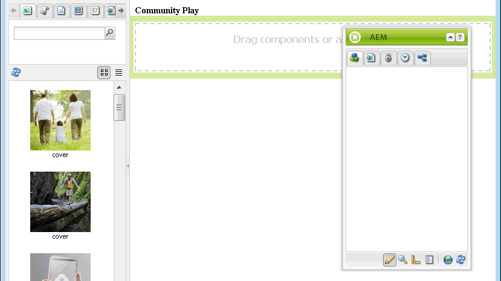

# Sandbox-toepassing ontwikkelen {#develop-sandbox-application}

Nu de sjabloon is ingesteld in de sectie [initial application](initial-app.md) en de startpagina&#39;s in de sectie [initial content](initial-content.md), kan de toepassing in deze sectie worden ontwikkeld met behulp van basisscripts, waaronder de mogelijkheid om authoring met Community-componenten mogelijk te maken. Aan het einde van deze sectie is de website functioneel.

## Scripts {#using-foundation-page-scripts} voor elementatiepagina gebruiken

Het standaardmanuscript, dat wordt gecreeerd toen de component die het playpage malplaatje teruggeeft werd toegevoegd, wordt gewijzigd om head.jsp van de stichtingspagina en een lokale body.jsp te omvatten.

### Super Resource Type {#super-resource-type}

De eerste stap is een middel supertype bezit aan de `/apps/an-scf-sandbox/components/playpage` knoop toe te voegen zodat het de manuscripten en de eigenschappen van het super type erft.

CRXDE Lite gebruiken:

1. Selecteer knooppunt `/apps/an-scf-sandbox/components/playpage`.
1. Voer op het tabblad Eigenschappen een nieuwe eigenschap in met de volgende waarden:

   Naam: `sling:resourceSuperType`

   Type: `String`

   Waarde: `foundation/components/page`

1. Klik op de groene knop **[!UICONTROL +Add]**.
1. Klik op **[!UICONTROL Save All]**.

   

### Scripts {#head-and-body-scripts} voor hoofd- en hoofdtekst

1. Navigeer in **CRXDE Lite** verkenner-deelvenster naar `/apps/an-scf-sandbox/components/playpage` en dubbelklik op het bestand `playpage.jsp` om het te openen in het bewerkvenster.

   `/apps/an-scf-sandbox/components/playpage/playpage.jsp`

   ```xml
   <%--
   
     An SCF Sandbox Play Component component.
   
     This is the component which renders content for An SCF Sandbox page.
   
   --%><%
   %><%@include file="/libs/foundation/global.jsp"%><%
   %><%@page session="false" %><%
   %><%
    // TODO add your code here
   %>
   ```

1. Als u weet dat er scripttags voor openen/sluiten zijn, vervangt u &quot; // TODO ...&quot; met inbegrip van scripts voor de kop en de hoofdtekst van &lt;html>.

   Met een supertype van `foundation/components/page`, zal om het even welk manuscript niet die in deze zelfde omslag wordt bepaald aan een manuscript in `/apps/foundation/components/page` omslag (als het bestaat), anders aan een manuscript in `/libs/foundation/components/page` omslag oplossen.

   `/apps/an-scf-sandbox/components/playpage/playpage.jsp`

   ```xml
   <%--
   
       An SCF Sandbox Play Component component: playpage.jsp
   
     This is the component which renders content for An SCF Sandbox page.
   
   --%><%
   %><%@include file="/libs/foundation/global.jsp"%><%
   %><%@page session="false" %>
   <html>
     <cq:include script="head.jsp"/>
     <cq:include script="body.jsp"/>
   </html>
   ```

1. Het stichtingsmanuscript `head.jsp` moet niet worden bedekt, maar het stichtingsmanuscript `body.jsp` is leeg.

   Om opstelling voor creatie, bekleding `body.jsp` met een lokaal manuscript en omvat een paragraafsysteem (parsys) in het lichaam:

   1. Ga naar `/apps/an-scf-sandbox/components`.
   1. Selecteer de `playpage` knoop.
   1. Klik met de rechtermuisknop en selecteer `Create > Create File...`

      * Naam: **body.jsp**
   1. Klik op **[!UICONTROL Save All]**.

   Open `/apps/an-scf-sandbox/components/playpage/body.jsp` en plak in de volgende tekst:

   ```xml
   <%--
   
       An SCF Sandbox Play Component component: body.jsp
   
     This is the component which renders content for An SCF Sandbox page.
   
   --%><%
   %><%@include file="/libs/foundation/global.jsp"%><%
   %><%@page session="false" %>
   <body>
       <h2>Community Play</h2>
       <cq:include path="par" resourceType="foundation/components/parsys" />
   </body>
   ```

1. Klik op **[!UICONTROL Save All]**.

**De pagina in een browser weergeven in de bewerkingsmodus:**

* Standaardinterface: [http://localhost:4502/editor.html/content/an-scf-sandbox/en/play.html](http://localhost:4502/editor.html/content/an-scf-sandbox/en/play.md)

U zou niet alleen de rubriek **Communautair Spel**, maar ook UI voor het uitgeven van paginainhoud moeten zien.

Het paneel Middelen/component wordt weergegeven wanneer het zijpaneel geopend is en het venster breed genoeg is om zowel de inhoud als de pagina-inhoud weer te geven.


* Klassieke interface: [http://localhost:4502/cf#/content/an-scf-sandbox/en/play.html](http://localhost:4502/cf#/content/an-scf-sandbox/en/play.html)

Hieronder ziet u hoe de afspeelpagina wordt weergegeven in de klassieke gebruikersinterface, inclusief in de zoekfunctie voor inhoud (cf):



## Community-componenten {#communities-components}

Om de componenten van Communities voor ontwerp toe te laten, begin door deze instructies te volgen:

* [Toegang tot onderdelen van Gemeenschappen](basics.md#accessing-communities-components)

Voor deze zandbak, begin met deze **Communities** componenten (toelaten door de doos te controleren):

* Opmerkingen
* Forum
* Classificatie
* Revisies
* Overzicht van revisies (weergave)
* Stemming

Kies bovendien **[!UICONTROL General]** componenten, zoals

* Afbeelding
* Tabel
* Tekst
* Titel (Stichting)

>[!NOTE]
>
>De componenten die voor het paginapunt worden toegelaten worden opgeslagen in de bewaarplaats als waarde van `components` bezit van
>
>`/etc/designs/an-scf-sandbox/jcr:content/playpage/par` knooppunt.

## Openingspagina {#landing-page}

In een meertalig milieu, zou de wortelpagina een manuscript omvatten dat het verzoek van de cliënt zou ontleden om de aangewezen taal te bepalen.

In dit eenvoudige voorbeeld wordt de basispagina statisch ingesteld op omleiding naar de Engelse pagina, die in de toekomst kan worden ontwikkeld als de hoofdbestemmingspagina met een koppeling naar de afspeelpagina.

Wijzig de URL van de browser in de hoofdpagina: [http://localhost:4502/editor.html/content/an-scf-sandbox.html](https://locahost:4502/editor.html/content/an-scf-sandbox.html)

* Het pictogram Pagina-informatie selecteren
* Selecteer **[!UICONTROL Open Properties]**
* Op het tabblad GEAVANCEERD

   * Voor de Redirect ingang, doorblader aan **[!UICONTROL Websites]** > **[!UICONTROL SCF Sandbox Site]** > **[!UICONTROL SCF Sandbox]**
   * Klik op **[!UICONTROL OK]**

* Klik op **[!UICONTROL OK]**

Als de site eenmaal is gepubliceerd, wordt het bladeren naar de hoofdpagina op een publicatie-instantie omgeleid naar de Engelse pagina.

De laatste stap vóór het spelen met de gemeenschappenSCF componenten moet een Omslag van de Bibliotheek van de Cliënt (clientlibs) toevoegen.... [Clienlibs toevoegen](add-clientlibs.md)