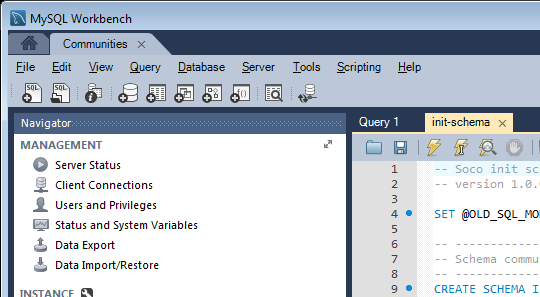

# MySQL-configuratie voor DSRP {#mysql-configuration-for-dsrp}

MySQL is een relationele database die kan worden gebruikt om door gebruikers gegenereerde inhoud (UGC) op te slaan.

Deze instructies beschrijven hoe te met de server te verbinden MySQL en het gegevensbestand te vestigen UGC.

## Vereisten {#requirements}

* [Nieuwste Gemeenschappen, functiepakket](deploy-communities.md#latestfeaturepack)
* [JDBC-stuurprogramma voor MySQL](deploy-communities.md#jdbc-driver-for-mysql)
* Een relationele database:

   * [&#x200B; MySQL server &#x200B;](https://dev.mysql.com/downloads/mysql/) versie van de Server van de Gemeenschap 5.6 of later

      * Kan op dezelfde host worden uitgevoerd als AEM of extern worden uitgevoerd

   * [&#x200B; MySQL werkbank &#x200B;](https://dev.mysql.com/downloads/tools/workbench/)

## MySQL installeren {#installing-mysql}

[&#x200B; MySQL &#x200B;](https://dev.mysql.com/downloads/mysql/) zou na de instructies voor doelOS moeten worden gedownload en worden geïnstalleerd.

### Tabelnamen met kleine letters {#lower-case-table-names}

Aangezien SQL niet hoofdlettergevoelig is, is het voor hoofdlettergevoelige besturingssystemen nodig om de instelling voor kleine letters in te voeren voor alle tabelnamen.

Als u bijvoorbeeld alle tabelnamen met kleine letters wilt opgeven op een Linux-besturingssysteem:

* Bestand bewerken `/etc/my.cnf`
* Voeg de volgende regel toe aan de sectie `[mysqld]` :

  `lower_case_table_names = 1`

### UTF8-tekenset {#utf-character-set}

Voor betere meertalige ondersteuning is het nodig de tekenset UTF8 te gebruiken.

Wijzig MySQL om UTF8 in te stellen als tekenset:

* mysql > SET NAMES &#39;utf8&#39;;

Wijzig de MySQL-database in de standaardwaarde voor UTF8:

* Bestand bewerken `/etc/my.cnf`
* Voeg de volgende regel toe aan de sectie `[client]` :

  `default-character-set=utf8`

* Voeg de volgende regel toe aan de sectie `[mysqld]` :

  `character-set-server=utf8`

## MySQL Workbench installeren {#installing-mysql-workbench}

MySQL Workbench biedt een UI voor het uitvoeren van SQL-scripts die het schema en de initiële gegevens installeren.

MySQL Workbench moet worden gedownload en geïnstalleerd volgens de instructies voor het doel-besturingssysteem.

## Community-verbinding {#communities-connection}

Als de MySQL Workbench voor het eerst wordt gestart, tenzij deze al voor andere doeleinden wordt gebruikt, worden er nog geen verbindingen weergegeven:

### Nieuwe verbindingsinstellingen {#new-connection-settings}

1. Selecteer het pictogram `+` rechts van `MySQL Connections` .
1. Voer in het dialoogvenster `Setup New Connection` de waarden in die geschikt zijn voor uw platform

   Voor demonstratiedoeleinden, met de auteur AEM instantie en MySQL op de zelfde server:

   * Verbindingsnaam: `Communities`
   * Verbindingsmethode: `Standard (TCP/IP)`
   * Hostnaam: `127.0.0.1`
   * Gebruikersnaam: `root`
   * Wachtwoord: `no password by default`
   * Standaardschema: `leave blank`

1. Selecteer `Test Connection` om de verbinding met de actieve MySQL-service te verifiëren

**Nota&#39;s**:

* De standaardpoort is `3306`
* De gekozen Naam van de Verbinding is ingegaan als naam van de gegevensbron in [&#x200B; configuratie JDBC OSGi &#x200B;](#configurejdbcconnections)

#### Nieuwe verbinding met Gemeenschappen {#new-communities-connection}

## Database instellen {#database-setup}

Open de verbinding van de Gemeenschappen om het gegevensbestand te installeren.

### Het SQL-script ophalen {#obtain-the-sql-script}

Het SQL-script is afkomstig uit de AEM opslagplaats:

1. Bladeren naar CRXDE Lite

   * Bijvoorbeeld, [&#x200B; http://localhost:4502/crx/de](http://localhost:4502/crx/de)

1. Selecteer de map /libs/social/config/datastore/dsrp/schema
1. Downloaden `init-schema.sql`

   

Eén methode voor het downloaden van het schema is:

* Het knooppunt `jcr:content` voor het sql-bestand selecteren
* De waarde voor de eigenschap `jcr:data` is een weergavekoppeling

* Selecteer de weergavekoppeling om de gegevens in een lokaal bestand op te slaan

### De DSRP-database maken {#create-the-dsrp-database}

Voer de onderstaande stappen uit om de database te installeren. De standaardnaam van de database is `communities` .

Als de gegevensbestandnaam in het manuscript wordt veranderd, ben zeker om het in [&#x200B; te veranderen JDBC config &#x200B;](#configurejdbcconnections).

#### Stap 1: SQL-bestand openen {#step-open-sql-file}

In MySQL Workbench

* Selecteer in het keuzemenu Bestand de optie **[!UICONTROL Open SQL Script]**
* Selecteer het gedownloade `init_schema.sql` script

#### Stap 2: SQL-script uitvoeren {#step-execute-sql-script}

Selecteer in het Workbench-venster voor het bestand dat u in Stap 1 hebt geopend de `lightening (flash) icon` om het script uit te voeren.

In de volgende afbeelding kan het `init_schema.sql` -bestand worden uitgevoerd:

#### Vernieuwen {#refresh}

Nadat het script is uitgevoerd, moet u de sectie `SCHEMAS` van de `Navigator` vernieuwen om de nieuwe database weer te geven. Gebruik het vernieuwingspictogram rechts van &#39;SCHEMAS&#39;:

## JDBC-verbinding configureren {#configure-jdbc-connection}

De configuratie OSGi voor **de Pool van Verbindingen JDBC van de Dag** vormt de Bestuurder MySQL JDBC.

Alle publicatie- en auteur-AEM moeten verwijzen naar dezelfde MySQL-server.

Wanneer MySQL op een server verschillend van AEM loopt, moet server hostname in plaats van &quot;localhost&quot;in de schakelaar worden gespecificeerd JDBC.

* Op elke auteur en publiceer AEM instantie.
* Aangemeld met beheerdersrechten.
* Heb toegang tot de [&#x200B; Webconsole &#x200B;](../../help/sites-deploying/configuring-osgi.md).

   * Bijvoorbeeld, [&#x200B; http://localhost:4502/system/console/configMgr](http://localhost:4502/system/console/configMgr)

* Zoek de `Day Commons JDBC Connections Pool`
* Selecteer het pictogram `+` om een verbindingsconfiguratie te maken.

  

* Voer de volgende waarden in:

   * **[!UICONTROL JDBC driver class]**: `com.mysql.jdbc.Driver`
   * **[!UICONTROL JDBC connection URI]**: `jdbc:mysql://localhost:3306/communities?characterEncoding=UTF-8`

     Specificeer server in plaats van localhost als de server MySQL niet het zelfde als &quot;dit&quot;AEM server *gemeenschappen* is de standaardgegevensbestand (schema) naam.

   * **[!UICONTROL Username]**: `root`

     Of ga gevormde Gebruikersnaam voor de server MySQL in, als niet &quot;wortel&quot;.

   * **[!UICONTROL Password]** :

     Wis dit gebied als geen wachtwoord voor MySQL wordt geplaatst,

     anders ga het gevormde wachtwoord voor de Gebruikersnaam MySQL in.

   * **[!UICONTROL Datasource name]**: naam ingegaan voor de [&#x200B; verbinding MySQL &#x200B;](#new-connection-settings), bijvoorbeeld, &quot;gemeenschappen&quot;.

* Selecteren **[!UICONTROL Save]**
