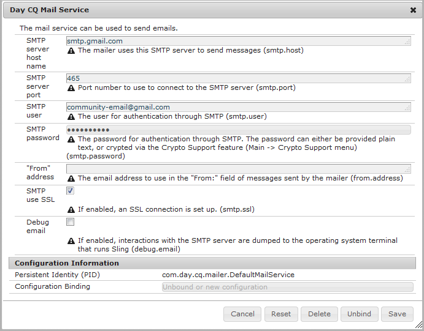
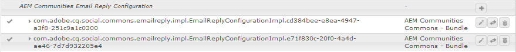

# E-mail configureren {#configuring-email}

AEM Communities gebruikt e-mail voor:

* [Publikaties](notifications.md)
* [Communityabonnementen](subscriptions.md)

De e-mailfunctie werkt standaard niet omdat hiervoor een SMTP-server en een SMTP-gebruiker moet worden opgegeven.

>[!CAUTION]
>
>E-mail voor meldingen en abonnementen moet alleen op de [primaire uitgever](deploy-communities.md#primary-publisher)worden geconfigureerd.

## Standaardconfiguratie e-mailservice {#default-mail-service-configuration}

De standaardmailservice is vereist voor zowel meldingen als abonnementen.

* Meld u aan bij de primaire uitgever met beheerdersrechten en open de [webconsole](../../help/sites-deploying/configuring-osgi.md):

   * Bijvoorbeeld: [http://localhost:4503/system/console/configMgr](http://localhost:4503/system/console/configMgr)

* Zoek de `Day CQ Mail Service`.
* Selecteer het bewerkingspictogram.

Dit is gebaseerd op de documentatie voor het [Vormen E-mailbericht](../../help/sites-administering/notification.md), maar met een verschil in dat het gebied `"From" address` niet ** wordt vereist en leeg zou moeten blijven.

Bijvoorbeeld (alleen invullen met waarden voor illustratieve doeleinden):

* **[!UICONTROL SMTP server host name]**

   *(Vereist)* De SMTP-server die moet worden gebruikt.

* **[!UICONTROL SMTP server port]**

   *(Vereist)* De SMTP serverhaven moet 25 of hoger zijn.

* **[!UICONTROL SMTP user]**

   *(Vereist)* De SMTP-gebruiker.

* **[!UICONTROL SMTP password]**

   *(Vereist)* Het wachtwoord van de SMTP-gebruiker.

* **[!UICONTROL "From" address]**

   Leeg laten
* **[!UICONTROL SMTP use SSL]**

   Als deze optie is ingeschakeld, wordt beveiligde e-mail verzonden. Zorg ervoor dat de poort is ingesteld op 465 of zoals is vereist voor de SMTP-server.
* **[!UICONTROL Debug email]**

   Indien gecontroleerd, laat registreren van SMTP serverinteractie toe.

## AEM Communities E-mailconfiguratie {#aem-communities-email-configuration}

Zodra de [standaardpostdienst](#default-mail-service-configuration) wordt gevormd, worden de twee bestaande instanties van `AEM Communities Email Reply Configuration` OSGi config, inbegrepen in de versie, functioneel.

Slechts moet de instantie voor abonnementen verder worden gevormd wanneer het toestaan van antwoord door e-mail.

1. [E-mailexemplaar](#configuration-for-notifications) :

   Voor meldingen, die geen ondersteuning bieden voor e-mailantwoorden, en deze mogen niet worden gewijzigd.

1. [Subscriptions-email](#configuration-for-subscriptions) instance:

   Vereist configuratie om het creëren van post van antwoorde-mail volledig toe te laten.

U bereikt als volgt de e-mailconfiguratieinstanties van de Gemeenschappen:

* Meld u aan bij de primaire uitgever met beheerdersrechten en open de [webconsole](../../help/sites-deploying/configuring-osgi.md)

   * Bijvoorbeeld: [http://localhost:4503/system/console/configMgr](http://localhost:4503/system/console/configMgr)

* Zoeken `AEM Communities Email Reply Configuration`.

### Configuratie voor meldingen {#configuration-for-notifications}

De instantie van `AEM Communities Email Reply Configuration` OSGi config met de e-mail van de Naam is telefoontifications eigenschap. Deze functie bevat geen e-mailantwoord.

Deze configuratie moet niet worden gewijzigd.

* Zoek de `AEM Communities Email Reply Configuration`.
* Selecteer het bewerkingspictogram.
* Controleer of de **naam** is `email`.

* Verifieer of **Create post from response email** is `unchecked`.

### Configuratie voor abonnementen {#configuration-for-subscriptions}

Voor Gemeenschapsabonnementen is het mogelijk om de mogelijkheid voor een lid om inhoud te posten in of uit te schakelen door op een e-mail te antwoorden.

* Zoek de `AEM Communities Email Reply Configuration`.
* Selecteer het bewerkingspictogram.
* Controleer of de **naam** is `subscriptions-email`.

   

* **[!UICONTROL Name]**

   *(Vereist)* `subscriptions-email`. Niet bewerken.

* **[!UICONTROL Create post from reply email]**

   Als deze optie is ingeschakeld, kan de ontvanger van het e-mailbericht met abonnement inhoud posten door een antwoord te verzenden. Standaard is ingeschakeld.
* **[!UICONTROL Add tracked id to header]**

   Standaard is dit `Reply-To`.

* **[!UICONTROL Maximum length of Subject]**

   Als tracker-id aan de onderwerpregel wordt toegevoegd, is dit de maximumlengte van het onderwerp, met uitzondering van de bijgehouden id, waarna het wordt bijgesneden. Deze waarde moet zo klein mogelijk zijn om te voorkomen dat bijgehouden id-informatie verloren gaat. De standaardwaarde is 200.

* **[!UICONTROL "Reply-To" email address]**

   Adres dat als &quot;antwoord-aan&quot;e-mailadres wordt gebruikt. Standaard is dit `no-reply@example.com`.

* **[!UICONTROL Reply-to-Delimiter]**

   Als tracker-id wordt toegevoegd aan de header die reageert, wordt dit scheidingsteken gebruikt. De standaardwaarde is `+` (plusteken).

* **[!UICONTROL Tracker Id prefix in subject]**

   Als tracker-id aan de onderwerpregel wordt toegevoegd, wordt dit voorvoegsel gebruikt. Standaard is dit `post#`.

* **[!UICONTROL Tracker id prefix in message body]**

   Als tracker-id aan de hoofdtekst van het bericht wordt toegevoegd, wordt dit voorvoegsel gebruikt. Standaard is dit `Please do not remove this:`.

* **[!UICONTROL Email as HTML]**: Als deze optie is ingeschakeld, wordt het inhoudstype van e-mail ingesteld op `"text/html;charset=utf-8"`. Standaard is ingeschakeld.

* **[!UICONTROL Default user name]**

   Deze naam wordt gebruikt voor geen naamgebruikers. Standaard is dit `no-reply@example.com`.

* **[!UICONTROL Templates root path]**

   De e-mail wordt samengesteld met een sjabloon die op dit hoofdpad is opgeslagen. Standaard is dit `/etc/community/templates/subscriptions-email`.

## Opiniepeilingimportmodule configureren {#configure-polling-importer}

Om de e-mail in de gegevensopslagplaats te brengen, is het noodzakelijk om een opiniepeilingimporteur te vormen en zijn eigenschappen in de bewaarplaats manueel te vormen.

### Nieuwe importmodule voor opiniepeiling toevoegen {#add-new-polling-importer}

* Meld u aan bij de primaire uitgever met beheerdersrechten en blader naar de pollingimporterconsole:

   Bijvoorbeeld: [http://localhost:4503/etc/importers/polling.html](http://localhost:4503/etc/importers/polling.html)

* Selecteer **[!UICONTROL Add]**

   

* **[!UICONTROL Type]**

   *(Vereist)* Trek neer om te selecteren `POP3 (over SSL)`.

* **[!UICONTROL URL]**

   *(Vereist)* De uitgaande postserver. Bijvoorbeeld, `pop.gmail.com:995/INBOX?username=community-emailgmail.com&password=****`.

* **[!UICONTROL Import to Path]**&amp;ast;

   *(Vereist)* Stel dit in `/content/usergenerated/mailFolder/postEmails`door naar de `postEmails`map te bladeren en **OK** te selecteren.

* **[!UICONTROL Update Interval in Seconds]**

   *(Optioneel)* De mailserver die voor de standaard mailservice is geconfigureerd, kan vereisten hebben met betrekking tot de waarde voor het update-interval. Het is bijvoorbeeld mogelijk dat Gmail een interval van `300`vereist.

* **[!UICONTROL Login]**

   *(Optioneel)*

* **[!UICONTROL Password]**

   *(Optioneel)*

* Selecteer **[!UICONTROL OK]**.

### Protocol aanpassen voor nieuwe pollingimportmodule {#adjust-protocol-for-new-polling-importer}

Zodra de nieuwe opiniepeilingsconfiguratie wordt bewaard, is het noodzakelijk eigenschappen van de invoer van e-mail van het abonnement verder te wijzigen importeur om het protocol van `POP3` te veranderen in `emailreply`.

Met [CRXDE Lite](../../help/sites-developing/developing-with-crxde-lite.md):

* Meld u aan bij de primaire uitgever met beheerdersrechten en blader naar [https://&lt;server>:&lt;port>/crx/de/index.jsp#/etc/importers/polling](http://localhost:4503/crx/de/index.jsp#/etc/importers/polling).
* Selecteer de nieuwe configuratie en wijzig de volgende eigenschappen:

   * **feedType**: Vervangen `pop3s` door **`emailreply`**
   * **bron**: Bronprotocol vervangen `pop3s://` door **`emailreply://`**

De rode driehoeken geven de gewijzigde eigenschappen aan. Sla de wijzigingen op:

* Selecteer **[!UICONTROL Save All]**.

