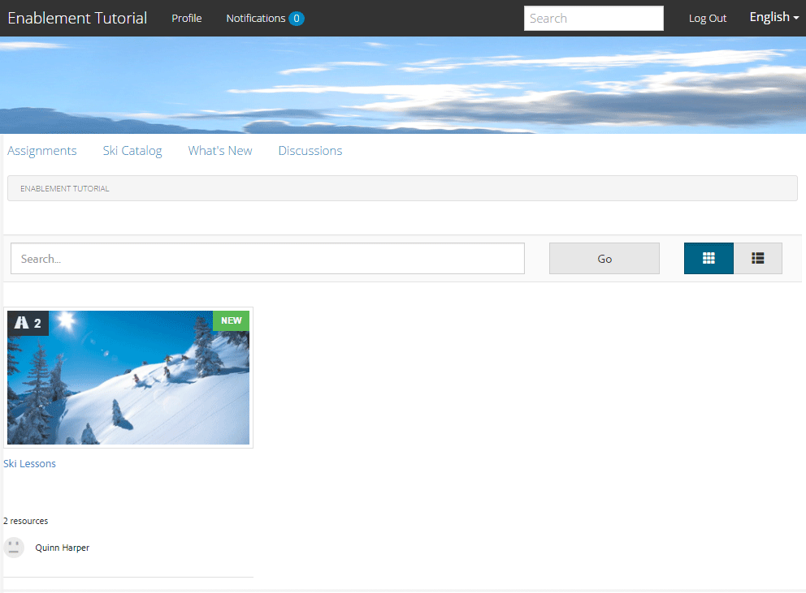
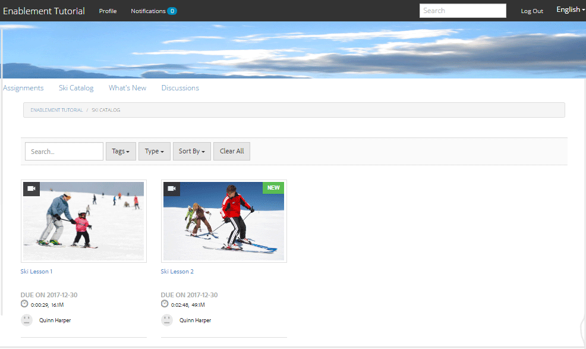
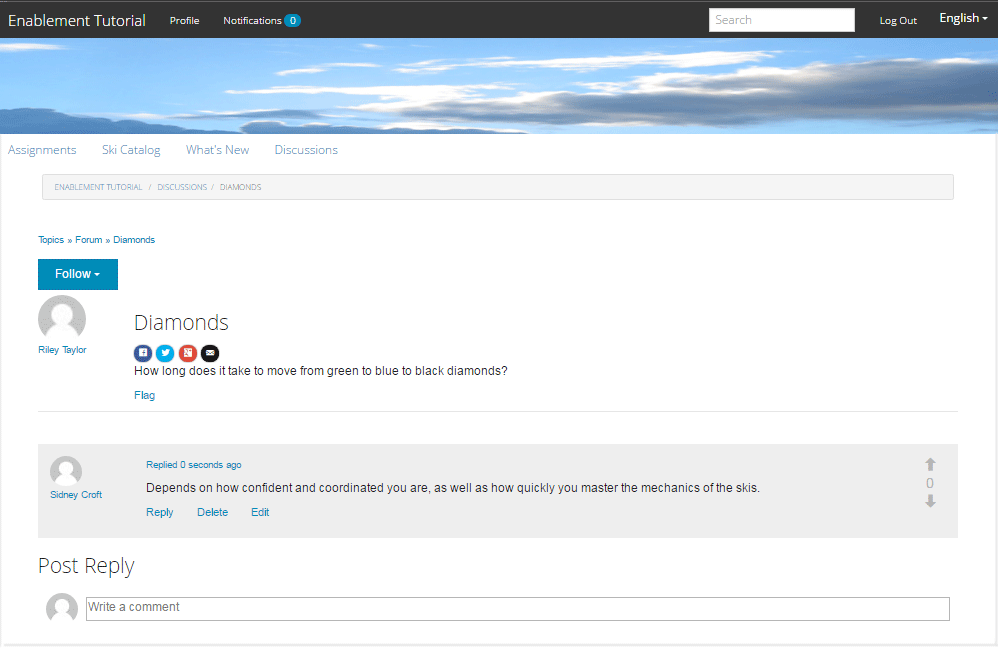
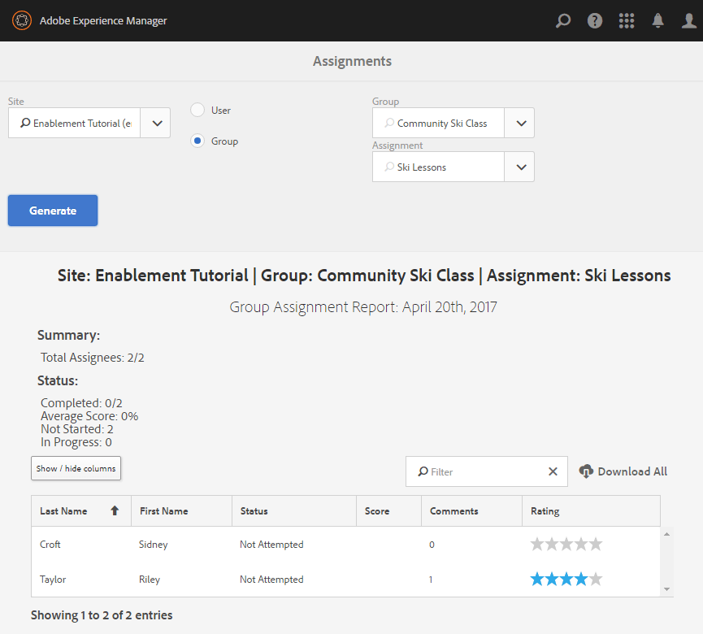

# Ervaar de gepubliceerde site {#experience-the-published-site}

**[⇐ maken en toewijzen van Enablement-bronnen](resource.md)**

## Bladeren naar nieuwe site bij publicatie {#browse-to-new-site-on-publish}

Nu de nieuwe site van de community en de bijbehorende bronnen en leerpaden zijn gepubliceerd, is het mogelijk om de zelfstudie Enablement te ervaren.

Begin door naar de weergegeven URL te bladeren wanneer u de site maakt, maar op de publicatieserver, bijvoorbeeld

* Auteur-URL = [http://localhost:4502/content/sites/enable/en.html](http://localhost:4502/content/sites/enable/en.html)
* URL publiceren = [http://localhost:4503/content/sites/enable/en.html](http://localhost:4503/content/sites/enable/en.html)

Als de [standaard startpagina ingesteld](enablement-create-site.md#changethedefaulthomepage)en vervolgens gewoon naar [http://localhost:4503/](http://localhost:4503/) moet de site starten.

Wanneer de bezoeker van de site voor het eerst op de gepubliceerde site aankomt, is deze doorgaans nog niet aangemeld en is de site anoniem.

**http://localhost:4503/content/sites/enable/en.html**

## Anonieme sitebezoeker {#anonymous-site-visitor}

Een anonieme sitebezoeker wordt direct de aanmeldingspagina voor deze persoonlijke communitysite voor activering getoond. Er is geen optie voor zelfinschrijving of aanmelden bij Facebook of Twitter.

Deze homepage bevat vier menu-items: `Assignments, Ski Catalog, What's New` en `Discussions`, maar geen van deze bestanden kan worden bereikt zonder u aan te melden.

>[!NOTE]
>
>Het is mogelijk anonieme toegang tot een enablement-site te verlenen zonder bezoekers van de site toe te staan zich te registreren.
>
>Als een enablement-resource is ingesteld op `show in catalog` en `allow anonymous access`, kunnen anonieme sitebezoekers bronnen in de catalogus bekijken.

### Anonieme toegang tot JCR voorkomen {#prevent-anonymous-access-on-jcr}

Een bekende beperking stelt de inhoud van de communautaire site aan anonieme bezoekers via jcr-inhoud en json bloot, hoewel **[!UICONTROL allow anonymous access]** is uitgeschakeld voor de inhoud van de site. Nochtans, kan dit gedrag worden gecontroleerd gebruikend de Beperkingen van het Schuiven als oplossing.

Voer de volgende stappen uit om de inhoud van uw site te beschermen tegen toegang door anonieme gebruikers via jcr-inhoud en json:

1. Ga AEM auteur naar https://&lt;host>:&lt;port>/editor.html/content/site/&lt;sitename>.html.

   >[!NOTE]
   >
   >Ga niet naar de gelokaliseerde site.

1. Ga naar **[!UICONTROL Page Properties]**.

   

1. Ga naar **[!UICONTROL Advanced]** tab.
1. Inschakelen **[!UICONTROL Authentication Requirement]**.

   

1. Voeg het pad van de aanmeldingspagina toe. Bijvoorbeeld, `/content/......./GetStarted`.
1. Publiceer de pagina.

## Ingeschreven lid {#enrolled-member}

Deze ervaring is afhankelijk van gebruikers `Riley Taylor` en `Sidney Croft` worden [gemaakt](enablement-setup.md#publishcreateenablementmembers) en [toegewezen](resource.md#settings) aan de *Ski Lessen* leerpad door hun lidmaatschap van *Community Ski-klasse* groep.

Aanmelden met

* `Username: riley`
* `Password: password`

Als het gebruikersprofiel niet door zelfregistratie werd gecreeerd, wordt de zeer eerste keer een lid binnen ondertekent, hun pagina van het Profiel getoond zodat kunnen zij het verifiëren en wijzigen zonodig.

De volgende keer dat het lid inlogt, wordt de homepage, die door het eerste menupunt wordt geïdentificeerd, getoond.

### Toewijzingen {#assignments}

De pagina van Toewijzingen is waar het lid alle het leren wegen en enablement middelen wordt getoond die specifiek aan hen worden toegewezen.

Elke toewijzing bevat basisinformatie over:

* Het type toewijzing
* Of het een nieuwe Toewijzing is
* De naam
* Bijzonderheden die relevant zijn voor het soort toewijzing
* Contactpersoon, deskundige en auteur van toewijzing (indien opgegeven)

Het type toewijzing wordt aangegeven met een pictogram in de linkerbovenhoek van de kaart. Het beeld van een weg is voor een het leren weg met het aantal inbegrepen enablement middelen.

Selecteren *Ski Lessen* zal de twee enablement middelen tonen die door de het leren weg van verwijzingen worden voorzien.

Selecteren *Skiles 1* wordt de detailpagina van de resource voor activering geopend.

Van de detailpagina, kan het lid leren, [tarief](rating.md) de les en voeg [opmerkingen](comments.md). Om het even welke lidactiviteit zal in wat worden weerspiegeld Nieuw gedeelte van de plaats.

De interactie met het enablement middel zal in de sectie van het Rapport worden genoteerd die in het auteursmilieu toegankelijk is.

### Ski-catalogus {#ski-catalog}

De pagina van de Catalogus van het Ski is de catalogus van enablement middelen die met markeringen van worden geëtiketteerd `Tutorial` naamruimte. De twee *Ski Lesson* bronnen worden gelabeld met de `Skiing` -tag, zodat andere tags dan `All` of `Tutorial: Sports / Skiing` is geselecteerd, wordt er niets weergegeven.

Wanneer aan een lid geen middelen van toelage, of direct of door een het leren weg is toegewezen, is het mogelijk om met enablement middelen in een catalogus in wisselwerking te staan en terugkoppelen door commentaren en classificaties te verstrekken.

### Discussies {#discussions}

Naast de beoordeling van en de opmerkingen over actiemiddelen ([indien ingeschakeld](enablement-create-site.md#step33asettings)), de sjabloon voor de communautaire site waarvan `Enablement Tutorial` is gemaakt met de [forumfunctie](functions.md#forum-function) (titel is `Discussions)`.

Selecteer `Discussions`link en post een onderwerp.

Meld u af en meld u aan als Sidney Croft (sidney/password) en beantwoord de vraag en volg het onderwerp.

Het bericht, naast gealigneerde matiging, zijn er opties om het onderwerp op sociale media te delen of het onderwerp te e-mailen.

### Wat is er nieuw? {#what-s-new}

De `What's New` menu-item is de titel op basis van de [activity stream, functie](functions.md#activity-stream-function) in de structuur van deze site van de gemeenschap.

Nog steeds aangemeld als Sidney, selecteert u de `What's New` koppeling om de activiteit weer te geven.

## Vertrouwd lid van de Gemeenschap {#trusted-community-member}

Deze ervaring gaat uit van ` [Quinn Harper](enablement-setup.md#publishcreateenablementmembers)` is toegewezen aan de rollen van [moderator](enablement-create-site.md#moderation) en [resourcepcontact](resource.md#settings).

Aanmelden met

* `Username: quinn`
* `Password: password`

Nadat u zich hebt aangemeld, ziet u een nieuw menu-item. `Administration`, hetgeen blijkt uit het feit dat het lid de rol van moderator heeft gekregen.

De homepage wordt geïdentificeerd door het eerste menupunt, Toewijzingen. Quinn is de moderator en enablement middelcontact en werd niet ingeschreven in om het even welke enablement middelen of het leren wegen, en zodat is er niets aan vertoning.

### Beheer {#administration}

Wat er is, is activiteit door de twee leerlingen, `Riley Taylor` en `Sidney Croft`. Als u `Administration` verbinding om tot de Console van de Moderatie toegang te hebben, kan Quinn gebruiken [bulkmoderniseringsconsole](moderation.md) hun ambten te matigen.

Als u de pictogramschakelopties voor het zijpaneel selecteert, worden de filters geopend waarmee wordt gezocht in community-inhoud.

Als u de muis boven een opmerkingskaart houdt, worden moderatiehandelingen weergegeven.

## Rapporten over auteur {#reports-on-author}

Er zijn twee manieren om toegang te krijgen tot rapporten over studenten en bronnen voor activering.

Navigeer bij de auteur naar de **Gemeenschappen, [Bronconsole](resources.md)**, waar de middelen van enablement worden beheerd en na het selecteren van een communautaire plaats, is het mogelijk rapporten voor

* Alle actiemiddelen en leerpaden
* Eén specifieke activeringsbron of leerpad

Ga naar de **Gemeenschappen, [Rapportenconsole](reports.md)** en rapporten opstellen op basis van:

* Toewijzingen aan actiemiddelen en leerpaden
* Berichten naar een gemeenschapssite over een specifieke periode
* Weergaven (bezoeken ter plaatse) van een communitysite over een specifieke periode

* Posten en weergaven kunnen betrekking hebben op alle inhoud of op specifieke inhoud:

   * Forum
   * Forum-onderwerp
   * QnA
   * Vraag QnA
   * Blog
   * Blogartikel
   * Kalender
   * Kalendergebeurtenis

### Bronnenconsole {#resources-console}

Met een kleine activiteit en interactie met de Middelen bij publiceren, is het bekijken van de rapporten over auteur het waard om te kijken.

* Meld u bij de auteur aan met beheerdersrechten.
* Navigeer van het hoofdmenu naar **[!UICONTROL Communities]** > **[!UICONTROL Resources]**.
* Selecteer `Enablement Tutorial` site.
* Selecteer `Report` pictogram voor een overzicht van alle Middelen.
* Selecteer een bron en klik vervolgens op `Report` pictogram voor een rapport over die Middel.

Het is waarschijnlijk te vroeg om gegevens van Adobe Analytics weer te geven, wat 1 tot 12 uur kan duren. Standaard SCORM-rapportage is echter al beschikbaar.

#### Rapport Ski-lesbronnen {#ski-lessons-resource-report}

#### Gebruikersrapport Ski Lessen {#ski-lessons-user-report}

* Selecteer **[!UICONTROL Communities > Resources]**

* Kaart openen `Enablement Tutorial`
* Kaart openen `Ski Lessons`
* Selecteer `Report > User Report`

### Rapportenconsole {#reports-console}

De console van Rapporten staat voor generatie van rapporten op toe

* **Toewijzingen** voor om het even welke plaats van de enablgemeenschap
* **Weergaven** voor om het even welke communautaire plaats
* **Post** voor om het even welke communautaire plaats

Voor rapporten over toewijzingen:

* Meld u bij de auteur aan met beheerdersrechten.
* Ga naar **[!UICONTROL Communities]** > **[!UICONTROL Reports]** > **[!UICONTROL Assignments Report]**.
* Selecteer een **[!UICONTROL Site]** in het keuzemenu (selecteer `Enablement Tutorial`).

* Selecteren **[!UICONTROL Group]** (selecteer `Community Ski Class`)

* Selecteer een **[!UICONTROL Assignment]** (selecteer `Ski Lessons`)

* Selecteer **[!UICONTROL Generate]**

Voor rapporten over weergaven:

* Meld u bij de auteur aan met beheerdersrechten.
* Ga naar **[!UICONTROL Communities]** > **[!UICONTROL Reports]** > **[!UICONTROL Views Report]**.
* Selecteer een **Site** in het keuzemenu (selecteer `Enablement Tutorial`).

* Selecteren **[!UICONTROL Content Type]** (selecteer `all`).

* Selecteer een **[!UICONTROL date range]** (selecteer `Last 7 days`).

* Selecteer **[!UICONTROL Generate]**.

**[⇐ maken en toewijzen van Enablement-bronnen](resource.md)**
