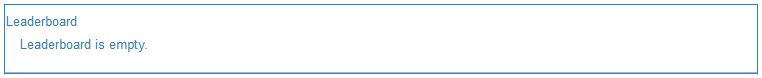

# Leaderboard-functie {#leaderboard-feature}

## Inleiding {#introduction}

De `Leaderboard` helpt u een idee te krijgen van hoe leden binnen de gemeenschap communiceren door leden te rangschikken op basis van verdiende punten (basis scoring) of hun expertise (geavanceerde scoring).

Voordat u de leaderboard-component op een pagina plaatst, moet u [Scores en badges van gemeenschappen](/help/communities/implementing-scoring.md).

In dit gedeelte van de documentatie wordt het volgende beschreven:

* De `Leaderboard` component aan een [community-site](/help/communities/overview.md#community-sites).
* De montages van de configuratie voor de `Leaderboard` component.

### Een Leaderboard toevoegen aan een pagina {#adding-a-leaderboard-to-a-page}

Als u een `Leaderboard` naar een pagina in de modus Schrijver, zoek de component

* `Communities / Leaderboard`

En sleep het naar de juiste plaats op een pagina.

Voor de nodige informatie gaat u naar [Grondbeginselen van Community-componenten](/help/communities/basics.md).

Wanneer de component voor het eerst op een pagina van een communitysite wordt geplaatst, ziet deze er zo uit:

### Leaderboard configureren {#configuring-leaderboard}

Selecteer de geplaatste `Leaderboard` zodat u toegang hebt tot `Configure` wordt het dialoogvenster Bewerken geopend.

#### Het tabblad Instellingen {#settings-tab}

Onder de **[!UICONTROL Settings]** tabblad, geeft u op welke informatie met betrekking tot het lid wordt weergegeven:

* **Weergavenaam**

  Een beschrijvende naam die voor het bord moet worden weergegeven en die de regels weergeeft die zijn geselecteerd voor het weergeven van badges en scores.
Standaard is `Leaderboard` als er niets is ingevoerd.

* **Badge**

  Als deze optie is ingeschakeld, wordt een kolom voor badge-pictogrammen opgenomen in het leaderboard.
De optie Standaard is uitgeschakeld.

* **Naam badge**

  Als deze optie is ingeschakeld, wordt een kolom met de naam van de badge opgenomen in het leaderboard.
De optie Standaard is uitgeschakeld.

* **Avatar gebruiken**

  Als deze optie is ingeschakeld, wordt de avatarafbeelding van het lid opgenomen in het leaderboard, naast de naamkoppeling naar het profiel van het lid.
De optie Standaard is uitgeschakeld.

#### Regels, tabblad {#rules-tab}

Onder de **Regels** tab, de site van de community en de bijbehorende regels voor scoring en badging

* **Locatie van regel**

  (Vereist) Plaats waar de het Scoren/het Bedragen regel wordt gevormd.

* **Scoreregel**

  (Vereist) Specifieke regel die de scores genereert die moeten worden weergegeven.

* **Badregel**

  (Vereist) Specifieke regel die de badge produceert om te tonen.

* **Weergavelimiet**

  Aantal te tonen leden per pagina. De standaardwaarde is 10.

### Voorbeeld: Leaderboard van deelnemers {#example-participants-leaderboard}

Deze lederbordrapporten zijn het resultaat van het toepassen van elementaire scoringregels.

Configuratie van de component Leaderboard:

* Tabblad Instellingen:

   * Weergavenaam = `Participation Board`
   * `checked`:

      * Badge
      * Naam badge
      * Avatar gebruiken

* Regels, tabblad:

   * Locatie van regel = `/content/sites/<site name>/jcr:content`
   * Scoreregel = `/libs/settings/community/scoring/rules/forums-scoring`
   * Badgingregel = `/libs/settings/community/badging/rules//reference-badging`
   * Weergavelimiet = `10`

### Voorbeeld: Leaderboard van experts {#example-experts-leaderboard}

Dit leaderboard-rapport is het resultaat van het toepassen van geavanceerde scoreregels.

Configuratie van de component Leaderboard:

* Tabblad Instellingen:

   * Weergavenaam = `Expertise Board`
   * `checked`:

      * Badge
      * Avatar gebruiken

* Regels, tabblad:

   * Locatie van regel = `/content/sites/<site name>/jcr:content`
   * Scoreregel = `/libs/settings/community/scoring/rules/adv-forums-scoring`
   * Badgingregel = `/libs/settings/community/badging/rules/adv-forums-badging`
   * Weergavelimiet = `10`

### Aanvullende informatie {#additional-information}

Meer informatie is te vinden op de [Essentiële elementen op Leaderboard](/help/communities/leaderboard.md) pagina voor ontwikkelaars.

De instructies voor het creëren van regels worden verstrekt op [Scores en badges van gemeenschappen](/help/communities/implementing-scoring.md) pagina voor beheerders.
