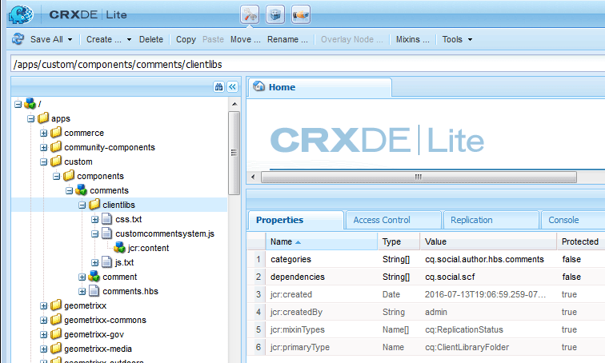

# De componenten maken  {#create-the-components}

Het voorbeeld om componenten uit te breiden gebruikt het commentaarsysteem, dat uit twee componenten bestaat.

* Opmerkingen - Het omvattende opmerkingensysteem dat de component is die op een pagina wordt geplaatst.
* Opmerking - De component die een instantie van een geposte opmerking vastlegt.

Beide componenten moeten worden geplaatst, vooral als het aanpassen van de verschijning van een geposte commentaar.

>[!NOTE]
>
>Er is slechts één opmerkingsysteem per sitepagina toegestaan.
>
>Vele eigenschappen van Gemeenschappen omvatten reeds een commentaarsysteem waarvan resourceType kan worden gewijzigd om het uitgebreide commentaarsysteem van verwijzingen te voorzien.

## De component Opmerkingen maken {#create-the-comments-component}

In deze aanwijzingen wordt een **Groep** andere waarde dan `.hidden` de component kan dus beschikbaar worden gesteld via de browser van de component (sidekick).

Het verwijderen van het automatisch gemaakte JSP-bestand komt doordat in plaats daarvan het standaard-HBS-bestand wordt gebruikt.

1. Bladeren naar **CRXDE|Lite** ([http://localhost:4502/crx/de/index.jsp](http://localhost:4502/crx/de/index.jsp))

1. Een locatie maken voor aangepaste toepassingen:

   * Selecteer de `/apps` node

      * **Map maken** benoemd **[!UICONTROL custom]**

   * Selecteer de `/apps/custom` node

      * **Map maken** benoemd **[!UICONTROL components]**

1. Selecteer de `/apps/custom/components` node

   * **[!UICONTROL Create > Component...]**

      * **Label**: *opmerkingen*
      * **Titel**: *Alt-opmerkingen*
      * **Beschrijving**: *Stijl van alternatieve opmerkingen*
      * **Supertype**: *social/commons/components/hbs/comments*
      * **Groep**: *Aangepast*

   * Selecteren **[!UICONTROL Next]**
   * Selecteren **[!UICONTROL Next]**
   * Selecteren **[!UICONTROL Next]**
   * Selecteren **[!UICONTROL OK]**

1. Vouw het gemaakte knooppunt uit: `/apps/custom/components/comments`
1. Selecteren **[!UICONTROL Save All]**
1. Klikken met rechtermuisknop `comments.jsp`
1. Selecteren **[!UICONTROL Delete]**
1. Selecteren **[!UICONTROL Save All]**


### De component Onderliggende opmerkingen maken {#create-the-child-comment-component}

Deze richtingenset **Groep** tot `.hidden` aangezien alleen de bovenliggende component in een pagina moet worden opgenomen.

Het verwijderen van het automatisch gemaakte JSP-bestand komt doordat in plaats daarvan het standaard-HBS-bestand wordt gebruikt.

1. Ga naar de `/apps/custom/components/comments` node
1. Klik met de rechtermuisknop op het knooppunt

   * Selecteren **[!UICONTROL Create]** > **[!UICONTROL Component...]**

      * **Label**: *opmerking*
      * **Titel**: *Alt-opmerking*
      * **Beschrijving**: *Alternatieve commentaarstijl*
      * **Supertype**: *social/commons/components/hbs/comments/comment*
      * **Groep**: `*.hidden*`

   * Selecteren **[!UICONTROL Next]**
   * Selecteren **[!UICONTROL Next]**
   * Selecteren **[!UICONTROL Next]**
   * Selecteren **[!UICONTROL OK]**

1. Vouw het gemaakte knooppunt uit: `/apps/custom/components/comments/comment`
1. Selecteren **[!UICONTROL Save All]**
1. Klikken met rechtermuisknop `comment.jsp`
1. Selecteren **[!UICONTROL Delete]**
1. Selecteren **[!UICONTROL Save All]**


### De standaard-HBS-scripts kopiëren en wijzigen {#copy-and-modify-the-default-hbs-scripts}

Gebruiken [CRXDE Lite](../../help/sites-developing/developing-with-crxde-lite.md):

* Kopiëren `comments.hbs`

   * Van [/libs/social/commons/components/hbs/comments](http://localhost:4502/crx/de/index.jsp#/libs/social/commons/components/hbs/comments)
   * Naar [/apps/custom/components/comments](http://localhost:4502/crx/de/index.jsp#/apps/custom/components/comments)

* Bewerken `comments.hbs` tot:

   * De waarde van de optie `data-scf-component` attribuut (~line 20):

      * Van `social/commons/components/hbs/comments`
      * Naar `/apps/custom/components/comments`

   * Wijzigen om de aangepaste commentaarcomponent op te nemen (~line 75):

      * Vervangen `{{include this resourceType='social/commons/components/hbs/comments/comment'}}`
      * Met `{{include this resourceType='/apps/custom/components/comments/comment'}}`

* Kopiëren `comment.hbs`

   * Van [/libs/social/commons/components/hbs/comments/comment](http://localhost:4502/crx/de/index.jsp#/libs/social/commons/components/hbs/comments/comment)
   * Naar [/apps/custom/components/comments/comment](http://localhost:4502/crx/de/index.jsp#/apps/custom/components/comments/comment)

* Bewerken `comment.hbs` tot:

   * De waarde van het kenmerk data-scf-component wijzigen (~ regel 19)

      * Van `social/commons/components/hbs/comments/comment`
      * Naar `/apps/custom/components/comments/comment`

* Selecteren `/apps/custom` node
* Selecteren **[!UICONTROL Save All]**

## Een clientbibliotheekmap maken {#create-a-client-library-folder}

Als u wilt voorkomen dat deze clientbibliotheek moet worden opgenomen, kunt u de categoriewaarde voor de clientlib van het standaardopmerkingssysteem gebruiken ( `cq.social.author.hbs.comments`). Nochtans, zou deze clientlib dan voor alle instanties van de standaardcomponent moeten worden omvat, ook.

Gebruiken [CRXDE Lite](../../help/sites-developing/developing-with-crxde-lite.md):

* Selecteren `/apps/custom/components/comments` node
* Selecteren **[!UICONTROL Create Node]**

   * **Naam**: `clientlibs`
   * **Type**: `cq:ClientLibraryFolder`
   * Toevoegen aan **[!UICONTROL Properties]** tab:

      * **Naam** `categories` **Type** `String` **Waarde** `cq.social.author.hbs.comments` `Multi`
      * **Naam** `dependencies` **Type** `String` **Waarde** `cq.social.scf` `Multi`

* Selecteren **[!UICONTROL Save All]**
* Met `/apps/custom/components/comments/clientlib`Als knoop geselecteerd, creeer drie dossiers:

   * **Naam**: `css.txt`
   * **Naam**: `js.txt`
   * **Naam**: customcommentsystem.js

* Voer &#39;customcommentsystem.js&#39; in als de inhoud van `js.txt`
* Selecteren **[!UICONTROL Save All]**



## Het SCF-model en de weergave registreren {#register-the-scf-model-view}

Wanneer het uitbreiden (met voeten treden) van een component SCF, is resourceType verschillend (het bedekken gebruikt het relatieve onderzoeksmechanisme dat doorzoekt `/apps` voor `/libs` zodat resourceType het zelfde blijft). Daarom is het noodzakelijk om JavaScript (in de cliëntbibliotheek) te schrijven om het model SCF JS en mening voor custom resourceType te registreren.

Voer de volgende tekst in als de inhoud van `customcommentsystem.js`:

### customcommentsystem.js {#customcommentsystem-js}

```xml
(function($CQ, _, Backbone, SCF) {
    "use strict";

    var CustomComment = SCF.Components["social/commons/components/hbs/comments/comment"].Model;
    var CustomCommentView = SCF.Components["social/commons/components/hbs/comments/comment"].View;

    var CustomCommentSystem = SCF.Components["social/commons/components/hbs/comments"].Model;
    var CustomCommentSystemView = SCF.Components["social/commons/components/hbs/comments"].View;

    SCF.registerComponent('/apps/custom/components/comments/comment', CustomComment, CustomCommentView);
    SCF.registerComponent('/apps/custom/components/comments', CustomCommentSystem, CustomCommentSystemView);

})($CQ, _, Backbone, SCF);
```

* Selecteren **[!UICONTROL Save All]**

## De app publiceren {#publish-the-app}

Als u de uitgebreide component wilt ervaren in de publicatieomgeving, moet u de aangepaste component repliceren.

Een manier om dit te doen is:

* Van globale navigatie,

   * Selecteren **[!UICONTROL Tools]** > **[!UICONTROL Deployment]** > **[!UICONTROL Replication]**
   * Selecteren **[!UICONTROL Activate Tree]**
   * Set `Start Path` tot `/apps/custom`
   * Uitschakelen **[!UICONTROL Only Modified]**
   * Selecteren **[!UICONTROL Activate]** knop
