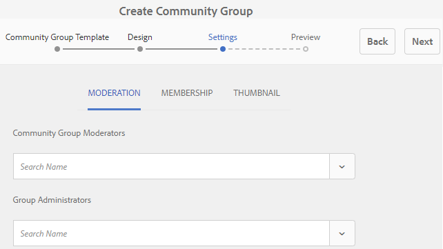

# Console van groepen Gemeenschap {#community-groups-console}

De console van Groepen verleent toegang tot het creëren van communautaire groepen wanneer de [malplaatjestructuur](/help/communities/sites-console.md#step1) van een communautaire plaats de [groepsfunctie](/help/communities/functions.md#groups-function)omvat.

* AEM-gemeenschappen ondersteunen het nesten van groepen binnen andere groepen. Groepnesten is mogelijk wanneer de [structuur van de nieuwe groep](/help/communities/tools-groups.md) de groepfunctie bevat.
* Alleen voor de auteursomgeving is er een wizard voor het maken van groepen die lijkt op de wizard voor het maken van sites.
* Of (of niet) de leden groepen in publiceren milieu kunnen tot stand brengen is het configureerbaar wanneer het toevoegen van een functie van Groepen aan een communautaire plaatsstructuur of een communautaire groepsstructuur.

Van de drie meegeleverde groepssjablonen bevat alleen de `Reference Group` sjabloon een groepfunctie in de structuur.

De verschillende facetten van de communautaire groepen zijn:

* **Maken**: U kunt een nieuwe groep maken op auteur en optioneel op een publicatie-instantie.
* **Besturingselement**: groep kan open of geheim zijn.
* **Nesten**: groep kan nul of meer groepen bevatten.

<!-- This is a 404 on helpx. Please update or remove.
>[!NOTE]
>
>Community groups, created in the publish environment before the [existence of the Community Groups console](/help/communities/version-history.md#featurepack1fp1), will not be listed in the Community Groups console, and thus, are not modifiable using the console.-->

>[!NOTE]
>
>Deze console van Groepen, slechts toegankelijk van de console van de Plaatsen van Gemeenschappen, moet niet met de console [van de](/help/communities/members.md) Groepen van de leden voor het beheren van lidgroepen worden verward.
>
>De groepen van het lid zijn gebruikersgroepen die in publicatiemilieu worden geregistreerd en van het auteursmilieu worden betreden gebruikend de [tunneldienst](/help/communities/deploy-communities.md#tunnel-service-on-author)die.

## Groep maken {#group-creation}

De console Groepen openen:

* Meld u aan bij de auteur met beheerdersrechten.
* Vanuit globale navigatie: **[!UICONTROL Communities]** > **[!UICONTROL Sites]**.
* Selecteer een bestaande map op de communitysite om deze te openen.
* Selecteer een exemplaar van een communautaire plaats binnen de omslag.

   * De structuur van de site van de community moet een groepfunctie bevatten.
   * Deze schermafbeeldingen zijn afkomstig uit de zelfstudie Aan de slag nadat u groepen hebt [gemaakt tijdens het publiceren](/help/communities/published-site.md).

* Selecteer de map **** Groepen om deze te openen.

   Als deze groep wordt geopend, worden alle bestaande groepen weergegeven, ongeacht of deze groepen bij de auteur of bij de publicatie zijn gemaakt.

   Van deze console van Groepen, is het mogelijk om nieuwe groepen te ontwerpen.

   

* Selecteer de knop Groep **** maken.

### Stap 1: Template voor communautaire groep {#step-community-group-template}

* **Titel van communautaire groep**

   Een weergavetitel voor de groep.
De titel wordt op de gepubliceerde site voor de groep weergegeven.

* **Omschrijving van de communautaire groep**

   Een beschrijving van de groep.

* **Hoofdmap van communautaire groep**

   Het hoofdpad naar de groep.
De standaardhoofdmap is de bovenliggende site, maar de hoofdmap kan naar elke locatie binnen de website worden verplaatst. Het wordt afgeraden dit te wijzigen.

* **Menu Extra beschikbare talen voor communautaire groepen**

   Gebruik de vervolgkeuzelijst om de beschikbare taal of talen van groepen in de gebruikersgemeenschap te selecteren. In het menu worden alle talen weergegeven waarin de bovenliggende communitysite is gemaakt. Gebruikers kunnen in deze ene stap uit deze talen kiezen om groepen te maken in meerdere landinstellingen. De zelfde groep wordt gecreeerd in veelvoudige gespecificeerde talen in de console van Groepen van de respectieve communautaire plaatsen.

* **Naam van communautaire groep**

   De naam van de basispagina van de groep die in URL verschijnt.

   * Controleer de naam nogmaals omdat deze niet gemakkelijk kan worden gewijzigd nadat de groep is gemaakt.
   * De basis-URL wordt onder de `Community Group Name`URL weergegeven.
   * Voor een geldige URL voegt u &quot;.html&quot; toe
      *bijvoorbeeld*, `https://localhost:4502/content/sites/mysight/en/mygroup.html`.

* **Menu Sjabloon** communautaire groep

   Gebruik drop-down om een beschikbare malplaatje [van de](/help/communities/tools.md)communautaire groep te kiezen.

### Stap 2: Ontwerp {#step-design}

### THEMA VAN DE COMMUNAUTAIRE GROEP {#community-group-theme}

Het framework gebruikt [Twitter Bootstrap](https://twitterbootstrap.org/) om de site een responsief, flexibel ontwerp te geven. Een van de vele vooraf geladen Bootstrap-thema&#39;s kan worden geselecteerd om de geselecteerde communitygroepsjabloon te stijlvol te maken, maar een Bootstrap-thema kan ook worden geüpload.

Als deze optie is geselecteerd, wordt het thema bedekt met een ondoorzichtig blauw vinkje.

Het is mogelijk een thema te selecteren dat afwijkt van het thema van de bovenliggende site.

Nadat de communitysite is gepubliceerd, kunt u de eigenschappen  bewerken en een ander thema selecteren.

### COMMUNAUTAIRE BRANDBOEK {#community-group-branding}

De branding van de communautaire plaats is een beeld dat als kopbal over de bovenkant van elke pagina wordt getoond. Het is mogelijk om een banner voor de groep weer te geven die afwijkt van andere sitepagina&#39;s.

Het formaat van de afbeelding moet zo breed zijn als de verwachte weergave van de pagina in de browser en 120 pixels hoog.

Houd rekening met het volgende wanneer u een afbeelding maakt of selecteert:

* De afbeeldingshoogte wordt bijgesneden tot 120 pixels, gemeten vanaf de bovenrand van de afbeelding
* De afbeelding is vastgezet aan de linkerrand van het browservenster
* De afbeelding wordt niet vergroot of verkleind, zodat de volgende afbeeldingsbreedte wordt gebruikt:

   * Bij een lagere breedte dan de breedte van de browser wordt de afbeelding horizontaal herhaald.
   * Als de breedte van de browser groter is, wordt de afbeelding bijgesneden.

### Stap 3: Instellingen {#step-settings}

**MODERING**

**Moderatoren van communautaire groepen**

Door gebrek, wordt de lijst van moderatoren van de oudercommunautaire plaats geërft.

Het is mogelijk moderatoren toe te voegen die specifiek zijn voor de groep. Zoeken naar leden (vanuit publicatieomgeving) om deze toe te voegen als moderatoren

**Groepbeheerders**

Door gebrek, is de beheerder van de oudercommunautaire plaats de beheerder voor groepen ook.

Het is echter mogelijk om onafhankelijke groepsbeheerders toe te wijzen. De beheerders van de groep kunnen hun groep (bijvoorbeeld G1) beheren, en tot een subgroep leiden die onder G1 wordt genest. Zij kunnen verschillende beheerders voor subgroep verder toewijzen.

Een gebruiker U1, daarom, kan een beheerder in een groep G1 en een regelmatige gebruiker in zijn genestelde groep G2 zijn.

**LIDMAATSCHAP**

Met de instelling voor lidmaatschap kunt u een van de drie manieren selecteren om een community-groep te beveiligen.

* **Optioneel lidmaatschap**

   Indien geselecteerd, is de communautaire groep een openbare groep. Siteleden kunnen deelnemen aan de groep en posten zonder expliciet deel te nemen aan de groep. Standaard is geselecteerd.

* **Vereist lidmaatschap**

   Indien geselecteerd, is de communautaire groep een open groep. Leden van een Community-site kunnen de inhoud van de groep bekijken, maar moeten zich bij de groep voegen om inhoud te posten. Leden kunnen deelnemen door de `Join` knop te selecteren in de publicatieomgeving. Standaard is niet geselecteerd.

* **Beperkt lidmaatschap**

   Indien geselecteerd, is de communautaire groep een geheime groep. De leden van de Gemeenschap moeten uitdrukkelijk worden uitgenodigd. Uitgenodigde leden worden ingevoerd in het zoekvak. U kunt leden later toevoegen met de [leden en groepen die de auteursomgeving samenvoegen](/help/communities/members.md) . Standaard is niet geselecteerd.

**THUMBNAIL**

De miniatuur is een afbeelding die bij het ontwerpen en publiceren voor de groep moet worden weergegeven.

De optimale grootte voor een groepsafbeelding is 170 x 90 pixels in een ondersteunde afbeeldingsindeling (zoals JPG of PNG).

Als er geen afbeelding wordt toegevoegd, wordt een standaardafbeelding weergegeven.

### Stap 4: Groep maken {#step-create-group}

Als er aanpassingen nodig zijn, gebruikt u de knop **Terug ** om deze aan te brengen.

Nadat **Maken** is geselecteerd en gestart, kan het proces voor het maken van de groep niet worden onderbroken.

Wanneer het proces is voltooid, wordt de kaart voor de nieuwe subcommunity-site (groep) weergegeven in de console Sites Group van Communities, vanwaar auteurs pagina-inhoud kunnen toevoegen of beheerders de eigenschappen van de site kunnen wijzigen.

>[!NOTE]
>
>De groep wordt gecreeerd in alle talen, zoals die in [Stap 1 worden gespecificeerd: Het Malplaatje](/help/communities/groups.md#step-community-group-template) van de Groep van de Gemeenschap in de Extra Beschikbare Talen van de Groep van de Gemeenschap, in de console van Communautaire Groepen van de respectieve communautaire plaatsen.

## Inhoud groep auteurs {#author-group-content}

De pagina-inhoud van een groep kan met dezelfde gereedschappen worden gemaakt als elke andere AEM-pagina. Als u de groep wilt openen voor ontwerpen, selecteert u het pictogram Site openen dat wordt weergegeven wanneer u de muisaanwijzer op de groepskaart plaatst.

## Groepseigenschappen wijzigen {#modify-group-properties}

De eigenschappen van een bestaande subcommunitysite die tijdens het maken van een community zijn opgegeven, kunnen worden gewijzigd door het pictogram Site bewerken te selecteren dat wordt weergegeven wanneer u de muisaanwijzer op de groepskaart plaatst:

De details van de volgende eigenschappen komen overeen met de beschrijvingen in de sectie [Groep maken](#group-creation) . Alle geneste groepen kunnen worden gewijzigd, ongeacht of ze zijn gemaakt in de publicatieomgeving of in de auteursomgeving.

### Basis wijzigen {#modify-basic}

Met het BASIC-deelvenster kunt u

* Titel van communautaire groep
* Omschrijving van de communautaire groep

De naam van de communautaire groep mag niet worden gewijzigd.

Het kiezen van een verschillend malplaatje van de communautaire groep zou geen invloed op een bestaande communautaire groepsplaats hebben aangezien geen verbinding tussen malplaatjes en plaatsen blijft.

In plaats daarvan kan de [STRUCTUUR](#modify-structure) van de subgemeenschap worden gewijzigd.

### Structuur wijzigen {#modify-structure}

Met het deelvenster STRUCTUUR kunt u de structuur wijzigen die u aanvankelijk hebt gemaakt op basis van de sjabloon voor een groep met gemeenschappen die u hebt geselecteerd bij het maken van de subcommunity-site vanuit de auteur- of publicatieomgeving. Vanuit het deelvenster kunt u het volgende doen:

* Sleep extra [gemeenschapsfuncties](/help/communities/functions.md) naar de sitestructuur.
* Bij een instantie van een communautaire functie in de sitestructuur:

   * **`Gear icon`**
Bewerk instellingen, zoals de titel van de weergave en de URL-naam*en [geprivilegieerde ledengroepen](/help/communities/users.md#privilegedmembersgroups).

   * **`Trashcan icon`**
Verwijder (verwijder) functies uit de sitestructuur.

   * **`Grid icon`**
Wijzig de volgorde van de functies die wordt weergegeven op de navigatiebalk op het hoogste niveau van de site.

>[!CAUTION]
>
>Hoewel de titel van de weergave kan worden gewijzigd zonder neveneffecten, wordt het niet aanbevolen de URL-naam te bewerken van een community-functie die bij een community-site hoort.
>
>Als u bijvoorbeeld de naam van de URL wijzigt, wordt de bestaande UGC niet verplaatst, waardoor de UGC verloren gaat.

>[!CAUTION]
>
>De groepfunctie moet *niet *de *eerste of enige* functie in de sitestructuur zijn.
>
>Alle andere functies, zoals de [paginafunctie](/help/communities/functions.md#page-function), moeten worden opgenomen en als eerste worden vermeld.

**Voorbeeld: Een kalenderfunctie toevoegen aan een subcommunautaire (Groep) structuur**

### Ontwerp wijzigen {#modify-design}

In het deelvenster ONTWERP kunt u het thema wijzigen:

* [Communautair groepsthema](#community-group-theme)
* [Community Group Branding](#community-group-branding)

   * Schuif naar de onderkant van het deelvenster om de afbeelding van het merk te wijzigen.

### Instellingen wijzigen {#modify-settings}

Met het deelvenster INSTELLINGEN kunt u [moderatoren](#moderation)van de gebruikersgemeenschap toevoegen.

### Lidmaatschap wijzigen {#modify-membership}

Het deelvenster [LIDMAATSCHAP](#membership) is alleen ter informatie. Het is niet mogelijk om het type groepslidmaatschap dat is ingesteld, te wijzigen, ongeacht of het optioneel, vereist of beperkt is.

### Miniatuur wijzigen {#modify-thumbnail}

Met het deelvenster [MINIATUUR](#thumbnail) kunt u een afbeelding uploaden om de groep met gemeenschappen weer te geven voor sitebezoekers in de publicatieomgeving en in de console Groepen van de site van de Gemeenschappen in de auteursomgeving.

## De groep publiceren {#publish-the-group}

Nadat u een community-groep hebt gemaakt of gewijzigd, kunt u de groep publiceren (activeren) door het `Publish Site` pictogram te selecteren.

Zodra de groep met succes wordt gepubliceerd, zal een bericht verschijnen:

>[!CAUTION]
>
>De bovenliggende communitysite en bovenliggende groepen hadden al gepubliceerd moeten zijn.
>
>De site van de community en geneste groepen moeten van boven naar beneden worden gepubliceerd.

## De groep verwijderen {#delete-the-group}

Verwijder een groep uit de console van de Groepen van de gemeenschap door het pictogram van de Groep van de Schrapping te selecteren, dat wanneer het hangen van muis over de groep verschijnt.

Hierdoor worden alle aan de groep gekoppelde items verwijderd. Alle inhoud van de groep wordt bijvoorbeeld permanent verwijderd en gebruikerslidmaatschappen worden uit het systeem verwijderd.
