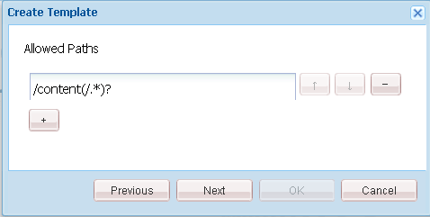

# Aanvankelijke zandbaktoepassing {#initial-sandbox-application}

In deze sectie maakt u het volgende:

* De **[template](#createthepagetemplate)** die wordt gebruikt om inhoudspagina&#39;s in de voorbeeldwebsite te maken.
* De **[component en script](#create-the-template-s-rendering-component)** waarmee de websitepagina&#39;s worden weergegeven.

## De inhoudssjabloon maken {#create-the-content-template}

Een sjabloon definieert de standaardinhoud van een nieuwe pagina. Complexe websites kunnen verschillende sjablonen gebruiken om de verschillende typen pagina&#39;s op de site te maken. Verder, kan de reeks malplaatjes een blauwdruk worden die aan rollout veranderingen in een cluster van servers wordt gebruikt.

In deze exercitie, zijn alle pagina&#39;s gebaseerd op één eenvoudig malplaatje.

1. In het deelvenster Verkenner van CRXDE Lite:

   * Selecteer `/apps/an-scf-sandbox/templates`
   * **[!UICONTROL Create]** > **[!UICONTROL Create Template]**

1. Typ in het dialoogvenster Sjabloon maken de volgende waarden en klik vervolgens op **[!UICONTROL Next]**:

   * Label: `playpage`
   * Titel: `An SCF Sandbox Play Template`
   * Beschrijving: `An SCF Sandbox template for play pages`
   * Type bron: `an-scf-sandbox/components/playpage`
   * Rangschikking: &lt;leave as=&quot;&quot; default=&quot;&quot;>

   Het label wordt gebruikt voor de knooppuntnaam.

   Het type resource wordt weergegeven op het tabblad `playpage`jcr:content node as the property `sling:resourceType`. Het identificeert de component (bron) die de inhoud teruggeeft wanneer daarom door browser wordt gevraagd.

   In dit geval worden alle pagina&#39;s gemaakt met de `playpage` sjabloon wordt weergegeven door de `an-scf-sandbox/components/playpage` component. Door overeenkomst, is de weg aan de component relatief, toestaand Sling om naar het middel eerst in te zoeken `/apps` en, indien niet gevonden, in de `/libs` map.

   

1. Als u kopiëren/plakken gebruikt, moet u ervoor zorgen dat de waarde van het Type resource geen voorloopspaties of navolgende spaties bevat.

   Klik op **[!UICONTROL Next]**.

1. &quot;Toegestane paden&quot; verwijst naar de paden van pagina&#39;s die deze sjabloon gebruiken, zodat de sjabloon wordt weergegeven voor de **[!UICONTROL New Page]** .

   Als u een pad wilt toevoegen, klikt u op de plusknop `+` en type `/content(/.&ast;)?` in het tekstvak dat wordt weergegeven. Als u kopiëren/plakken gebruikt, dient u ervoor te zorgen dat er geen voorloopspaties of volgspaties zijn.

   Opmerking: De waarde van de eigenschap allowed path is a *reguliere expressie*. Inhoudspagina&#39;s met een pad dat overeenkomt met de expressie, kunnen de sjabloon gebruiken. In dit geval komt de reguliere expressie overeen met het pad van het **/content** en alle bijbehorende subpagina&#39;s.

   Wanneer een auteur hieronder een pagina maakt `/content`de `playpage` De sjabloon &#39;Een SCF-sjabloon voor een sandbox-pagina&#39; wordt weergegeven in een lijst met beschikbare sjablonen.

   Nadat de basispagina van de sjabloon is gemaakt, kan de toegang tot de sjabloon worden beperkt tot deze website door de eigenschap zodanig te wijzigen dat het hoofdpad wordt opgenomen in de reguliere expressie, d.w.z.

   `/content/an-scf-sandbox(/.&ast;)?`

   

1. Klik op **[!UICONTROL Next]**.

   Klikken **[!UICONTROL Next]** in de **[!UICONTROL Allowed Parents]** deelvenster.

   Klikken **[!UICONTROL Next]** in de **[!UICONTROL Allowed Children]** deelvensters.

   Klik op **[!UICONTROL OK]**.

1. Als u eenmaal op OK hebt geklikt en de sjabloon hebt gemaakt, ziet u rode driehoeken in de hoeken van de waarden op het tabblad Eigenschappen voor de nieuwe sjabloon `playpage` sjabloon. Deze rode driehoeken geven bewerkingen aan die niet zijn opgeslagen.

   Klikken **[!UICONTROL Save All]** om de nieuwe sjabloon op te slaan in de repository.

   

### De renderingcomponent van de sjabloon maken {#create-the-template-s-rendering-component}

Maak de *component* dat de inhoud definieert en alle gemaakte pagina&#39;s rendert op basis van de [playpasjabloon](#createthepagetemplate).

1. In CRXDE Lite klikt u met de rechtermuisknop **`/apps/an-scf-sandbox/components`** en klik op **[!UICONTROL Create > Component]**.
1. Door de naam van het knooppunt (Label) in te stellen op *playpage*, het pad naar de component is

   `/apps/an-scf-sandbox/components/playpage`

   die overeenkomt met het bronnentype van de playpage-sjabloon (optioneel minus de initiële waarde **`/apps/`** deel van het pad).

   In de **[!UICONTROL Create Component]** typt u de volgende eigenschapswaarden:

   * Label: **playpage**
   * Titel: **Een SCF Sandbox Play-component**
   * Omschrijving: **Dit is de component die inhoud voor een SCF Sandbox pagina teruggeeft.**
   * Supertype: *&lt;leave blank=&quot;&quot;>*
   * Groep: *&lt;leave blank=&quot;&quot;>*

   

1. Klikken **[!UICONTROL Next]** tot de **[!UICONTROL Allowed Children]** wordt weergegeven:

   * Klik op **[!UICONTROL OK]**.
   * Klik op **[!UICONTROL Save All]**.

1. Verifieer dat de weg aan de component en resourceType voor het malplaatje aanpast.

   >[!CAUTION]
   >
   >De overeenstemming tussen de weg aan de playpage component en het sling:resourceType bezit van het playpage malplaatje is essentieel voor het correcte functioneren van de website.

   
