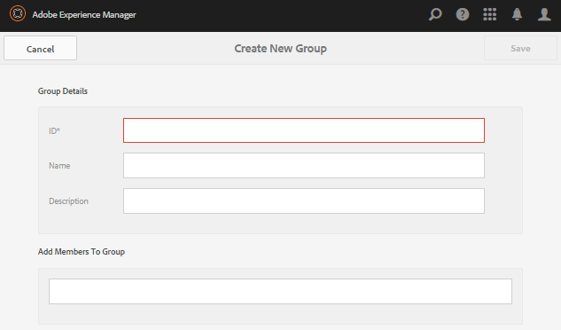

# Leden en groepen beheerconsoles {#members-groups-management-consoles}

## Overzicht {#overview}

Voor AEM Communities-functies moeten bezoekers van de site vaak worden geregistreerd en aangemeld voordat ze kunnen deelnemen aan een community in de publicatieomgeving. Hun gebruikersregistratie hoeft alleen te bestaan in de publicatieomgeving en wordt doorgaans *leden* genoemd om ze te onderscheiden van *gebruikers* die zijn geregistreerd in de auteursomgeving.

### Leden (gebruikers) voor publicatie {#members-users-on-publish}

Met behulp van de consoles van leden en groepen van Gemeenschappen kunnen leden en ledengroepen die in de *publicatieomgeving* zijn geregistreerd, worden gemaakt en beheerd vanuit de *auteursomgeving* . Dit is slechts mogelijk wanneer de [tunneldienst](deploy-communities.md#tunnel-service-on-author) wordt toegelaten.

### Gebruikers op auteur {#users-on-author}

Voor het beheren van gebruikers en groepen die in de *auteursomgeving* zijn geregistreerd, is noodzakelijk om de de veiligheidsconsole van het platform te gebruiken:

* Selecteer **[!UICONTROL Tools]** > **[!UICONTROL Security]** > **[!UICONTROL Users]**.
* Selecteer **[!UICONTROL Tools]** > **[!UICONTROL Security]** > **[!UICONTROL Groups]**.

>[!NOTE]
>
>Als voorbeeldinhoud is geïmplementeerd en ingeschakeld, zijn er veel voorbeeldgebruikers in zowel de auteur- als de publicatieomgeving. Deze gebruikers zullen niet aanwezig zijn wanneer het lopen met [geen runtime](../../help/sites-administering/production-ready.md)van de Inhoud.

## Ledenconsole {#members-console}

In het auteursmilieu, om de console van Leden te bereiken voor het beheren van leden die in het publicatiemilieu worden geregistreerd:

* Selecteer **[!UICONTROL Navigation]** > **[!UICONTROL Communities]** > **[!UICONTROL Members]**

>[!CAUTION]
>
>Het zal niet mogelijk zijn om de console van Leden te gebruiken als de [tunneldienst](deploy-communities.md#tunnel-service-on-author) niet wordt toegelaten.

### Zoeken {#search-features}

Selecteer het pictogram van het zijpaneel aan de linkerkant van de `Members` kopbal om het onderzoek zijpaneel van een knevel te voorzien.

Selecteer het zoekpictogram aan de linkerkant van de `Members` koptekst om het venster met de zoekzijde te sluiten.

### Statistieken van de lidstaten {#member-statistics}

De kolommen waarin `Views`, `Posts`en `Follows` en `Likes` worden weergegeven wanneer de gebruiker lid is van een of meer communitysites waarvoor Adobe Analytics is [ingeschakeld](sites-console.md#analytics).

### CSV exporteren {#export-csv}

Als u de `Export CSV` koppeling selecteert, worden alle leden gedownload als een lijst met door komma&#39;s gescheiden waarden die u kunt importeren in een spreadsheet.

De kolomkoppen zijn

`| Screen Name |Last Name |First Name |Status |Views |Posts |Follows |Likes |`

## Nieuw lid maken {#create-new-member}

Selecteer deze optie `Create Member` om een gebruiker te maken in de publicatieomgeving.

### ALGEMEEN - Gegevens van de leden {#general-member-details}

De meeste velden zijn optionele velden die leden later kunnen invullen in hun profiel.

* **[!UICONTROL ID]**

(*Vereist*) De autoriseerbare id is de aanmeldings-id van het lid.
Standaard wordt de id ingesteld op de waarde van het vereiste e-mailadres.
*Nadat de id is gemaakt, kan deze niet meer worden gewijzigd*.

* **[!UICONTROL Email Address]**

(*Vereist*) Het e-mailadres van het lid.
Het lid kan zijn e-mailadres wijzigen bij het bijwerken van zijn profiel.Als de id standaard op het e-mailadres is ingesteld, verandert de id *niet* wanneer het e-mailadres wordt gewijzigd.

* **[!UICONTROL Password]**

   (*Vereist*) Het aanmeldingswachtwoord.

* **[!UICONTROL Retype Password]**

   (*Vereist*) Voer het wachtwoord opnieuw in ter verificatie.

* **[!UICONTROL Add Member to Sites]**

   (*Optioneel*) Maak een keuze uit bestaande communitysites en voeg het lid toe aan de ledengroep van de site van de community.

* **[!UICONTROL Add Member to Groups]**

   (*Facultatief*) Uitgezocht van bestaande lidgroepen om het lid aan die groep toe te voegen.

* Selecteer **[!UICONTROL Save]**

### ALGEMEEN - Accountinstellingen {#general-account-settings}

Onder de montages van de Rekening is het mogelijk voor een communautaire beheerder:

* **[!UICONTROL Status]**
   * Een lid met een abonnement kan zich niet aanmelden, zodat het geen pagina&#39;s kan weergeven of kan deelnemen aan activiteiten waarvoor aanmelden vereist is. Ze kunnen nog steeds anoniem een open communitysite bezoeken.

   * Niet verbodenEen lid heeft volledige toegang tot de site van de community.

   Standaard is dit `Not Banned`.

* **[!UICONTROL Contribution Limits]**

   Als deze optie is ingeschakeld, is de mogelijkheid voor leden om inhoud te posten beperkt.
Het gebrek hangt van de configuratie van bijdragegrenzen af.
Zie bijdragelimieten voor [leden](limits.md).

* **[!UICONTROL Change Password]**

   Een koppeling die aanwezig is wanneer een bestaand lid wordt gewijzigd. Verstrekt de capaciteit voor een communautaire beheerder om een wachtwoord voor een lid terug te stellen.

### ALGEMEEN - Foto {#general-photo}

Als u een avatar voor het lid wilt opgeven, selecteert u eerst een afbeelding van het type .jpg, .png, .tif of .gif **[!UICONTROL Upload Image]** en kiest u deze. De voorkeursgrootte voor een afbeelding is 240 x 240 pixels bij 72 dpi.

### ALGEMEEN - Lid toevoegen aan sites {#general-add-member-to-sites}

Het lid kan worden toegevoegd aan een of meer groepen van leden van sites van de community. Voer eerst tekst in het tekstvak in.

### ALGEMEEN - Lid toevoegen aan groepen {#general-add-member-to-groups}

Het lid kan aan een of meer ledengroepen worden toegevoegd. Voer eerst tekst in het tekstvak in.

### Tabblad BADGES {#badges-tab}

Met `BADGES` dit deelvenster kunt u badges handmatig toewijzen en intrekken. De badges kunnen voor toegewezen rollen evenals badges typisch worden verdiend.

Zie ook [Scores en Badges](implementing-scoring.md).

* **[!UICONTROL Add badges]**
   * Typ tekst om een van de [beschikbare badges](badges.md)te selecteren. Wanneer een badge is geselecteerd, kiest u elke site of alle sites waarop de badge samen met de avatar van het lid moet worden weergegeven.
   * Er kunnen meerdere badges en sites worden gekozen.
* **[!UICONTROL Remove badges]**
   * Selecteer het prullenbakpictogram naast een badge om het te verwijderen.

## Groepsconsole {#groups-console}

De console van Groepen, beschikbaar bij het auteursmilieu, staat voor de verwezenlijking en het beheer van lidgroepen toe die in het publicatiemilieu worden geregistreerd. Het is met name nuttig voor:
* [Geprivilegieerde ledengroepen](users.md#privilegedmembersgroups)
* Groepse toewijzing van [actiemiddelen](resources.md)

De console Groepen openen:
* Selecteer **[!UICONTROL Navigation]** > **[!UICONTROL Communities]** > **[!UICONTROL Groups]**.

>[!CAUTION]
>
>Het zal niet mogelijk zijn om de console van Groepen te gebruiken als de [tunneldienst](deploy-communities.md#tunnel-service-on-author) niet wordt toegelaten.

### Nieuwe groep maken {#create-new-group}

Selecteer deze optie `Add Group` om een groep te maken in de publicatieomgeving.

De vereiste gebieden voor het creëren van een nieuwe publish-side lidgroep zijn:

* **[!UICONTROL ID]**

   (*Vereist*) De unieke groep-id.

   *Nadat de id is gemaakt, kan deze niet meer worden gewijzigd.*

* **[!UICONTROL Name]**

   (*Optioneel*) De weergavenaam van de groep.

   De standaardwaarde is ID.

* **[!UICONTROL Description]**

   (*Optioneel*) Een beschrijving van het doel en de machtigingen van de groep.

* **[!UICONTROL Add Members To Group]**

   (*Optioneel*) Selecteer de leden van de publicatiezijde die u wilt opnemen als eerste leden van de groep.

* Selecteer **[!UICONTROL Save]**

## Geautoriseerde beheerders {#authorized-administrators}

Wanneer het werken met leden in de de ledenconsole van Gemeenschappen, is het noodzakelijk om binnen als gebruiker met aangewezen toestemmingen worden ondertekend, en voor de replicatieagent die door de [tunneldienst](deploy-communities.md#tunnel-service-on-author) wordt gebruikt correct worden gevormd.

Als u zich niet hebt aangemeld als `admin`, moet de gebruiker die zich heeft aangemeld lid zijn van de `administrators` gebruikersgroep.

Zie ook [Replication Agents op Auteur](deploy-communities.md#replication-agents-on-author).
