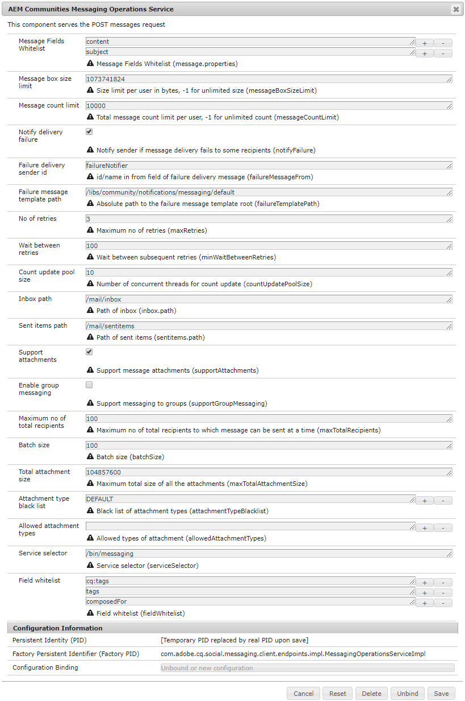

# Berichten configureren {#configure-messaging}

## Overzicht {#overview}

Met de communicatiefunctie voor AEM Communities kunnen bezoekers van de aangemelde site (leden) berichten naar elkaar sturen die toegankelijk zijn wanneer ze zich op de site hebben aangemeld.

Het overseinen wordt toegelaten voor een communautaire plaats door een doos tijdens te controleren [site maken](/help/communities/sites-console.md).

Deze pagina bevat informatie over de standaardconfiguratie en mogelijke aanpassingen.

Zie voor meer informatie voor ontwikkelaars [Grondbeginselen van berichten](/help/communities/essentials-messaging.md).

## Service voor berichtenverkeer {#messaging-operations-service}

De configuratie [AEM Communities Messaging Operations Service](https://localhost:4502/system/console/configMgr/com.adobe.cq.social.messaging.client.endpoints.impl.MessagingOperationsServiceImpl) identificeert het eindpunt dat op overseinen betrekking hebbende verzoeken behandelt, de omslagen de dienst voor het opslaan van berichten zou moeten gebruiken, en als de berichten dossiergehechtheid kunnen omvatten, welke dossiertypes worden toegestaan.

Voor gemeenschapssites die zijn gemaakt met de `Communities Sites console`, bestaat er een instantie van de service, met de inbox ingesteld op `/mail/inbox`.

### Community Messaging Operations Service {#community-messaging-operations-service}

Zoals hieronder getoond, bestaat een configuratie van de dienst voor plaatsen die met worden gecreeerd [wizard voor het maken van sites](/help/communities/sites-console.md). U kunt de configuratie weergeven of bewerken door het potloodpictogram naast de configuratie te selecteren.

### Nieuwe configuratie toevoegen {#add-new-configuration}

Als u een configuratie wilt toevoegen, selecteert u de plus **+** pictogram naast de naam van de service:

* **Lijst van gewenste personen Berichtvelden**

  Hiermee geeft u de eigenschappen op van de component Bericht samenstellen die gebruikers kunnen bewerken en behouden. Als nieuwe formulierelementen worden toegevoegd, moet de element-id desgewenst worden toegevoegd om te worden opgeslagen in SRP. Standaard zijn dit twee items: *onderwerp* en *content*.

* **Maximale grootte berichtvenster**

  Het maximum aantal bytes in het berichtvenster van elke gebruiker. Standaard is *1073741824* (1 GB)

* **Limiet voor aantal berichten**

  Het totale aantal toegestane berichten per gebruiker. De waarde -1 geeft aan dat een onbeperkt aantal berichten is toegestaan, afhankelijk van de groottelimiet van het berichtvenster. Standaard is *10000* 10 duodecies.

* **Leveringsfout melden**

  Als deze optie is ingeschakeld, stuurt u een melding naar de afzender als de berichtlevering bij sommige ontvangers mislukt. Standaard is *ingeschakeld*.

* **Leverancier-id mislukt**

  Naam van afzender die in ontbroken bericht verschijnt levering. Standaard is *failureNotifier*.

* **Sjabloonpad voor mislukte berichten**

  Absoluut pad naar de levering is mislukt. Standaard is */etc/notification/messaging/default*.

* **Aantal pogingen**

  Aantal keren dat het opnieuw verzenden van een bericht moet worden uitgevoerd. Standaard is *3*.

* **Wacht tussen opnieuw proberen**

  Aantal seconden te wachten tussen pogingen om bericht op gebrek opnieuw te verzenden. Standaard is *100* (seconden).

* **Grootte van updatepool tellen**

  Aantal gezamenlijke draden die voor tellerupdate worden gebruikt. Standaard is *10*.

* **Pad in vak**

  (*Vereist*) Het pad ten opzichte van het knooppunt van de gebruiker (/home/users/*gebruikersnaam*), te gebruiken voor de `inbox` map. Het pad mag NIET eindigen met een slash &#39;/&#39; achter het pad. Standaard is */mail/inbox*.

* **Pad naar verzonden items**

  (*Vereist*) Het pad ten opzichte van het knooppunt van de gebruiker (/home/users/*gebruikersnaam*), te gebruiken voor de `sent items` map. Het pad mag NIET eindigen met een slash &#39;/&#39; achter het pad. Standaard is */mail/sentitems* .

* **Ondersteuningsbijlagen**

  Als deze optie is ingeschakeld, kunnen gebruikers bijlagen toevoegen aan hun berichten. Standaard is *ingeschakeld*.

* **Groepsberichten inschakelen**

  Als deze optie is geselecteerd, kunnen geregistreerde gebruikers bulkberichten naar een groep leden verzenden. Standaard is *gedeselecteerd*.

* **Maximum aantal. van de totale begunstigden**

  Als het groepsoverseinen wordt toegelaten, specificeer het maximumaantal ontvangers waarnaar het groepsbericht tegelijkertijd kan worden verzonden. Standaard is *100*.

* **Batchgrootte**

  Aantal berichten aan partij samen voor verzenden wanneer het verzenden naar een grote groep ontvangers. Standaard is *100*.

* **Totale grootte van bijlage**

  Als supportAttachments wordt gecontroleerd, specificeert deze waarde de maximum toegestane totale grootte (in bytes) van alle gehechtheid. Standaard is *104857600* (100 MB)

* **Lijst van gewezen personen van bijlagetype**

  Een lijst van gewezen personen met bestandsextensies, vooraf ingesteld op &#39;**.**&quot;, dat wordt door het systeem verworpen. Als de extensie niet wordt gevoegd op lijst van gewenste personen, is deze toegestaan. Extensies kunnen worden toegevoegd of verwijderd met de &#39;**+**&#39; en &#39;**-** pictogrammen.

* **Toegestane typen bijlagen**

  **(*Actie vereist*)** Een lijst van gewenste personen van filename uitbreidingen, het tegenovergestelde van de lijst van gewezen personen. Als u alle bestandsextensies wilt toestaan, behalve extensies die zijn gevoegd op lijst van gewenste personen, gebruikt u de optie &quot;**-** pictogram om één leeg item te verwijderen.

* **Servicekiezer**

  (*Vereist*) Een absolute weg (eindpunt) waardoor de dienst (een virtueel middel) wordt geroepen. De hoofdmap van het gekozen pad moet zijn opgenomen in het dialoogvenster *Uitvoerpaden* configuratie-instelling van OSGi config [`Apache Sling Servlet/Script Resolver and Error Handler`](https://localhost:4502/system/console/configMgr/org.apache.sling.servlets.resolver.SlingServletResolver), zoals `/bin/`, `/apps/`, en `/services/`. Om deze configuratie voor het overseineneigenschap van een plaats te selecteren, wordt dit eindpunt verstrekt als **`Service selector`** waarde voor de `Message List and Compose Message components` (zie [Berichtonderdeel](/help/communities/configure-messaging.md)).

  De standaardwaarde is */bin/messaging* .

* **Lijst van gewenste personen veld**

  Gebruiken **Lijst van gewenste personen Berichtvelden**.

>[!CAUTION]
>
>Elke keer een `Messaging Operations Service` configuratie wordt geopend voor bewerking, als `allowedAttachmentTypes.name` is verwijderd, wordt een lege ingang gelezen om het bezit configureerbaar te maken. Bij één leeg item worden bestandsbijlagen uitgeschakeld.
>
>Als u alle bestandsextensies wilt toestaan, behalve extensies die zijn gevoegd op lijst van gewenste personen, gebruikt u de optie &quot;**-**&#39; pictogram naar (opnieuw) verwijder het enkele lege item voordat u op **Opslaan**.

## Groepsberichten {#group-messaging}

Om geregistreerde gebruikers toe te staan om directe berichten in bulk naar gebruikersgroepen te verzenden, zorg ervoor **Groepsberichten inschakelen** in de volgende twee gevallen: **Messaging Operation Services** configuratie:

* `com.adobe.cq.social.messaging.client.endpoints.impl.MessagingOperationsServiceImpl~social-console`
* `com.adobe.cq.social.messaging.client.endpoints.impl.MessagingOperationsServiceImpl~social-messaging`

**Messaging Operations Service: sociale console**

**Messaging Operations Service: sociale berichten**

## Problemen oplossen {#troubleshooting}

Één manier om problemen op te lossen is toe te laten [foutopsporingsberichten in het logbestand.](/help/sites-administering/troubleshooting.md)

Zie ook [Loggers en schrijvers voor de Individuele Diensten](/help/sites-deploying/configure-logging.md#loggers-and-writers-for-individual-services).

Het te controleren pakket is `com.adobe.cq.social.messaging`.
