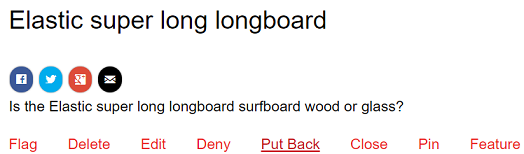

# Modernisering van communautaire inhoud {#moderating-community-content}

## Overzicht {#overview}

Community-inhoud, ook wel door gebruikers gegenereerde inhoud (UGC) genoemd, wordt gemaakt wanneer een lid (dat is aangemeld bij de bezoeker van de site) inhoud van een gepubliceerde communitysite plaatst via interactie met een van de volgende onderdelen van de gemeenschap:

* [ Blog ](/help/communities/blog-feature.md): leden posten een blogartikel of commentaar.
* [ Kalender ](/help/communities/calendar.md): leden posten een kalendergebeurtenis of een commentaar.
* [ Commentaren ](/help/communities/comments.md): de leden posten een commentaar of een antwoord op een commentaar.

* [ Forum ](/help/communities/forum.md): de leden posten een nieuw onderwerp of antwoorden op een onderwerp.
* [ Ideatie ](/help/communities/ideation-feature.md): de leden posten een idee of een commentaar.
* [ QnA ](/help/communities/working-with-qna.md): de leden leiden tot een vraag of beantwoorden een vraag.
* [ Recensies ](/help/communities/reviews.md): leden posten een commentaar wanneer het classificeren van een punt.

Moderatie van UGC is nuttig om positieve bijdragen te herkennen en negatieve (zoals spam en misleidende taal) te beperken. UGC kan vanuit verschillende omgevingen worden gemodereerd:

* [Opslag van communautaire inhoud](working-with-srp.md)

* [Moderniseringsconsole](moderation.md)

  De console van de Moderatie is toegankelijk door beheerders en [ communautaire moderatoren ](/help/communities/users.md) in het openbare milieu en door beheerders in het auteursmilieu. Dit is mogelijk wanneer de communautaire inhoud in a [ gemeenschappelijke opslag ](/help/communities/working-with-srp.md) wordt opgeslagen.

* [Moderatie binnen de context](in-context.md)

  De modernisering in het milieu van Publish kan door beheerders en communautaire moderatoren direct op de pagina worden uitgevoerd waar de inhoud werd gepost.

## Moderatiehandelingen {#moderation-actions}

De acties die op geposte inhoud (UGC) kunnen worden uitgevoerd variëren afhankelijk van de gebruikersidentiteit en het milieu. In de onderstaande tabel wordt de volgende terminologie gebruikt om de verschillende rollen te beschrijven op basis van de gebruikersidentiteit:

* `Admin`

  Een gebruiker die een lid van [ gemeenschap-beheerders ](users.md) groep is.

* `Moderator`

  Een lid van a [ communautaire moderators ](users.md#publishenvironmentusersandgroups) groep (heeft [ moderatortoestemmingen ](in-context.md#moderatorpermissions)).

* `Creator`

  De gebruiker die de inhoud heeft gepost.

* `Member`

  Een aangemelde gebruiker zonder speciale machtigingen.

* `Visitor`

  Een anonieme gebruiker.

<table>
 <tbody>
  <tr>
   <td> </td>
   <td><strong>Beheerder</strong></td>
   <td><strong>Moderator</strong></td>
   <td><strong>Maker</strong></td>
   <td><strong>Lid</strong></td>
   <td><strong>Bezoeker</strong></td>
   <td><strong>Gebeurtenis   geactiveerd</strong></td>
   <td><strong>Voormatig</strong></td>
  </tr>
  <tr>
   <td><strong>Bewerken/  Verwijderen</strong></td>
   <td>X</td>
   <td>X</td>
   <td>X</td>
   <td> </td>
   <td> </td>
   <td> </td>
   <td> </td>
  </tr>
  <tr>
   <td><strong>Knippen</strong></td>
   <td>X</td>
   <td>X</td>
   <td> </td>
   <td> </td>
   <td> </td>
   <td> </td>
   <td> </td>
  </tr>
  <tr>
   <td><strong>Weigeren</strong></td>
   <td>X</td>
   <td>X</td>
   <td> </td>
   <td> </td>
   <td> </td>
   <td>X</td>
   <td> </td>
  </tr>
  <tr>
   <td><strong>Sluiten/  Opnieuw openen</strong></td>
   <td>X</td>
   <td>X</td>
   <td> </td>
   <td> </td>
   <td> </td>
   <td>X</td>
   <td>X  </td>
  </tr>
  <tr>
   <td><strong>Markering/  Markering ongedaan maken</strong></td>
   <td>X</td>
   <td>X</td>
   <td> </td>
   <td>X</td>
   <td> </td>
   <td>X</td>
   <td> </td>
  </tr>
  <tr>
   <td><strong>Toestaan</strong></td>
   <td>X</td>
   <td>X</td>
   <td> </td>
   <td> </td>
   <td> </td>
   <td>X</td>
   <td>X</td>
  </tr>
 </tbody>
</table>

### Bewerken/verwijderen {#edit-delete}

Nadat een post is gemaakt, kan het door de schepper, een beheerder, of communautaire moderator worden uitgegeven of worden geschrapt.

Wanneer UGC wordt verwijderd, wordt deze verwijderd uit de opslagplaats en wordt deze mogelijk niet hersteld.

### Knippen {#cut}

Het is mogelijk voor een beheerder of communautaire moderator om één of meerdere forumonderwerpen of vragen QnA van één plaats aan een andere te bewegen. Dit omvat van één communautaire plaats aan een andere communautaire plaats, op voorwaarde dat het zelfde lid moderatie voorrechten op beide plaatsen heeft.

Door de actie Knippen te selecteren, wordt de inhoud gekopieerd naar een klembord. Meerdere posts kunnen als groep naar de nieuwe locatie worden gekopieerd en verplaatst.

Op de andere locatie, wanneer het klembord inhoud bevat, wordt naast Nieuwe Post een knop Plakken weergegeven met een nummer dat het aantal te plakken posten aangeeft. Met de knop Plakken kunt u het klembord wissen in plaats van te plakken.

### Weigeren {#deny}

Een moderator kan toestaan UGC om zichtbaar op de gepubliceerde plaats te blijven. Voor beheerders en moderatoren van de gemeenschap, is de post nog beschikbaar en geannoteerd als spam.

### Sluiten/Opnieuw openen {#close-reopen}

De dichte actie werkt op de volledige draad van gesprek (een forumonderwerp of de aanvankelijke commentaar) en het omvat alle verdere posten of antwoorden.

Wanneer ze gesloten worden, zijn niet alleen geen verdere antwoorden mogelijk, ook geen gematigde acties toegestaan.

Om het even welke verrichtingen uit te voeren, moet het onderwerp of de commentaar opnieuw worden geopend.

De close/Reopen actie kan door beheerders of communautaire moderatoren worden genomen.

### Markering/markering ongedaan maken {#flag-unflag}

Markering is een manier om aan te geven dat er een probleem is met de inhoud van een bericht, met uitzondering van de maker van de inhoud. Als deze eenmaal is gemarkeerd, wordt een pictogram voor markering ongedaan gemaakt, zodat hetzelfde lid de markering van de inhoud kan opheffen.

In-context de matiging kan worden gevormd om leden toe te staan om een reden te selecteren wanneer het vlaggen van een post. De lijst van selecteerbare vlagredenen is configureerbaar met inbegrip van of een douanereden kan zijn ingegaan. De vlaggenreden wordt bewaard met UGC maar de reden veroorzaakt geen bepaalde actie. Alleen het aantal markeringen activeert een melding. Op gemarkeerde inhoud is als zodanig geannoteerd, zodat moderatoren hierop kunnen reageren.

Het systeem houdt alle vlaggen bij, die, en de vlagreden zijn gemarkeerd en verzendt een gebeurtenis wanneer de drempel is bereikt. Als UGC door een communautaire moderator wordt toegestaan, worden deze vlaggen gearchiveerd. Nadat het toestaan en het archiveren, als er verdere vlaggen zijn, zouden zij worden gearchiveerd alsof er geen vorige vlaggen waren geweest.

### Toestaan {#allow}

De actie Toestaan is een optie voor UGC die is gemarkeerd, geweigerd of niet is goedgekeurd in een vooraf gemoderniseerd systeem. Met de handeling Toestaan worden alle gemarkeerde of ontkende/spamstatus gewist en worden alle gemarkeerde gegevens gearchiveerd.

## Vaak Moderniseringsconcepten {#common-moderation-concepts}

### Premoderatie {#premoderation}

Wanneer de UGC wordt gepremodereerd, verschijnt de post niet op de gepubliceerde plaats tot goedkeuring door een moderatie actie. Tijdens verwezenlijking van a [ communautaire plaats ](/help/communities/sites-console.md), die de doos [ Inhoud controleert wordt Voorgematigd ](sites-console.md#moderation) laat premoderatie voor de volledige plaats toe. Wanneer de componenten op een pagina worden geplaatst, kunnen de componenten die matiging steunen voor premoderatie worden gevormd gebruikend het plaatsen in hun uitgeven dialoog:

* [ Commentaren ](comments.md) en [ overzichten ](reviews.md)
in **[!UICONTROL User Moderation]** > **[!UICONTROL Pre-Moderation]** .

* [ Forum ](/help/communities/forum.md), [ ideatie ](/help/communities/ideation-feature.md), [ QnA ](/help/communities/working-with-qna.md), en [ kalender ](/help/communities/calendar.md)
in **[!UICONTROL Settings]** > **[!UICONTROL Moderated]** .

### Spam-detectie {#spam-detection}

Spam-detectie is een automatische moderatiefunctionaliteit die ongewenste stukken verzonden door de gebruiker gegenereerde inhoud filtert door deze als spam te markeren. Zodra toegelaten, identificeert het of een gebruiker-geproduceerde inhoud spam of niet gebaseerd op een pre-gevormde inzameling van spamwoorden is. De standaardspamwoorden worden verstrekt bij

`/libs/settings/community/sites/moderation/spamdetector-conf/profiles/spam_words.txt`.

Nochtans, om de standaardspamwoorden aan te passen of uit te breiden, creeer een reeks woorden in de /apps folder na de structuur van de standaardspamwoorden met [ bekleding ](/help/communities/overlay-comments.md).

Een door de gebruiker gegenereerde post (in alle inhoudstypen, zoals blogs, forums en opmerkingen) met spamwoorden wordt boven de post gemarkeerd met de tekst &quot;Dit bericht is geclassificeerd als spam&quot;.

De moderator kan zulk een bericht zien en het zelfde merken om toe te staan of te ontkennen om op de plaats te verschijnen. De acties van de modernisering op deze posten kunnen of in-context of door bulkmoderatie UI worden uitgevoerd.

Ga als volgt te werk om de spamdetectieengine in te schakelen:

1. Open [ Console van het Web ](https://localhost:4502/system/console/configMgr), door naar `/system/console/configMgr` te gaan.

1. Bepaal de plaats **configuratie van de Moderatie van 0&rbrace; AEM Communities Auto, en geef het uit.**
1. Voeg de vermelding **[!UICONTROL SpamProcess]** toe.

>[!NOTE]
>
>Spam-detectie wordt alleen geïmplementeerd voor Engelse landinstellingen.

### Sentiment {#sentiment}

De bedoeling wordt berekend gebaseerd op het aantal positieve en negatieve sleutelwoorden ([ watchwords ](#configuringwatchwords)) aanwezig in een post (UGC).

De sentimentanalyse gebruikt een reeks vooraf geconfigureerde regels en berekent het sentiment van de UGC. De standaardregels staan op `/libs/cq/workflow/components/workflow/social/sentiments/rules` .

De waarde die de regels genereren, ligt tussen 1 (alle negatieve, geen positieve woorden) en 10 (alle positieve, geen negatieve woorden). Een sentimentwaarde van 5 is een neutraal sentiment en is de standaardwaarde.

De regels die in de /libs component worden bepaald zijn:

* Regel 1: stel waarde in op 1 als er geen positieve woorden en ten minste één negatief woord zijn.
* Regel 2: stel de waarde in op 10 als er geen negatieve woorden en ten minste één positief woord zijn.
* Regel 3: stel waarde in op 3 als er meer negatieve woorden zijn dan positieve woorden.
* Regel 4: stel de waarde in op 8 als er meer positieve woorden zijn dan negatieve woorden.

Als u regels wilt overschrijven of toevoegen, maakt u een set regels in de map /apps volgens de structuur van de standaardregels. Bewerk de sentimentconfiguratie zodat u de locatie van de regels kunt identificeren.

Zodra geanalyseerd, wordt het sentiment bewaard met UGC.

Van de [ bulkmoderatieconsole ](/help/communities/moderation.md), is het mogelijk om UGC te filtreren en te bekijken gebaseerd op of het sentiment negatief, neutraal, of positief is.

#### Wachtwoorden {#watchwords}

AEM Communities verstrekt a *controleur van het watchword* als stap in het proces om [ sentiment ](#sentiment) te evalueren. De bijdrage aan de sentimentwaarde die wordt geboden door watchwords is te wijten aan een vergelijking van negatieve en positieve watchwords die worden gebruikt in de geposte inhoud, en verboden woorden.

#### Sentificatie en wachtwoorden configureren {#configure-sentiment-and-watchwords}

De lijst van positieve en negatieve woorden kan worden aangepast zoals de sentimentregels kunnen zijn.

De standaardlijst van wachtwoorden kan als eigenschappen van een knoop in de bewaarplaats, gelijkend op het gebrek worden ingegaan of door het gebrek met voeten te treden door de dienst OSGi `sentimentprocess.name` met de lijst van woorden te vormen.

**sentimentprocess.name** kan ook worden gewijzigd om de plaats van een douanereeks sentimentregels van verwijzingen te voorzien.

sentiment en wachtwoorden configureren:

* Meld u als beheerder aan bij de auteur.
* Open [ Console van het Web ](https://localhost:4502/system/console/configMgr).
* Zoek `sentimentprocess.name` .
* Selecteer de configuratie zodat u deze kunt openen in de bewerkingsmodus.

* **Positieve horloges**

  Een door komma&#39;s gescheiden lijst met woorden die bijdragen aan een positief sentiment dat de standaardwaarden overschrijft. Standaard is dit een lege lijst.

* **Negatieve Gecontroleerde Woorden**

  Een door komma&#39;s gescheiden lijst met woorden die bijdragen aan een negatief sentiment dat de standaardwaarden overschrijft. Standaard is dit een lege lijst.

* **Expliciet Weg aan de Knoop van Gecontroleerde Woorden**

  De locatie in de opslagplaats van een knooppunt dat de standaardeigenschappen `positive` en `negative` bevat die standaardwachtwoorden opgeven. De standaardwaarde is `/libs/settings/community/watchwords/default` .

* **Regels van de Aanwijzing**

  De locatie in de opslagplaats van de regels voor het berekenen van sentimenten op basis van positieve en negatieve watchwords. De standaardwaarde is `/libs/cq/workflow/components/workflow/social/sentiments/rules` (er is echter geen workflow meer in kwestie).

Hieronder ziet u een voorbeeld van een aangepast item voor de standaardwachtwoorden wanneer `Explicit Path to Watchwords Node` is ingesteld op `/libs/settings/community/watchwords/default` .

### Moderatormachtigingen {#moderator-permissions}

Wanneer de volgende machtigingen aan dezelfde bron worden toegewezen, worden deze gezamenlijk `moderator permissions` genoemd:

* `Read`
* `Modify`
* `Create`
* `Delete`
* `Replicate`
